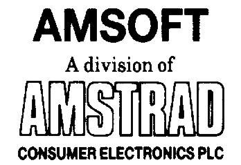

# Introducción

AMSTRAD CPC664
Sistema integrado ordenador/disco

## Quiénes somos ...

El AMSTRAD CPC664 continúa la tradición del sistema informático CPC464. La gran acogida de que ha gozado este ordenador nos ha inducido a dar el siguiente paso lógico: combinar lo mejor del CPC464 con la unidad de disco DD1, junto con muchas otras innovaciones. El sistema resultante, el CPC664, ofrece unas prestaciones y una riqueza de posibilidades que no tienen rival hoy por hoy en el mundo de los ordenadores personales.

El CPC664 está apoyado por uno de los fabricantes de productos electrónicos de gran consumo más grandes del país. Por otra parte, el club de usuarios AMSTRAD, con su revista mensual, se ha convertido ya en la principal y más fiable fuente de información y noticias.

## Disponibilidad de programas y compatibilidad...

El CPC664 puede utilizar prácticamente todos los programas escritos para el CPC464; esto significa que el usuario del CPC664 puede elegir, sin necesidad de espera alguna, entre los muchos programas publicados por AMSOFT y otras casas de software.

## ¿Por qué con discos?

Es indudable que el disco está sustituyendo al cassette como medio de almacenamiento de datos y programas, salvo quizá en el caso de los usuarios menos asiduos. No obstante, dado que la potencia y facilidad del uso del CPC464 ha convertido rápidamente muchos de esos usuarios menos asiduos en entusiastas de la informática, el 664 será el ordenador idóneo para ellos.

## Gracias a Digital Research...

La potencia del sistema operativo CP/M, de Digital Research, nunca antes ha estado disponible a precio tan asequible. Creemos que el futuro nos depara grandes novedades en programación, ahora que disponemos de un medio cuya capacidad de memoria es de 160K por cada cara. Por otra parte, el Dr. LOGO, también de Digital Research, ha llegado a convertirse en el lenguaje educativo y docente de aceptación más universal. Al combinar la inigualable facilidad de uso de los 'gráficos de tortuga' con una gran capacidad de proceso de datos, Dr. LOGO ha demostrado ser la implementación más completa de LOGO de las muchas existentes en el mercado.

## ¡Gracias a Amstrad!

Tanto CP/M como Dr. LOGO se suministran con el sistema CPC664 sin costo adicional.

## ¿Más novedades?

Al desarrollar el CPC664, hemos aprovechado la oportunidad para refinar instrucciones y añadir otras que no estaban incluidas en el BASIC del CPC464 (por ejemplo, rellenado de zonas en la pantalla, lectura de caracteres de la pantalla, conmutación del cursor, sincronización de imagen, etc.). Los programas que utilicen estas funciones no serán compatibles con el CPC464 pero, en cambio, los programas escritos para el CPC464 son utilizables en el CPC664 sin ninguna limitación.

© Copyright 1985 AMSOFT, AMSTRAD Consumer Electronics pie

El contenido de este manual y el producto en él descrito no pueden ser adaptados ni reproducidos, ni total ni parcialmente, salvo con el permiso escrito de AMSTRAD Consumer Electronics plc ('Amstrad').

El producto descrito en este manual, así como los diseñados para ser utilizados con él, están sujetos a desarrollo y mejoras continuas. Toda la información técnica relativa al producto y su utilización (incluida la que figura en este manual) es suministrada por AMSTRAD de buena fe. Admitimos, no obstante, que en este manual puede haber errores u omisiones. El usuario puede obtener una lista de correcciones y modificaciones solicitándola de AMSOFT Technical Enquiries o de sus distribuidores. Rogamos a los usuarios que rellenen y envíen a los distribuidores las tarjetas de registro y de garantía.

Rogamos también a los usuarios que rellenen y envíen la tarjeta de registro de Digital Research.

AMSOFT agradecerá el envío de comentarios y sugerencias relativos a este manual y al producto en él descrito.

Toda la correspondencia se debe dirigir a

AMSOFT

Avda. del Mediterráneo, 9 

28007 Madrid 

España

Toda reparación u operación de mantenimiento de este producto debe ser conñada a los distribuidores autorizados de AMSOFT. Ni AMSOFT ni AMSTRAD pueden aceptar ninguna responsabilidad derivada del daño o pérdida que se pueda ocasionar como resultado de reparaciones efectuadas por personal no autorizado. El objetivo de este manual no es sino servir de ayuda al usuario en la utilización del producto; por consiguiente, AMSTRAD y AMSOFT quedan eximidos de responsabilidad por el daño o pérdida a que pueda dar lugar la utilización de la información aquí publicada o la incorrecta utilización del producto.

Dr LOGO y PC/M son marcas registradas de Digital Research Inc.

Z80 es marca registrada de Zilog Inc.

IBM e IBM PC son marcas registradas de International Business Machines Inc.

AMSDOS, CPC664 y CPC464 son marcas registradas de AMSTRAD Consumer Electronics plc.

Primera edición: 1985

Compilado por Ivor Spital 

Escrito por Roland Perry, Ivor Spital, William Poel, Cliff Lawson; con la colaboración de Locomotive Software Ltd.

Traducido del inglés por Emilio Benito

Publicado por AMSOFT

Edición española producida por Vector Ediciones

AMSTRAD es marca registrada de AMSTRAD Consumer Electronics plc.

Queda estrictamente prohibido utilizar la marca y la palabra AMSTRAD sin la debida autorización.

## IMPORTANTE

Por favor, lea las siguientes ...

### Notas de instalación

1.  Conecte siempre el cable de alimentación a una clavija de tres patillas, siguiendo para ello las instrucciones que se dan en la Parte 1 del «Curso de Introducción».

2.  No intente conectar este equipo a una red de distribución de energía eléctrica que no sea de 220-240 V c.a., 50 Hz.

3.  El mantenimiento que pueda hacer el usuario no requiere en ningún caso acceder al interior de la carcasa. Así pues, no abra nunca el equipo. Confíe todas las reparaciones y operaciones de mantenimiento a personal cualificado.

4.  Para evitar la fatiga visual, ponga el monitor lo más alejado posible del teclado y trabaje con luz ambiente adecuada. Deje el control de brillo (BRIGHTNESS) del monitor lo más bajo posible.

5.  El ordenador debería estar centrado con respecto al monitor, lo más lejos posible de él. Para optimizar la fiabilidad del almacenamiento de datos, la unidad de disco no debería quedar frente al monitor, sino a su derecha. No ponga el ordenador cerca de fuentes de interferencia eléctrica.

6.  Evite que las unidades de disco y los propios discos estén sometidos a la influencia de campos magnéticos.

7.  Si tiene conectada la segunda unidad de disco, mantenga alejado el cable de datos del cable de alimentación.

8.  No obstruya ni cubra los orificios de ventilación.

9.  No utilice ni almacene el equipo a temperaturas demasiado altas ni demasiado bajas, ni en lugares húmedos ni polvorientos.

### Notas de operación

(No se preocupe si al principio le resulta extraña la terminología utilizada en esta sección; el significado de estas advertencias irá quedando más claro según avance en la lectura de este manual.)

1.  No encienda ni apague el sistema mientras haya un disco en la unidad, so pena de perder la información en él grabada.

2.  Haga copias de todos los discos que contengan datos o programas valiosos. En particular, copie el disco de CP/M que se suministra con el CPC664, pues si se deteriorase accidentalmente su sustitución sería costosa.

3.  Para evitar el riesgo de borrar accidentalmente el disco de CP/M, cerciórese de que los orificios de protección del disco estén abiertos.

4.  Si está utilizando un sistema de dos discos, es decir, si ha adquirido una unidad AMSTRAD FD1 adicional, encienda siempre la segunda unidad antes que el ordenador.

5.  No toque la superficie de los discos.

6.  No extraiga el disco mientras el ordenador no haya terminado de leer o escribir en él.

7.  Recuerde que al formatear los discos se borra su contenido anterior.

8.  El interfaz de la unidad de discos ocupa una pequeña porción de la memoria. Algunos programas publicados en cassette para el CPC464 aprovechan esa zona de la memoria, y por lo tanto no pueden funcionar en el sistema CPC664+cassette. En caso de duda sobre la compatibilidad de los programas basados en cinta, póngase en contacto con AMSOFT o con su distribuidor. Tenga en cuenta, no obstante, que casi todos los programas de AMSOFT están disponibles en disco para su utilización en el CPC664.

9.  El acuerdo de licencia para el sistema operativo CP/M (que está codificado mediante un número de serie grabado en el disco) permite su utilización en un solo ordenador. Esto significa, en particular, que al usuario le está prohibido ceder a otras personas copias de su CP/M. Lea atentamente el Acuerdo de Licencia para el Usuario Final (apéndice 1 de este manual).

# CONTENIDO
