# Capítulo 1. Curso de introducción

## Parte 1: Instalación ...

El CPC664 puede ser instalado con:

 1. El monitor de fósforo verde AMSTRAD GT65.
 
 2. El monitor de color AMSTRAD CTM644.
 
 3. O la unidad modulador/fuente de alimentación AMSTRAD MP2 conectada a un televisor de color (en UHF).

### Instalación de una clavija de red

El CPC664 sólo se puede conectar a la red de 220-240V c.a., 50 Hz. Para realizar la conexión se debe utilizar la clavija adecuada, que habrá de ser instalada en el GT65, en el CTM644 o en la unidad MP2. Cualquiera que sea el tipo de clavija, es conveniente proteger la entrada de corriente alterna con un fusible de 5 amperios.

### Importante

Los hilos del cable de alimentación tienen el siguiente código de colores:

Azul: neutro

Marrón: activo

Estos colores pueden no corresponder con los de los cables que llegan a la toma mural. El criterio de conexión debe ser, pues, el siguiente:

El hilo AZUL debe ser conectado a la masa de la toma mural (hilo que suele ser de color negro, o bien amarillo y verde).

El hilo MARRÓN debe ser conectado al activo de la toma mural.

Desenchufe la clavija de la toma mural siempre que no esté utilizando el ordenador.

No extraiga ningún tornillo ni trate de abrir la carcasa del ordenador, del monitor ni de la unidad MP2. Lea y respete las advertencias que se dan en la etiqueta de características, que está situada en la cara inferior de la carcasa del ordenador y de la fuente de alimentación, y en la cara posterior de los monitores:

WARNING! LIVE PARTS INSIDE. DO NOT REMOVE ANY SCREWS

(¡Precaución! Circuitos activos en el interior. No extraiga ningún tornillo.)


### Conexión del ordenador a un monitor

(Si va a utilizar su CPC664 con la unidad MP2, no es necesario que lea esta sección.)

1.  Cerciórese de que el monitor no está conectado a la red.

2.  Conecte el cable que sale de la cara frontal del monitor y termina en una clavija grande (DIN de 6 patillas) al zócalo posterior del ordenador marcado con **MONITOR**.

3.  Conecte el cable que sale de la cara frontal del monitor y termina en la clavija más pequeña (5V c.c.) al zócalo posterior del ordenador marcado con **5V DC**.

4.  Conecte el cable que sale de la cara posterior del ordenador y termina en una clavija pequeña (12V c.c.) al zócalo que hay en la cara frontal del monitor.

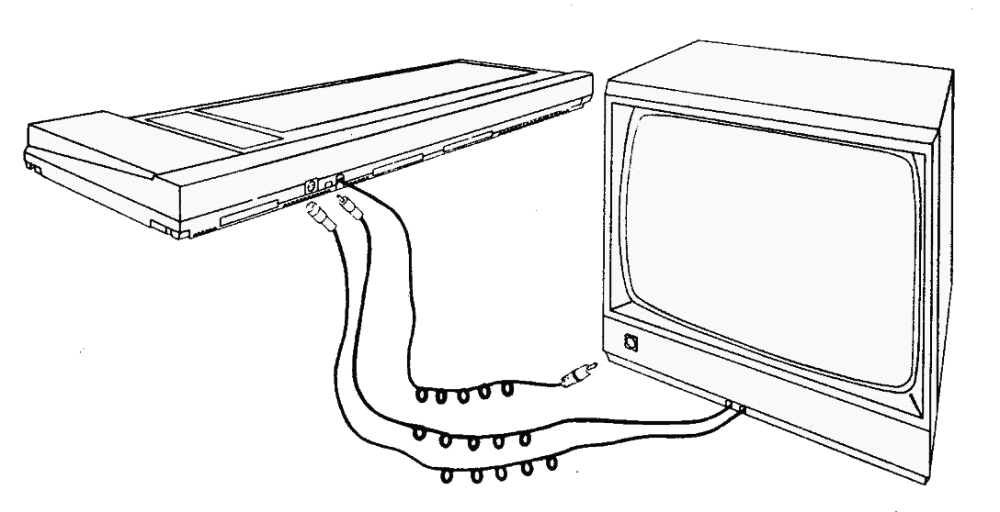


### Conexión del ordenador a la unidad modulador/fuente de alimentación MP2

La MP2 es una unidad opcional que el usuario puede querer adquirir si está utilizando actualmente el CPC664 con el monitor de fósforo verde GT65. La MP2 permite conectar el CPC664 a un televisor de color doméstico, para así disfrutar de las posibilidades de color del CPC664.

La MP2 se debe colocar inmediatamente a la derecha del CPC664.

1.  Cerciórese de que la MP2 no está conectada a la red.

2.  Conecte el cable de la MP2 que termina en una clavija grande (DIN de 6 patillas) al zócalo posterior del ordenador marcado con **MONITOR**.

3.  Conecte el cable que sale de la MP2 y termina en una clavija pequeña (5V c.c.) al zócalo posterior del ordenador marcado con **5V DC**.

4.  Conecte el cable que sale de la MP2 y termina en una clavija de antena a la entrada de antena de su televisor.

5.  Conecte el cable que sale de la cara posterior del ordenador y termina en una clavija pequeña (12V c.c.) al zócalo posterior de la MP2.


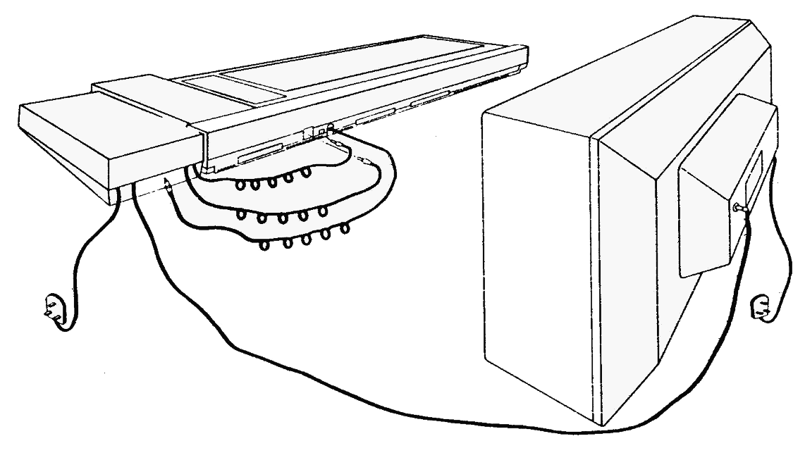

### Encendido del sistema CPC664 con GT65 o con CTM644

(Si va a utilizar su CPC664 con la unidad MP2, no es necesario que lea esta sección.)

Una vez conectado el sistema según se ha explicado en secciones anteriores, inserte la clavija de red en la toma mural. Para encender el sistema, pulse el botón **POWER** que está en la cara frontal del monitor, de modo que quede en posición «IN». Si este botón está en «OFF», el suministro de corriente al resto del sistema queda interrumpido.

Encienda el ordenador mediante el interruptor deslizante marcado con **POWER**, que está en su cara derecha.

En este momento se debe encender el piloto rojo (**ON**) que está en el centro del teclado; en el monitor se verá el siguiente mensaje:

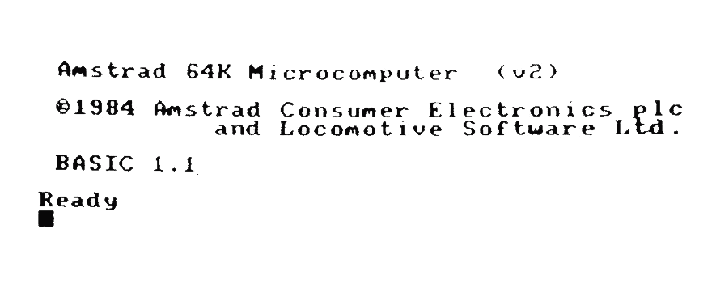


Para evitar la fatiga visual excesiva, ajuste el control marcado con **BRIGHTNESS** al mínimo necesario para que el texto se vea cómodamente, sin que deslumbre ni resulte borroso.

El control **BRIGHTNESS** se encuentra en la parte inferior de la cara frontal del monitor GT65 y en el lateral derecho del CTM644.

En el caso del GT65, puede ser necesario ajustar los controles de **CONTRAST** y **Vertical HOLD** que están en el panel frontal.

El mando de **CONTRAST** se debe poner en el mínimo compatible con la cómoda visualización de los textos.

El mando de **Vertical HOLD** está marcado con **V-HOLD** en el GT65; su ajuste debe hacer que la imagen sea estable y quede centrada en la pantalla.

### Encendido del sistema CPC664 con la unidad modulador/fuente de alimentación MP2

Una vez conectado el sistema según se ha explicado en secciones anteriores, inserte la clavija de red en la toma mural. Encienda el ordenador mediante el interruptor deslizante **POWER** que está en su lateral derecho.

En este momento se debe encender el piloto rojo (**ON**) que está en el centro del teclado. Ahora debe sintonizar el televisor para recibir las señales del ordenador.

Si su televisor tiene un selector de canales de botonera, pulse el botón correspondiente a un canal no utilizado. Ajuste el mando de sintonía siguiendo las instrucciones del manual del televisor (si dispone de un dial de sintonía, pruebe en las proximidades del canal 36) hasta obtener la siguiente imagen:


Trate de conseguir la máxima nitidez posible. El texto aparecerá en color amarillo dorado sobre fondo azul.

Si el televisor tiene un selector de canales rotatorio, gírelo hasta que pueda ver la imagen y ésta sea estable (canal 36, aproximadamente).

### Otras conexiones ...

Si desea conectar otros periféricos, tales como 

 - Joystick(s)
 - Magnetófono de cassettes 
 - Impresora
 - Segunda unidad de discos 
 - Amplificador o altavoces externos 
 - Dispositivos de expansión 
 - etc.,
  
al sistema básico, consulte la Parte 2 de este «Curso de Introducción».

Finalmente, asegúrese de que ha tenido en cuenta las advertencias que hemos hecho al principio de este manual, en la sección titulada 'IMPORTANTE':

NOTAS DE INSTALACIÓN 1, 2, 3, 4, 5, 6, 7 y 8. 

NOTA DE OPERACIÓN 1.


## Parte 2: Conexión de los periféricos ..

En esta sección vamos a explicar cómo se conectan al sistema CPC664 diversos periféricos, cuyo funcionamiento se explica en las correspondientes secciones de este manual.

### Joystick

El joystick AMSOFT modelo JY2 es un aparato opcional que el usuario puede desear adquirir si va a utilizar su CPC664 con programas de juegos diseñados para aprovechar las posibilidades de control y disparo del joystick.

Conecte el cable procedente del joystick en el zócalo marcado con **JOYSTICK** en el ordenador. El CPC664 admite dos joysticks; el segundo se conecta en el zócalo que hay en la peana del primero.

Con este ordenador se puede utilizar también el joystick AMSOFT modelo JY1. 

En secciones posteriores de este manual daremos más información sobre los joysticks.

### Magnetófono de cassettes

Los programas pueden ser leídos o grabados en cinta, en lugar de en disco. Más adelante describiremos las órdenes que indican al ordenador cuándo debe leer o enviar datos a la cinta o al disco.

Para conectar el magnetófono al ordenador se requiere el cable AMSOFT CL1, o un cable estándar equivalente.

Inserte el extremo del cable que termina en una clavija grande (DIN de 5 patillas) en el zócalo del ordenador que está marcado con **TAPE**.


Inserte la clavija en la que termina el cable azul en la hembra del magnetófono que esté marcada con **REMOTE** o **REM**.

Inserte la clavija en la que termina el cable rojo en la hembra del magnetófono que esté marcada con **MIC**, **COMPUTER IN** o **INPUT**.


Inserte la clavija en la que termina el cable blanco en la hembra del magnetófono que esté marcada con **EAR**, **COMPUTER OUT** o **OUTPUT**.

Es importante observar que el éxito en la transferencia de datos entre el CPC664 y la cinta depende en gran medida del correcto ajuste del control de **LEVEL** o de **VOLUME** del magnetófono. Si encuentra dificultad en la grabación o lectura de los programas, pruebe con diferentes posiciones del control de volumen del magnetófono hasta optimizar los resultados.

### Impresora

El CPC664 puede ser conectado a cualquier impresora de tipo Centronics. Para conectar el ordenador a la impresora AMSTRAD DMP1, basta con utilizar el cable suministrado con ésta.

Para conectar cualquier otra impresora de tipo Centronics se necesita el cable AMSOFT PL1.

Inserte el extremo del cable que termina en un conector plano en el zócalo del ordenador marcado con **PRINTER**. Inserte el otro extremo del cable, que termina en el conector de tipo Centronics, en el zócalo de la impresora. Si la impresora tiene abrazaderas de seguridad, fíjelas en las ranuras que hay en los laterales del conector.

Más adelante daremos información sobre el manejo de la impresora.

### Segunda unidad de disco (AMSTRAD FD1)

La unidad AMSTRAD FD1 se puede incorporar al sistema como segunda unidad de disco. Las ventajas de disponer de dos unidades serán particularmente evidentes para el usuario habitual de CP/ M, pues muchos programas están diseñados para funcionar con el disco de programas en una unidad y los ficheros de datos en la otra.

El sistema operativo CP/M siempre requiere que los programas se carguen desde el disco (no permite el acceso a la ROM de BASIC). CP/M permite acceder a ficheros múltiples mediante una técnica de recubrimiento que hace posible la ejecución de programas que de otra forma no cabrían en la RAM; pero en muchas ocasiones el disco de programas contiene tantos, que prácticamente no queda espacio para los ficheros de datos.

Gracias a la versatilidad de los programas de ayudas suministrados con el disco del sistema, todas las operaciones de mantenimiento de ficheros (copia, borrado, etc.) se pueden realizar con una sola unidad de disco. Sin embargo, la segunda unidad facilita y acelera estos procesos, y reduce notablemente el riesgo de accidentes.


Para conectar la unidad FD1 al CPC664 se requiere el cable AMSOFT DI2.

Inserte el conector plano en el zócalo del ordenador que está marcado con **DISC DRIVE 2**.

Inserte el otro conector del cable en el zócalo de la unidad FD1.

**NO OLVIDE** que, antes de encender o apagar la segunda unidad de disco, debe extraer los discos que pueda haber en ambas unidades y apagar el sistema. Si se modifica alguna conexión mientras el sistema está encendido, lo más probable es que se pierda o altere el programa actualmente residente en la memoria. Tenga la precaución de grabar el programa antes de modificar las conexiones de los periféricos.

Si tiene conectada una FD1 al CPC664, encienda **primero** la FD1 con el interruptor deslizante que está en el panel posterior; **después** encienda el CPC664 con el interruptor deslizante que está en la cara derecha del ordenador. Deberán iluminarse los dos pilotos, rojo y verde, de la FD1; esto indicará que la segunda unidad de disco está preparada para su uso.

Más adelante explicaremos el funcionamiento de la segunda unidad de disco.

### Amplificador y altavoces externos

El CPC664 puede ser conectado a un sistema de amplificador y altavoces estereofónicos, única forma de apreciar plenamente las capacidades sonoras del ordenador.

El cable de entrada al amplificador debe terminar en una clavija estéreo de 3.5 mm, que se inserta en la hembra marcada con **STEREO** en el ordenador.

Las conexiones de la clavija deben ser las siguientes:

 - Extremo de la clavija: canal izquierdo. 
 - Anillo interno: canal derecho. 
 - Cuerpo de la clavija: masa.

El CPC664 entrega a la salida **STEREO** una señal de nivel constante; así pues, el volumen, el balance y el tono deben ser regulados con los mandos del amplificador externo.

También se pueden conectar auriculares de alta impedancia, aunque el volumen no podrá ser regulado por el mando de **VOLUME** del ordenador. Los auriculares de baja impedancia, que son los habitualmente utilizados con los equipos de alta fidelidad, no se pueden conectar directamente al ordenador.

Más adelante explicaremos cómo enviar sonidos a cada uno de los tres canales del CPC664.


### Dispositivos de expansión

Al ordenador CPC664 se le pueden conectar diversos dispositivos de expansión (interfaz serie, modem, lápiz fotosensible, ROMs, etc.) por medio del zócalo marcado con **EXPANSION** que está en la cara posterior del ordenador.

También se puede conectar en ese zócalo el amplificador/sintetizador de voz AMSOFT modelo SSA2.

Las conexiones del zócalo **EXPANSION** se describen en el capítulo titulado 'Para su información...'

Finalmente, antes de proseguir, asegúrese de que ha tenido en cuenta las advertencias que hemos hecho al principio de este manual, en la sección titulada 'IMPORTANTE':

NOTAS DE INSTALACIÓN 6 y 7 
NOTAS DE OPERACIÓN 4 y 8


## Parte 3: En cuanto a los discos ...

El AMSTRAD CPC664 usa discos compactos de 3 pulgadas. Le sugerimos que no corra riesgos indebidos y que, para garantizar la fiabilidad de la transferencia de datos del ordenador a discos, utilice solamente los discos AMSOFT CF2. Puede, no obstante, utilizar también los de otras marcas de máxima garantía.

### Inserción

Se pueden utilizar las dos caras del disco, aunque no simultáneamente. La forma correcta de insertar los discos es con la etiqueta hacia fuera (visible) y con la cara que se va a usar hacia arriba:

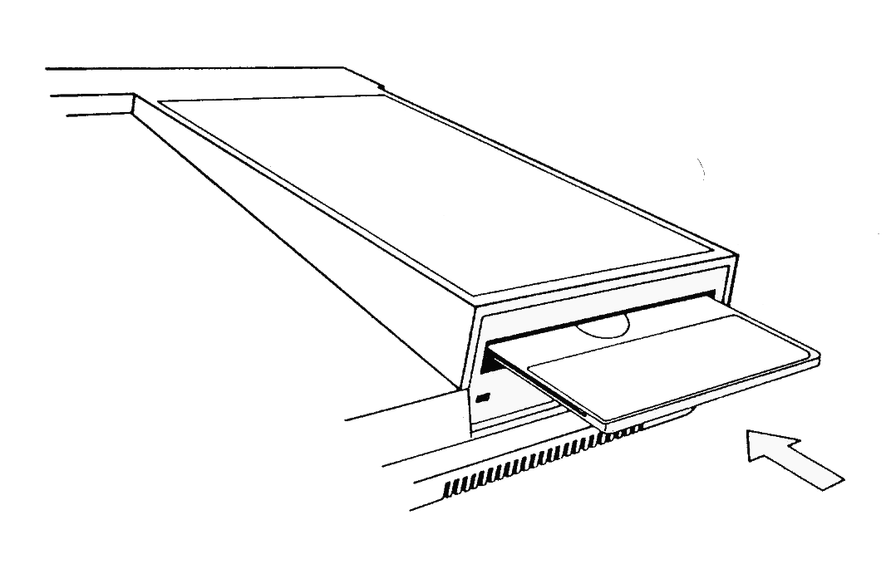

### Protección contra escritura

En el extremo posterior izquierdo de cada cara del disco se puede ver una flecha que señala un pequeño orificio obturado: es el orificio de 'protección contra escritura', cuya misión es evitar el borrado accidental del contenido del disco:


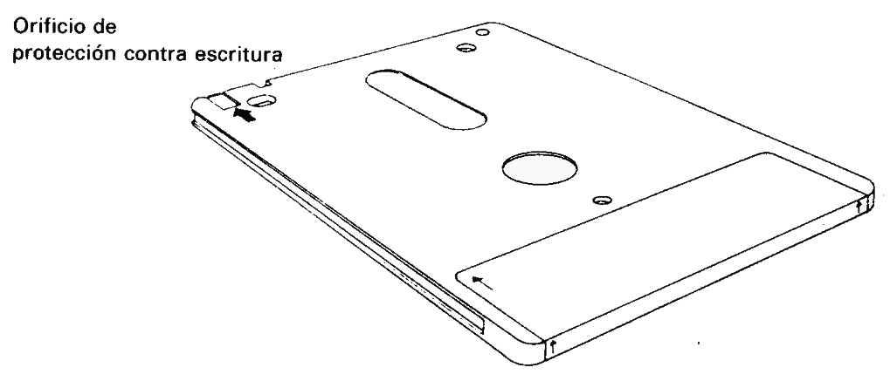

Cuando el orificio está cerrado, el ordenador puede 'escribir' en el disco. En cambio, si el orificio está abierto, el disco está protegido contra el borrado accidental de programas o datos valiosos.

Los diversos fabricantes utilizan diferentes mecanismos de apertura y cierre del orificio. En los discos AMSOFT CF2 el funcionamiento es como sigue:
Para abrir el orificio, haga deslizar el pequeño obturador situado en la esquina izquierda del disco:

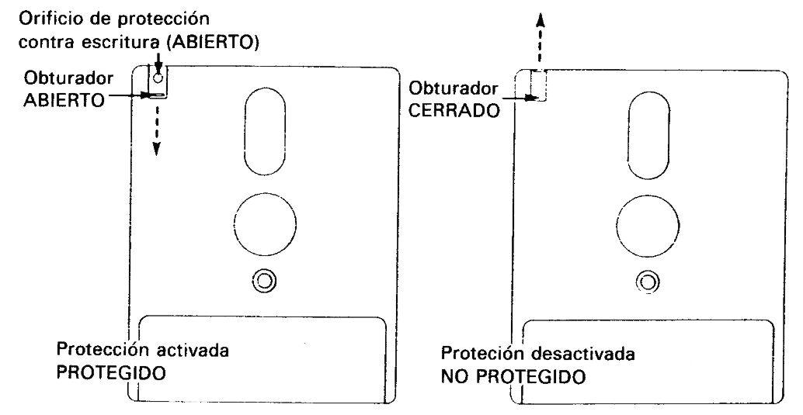


Para cerrar el orificio, haga deslizar el obturador en sentido contrario.

En algunos discos compactos el mecanismo consiste en una pequeña palanca de plástico situada en una ranura que tienen en la esquina izquierda:

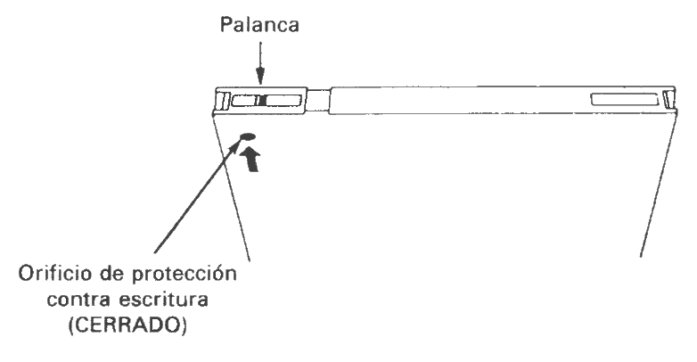

Para abrir el orificio en los discos de este tipo, desplace la palanca hacia el centro del disco, ayudándose con la punta de un bolígrafo u objeto similar:

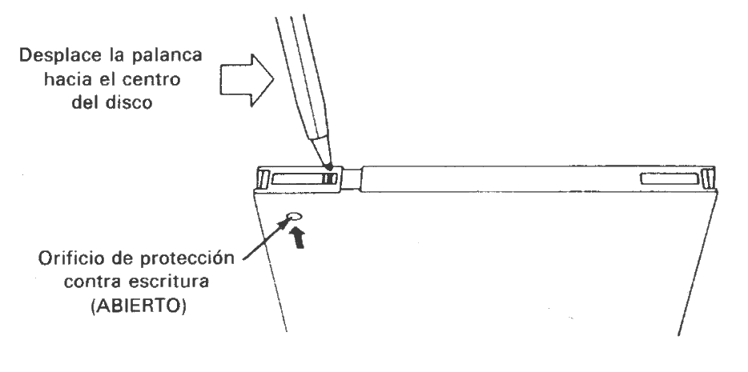

Observe que, cualquiera que sea el mecanismo de obturación, el efecto es siempre el mismo: el disco queda protegido cuando el orificio está abierto.

**IMPORTANTE**

Cerciórese de que los orificios de protección de su disco maestro de CP/M están abiertos.

### Después de introducido el disco

En la cara frontal de la unidad de disco hay un piloto rojo y un botón de eyección:

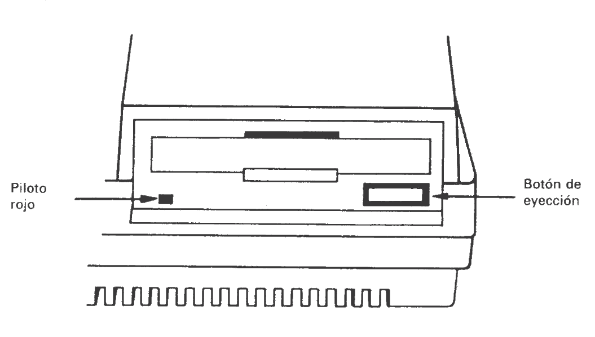

### Piloto

Cuando está encendido, indica que el ordenador está leyendo datos del disco o escribiendo en él.

Si se ha conectado una segunda unidad de disco (unidad B), su piloto estará encendido constantemente, y se apagará cuando se encienda el de la unidad principal (unidad A).

### Botón de eyección

Al pulsar este botón se expulsa parcialmente el disco, lo que permite que el usuario lo extraiga.

Finalmente, antes de proseguir asegúrese de que ha tenido en cuenta las advertencias que hemos hecho al principio de este manual, en la sección titulada 'IMPORTANTE':

NOTAS DE OPERACIÓN 1, 3, 4, 5 y 6

## Parte 4: Manos al teclado ...

Antes de empezar a cargar y grabar programas necesitamos familiarizarnos con algunas teclas del ordenador. Si tiene usted alguna experiencia en el manejo de los ordenadores, puede omitir la lectura de esta sección.

Encienda el ordenador y verá el mensaje inicial en la pantalla. Vamos a explicar las funciones de diversas teclas:

### ← → ↑ ↓ TECLAS DE MOVIMIENTO DEL CURSOR

Las cuatro teclas que están marcadas con sendas flechas (y situadas junto a la tecla **[COPY]**) son las 'teclas de movimiento del cursor'. Estas teclas sirven, pues, para mover el cursor por la pantalla.

Púlselas todas ellas y practique hasta familiarizarse con su funcionamiento. 


### [ENTER]

Hay dos teclas **[ENTER]**. Ambas sirven para introducir en el ordenador lo que usted ha tecleado. Una vez pulsada la tecla **[ENTER]**, el cursor salta automáticamente a la línea siguiente de la pantalla. Siempre que teclee una orden directa o una instrucción de programa, pulse **[ENTER]** al final.
De ahora en adelante escribiremos **[ENTER]** para indicar que se debe pulsar esta tecla al terminar de teclear órdenes o instrucciones de programa.

### [DEL]

Esta tecla sirve para borrar el carácter (letra, número o signo) que está a la izquierda del cursor.

Teclee **abcd** y observe que el cursor queda inmediatamente a la derecha de la letra **d**. Para borrar la **d**, pulse la tecla **[DEL]**. Si la mantiene pulsada durante algún tiempo, verá cómo se borran también las otras tres letras.

### [SHIFT]

Hay dos teclas **[SHIFT]**, una a cada lado del teclado. Si mantiene pulsada una de ellas al tiempo que pulsa una tecla literal (de letras), en la pantalla aparecerá la correspondiente letra *en mayúscula*.

Teclee la letra **e**, pulse la tecla **[SHIFT]** y, antes de soltarla, vuelva a teclear la **e**. En la pantalla verá lo siguiente:

```
eE
```

Teclee ahora unos cuantos espacios (manteniendo pulsada durante algún tiempo la barra espaciadora). Para probar el efecto de **[SHIFT]** con las teclas numéricas, teclee el **2**, pulse **[SHIFT]** y, sin soltarla, vuelva a teclear el **2**. En la pantalla aparecerá lo siguiente:

```
2"
```

Haga prueba con las diferentes teclas de caracteres para observar su efecto con y sin **[SHIFT]**.

### [CAPS LOCK]

Su efecto es en cierto modo similar al de **[SHIFT]**. Con sólo pulsarla una vez, las letras que se escriban a continuación aparecerán en mayúsculas en la pantalla, pero, en cambio, las teclas numéricas y de signos no resultan afectadas.

Pulse **[CAPS LOCK]** una sola vez y luego teclee lo siguiente:

```
abcdef123456 
```

En la pantalla aparecerá lo siguiente: 

```
ABCDEF123456
```

Observe que las letras han sido convertidas a mayúsculas y que, sin embargo, los números no han sido convertidos a los signos que están grabados en la parte superior de las teclas numéricas. Para obtener estos signos, pulse la tecla correspondiente en combinación con **[SHIFT]**. Escriba ahora lo siguiente, manteniendo pulsada la tecla **[SHIFT]**:

```
abcdef123456
```

En la pantalla aparecerá:

```
ABCDEF!"#$%&
```

Para volver a caracteres normales (en minúscula), pulse por segunda vez **[CAPS LOCK]**.

Si lo que desea es obtener letras mayúsculas y los signos marcados en la parte superior de las teclas, sin tener que mantener pulsada la tecla **[SHIFT]**, puede hacer lo siguiente: mantenga pulsada la tecla **[CTRL]** y pulse **[CAPS LOCK]** una sola vez. Para comprobar el efecto de esta combinación, teclee lo siguiente:

```
abcdef123456
```

En la pantalla aparecerá:

```
ABCDEF!"#$%&
```

En esta situación, se pueden escribir números utilizando el teclado numérico que está a la derecha del teclado principal.

Manteniendo pulsada la tecla **[CTRL]** al tiempo que se pulsa **[CAPS LOCK]** se vuelve al modo anterior (es decir, a minúsculas o a bloqueo de mayúsculas). Si el modo al que ha vuelto es a bloqueo de mayúsculas, pulse **[CAPS LOCK]** para retornar al modo normal, esto es, a minúsculas.

### [CLR]

Esta tecla borra el carácter que está bajo el cursor.

Escriba **ABCDEFGH**. El cursor ha quedado a la derecha de la última letra (la H). Pulse cuatro veces la tecla **←**. El cursor se ha movido cuatro posiciones hacia la izquierda, de modo que está superpuesto a la letra **E**.

Observe que la letra **E** es visible a través del cursor. Pulse **[CLR]** y observe cómo desaparece la letra **E** y cómo se mueven hacia la izquierda las letras **FGH**; bajo el cursor queda la **F**. Pulse durante unos instantes **[CLR]**: primero desaparece la **F**, y luego la **G** y la **H**.

### [ESC]

Esta tecla se utiliza para abandonar una función que el ordenador esté realizando. Si se pulsa **[ESC]** una vez, el ordenador interrumpe su tarea momentáneamente, y la reanuda si a continuación se pulsa cualquier otra tecla.

Si se pulsa **[ESC]** dos veces seguidas, el ordenador abandona definitivamente la tarea que está realizando y queda a la espera de otras órdenes.

### Importante

Cuando se han tecleado 40 caracteres en una línea, el cursor está en el extremo derecho de ella; el siguiente carácter aparecerá automáticamente al principio de la línea siguiente. Esto significa que **no se debe pulsar [ENTER]**, a diferencia de lo que se haría si se estuviera trabajando con una máquina de escribir, en la que se ha de teclear el retorno del carro al acercarse al final de cada línea.

El ordenador realiza esta función automáticamente; ante un **[ENTER]** indebido, reaccionará con un mensaje de error, generalmente **Syntax error**, bien en el acto o bien más tarde, cuando se ejecute el programa.

### Syntax error (error de sintaxis)

Cuando en la pantalla aparece el mensaje **Syntax error**, el ordenador está diciendo que no ha entendido la orden que se le ha dado.

Por ejemplo, escriba

```
printt [ENTER]
```

En la pantalla aparecerá el mensaje:

```
Syntax error
```

Esto ocurre porque el ordenador no entiende la instrucción **printt**. 

Si el mismo error se comete en una línea de programa, tal como

```
10 printt "abc" [ENTER]
```

el mensaje **Syntax error** no aparece hasta que se ejecute el programa. Teclee:

```
run [ENTER]
```

(Esta orden pide al ordenador que ejecute el programa que tiene en este momento almacenado en la memoria.) En la pantalla aparece:

```
Syntax error in 10 
10 printt "abc"
```

Este mensaje indica en qué línea se ha detectado el error y exhibe la línea con el cursor ya preparado para que el usuario pueda corregirla.

Lleve el cursor, con la tecla hasta una letra **t** de **printt**. Pulse **[CLR]** para borrar la **t** que sobra y luego pulse **[ENTER]** para introducir la línea corregida en el ordenador.

Teclee ahora:

```
run [ENTER]
```

El ordenador ha entendido la instrucción; de hecho, ha escrito en la pantalla:

```
abc
```

Finalmente, asegúrese de que ha tenido en cuenta las advertencias que hemos hecho al principio de este manual, en la sección titulada 'IMPORTANTE':

NOTAS DE INSTALACIÓN 4 y 5 

NOTA DE OPERACIÓN 1


## Parte 5: Carga de programas ...

Vamos a hacer una demostración de lo rápida que es la carga de programas grabados en disco. Encienda el equipo, inserte el disco maestro de CP/M con la cara 1 hacia arriba y teclee lo siguiente:

```
run "rointime.dem" [ENTER]
```

Al cabo de unos segundos el programa habrá quedado cargado en la memoria del ordenador. Responda a la pregunta de si está utilizando un monitor de fósforo verde (teclee Y para 'sí', o N para 'no') y podrá ver una demostración del juego 'Roland in Time' en la pantalla. Quizá se anime a comprarlo.

Cuando haya terminado de ver la demostración, puede 'escapar' del programa de la siguiente forma: pulse las teclas **[CTRL]** y **[SHIFT]** y, antes de soltarlas, pulse **[ESC]**. Esta acción reinicializa por completo la máquina; llévela a cabo siempre que quiera volver a la situación en que se encuentra la máquina cuando acaba de encenderla. (Cuando se reinicializa el ordenador de esta forma, no es necesario extraer el disco que pueda haber en la unidad.)

Si el programa no se ha cargado normalmente, estudie el mensaje que ha aparecido en la pantalla para averiguar qué ha ocurrido. Por ejemplo,

```
Drive A: disc missing 
Retry, Ignore or Cancel?
```

significa que no ha insertado el disco, o que no lo ha hecho correctamente, o quizá que lo ha puesto en la unidad B.

```
ROINTIME.DEM not found
```

significa que no ha puesto el disco correcto, o que ha puesto la cara 2, o que no ha tecleado correctamente el nombre del programa, ROINTIME.DEM.

Si aparece el mensaje 

```
Bad command
```

lo más probable es que haya tecleado mal ROINTIME.DEM, quizá incluyendo un espacio o un signo de puntuación.

```
Type mismatch
```

significa que ha omitido las comillas (").

```
Syntax error
```

indica que ha tecleado incorrectamente la orden **run**.

El mensaje

```
Drive A: read fail 
Retry, Ignore or Cancel?
```

indica que el ordenador no ha conseguido leer los datos grabados en el disco. Compruebe que el disco que ha insertado es el correcto y pulse **R** (de **Retry**, "volver a intentarlo"). Éste es el mensaje que aparece siempre que se ha estropeado un disco por dejarlo dentro de la unidad al apagar o encender el sistema.

Cuando hayamos explicado cómo hacer copias de los discos, copie sistemáticamente todos los programas valiosos, en particular el disco maestro de CP/M.

## Carga de programas AMSOFT

Esperamos haberle abierto el apetito, así que vamos a cargar un juego.

Inserte en la unidad un disco de juegos y teclee

```
run "disc" IENTER]
```

Al cabo de unos segundos el juego estará cargado y en marcha. Si teclea **run"disc"** con el disco maestro de CP/M instalado en la unidad, podrá ver y oír el programa de demostración 'Welcome'.

Cuando haya terminado de ver 'Welcome', reinicialice el ordenador mediante las teclas **[CTRL]**, **[SHIFT]** y **[ESC]**.

La orden descrita (**run"disc"**) sirve para cargar casi todos los programas de AMSOFT grabados en disco, aunque en ocasiones habrá que teclear algo distinto. En todo caso, las instrucciones de carga están impresas en la etiqueta del disco; sígalas siempre escrupulosamente.

Para terminar, asegúrese de que ha tenido en cuenta las advertencias que hemos hecho al principio de este manual, en la sección titulada 'IMPORTANTE':

NOTA DE INSTALACIÓN 6

NOTAS DE OPERACIÓN 1, 5 y 6


## Parte 6: Empecemos a trabajar ...

A estas alturas ya sabemos qué podemos y qué no podemos hacer con el ordenador, así como la forma de conectarle periféricos. Sabemos para qué sirven algunas teclas del ordenador y cómo cargar programas. Ahora vamos a ver algunas de las órdenes e instrucciones que usted puede teclear para que empiecen a ocurrir cosas ... .

Al ordenador le ocurre lo que a los humanos: sólo puede entender instrucciones que se le dan en un lenguaje que conozca. En el caso del ordenador, ese lenguaje es BASIC (siglas de *Beginners' All-purpose Symbolic Instruction Code*, "código de instrucciones simbólicas de uso general para principiantes"). Las palabras del vocabulario de BASIC son las llamadas "palabras clave", "palabras reservadas" o "palabras de instrucción". Cada una de ellas ordena a la máquina que realice una determinada función. Todos los lenguajes tienen sus reglas gramaticales, y BASIC no es la excepción. En informática, el concepto de gramática se reduce al de 'sintaxis'; de ahí que el ordenador tenga la amabilidad de decirnos de vez en cuando que hemos cometido un error de sintaxis: **Syntax error**.

### Introducción a las palabras clave del BASIC del AMSTRAD

En un capítulo posterior, titulado 'Lista completa de las palabras clave del BASIC del ASMTRAD CPC664', daremos una descripción de todas las palabras del dialecto de BASIC que entiende este ordenador. En esta sección vamos a presentar sólo las que se utilizan con mayor frecuencia.

#### CLS

Para borrar la pantalla escriba: 

```
cls [ENTER]
```

Como puede observar, la pantalla efectivamente se borra y en su extremo superior izquierdo aparecen la palabra Ready y el cursor ■.

Para introducir palabras clave de BASIC valen tanto las letras mayúsculas como las minúsculas.


#### PRINT

Esta instrucción sirve para hacer que el ordenador escriba en la pantalla caracteres sueltos, palabras completas, frases o números. Teclee la siguiente instrucción:

```
print "hola" [ENTER]
```

En la pantalla puede ver:

```
hola
```

Las comillas " " indican al ordenador qué es lo que debe escribir. La palabra **hola** apareció en la pantalla en cuanto se pulsó [ENTER]. Teclee

```
cls [ENTER]
```

para borrar la pantalla.

#### RUN

En el ejemplo anterior hemos visto cómo obedece el ordenador una *orden directa*. Pero esto no siempre es deseable, ya que el ordenador olvida la orden inmediatamente después de ejecutarla. Podemos almacenar en la memoria del ordenador una sucesión de instrucciones para que más tarde sean ejecutadas en un orden determinado. Tal sucesión de instrucciones constituirá un *programa*. Las instrucciones de BASIC que podemos incluir en un programa tienen la forma que hemos visto, pero van precedidas de un *número de línea*. Si el programa consta de más de una instrucción, los números de línea indican al ordenador en qué orden debe ejecutarlas. Cuando después de teclear una línea de instrucción se pulsa **[ENTER]**, la línea queda almacenada en la memoria hasta que pidamos al ordenador que ejecute el programa. Escriba lo siguiente:

```
10 print "hola" [ENTER]
```

Observe que en este caso, aunque ha pulsado **[ENTER]**, la palabra **hola** no ha aparecido en la pantalla, sino que ha quedado almacenada en la memoria del ordenador, incluida en la línea de programa. Para ejecutar este pequeño programa debemos dar al ordenador la orden directa run. Escriba

```
run [ENTER]
```

Ahora sí aparece la palabra **hola** en la pantalla.

Observe algo interesante: en lugar de escribir la palabra **print** completa, basta con teclear el signo de interrogación **?**; por ejemplo,

```
10 ? "hola" [ENTER]
```

#### LIST

Cuando se tiene un programa almacenado en la memoria, se puede comprobar su contenido haciendo un "listado". Escriba

```
list [ENTER]
```

En la pantalla aparece

```
10 PRINT "hola"
```

que es la única línea de nuestro programa.

Observe que ahora la palabra **PRINT** está en mayúsculas. Esto nos indica que el ordenador ha reconocido **PRINT** como palabra clave de BASIC.

Escriba **cls [ENTER]** para borrar la pantalla. Compruebe que, aunque se ha borrado el texto que había en la pantalla, el programa sigue estando en la memoria del ordenador.

#### GOTO

Esta instrucción pide al ordenador que salte de la línea actual a la línea especificada, para no ejecutar un grupo de instrucciones, si el salto es hacia delante, o para formar un bucle, si el salto es hacia atrás. Escriba

```
10 print "hola" [ENTER] 
20 goto 10 [ENTER]
```

y luego

```
run [ENTER]
```

Como puede ver, el ordenador escribe repetidamente la palabra **hola**, a la izquierda de la pantalla, saltando cada vez a la línea siguiente. La razón es que, al llegar a la línea 20, la instrucción **goto 10** reenvía el programa a la línea 10.

Para detener el programa, pulse **[ESC]** una vez. Para reanudarlo, pulse cualquier otra tecla. Para detenerlo definitivamente, de forma que se puedan introducir otras instrucciones, pulse **[ESC]** dos veces.

Escriba ahora

```
cls [ENTER]
```

para borrar la pantalla.

Para inhibir el salto a la línea siguiente de la pantalla cada vez que el ordenador escriba **hola**, teclee nuevamente el programa anterior, pero poniendo ahora un signo de punto y coma (;) al final de las comillas:

```
10 print "hola"; [ENTER] 
20 goto 10 [ENTER] 
run [ENTER]
```

El punto y coma indica al ordenador que debe escribir el siguiente grupo de caracteres inmediatamente a la derecha del anterior (suponiendo que quepan en la misma línea).

Para detener este programa pulse [ESC] dos veces. Escriba otra vez el mismo programa, pero poniendo una coma (,) en lugar del punto y coma (;):

```
10 print "hola", [ENTER] 
run [ENTER]
```

Como puede observar, la coma ha indicado al ordenador que escriba el siguiente grupo de caracteres 13 posiciones a la derecha del lugar en que empezó a escribir el anterior. Esta función es útil cuando se quiere visualizar información en columnas. No obstante, si el número de caracteres del grupo es mayor que 12, la escritura empezará otras 13 posiciones más a la derecha, de forma que entre columnas siempre quedará algún espacio.

Este número, 13, es modificable con la instrucción **ZONE**, que describiremos más adelante.

Para detener este programa, pulse **[ESC]** dos veces. Para borrar completamente la memoria del ordenador, pulse las teclas **[CTRL]** y **[SHIFT]** y, antes de soltarlas, pulse **[ESC]**,

#### INPUT

Esta instrucción hace que el ordenador quede a la espera de que el usuario introduzca información por el teclado; por ejemplo, en respuesta a alguna pregunta.

Escriba lo siguiente:

```
10 input "cuantos años tienes";edad [ENTER] 
20 print "pues no aparentas tener";edad;"años." [ENTER] 
run [ENTER]
```

**Nota de la revisión 2025:** El CPC664 no permite la letra "ñ", así que es necesario buscar una forma alternativa de escribir la palabra "años" (por ejemplo, "anios", o "anyos", o "agnos"):

```
10 input "cuantos anios tienes";edad [ENTER] 
20 print "pues no aparentas tener";edad;"anios." [ENTER] 
run [ENTER]
```

En la pantalla aparece la pregunta:

```
cuantos años tienes?
```

Escriba su edad y pulse **[ENTER]**, Si, por ejemplo, su edad es 18 años, el programa escribe lo siguiente:

```
pues no aparentas tener 18 años.
```

Este ejemplo ilustra la utilización de **input** combinada con una variable numérica. Hemos puesto la palabra **edad** al final de la línea 10, y por consiguiente en la memoria, para que el ordenador pueda asociarla al número que el usuario introduzca; después, en la línea 20, en lugar de **edad** escribirá ese número. Nada nos obligaba a elegir precisamente ese nombre, **edad**, y podíamos haber utilizado una letra cualquiera, por ejemplo, **b**.

Reinicialice el ordenador para borrar la memoria (teclas **[CTRL]**, **[SHIFT]** y **[ESC]**). Si queremos captar por el teclado una respuesta que esté formada por caracteres cualesquiera (letras solas o letras mezcladas con números), debemos poner el signo de dólar (**\$**) al final del nombre de la variable. Las variables de este tipo son las que denominamos **variables literales**.

Escriba el siguiente programa (observe que en la línea 20 hay que poner un espacio después de la "coma" de **hola,** y otro antes de la **"y"** de **yo**):

```
10 input "como te llamas";nombre$ [ENTER] 
20 print "hola, ";nombre$;", yo me llamo Rolando" [ENTER] 
run [ENTER]
```

En la pantalla puede ver:

```
como te llamas?
```

Escriba su nombre y luego pulse **[ENTER]**, Si el nombre introducido es, por ejemplo, **Manolo**, el programa escribe:

```
hola, Manolo, yo me llamo Rolando
```

En este caso hemos usado **nombre\$** como nombre de la variable literal, pero perfectamente podríamos haber elegido una letra cualquiera, por ejemplo **a$**. Vamos a combinar los dos ejemplos anteriores en un solo programa.

Reinicialice la máquina con **[CTRL]**, **[SHIFT]** y **[ESC]**. Teclee lo siguiente:

```
5 cls [ENTER]
10 input "como te llamas";a$ [ENTER] 
20 input "cuantos años tienes";b [ENTER] 
30 print "desde luego, ";a$;", no aparentas tener ";b; "años" [ENTER] 
run [ENTER]
```

En este programa hemos utilizado dos variables: **a\$** para representar el nombre y **b** para representar la edad. En la pantalla aparece la primera pregunta:

```
como te llamas?
```

Escriba su nombre (supongamos que es Manolo) y luego pulse **[ENTER]**. El ordenador le pregunta ahora:

```
cuantos años tienes?
```

Escriba su edad (supongamos que es 18 años) y luego pulse **[ENTER]**.

Si lo que hemos supuesto es cierto, en la pantalla aparecerá la siguiente frase:

```
desde luego, Manolo, no aparentas tener 18 años
```

#### Edición de programas

Si alguna de las líneas del programa anterior hubiera sido mecanografiada incorrectamente, lo que podría provocar el mensaje de error **Syntax error** o algún otro, en lugar de escribirla de nuevo es posible corregirla ("editarla" es como se dice en informática). Para ilustrar cómo hacerlo, vamos a escribir incorrectamente el programa:

```
5 clss [ENTER]
10 input "como t llamas";a$ [ENTER] 
20 input "cuantos años tienes";b [ENTER] 
30 print "desde luego,";a$;", no aparentas tener";b;"años" [ENTER]
```

En este programa hay tres errores:

 - En la línea 5 hemos escrito **clss** en lugar de **cls**. 
 - En la línea 10 hemos escrito **t** en lugar de **te**.
 - En la línea 30 olvidamos poner un blanco entre la coma y el signo de cerrar comillas.


Hay tres métodos para corregir un programa. El primero consiste en escribir nuevamente la línea errónea. Al hacerlo, la línea nueva sustituye a la que había en la memoria con el método número.

El segundo es el "método del cursor de edición".

El tercero es el "método del cursor de copia".

#### Método del cursor de edición

Vamos a corregir el error de la línea 5. Escriba lo siguiente:

```
edit 5 [ENTER]
```

En la pantalla aparece la línea 5, por debajo de la 30, con el cursor situado sobre la **c** de **cls**.

Para suprimir la **s** que sobra, pulse la tecla de movimiento del cursor → hasta que éste quede sobre la última **s** de **clss**; pulse la tecla **[CLR]** y observe cómo desaparece la **s**.

A continuación pulse [ENTER] para introducir la versión corregida de la línea 5 en la memoria. Escriba

```
list [ENTER]
```

y comprobará que la línea ha quedado corregida.

La orden **AUTO**, que describiremos más adelante en este manual, se puede combinar con este método para corregir un grupo de líneas sucesivas.

#### Método del cursor de copia

El cursor de copia es un segundo cursor, distinto del que puede ver en este momento en la pantalla, que aparece cuando se pulsa **[SHIFT]** en combinación con alguna de las teclas de movimiento del cursor. De esta forma, el cursor de copia se separa del cursor ordinario y puede ser llevado a cualquier lugar de la pantalla.

Para corregir los errores de las líneas 10 y 30, pulse la tecla **[SHIFT]** y, sin soltarla, pulse ↑ hasta llevar el cursor de copia al principio de la línea 10. Como puede ver, el cursor principal no se ha movido, por lo que hay dos cursores en la pantalla. Ahora pulse varias veces **[COPY]** hasta que el cursor de copia esté sobre el espacio que hay entre la **t** y la palabra **llamas**. Observe que el principio de la línea 10 ha sido copiado en la última línea de la pantalla y que el cursor principal se ha detenido en la misma columna que el de copia. Escriba la letra **e**, que aparecerá solamente en la línea inferior.

El cursor ordinario se ha movido, pero el de copia se ha quedado donde estaba. Pulse ahora **[COPY]** hasta completar la copia de la línea 10. Pulse **[ENTER]** para transferir esta versión de la línea 10 a la memoria. El cursor de copia desaparece y el cursor ordinario queda por debajo de la nueva línea 10.

Para corregir el otro error, mantenga pulsada la tecla **[SHIFT]** y lleve el cursor de copia con la tecla ↑ hasta el principio de la línea 30. Pulse **[COPY]** hasta que el cursor de copia quede sobre las comillas que siguen a la coma. Pulse la barra espaciadora una vez, con lo que se inserta un espacio en la línea nueva. Pulse **[COPY]** y no la suelte hasta que haya terminado de copiar el resto de la línea 30; pulse entonces **[ENTER]**.

Compruebe que el programa ha quedado correctamente almacenado en la memoria escribiendo:

```
list [ENTER]
```

*Nota*. Para llevar el cursor (durante el proceso de edición) al principio o al final de una línea, pulse la tecla ← o la → una vez manteniendo pulsada al mismo tiempo la tecla **[CTRL]**.

Reinicialice el ordenador con las teclas **[CTRL]**, **[SHIFT]** y **[ESC]**.

#### IF

Las palabras clave **IF** (si) y **THEN** (entonces) se combinan para hacer que el ordenador realice una determinada acción en función del resultado de una comprobación especificada. Por ejemplo, en la instrucción

```
if 1+1=2 then print "correcto" [ENTER]
```

el ordenador comprueba si es cierto que 1+1=2 y obra en consecuencia.

La palabra clave **ELSE** (si no) da un segundo curso de acción para el caso de que la comprobación dé como resultado "falso" (o sea, que la condición no se cumpla). Por ejemplo,

```
if 1+1=0 then print "correcto" else print "falso" [ENTER]
```

Vamos a ampliar nuestro programa anterior con la instrucción IF ... THEN. Teclee lo siguiente:

```
5 cls [ENTER]
10 input "como te llamas";a$ [ENTER]
20 input "cuantos años tienes";edad [ENTER]
30 if edad < 13 then 60 [ENTER]
40 if edad < 20 then 70 [ENTER]
50 if edad > 19 then 80 [ENTER]
60 print "Bueno, ";a$;", todavia no eres un adolescente a los";edad; "años":end [ENTER]
70 print "Bueno, ";a$;", a tus"; edad; "años eres un adolescente":end [ENTER] 
80 print "Que le vamos a hacer, ";a$;", ya no eres un adolescente a tus";edad;"años" [ENTER]
```

**Nota de la revisión 2025:** El CPC664 no permite la letra "ñ", así que es necesario buscar una forma alternativa de escribir la palabra "años" (por ejemplo, "anios", o "anyos", o "agnos"):


(Observe que hemos introducido dos símbolos nuevos: <, que significa 'menor que' y está junto a la tecla de la M, y >, que significa 'mayor que' y está junto a la tecla de <.) Para comprobar que el programa ha quedado correctamente introducido escriba

```
list [ENTER]
```

y a continuación

```
run [ENTER]
```

Responda a las preguntas que le haga el ordenador y vea qué ocurre.

En este ejemplo puede observar el efecto de la instrucción **IF ... THEN**. También hemos introducido una palabra clave nueva: **END** (fin); su efecto es concluir la ejecución del programa. Si no estuviera **END** en la línea 60, el programa continuaría en la línea 70. Por lo mismo, si no hubiéramos puesto **END** en la línea 70, el programa no terminaría en ella, sino que ejecutaría también la 80. El signo de dos puntos (:) que precede a la palabra **END**  separa esta palabra de la instrucción anterior. Este signo se puede utilizar para separar instrucciones cuando interese poner varias en una misma línea de programa. También hemos incluido la línea 5, en la que borramos la pantalla. En lo sucesivo seguiremos haciéndolo, para tener programas más 'elegantes' y evitar confusiones.

Reinicialice la máquina pulsando las teclas **[CTRL]**, **[SHIFT]** y **[ESC]**.


#### FOR ... NEXT

Estas palabras clave se utilizan cuando se desea que una parte del programa se repita cierto número de veces. Las instrucciones que deban repetirse son las que se incluyen en el bucle **FOR ... NEXT** (para ... siguiente).

Escriba lo siguiente:

```
5 cls [ENTER]
10 for a=1 to 10 [ENTER]
20 print "operacion numero:";a [ENTER]
30 next a [ENTER]
run [ENTER]
```

Como puede ver, la acción de la línea 20 ha sido realizada 10 veces, tal como exige la instrucción **FOR** de la línea 10. Observe también cómo se ha ido incrementando de 1 en 1 la variable a.

La palabra clave **STEP** (paso) se puede incluir en la instrucción FOR ... NEXT para especificar la forma en que debe incrementarse o decrementarse la variable. Por ejemplo, modifique la línea 10 y ejecute el programa:

```
10 for a=10 to 50 step 5 [ENTER]
```

El paso también puede ser negativo. Por ejemplo:

```
10 for a=100 to 0 step -10 [ENTER] 
run [ENTER]
```


#### REM

REM es abreviatura de **REMark** (observación). Esta instrucción indica al ordenador que debe ignorar todo lo que haya después de ella en la línea de programa. Sirve, pues, para hacer anotaciones al programa; por ejemplo, el título, el significado de una variable, etc.:

```
10 REM Fulminar los invasores [ENTER]
20 S=5:REM numero de supervivientes [ENTER]
```

El signo de comilla ' (que se obtiene de la tecla del 7 con [SHIFT]) es a su vez abreviatura de :REM. Por ejemplo,

```
10 'Fulminar los invasores [ENTER] 
20 S=5 'numero de supervivientes [ENTER]
```

#### GOSUB

Si en un programa hay un grupo de instrucciones que deban ser ejecutadas varias veces, no es necesario escribirlas reiteradamente cada vez que el programa las necesite. Lo que se hace es ponerlas en una 'subrutina', la cual puede ser invocada siempre que se desee mediante la instrucción **GOSUB** (ir a subrutina) seguida del número de la línea donde empieza la subrutina. El final de la subrutina se señala con la instrucción **RETURN** (retorno). Cuando el programa llega a **RETURN**, la ejecución salta a la instrucción siguiente a aquélla que invocó la subrutina.

(Los dos programas siguientes no hacen más que escribir la letra de una canción popular en la pantalla, y por lo tanto no es necesario que se tome la molestia de introducirlos en el ordenador. Los hemos incluido aquí solamente para demostrar cómo se pueden utilizar las subrutinas para realizar tareas repetidas.)

En el siguiente programa:

```
10 MODE 2 [ENTER]
20 PRINT "Dicen que no la quieres y la regalas" [ENTER] 
30 PRINT "Peritas de Don Guindo y uvas tempranas" [ENTER] 
40 PRINT "Al tribulete" [ENTER]
50 PRINT "Que no quiere bailar con usted" [ENTER] 
60 PRINT "Dejala, déjala sola" [ENTER] 
70 PRINT [ENTER]
80 PRINT "Es tu cara lo mismo que luna blanca" [ENTER] 
90 PRINT "Y tus ojos luceros que la acompañan" [ENTER] 
100 PRINT "Al tribulete" [ENTER]
110 PRINT "Que no quiere bailar con usted" [ENTER] 
120 PRINT "Dejala, dejala sola" [ENTER] 
130 PRINT [ENTER]
140 PRINT "Tengo yo comparado, niña, tu rostro" [ENTER]
150 PRINT "Con la luna de enero y el sol de agosto" [ENTER]
180 PRINT "Al tribulete" [ENTER]
190 PRINT "Que no quiere bailar con usted" [ENTER] 
200 PRINT "Dejala, dejala sola" [ENTER] 
210 PRINT [ENTER] 
run [ENTER]
```

**Nota de la revisión 2025:** El CPC664 no permite la letra "ñ", así que en la línea 90 se deberá buscar una forma alternativa de escribir la palabra "acompañan", y en la 140 una alternativa para "niña".

puede observar que hemos repetido varias instrucciones. Por ejemplo, la línea **40** (principio del estribillo) está repetida en la 100 y en la 180. Pongamos todo el estribillo en una subrutina, con **RETURN** al final; entonces podremos 'llamarlo' con la instrucción **GOSUB 180** cada vez que lo necesitemos. El programa queda de la siguiente forma:

```
10 MODE 2 [ENTER]
20 PRINT "Dicen que no la quieres y la regalas" [ENTER] 
30 PRINT "Peritas de Don Guindo y uvas tempranas" [ENTER] 
40 GOSUB 180 [ENTER]
80 PRINT "Es tu cara lo mismo que luna blanca" [ENTER] 
90 PRINT "Y tus ojos luceros que la acompañan" [ENTER] 
100 GOSUB 180 [ENTER]
140 PRINT "Tengo yo comparado, niña, tu rostro" [ENTER]
150 PRINT "Con la luna de enero y el sol de agosto" [ENTER]
160 GOSUB 180
170 END [ENTER]
180 PRINT "Al tribulete" [ENTER]
190 PRINT "Que no quiere bailar con usted" [ENTER] 
200 PRINT "Dejala, dejala sola" [ENTER] 
210 PRINT [ENTER] 
220 RETURN [ENTER]
run [ENTER]
```

**Nota de la revisión 2025:** El CPC664 no permite la letra "ñ", así que en la línea 90 se deberá buscar una forma alternativa de escribir la palabra "acompañan", y en la 140 una alternativa para "niña".

El ahorro de trabajo es evidente. El correcto diseño de subrutinas es una faceta esencial de la informática. Con ellas se pueden escribir programas 'estructurados'; son la base para la adquisición de buenos hábitos de programación.

Cuando escriba subrutinas, tenga en cuenta que no está obligado a saltar siempre a su primera línea. Por ejemplo, si hay una rutina en las líneas 500 a 800, podría interesar llamarla con **GOSUB 500**, con **GOSUB 640** o con **GOSUB 790**.

Observe que en el programa anterior hemos incluido la instrucción END en la línea 170 para aislar la subrutina del resto del programa. De no haberlo hecho, el programa pasaría de la línea 160 a la 180.

#### Aritmética sencilla

El ordenador se puede utilizar como calculadora.

Para aprender cómo hacerlo, pruebe los siguientes ejemplos. En esta sección utilizamos el signo de interrogación **?** como abreviatura de **print**. El ordenador escribe la respuesta en cuanto se pulsa **[ENTER]**.

##### Suma

(el signo 'más' se obtiene de la tecla del punto y coma **;** con **[SHIFT]**).

Escriba:

```
?3+3 [ENTER]
6
```

(No se teclea el signo =).

Escriba:

```
?8+4 [ENTER]
12
```

##### Resta

(el signo 'menos' está en la tecla del =, sin **[SHIFT]**).

Escriba:

```
?4-3 [ENTER] 
1
```

Escriba:

```
?8-4 
[ENTER] 
4
```

##### Multiplicación

(el signo de multiplicación es el asterisco **\***, que se obtiene de la tecla de dos puntos : con **[SHIFT]**).

Escriba:

```
?3*3 [ENTER] 
9
```

Escriba:

```
?8*4 [ENTER]
32
```

##### División
(el signo de dividir es la barra inclinada /, que se obtiene de la tecla de **?** sin **[SHIFT]**). Escriba:

```
?3/3 [ENTER] 
1
```

Escriba:

```
?8/4 [ENTER] 
2
```

##### División entera

(es la división en la que se ignora el resto; su signo es la barra inclinada hacia la izquierda \\).

Escriba:

```
?10\6 [ENTER] 
1
```

Escriba:

```
?20\3 [ENTER] 
6
```

##### Módulo

(la función **MOD** da el resto de la división entera). 

Escriba:

```
?10 MOD 4 [ENTER]
2
```

Escriba:

```
?9 MOD 3 [ENTER]
0
```

##### Raíz cuadrada

Para hallar la raíz cuadrada de un número se utiliza la función **sqr( )**. El número del que se va a extraer la raíz (esto es, el radicando) se pone entre paréntesis.

Escriba:

```
?sqr(16) [ENTER] 
4
```

(esto significa √16).

Escriba:

```
?sqr(100) [ENTER] 
10
```

##### Potenciación

(en los ordenadores el signo de "elevar a una potencia" es la flecha hacia arriba, que en el AMSTRAD se obtiene de la tecla de **£** sin **[SHIFT]**).

La potenciación es la operación de elevar un número a una potencia; es decir, multiplicarlo por si mismo tantas veces como indica el exponente. Por ejemplo, 3 al cuadrado (3<sup>2</sup>), 3 al cubo (3<sup>3</sup>), 3 a la cuarta (3<sup>4</sup>), etc. 

Escriba:

```
?3↑3 [ENTER] 
27
```

(esto significa 3<sup>3</sup>). Escriba:

```
?8↑4 [ENTER]
```

(esto significa 8<sup>4</sup>). 

##### Raíz cúbica

Extraer la raíz cúbica de un número es lo mismo que elevarlo a la potencia (1/3). 

Así, para hallar la raíz cúbica de 27 (∛27) escriba:

```
?27↑(1/3) [ENTER]
 -3
```

Para hallar la raíz cúbica de 125 escriba:

```
?125↑(1/3) [ENTER] 
5
```

##### Operaciones combinadas (+, *, /)

El ordenador entiende correctamente las operaciones combinadas, pero es necesario saber con qué orden de prioridad las realiza.

La primera prioridad es para la multiplicación y la división, y la segunda para la suma y la resta. Este orden de prioridad es válido solamente para los cálculos en los que no intervienen más que estas operaciones.

Si la operación fuera:

3+7-2*7/4

se podría pensar que el ordenador la realizaría de la forma:

3+7-2*7/4 

= 8*7/4 

= 56/4 

= 14

Sin embargo, el proceso de cálculo es como sigue:

3+7-2*7/4

=3+7-14/4

=3+7-3.5

=10-3.5

=6.5

Compruébelo escribiendo

```
?3+7-2*7/4 [ENTER] 
6.5
```

Para alterar este orden se pueden incluir paréntesis según convenga. El ordenador realiza las operaciones internas a los paréntesis antes que las externas. Compruébelo escribiendo lo siguiente:

```
? (3+7-2)*7/4 [ENTER] 
14
```

El orden completo de prioridad de las operaciones matemáticas es el siguiente:

↑   Potenciación
MOD Módulos
-   Cambio de signo
* y / Multiplicación y división
\   División entera
+ y - Suma y resta

##### Más exponentes

Cuando en los cálculos van a intervenir números muy grandes o muy pequeños, es conveniente utilizar notación científica. La letra **E** (mayúscula o minúscula) indica que el número que está a su derecha es una potencia de 10.

Por ejemplo, 300 es lo mismo que 3X10<sup>2</sup>. En notación científica escribiríamos 3E2. Análogamente, 0.03 es igual a 3*10<sup>-2</sup>; en notación científica, 3E-2. Pruebe los siguientes ejemplos.

Puede escribir

```
?30*10 [ENTER] 
 300
```

o bien

```
?3E1*1E1 [ENTER] 
 300

?3000*1000 [ENTER] ... o bien . . . ?3E3*1E3 [ENTER] 
 3000000

?3000*0.001 [ENTER] ... o bien ... ?3E3*lE-3 [ENTER] 
 3
```

## Parte 7: Grábelo en disco ...

Ahora que ha ejercitado su habilidad como mecanógrafo escribiendo unas cuantas instrucciones, seguramente querrá saber cómo grabar en disco un programa almacenado en la memoria del ordenar, para luego cargarlo del disco al ordenador.

Aunque usted tenga alguna experiencia en la grabación y carga de programas en cinta, hay algunas peculiaridades del sistema de grabación en disco que es necesario tener en cuenta.

Hay dos diferencias fundamentales entre los discos y las cintas. La primera es que, a diferencia de lo que ocurre con las cintas, para grabar en un disco no basta con sacarlo de la caja e introducirlo en la unidad. Los discos nuevos tienen que ser "formateados" o "inicializados"; enseguida veremos cómo hacerlo.

La otra diferencia tiene que ver con los nombres que se pueden dar a los ficheros. En el sistema de grabación en cinta, los nombres de los ficheros prácticamente no siguen ninguna regla, salvo la de la longitud; incluso se pueden grabar ficheros sin nombre. No ocurre así con el sistema de grabación en disco, en el que los nombres de los ficheros deben atenerse a las normas de CP/M, como veremos más adelante.

### Inicialización de discos

Antes de poder escribir datos en un disco virgen es necesario inicializarlo o formatearlo. Esta operación consiste en preparar una especie de estantería en el disco; los estantes son los lugares en los que más tarde se va a almacenar la información.

Al inicializar un disco, éste queda dividido en 360 zonas:

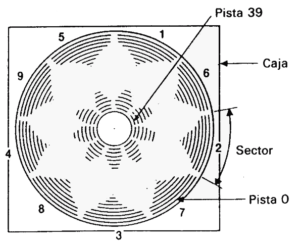

Radialmente el disco se divide el 40 pistas, desde la número 0, que es la más externa, hasta la 39. La circunferencia se divide en 9 sectores.

Cada pista puede almacenar en cada sector 512 bytes; por lo tanto, la capacidad total del disco es de 180K.

### Primeros pasos en la utilización del disco de CP/M

Antes de poder grabar programas en un disco virgen es necesario inicializarlo, y para ello se requiere el disco de CP/M.

Encienda el equipo e inserte el disco de CP/M en la unidad. Si su sistema dispone de dos unidades de disco, utilice la incorporada en el ordenador (unidad A).

Escriba lo siguiente:

```
|cpm [ENTER]
```

(El símbolo | se obtiene de la tecla @ con **[SHIFT]**.)

Al cabo de unos segundos aparecerá en la pantalla el siguiente mensaje:

```
CP/M 2.2 - Amstrad Consumer Electronics plc 
A>
```

Esto es un mensaje de saludo que indica que el sistema operativo está siendo controlado por CP/M.

Los caracteres **A>** constituyen un indicador, análogo al **Ready** de BASIC, que avisa al usuario de que el ordenador está a la espera de sus instrucciones.

Una vez cargado CP/M, ya no se pueden teclear instrucciones de BASIC, pues el ordenador no las entendería.

Por ejemplo, si escribimos

```
cls [ENTER]
```

el ordenador repite lo tecleado junto con un signo de interrogación: 

```
CLS?
```

lo que indica que no ha entendido la instrucción.

Para dar un breve repaso a algunas órdenes de CP/M, escriba: 

```
dir [ENTER]
```

En la pantalla aparece una lista del contenido del disco, incluidas algunas órdenes transitorias. Una de ellas es **format**. Escriba:

```
format [ENTER]
```

En la pantalla aparece el siguiente mensaje:

```
Please insert disc to be formatted into drive A 
then press any key.
```

("Inserte el disco que va a inicializar en la unidad A y luego pulse una tecla cualquiera.") Extraiga el disco de CP/M, introduzca el disco virgen y luego pulse una tecla (gris) cualquiera. El proceso de inicialización comienza con la pista 0 y termina con la 39; una vez concluido, el ordenador le pregunta:

```
Do you want to format another disc (Y/N):
```

("Quiere inicializar otro disco (S/N):") Si desea inicializar la otra cara del disco, o bien un segundo disco, responda pulsando la tecla **Y** (de yes, si) y volverá a aparecer el mensaje inicial.

Este proceso se puede repetir cuantas veces se desee, hasta que se responda con **N** (de "no") a la pregunta, momento en el que el ordenador pide al usuario que:

```
Please insert a CP/M system disc into drive A then press any key:
```

('Por favor, inserte un disco de CP/M en la unidad A y luego pulse una tecla cualquiera.5) Una vez hecho esto, el ordenador vuelve a modo CP/M directo y queda a la espera de nuevas instrucciones. Más adelante describiremos otras funciones de CP/M. Por ahora nos basta con haber aprendido a inicializar discos con CP/ M. Reinicialice el ordenador con **[CTRL]**, **[SHIFT]** y **[ESC]**.

Guarde siempre en lugar seguro el disco maestro de CP/M, que es, literalmente, la llave del sistema. En un capítulo posterior explicaremos cómo hacer una "copia de trabajo" del disco de CP/M, de forma que pueda guardar el original a salvo de toda posibilidad de accidente.

**PRECAUCIÓN**

AL INICIALIZAR UN DISCO QUE CONTENGA ALGÚN FICHERO SE BORRA
SU CONTENIDO

No es posible inicializar un disco que tenga el orificio de protección abierto. Si lo intenta, el ordenador responderá con el mensaje:

```
Drive A: disc is write protected 
Retry, Ignore or Cancel?
```

Pulse **C** para cancelar la orden y luego siga las instrucciones que aparezcan en la pantalla.

Ahora que ya tenemos uno o dos discos preparados, vamos a empezar a transferir programas de BASIC del ordenador al disco y viceversa.

### Grabación de un programa en disco

Cuando se tiene un programa en la memoria del ordenador, se lo puede grabar en disco mediante la orden

```
save "nombrefi" [ENTER]
```

Observe que es indispensable dar un nombre al programa.

El nombre de un fichero grabado en disco consta de dos partes (campos). La primera es obligatoria y puede contener hasta 8 caracteres. Se pueden utilizar letras o números, pero no espacios ni signos de puntuación. Este primer campo suele contener el nombre del programa.

El segundo campo es opcional. Puede contener hasta 3 caracteres que no sean ni espacios ni signos de puntuación. Los dos campos se separan por un punto (.).

Si el usuario no especifica el segundo campo, el sistema le asigna automáticamente un distintivo: **.BAS** para ficheros de BASIC o **.BIN** para ficheros binarios (en código de máquina).

Para practicar la grabación en disco, introduzca un programa corto en la memoria del ordenador, inserte en la unidad un disco inicializado y escriba lo siguiente:

```
save "ejemplo" [ENTER]
```

Al cabo de unos segundos aparecerá en la pantalla el mensaje **Ready**, lo que indica que el programa ha quedado grabado en el disco. (De no ser así, observe los mensajes emitidos por el ordenador, pues puede ocurrir que no haya insertado el disco en la unidad correcta, que esté abierto el orificio de protección o que se haya equivocado al teclear la orden.)

### Catálogo

Una vez grabado el programa, escriba lo siguiente:

```
cat [ENTER]
```
En la pantalla podrá ver

```
Drive A: user 0 
EJEMPLO.BAS 1K 
168 K free
```

o sea, el nombre del fichero, incluido el segundo campo, seguido de la longitud aproximada en K. En la última línea se indica también el espacio que queda libre en el disco.

### Carga del disco a la memoria del ordenador

Los programas se pueden cargar y ejecutar con las dos órdenes siguientes:

```
load "nombrefi" [ENTER] 
run [ENTER]
```

Pero también se los puede ejecutar directamente con una sola orden:

```
run "nombrefi" [ENTER] 
```

Los programas protegidos sólo se pueden ejecutar por este segundo método.

### |A y |B

Si tiene conectada la segunda unidad de disco, puede especificar en qué unidad desea que se realice cada función escribiendo

```
|a [ENTER]
```


o bien

```
|b [ENTER]
```

antes de las órdenes **SAVE**, **CAT** o **LOAD**.

### Copia de programas de disco a disco

Para copiar programas de un disco a otro utilizando las órdenes que hemos aprendido en esta sección, basta con hacer lo siguiente: cargar el programa en memoria leyéndolo del disco original (fuente), sacar el disco, insertar el disco nuevo (destino) y grabar en él el programa.

En cambio, cuando se dispone de dos unidades de disco, es más cómodo insertar el disco fuente en una unidad, por ejemplo la B, y el disco destino en la A. Para copiar un programa se escribe entonces lo siguiente:

```
|b [ENTER]
load "nombrefi" [ENTER] 
|a [ENTER]
save "nombrefi" [ENTER]
```

Hay cuatro formas de grabar programas con el CPC664. Una de ellas es la ya conocida:

```
save "nombrefi" [ENTER]
```

La segunda es:

```
save "nombrefi ", a [ENTER]
```

donde el sufijo **,a** indica al ordenador que debe grabar el programa o los datos en forma de fichero de texto ASCII. Este método de grabación de datos es aplicable a los ficheros generados por procesadores de textos y otros programas; lo explicaremos más detenidamente cuando hablemos de esas aplicaciones.

La tercera forma es:

```
save "nombrefi",p [ENTER]
```

El sufijo ,p indica al ordenador que el fichero debe ser protegido. Cuando un programa está así protegido, no es posible cargarlo (LOAD) para luego listarlo (LIST), ni tampoco interrumpirlo con la tecla **[ESC]** después de haber iniciado su ejecución con RUN.

Los programas grabados por este procedimiento sólo pueden ser ejecutados directamente, bien con la orden

```
run "nombrefi" [ENTER]
```

bien con

```
chain "nombrefi" [ENTER]
```


Siempre que se prevea la posibilidad de que más tarde se vaya a corregir o modificar un programa, se debe guardar una copia no protegida, esto es, grabada sin el sufijo **,p**.

La cuarta forma de grabación es:

```
save "nombrefi", b, (dirección inicial) , (longitud en bytes)[, (punto de entrada opcional) ] [ENTER]
```

Esta opción permite realizar un volcado directo de datos desde la memoria RAM del ordenador hacia el disco. Además del sufijo **,b** es necesario indicar al ordenador en qué dirección de memoria empieza el bloque que se desea transferir, cuál es la longitud en bytes y, en su caso, en qué dirección de memoria debe empezar la ejecución cuando se cargue el fichero como programa. Con este método se puede hacer un volcado de la memoria dedicada a la pantalla. El contenido de la pantalla se graba mediante la siguiente orden:

```
save "volcpant",b,49152,16384 [ENTER]
```

donde **49152** es la dirección en la que empieza la zona de memoria dedicada a la pantalla y **16384** es el tamaño de esa zona en bytes.

Para cargar nuevamente esos datos en el ordenador se escribe:

```
load "volcpant" [ENTER]
```

En un capítulo posterior de este manual daremos más información sobre la transferencia de datos de un disco a otro, de cinta a disco y de disco a cinta.

Finalmente, asegúrese de que ha tenido en cuenta las advertencias que hemos hecho al principio del manual, en la sección titulada 'IMPORTANTE':

NOTAS DE INSTALACIÓN 5, 6 y 7. 

NOTAS DE OPERACIÓN 1, 2, 3, 4, 5, 6, 7 y 9.


## Parte 8: Introducción a los modos de pantalla, colores y gráficos

El AMSTRAD CPC664 tiene tres modos de pantalla: modo 0, modo 1 y modo 2. Al encenderlo, el ordenador selecciona automáticamente el modo 1.

Para apreciar las diferencias entre los tres modos, encienda el ordenador y pulse la tecla del **1**. Manténgala pulsada hasta que se hayan llenado dos líneas de pantalla. Si cuenta los unos, observará que hay 40 en cada línea. Esto quiere decir que en modo 1 la pantalla tiene 40 columnas. Pulse **[ENTER]**: el ordenador responderá con un mensaje de **Syntax** error, pero no se preocupe; ésta es una forma rápida de obtener nuevamente el mensaje **Ready**, que indica que el ordenador está preparado para recibir nuestras instrucciones.

Escriba:

```
mode 0 [ENTER]
```

Observará que ahora los caracteres son más grandes. Pulse otra vez la tecla del 1 y no la suelte hasta que se hayan llenado dos líneas de la pantalla. Compruebe que ahora hay 20 unos por línea. Esto significa que en modo 0 la pantalla tiene 20 columnas. Pulse nuevamente **[ENTER]** y luego escriba:

```
mode 2 [ENTER]
```
Observe que ahora los caracteres son muy pequeños. Puede comprobar que en modo 2    la pantalla tiene 80 columnas.

Resumiendo,

 - Modo 0=20 columnas 
 - Modo 1=40 columnas 
 - Modo 2=80 columnas

Finalmente, vuelva a pulsar **[ENTER]**,

### Colores

Este ordenador puede manejar 27 colores. En el monitor de fósforo verde (GT65) aparecen como distintas gradaciones de verde. Si usted adquirió el sistema con el monitor GT65, en cualquier momento puede comprar la unidad modulador/fuente de alimentación MP2, con la que podrá disfrutar de los colores del ordenador conectándolo a un televisor doméstico.

 - En modo 0 se pueden visualizar simultáneamente 16 de los 27 colores disponibles.
 - En modo 1 se pueden visualizar simultáneamente 4 de los 27 colores. 
 - En modo 2 se pueden visualizar simultáneamente 2 de los 27 colores.

Se pueden controlar los colores del borde, del papel (fondo) y de la pluma (trazo) independientemente unos de otros.

Los 27 colores disponibles son los relacionados en la tabla 1, en la que se incluyen también los números de referencia para la instrucción **INK** (tinta).

Para mayor comodidad, esta tabla aparece también en la carcasa del ordenador, al lado derecho.

#### @@ Recolocar tabla de colores

**LISTA DE COLORES**

| Número de INK | Color | Número de INK | Color | Número de INK | Color |
|---------------|-------|---------------|-------|---------------|-------|
| 0 |  Negro           |  9 | Verde           | 18 | Verde intenso
| 1 |  Azul            | 10 | Cyan            | 19 | Verde mar
| 2 |  Azul intenso    | 11 | Azul celeste    | 20 | Cyan intenso
| 3 |  Rojo            | 12 | Amarillo        | 21 | Verde lima
| 4 |  Magenta         | 13 | Blanco          | 22 | Verde pastel
| 5 |  Malva           | 14 | Azul pastel     | 23 | Cyan pastel
| 6 |  Rojo intenso    | 15 | Anaranjado      | 24 | Amarillo intenso
| 7 |  Morado          | 16 | Rosado          | 25 | Amarillo pastel
| 8 |  Magenta intense | 17 |  Magenta pastel | 26 | Blanco intenso

Tabla 1. Números de INK y colores.

Como hemos dicho, el ordenador se pone automáticamente en modo 1 al encenderlo. Para volver a modo 1 estando en cualquier otro, basta con escribir:

```
mode 1 [ENTER]
```

### La pantalla

El borde (**BORDER**) es el área que rodea el papel (**PAPER**). (Cuando se enciende el ordenador, el borde y el papel son ambos azules.) Los caracteres que escribimos en la pantalla sólo puede estar en la región interior al borde. El *papel* es el fondo sobre el que la *pluma* escribe los caracteres.

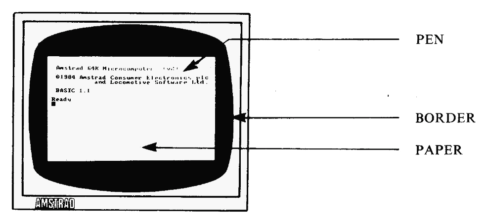

Vamos a explicar cómo se seleccionan los colores.

Cuando se enciende o reinicializa el ordenador, éste selecciona automáticamente el color número 1 para el borde. Como puede comprobar en la tabla 1, el color número 1 es el azul. El color del borde se puede cambiar mediante la orden BORDER seguida del número del color deseado. Por ejemplo, escriba:

```
border 13 [ENTER]
```

Esto es fácil. Lo complicado viene ahora:

Cuando se enciende o reinicializa la máquina, el número de papel seleccionado automáticamente es el 0, y el de la pluma es el 1. Esto no quiere decir que los colores correspondientes sean los que figuran en la tabla anterior con los números 0 y 1.

Lo que ocurre es que el 0 y el 1 son números de papel y de pluma, *no* números de tinta. Vamos a explicarnos. Supongamos que tenemos en nuestra mesa cuatro plumas, numeradas del 0 al 3, y 27 tinteros, numerados del 0 al 26. Es evidente que cuando decimos "pluma número 1" no necesariamente estamos refiriéndonos al color número 1. La pluma número 1 puede estar cargada con tinta de cualquier color; de hecho, podemos tener las cuatro plumas cargadas con la misma tinta.

Pues bien, algo similar ocurre en el ordenador. Con la instrucción **PEN** (pluma) podemos elegir la pluma con la que vamos a escribir; la instrucción **INK** (tinta) nos permite 'cargar' esa pluma con tinta del color deseado.

Recordando que estamos en modo 1 (40 columnas), consulte la tabla 2 y comprobará que la pluma número 1 está cargada inicialmente con tinta de color 24. Pero el color 24 es, como podemos ver en la tabla 1, amarillo intenso: el color con que se escriben los caracteres cuando acabamos de encender el ordenador.

#### @@ reformatear tabla de colores

COLORES DE TINTA IMPLICITOS

|Número de papel/pluma |  Color de tinta  Modo 0 | Color de tinta Modo 1 | Color de tinta Modo 2 |
|----------------------|-------------------------|-----------------------|-----------------------|
| 0  | 1  | 1  | 1
| 1  | 24 | 24 | 24
| 2  | 20 | 20 | 1
| 3  | 6  | 6  | 24
| 4  | 26 | 1  | 1
| 5  | 0  | 24 | 24
| 6  | 2  | 20 | 1
| 7  | 8  | 6  | 24
| 8  | 10 | 1  | 1
| 9  | 12 | 24 | 24
| 10 | 14 | 20 | 1
| 11 | 16 | 6  | 24
| 12 | 18 | 1  | 1
| 13 | 22 | 24 | 24
| 14 | Parpadeo 1,24 |  20 | 1
| 15 | Parpadeo 16,11|  6  | 24

Tabla 2. Valores de papel/pluma/modo/tinta.

Las relaciones entre papel, pluma y tinta no son fijas. Los valores que se muestran en la tabla 2 son los seleccionados automáticamente en el momento de encender la máquina. Se los puede cambiar mediante la instrucción **INK** (tinta). Esta instrucción va seguida de dos números (parámetros). El primero es el número de papel o de pluma que vamos a cargar; el segundo es el color con que vamos a cargarlos. Los parámetros van separados por una coma.

Puesto que estamos utilizando la pluma número 1, vamos á cambiar el color de tinta correspondiente: la cargaremos con tinta de color anaranjado. Escriba:

```
ink 1,15 [ENTER]
```

Los caracteres han cambiado instantáneamente de color.

También podemos cambiar el color del fondo mediante la instrucción **INK**. Sabemos que el número de papel seleccionado al encender la máquina es el 0; vamos a cambiarle el color a verde (color número 9) escribiendo:

```
ink 0,9 [ENTER]
```

Ahora vamos a escribir con una pluma diferente. Escriba: 

```
pen 3 [ENTER]
```

El color de los caracteres ya escritos no ha cambiado. Esta instrucción afecta solamente a los que escribamos a continuación. En este momento estamos utilizando la pluma número 3. Como puede comprobar en las tablas 1 y 2, la tinta con que esta pluma está cargada inicialmente es la de color número 6 (rojo intenso). Para cambiarla a rosa escriba:

```
ink 3,16 [ENTER]
```

Recuerde que el 3 es el color de la pluma, y que el 16 es el color de la tinta con que la cargamos (rosa).

Cambiemos ahora de papel. Cuando lo hagamos, el anterior color de fondo no cambiará, porque ese color ha sido impreso con otro papel. Escriba lo siguiente:

```
paper 2 [ENTER]
```

Consultando nuevamente las tablas 1 y 2, compruebe que el color inicialmente asignado al papel número 2 es cyan intenso. Cámbielo a negro escribiendo:

```
ink 2,0 [ENTER]
```

En este momento, en la pantalla tenemos caracteres escritos por las plumas 1 y 3, sobre fondos de papel números 0 y 2. También se puede cambiar el color de la tinta de una pluma o de un papel que no estén siendo utilizados. Por ejemplo, escriba la orden:

```
ink 1,2 [ENTER]
```

que cambia el color de los caracteres que habíamos escrito antes con la pluma número 1.

Escriba:

```
cls [ENTER]
```

para borrar la pantalla.

El lector ya debería ser capaz de hacer que el ordenador vuelva a los colores iniciales (borde y fondo azul y caracteres amarillos) utilizando las instrucciones **BORDER**, **PAPER**, **PEN** e **INK**. Inténtelo. Si no lo consigue, reinicialice la máquina con **[CTRL]**, **[SHIFT]** y **[ESC]**,

### Colores parpadeantes

Es posible hacer que una tinta cambie intermitentemente de color. Para ello se debe añadir otro número a la instrucción **INK** que asigna tintas a la pluma utilizada.

Vamos a hacer que los caracteres que escribamos alternen entre los colores blanco intenso y rojo intenso. Reinicialice la máquina con **[CTRL]**, **[SHIFT]** y **[ESC]** y escriba lo siguiente:

```
ink 1,26,6 [ENTER]
```

En este caso el **1** es el número de la pluma, el **26** es el del color blanco intenso y el **6** es el del segundo color, rojo intenso.

El mismo efecto de parpadeo se puede dar a los colores del fondo, para lo cual se añade un segundo número de color a la instrucción **INK** que asigna tintas al papel actual. Para hacer que el color del fondo alterne entre verde y amarillo intenso escriba:

```
ink 0,9,24 [ENTER]
```

En este caso **0** es el número del papel, **9** es el número del color verde y **24** es el número del segundo color, el amarillo intenso.

Reinicialice el ordenador con **[CTRL]**, **[SHIFT]** y **[ESC]**,

Observe en la tabla 2 que en modo 0 hay dos números de pluma y dos números de papel, el **14** y el **15**, que tienen asignados tintas parpadeantes. Es decir, sus correspondientes tintas están preprogramadas con un color adicional.

Escriba lo siguiente:

```
mode 0 [ENTER] 
pen 15 [ENTER]
```

y verá en la pantalla la palabra **Ready** parpadeando entre azul celeste y rosa. Escriba ahora:

```
paper 14 [ENTER]
```

El texto continúa parpadeando como antes, pero además el fondo ha empezado a alternar entre los colores amarillo y azul.

Los números de pluma y de papel **14** y **15** pueden ser reprogramados, mediante la adecuada instrucción **INK**, para que parpadeen con otras tintas o bien para asignarles un color fijo.

Finalmente, se puede hacer parpadear el borde sin más que especificar un segundo número de color en la instrucción **BORDER**. Escriba:

```
border 6,9 [ENTER]
```

El borde está parpadeando entre los colores rojo intenso y verde. Observe que al borde se le puede asignar uno o dos colores cualesquiera de los 27 disponibles, independientemente del modo en que esté la pantalla (0, 1 o 2).

Reinicialice el ordenador con **[CTRL]**, **[SHIFT]** y **[ESC]**.

Introduzca y ejecute el siguiente programa, que demuestra los colores disponibles.

```
10 MODE 0 [ENTER]
20 velocidad=600: REM velocidad del programa [ENTER] 
30 FOR b=0 TO 26 [ENTER] 
40 LOCATE 3,12 [ENTER] 
50 BORDER b [ENTER]
60 PRINT "color del borde:";b [ENTER]
70 FOR t=1 TO velocidad [ENTER]
80 NEXT t,b [ENTER]
90 CLG [ENTER]
100 FOR p=0 TO 15 [ENTER]
110 PAPER p [ENTER]
120 PRINT "papel:";p [ENTER]
130 FOR n=0 TO 15 [ENTER]
140 PEN n [ENTER]
150 PRINT "pluma:";n [ENTER]
160 NEXT n [ENTER]
170 FOR t=1 TO velocidad*2 [ENTER]
180 NEXT t,p [ENTER]
190 MODE 1 [ENTER]
200 BORDER 1 [ENTER]
210 PAPER 0 [ENTER]
220 PEN 1 [ENTER]
230 INK 0,1 [ENTER]
240 INK 1,24 [ENTER]
run [ENTER]
```

** OBSERVACIÓN MUY IMPORTANTE **

En este programa, así como en otros capítulos y listados de este manual, las palabras clave de BASIC aparecen en mayúsculas, pues el ordenador convierte automáticamente minúsculas a mayúsculas cuando se le pide que haga un listado del programa (con **LIST**). En general, es preferible escribir las instrucciones en minúscula; esto ayudará más tarde a detectar errores, ya que las palabras clave de BASIC que contengan algún error *no* serán convertidas a mayúsculas.

En lo que resta de este 'Curso de Introducción' daremos los listados indistintamente en mayúsculas y minúsculas, para que usted se familiarice con esta característica de BASIC.

Los nombres de las variables, tales como **x** o **a$**, *no* son convertidos a mayúsculas al listar el programa. Sin embargo, el ordenador reconoce las variables tanto si están en mayúsculas como si están en minúsculas; de hecho, para el ordenador **x** es la misma variable que **X**.

**Atención**

A partir de ahora no vamos a seguir recordándole que debe pulsar **[ENTER]** al terminar de escribir cada línea de programa y cada orden directa, pues suponemos que usted ya está suficientemente habituado a hacerlo.

### Gráficos

En la memoria del ordenador está pregrabado el diseño de cierto número de caracteres. Para escribirlos en la pantalla necesitamos la palabra clave:

```
chr$( )
```

Dentro de los paréntesis se pone el número del carácter, que está en el margen de 32 a 255.

Reinicialice el ordenador con **[CTRL]**, **[SHIFT]** y **[ESC]** y escriba lo siguiente:

```
print chr$(250)
```

No olvide pulsar **[ENTER]**, En la pantalla ha aparecido el carácter número **250**, que es la figura de un hombre caminado hacia la derecha.

Para ver todos los caracteres y símbolos, junto con su número correspondiente, introduzca y ejecute el siguiente programa (recuerde que debe pulsar **[ENTER]** al final de cada línea):

```
10 for n=32 to 255 
20 print n;chr$(n); 
30 next n 
run
```

Todos estos caracteres y números figuran en el capítulo titulado "Para su referencia...".

### LOCATE

Esta instrucción sirve para colocar el cursor en un lugar especificado de la pantalla. A menos que se lo mueva con una instrucción **LOCATE**, el punto de partida del cursor es el extremo superior izquierdo de la pantalla, punto de coordenadas **1,1** (en el sistema de coordenadas **x,y**, donde **x** es la posición horizontal e **y** es la vertical). En modo 1 hay cuarenta columnas y 25 filas (o líneas). Así, para colocar el cursor en el centro de la primera línea, tendremos que utilizar **20, 1** como coordenadas **x, y**.

Teclee lo siguiente (sin olvidar pulsar **[ENTER]** al final de cada línea):

```
mode 1
```

... borra la pantalla y lleva el cursor al extreio superior izquierdo

```
10 locate 20,1 
20 print chr$(250) 
run
```
Para comprobar que el carácter está en la primera línea, cambiemos el color del borde: 

```
border 0
```

El borde es ahora negro y el hombrecillo está en el centro de la línea superior. 

En modo 0 sólo hay 20 columnas, pero las mismas 25 líneas. Si ahora escribe:

```
mode 0 
run
```

verá que el hombre se ha ido al extremo superior derecho de la pantalla. Esto ha ocurrido porque la coordenada x=20 es la última columna en modo 0. Escriba:

```
mode 2 
run
```

Vuelva a modo 1 con: 

```
mode 1
```

Ahora pruebe usted con diferentes posiciones en **locate** y diferentes números en **chr$( )**. Por ejemplo, escriba:

```
locate 20, 12: print chr$(240)
```


y verá una flecha en el centro de la pantalla. Observe que en esta instrucción:


**20** es la coordenada x (horizontal) (margen: 1 a 40) 

**12** es la coordenada y (vertical) (margen: 1 a 25) 

**240** es el número del carácter (margen: 32 a 255)


Para mover el carácter 250 de izquierda a derecha de la pantalla, escriba lo siguiente: 

```
10 CLS
20 FOR x=1 TO 39
30 LOCATE x,20
50 PRINT chr$(250)
60 NEXT x
70 GOTO 10
run
```

Pulse **[ESC]** dos veces para detener el programa.

Si queremos borrar el carácter recién escrito antes de escribir el siguiente, debemos hacer

```
50 print " ";chr$(250)
```

(Esta nueva línea 50 reemplaza automáticamente la que teníamos antes.) Escriba: 

```
run
```

### FRAME

Para mejorar la ilusión de movimiento del carácter por la pantalla, añada al programa anterior la siguiente línea:

```
40 frame
```

La instrucción FRAME sincroniza el movimiento de objetos por la pantalla con la frecuencia a la que se envían las imágenes al monitor. La explicación es demasiado técnica, pero basta con que recordemos que esta instrucción se debe utilizar siempre que queramos mover objetos suavemente por la pantalla.

Este programa se puede mejorar introduciendo pausas y utilizando un símbolo distinto para el retroceso. Escriba:

```
list
```

y añada las siguientes líneas:

```
70 FOR n=1 TO 300:NEXT n
80 FOR x=39 TO 1 STEP -1 
90 LOCATE x,20 
100 FRAME
110 PRINT CHR$(251);" " 
120 NEXT x
130 FOR n=1 TO 300:NEXT n
140 GOTO 20
run
```


### PLOT

La instrucción **PLOT** es análoga a **LOCATE**, pero controla la posición del cursor gráfico y utiliza un sistema de coordenadas distinto, en el que las distancias se miden en *pixels* (un pixel, o *punto*, es la mínima área de la pantalla controlable individualmente).

El cursor gráfico es invisible, y distinto en todos los aspectos del cursor de texto.

La pantalla se divide en 640 puntos en horizontal por 400 en vertical. Las coordenadas x, y se toman con respecto al extremo inferior izquierdo de la pantalla, que es el punto de coordenadas 0, 0. A diferencia de lo que ocurría con LOCATE, las coordenadas de este sistema no dependen del modo de pantalla (0, 1 o 2).

Para comprobarlo, reinicialice la máquina con **[CTRL]**, **[SHIFT]** y **[ESC]** y escriba:

```
plot 320,200
```

Observe el punto que ha aparecido en el centro de la pantalla.

Hagamos lo mismo en modo 0:

```
mode 0 
plot 320,200
```

El punto sigue estando en el centro de la pantalla, pero es más grande. Para ver el efecto en modo 2 escriba:

```
mode 2
plot 320,200
```

Como era de esperar, el punto sigue centrado, pero es mucho más pequeño.

Dibuje unos cuantos puntos en diversos lugares de la pantalla y en modos distintos para familiarizarse con esta instrucción. Cuando haya terminado, escriba:

```
mode 1
```

para volver a modo 1 y borrar la pantalla.

### DRAW

Reinicialice la máquina con **[CTRL]**, **[SHIFT]** y **[ESC]**. La instrucción **DRAW** dibuja una recta a partir de la posición actual del cursor gráfico. Para verla en acción, dibuje un rectángulo con el siguiente programa.

En la línea 10 la instrucción **POS **coloca el cursor en el punto de partida deseado. A continuación, las instrucciones **DRAW** van dibujando segmentos de recta: hacia arriba, hacia la derecha, etc. Escriba:

```
5 cls
10 plot 10,10
20 draw 10,390
30 draw 630,390
40 draw 630,10
50 draw 10,10
60 goto 60  
run     
```

Pulse **[ESC]** dos veces para interrumpir el programa.

(Observe la línea 60 de este programa. Esta línea establece un bucle infinito, del que sólo se sale interrumpiendo el programa. Una instrucción de este tipo es útil cuando se quiere evitar que el ordenador exhiba el mensaje **Ready** al terminar el programa.)

Añada al programa las siguientes líneas, las cuales dibujan un segundo rectángulo dentro del anterior:

```
60 plot 20,20 
70 draw 20,380 
80 draw 620,380 
90 draw 620,20 
100 draw 20,20 
110 goto 110 
run
```

Pulse **[ESC]** dos veces para interrumpir el programa.

### MOVE

Esta instrucción funciona igual que **PLOT** en cuanto a llevar el cursor gráfico a la posición especificada, pero *no* dibuja el punto.

Escriba: 

```
cls
move 639,399
```

Aunque no podamos verlo, hemos llevado el cursor al extremo superior derecho de la pantalla.

Para demostrarlo, vamos a dibujar una recta desde ese punto hasta el centro de la pantalla. Escriba:

```
draw 320,200
```

### Circunferencias

Las circunferencias se pueden dibujar punto a punto o con trazo continuo. Una forma de dibujar una circunferencia consiste en dibujar puntos en las posiciones correctas. En la figura siguiente se ilustra cómo se calculan las coordenadas x, y de un punto p de la circunferencia. Las fórmulas son:

x=190*cos(a)
y=190*sin(a)

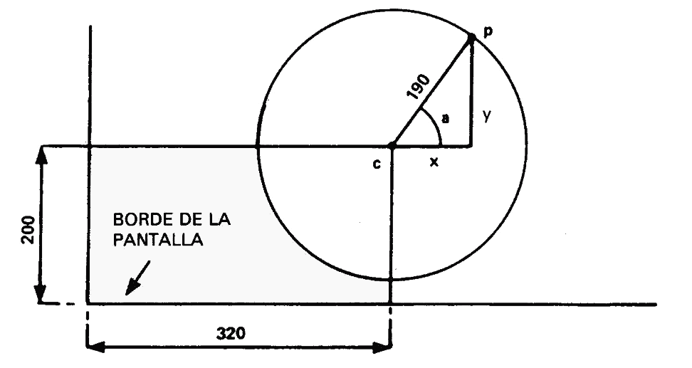

#### Dibujo de una circunferencia

En los programas anteriores hemos referido todos los dibujos al extremo inferior izquierdo de la pantalla. Si queremos que nuestra circunferencia quede centrada en la pantalla, debemos situar su centro en el punto de coordenadas 320, 200, y luego sumar a estos valores los dados por las fórmulas anteriores.

El siguiente programa dibuja punto a punto una circunferencia: 

```
new
10 CLS 
20 DEG
30 FOR a=1 TO 360 
40 MOVE 320,200
50 PLOT 320+190*COS(a),200+190*SIN(a)
60 NEXT
run
```

Observe que hemos tecleado la orden **NEW** antes de introducir el programa. Esta orden hace que el ordenador borre el programa que en ese momento tenga en la memoria (de forma similar a lo que ocurre cuando se pulsa **[CTRL]**, **[SHIFT]** y **[ESC]**). Sin embargo, la pantalla no se borra.

El radio de la circunferencia se puede reducir poniendo en lugar de 190 un número menor de pixels.

Para ver el efecto de dibujar la circunferencia de otra forma (en radianes), borre la línea 20 escribiendo:

```
20
```

En lugar de punto a punto, podemos dibujar la circunferencia con trazo continuo. 
Modifique la línea 50 para poner draw en lugar de plot. La línea será entonces:

```
50 draw 320+190*cos(a),200+190*sin(a)
```

Pruebe esta modificación con la línea 20 y sin ella.

Observe que en la línea 60 de este programa hemos puesto **NEXT** en lugar de **NEXT a**. En efecto, se puede omitir el nombre de la variable, pues el ordenador se encarga de averiguar a qué **FOR** corresponde cada **NEXT**. No obstante, en los programas en los que haya muchos bucles **FOR ... NEXT**, puede ser conveniente poner los nombres de las variables después de **NEXT** para que el programa sea más inteligible cuando se lo esté corrigiendo o estudiando.

### ORIGIN

En el programa anterior utilizábamos la instrucción **MOVE** para establecer el centro de la circunferencia y luego sumábamos a las coordenadas del centro las coordenadas de los puntos de la circunferencia. Podemos evitar esas sumas si redefinimos la posición del origen de coordenadas con la instrucción **ORIGIN**. El ordenador entenderá las coordenadas que se le suministren a continuación como referidas al nuevo origen. Escriba lo siguiente:

```
new
10 cls
20 for a=1 to 360
30 origin 320,200
40 plot 190*cos(a),190*sin(a)
50 next
run
```


El siguiente programa dibuja cuatro circunferencias más pequeñas: 

```
new
10 CLS
20 FOR a=1 TO 360
30 ORIGIN 196,282
40 PLOT 50*COS(a),50*SIN(a)
50 ORIGIN 442,282
60 PLOT 50*COS(a),50*SIN(a)
70 ORIGIN 196,116
80 PLOT 50*COS(a),50*SIN(a)
90 ORIGIN 442,116
100 PLOT 50*COS(a),50*SIN(a)
110 NEXT
run
```

Otra forma de dibujar la circunferencia (con trazo continuo) es la siguiente: 

```
new
10 MODE 1 
20 ORIGIN 320,200 
30 DEG
40 MOVE 0,190
50 FOR a=0 TO 360 STEP 10
60 DRAW 190*SIN(a),190*COS(a)
70 NEXT
run
```

En este caso se van dibujando pequeños segmentos de recta, de un punto al siguiente de la circunferencia. Este método es mucho más rápido que el de dibujo punto a punto.

Observe una vez más el efecto de la instrucción DEG: suprima la línea 30 y ejecute el programa.

### FILL

La instrucción **FILL** (rellenar) se utiliza para rellenar una región de la pantalla que esté delimitada por gráficos o por los bordes de la pantalla.

Reinicialice la máquina con **[CTRL]**, **[SHIFT]** y **[ESC]** y luego escriba: new

```
10 cls
20 move 20,20 
30 draw 620,20 
40 draw 310,380 
50 draw 20,20 
run 
```


En la pantalla ha aparecido un triángulo. Lleve el cursor gráfico al centro de la pantalla con la orden

```
move 320,200
```

Vamos a utilizar la instrucción **FILL** seguida de un número de pluma, por ejemplo el **3**, para rellenar con la tinta de la pluma especificada el recinto cerrado en que se encuentra el cursor. Escriba lo siguiente:

```
fill 3
```
Lleve el cursor al exterior del triángulo con la orden

```
move 0,0 
```

Observe qué ocurre cuando escriba:

```
fill 2
```

El ordenador ha usado la pluma número **2** para rellenar la zona delimitada por el dibujo y los bordes de la pantalla.

Modifique ahora el programa escribiendo las líneas siguientes y vea qué ocurre:

```
50 draw 50,50 
60 move 320,200 
70 fill 3
run
```

La tinta 'rezuma' por las ranuras.

Veámoslo con otro ejemplo. Rellenemos una circunferencia dibujada punto a punto: new

```
10 CLS
20 FOR a=1 TO 360 
30 ORIGIN 320,200 
40 PLOT 190*COS(a),190*SIN(a) 
50 NEXT
60 MOVE -188,0 
70 FILL 3 
run
```

Pruebe ahora con: 

```
new
10 MODE 1 
20 ORIGIN 320,200 
30 DEG
40 MOVE 0,190 
50 FOR a=0 TO 360 STEP 10 
60 DRAW 190*SIN(a),190*COS(a) 
70 NEXT
80 MOVE -188,0 
90 FILL 3 
run
```

Para hacer que el borde del círculo sea invisible, dibujamos la circunferencia con tinta del mismo color que la del papel. Añada la siguiente línea:

```
45 GRAPHICS PEN 2:INK 2,1 
run
```

La instrucción **GRAPHICS PEN** selecciona la pluma que haya de ser utilizada para dibujar gráficos. La instrucción **INK** especifica el color de tinta para esa pluma, que en este caso coincide con el color del papel (color número 1).

### Otros detalles ...

En la sección 'Expresado gráficamente', del capítulo titulado 'Cuando usted guste ...', daremos una explicación más detallada de los gráficos del CPC664.
Para concluir esta sección, le ofrecemos unos programas de demostración de gráficos que incorporan muchas instrucciones que el lector ya debería entender.

@@ revisar fuentes de aquí hacia adelante


```
10 BORDER 0:GRAPHICS PEN 1
20 m=CINT(RND*2):MODE m
30 i1=RND*26:i2=RND*26
40 IF ABS(i1-i2)<10 THEN 30
50 INK 0,i1:INK 1,i2
60 s=RND*5+3:ORIGIN 320,-100
70 FOR x=-1000 TO 0 STEP s
80 MOVE 0,0:DRAW x,300:DRAW 0,600
90 MOVE 0,0:DRAW -x,300:DRAW 0,600
100 NEXT:FOR t=1 TO 2000:NEXT:GOTO 20
run
```

```
10 MODE 1:BORDER 0:PAPER 0
20 GRAPHICS PEN 2:INK 0,0:i=14
30 EVERY 2200 GOSUB 150
40 indicador=0:CLG
50 INK 2,14+RND*12
60 b%=RND*5+1
70 c%=RND*5+1
80 ORIGIN 320,200
90 FOR a=0 TO 1000 STEP PI/30
100 x%=100*COS(a)
110 MOVE x%, y%
120 DRAW 200*COS(a/b%),200*SIN(a/c%)
130 IF indicador=1 THEN 40
140 NEXT
150 indicador=1:RETURN
run
```

```
10 MODE 1:BORDER 0:DEG
20 PRINT "Por favor, espere"
30 FOR n=1 TO 3
40 INK 0,0:INK 1,26:INK 2,6:INK 3,18
50 IF n=1 THEN sa=120
60 IF n=2 THEN sa=135
70 IF n=3 THEN sa=150
80 IF n=1 THEN ORIGIN 0,-50,0,640,0,400 ELSE ORIGIN 0,0,0,640,0,400
90 DIM cx(5),cy(5),r(5),lc(5)
100 DIM np(5)
110 DIM px%(5,81),py%(5,81)
120 st=1:cx(1)=320:cy(1)=200:r(1)=80
130 FOR st=1 TO 4
140 r(st+1)=r(st)/2
150 NEXT st
160 FOR st=1 TO 5
170 lc(st)=0:np(st)=0
180 np(st)=np(st)+1
190 px%(st,np(st))=r(st)*SIN(lc(st))
200 py%(st,np(st))=r(st)*COS(lc(st))
210 lc(st)=lc(st)+360/r(st)
220 IF lc(st)<360 THEN 180
230 px%(st,np(st)+1)=px%(st,1)
240 py%(st,np(st)+1)=py%(st,1)
250 NEXT st
260 CLS:cj=REMAIN(1):cj=REMAIN(2)
270 cj=REMAIN(3):INK 1,2:st=1
280 GOSUB 350
290 LOCATE 1,1
300 EVERY 25,1 GOSUB 510
310 EVERY 15,2 GOSUB 550
320 EVERY 5,3 GOSUB 590
330 ERASE cx,cy,r,lc,np,px%,py%:NEXT
340 GOTO 340
350 cx%=cx(st):cy%=cy(st):lc(st)=0
360 FOR x%=1 TO np(st)
370 MOVE cx%,cy%
380 DRAW cx%+px%(st,x%),cy%+py%(st,x%),1+(st MOD 3)
390 DRAW cx%+px%(st,x%+1),cy%+py%(st,x%+1),1+(st MOD 3)
400 NEXT x%
410 IF st=5 THEN RETURN
420 lc(st)=0
430 cx(st+1)=cx(st)+1.5*r(st)*SIN(sa+lc(st))
440 cy(st+1)=cy(st)+1.5*r(st)*COS(sa+lc(st))
450 st=st+1
460 GOSUB 350
470 st=st-1
480 lc(st)=lc(st)+2*sa
490 IF (lc(st) MOD 360)<>0 THEN 430
500 RETURN
510 ik(1)=1+RND*25
520 IF ik(1)=ik(2) OR ik(1)=ik(3) THEN 510
530 INK 1,ik(1)
540 RETURN
550 ik(2)=1+RND*25
560 IF ik(2)=ik(1) OR ik(2)=ik(3) THEN 550
570 INK 2,ik(2)
580 RETURN
590 ik(3)=1+RND*25
600 IF ik(3)=ik(1) OR ik(3)=ik(2) THEN 590
610 INK 3,ik(3)
620 RETURN
```

## Parte 9: Sonidos

El ordenador emite su sonido a través del altavoz que tiene incorporado. Si está utilizando la unidad modulador/fuente de alimentación MP2 y un televisor doméstico, baje el mando de volumen del televisor al mínimo.

El nivel de sonido se ajusta con el mando **VOLUME** que hay en la cara derecha del ordenador. También es posible enviar el sonido a un amplificador externo, por medio de la salida marcada con **STEREO** en el ordenador. De esta forma se puede oír el sonido en estereofonía, utilizando los altavoces o los auriculares de un equipo de alta fidelidad. En la parte 2 de este 'Curso de introducción' se explica cómo tomar las señales de la salida **STEREO** del ordenador.

### La instrucción SOUND

La instrucción **SOUND** tiene siete parámetros. Los dos primeros son imprescindibles, mientras que los restantes son opcionales. La forma de la instrucción es la siguiente:

```
SOUND (situación de cuales) , (periodo de tono) , (duración) , (volumen),
(envolvente de volumen) , (envolvente de tono) , (periodo de ruido)
```

Parece complicada a primera vista, pero veremos que en realidad no lo es tanto cuando hayamos analizado el significado de todos los parámetros. Así pues, estudiemos los parámetros uno por uno.

#### Situación de los canales

Para no complicar las cosas, por ahora nos limitaremos a considerar este parámetro como simple selector de canales. Hay tres canales de sonido; de momento sólo utilizaremos el número **1**.

#### Período de tono

El período de tono es la forma técnica de especificar el tono del sonido; en otras palabras, de identificar la nota (DO, RE, MI, FA, etc.). Cada nota tiene un número de identificación, que es el período de tono. Si consulta el capítulo 'Para su referencia...', comprobará que la nota DO media tiene un período de tono de 478.

Reinicialice el ordenador con **[CTRL]**, **[SHIFT]** y **[ESC]** y luego escriba:

```
10 sound 1,478
run
```

Acaba de oír la nota DO media, que ha sonado durante 0.2 segundos.

¿No ha oído nada? Suba el control de volumen del ordenador y vuelva a ejecutar el programa.

#### Duración

Este parámetro especifica la duración del sonido. Las unidades son de centésimas de segundo (0.01 s). Si no se especifica duración, el ordenador toma el valor implícito para este parámetro, que es **20**; por eso la nota que acaba de oír ha durado 0.01*20=0.2 segundos.

Si queremos que la nota dure 1 segundo, el valor del parámetro tendrá que ser **100**; para dos segundos, **200**; etc. Escriba lo siguiente:

```
10 sound 1,478,200 
run
```

Acaba de oír la nota DO media con duración de 2 segundos. 

#### Volumen

Este parámetro especifica el volumen inicial de la nota. El margen de valores va de **0** a **15**. El 'volumen' **0** es el mínimo; el **15** es el máximo. Si no se especifica ningún valor, el ordenador toma el implícito, que es **12**. Escriba lo siguiente:

```
10 sound 1,478,200,5 
run
```

Fíjese en el volumen de este sonido y compárelo con el siguiente:

```
10 sound 1,478,200,15
run
```

Como puede observar, es mucho más intenso que el anterior. 

#### Envolvente de volumen

Se puede hacer que el volumen de una nota no sea constante, sino que varíe con el tiempo mientras la nota está sonando. Para especificar la forma de variación del volumen en función del tiempo necesitamos otra instrucción: **ENV**. De hecho, podemos
definir varias envolventes de volumen distintas, cada una de las cuales tendrá su número de referencia. Así, si hemos definido la envolvente de volumen número **1**, podemos utilizarla poniendo en la instrucción **SOUND** el número **1** como parámetro de envolvente de volumen. Enseguida explicaremos cómo se definen las envolventes de volumen.

#### Envolvente de tono

Se puede hacer que el tono de una nota no sea constante, sino que varíe con el tiempo mientras la nota está sonando. Para especificar la forma de variación del tono en función del tiempo necesitamos otra instrucción: **ENT**. De hecho, podemos definir varias envolventes de tono distintas, cada una de las cuales tendrá su número de referencia. Así, si hemos definido la envolvente de tono número **1**, podemos utilizarla poniendo en la instrucción **SOUND** el número **1** como parámetro de envolvente de tono. En seguida explicaremos cómo se definen las envolventes de tono.

#### Ruido

El período de ruido es el último parámetro de la instrucción **SOUND**. Las características del ruido se pueden variar eligiendo para este parámetro un valor comprendido entre **1** y **31**. Ponga el valor **2** en la instrucción **SOUND** y escuche el efecto. Ponga luego el número **27** y observe la diferencia. Escriba:

```
10 sound 1,478,200,15,,,2
```

En esta instrucción hemos dejado en blanco dos parámetros („,) porque aún no hemos creado ninguna envolvente de volumen ni de tono.

### Definición de una envolvente de volumen

La instrucción que define envolventes de volumen es ENV. En su versión más sencilla, esta instrucción lleva 4 parámetros. Su forma es la siguiente:

```
ENV (número de envolvente) , (número de escalones) , (altura de cada escalón) , 
(duración de cada escalón)
```

Como siempre, estudiemos los parámetros uno por uno.

#### Número de la envolvente

Es el número de referencia (entre **0** y **15**) por el que la invocaremos en la instrucción **SOUND**.

#### Número de escalones

Este parámetro especifica en cuántas etapas queremos que la nota evolucione antes de terminar. Por ejemplo, si la nota ha de durar 10 segundos, podemos dividirla en 10 etapas de 1 segundo cada una; en tal caso, el parámetro 'número de escalones' tendría el valor **10**.

El margen de este parámetro es de **0** a **127**.

#### Altura de cada escalón

En cada etapa, el volumen puede variar con respecto al nivel anterior en un número de unidades comprendido entre **0** y **15**. Estos 16 niveles de sonido son los mismos que se definen en la instrucción **SOUND**. Sin embargo, el margen del parámetro 'altura de escalón' es de **-128** a **+127**; el nivel del volumen vuelve a **0** cada vez que sobrepasa el **15**.

#### Duración de cada escalón

Este parámetro especifica la duración de cada escalón en unidades de centésimas de segundo. El margen de valores de **0** a **255**; esto significa que la duración máxima de cada escalón es de 2.56 segundos (el **0** se considera como **256**).

Por consiguiente, el producto del parámetro 'número de escalones' por el parámetro 'duración de cada escalón' no debería ser mayor que el parámetro 'duración' especificado en la instrucción **SOUND**. De lo contrario, el sonido terminará antes de que se hayan completado todos los escalones de la envolvente. (En ese caso el ordenador ignora el resto del contenido de la envolvente.)

Análogamente, si la duración especificada en **SOUND** es mayor que la impuesta por el producto de 'número de escalones' por 'duración de cada escalón', la nota continuará sonando aunque se hayan terminado los escalones de la envolvente de volumen, y lo hará al nivel del último escalón de la envolvente.

Para practicar con las envolventes de volumen, pruebe el siguiente programa:

```
10 env 1,10,1,100
20 sound 1,284,1000,1,1
run
````

La línea 20 especifica un sonido con número de tono igual a **284** (LA internacional), duración de 10 segundos, volumen inicial igual a **1** y envolvente de tono número **1**, la cual consiste en **10** escalones de altura **1** y duración 1 segundo (**100**\*0.01).  @@@@

Pruebe las siguientes formas de la línea 10 y trate de escuchar el efecto de las diferentes envolventes de volumen:

```
10 env 1,100,1,10
10 env 1,100,2,10
10 env 1,100,4,10
10 env 1,50,20,20
10 env 1,50,2,20
10 env 1,50,15,30
```

Finalmente, pruebe la siguiente:

```
10 env 1,50,2,10
```

Observe que el volumen permanece constante durante la segunda mitad de la nota. Esto ocurre porque el número de escalones es **50** y la duración de cada uno de ellos es 0,1 s, con lo que la duración total de la envolvente es de solamente 5 segundos, mientras que en la instrucción **SOUND** se especifica una duración de 10 segundos.

Haga usted otras pruebas y trate de generar sonidos diferentes.

Si quiere crear envolventes más complejas, puede repetir los tres últimos parámetros de la instrucción **ENV** para definir otras 'secciones' de la envolvente (hasta un máximo de 4 secciones).

### Definición de una envolvente de tono

La instrucción que define envolventes de tono es ENT. En su versión más sencilla, esta instrucción lleva 4 parámetros. Su forma es la siguiente:

```
ENT (número de envolvente) , (número de escalones) , (altura de cada escalón) ,
(duración de cada escalón)
```

Estudiemos los parámetros uno por uno

#### Número de la envolvente

Es el número de referencia (entre **0** y **15**) por el que la invocaremos en la instrucción **SOUND**.

#### Número de escalones

Este parámetro especifica en cuántas etapas queremos que la nota evolucione antes de terminar. Por ejemplo, si la nota ha de durar 10 segundos, podemos dividirla en **10** etapas de 1 segundo cada una; en tal caso, el parámetro 'número de escalones' tendría el valor **10**.

El margen de este parámetro es de **0** a **239**.

#### Período de tono de cada escalón

En cada etapa, el tono puede variar con respecto al de la anterior en un número de unidades comprendido entre **-128** y **+127**. Las variaciones negativas representan aumento del tono (tono más agudo); las variaciones positivas reducen el tono (tono más grave). El valor mínimo del período de tono es **0**. Téngalo en cuenta cuando programe envolventes de tono. En el capítulo 'Para su referencia ...' se da la lista completa de los períodos de tono.

#### Duración de cada escalón

Este parámetro especifica la duración de cada escalón en unidades de centésimas de segundo. El margen de valores es de **0** a **255**; esto significa que la duración máxima de cada escalón es de 2.56 segundos (el **0** se considera como **256**).

Por consiguiente, el producto del parámetro 'número de escalones' por el parámetro 'duración de cada escalón' no debería ser mayor que el parámetro 'duración' especificado en la instrucción **SOUND**. De lo contrario, el sonido terminará antes de que se hayan completado todos los escalones de la envolvente. (En ese caso el ordenador ignora el resto del contenido de la envolvente.)

Análogamente, si la duración especificada en **SOUND** es mayor que la impuesta por el producto de 'número de escalones' por 'duración de cada escalón', la nota continuará sonando aunque se hayan terminado los escalones de la envolvente de tono, y lo hará con el tono correspondiente al de la última etapa de la envolvente.

Para practicar con las envolventes de tono, pruebe el siguiente programa:

```
10 ent 1,100,2,2
20 sound 1,284,200,15,,1
run
```

La línea 20 especifica un sonido con número de tono igual a **284** (LA internacional), duración de 2 segundos, volumen inicial igual a **15** (el máximo), sin envolvente de volumen (parámetro en blanco ,,) y con envolvente de tono número **1**.

En la línea 10 se define la envolvente de tono, la cual consiste en **100** escalones de altura **2** (reducción del tono) y duración 0.02 (**2**\*0.01) segundos.

Pruebe las siguientes formas de la línea 10 y trate de escuchar el efecto de las diferentes envolventes de tono:

```
10 ent 1,100,-2,2 
10 ent 1,10,4,20 
10 ent 1,10,-4,20
```

Cambie ahora la instrucción **sound** y la envolvente de tono escribiendo:

```
10 ent 1,2,17,70 
20 sound 1,142,140,15,,1 
30 goto 10 
run
```

Pulse **[ESC]** dos veces para detener el programa.

Se puede combinar las instrucciones **ENV**, **ENT** y **SOUND** para crear sonidos más complejos. Empiece con el siguiente programa:

```
10 env 1,100,1,3 
20 ent 1,100,5,3 
30 sound 1,284,300,1,1,1
run
```

Cambie la línea 20 por la siguiente:

```
20 ent 1,100,-2,3
run
```

Y finalmente pruebe el siguiente programa:

```
10 env 1,100,2,2 
20 ent 1,100,-2,2 
30 sound 1,284,200,1,1,1 
run
```

Si quiere crear envolventes más complejas, puede repetir los tres últimos parámetros de la instrucción **ENT** para definir otras 'secciones' de la envolvente (hasta un máximo de 4 secciones).

Haga usted mismo otras pruebas. Por ejemplo, incluya ruido en la instrucción **SOUND** y añada más secciones a las envolventes de volumen y de tono.

En el capítulo 'Lista completa de las palabras clave del BASIC del AMSTRAD CPC664' explicaremos con todo detalle las diversas instrucciones de sonido. Si le interesan los aspectos más melodiosos del sonido, consulte la sección 'El sonido de la música' del capítulo titulado 'Cuando usted guste ...'.

## Parte 10: Introducción a los sistemas operativos AMSDOS y CP/M

### ¿Qué es AMSDOS?

Cuando se enciende o reinicializa el ordenador, éste queda sometido al control de AMSDOS. Estas letras son abreviaturas de 'AMStrad Disc Operating System' (sistema operativo de disco AMSTRAD). AMSDOS dispone de las siguientes funciones de manejo de ficheros:

```
load "nombrefi"
run "nombrefi"
save "nombrefi"
chain "nombrefi"
merge "nombrefi"
chain merge "nombrefi"
openin "nombrefi"
openout "nombrefi"
closein
closeout
cat
input #9 
line input #9 
list #9 
print #9 
write #9
```

así como de diversas órdenes para el manejo de discos.

Estas órdenes son las llamadas *órdenes externas*, que se escriben precedidas del símbolo | (tecla @ con **[SHIFT]**).

Las órdenes externas más utilizadas son las siguientes:

```
|a
|b
|tape (que se puede subdividir en |tape.in y |tape.out) 
|disc (que se puede subdividir en |disc.in y |disc.out)
```

Las órdenes **|a** y **|b** sólo se utilizan cuando se tiene conectada la segunda unidad de disco; indican a la máquina con qué unidad debe realizar las órdenes que se den en lo sucesivo.

Por ejemplo, las órdenes 

```
|a
load "nombrefi"
```

piden al ordenador que cargue el programa especificado leyéndolo del disco que está insertado en la unidad A.

Si no se especifica **|a** ni **|b**, el ordenador opera con la unidad implícita, que es la A.

Si sólo se está utilizando la unidad integrada en el ordenador, éste la considera como unidad A, y no es necesario especificar **|a** ni **|b**. De hecho, si en esa situación se le da al ordenador la orden **|b**, éste responde con el mensaje:

```
Drive B: disc missing 
Retry, Ignore or Cancel
```

### ¿Cómo se utiliza la cinta? ...

La orden **|tape** indica al ordenador que en lo sucesivo debe realizar todas las funciones de manejo de ficheros (**load**, **save**, etc.) con el magnetófono de cassette externo en lugar de con el disco. Si no se especifica **|tape**, el ordenador trabaja con el medio de archivo de datos implícito, que es el disco.

Para volver a trabajar con el disco después de especificar **|tape**, escriba la orden **|disc**.

También puede ocurrir que se desee, por ejemplo, leer de la cinta y grabar en disco. Para ello sirve la orden

```
|tape.in
```

que indica al ordenador que en lo sucesivo debe realizar las operaciones de lectura con la cinta, para seguir realizando las de escritura con el disco.

Análogamente, para leer datos del disco y grabarlos en cinta, se da la orden **|disc.in**, para cancelar la anterior **|tape.in**, y luego **|tape.out**, para dirigir la salida de datos hacia la cinta.

Así pues, **|tape.in** y **|tape.out** son opuestas a **|disc.in** y **|disc.out**, respectivamente, y viceversa.

En los capítulos titulados 'Discos y cintas' y 'AMSDOS y CP/M' se puede encontrar más amplia información sobre todas las posibilidades de transferencia de datos entre ordenador, disco y cinta.

En la parte 7 de este 'Curso de introducción' el lector ha aprendido a inicializar discos nuevos sirviéndose del disco maestro de CP/M, y también a copiar programas de un disco a otro. A la vista de la descripción que acabamos de hacer de las órdenes

```
|tape |disc |tape.in |tape.out |disc.in |disc.out |a |b
```

debería ser capaz de cargar y grabar programas de disco o de cinta, utilizando la unidad A o la B.

Otras órdenes externas son las siguientes:

```
|dir |drive |era |ren |user 
```

Las explicaremos en el capítulo titulado 'AMSDOS y CP/M'.

### Copia de discos con CP/M

El contenido completo de un disco se puede copiar a otro utilizando el disco del sistema CP/ M. No es necesario para ello tener conectada la segunda unidad de disco, gracias a la función **DISCCOPY**.

Sin embargo, si dispone de la segunda unidad, le será más fácil y rápido realizar las copias con **COPYDISC**.

#### Copias con DISCCOPY

Inserte el disco de CP/M y escriba la orden 

```
|cpm
```

Cuando aparezca el mensaje **A>**, escriba **disccopy**. El ordenador le pedirá que haga lo siguiente:

```
Please insert source disc into drive A then press any key
```

('Por favor, introduzca el disco origen en la unidad A y luego pulse una tecla cualquiera.') Extraiga el disco de CP/M e inserte el disco que desee copiar. Si lo que quiere es hacer una copia de trabajo del disco de CP/M, déjelo en la unidad.

Una vez introducido el disco origen y pulsada una tecla, el ordenador emitirá el siguiente mensaje:

```
Copying started
Reading track 0 to 7
```

('Ha empezado la copia. Leyendo pistas 0 a 7.') Unos segundos más tarde el ordenador le pide que:

```
Please insert destination disc into drive A then press any key
```


('Por favor, introduzca el disco destino en la unidad A y luego pulse una tecla cualquiera.') Usted debe extraer el disco origen e introducir el disco en el que quiere copiar.

Tenga en cuenta que el proceso de copia 'escribe encima' del contenido anterior del disco destino.

Si el disco destino no está inicializado, o lo está incorrectamente, el proceso de copia lo inicializará automáticamente.

Una vez introducido el disco destino y pulsada una tecla, el ordenador emitirá el mensaje:

```
Writing track 0 ta 7
```

y luego le pedirá que vuelva a introducir el disco origen para leer las pistas 8 a 15. El ciclo de lectura/escritura se repite, 8 pistas de cada vez, hasta terminar con la última, que es la número 39. En ese momento el ordenador le preguntará:

```
Do you want to copy another disc (Y/N):
```

('Quiere copiar otro disco (S/N):'.) Pulse Y si quiere copiar otro disco; pulse N en caso contrario y siga las nuevas instrucciones.

### Copias con COPYDISC

La función **COPYDISC** sólo se puede utilizar si se tiene conectada la segunda unidad de disco. Permite copiar el contenido completo de un disco a otro, con la ventaja sobre **DISCCOPY** de que no es necesario cambiar los discos durante el proceso de copia.

Si ha leído y comprendido el funcionamiento de **DISCCOPY**, puede utilizar **COPYDISC** de la siguiente manera:

Inserte el disco de CP/ M y escriba: 

```
|cpm
```

Cuando aparezca el mensaje **A>**, escriba: 

```
copydisc
```

Siga las instrucciones que aparezcan en la pantalla y el contenido del disco origen se copiará en el de destino, en bloques de 8 pistas, hasta concluir con la pista número 39. **COPYDISC** también realiza una inicialización automática del disco destino y sirve para haer una copia de trabajo del disco de CP/ M.

### Comparación del contenido de dos discos

## Seguir pág 87 (01/76)


El sistema CP/M permite comparar dos discos para detectar si se ha producido algún error en el proceso de copia.

Si no tiene conectada la segunda unidad de disco, inserte el disco de CP/ M y escriba: 

```
discchk
```

Siga las instrucciones que aparezcan en la pantalla. El ordenador compara el disco destino con el disco origen. Cuando detecta alguna diferencia, emite el siguiente mensaje:

```
Failed to verify destination disc correctly: 
(track x sector y)
```

De lo contrario, el proceso de comprobación continúa, en bloques de 8 pistas, hasta concluir con la pista 39. Si se ha detectado algún error, el ordenador emite un mensaje **WARNING:** antes de preguntarle si desea hacer más comparaciones.

Si tiene conectada la segunda unidad de disco, es preferible que utilice la función **CHKDISC**. Funciona de forma análoga a **DISCCHK**, pero no requiere el intercambio de discos durante el proceso de comparación. Para usar **CHKDISC**, introduzca el disco de CP/M, escriba:

```
chkdisc
```

y siga las instrucciones.

### Interrupción de funciones
    
Todas las funciones que se realizan con el disco de CP/M pueden ser interrumpidas pulsando la tecla **C** en combinación con **[CTRL]**, Al hacerlo, el ordenador vuelve al modo directo de CP/M (denominado 'modo directo de consola').

Como ejemplo, inserte el disco de CP/M y escriba:

```
disccopy
```

Cuando el ordenador le pida que introduzca un disco, pulse **[CTRL]C**. La función de copia ha quedado interrumpida.

En el capítulo titulado 'AMSDOS y CP/M' daremos más amplia información sobre **DISCCOPY**, **COPYDISC**, **DISCCHK** y **CHKDISC**, así como sobre **FORMAT** y otras funciones de CP/M.

Finalmente, asegúrese de que ha tenido en cuenta las advertencias que hemos hecho al principio del manual, en la sección titulada 'IMPORTANTE':

NOTAS DE INSTALACIÓN 5, 6 y 7 

NOTAS DE OPERACIÓN 1, 2, 3, 4, 5, 6, 7, 8 y 9

Aquí termina este 'curso de introducción' al CPC664. Es de esperar que usted haya aprendido para qué sirve la mayor parte de las teclas, cómo utilizar las instrucciones más sencillas de BASIC, cómo preparar un disco virgen, cómo realizar las funciones más elementales de manejo de discos, tales como **LOAD**, **SAVE** y **CAT**, y cómo utilizar unas cuantas órdenes de AMSDOS y CP/M.

En el resto del manual abordaremos cuestiones más avanzadas. Estudiaremos en detalle el funcionamiento de la unidad de disco, con secciones dedicadas a AMSDOS y CP/M, y daremos una introducción a un nuevo lenguaje: el Dr. LOGO de Digital Research.
