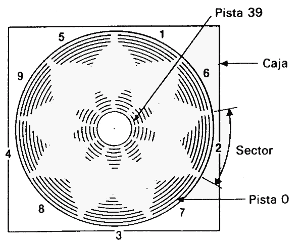

# Introducción

AMSTRAD CPC664
Sistema integrado ordenador/disco

## Quiénes somos ...

El AMSTRAD CPC664 continúa la tradición del sistema informático CPC464. La gran acogida de que ha gozado este ordenador nos ha inducido a dar el siguiente paso lógico: combinar lo mejor del CPC464 con la unidad de disco DD1, junto con muchas otras innovaciones. El sistema resultante, el CPC664, ofrece unas prestaciones y una riqueza de posibilidades que no tienen rival hoy por hoy en el mundo de los ordenadores personales.

El CPC664 está apoyado por uno de los fabricantes de productos electrónicos de gran consumo más grandes del país. Por otra parte, el club de usuarios AMSTRAD, con su revista mensual, se ha convertido ya en la principal y más fiable fuente de información y noticias.

## Disponibilidad de programas y compatibilidad...

El CPC664 puede utilizar prácticamente todos los programas escritos para el CPC464; esto significa que el usuario del CPC664 puede elegir, sin necesidad de espera alguna, entre los muchos programas publicados por AMSOFT y otras casas de software.


## ¿Por qué con discos?

Es indudable que el disco está sustituyendo al cassette como medio de almacenamiento de datos y programas, salvo quizá en el caso de los usuarios menos asiduos. No obstante, dado que la potencia y facilidad del uso del CPC464 ha convertido rápidamente muchos de esos usuarios menos asiduos en entusiastas de la informática, el 664 será el ordenador idóneo para ellos.


## Gracias a Digital Research...

La potencia del sistema operativo CP/M, de Digital Research, nunca antes ha estado disponible a precio tan asequible. Creemos que el futuro nos depara grandes novedades en programación, ahora que disponemos de un medio cuya capacidad de memoria es de 160K por cada cara. Por otra parte, el Dr. LOGO, también de Digital Research, ha llegado a convertirse en el lenguaje educativo y docente de aceptación más universal. Al combinar la inigualable facilidad de uso de los 'gráficos de tortuga' con una gran capacidad de proceso de datos, Dr. LOGO ha demostrado ser la implementación más completa de LOGO de las muchas existentes en el mercado.

## ¡Gracias a Amstrad!

Tanto CP/M como Dr. LOGO se suministran con el sistema CPC664 sin costo adicional.

## ¿Más novedades?

Al desarrollar el CPC664, hemos aprovechado la oportunidad para refinar instrucciones y añadir otras que no estaban incluidas en el BASIC del CPC464 (por ejemplo, rellenado de zonas en la pantalla, lectura de caracteres de la pantalla, conmutación del cursor, sincronización de imagen, etc.). Los programas que utilicen estas funciones no serán compatibles con el CPC464 pero, en cambio, los programas escritos para el CPC464 son utilizables en el CPC664 sin ninguna limitación.


© Copyright 1985 AMSOFT, AMSTRAD Consumer Electronics pie

El contenido de este manual y el producto en él descrito no pueden ser adaptados ni reproducidos, ni total ni parcialmente, salvo con el permiso escrito de AMSTRAD Consumer Electronics plc ('Amstrad').

El producto descrito en este manual, así como los diseñados para ser utilizados con él, están sujetos a desarrollo y mejoras continuas. Toda la información técnica relativa al producto y su utilización (incluida la que figura en este manual) es suministrada por AMSTRAD de buena fe. Admitimos, no obstante, que en este manual puede haber errores u omisiones. El usuario puede obtener una lista de correcciones y modificaciones solicitándola de AMSOFT Technical Enquiries o de sus distribuidores. Rogamos a los usuarios que rellenen y envíen a los distribuidores las tarjetas de registro y de garantía.

Rogamos también a los usuarios que rellenen y envíen la tarjeta de registro de Digital Research.

AMSOFT agradecerá el envío de comentarios y sugerencias relativos a este manual y al producto en él descrito.

Toda la correspondencia se debe dirigir a

AMSOFT

Avda. del Mediterráneo, 9 

28007 Madrid 

España

Toda reparación u operación de mantenimiento de este producto debe ser conñada a los distribuidores autorizados de AMSOFT. Ni AMSOFT ni AMSTRAD pueden aceptar ninguna responsabilidad derivada del daño o pérdida que se pueda ocasionar como resultado de reparaciones efectuadas por personal no autorizado. El objetivo de este manual no es sino servir de ayuda al usuario en la utilización del producto; por consiguiente, AMSTRAD y AMSOFT quedan eximidos de responsabilidad por el daño o pérdida a que pueda dar lugar la utilización de la información aquí publicada o la incorrecta utilización del producto.

Dr LOGO y PC/M son marcas registradas de Digital Research Inc.

Z80 es marca registrada de Zilog Inc.

IBM e IBM PC son marcas registradas de International Business Machines Inc.

AMSDOS, CPC664 y CPC464 son marcas registradas de AMSTRAD Consumer Electronics plc.

Primera edición: 1985

Compilado por Ivor Spital 

Escrito por Roland Perry, Ivor Spital, William Poel, Cliff Lawson; con la colaboración de Locomotive Software Ltd.

Traducido del inglés por Emilio Benito

Publicado por AMSOFT

Edición española producida por Vector Ediciones

AMSTRAD es marca registrada de AMSTRAD Consumer Electronics plc.

Queda estrictamente prohibido utilizar la marca y la palabra AMSTRAD sin la debida autorización.


## IMPORTANTE

Por favor, lea las siguientes ...

### Notas de instalación

1.  Conecte siempre el cable de alimentación a una clavija de tres patillas, siguiendo para ello las instrucciones que se dan en la Parte 1 del «Curso de Introducción».

2.  No intente conectar este equipo a una red de distribución de energía eléctrica que no sea de 220-240 V c.a., 50 Hz.

3.  El mantenimiento que pueda hacer el usuario no requiere en ningún caso acceder al interior de la carcasa. Así pues, no abra nunca el equipo. Confíe todas las reparaciones y operaciones de mantenimiento a personal cualificado.

4.  Para evitar la fatiga visual, ponga el monitor lo más alejado posible del teclado y trabaje con luz ambiente adecuada. Deje el control de brillo (BRIGHTNESS) del monitor lo más bajo posible.

5.  El ordenador debería estar centrado con respecto al monitor, lo más lejos posible de él. Para optimizar la fiabilidad del almacenamiento de datos, la unidad de disco no debería quedar frente al monitor, sino a su derecha. No ponga el ordenador cerca de fuentes de interferencia eléctrica.

6.  Evite que las unidades de disco y los propios discos estén sometidos a la influencia de campos magnéticos.

7.  Si tiene conectada la segunda unidad de disco, mantenga alejado el cable de datos del cable de alimentación.

8.  No obstruya ni cubra los orificios de ventilación.

9.  No utilice ni almacene el equipo a temperaturas demasiado altas ni demasiado bajas, ni en lugares húmedos ni polvorientos.

### Notas de operación

(No se preocupe si al principio le resulta extraña la terminología utilizada en esta sección; el significado de estas advertencias irá quedando más claro según avance en la lectura de este manual.)

1.  No encienda ni apague el sistema mientras haya un disco en la unidad, so pena de perder la información en él grabada.

2.  Haga copias de todos los discos que contengan datos o programas valiosos. En particular, copie el disco de CP/M que se suministra con el CPC664, pues si se deteriorase accidentalmente su sustitución sería costosa.

3.  Para evitar el riesgo de borrar accidentalmente el disco de CP/M, cerciórese de que los orificios de protección del disco estén abiertos.

4.  Si está utilizando un sistema de dos discos, es decir, si ha adquirido una unidad AMSTRAD FD1 adicional, encienda siempre la segunda unidad antes que el ordenador.

5.  No toque la superficie de los discos.

6.  No extraiga el disco mientras el ordenador no haya terminado de leer o escribir en él.

7.  Recuerde que al formatear los discos se borra su contenido anterior.

8.  El interfaz de la unidad de discos ocupa una pequeña porción de la memoria. Algunos programas publicados en cassette para el CPC464 aprovechan esa zona de la memoria, y por lo tanto no pueden funcionar en el sistema CPC664+cassette. En caso de duda sobre la compatibilidad de los programas basados en cinta, póngase en contacto con AMSOFT o con su distribuidor. Tenga en cuenta, no obstante, que casi todos los programas de AMSOFT están disponibles en disco para su utilización en el CPC664.

9.  El acuerdo de licencia para el sistema operativo CP/M (que está codificado mediante un número de serie grabado en el disco) permite su utilización en un solo ordenador. Esto significa, en particular, que al usuario le está prohibido ceder a otras personas copias de su CP/M. Lea atentamente el Acuerdo de Licencia para el Usuario Final (apéndice 1 de este manual).

# CONTENIDO


# Capítulo 1. Curso de introducción

## Parte 1: Instalación ...

El CPC664 puede ser instalado con:

 1. El monitor de fósforo verde AMSTRAD GT65.
 
 2. El monitor de color AMSTRAD CTM644.
 
 3. O la unidad modulador/fuente de alimentación AMSTRAD MP2 conectada a un televisor de color (en UHF).

### Instalación de una clavija de red

El CPC664 sólo se puede conectar a la red de 220-240V c.a., 50 Hz. Para realizar la conexión se debe utilizar la clavija adecuada, que habrá de ser instalada en el GT65, en el CTM644 o en la unidad MP2. Cualquiera que sea el tipo de clavija, es conveniente proteger la entrada de corriente alterna con un fusible de 5 amperios.

### Importante

Los hilos del cable de alimentación tienen el siguiente código de colores:

Azul: neutro

Marrón: activo

Estos colores pueden no corresponder con los de los cables que llegan a la toma mural. El criterio de conexión debe ser, pues, el siguiente:

El hilo AZUL debe ser conectado a la masa de la toma mural (hilo que suele ser de color negro, o bien amarillo y verde).

El hilo MARRÓN debe ser conectado al activo de la toma mural.

Desenchufe la clavija de la toma mural siempre que no esté utilizando el ordenador.

No extraiga ningún tornillo ni trate de abrir la carcasa del ordenador, del monitor ni de la unidad MP2. Lea y respete las advertencias que se dan en la etiqueta de características, que está situada en la cara inferior de la carcasa del ordenador y de la fuente de alimentación, y en la cara posterior de los monitores:

WARNING! LIVE PARTS INSIDE. DO NOT REMOVE ANY SCREWS

(¡Precaución! Circuitos activos en el interior. No extraiga ningún tornillo.)


### Conexión del ordenador a un monitor

(Si va a utilizar su CPC664 con la unidad MP2, no es necesario que lea esta sección.)

1.  Cerciórese de que el monitor no está conectado a la red.

2.  Conecte el cable que sale de la cara frontal del monitor y termina en una clavija grande (DIN de 6 patillas) al zócalo posterior del ordenador marcado con **MONITOR**.

3.  Conecte el cable que sale de la cara frontal del monitor y termina en la clavija más pequeña (5V c.c.) al zócalo posterior del ordenador marcado con **5V DC**.

4.  Conecte el cable que sale de la cara posterior del ordenador y termina en una clavija pequeña (12V c.c.) al zócalo que hay en la cara frontal del monitor.


### Conexión del ordenador a la unidad modulador/fuente de alimentación MP2

La MP2 es una unidad opcional que el usuario puede querer adquirir si está utilizando actualmente el CPC664 con el monitor de fósforo verde GT65. La MP2 permite conectar el CPC664 a un televisor de color doméstico, para así disfrutar de las posibilidades de color del CPC664.

La MP2 se debe colocar inmediatamente a la derecha del CPC664.

1.  Cerciórese de que la MP2 no está conectada a la red.

2.  Conecte el cable de la MP2 que termina en una clavija grande (DIN de 6 patillas) al zócalo posterior del ordenador marcado con **MONITOR**.

3.  Conecte el cable que sale de la MP2 y termina en una clavija pequeña (5V c.c.) al zócalo posterior del ordenador marcado con **5V DC**.

4.  Conecte el cable que sale de la MP2 y termina en una clavija de antena a la entrada de antena de su televisor.

5.  Conecte el cable que sale de la cara posterior del ordenador y termina en una clavija pequeña (12V c.c.) al zócalo posterior de la MP2.


### Encendido del sistema CPC664 con GT65 o con CTM644

(Si va a utilizar su CPC664 con la unidad MP2, no es necesario que lea esta sección.)

Una vez conectado el sistema según se ha explicado en secciones anteriores, inserte la clavija de red en la toma mural. Para encender el sistema, pulse el botón **POWER** que está en la cara frontal del monitor, de modo que quede en posición «IN». Si este botón está en «OFF», el suministro de corriente al resto del sistema queda interrumpido.

Encienda el ordenador mediante el interruptor deslizante marcado con **POWER**, que está en su cara derecha.

En este momento se debe encender el piloto rojo (**ON**) que está en el centro del teclado; en el monitor se verá el siguiente mensaje:


Para evitar la fatiga visual excesiva, ajuste el control marcado con **BRIGHTNESS** al mínimo necesario para que el texto se vea cómodamente, sin que deslumbre ni resulte borroso.

El control **BRIGHTNESS** se encuentra en la parte inferior de la cara frontal del monitor GT65 y en el lateral derecho del CTM644.

En el caso del GT65, puede ser necesario ajustar los controles de **CONTRAST** y **Vertical HOLD** que están en el panel frontal.

El mando de **CONTRAST** se debe poner en el mínimo compatible con la cómoda visualización de los textos.

El mando de **Vertical HOLD** está marcado con **V-HOLD** en el GT65; su ajuste debe hacer que la imagen sea estable y quede centrada en la pantalla.

### Encendido del sistema CPC664 con la unidad modulador/fuente de alimentación MP2

Una vez conectado el sistema según se ha explicado en secciones anteriores, inserte la clavija de red en la toma mural. Encienda el ordenador mediante el interruptor deslizante **POWER** que está en su lateral derecho.

En este momento se debe encender el piloto rojo (**ON**) que está en el centro del teclado. Ahora debe sintonizar el televisor para recibir las señales del ordenador.

Si su televisor tiene un selector de canales de botonera, pulse el botón correspondiente a un canal no utilizado. Ajuste el mando de sintonía siguiendo las instrucciones del manual del televisor (si dispone de un dial de sintonía, pruebe en las proximidades del canal 36) hasta obtener la siguiente imagen:


Trate de conseguir la máxima nitidez posible. El texto aparecerá en color amarillo dorado sobre fondo azul.

Si el televisor tiene un selector de canales rotatorio, gírelo hasta que pueda ver la imagen y ésta sea estable (canal 36, aproximadamente).

### Otras conexiones ...

Si desea conectar otros periféricos, tales como 

 - Joystick(s)
 - Magnetófono de cassettes 
 - Impresora
 - Segunda unidad de discos 
 - Amplificador o altavoces externos 
 - Dispositivos de expansión 
 - etc.,
  
al sistema básico, consulte la Parte 2 de este «Curso de Introducción».

Finalmente, asegúrese de que ha tenido en cuenta las advertencias que hemos hecho al principio de este manual, en la sección titulada 'IMPORTANTE':

NOTAS DE INSTALACIÓN 1, 2, 3, 4, 5, 6, 7 y 8. 

NOTA DE OPERACIÓN 1.


## Parte 2: Conexión de los periféricos ..

En esta sección vamos a explicar cómo se conectan al sistema CPC664 diversos periféricos, cuyo funcionamiento se explica en las correspondientes secciones de este manual.

### Joystick

El joystick AMSOFT modelo JY2 es un aparato opcional que el usuario puede desear adquirir si va a utilizar su CPC664 con programas de juegos diseñados para aprovechar las posibilidades de control y disparo del joystick.

Conecte el cable procedente del joystick en el zócalo marcado con **JOYSTICK** en el ordenador. El CPC664 admite dos joysticks; el segundo se conecta en el zócalo que hay en la peana del primero.

Con este ordenador se puede utilizar también el joystick AMSOFT modelo JY1. 

En secciones posteriores de este manual daremos más información sobre los joysticks.

### Magnetófono de cassettes

Los programas pueden ser leídos o grabados en cinta, en lugar de en disco. Más adelante describiremos las órdenes que indican al ordenador cuándo debe leer o enviar datos a la cinta o al disco.

Para conectar el magnetófono al ordenador se requiere el cable AMSOFT CL1, o un cable estándar equivalente.

Inserte el extremo del cable que termina en una clavija grande (DIN de 5 patillas) en el zócalo del ordenador que está marcado con **TAPE**.


Inserte la clavija en la que termina el cable azul en la hembra del magnetófono que esté marcada con **REMOTE** o **REM**.

Inserte la clavija en la que termina el cable rojo en la hembra del magnetófono que esté marcada con **MIC**, **COMPUTER IN** o **INPUT**.


Inserte la clavija en la que termina el cable blanco en la hembra del magnetófono que esté marcada con **EAR**, **COMPUTER OUT** o **OUTPUT**.

Es importante observar que el éxito en la transferencia de datos entre el CPC664 y la cinta depende en gran medida del correcto ajuste del control de **LEVEL** o de **VOLUME** del magnetófono. Si encuentra dificultad en la grabación o lectura de los programas, pruebe con diferentes posiciones del control de volumen del magnetófono hasta optimizar los resultados.

### Impresora

El CPC664 puede ser conectado a cualquier impresora de tipo Centronics. Para conectar el ordenador a la impresora AMSTRAD DMP1, basta con utilizar el cable suministrado con ésta.

Para conectar cualquier otra impresora de tipo Centronics se necesita el cable AMSOFT PL1.

Inserte el extremo del cable que termina en un conector plano en el zócalo del ordenador marcado con **PRINTER**. Inserte el otro extremo del cable, que termina en el conector de tipo Centronics, en el zócalo de la impresora. Si la impresora tiene abrazaderas de seguridad, fíjelas en las ranuras que hay en los laterales del conector.

Más adelante daremos información sobre el manejo de la impresora.

### Segunda unidad de disco (AMSTRAD FD1)

La unidad AMSTRAD FD1 se puede incorporar al sistema como segunda unidad de disco. Las ventajas de disponer de dos unidades serán particularmente evidentes para el usuario habitual de CP/ M, pues muchos programas están diseñados para funcionar con el disco de programas en una unidad y los ficheros de datos en la otra.

El sistema operativo CP/M siempre requiere que los programas se carguen desde el disco (no permite el acceso a la ROM de BASIC). CP/M permite acceder a ficheros múltiples mediante una técnica de recubrimiento que hace posible la ejecución de programas que de otra forma no cabrían en la RAM; pero en muchas ocasiones el disco de programas contiene tantos, que prácticamente no queda espacio para los ficheros de datos.

Gracias a la versatilidad de los programas de ayudas suministrados con el disco del sistema, todas las operaciones de mantenimiento de ficheros (copia, borrado, etc.) se pueden realizar con una sola unidad de disco. Sin embargo, la segunda unidad facilita y acelera estos procesos, y reduce notablemente el riesgo de accidentes.


Para conectar la unidad FD1 al CPC664 se requiere el cable AMSOFT DI2.

Inserte el conector plano en el zócalo del ordenador que está marcado con **DISC DRIVE 2**.

Inserte el otro conector del cable en el zócalo de la unidad FD1.

**NO OLVIDE** que, antes de encender o apagar la segunda unidad de disco, debe extraer los discos que pueda haber en ambas unidades y apagar el sistema. Si se modifica alguna conexión mientras el sistema está encendido, lo más probable es que se pierda o altere el programa actualmente residente en la memoria. Tenga la precaución de grabar el programa antes de modificar las conexiones de los periféricos.

Si tiene conectada una FD1 al CPC664, encienda **primero** la FD1 con el interruptor deslizante que está en el panel posterior; **después** encienda el CPC664 con el interruptor deslizante que está en la cara derecha del ordenador. Deberán iluminarse los dos pilotos, rojo y verde, de la FD1; esto indicará que la segunda unidad de disco está preparada para su uso.

Más adelante explicaremos el funcionamiento de la segunda unidad de disco.

### Amplificador y altavoces externos

El CPC664 puede ser conectado a un sistema de amplificador y altavoces estereofónicos, única forma de apreciar plenamente las capacidades sonoras del ordenador.

El cable de entrada al amplificador debe terminar en una clavija estéreo de 3.5 mm, que se inserta en la hembra marcada con **STEREO** en el ordenador.

Las conexiones de la clavija deben ser las siguientes:

 - Extremo de la clavija: canal izquierdo. 
 - Anillo interno: canal derecho. 
 - Cuerpo de la clavija: masa.

El CPC664 entrega a la salida **STEREO** una señal de nivel constante; así pues, el volumen, el balance y el tono deben ser regulados con los mandos del amplificador externo.

También se pueden conectar auriculares de alta impedancia, aunque el volumen no podrá ser regulado por el mando de **VOLUME** del ordenador. Los auriculares de baja impedancia, que son los habitualmente utilizados con los equipos de alta fidelidad, no se pueden conectar directamente al ordenador.

Más adelante explicaremos cómo enviar sonidos a cada uno de los tres canales del CPC664.


### Dispositivos de expansión

Al ordenador CPC664 se le pueden conectar diversos dispositivos de expansión (interfaz serie, modem, lápiz fotosensible, ROMs, etc.) por medio del zócalo marcado con **EXPANSION** que está en la cara posterior del ordenador.

También se puede conectar en ese zócalo el amplificador/sintetizador de voz AMSOFT modelo SSA2.

Las conexiones del zócalo **EXPANSION** se describen en el capítulo titulado 'Para su información...'

Finalmente, antes de proseguir, asegúrese de que ha tenido en cuenta las advertencias que hemos hecho al principio de este manual, en la sección titulada 'IMPORTANTE':

NOTAS DE INSTALACIÓN 6 y 7 
NOTAS DE OPERACIÓN 4 y 8


## Parte 3: En cuanto a los discos ...

El AMSTRAD CPC664 usa discos compactos de 3 pulgadas. Le sugerimos que no corra riesgos indebidos y que, para garantizar la fiabilidad de la transferencia de datos del ordenador a discos, utilice solamente los discos AMSOFT CF2. Puede, no obstante, utilizar también los de otras marcas de máxima garantía.

### Inserción

Se pueden utilizar las dos caras del disco, aunque no simultáneamente. La forma correcta de insertar los discos es con la etiqueta hacia fuera (visible) y con la cara que se va a usar hacia arriba:


### Protección contra escritura

En el extremo posterior izquierdo de cada cara del disco se puede ver una flecha que señala un pequeño orificio obturado: es el orificio de 'protección contra escritura', cuya misión es evitar el borrado accidental del contenido del disco:


Cuando el orificio está cerrado, el ordenador puede 'escribir' en el disco. En cambio, si el orificio está abierto, el disco está protegido contra el borrado accidental de programas o datos valiosos.

Los diversos fabricantes utilizan diferentes mecanismos de apertura y cierre del orificio. En los discos AMSOFT CF2 el funcionamiento es como sigue:
Para abrir el orificio, haga deslizar el pequeño obturador situado en la esquina izquierda del disco:


Para cerrar el orificio, haga deslizar el obturador en sentido contrario.

En algunos discos compactos el mecanismo consiste en una pequeña palanca de plástico situada en una ranura que tienen en la esquina izquierda:


Para abrir el orificio en los discos de este tipo, desplace la palanca hacia el centro del disco, ayudándose con la punta de un bolígrafo u objeto similar:


Observe que, cualquiera que sea el mecanismo de obturación, el efecto es siempre el mismo: el disco queda protegido cuando el orificio está abierto.

**IMPORTANTE**

Cerciórese de que los orificios de protección de su disco maestro de CP/M están abiertos.

### Después de introducido el disco

En la cara frontal de la unidad de disco hay un piloto rojo y un botón de eyección:


### Piloto

Cuando está encendido, indica que el ordenador está leyendo datos del disco o escribiendo en él.

Si se ha conectado una segunda unidad de disco (unidad B), su piloto estará encendido constantemente, y se apagará cuando se encienda el de la unidad principal (unidad A).

### Botón de eyección

Al pulsar este botón se expulsa parcialmente el disco, lo que permite que el usuario lo extraiga.

Finalmente, antes de proseguir asegúrese de que ha tenido en cuenta las advertencias que hemos hecho al principio de este manual, en la sección titulada 'IMPORTANTE':

NOTAS DE OPERACIÓN 1, 3, 4, 5 y 6

## Parte 4: Manos al teclado ...

Antes de empezar a cargar y grabar programas necesitamos familiarizarnos con algunas teclas del ordenador. Si tiene usted alguna experiencia en el manejo de los ordenadores, puede omitir la lectura de esta sección.

Encienda el ordenador y verá el mensaje inicial en la pantalla. Vamos a explicar las funciones de diversas teclas:

### ← → ↑ ↓ TECLAS DE MOVIMIENTO DEL CURSOR

Las cuatro teclas que están marcadas con sendas flechas (y situadas junto a la tecla **[COPY]**) son las 'teclas de movimiento del cursor'. Estas teclas sirven, pues, para mover el cursor por la pantalla.

Púlselas todas ellas y practique hasta familiarizarse con su funcionamiento. 


### [ENTER]

Hay dos teclas **[ENTER]**. Ambas sirven para introducir en el ordenador lo que usted ha tecleado. Una vez pulsada la tecla **[ENTER]**, el cursor salta automáticamente a la línea siguiente de la pantalla. Siempre que teclee una orden directa o una instrucción de programa, pulse **[ENTER]** al final.
De ahora en adelante escribiremos **[ENTER]** para indicar que se debe pulsar esta tecla al terminar de teclear órdenes o instrucciones de programa.

### [DEL]

Esta tecla sirve para borrar el carácter (letra, número o signo) que está a la izquierda del cursor.

Teclee **abcd** y observe que el cursor queda inmediatamente a la derecha de la letra **d**. Para borrar la **d**, pulse la tecla **[DEL]**. Si la mantiene pulsada durante algún tiempo, verá cómo se borran también las otras tres letras.

### [SHIFT]

Hay dos teclas **[SHIFT]**, una a cada lado del teclado. Si mantiene pulsada una de ellas al tiempo que pulsa una tecla literal (de letras), en la pantalla aparecerá la correspondiente letra *en mayúscula*.

Teclee la letra **e**, pulse la tecla **[SHIFT]** y, antes de soltarla, vuelva a teclear la **e**. En la pantalla verá lo siguiente:

```
eE
```

Teclee ahora unos cuantos espacios (manteniendo pulsada durante algún tiempo la barra espaciadora). Para probar el efecto de **[SHIFT]** con las teclas numéricas, teclee el **2**, pulse **[SHIFT]** y, sin soltarla, vuelva a teclear el **2**. En la pantalla aparecerá lo siguiente:

```
2"
```

Haga prueba con las diferentes teclas de caracteres para observar su efecto con y sin **[SHIFT]**.

### [CAPS LOCK]

Su efecto es en cierto modo similar al de **[SHIFT]**. Con sólo pulsarla una vez, las letras que se escriban a continuación aparecerán en mayúsculas en la pantalla, pero, en cambio, las teclas numéricas y de signos no resultan afectadas.

Pulse **[CAPS LOCK]** una sola vez y luego teclee lo siguiente:

```
abcdef123456 
```

En la pantalla aparecerá lo siguiente: 

```
ABCDEF123456
```

Observe que las letras han sido convertidas a mayúsculas y que, sin embargo, los números no han sido convertidos a los signos que están grabados en la parte superior de las teclas numéricas. Para obtener estos signos, pulse la tecla correspondiente en combinación con **[SHIFT]**. Escriba ahora lo siguiente, manteniendo pulsada la tecla **[SHIFT]**:

```
abcdef123456
```

En la pantalla aparecerá:

```
ABCDEF!"#$%&
```

Para volver a caracteres normales (en minúscula), pulse por segunda vez **[CAPS LOCK]**.

Si lo que desea es obtener letras mayúsculas y los signos marcados en la parte superior de las teclas, sin tener que mantener pulsada la tecla **[SHIFT]**, puede hacer lo siguiente: mantenga pulsada la tecla **[CTRL]** y pulse **[CAPS LOCK]** una sola vez. Para comprobar el efecto de esta combinación, teclee lo siguiente:

```
abcdef123456
```

En la pantalla aparecerá:

```
ABCDEF!"#$%&
```

En esta situación, se pueden escribir números utilizando el teclado numérico que está a la derecha del teclado principal.

Manteniendo pulsada la tecla **[CTRL]** al tiempo que se pulsa **[CAPS LOCK]** se vuelve al modo anterior (es decir, a minúsculas o a bloqueo de mayúsculas). Si el modo al que ha vuelto es a bloqueo de mayúsculas, pulse **[CAPS LOCK]** para retornar al modo normal, esto es, a minúsculas.

### [CLR]

Esta tecla borra el carácter que está bajo el cursor.

Escriba **ABCDEFGH**. El cursor ha quedado a la derecha de la última letra (la H). Pulse cuatro veces la tecla **←**. El cursor se ha movido cuatro posiciones hacia la izquierda, de modo que está superpuesto a la letra **E**.

Observe que la letra **E** es visible a través del cursor. Pulse **[CLR]** y observe cómo desaparece la letra **E** y cómo se mueven hacia la izquierda las letras **FGH**; bajo el cursor queda la **F**. Pulse durante unos instantes **[CLR]**: primero desaparece la **F**, y luego la **G** y la **H**.

### [ESC]

Esta tecla se utiliza para abandonar una función que el ordenador esté realizando. Si se pulsa **[ESC]** una vez, el ordenador interrumpe su tarea momentáneamente, y la reanuda si a continuación se pulsa cualquier otra tecla.

Si se pulsa **[ESC]** dos veces seguidas, el ordenador abandona definitivamente la tarea que está realizando y queda a la espera de otras órdenes.

### Importante

Cuando se han tecleado 40 caracteres en una línea, el cursor está en el extremo derecho de ella; el siguiente carácter aparecerá automáticamente al principio de la línea siguiente. Esto significa que **no se debe pulsar [ENTER]**, a diferencia de lo que se haría si se estuviera trabajando con una máquina de escribir, en la que se ha de teclear el retorno del carro al acercarse al final de cada línea.

El ordenador realiza esta función automáticamente; ante un **[ENTER]** indebido, reaccionará con un mensaje de error, generalmente **Syntax error**, bien en el acto o bien más tarde, cuando se ejecute el programa.

### Syntax error (error de sintaxis)

Cuando en la pantalla aparece el mensaje **Syntax error**, el ordenador está diciendo que no ha entendido la orden que se le ha dado.

Por ejemplo, escriba

```
printt [ENTER]
```

En la pantalla aparecerá el mensaje:

```
Syntax error
```

Esto ocurre porque el ordenador no entiende la instrucción **printt**. 

Si el mismo error se comete en una línea de programa, tal como

```
10 printt "abc" [ENTER]
```

el mensaje **Syntax error** no aparece hasta que se ejecute el programa. Teclee:

```
run [ENTER]
```

(Esta orden pide al ordenador que ejecute el programa que tiene en este momento almacenado en la memoria.) En la pantalla aparece:

```
Syntax error in 10 
10 printt "abc"
```

Este mensaje indica en qué línea se ha detectado el error y exhibe la línea con el cursor ya preparado para que el usuario pueda corregirla.

Lleve el cursor, con la tecla hasta una letra **t** de **printt**. Pulse **[CLR]** para borrar la **t** que sobra y luego pulse **[ENTER]** para introducir la línea corregida en el ordenador.

Teclee ahora:

```
run [ENTER]
```

El ordenador ha entendido la instrucción; de hecho, ha escrito en la pantalla:

```
abc
```

Finalmente, asegúrese de que ha tenido en cuenta las advertencias que hemos hecho al principio de este manual, en la sección titulada 'IMPORTANTE':

NOTAS DE INSTALACIÓN 4 y 5 

NOTA DE OPERACIÓN 1


## Parte 5: Carga de programas ...

Vamos a hacer una demostración de lo rápida que es la carga de programas grabados en disco. Encienda el equipo, inserte el disco maestro de CP/M con la cara 1 hacia arriba y teclee lo siguiente:

```
run "rointime.dem" [ENTER]
```

@@@ Seguir 31 (01/12)

Al cabo de unos segundos el programa habrá quedado cargado en la memoria del ordenador. Responda a la pregunta de si está utilizando un monitor de fósforo verde (teclee Y para 'sí', o N para 'no') y podrá ver una demostración del juego 'Roland in Time' en la pantalla. Quizá se anime a comprarlo.

Cuando haya terminado de ver la demostración, puede 'escapar' del programa de la siguiente forma: pulse las teclas **[CTRL]** y **[SHIFT]** y, antes de soltarlas, pulse **[ESC]**. Esta acción reinicializa por completo la máquina; llévela a cabo siempre que quiera volver a la situación en que se encuentra la máquina cuando acaba de encenderla. (Cuando se reinicializa el ordenador de esta forma, no es necesario extraer el disco que pueda haber en la unidad.)

Si el programa no se ha cargado normalmente, estudie el mensaje que ha aparecido en la pantalla para averiguar qué ha ocurrido. Por ejemplo,

```
Drive A: disc missing 
Retry, Ignore or Cancel?
```

significa que no ha insertado el disco, o que no lo ha hecho correctamente, o quizá que lo ha puesto en la unidad B.

```
ROINTIME.DEM not found
```

significa que no ha puesto el disco correcto, o que ha puesto la cara 2, o que no ha tecleado correctamente el nombre del programa, ROINTIME.DEM.

Si aparece el mensaje 

```
Bad command
```

lo más probable es que haya tecleado mal ROINTIME.DEM, quizá incluyendo un espacio o un signo de puntuación.

```
Type mismatch
```

significa que ha omitido las comillas (").

```
Syntax error
```

indica que ha tecleado incorrectamente la orden **run**.

El mensaje

```
Drive A: read fail 
Retry, Ignore or Cancel?
```

indica que el ordenador no ha conseguido leer los datos grabados en el disco. Compruebe que el disco que ha insertado es el correcto y pulse **R** (de **Retry**, "volver a intentarlo"). Éste es el mensaje que aparece siempre que se ha estropeado un disco por dejarlo dentro de la unidad al apagar o encender el sistema.

Cuando hayamos explicado cómo hacer copias de los discos, copie sistemáticamente todos los programas valiosos, en particular el disco maestro de CP/M.

## Carga de programas AMSOFT

Esperamos haberle abierto el apetito, así que vamos a cargar un juego.

Inserte en la unidad un disco de juegos y teclee

```
run "disc" IENTER]
```

Al cabo de unos segundos el juego estará cargado y en marcha. Si teclea **run"disc"** con el disco maestro de CP/M instalado en la unidad, podrá ver y oír el programa de demostración 'Welcome'.

Cuando haya terminado de ver 'Welcome', reinicialice el ordenador mediante las teclas **[CTRL]**, **[SHIFT]** y **[ESC]**.

La orden descrita (**run"disc"**) sirve para cargar casi todos los programas de AMSOFT grabados en disco, aunque en ocasiones habrá que teclear algo distinto. En todo caso, las instrucciones de carga están impresas en la etiqueta del disco; sígalas siempre escrupulosamente.

Para terminar, asegúrese de que ha tenido en cuenta las advertencias que hemos hecho al principio de este manual, en la sección titulada 'IMPORTANTE':

NOTA DE INSTALACIÓN 6

NOTAS DE OPERACIÓN 1, 5 y 6


## Parte 6: Empecemos a trabajar ...

A estas alturas ya sabemos qué podemos y qué no podemos hacer con el ordenador, así como la forma de conectarle periféricos. Sabemos para qué sirven algunas teclas del ordenador y cómo cargar programas. Ahora vamos a ver algunas de las órdenes e instrucciones que usted puede teclear para que empiecen a ocurrir cosas ... .

Al ordenador le ocurre lo que a los humanos: sólo puede entender instrucciones que se le dan en un lenguaje que conozca. En el caso del ordenador, ese lenguaje es BASIC (siglas de *Beginners' All-purpose Symbolic Instruction Code*, "código de instrucciones simbólicas de uso general para principiantes"). Las palabras del vocabulario de BASIC son las llamadas "palabras clave", "palabras reservadas" o "palabras de instrucción". Cada una de ellas ordena a la máquina que realice una determinada función. Todos los lenguajes tienen sus reglas gramaticales, y BASIC no es la excepción. En informática, el concepto de gramática se reduce al de 'sintaxis'; de ahí que el ordenador tenga la amabilidad de decirnos de vez en cuando que hemos cometido un error de sintaxis: **Syntax error**.

### Introducción a las palabras clave del BASIC del AMSTRAD

En un capítulo posterior, titulado 'Lista completa de las palabras clave del BASIC del ASMTRAD CPC664', daremos una descripción de todas las palabras del dialecto de BASIC que entiende este ordenador. En esta sección vamos a presentar sólo las que se utilizan con mayor frecuencia.

#### CLS

Para borrar la pantalla escriba: 

```
cls [ENTER]
```

Como puede observar, la pantalla efectivamente se borra y en su extremo superior izquierdo aparecen la palabra Ready y el cursor ■.

Para introducir palabras clave de BASIC valen tanto las letras mayúsculas como las minúsculas.


#### PRINT

Esta instrucción sirve para hacer que el ordenador escriba en la pantalla caracteres sueltos, palabras completas, frases o números. Teclee la siguiente instrucción:

```
print "hola" [ENTER]
```

En la pantalla puede ver:

```
hola
```

Las comillas " " indican al ordenador qué es lo que debe escribir. La palabra **hola** apareció en la pantalla en cuanto se pulsó [ENTER]. Teclee

```
cls [ENTER]
```

para borrar la pantalla.

#### RUN

En el ejemplo anterior hemos visto cómo obedece el ordenador una *orden directa*. Pero esto no siempre es deseable, ya que el ordenador olvida la orden inmediatamente después de ejecutarla. Podemos almacenar en la memoria del ordenador una sucesión de instrucciones para que más tarde sean ejecutadas en un orden determinado. Tal sucesión de instrucciones constituirá un *programa*. Las instrucciones de BASIC que podemos incluir en un programa tienen la forma que hemos visto, pero van precedidas de un *número de línea*. Si el programa consta de más de una instrucción, los números de línea indican al ordenador en qué orden debe ejecutarlas. Cuando después de teclear una línea de instrucción se pulsa **[ENTER]**, la línea queda almacenada en la memoria hasta que pidamos al ordenador que ejecute el programa. Escriba lo siguiente:

```
10 print "hola" [ENTER]
```

Observe que en este caso, aunque ha pulsado **[ENTER]**, la palabra **hola** no ha aparecido en la pantalla, sino que ha quedado almacenada en la memoria del ordenador, incluida en la línea de programa. Para ejecutar este pequeño programa debemos dar al ordenador la orden directa run. Escriba

```
run [ENTER]
```

Ahora sí aparece la palabra **hola** en la pantalla.

Observe algo interesante: en lugar de escribir la palabra **print** completa, basta con teclear el signo de interrogación **?**; por ejemplo,

```
10 ? "hola" [ENTER]
```

#### LIST

Cuando se tiene un programa almacenado en la memoria, se puede comprobar su contenido haciendo un "listado". Escriba

```
list [ENTER]
```

En la pantalla aparece

```
10 PRINT "hola"
```

que es la única línea de nuestro programa.

Observe que ahora la palabra **PRINT** está en mayúsculas. Esto nos indica que el ordenador ha reconocido **PRINT** como palabra clave de BASIC.

Escriba **cls [ENTER]** para borrar la pantalla. Compruebe que, aunque se ha borrado el texto que había en la pantalla, el programa sigue estando en la memoria del ordenador.

#### GOTO

Esta instrucción pide al ordenador que salte de la línea actual a la línea especificada, para no ejecutar un grupo de instrucciones, si el salto es hacia delante, o para formar un bucle, si el salto es hacia atrás. Escriba

```
10 print "hola" [ENTER] 
20 goto 10 [ENTER]
```

y luego

```
run [ENTER]
```

Como puede ver, el ordenador escribe repetidamente la palabra **hola**, a la izquierda de la pantalla, saltando cada vez a la línea siguiente. La razón es que, al llegar a la línea 20, la instrucción **goto 10** reenvía el programa a la línea 10.

Para detener el programa, pulse **[ESC]** una vez. Para reanudarlo, pulse cualquier otra tecla. Para detenerlo definitivamente, de forma que se puedan introducir otras instrucciones, pulse **[ESC]** dos veces.

Escriba ahora

```
cls [ENTER]
```

para borrar la pantalla.

Para inhibir el salto a la línea siguiente de la pantalla cada vez que el ordenador escriba **hola**, teclee nuevamente el programa anterior, pero poniendo ahora un signo de punto y coma (;) al final de las comillas:

```
10 print "hola"; [ENTER] 
20 goto 10 [ENTER] 
run [ENTER]
```

El punto y coma indica al ordenador que debe escribir el siguiente grupo de caracteres inmediatamente a la derecha del anterior (suponiendo que quepan en la misma línea).

Para detener este programa pulse [ESC] dos veces. Escriba otra vez el mismo programa, pero poniendo una coma (,) en lugar del punto y coma (;):

```
10 print "hola", [ENTER] 
run [ENTER]
```

Como puede observar, la coma ha indicado al ordenador que escriba el siguiente grupo de caracteres 13 posiciones a la derecha del lugar en que empezó a escribir el anterior. Esta función es útil cuando se quiere visualizar información en columnas. No obstante, si el número de caracteres del grupo es mayor que 12, la escritura empezará otras 13 posiciones más a la derecha, de forma que entre columnas siempre quedará algún espacio.

Este número, 13, es modificable con la instrucción **ZONE**, que describiremos más adelante.

Para detener este programa, pulse **[ESC]** dos veces. Para borrar completamente la memoria del ordenador, pulse las teclas **[CTRL]** y **[SHIFT]** y, antes de soltarlas, pulse **[ESC]**,

#### INPUT

Esta instrucción hace que el ordenador quede a la espera de que el usuario introduzca información por el teclado; por ejemplo, en respuesta a alguna pregunta.

Escriba lo siguiente:

```
10 input "cuantos años tienes";edad [ENTER] 
20 print "pues no aparentas tener";edad;"años." [ENTER] 
run [ENTER]
```

En la pantalla aparece la pregunta:

```
cuantos años tienes?
```

Escriba su edad y pulse **[ENTER]**, Si, por ejemplo, su edad es 18 años, el programa escribe lo siguiente:

```
pues no aparentas tener 18 años.
```

Este ejemplo ilustra la utilización de **input** combinada con una variable numérica. Hemos puesto la palabra **edad** al final de la línea 10, y por consiguiente en la memoria, para que el ordenador pueda asociarla al número que el usuario introduzca; después, en la línea 20, en lugar de **edad** escribirá ese número. Nada nos obligaba a elegir precisamente ese nombre, **edad**, y podíamos haber utilizado una letra cualquiera, por ejemplo, **b**.

Reinicialice el ordenador para borrar la memoria (teclas **[CTRL]**, **[SHIFT]** y **[ESC]**). Si queremos captar por el teclado una respuesta que esté formada por caracteres cualesquiera (letras solas o letras mezcladas con números), debemos poner el signo de dólar (**\$**) al final del nombre de la variable. Las variables de este tipo son las que denominamos **variables literales**.

Escriba el siguiente programa (observe que en la línea 20 hay que poner un espacio después de la "coma" de **hola,** y otro antes de la **"y"** de **yo**):

```
10 input "como te llamas";nombre$ [ENTER] 
20 print "hola, "; nombre$;", yo me llamo Rolando" [ENTER] 
run [ENTER]
```

En la pantalla puede ver:

```
como te llamas?
```

Escriba su nombre y luego pulse **[ENTER]**, Si el nombre introducido es, por ejemplo, **Manolo**, el programa escribe:

```
hola, Manolo, yo me llamo Rolando
```

En este caso hemos usado **nombre\$** como nombre de la variable literal, pero perfectamente podríamos haber elegido una letra cualquiera, por ejemplo **a$**. Vamos a combinar los dos ejemplos anteriores en un solo programa.

Reinicialice la máquina con **[CTRL]**, **[SHIFT]** y **[ESC]**. Teclee lo siguiente:

```
5 cls [ENTER]
10 input "como te llamas";a$ [ENTER] 
20 input "cuantos años tienes";b [ENTER] 
30 print "desde luego, ";a$;", no aparentas tener ";b; "años" [ENTER] 
run [ENTER]
```

En este programa hemos utilizado dos variables: **a\$** para representar el nombre y **b** para representar la edad. En la pantalla aparece la primera pregunta:

```
como te llamas?
```

Escriba su nombre (supongamos que es Manolo) y luego pulse **[ENTER]**. El ordenador le pregunta ahora:

```
cuantos años tienes?
```

Escriba su edad (supongamos que es 18 años) y luego pulse **[ENTER]**.

Si lo que hemos supuesto es cierto, en la pantalla aparecerá la siguiente frase:

```
desde luego, Manolo, no aparentas tener 18 años
```

#### Edición de programas

Si alguna de las líneas del programa anterior hubiera sido mecanografiada incorrectamente, lo que podría provocar el mensaje de error **Syntax error** o algún otro, en lugar de escribirla de nuevo es posible corregirla ("editarla" es como se dice en informática). Para ilustrar cómo hacerlo, vamos a escribir incorrectamente el programa:

```
5 clss [ENTER]
10 input "como t llamas";a$ [ENTER] 
20 input "cuantos años tienes";b [ENTER] 
30 print "desde luego,";a$;", no aparentas tener";b;"años" [ENTER]
```

En este programa hay tres errores:

 - En la línea 5 hemos escrito **clss** en lugar de **cls**. 
 - En la línea 10 hemos escrito **t** en lugar de **te**.
 - En la línea 30 olvidamos poner un blanco entre la coma y el signo de cerrar comillas.


Hay tres métodos para corregir un programa. El primero consiste en escribir nuevamente la línea errónea. Al hacerlo, la línea nueva sustituye a la que había en la memoria con el método número.

El segundo es el 'método del cursor de edición'.

El tercero es el 'método del cursor de copia'.

#### Método del cursor de edición

Vamos a corregir el error de la línea 5. Escriba lo siguiente:

```
edit 5 [ENTER]
```

En la pantalla aparece la línea 5, por debajo de la 30, con el cursor situado sobre la **c** de **cls**.

Para suprimir la **s** que sobra, pulse la tecla de movimiento del cursor → hasta que éste quede sobre la última **s** de **clss**; pulse la tecla **[CLR]** y observe cómo desaparece la **s**.

A continuación pulse [ENTER] para introducir la versión corregida de la línea 5 en la memoria. Escriba

```
list [ENTER]
```

y comprobará que la línea ha quedado corregida.

La orden **AUTO**, que describiremos más adelante en este manual, se puede combinar con este método para corregir un grupo de líneas sucesivas.

#### Método del cursor de copia

El cursor de copia es un segundo cursor, distinto del que puede ver en este momento en la pantalla, que aparece cuando se pulsa **[SHIFT]** en combinación con alguna de las teclas de movimiento del cursor. De esta forma, el cursor de copia se separa del cursor ordinario y puede ser llevado a cualquier lugar de la pantalla.

Para corregir los errores de las líneas 10 y 30, pulse la tecla **[SHIFT]** y, sin soltarla, pulse ↑ hasta llevar el cursor de copia al principio de la línea 10. Como puede ver, el cursor principal no se ha movido, por lo que hay dos cursores en la pantalla. Ahora pulse varias veces **[COPY]** hasta que el cursor de copia esté sobre el espacio que hay entre la **t** y la palabra **llamas**. Observe que el principio de la línea 10 ha sido copiado en la última línea de la pantalla y que el cursor principal se ha detenido en la misma columna que el de copia. Escriba la letra **e**, que aparecerá solamente en la línea inferior.

El cursor ordinario se ha movido, pero el de copia se ha quedado donde estaba. Pulse ahora **[COPY]** hasta completar la copia de la línea 10. Pulse **[ENTER]** para transferir esta versión de la línea 10 a la memoria. El cursor de copia desaparece y el cursor ordinario queda por debajo de la nueva línea 10.

Para corregir el otro error, mantenga pulsada la tecla **[SHIFT]** y lleve el cursor de copia con la tecla ↑ hasta el principio de la línea 30. Pulse **[COPY]** hasta que el cursor de copia quede sobre las comillas que siguen a la coma. Pulse la barra espaciadora una vez, con lo que se inserta un espacio en la línea nueva. Pulse **[COPY]** y no la suelte hasta que haya terminado de copiar el resto de la línea 30; pulse entonces **[ENTER]**.

Compruebe que el programa ha quedado correctamente almacenado en la memoria escribiendo:

```
list [ENTER]
```

*Nota*. Para llevar el cursor (durante el proceso de edición) al principio o al final de una línea, pulse la tecla ← o la → una vez manteniendo pulsada al mismo tiempo la tecla **[CTRL]**.

Reinicialice el ordenador con las teclas **[CTRL]**, **[SHIFT]** y **[ESC]**.

#### IF

Las palabras clave **IF** (si) y **THEN** (entonces) se combinan para hacer que el ordenador realice una determinada acción en función del resultado de una comprobación especificada. Por ejemplo, en la instrucción

```
if 1+1=2 then print "correcto" [ENTER]
```

el ordenador comprueba si es cierto que 1+1=2 y obra en consecuencia.

La palabra clave **ELSE** (si no) da un segundo curso de acción para el caso de que la comprobación dé como resultado "falso" (o sea, que la condición no se cumpla). Por ejemplo,

```
if 1+1=0 then print "correcto" else print "falso" [ENTER]
```

Vamos a ampliar nuestro programa anterior con la instrucción IF ... THEN. Teclee lo siguiente:

@@revisar eñes y funcionamiento

```
5 cls [ENTER]
10 input "como te llamas";a$ [ENTER]
20 input "cuantos años tienes";edad [ENTER]
30 if edad < 13 then 60 [ENTER]
40 if edad < 20 then 70 [ENTER]
50 if edad > 19 then 80 [ENTER]
60 print "Bueno, ";a$;", todavia no eres un adolescente a los" ; edad; "años": end [ENTER]
70 print "Bueno, ";a$;", a tus"; edad; "años eres un adolescente":end [ENTER] 
80 print "Que le vamos a hacer, ";a$;", ya no eres un adolescente a tus";edad;"años" [ENTER]
```

(Observe que hemos introducido dos símbolos nuevos: <, que significa 'menor que' y está junto a la tecla de la M, y >, que significa 'mayor que' y está junto a la tecla de <.) Para comprobar que el programa ha quedado correctamente introducido escriba

```
list [ENTER]
```

y a continuación

```
run [ENTER]
```

Responda a las preguntas que le haga el ordenador y vea qué ocurre.

En este ejemplo puede observar el efecto de la instrucción **IF ... THEN**. También hemos introducido una palabra clave nueva: **END** (fin); su efecto es concluir la ejecución del programa. Si no estuviera **END** en la línea 60, el programa continuaría en la línea 70. Por lo mismo, si no hubiéramos puesto **END** en la línea 70, el programa no terminaría en ella, sino que ejecutaría también la 80. El signo de dos puntos (:) que precede a la palabra **END**  separa esta palabra de la instrucción anterior. Este signo se puede utilizar para separar instrucciones cuando interese poner varias en una misma línea de programa. También hemos incluido la línea 5, en la que borramos la pantalla. En lo sucesivo seguiremos haciéndolo, para tener programas más 'elegantes' y evitar confusiones.

Reinicialice la máquina pulsando las teclas **[CTRL]**, **[SHIFT]** y **[ESC]**.


#### FOR ... NEXT

Estas palabras clave se utilizan cuando se desea que una parte del programa se repita cierto número de veces. Las instrucciones que deban repetirse son las que se incluyen en el bucle **FOR ... NEXT** (para ... siguiente).

Escriba lo siguiente:

```
5 cls [ENTER]
10 for a=1 to 10 [ENTER]
20 print "operacion numero:";a [ENTER]
30 next a [ENTER]
run [ENTER]
```

Como puede ver, la acción de la línea 20 ha sido realizada 10 veces, tal como exige la instrucción **FOR** de la línea 10. Observe también cómo se ha ido incrementando de 1 en 1 la variable a.

La palabra clave **STEP** (paso) se puede incluir en la instrucción FOR ... NEXT para especificar la forma en que debe incrementarse o decrementarse la variable. Por ejemplo, modifique la línea 10 y ejecute el programa:

```
10 for a=10 to 50 step 5 [ENTER]
```

El paso también puede ser negativo. Por ejemplo:

```
10 for a=100 to 0 step -10 [ENTER] 
run [ENTER]
```


#### REM

REM es abreviatura de **REMark** (observación). Esta instrucción indica al ordenador que debe ignorar todo lo que haya después de ella en la línea de programa. Sirve, pues, para hacer anotaciones al programa; por ejemplo, el título, el significado de una variable, etc.:

```
10 REM Fulminar los invasores [ENTER]
20 S=5:REM numero de supervivientes [ENTER]
```

El signo de comilla ' (que se obtiene de la tecla del 7 con [SHIFT]) es a su vez abreviatura de :REM. Por ejemplo,

```
10 'Fulminar los invasores [ENTER] 
20 S=5 'numero de supervivientes [ENTER]
```

#### GOSUB

Si en un programa hay un grupo de instrucciones que deban ser ejecutadas varias veces, no es necesario escribirlas reiteradamente cada vez que el programa las necesite. Lo que se hace es ponerlas en una 'subrutina', la cual puede ser invocada siempre que se desee mediante la instrucción **GOSUB** (ir a subrutina) seguida del número de la línea donde empieza la subrutina. El final de la subrutina se señala con la instrucción **RETURN** (retorno). Cuando el programa llega a **RETURN**, la ejecución salta a la instrucción siguiente a aquélla que invocó la subrutina.

(Los dos programas siguientes no hacen más que escribir la letra de una canción popular en la pantalla, y por lo tanto no es necesario que se tome la molestia de introducirlos en el ordenador. Los hemos incluido aquí solamente para demostrar cómo se pueden utilizar las subrutinas para realizar tareas repetidas.)

En el siguiente programa:

```
10 MODE 2 [ENTER]
20 PRINT "Dicen que no la quieres y la regalas" [ENTER] 
30 PRINT "Peritas de Don Guindo y uvas tempranas" [ENTER] 
40 PRINT "Al tribulete" [ENTER]
50 PRINT "Que no quiere bailar con usted" [ENTER] 
60 PRINT "Dejala, déjala sola" [ENTER] 
70 PRINT [ENTER]
80 PRINT "Es tu cara lo mismo que luna blanca" [ENTER] 
90 PRINT "Y tus ojos luceros que la acompañan" [ENTER] 
100 PRINT "Al tribulete" [ENTER]
110 PRINT "Que no quiere bailar con usted" [ENTER] 
120 PRINT "Dejala, dejala sola" [ENTER] 
130 PRINT [ENTER]
140 PRINT "Tengo yo comparado, niña, tu rostro" [ENTER]
150 PRINT "Con la luna de enero y el sol de agosto" [ENTER]
180 PRINT "Al tribulete" [ENTER]
190 PRINT "Que no quiere bailar con usted" [ENTER] 
200 PRINT "Dejala, dejala sola" [ENTER] 
210 PRINT [ENTER] 
run [ENTER]
```

puede observar que hemos repetido varias instrucciones. Por ejemplo, la línea **40** (principio del estribillo) está repetida en la 100 y en la 180. Pongamos todo el estribillo en una subrutina, con **RETURN** al final; entonces podremos 'llamarlo' con la instrucción **GOSUB 180** cada vez que lo necesitemos. El programa queda de la siguiente forma:

```
10 MODE 2 [ENTER]
20 PRINT "Dicen que no la quieres y la regalas" [ENTER] 
30 PRINT "Peritas de Don Guindo y uvas tempranas" [ENTER] 
40 GOSUB 180 [ENTER]
80 PRINT "Es tu cara lo mismo que luna blanca" [ENTER] 
90 PRINT "Y tus ojos luceros que la acompañan" [ENTER] 
1000 GOSUB 180 [ENTER]
140 PRINT "Tengo yo comparado, niña, tu rostro" [ENTER]
150 PRINT "Con la luna de enero y el sol de agosto" [ENTER]
170 END [ENTER]
180 PRINT "Al tribulete" [ENTER]
190 PRINT "Que no quiere bailar con usted" [ENTER] 
200 PRINT "Dejala, dejala sola" [ENTER] 
210 PRINT [ENTER] 
220 RETURN [ENTER]
run [ENTER]
```

El ahorro de trabajo es evidente. El correcto diseño de subrutinas es una faceta esencial de la informática. Con ellas se pueden escribir programas 'estructurados'; son la base para la adquisición de buenos hábitos de programación.

Cuando escriba subrutinas, tenga en cuenta que no está obligado a saltar siempre a su primera línea. Por ejemplo, si hay una rutina en las líneas 500 a 800, podría interesar llamarla con **GOSUB 500**, con **GOSUB 640** o con **GOSUB 790**.

Observe que en el programa anterior hemos incluido la instrucción END en la línea 170 para aislar la subrutina del resto del programa. De no haberlo hecho, el programa pasaría de la línea 160 a la 180.

#### Aritmética sencilla

El ordenador se puede utilizar como calculadora.

Para aprender cómo hacerlo, pruebe los siguientes ejemplos. En esta sección utilizamos el signo de interrogación **?** como abreviatura de **print**. El ordenador escribe la respuesta en cuanto se pulsa **[ENTER]**.

##### Suma

(el signo 'más' se obtiene de la tecla del punto y coma **;** con **[SHIFT]**).

Escriba:

```
?3+3 [ENTER]
6
```

(No se teclea el signo =).

Escriba:

```
?8+4 [ENTER]
12
```

##### Resta

(el signo 'menos' está en la tecla del =, sin **[SHIFT]**).

Escriba:

```
?4-3 [ENTER] 
1
```

Escriba:

```
?8-4 
[ENTER] 
4
```

##### Multiplicación

(el signo de multiplicación es el asterisco **\***, que se obtiene de la tecla de dos puntos : con **[SHIFT]**).

Escriba:

```
?3*3 [ENTER] 
9
```

Escriba:

```
?8*4 [ENTER]
32
```

##### División
(el signo de dividir es la barra inclinada /, que se obtiene de la tecla de **?** sin **[SHIFT]**). Escriba:

```
?3/3 [ENTER] 
1
```

Escriba:

```
?8/4 [ENTER] 
2
```

##### División entera

(es la división en la que se ignora el resto; su signo es la barra inclinada hacia la izquierda \\).

Escriba:

```
?10\6 [ENTER] 
1
```

Escriba:

```
?20\3 [ENTER] 
6
```

##### Módulo

(la función **MOD** da el resto de la división entera). 

Escriba:

```
?10 MOD 4 [ENTER]
2
```

Escriba:

```
?9 MOD 3 [ENTER]
0
```

##### Raíz cuadrada

Para hallar la raíz cuadrada de un número se utiliza la función **sqr( )**. El número del que se va a extraer la raíz (esto es, el radicando) se pone entre paréntesis.

Escriba:

```
?sqr(16) [ENTER] 
4
```

(esto significa @@^J\6).

Escriba:

```
?sqr(100) [ENTER] 
10
```

##### Potenciación

(en los ordenadores el signo de "elevar a una potencia" es la flecha hacia arriba, que en el AMSTRAD se obtiene de la tecla de **£** sin **[SHIFT]**).

La potenciación es la operación de elevar un número a una potencia; es decir, multiplicarlo por si mismo tantas veces como indica el exponente. Por ejemplo, 3 al cuadrado (3<sup>2</sup>), 3 al cubo (3<sup>3</sup>), 3 a la cuarta (3<sup>4</sup>), etc. @@@

Escriba:

```
?3↑3 [ENTER] 
27
```

(esto significa 3<sup>3</sup>). Escriba:@@

```
?8↑4 [ENTER]
```

(esto significa 8<sup>4</sup>). 

##### Raíz cúbica

Extraer la raíz cúbica de un número es lo mismo que elevarlo a la potencia (1/3). 

Así, para hallar la raíz cúbica de 27 (-y/27) escriba: @@@

```
?27↑(1/3) [ENTER]
 -3
```

Para hallar la raíz cúbica de 125 escriba:

```
?125↑(1/3) [ENTER] 
5
```

##### Operaciones combinadas (+, *, /)

El ordenador entiende correctamente las operaciones combinadas, pero es necesario saber con qué orden de prioridad las realiza.

La primera prioridad es para la multiplicación y la división, y la segunda para la suma y la resta. Este orden de prioridad es válido solamente para los cálculos en los que no intervienen más que estas operaciones.

Si la operación fuera:

3+7-2*7/4

se podría pensar que el ordenador la realizaría de la forma:

3+7-2*7/4 

= 8*7/4 

= 56/4 

= 14

Sin embargo, el proceso de cálculo es como sigue:

3+7-2*7/4

=3+7-14/4

=3+7-3.5

=10-3.5

=6.5

Compruébelo escribiendo

```
?3+7-2*7/4 [ENTER] 
6.5
```

Para alterar este orden se pueden incluir paréntesis según convenga. El ordenador realiza las operaciones internas a los paréntesis antes que las externas. Compruébelo escribiendo lo siguiente:

```
? (3+7-2)*7/4 [ENTER] 
14
```

El orden completo de prioridad de las operaciones matemáticas es el siguiente:

↑   Potenciación
MOD Módulos
-   Cambio de signo
* y / Multiplicación y división
\   División entera
+ y - Suma y resta

##### Más exponentes

Cuando en los cálculos van a intervenir números muy grandes o muy pequeños, es conveniente utilizar notación científica. La letra **E** (mayúscula o minúscula) indica que el número que está a su derecha es una potencia de 10.

##@@Seguir pag 49 (1/38)

Por ejemplo, 300 es lo mismo que 3X10<sup>2</sup>. En notación científica escribiríamos 3E2. Análogamente, 0.03 es igual a 3*10<sup>-2</sup>; en notación científica, 3E-2. Pruebe los siguientes ejemplos.

Puede escribir

```
?30*10 [ENTER] 
 300
```

o bien

```
?3E1*1E1 [ENTER] 
 300

?3000*1000 [ENTER] ... o bien . . . ?3E3*1E3 [ENTER] 
 3000000

?3000*0.001 [ENTER] ... o bien ... ?3E3*lE-3 [ENTER] 
 3
```

## Parte 7: Grábelo en disco ...

Ahora que ha ejercitado su habilidad como mecanógrafo escribiendo unas cuantas instrucciones, seguramente querrá saber cómo grabar en disco un programa almacenado en la memoria del ordenar, para luego cargarlo del disco al ordenador.

Aunque usted tenga alguna experiencia en la grabación y carga de programas en cinta, hay algunas peculiaridades del sistema de grabación en disco que es necesario tener en cuenta.

Hay dos diferencias fundamentales entre los discos y las cintas. La primera es que, a diferencia de lo que ocurre con las cintas, para grabar en un disco no basta con sacarlo de la caja e introducirlo en la unidad. Los discos nuevos tienen que ser "formateados" o "inicializados"; enseguida veremos cómo hacerlo.

La otra diferencia tiene que ver con los nombres que se pueden dar a los ficheros. En el sistema de grabación en cinta, los nombres de los ficheros prácticamente no siguen ninguna regla, salvo la de la longitud; incluso se pueden grabar ficheros sin nombre. No ocurre así con el sistema de grabación en disco, en el que los nombres de los ficheros deben atenerse a las normas de CP/M, como veremos más adelante.

### Inicialización de discos

Antes de poder escribir datos en un disco virgen es necesario inicializarlo o formatearlo. Esta operación consiste en preparar una especie de estantería en el disco; los estantes son los lugares en los que más tarde se va a almacenar la información.

Al inicializar un disco, éste queda dividido en 360 zonas:



Radialmente el disco se divide el 40 pistas, desde la número 0, que es la más externa, hasta la 39. La circunferencia se divide en 9 sectores.

Cada pista puede almacenar en cada sector 512 bytes; por lo tanto, la capacidad total del disco es de 180K.

### Primeros pasos en la utilización del disco de CP/M

Antes de poder grabar programas en un disco virgen es necesario inicializarlo, y para ello se requiere el disco de CP/M.

Encienda el equipo e inserte el disco de CP/M en la unidad. Si su sistema dispone de dos unidades de disco, utilice la incorporada en el ordenador (unidad A).

Escriba lo siguiente:

```
|cpm [ENTER]
```

(El símbolo | se obtiene de la tecla @ con **[SHIFT]**.)

Al cabo de unos segundos aparecerá en la pantalla el siguiente mensaje:

```
CP/M 2.2 - Amstrad Consumer Electronics plc 
A>
```

Esto es un mensaje de saludo que indica que el sistema operativo está siendo controlado por CP/M.

Los caracteres **A>** constituyen un indicador, análogo al **Ready** de BASIC, que avisa al usuario de que el ordenador está a la espera de sus instrucciones.

Una vez cargado CP/M, ya no se pueden teclear instrucciones de BASIC, pues el ordenador no las entendería.

Por ejemplo, si escribimos

```
cls [ENTER]
```

el ordenador repite lo tecleado junto con un signo de interrogación: 

```
CLS?
```

lo que indica que no ha entendido la instrucción.

Para dar un breve repaso a algunas órdenes de CP/M, escriba: 

```
dir [ENTER]
```

En la pantalla aparece una lista del contenido del disco, incluidas algunas órdenes transitorias. Una de ellas es **format**. Escriba:

```
format [ENTER]
```

En la pantalla aparece el siguiente mensaje:

```
Please insert disc to be formatted into drive A 
then press any key.
```

("Inserte el disco que va a inicializar en la unidad A y luego pulse una tecla cualquiera.") Extraiga el disco de CP/M, introduzca el disco virgen y luego pulse una tecla (gris) cualquiera. El proceso de inicialización comienza con la pista 0 y termina con la 39; una vez concluido, el ordenador le pregunta:

```
Do you want to format another disc (Y/N):
```

("Quiere inicializar otro disco (S/N):") Si desea inicializar la otra cara del disco, o bien un segundo disco, responda pulsando la tecla **Y** (de yes, si) y volverá a aparecer el mensaje inicial.

Este proceso se puede repetir cuantas veces se desee, hasta que se responda con **N** (de "no") a la pregunta, momento en el que el ordenador pide al usuario que:

```
Please insert a CP/M system disc into drive A then press any key:
```

('Por favor, inserte un disco de CP/M en la unidad A y luego pulse una tecla cualquiera.5) Una vez hecho esto, el ordenador vuelve a modo CP/M directo y queda a la espera de nuevas instrucciones. Más adelante describiremos otras funciones de CP/M. Por ahora nos basta con haber aprendido a inicializar discos con CP/ M. Reinicialice el ordenador con **[CTRL]**, **[SHIFT]** y **[ESC]**.

Guarde siempre en lugar seguro el disco maestro de CP/M, que es, literalmente, la llave del sistema. En un capítulo posterior explicaremos cómo hacer una "copia de trabajo" del disco de CP/M, de forma que pueda guardar el original a salvo de toda posibilidad de accidente.

**PRECAUCIÓN**

AL INICIALIZAR UN DISCO QUE CONTENGA ALGÚN FICHERO SE BORRA
SU CONTENIDO

No es posible inicializar un disco que tenga el orificio de protección abierto. Si lo intenta, el ordenador responderá con el mensaje:

```
Drive A: disc is write protected 
Retry, Ignore or Cancel?
```

Pulse **C** para cancelar la orden y luego siga las instrucciones que aparezcan en la pantalla.

Ahora que ya tenemos uno o dos discos preparados, vamos a empezar a transferir programas de BASIC del ordenador al disco y viceversa.

### Grabación de un programa en disco

Cuando se tiene un programa en la memoria del ordenador, se lo puede grabar en disco mediante la orden

```
save "nombrefi" [ENTER]
```

Observe que es indispensable dar un nombre al programa.

El nombre de un fichero grabado en disco consta de dos partes (campos). La primera es obligatoria y puede contener hasta 8 caracteres. Se pueden utilizar letras o números, pero no espacios ni signos de puntuación. Este primer campo suele contener el nombre del programa.

El segundo campo es opcional. Puede contener hasta 3 caracteres que no sean ni espacios ni signos de puntuación. Los dos campos se separan por un punto (.).

Si el usuario no especifica el segundo campo, el sistema le asigna automáticamente un distintivo: **.BAS** para ficheros de BASIC o **.BIN** para ficheros binarios (en código de máquina).

Para practicar la grabación en disco, introduzca un programa corto en la memoria del ordenador, inserte en la unidad un disco inicializado y escriba lo siguiente:

```
save "ejemplo" [ENTER]
```

Al cabo de unos segundos aparecerá en la pantalla el mensaje **Ready**, lo que indica que el programa ha quedado grabado en el disco. (De no ser así, observe los mensajes emitidos por el ordenador, pues puede ocurrir que no haya insertado el disco en la unidad correcta, que esté abierto el orificio de protección o que se haya equivocado al teclear la orden.)

### Catálogo

Una vez grabado el programa, escriba lo siguiente:

```
cat [ENTER]
```
En la pantalla podrá ver

```
Drive A: user 0 
EJEMPLO.BAS 1K 
168 K free
```

o sea, el nombre del fichero, incluido el segundo campo, seguido de la longitud aproximada en K. En la última línea se indica también el espacio que queda libre en el disco.

### Carga del disco a la memoria del ordenador

Los programas se pueden cargar y ejecutar con las dos órdenes siguientes:

```
load "nombrefi" [ENTER] 
run [ENTER]
```

Pero también se los puede ejecutar directamente con una sola orden:

```
run "nombrefi" [ENTER] 
```

Los programas protegidos sólo se pueden ejecutar por este segundo método.

### |A y |B

Si tiene conectada la segunda unidad de disco, puede especificar en qué unidad desea que se realice cada función escribiendo

```
|a [ENTER]
```


o bien

```
|b [ENTER]
```

antes de las órdenes **SAVE**, **CAT** o **LOAD**.

### Copia de programas de disco a disco

Para copiar programas de un disco a otro utilizando las órdenes que hemos aprendido en esta sección, basta con hacer lo siguiente: cargar el programa en memoria leyéndolo del disco original (fuente), sacar el disco, insertar el disco nuevo (destino) y grabar en él el programa.

En cambio, cuando se dispone de dos unidades de disco, es más cómodo insertar el disco fuente en una unidad, por ejemplo la B, y el disco destino en la A. Para copiar un programa se escribe entonces lo siguiente:

```
|b [ENTER]
load "nombrefi" [ENTER] 
|a [ENTER]
save "nombrefi" [ENTER]
```

Hay cuatro formas de grabar programas con el CPC664. Una de ellas es la ya conocida:

```
save "nombrefi" [ENTER]
```

La segunda es:

```
save "nombrefi ", a [ENTER]
```

donde el sufijo **,a** indica al ordenador que debe grabar el programa o los datos en forma de fichero de texto ASCII. Este método de grabación de datos es aplicable a los ficheros generados por procesadores de textos y otros programas; lo explicaremos más detenidamente cuando hablemos de esas aplicaciones.

La tercera forma es:

```
save "nombrefi",p [ENTER]
```

El sufijo ,p indica al ordenador que el fichero debe ser protegido. Cuando un programa está así protegido, no es posible cargarlo (LOAD) para luego listarlo (LIST), ni tampoco interrumpirlo con la tecla [ESC] después de haber iniciado su ejecución con RUN.

Los programas grabados por este procedimiento sólo pueden ser ejecutados directamente, bien con la orden

```
run "nombrefi" [ENTER]
```

bien con

```
chain "nombrefi" [ENTER]
```


Siempre que se prevea la posibilidad de que más tarde se vaya a corregir o modificar un programa, se debe guardar una copia no protegida, esto es, grabada sin el sufijo **,p**.

La cuarta forma de grabación es:

```
save " nombrefi", b, (dirección inicial) , (longitud en bytes)[, (punto de entrada, opcional) ] [ENTER]
```

Esta opción permite realizar un volcado directo de datos desde la memoria RAM del ordenador hacia el disco. Además del sufijo **,b** es necesario indicar al ordenador en qué dirección de memoria empieza el bloque que se desea transferir, cuál es la longitud en bytes y, en su caso, en qué dirección de memoria debe empezar la ejecución cuando se cargue el fichero como programa. Con este método se puede hacer un volcado de la memoria dedicada a la pantalla. El contenido de la pantalla se graba mediante la siguiente orden:

```
save "volcpant",b,49152,16384 [ENTER]
```

donde **49152** es la dirección en la que empieza la zona de memoria dedicada a la pantalla y **16384** es el tamaño de esa zona en bytes.

Para cargar nuevamente esos datos en el ordenador se escribe:

```
load "volcpant" [ENTER]
```

En un capítulo posterior de este manual daremos más información sobre la transferencia de datos de un disco a otro, de cinta a disco y de disco a cinta.

Finalmente, asegúrese de que ha tenido en cuenta las advertencias que hemos hecho al principio del manual, en la sección titulada 'IMPORTANTE':

NOTAS DE INSTALACIÓN 5, 6 y 7. 

NOTAS DE OPERACIÓN 1, 2, 3, 4, 5, 6, 7 y 9.


## Parte 8: Introducción a los modos de pantalla, colores y gráficos

El AMSTRAD CPC664 tiene tres modos de pantalla: modo 0, modo 1 y modo 2. Al encenderlo, el ordenador selecciona automáticamente el modo 1.

Para apreciar las diferencias entre los tres modos, encienda el ordenador y pulse la tecla del **1**. Manténgala pulsada hasta que se hayan llenado dos líneas de pantalla. Si cuenta los unos, observará que hay 40 en cada línea. Esto quiere decir que en modo 1 la pantalla tiene 40 columnas. Pulse **[ENTER]**: el ordenador responderá con un mensaje de **Syntax** error, pero no se preocupe; ésta es una forma rápida de obtener nuevamente el mensaje **Ready**, que indica que el ordenador está preparado para recibir nuestras instrucciones.

Escriba:

```
mode 0 [ENTER]
```

Observará que ahora los caracteres son más grandes. Pulse otra vez la tecla del 1 y no la suelte hasta que se hayan llenado dos líneas de la pantalla. Compruebe que ahora hay 20 unos por línea. Esto significa que en modo 0 la pantalla tiene 20 columnas. Pulse nuevamente **[ENTER]** y luego escriba:

```
mode 2 [ENTER]
```
Observe que ahora los caracteres son muy pequeños. Puede comprobar que en modo 2    la pantalla tiene 80 columnas.

Resumiendo,

 - Modo 0=20 columnas 
 - Modo 1=40 columnas 
 - Modo 2=80 columnas

Finalmente, vuelva a pulsar **[ENTER]**,

### Colores

Este ordenador puede manejar 27 colores. En el monitor de fósforo verde (GT65) aparecen como distintas gradaciones de verde. Si usted adquirió el sistema con el monitor GT65, en cualquier momento puede comprar la unidad modulador/fuente de alimentación MP2, con la que podrá disfrutar de los colores del ordenador conectándolo a un televisor doméstico.

 - En modo 0 se pueden visualizar simultáneamente 16 de los 27 colores disponibles.
 - En modo 1 se pueden visualizar simultáneamente 4 de los 27 colores. 
 - En modo 2 se pueden visualizar simultáneamente 2 de los 27 colores.

Se pueden controlar los colores del borde, del papel (fondo) y de la pluma (trazo) independientemente unos de otros.

Los 27 colores disponibles son los relacionados en la tabla 1, en la que se incluyen también los números de referencia para la instrucción **INK** (tinta).

Para mayor comodidad, esta tabla aparece también en la carcasa del ordenador, al lado derecho.

#### @@ Recolocar tabla de colores

LISTA DE COLORES
Número      Número      Número  
de INK  Color   de INK  Color   de INK  Color
0   Negro   9   Verde   18  Verde intenso
1   Azul    10  Cyan    19  Verde mar
2   Azul intenso    11  Azul celeste    20  Cyan intenso
3   Rojo    12  Amarillo    21  Verde lima
4   Magenta 13  Blanco  22  Verde pastel
5   Malva   14  Azul pastel 23  Cyan pastel
6   Rojo intenso    15  Anaranjado  24  Amarillo intenso
7   Morado  16  Rosado  25  Amarillo pastel
8   Magenta intense > 17    Magenta pastel  26  Blanco intenso

Tabla 1. Números de INK y colores.

Como hemos dicho, el ordenador se pone automáticamente en modo 1 al encenderlo. Para volver a modo 1 estando en cualquier otro, basta con escribir:

```
mode 1 [ENTER]
```

### La pantalla

El borde (**BORDER**) es el área que rodea el papel (**PAPER**). (Cuando se enciende el ordenador, el borde y el papel son ambos azules.) Los caracteres que escribimos en la pantalla sólo puede estar en la región interior al borde. El *papel* es el fondo sobre el que la *pluma* escribe los caracteres.


Vamos a explicar cómo se seleccionan los colores.

Cuando se enciende o reinicializa el ordenador, éste selecciona automáticamente el color número 1 para el borde. Como puede comprobar en la tabla 1, el color número 1 es el azul. El color del borde se puede cambiar mediante la orden BORDER seguida del número del color deseado. Por ejemplo, escriba:

```
border 13 [ENTER]
```

Esto es fácil. Lo complicado viene ahora:

Cuando se enciende o reinicializa la máquina, el número de papel seleccionado automáticamente es el 0, y el de la pluma es el 1. Esto no quiere decir que los colores correspondientes sean los que figuran en la tabla anterior con los números 0 y 1.

Lo que ocurre es que el 0 y el 1 son números de papel y de pluma, *no* números de tinta. Vamos a explicarnos. Supongamos que tenemos en nuestra mesa cuatro plumas, numeradas del 0 al 3, y 27 tinteros, numerados del 0 al 26. Es evidente que cuando decimos "pluma número 1" no necesariamente estamos refiriéndonos al color número 1. La pluma número 1 puede estar cargada con tinta de cualquier color; de hecho, podemos tener las cuatro plumas cargadas con la misma tinta.

Pues bien, algo similar ocurre en el ordenador. Con la instrucción **PEN** (pluma) podemos elegir la pluma con la que vamos a escribir; la instrucción **INK** (tinta) nos permite 'cargar' esa pluma con tinta del color deseado.

Recordando que estamos en modo 1 (40 columnas), consulte la tabla 2 y comprobará que la pluma número 1 está cargada inicialmente con tinta de color 24. Pero el color 24 es, como podemos ver en la tabla 1, amarillo intenso: el color con que se escriben los caracteres cuando acabamos de encender el ordenador.

#### @@ reformatear tabla de colores

COLORES DE TINTA IMPLICITOS
Número de   Color de tinta  Color de tinta  Color de tinta
papel/pluma Modo 0  Modo 1  Modo 2
0   1   1   1
1   24  24  24
2   20  20  1
3   6   6   24
4   26  1   1
5   0   24  24
6   2   20  1
7   8   6   24
8   10  1   1
9   12  24  24
10  14  20  1
11  16  6   24
12  18  1   1
13  22  24  24
14  Parpadeo 1,24   20  1
15  Parpadeo 16,11  6   24
Tabla 2. Valores de papel/pluma/modo/tinta.

Las relaciones entre papel, pluma y tinta no son fijas. Los valores que se muestran en la tabla 2 son los seleccionados automáticamente en el momento de encender la máquina. Se los puede cambiar mediante la instrucción **INK** (tinta). Esta instrucción va seguida de dos números (parámetros). El primero es el número de papel o de pluma que vamos a cargar; el segundo es el color con que vamos a cargarlos. Los parámetros van separados por una coma.

Puesto que estamos utilizando la pluma número 1, vamos á cambiar el color de tinta correspondiente: la cargaremos con tinta de color anaranjado. Escriba:

```
ink 1,15 [ENTER]
```

Los caracteres han cambiado instantáneamente de color.

También podemos cambiar el color del fondo mediante la instrucción **INK**. Sabemos que el número de papel seleccionado al encender la máquina es el 0; vamos a cambiarle el color a verde (color número 9) escribiendo:

```
ink 0,9 [ENTER]
```

Ahora vamos a escribir con una pluma diferente. Escriba: 

```
pen 3 [ENTER]
```

El color de los caracteres ya escritos no ha cambiado. Esta instrucción afecta solamente a los que escribamos a continuación. En este momento estamos utilizando la pluma número 3. Como puede comprobar en las tablas 1 y 2, la tinta con que esta pluma está cargada inicialmente es la de color número 6 (rojo intenso). Para cambiarla a rosa escriba:

```
ink 3,16 [ENTER]
```

Recuerde que el 3 es el color de la pluma, y que el 16 es el color de la tinta con que la cargamos (rosa).

Cambiemos ahora de papel. Cuando lo hagamos, el anterior color de fondo no cambiará, porque ese color ha sido impreso con otro papel. Escriba lo siguiente:

```
paper 2 [ENTER]
```

Consultando nuevamente las tablas 1 y 2, compruebe que el color inicialmente asignado al papel número 2 es cyan intenso. Cámbielo a negro escribiendo:

```
ink 2,0 [ENTER]
```

En este momento, en la pantalla tenemos caracteres escritos por las plumas 1 y 3, sobre fondos de papel números 0 y 2. También se puede cambiar el color de la tinta de una pluma o de un papel que no estén siendo utilizados. Por ejemplo, escriba la orden:

```
ink 1,2 [ENTER]
```

que cambia el color de los caracteres que habíamos escrito antes con la pluma número 1.

Escriba:

```
cls [ENTER]
```

para borrar la pantalla.

El lector ya debería ser capaz de hacer que el ordenador vuelva a los colores iniciales (borde y fondo azul y caracteres amarillos) utilizando las instrucciones **BORDER**, **PAPER**, **PEN** e **INK**. Inténtelo. Si no lo consigue, reinicialice la máquina con **[CTRL]**, **[SHIFT]** y **[ESC]**,

### Colores parpadeantes

Es posible hacer que una tinta cambie intermitentemente de color. Para ello se debe añadir otro número a la instrucción **INK** que asigna tintas a la pluma utilizada.

Vamos a hacer que los caracteres que escribamos alternen entre los colores blanco intenso y rojo intenso. Reinicialice la máquina con **[CTRL]**, **[SHIFT]** y **[ESC]** y escriba lo siguiente:

```
ink 1,26,6 [ENTER]
```

En este caso el **1** es el número de la pluma, el **26** es el del color blanco intenso y el **6** es el del segundo color, rojo intenso.

El mismo efecto de parpadeo se puede dar a los colores del fondo, para lo cual se añade un segundo número de color a la instrucción **INK** que asigna tintas al papel actual. Para hacer que el color del fondo alterne entre verde y amarillo intenso escriba:

```
ink 0,9,24 [ENTER]
```

En este caso **0** es el número del papel, **9** es el número del color verde y **24** es el número del segundo color, el amarillo intenso.

Reinicialice el ordenador con **[CTRL]**, **[SHIFT]** y **[ESC]**,

Observe en la tabla 2 que en modo 0 hay dos números de pluma y dos números de papel, el **14** y el **15**, que tienen asignados tintas parpadeantes. Es decir, sus correspondientes tintas están preprogramadas con un color adicional.

Escriba lo siguiente:

```
mode 0 [ENTER] 
pen 15 [ENTER]
```

y verá en la pantalla la palabra **Ready** parpadeando entre azul celeste y rosa. Escriba ahora:

```
paper 14 [ENTER]
```

El texto continúa parpadeando como antes, pero además el fondo ha empezado a alternar entre los colores amarillo y azul.

Los números de pluma y de papel **14** y **15** pueden ser reprogramados, mediante la adecuada instrucción **INK**, para que parpadeen con otras tintas o bien para asignarles un color fijo.

Finalmente, se puede hacer parpadear el borde sin más que especificar un segundo número de color en la instrucción **BORDER**. Escriba:

```
border 6,9 [ENTER]
```

El borde está parpadeando entre los colores rojo intenso y verde. Observe que al borde se le puede asignar uno o dos colores cualesquiera de los 27 disponibles, independientemente del modo en que esté la pantalla (0, 1 o 2).

Reinicialice el ordenador con **[CTRL]**, **[SHIFT]** y **[ESC]**.

Introduzca y ejecute el siguiente programa, que demuestra los colores disponibles.

```
10 MODE 0 [ENTER]
20 velocidad=600: REM velocidad del programa [ENTER] 
30 FOR b=0 TO 26 [ENTER] 
40 LOCATE 3,12 [ENTER] 
50 BORDER b [ENTER]
60 PRINT "color del borde:";b [ENTER]
70 FOR t=l TO velocidad [ENTER]
80 NEXT t,b [ENTER]
90 CLG [ENTER]
100 FOR p=0 TO 15 [ENTER]
110 PAPER p [ENTER]
120 PRINT "papel:";p [ENTER]
130 FOR n=0 TO 15 [ENTER]
140 PEN n [ENTER]
150 PRINT "pluma:";n [ENTER]
160 NEXT n [ENTER]
170 FOR t=l TO velocidad*2 [ENTER]
180 NEXT t,p [ENTER]
190 MODE 1 [ENTER]
200 BORDER 1 [ENTER]
210 PAPER 0 [ENTER]
220 PEN 1 [ENTER]
230 INK 0,1 [ENTER]
240 INK 1,24 [ENTER]
run [ENTER]
```

** OBSERVACIÓN MUY IMPORTANTE **

En este programa, así como en otros capítulos y listados de este manual, las palabras clave de BASIC aparecen en mayúsculas, pues el ordenador convierte automáticamente minúsculas a mayúsculas cuando se le pide que haga un listado del programa (con **LIST**). En general, es preferible escribir las instrucciones en minúscula; esto ayudará más tarde a detectar errores, ya que las palabras clave de BASIC que contengan algún error *no* serán convertidas a mayúsculas.

En lo que resta de este 'Curso de Introducción' daremos los listados indistintamente en mayúsculas y minúsculas, para que usted se familiarice con esta característica de BASIC.

Los nombres de las variables, tales como **x** o **a$**, *no* son convertidos a mayúsculas al listar el programa. Sin embargo, el ordenador reconoce las variables tanto si están en mayúsculas como si están en minúsculas; de hecho, para el ordenador **x** es la misma variable que **X**.

**Atención**

A partir de ahora no vamos a seguir recordándole que debe pulsar **[ENTER]** al terminar de escribir cada línea de programa y cada orden directa, pues suponemos que usted ya está suficientemente habituado a hacerlo.

### Gráficos

En la memoria del ordenador está pregrabado el diseño de cierto número de caracteres. Para escribirlos en la pantalla necesitamos la palabra clave:

```
chr$( )
```

Dentro de los paréntesis se pone el número del carácter, que está en el margen de 32 a 255.

Reinicialice el ordenador con **[CTRL]**, **[SHIFT]** y **[ESC]** y escriba lo siguiente:

```
print chr$(250)
```

No olvide pulsar **[ENTER]**, En la pantalla ha aparecido el carácter número **250**, que es la figura de un hombre caminado hacia la derecha.

Para ver todos los caracteres y símbolos, junto con su número correspondiente, introduzca y ejecute el siguiente programa (recuerde que debe pulsar **[ENTER]** al final de cada línea):

```
10 for n=32 to 255 
20 print n;chr$(n); 
30 next n 
run
```

Todos estos caracteres y números figuran en el capítulo titulado "Para su referencia...".

### LOCATE

Esta instrucción sirve para colocar el cursor en un lugar especificado de la pantalla. A menos que se lo mueva con una instrucción **LOCATE**, el punto de partida del cursor es el extremo superior izquierdo de la pantalla, punto de coordenadas **1,1** (en el sistema de coordenadas **x,y**, donde **x** es la posición horizontal e **y** es la vertical). En modo 1 hay cuarenta columnas y 25 filas (o líneas). Así, para colocar el cursor en el centro de la primera línea, tendremos que utilizar **20, 1** como coordenadas **x, y**.

Teclee lo siguiente (sin olvidar pulsar **[ENTER]** al final de cada línea):

```
mode 1
```

... borra la pantalla y lleva el cursor al extreio superior izquierdo

```
10 locate 20,1 
20 print chr$(250) 
run
```
Para comprobar que el carácter está en la primera línea, cambiemos el color del borde: 

```
border 0
```

El borde es ahora negro y el hombrecillo está en el centro de la línea superior. 

En modo 0 sólo hay 20 columnas, pero las mismas 25 líneas. Si ahora escribe:

```
mode 0 
run
```

verá que el hombre se ha ido al extremo superior derecho de la pantalla. Esto ha ocurrido porque la coordenada x=20 es la última columna en modo 0. Escriba:

```
mode 2 
run
```

Vuelva a modo 1 con: 

```
mode 1
```

Ahora pruebe usted con diferentes posiciones en **locate** y diferentes números en **chr$( )**. Por ejemplo, escriba:

```
locate 20, 12: print chr$(240)
```

y verá una flecha en el centro de la pantalla. Observe que en esta instrucción:


**20** es la coordenada x (horizontal) (margen: 1 a 40) 

**12** es la coordenada y (vertical) (margen: 1 a 25) 

**240** es el número del carácter (margen: 32 a 255)


Para mover el carácter 250 de izquierda a derecha de la pantalla, escriba lo siguiente: 

```
10 CLS
20 FOR x=l TO 39 
30 LOCATE x,20 
50 PRINT chr$(250) 
60 NEXT x 
70 GOTO 10 
run
```

Pulse **[ESC]** dos veces para detener el programa.

Si queremos borrar el carácter recién escrito antes de escribir el siguiente, debemos hacer

```
50 print " ";chr$(250) 
```

(Esta nueva línea 50 reemplaza automáticamente la que teníamos antes.) Escriba: 

```
run
```

### FRAME

Para mejorar la ilusión de movimiento del carácter por la pantalla, añada al programa anterior la siguiente línea:

```
40 frame
```

La instrucción FRAME sincroniza el movimiento de objetos por la pantalla con la frecuencia a la que se envían las imágenes al monitor. La explicación es demasiado técnica, pero basta con que recordemos que esta instrucción se debe utilizar siempre que queramos mover objetos suavemente por la pantalla.

Este programa se puede mejorar introduciendo pausas y utilizando un símbolo distinto para el retroceso. Escriba:

```
list
```

y añada las siguientes líneas:

```
70 FOR n=l TO 300:NEXT n 80 FOR x=39 TO 1 STEP -1 90 LOCATE x,20 100 FRAME
110 PRINT CHR*<251);" " 120 NEXT x
130 FOR n=l TO 300:NEXT n
140 GOTO 20
run
```

@@ seguir

### PLOT

La instrucción **PLOT** es análoga a **LOCATE**, pero controla la posición del cursor gráfico y utiliza un sistema de coordenadas distinto, en el que las distancias se miden en *pixels* (un pixel, o *punto*, es la mínima área de la pantalla controlable individualmente).

El cursor gráfico es invisible, y distinto en todos los aspectos del cursor de texto.

La pantalla se divide en 640 puntos en horizontal por 400 en vertical. Las coordenadas x, y se toman con respecto al extremo inferior izquierdo de la pantalla, que es el punto de coordenadas 0, 0. A diferencia de lo que ocurría con LOCATE, las coordenadas de este sistema no dependen del modo de pantalla (0, 1 o 2).

Para comprobarlo, reinicialice la máquina con **[CTRL]**, **[SHIFT]** y **[ESC]** y escriba:

```
plot 320,200
```

Observe el punto que ha aparecido en el centro de la pantalla.

Hagamos lo mismo en modo 0:

```
mode 0 
plot 320,200
```

El punto sigue estando en el centro de la pantalla, pero es más grande. Para ver el efecto en modo 2 escriba:

```
mode 2
plot 320,200
```

Como era de esperar, el punto sigue centrado, pero es mucho más pequeño.

Dibuje unos cuantos puntos en diversos lugares de la pantalla y en modos distintos para familiarizarse con esta instrucción. Cuando haya terminado, escriba:

```
mode 1
```

para volver a modo 1 y borrar la pantalla.

### DRAW

Reinicialice la máquina con **[CTRL]**, **[SHIFT]** y **[ESC]**. La instrucción **DRAW** dibuja una recta a partir de la posición actual del cursor gráfico. Para verla en acción, dibuje un rectángulo con el siguiente programa.

En la línea 10 la instrucción **POS **coloca el cursor en el punto de partida deseado. A continuación, las instrucciones **DRAW** van dibujando segmentos de recta: hacia arriba, hacia la derecha, etc. Escriba:

```
5 cls       
10 plot 10, 10
20 draw 10, 390
30 draw 630 ,390
40 draw 630 ,10
50 draw 10, 10
60 goto 60  
run     
```

Pulse **[ESC]** dos veces para interrumpir el programa.

(Observe la línea 60 de este programa. Esta línea establece un bucle infinito, del que sólo se sale interrumpiendo el programa. Una instrucción de este tipo es útil cuando se quiere evitar que el ordenador exhiba el mensaje **Ready** al terminar el programa.)

Añada al programa las siguientes líneas, las cuales dibujan un segundo rectángulo dentro del anterior:
60 plot 20,20 70 draw 20,380 80 draw 620,380 90 draw 620,20 100 draw 20,20 110 goto 110 run
Pulse [ESC] dos veces para interrumpir el programa.
MOVE
Esta instrucción funciona igual que PLOT en cuanto a llevar el cursor gráfico a la posición especificada, pero no dibuja el punto.
Escriba: cls
move 639,399
Aunque no podamos verlo, hemos llevado el cursor al extremo superior derecho de la pantalla.
Curso de introducción
1 / 57
Para demostrarlo, vamos a dibujar unajecta desde ese punto hasta el centro de la pantalla. Escriba:
draw 320,200
Circunferencias
Las circunferencias se pueden dibujar punto a punto o con trazo continuo. Una forma de dibujar una circunferencia consiste en dibujar puntos en las posiciones correctas. En la figura siguiente se ilustra cómo se calculan las coordenadas x, y de un punto p de la circunferencia. Las fórmulas son:
x=190*cos<a>
y=190*5i n (a)
Dibujo de una circunferencia
En los programas anteriores hemos referido todos los dibujos al extremo inferior izquierdo de la pantalla. Si queremos que nuestra circunferencia quede centrada en la pantalla, debemos situar su centro en el punto de coordenadas 320, 200, y luego sumar a estos valores los dados por las fórmulas anteriores.
El siguiente programa dibuja punto a punto una circunferencia: new
10 CLS 20 DEG
30 FOR a=l TO 360 40 MOVE 320,200
50 PLOT 320+190*COS(a),200+190*SIN<a)
60 NEXT
run
1/58
Curso de introducción
Observe que hemos tecleado la orden NEW antes de introducir el programa. Esta orden hace que el ordenador borre el programa que en ese momento tenga en la memoria (de forma similar a lo que ocurre cuando se pulsa **[CTRL]**, **[SHIFT]** y **[ESC]**). Sin embargo, la pantalla no se borra.
El radio de la circunferencia se puede reducir poniendo en lugar de 190 un número menor de pixels.
Para ver el efecto de dibujar la circunferencia de otra forma (en radianes), borre la línea 20 escribiendo:
20
En lugar de punto a punto, podemos dibujar la circunferencia con trazo continuo. Modifique la línea 50 para poner draw en lugar de plot. La línea será entonces:
50 draw 320+190*cos(a),200+190*sin(a)
Pruebe esta modificación con la línea 20 y sin ella.
Observe que en la línea 60 de este programa hemos puesto NEXT en lugar de NEXT a. En efecto, se puede omitir el nombre de la variable, pues el ordenador se encarga de averiguar a qué FOR corresponde cada NEXT. No obstante, en los programas en los que haya muchos bucles FOR ... NEXT, puede ser conveniente poner los nombres de las variables después de N EXT para que el programa sea más inteligible cuando se lo esté corrigiendo o estudiando.
ORIGIN
En el programa anterior utilizábamos la instrucción MOVE para establecer el centro de la circunferencia y luego sumábamos a las coordenadas del centro las coordenadas de los puntos de la circunferencia. Podemos evitar esas sumas si redefinimos la posición del origen de coordenadas con la instrucción ORIGIN. El ordenador entenderá las coordenadas que se le suministren a continuación como referidas al nuevo origen. Escriba lo siguiente:
new
10 cls
20 -for a=l to 360
30 origin 320,200
40 plot 190*cos(a),190*sin(a)
50 next
run
Curso de introducción
1 / 59
El siguiente programa dibuja cuatro circunferencias más pequeñas: new
10 CLS
20 FOR a=l TO 360
30 ORIGIN 196,282
40 PLOT 50*COS(a),50*SIN(a)
50 ORIGIN 442,282
60 PLOT 50*COS(a),50*SIN(a)
70 ORIGIN 196,116
80 PLOT 50*COS(a),50*SIN(a)
90 ORIGIN 442,116
100 PLOT 50*COS(a),50*SIN<a)
110 NEXT
run
Otra forma de dibujar la circunferencia (con trazo continuo) es la siguiente: new
10 MODE 1 20 ORIGIN 320,200 30 DEG
40 MOVE 0,190
50 FOR a=0 TO 360 STEP 10
60 DRAW 190*SIN(a),190*COS(a)
70 NEXT
run
En este caso se van dibujando pequeños segmentos de recta, de un punto al siguiente de la circunferencia. Este método es mucho más rápido que el de dibujo punto a punto.
Observe una vez más el efecto de la instrucción DEG: suprima la línea 30 y ejecute el programa.
FILL
La instrucción FILL (rellenar) se utiliza para rellenar una región de la pantalla que esté delimitada por gráficos o por los bordes de la pantalla.
Reinicialice la máquina con **[CTRL]**, **[SHIFT]** y **[ESC]** y luego escriba: new
10 cls
20 move 20,20 30 draw 620,20 40 draw 310,380 50 draw 20,20 run
1/60
Curso de introducción
En la pantalla ha aparecido un triángulo. Lleve el cursor gráfico al centro de la pantalla con la orden
mode 320,200
Vamos a utilizar la instrucción FILL seguida de un número de pluma, por ejemplo el 3, para rellenar con la tinta de la pluma especificada el recinto cerrado en que se encuentra el cursor. Escriba lo siguiente:
■f i 11 3
Lleve el cursor al exterior del triángulo con la orden
move 0,0 Observe qué ocurre cuando escriba:
+ i 11 2
El ordenador ha usado la pluma número 2 para rellenar la zona delimitada por el dibujo y los bordes de la pantalla.
Modifique ahora el programa escribiendo las líneas siguientes y vea qué ocurre:
50 draw 50,50 60 move 320,200 70 + i 11 3 run
La tinta 'rezuma' por las ranuras.
Veámoslo con otro ejemplo. Rellenemos una circunferencia dibujada punto a punto: new

```
10 CLS
20 FOR a=l TO 360 
30 ORIGIN 320,200 
40 PLOT 190*COS(a),190*SIN(a) 
50 NEXT
60 MOVE -188,0 
70 FILL 3 
run
```

Pruebe ahora con: 

```
new
10 MODE 1 20 ORIGIN 320,200 30 DEG
40 MOVE 0,190 50 FOR d=0 TO 360 STEP 10 60 DRAW 190*SIN(a),190*COS <d) 70 NEXT
80 MOVE -188,0 90 FILL 3 run
Para hacer que el borde del círculo sea invisible, dibujamos la circunferencia con tinta del mismo color que la del papel. Añada la siguiente línea:
45 GRAPHICS PEN 2:INK 2,1 run
La instrucción GRAPHICS PEN selecciona la pluma que haya de ser utilizada para dibujar gráficos. La instrucción INK especifica el color de tinta para esa pluma, que en este caso coincide con el color del papel (color número 1).
Otros detalles ...
En la sección 'Expresado gráficamente', del capítulo titulado 'Cuando usted guste ...', daremos una explicación más detallada de los gráficos del CPC664.
Para concluir esta sección, le ofrecemos unos programas de demostración de gráficos que incorporan muchas instrucciones que el lector ya debería entender.
10 BORDER 0:GRAPHICS PEN 1
20 m=CINT(RND*2):MODE m
30 i 1=RND*26:i 2=RND*26
40 IF ABS(i 1- i 2)<10 THEN 30
50 INK 0,il:INK 1,i2
60 s=RND*5+3:ORIGIN 320,-100
70 FOR x=-1000 TO 0 STEP s
80 MOVE 0,0:DRAW x,300:DRAW 0,600
90 MOVE 0,0:DRAW -x,300:DRAW 0,600
100 NEXT:FOR t=l TO 2000:NEXT:GOTO 20
run
```

```
10 MODE l:BORDER 0:PAPER 0 
20 GRAPHICS PEN 2:INK 0,0:i=14 30 EVERY 2200 GOSUB 150 40 indicador=0:CLG
50 INK 2,14 + RND* 12
60 b%=RND*5+l
70 c%=RND*5+l
80 ORIGIN 320,200
90 FOR a=0 TO 1000 STEP PI/30
100 x%=100*COS(a)
110 MOVE x%,y%
120 DRAW 200*COS(a/b%),200*SIN(a/e%) 130 IF i nd ieador=l THEN 40 140 NEXT
150 indicador=l:RETURN run
10 MODE 1ZBORDER 0:DEG 20 PRINT "Por -favor, espere" 30 FOR n=l to 3
40 INK 0,0:INK 1,26:INK 2,6:INK 3,18 50 IF n=l THEN sa=120 60 IF n=2 THEN sa=135 70 IF n=3 THEN sa=150
80 IF n=l THEN ORIGIN 0,-50,0,640,0,400 ELSE ORIGIN
0,0,0,640,0,400 90 DIM ex(5),ey(5),r(5),le(5) 100 DIM np(5)
110 DIM px%(5,81),py%(5,81)
120 st = l:ex(1)=320:cy <1)=200:r(1)=80
130 FOR st=l TO 4
140 r(st+l)=r(st)/2
150 NEXT st
160 FOR st=l TO 5
170 le <st)=0:np(st)=0
180 np(st)=np(st)+1
190 px%(st,np(st))=r(st)*SIN(le(st)) 200 py%(st,np(st))=r(st)*COS(le(st)) 210 le(st)=lc(st)+360/r(st) 220 IF le(st)<360 THEN 180 230 px%(st,np(st)+1)=px%(st,1) 240 py%(st,np(st)+l)=py%(st,l) 250 NEXT st
260 CLS:ej =REMAIN(1):ej=REMAIN(2)
270 ej=REMAIN(3):INK l,2:st=l
280 GOSUB 350
290 LOCATE 1,1
300 EVERY 25,1 GOSUB 510
310 EVERY 15,2 GOSUB 550
320 EVERY 5,3 GOSUB 590 (Continúa en la página siguiente.)
330 ERASE cx,cy,r,le,np,px%,py%:NEXT 340 GOTO 340
350 cx%=cx<st>:cy%=cy < st):lc(st)=0 360 FOR xX=l TO np(st) 370 MOVE cxX,cy%
380 DRAW cx%+px%(st,x%),cy%+py%(st,x%),1+(st MOD 3) 390 DRAW cx%+px%(st,x%+l),cy%+py%(st,x%+l),i+(st MOD 3) 400 NEXT x%
410 IF st=5 THEN RETURN 420 lc(st)=0
430 cx(st+l)=cx(st)+1.5*r(st)*SIN(sa+lc(st)) 440 cy(st+l)=cy(st)+1.5*r(st)*COS(sa+le(st)) 450 st=st+l 460 GOSUB 350 470 st=st-l
480 lc(st)=lc(st)+2*sa 490 IF (lc(st) MOD 360)<>0 THEN 430 500 RETURN 510 i k(1)=1+RND*25 520 IF ik(l)=ik(2) 530 INK 1,ik (1) 540 RETURN 550 ik(2)=1+RND*25 560 IF ik(2)=ik(1) 570 INK 2,ik(2) 580 RETURN 590 ik(3)=1+RND*25 600 IF ik(3)=ik(1) 610 INK 3,ik(3) 620 RETURN
OR ik(1)=ik(3) THEN 510
OR i k(2)=i k(3) THEN 550
OR ik(3)=ik(2) THEN 590
```

## Parte 9: Sonidos

El ordenador emite su sonido a través del altavoz que tiene incorporado. Si está utilizando la unidad modulador/fuente de alimentación MP2 y un televisor doméstico, baje el mando de volumen del televisor al mínimo.

El nivel de sonido se ajusta con el mando VOLUME que hay en la cara derecha del ordenador. También es posible enviar el sonido a un amplificador externo, por medio de la salida marcada con STEREO en el ordenador. De esta forma se puede oír el sonido en estereofonía, utilizando los altavoces o los auriculares de un equipo de alta fidelidad. En la parte 2 de este 'Curso de introducción' se explica cómo tomar las señales de la salida STEREO del ordenador.

### La instrucción SOUND

La instrucción SOUND tiene siete parámetros. Los dos primeros son imprescindibles, mientras que los restantes son opcionales. La forma de la instrucción es la siguiente:

SOUND (situación de cuales) , (periodo de tono) , (duración) , (voluaen) , (envolvente de voluien) , (envolvente de tono) , (periodo de ruido)

Parece complicada a primera vista, pero veremos que en realidad no lo es tanto cuando hayamos analizado el significado de todos los parámetros. Así pues, estudiemos los parámetros uno por uno.

#### Situación de los canales

Para no complicar las cosas, por ahora nos limitaremos a considerar este parámetro como simple selector de canales. Hay tres canales de sonido; de momento sólo utilizaremos el número 1.

#### Período de tono

El período de tono es la forma técnica de especificar el tono del sonido; en otras palabras, de identificar la nota (DO, RE, MI, FA, etc.). Cada nota tiene un número de identificación, que es el período de tono. Si consulta el capítulo 'Para su referencia...', comprobará que la nota DO media tiene un período de tono de 478.

Reinicialice el ordenador con **[CTRL]**, **[SHIFT]** y **[ESC]** y luego escriba:

10 sound 1,478 run

Acaba de oír la nota DO media, que ha sonado durante 0.2 segundos.

¿No ha oído nada? Suba el control de volumen del ordenador y vuelva a ejecutar el programa.

#### Duración

Este parámetro especifica la duración del sonido. Las unidades son de centésimas de segundo (0.01 s). Si no se especifica duración, el ordenador toma el valor implícito para este parámetro, que es 20; por eso la nota que acaba de oír ha durado 0.01*20=0.2 segundos.

Si queremos que la nota dure 1 segundo, el valor del parámetro tendrá que ser 100; para dos segundos, 200; etc. Escriba lo siguiente:

10 sound 1,478,200 run

Acaba de oír la nota DO media con duración de 2 segundos. Volumen

Este parámetro especifica el volumen inicial de la nota. El margen de valores va de 0 a 15. El 'volumen' 0 es el mínimo; el 15 es el máximo. Si no se especifica ningún valor, el ordenador toma el implícito, que es 12. Escriba lo siguiente:

10 sound 1,478,200,5 run

Fíjese en el volumen de este sonido y compárelo con el siguiente:

10 sound 1,478,200,15
run

Como puede observar, es mucho más intenso que el anterior. 

#### Envolvente de volumen

Se puede hacer que el volumen de una nota no sea constante, sino que varíe con el tiempo mientras la nota está sonando. Para especificar la forma de variación del volumen en función del tiempo necesitamos otra instrucción: ENV. De hecho, podemos
definir varias envolventes de volumen distintas, cada una de las cuales tendrá su número de referencia. Así, si hemos definido la envolvente de volumen número 1, podemos utilizarla poniendo en la instrucción SOUND el número 1 como parámetro de envolvente de volumen. En seguida explicaremos cómo se definen las envolventes de volumen.

#### Envolvente de tono

Se puede hacer que el tono de una nota no sea constante, sino que varíe con el tiempo mientras la nota está sonando. Para especificar la forma de variación del tono en función del tiempo necesitamos otra instrucción: ENT. De hecho, podemos definir varias envolventes de tono distintas, cada una de las cuales tendrá su número de referencia. Así, si hemos definido la envolvente de tono número 1, podemos utilizarla poniendo en la instrucción SOUND el número 1 como parámetro de envolvente de tono. En seguida explicaremos cómo se definen las envolventes de tono.

#### Ruido

El período de ruido es el último parámetro de la instrucción SOUND. Las características del ruido se pueden variar eligiendo para este parámetro un valor comprendido entre 1 y 31. Ponga el valor 2 en la instrucción SOUND y escuche el efecto. Ponga luego el número 27 y observe la diferencia. Escriba:

10 sound 1,478,200,15,,,2

En esta instrucción hemos dejado en blanco dos parámetros („,) porque aún no hemos creado ninguna envolvente de volumen ni de tono.

#### Definición de una envolvente de volumen

La instrucción que define envolventes de volumen es ENV. En su versión más sencilla, esta instrucción lleva 4 parámetros. Su forma es la siguiente:

ENV (nuaero de envolvente) , (nuaero de escalones) , (altura de cada escalón) , (duración de cada escalón)

Como siempre, estudiemos los parámetros uno por uno.    f

##### Número de la envolvente

Es el número de referencia (entre 0 y 15) por el que la invocaremos en la instrucción SOUND.

##### Número de escalones

Este parámetro especifica en cuántas etapas queremos que la nota evolucione antes de terminar. Por ejemplo, si la nota ha de durar 10 segundos, podemos dividirla en 10 etapas de 1 segundo cada una; en tal caso, el parámetro 'número de escalones' tendría el valor 10.

El margen de este parámetro es de 0 a 127.

##### Altura de cada escalón

En cada etapa, el volumen puede variar con respecto al nivel anterior en un número de unidades comprendido entre 0 y 15. Estos 16 niveles de sonido son los mismos que se definen en la instrucción SOUND. Sin embargo, el margen del parámetro 'altura de escalón' es de -128 a +127; el nivel del volumen vuelve a 0 cada vez que sobrepasa el 15.

##### Duración de cada escalón

Este parámetro especifica la duración de cada escalón en unidades de centésimas de segundo. El margen de valores de 0 a 255; esto significa que la duración máxima de cada escalón es de 2.56 segundos (el 0 se considera como 256).

Por consiguiente, el producto del parámetro 'número de escalones' por el parámetro 'duración de cada escalón' no debería ser mayor que el parámetro 'duración' especificado en la instrucción SOUND. De lo contrario, el sonido terminará antes de que se hayan completado todos los escalones de la envolvente. (En ese caso el ordenador ignora el resto del contenido de la envolvente.)

Análogamente, si la duración especificada en SOUND es mayor que la impuesta por el producto de 'número de escalones' por 'duración de cada escalón', la nota continuará sonando aunque se hayan terminado los escalones de la envolvente de volumen, y lo hará al nivel del último escalón de la envolvente.

Para practicar con las envolventes de volumen, pruebe el siguiente programa:

```
10 env 1,10,1,100
20 sound 1,284,1000,1,1
run
````

La línea 20 especifica un sonido con número de tono igual a 284 (LA internacional), duración de 10 segundos, volumen inicial igual a 1 y envolvente de tono número 1, la cual consiste en 10 escalones de altura 1 y duración 1 segundo (100*0.01).

Pruebe las siguientes formas de la línea 10 y trate de escuchar el efecto de las diferentes envolventes de volumen:

```
10 env 1,100,1,10
10 env  1,100,2,10
10 env  1,100,4,10
10 env  1,50,20,20
10 env  1,50,2,20
10 env  1,50,15,30
```

Finalmente, pruebe la siguiente:

10 env 1,50,2,10

Observe que el volumen permanece constante durante la segunda mitad de la nota. Esto ocurre porque el número de escalones es 50 y la duración de cada uno de ellos es 0,1 s, con lo que la duración total de la envolvente es de solamente 5 segundos, mientras que en la instrucción SOUND se especifica una duración de 10 segundos.
Haga usted otras pruebas y trate de generar sonidos diferentes.
Si quiere crear envolventes más complejas, puede repetir los tres últimos parámetros de la instrucción ENV para definir otras 'secciones' de la envolvente (hasta un máximo de 4 secciones).
Definición de una envolvente de tono
La instrucción que define envolventes de tono es ENT. En su versión más sencilla, esta instrucción lleva 4 parámetros. Su forma es la siguiente:
ENT <omero de envolvente) , (nuiero de escalones) , (altura de cada escalón) , (duración de cada escalón)
Estudiemos los parámetros uno por uno
Número de la envolvente
Es el número de referencia (entre 0 y 15) por el que la invocaremos en la instrucción SOUND.
Número de escalones
Este parámetro especifica en cuántas etapas queremos que la nota evolucione antes de terminar. Por ejemplo, si la nota ha de durar 10 segundos, podemos dividirla en
Curso de introducción
1 / 69
10 etapas de 1 segundo cada una; en tal caso, el parámetro 'número de escalones' tendría el valor 10.
El margen de este parámetro es de 0 a 239.
Período de tono de cada escalón
En cada etapa, el tono puede variar con respecto al de la anterior en un número de unidades comprendido entre -128 y +127. Las variaciones negativas representan aumento del tono (tono más agudo); las variaciones positivas reducen el tono (tono más grave). El valor mínimo del período de tono es 0. Téngalo en cuenta cuando programe envolventes de tono. En el capítulo 'Para su referencia ...' se da la lista completa de los períodos de tono.
Duración de cada escalón
Este parámetro especifica la duración de cada escalón en unidades de centésimas de segundo. El margen de valores es de 0 a 255; esto significa que la duración máxima de cada escalón es de 2.56 segundos (el 0 se considera como 256).
Por consiguiente, el producto del parámetro 'número de escalones' por el parámetro 'duración de cada escalón' no debería ser mayor que el parámetro 'duración' especificado en la instrucción SOUND. De lo contrario, el sonido terminará antes de que se hayan completado todos los escalones de la envolvente. (En ese caso el ordenador ignora el resto del contenido de la envolvente.)
Análogamente, si la duración especificada en SOUND es mayor que la impuesta por el producto de 'número de escalones' por 'duración de cada escalón', la nota continuará sonando aunque se hayan terminado los escalones de la envolvente de tono, y lo hará con el tono correspondiente al de la última etapa de la envolvente.
Para practicar con las envolventes de tono, pruebe el siguiente programa:
10 ent 1,100,2,2
20 sound 1,284,200,15,,1
run
La línea 20 especifica un sonido con número de tono igual a 284 (LA internacional), duración de 2 segundos, volumen inicial igual a 15 (el máximo), sin envolvente de volumen (parámetro en blanco ,,) y con envolvente de tono número 1.
En la línea 10 se define la envolvente de tono, la cual consiste en 100 escalones de altura 2 (reducción del tono) y duración 0.02 (2*0.01) segundos.
1/70
Curso de introducción
Pruebe las siguientes formas de la línea 10 y trate de escuchar el efecto de las diferentes envolventes de tono:
10 ent 1,100,-2,2 10 ent 1,10,4,20 10 ent 1,10,-4,20
Cambie ahora la instrucción sound y la envolvente de tono escribiendo:
10 ent 1,2,17,70 20 sound 1,142,140,15,,1 30 goto 10 run
Pulse [ESC] dos veces para detener el programa.
Se puede combinar las instrucciones ENV, ENT y SOUND para crear sonidos más complejos. Empiece con el siguiente programa:
10 env 1,100,1,3 20 ent 1,100,5,3 30 sound 1,284,300,1,1,1
run
Cambie la línea 20 por la siguiente:
20 ent 1,100,-2,3 run
Y finalmente pruebe el siguiente programa:
10 env 1,100,2,2 20 ent 1,100,-2,2 30 sound 1,284,200,1,1,1 run
Si quiere crear envolventes más complejas, puede repetir los tres últimos parámetros de la instrucción ENT para definir otras 'secciones' de la envolvente (hasta un máximo de 4 secciones).
Haga usted mismo otras pruebas. Por ejemplo, incluya ruido en la instrucción SOUND y añada más secciones a las envolventes de volumen y de tono.
En el capítulo 'Lista completa de las palabras clave del BASIC del AMSTRAD CPC664' explicaremos con todo detalle las diversas instrucciones de sonido. Si le interesan los aspectos más melodiosos del sonido, consulte la sección 'El sonido de la música' del capítulo titulado 'Cuando usted guste ...'.
Curso de introducción
1 / 71
Parte 10: Introducción a los sistemas operativos AMSDOS y CP/M
¿Qué es AMSDOS?
Cuando se enciende o reinicializa el ordenador, éste queda sometido al control de AMSDOS. Estas letras son abreviaturas de 'AMStrad Disc Operating System' (sistema operativo de disco AMSTRAD). AMSDOS dispone de las siguientes funciones de manejo de ficheros:
load "nombrefi"
run "nombrefi"
save "nombre+i"
chain "nombrefi"
merge "nombrefi"
chain merge "nombrefi"
openin "nombrefi"
openout "nombrefi"
closein
closeout
cat
input #9 line input #9 list #9 print #9 write #9
así como de diversas órdenes para el manejo de discos.
Estas órdenes son las llamadas órdenes externas, que se escriben precedidas del símbolo | (tecla @ con [SHIFT]).
Las órdenes externas más utilizadas son las siguientes:
'.a Ib
! tape (que se puede subdividir en ! tape, i n y i tape, out) I disc (que se puede subdividir en idisc.in y í disc. out)
Las órdenes |a y | b sólo se utilizan cuando se tiene conectada la segunda unidad de disco; indican a la máquina con qué unidad debe realizar las órdenes que se den en lo sucesivo.
1/72
Curso de introducción
Por ejemplo, las órdenes ! a
load "nombrefi"
piden al ordenador que cargue el programa especificado leyéndolo del disco que está insertado en la unidad A.
Si no se especifica | a ni | b, el ordenador opera con la unidad implícita, que es la A.
Si sólo se está utilizando la unidad integrada en el ordenador, éste la considera como unidad A, y no es necesario especificar | a ni | b. De hecho, si en esa situación se le da al ordenador la orden | b, éste responde con el mensaje:
Drive B: disc missing Retry, Ignore or Cancel
¿Cómo se utiliza la cinta? ...
La orden |tape indica al ordenador que en lo sucesivo debe realizar todas las funciones de manejo de ficheros (load, save, etc.) con el magnetófono de cassette externo en lugar de con el disco. Si no se especifica |tape, el ordenador trabaja con el medio de archivo de datos implícito, que es el disco.
Para volver a trabajar con el disco después de especificar ¡tape, escriba la orden ¡ disc.
También puede ocurrir que se desee, por ejemplo, leer de la cinta y grabar en disco. Para ello sirve la orden
!tape.in
que indica al ordenador que en lo sucesivo debe realizar las operaciones de lectura con la cinta, para seguir realizando las de escritura con el disco.
Análogamente, para leer datos del disco y grabarlos en cinta, se da la orden |disc.in, para cancelar la anterior ¡tape.in, y luego | tape.out, para dirigir la salida de datos hacia la cinta.
Así pues, |tape.in y ¡tape.out son opuestas a ¡disc.in y | disc.out, respectivamente, y viceversa.
En los capítulos titulados 'Discos y cintas' y 'AMSDOS y CP/M' se puede encontrar más amplia información sobre todas las posibilidades de transferencia de datos entre ordenador, disco y cinta.
Curso de introducción
1 / 73
En la parte 7 de este 'Curso de introducción' el lector ha aprendido a inicializar discos nuevos sirviéndose del disco maestro de CP/M, y también a copiar programas de un disco a otro. A la vista de la descripción que acabamos de hacer de las órdenes
itape ¡disc ¡tape.in ¡tape.out ¡disc.in idisc.out la Ib
debería ser capaz de cargar y grabar programas de disco o de cinta, utilizando la unidad A o la B.
Otras órdenes externas son las siguientes:
!dir ¡drive ¡era ¡ren ¡user Las explicaremos en el capítulo titulado 'AMSDOS y CP/M'.
Copia de discos con CP/M
El contenido completo de un disco se puede copiar a otro utilizando el disco del sistema CP/ M. No es necesario para ello tener conectada la segunda unidad de disco, gracias a la función DISCCOPY.
Sin embargo, si dispone de la segunda unidad, le será más fácil y rápido realizar las copias con COPYDISC.
Copias con DISCCOPY
Inserte el disco de CP/ M y escriba la orden i cpm
Cuando aparezca el mensaje A>, escriba disccopy. El ordenador le pedirá que haga lo siguiente:
Please insert source disc into drive A then press any key
('Por favor, introduzca el disco origen en la unidad A y luego pulse una tecla cualquiera.') Extraiga el disco de CP/M e inserte el disco que desee copiar. Si lo que quiere es hacer una copia de trabajo del disco de CP/M, déjelo en la unidad.
Una vez introducido el disco origen y pulsada una tecla, el ordenador emitirá el siguiente mensaje:
Copying started Reading track 0 to 7
1/74
Curso de introducción
('Ha empezado la copia. Leyendo pistas 0 a 7.') Unos segundos más tarde el ordenador le pide que:
Please insert destination disc into drive A then press any key
('Por favor, introduzca el disco destino en la unidad A y luego pulse una tecla cualquiera.') Usted debe extraer el disco origen e introducir el disco en el que quiere copiar.
Tenga en cuenta que el proceso de copia 'escribe encima' del contenido anterior del disco destino.
Si el disco destino no está inicializado, o lo está incorrectamente, el proceso de copia lo inicializará automáticamente.
Una vez introducido el disco destino y pulsada una tecla, el ordenador emitirá el mensaje:
Writing track 0 ta 7
y luego le pedirá que vuelva a introducir el disco origen para leer las pistas 8 a 15. El ciclo de lectura/escritura se repite, 8 pistas de cada vez, hasta terminar con la última, que es la número 39. En ese momento el ordenador le preguntará:
Do you want to copy another disc (Y/N):
('Quiere copiar otro disco (S/N):'.) Pulse Y si quiere copiar otro disco; pulse N en caso contrario y siga las nuevas instrucciones.
Copias con COPYDISC
La función COPYDISC sólo se puede utilizar si se tiene conectada la segunda unidad de disco. Permite copiar el contenido completo de un disco a otro, con la ventaja sobre DISCCOPY de que no es necesario cambiar los discos durante el proceso de copia.
Si ha leído y comprendido el funcionamiento de DISCCOPY, puede utilizar COPYDISC de lá siguiente manera:
Inserte el disco de CP/ M y escriba: i cpm
Cuando aparezca el mensaje A>, escriba: copyd i se
Curso de introducción
1 / 75
Siga las instrucciones que aparezcan en la pantalla y el contenido del disco origen se copiará en el de destino, en bloques de 8 pistas, hasta concluir con la pista número 39. COPYDISC también realiza una inicialización automática del disco destino y sirve para haer una copia de trabajo del disco de CP/ M.
Comparación del contenido de dos discos
El sistema CP/M permite comparar dos discos para detectar si se ha producido algún error en el proceso de copia.
Si no tiene conectada la segunda unidad de disco, inserte el disco de CP/ M y escriba: d i scchk
Siga las instrucciones que aparezcan en la pantalla. El ordenador compara el disco destino con el disco origen. Cuando detecta alguna diferencia, emite el siguiente mensaje:
Failed to verify destination disc correctly: (track x sector y)
De lo contrario, el proceso de comprobación continúa, en bloques de 8 pistas, hasta concluir con la pista 39. Si se ha detectado algún error, el ordenador emite un mensaje WARNING: antes de preguntarle si desea hacer más comparaciones.
Si tiene conectada la segunda unidad de disco, es preferible que utilice la función CHKDISC. Funciona de forma análoga a DISCCHK, pero no requiere el intercambio de discos durante el proceso de comparación. Para usar CHKDISC, introduzca el disco de CP/M, escriba:
chkd i se
y siga las instrucciones.
Interrupción de funciones
Todas las funciones que se realizan con el disco de CP/M pueden ser interrumpidas pulsando la tecla C en combinación con [CTRL], Al hacerlo, el ordenador vuelve al modo directo de CP/M (denominado 'modo directo de consola').
Como ejemplo, inserte el disco de CP/M y escriba:
d i sccopy
1/76
Curso de introducción
Cuando el ordenador le pida que introduzca un disco, pulse [CTRL]C. La función de copia ha quedado interrumpida.
En el capítulo titulado 'AMSDOS y CP/M' daremos más amplia información sobre DISCCOPY, COPYDISC, DISCCHK y CHKDISC, así como sobre FORMAT y otras funciones de CP/M.
Finalmente, asegúrese de que ha tenido en cuenta las advertencias que hemos hecho al principio del manual, en la sección titulada 'IMPORTANTE':
NOTAS DE INSTALACIÓN 5, 6 y 7 NOTAS DE OPERACIÓN 1, 2, 3, 4, 5, 6, 7, 8 y 9
Aquí termina este 'curso de introducción' al CPC664. Es de esperar que usted haya aprendido para qué sirve la mayor parte de las teclas, cómo utilizar las instrucciones más sencillas de BASIC, cómo preparar un disco virgen, cómo realizar las funciones más elementales de manejo de discos, tales como LOAD, SAVE y CAT, y cómo utilizar unas cuantas órdenes de AMSDOS y CP/M.
En el resto del manual abordaremos cuestiones más avanzadas. Estudiaremos en detalle el funcionamiento de la unidad de disco, con secciones dedicadas a AMSDOS y CP/M, y daremos una introducción a un nuevo lenguaje: el Dr. LOGO de Digital Research.
Curso de introducción
1 / 77
'Capítulo 2
Después de la introducción...
Pues bien. Usted ya ha leído el 'Curso de introducción' y tiene ante sí el ordenador encendido. Ya sabe cómo hacer que el ordenador repita una tarea varias veces con la instrucción FOR ... NEXT y cómo hacerle realizar operaciones de forma condicional con la instrucción IF ... THEN ...
Pero pronto empezará a cansarse de ver su nombre repetido hasta la saciedad en la pantalla y querrá aprender algo de informática más seria, algo útil o divertido. En el capítulo siguiente damos la lista de todas las palabras clave del BASIC del AMS-TRAD, junto con su sintaxis, es decir, la forma de utilizarlas. Con estas herramientas en la mano, el único límite a lo que puede obtener del ordenador lo fijará su imaginación.
Si no ha utilizado antes ningún otro ordenador, es probable que la palabra 'programación' le suene amenazadora. ¡No le tenga miedo! Programar es más fácil de lo que usted cree, y desde luego mucho más fácil de lo que la jerga técnica da a entender.
No se deje asustar por BASIC y verá qué pronto empieza a disfrutar de la programación y de los frutos de su esfuerzo. Programar puede llegar a ser un ejercicio muy gratificante, en particular para el principiante que se pone a experimentar con la máquina y el lenguaje. Recuerde siempre que, a excepción del riesgo de borrar accidentalmente el disco de CP/M, nada que usted haga en el teclado puede dañar el ordenador; siempre vale la pena intentar algo nuevo.
¿Por dónde empezamos?
En programación, como en muchas otras actividades, lo más difícil es empezar. Sin embargo, lo peor que puede hacer es lanzarse directamente al teclado sin antes pensar para qué.
El primer paso en el desarrollo de un programa debe ser establecer claramente qué se pretende que el programa haga y cómo se quiere que presente los resultados en la pantalla.
Decidido esto, se puede empezar a escribir un programa que realice las funciones deseadas, preocupándose siempre de que el programa discurra suavemente de principio a fin, con el mínimo número de saltos posible. Un buen programa debe ser fácil de leer una vez listado, no un lío indescifrable que haga imposible la detección de errores.
Afortunadamente, BASIC es un lenguaje muy tolerante que facilita la depuración de los programas emitiendo mensajes que indican dónde está el error y en qué consiste. Además, hace posible la ampliación de los programas, pues permite intercalar líneas nuevas entre las ya existentes.
Después de la introducción ...
2/1
Un programa sencillo
Manos a la obra. Vamos a escribir un programa que controle y mantenga un fichero con los nombres y números de teléfono de nuestros amigos. Le llamaremos 'guía de teléfonos'. Para respetar las reglas que hemos enunciado, '¿qué debe hacer el programa?'; '¿cómo debe presentar los resultados en la pantalla?'
El programa debe permitirnos almacenar 100 nombres y números de teléfono. Cuando queramos averiguar un número de teléfono, escribiremos el nombre y el ordenador nos dará el número. Además, por si no recordamos cómo habíamos escrito algún nombre, el programa debe ser capaz de exhibir toda la información en la pantalla. Dicho sea de paso, esto ya nos hace empezar a pensar en la forma de presentación de los resultados en la pantalla.
De acuerdo, vamos al teclado. Empezaremos por escribir el nombre del programa: 10 REM guia de tele-fonos
No es imprescidible dar nombre a todos los programas, pero comprobará cuando tenga grabados unos cuantos que es muy útil poder averiguar de un golpe de vista cuál es cuál.
Lo siguiente que necesitamos es poder captar por el teclado (con INPUT) una cadena de caracteres (quizá un nombre) para luego poder asignarlo a una variable. A la variable que represente el nombre le llamaremos NOMBRE$. Lo mismo se puede hacer con el número de teléfono; a la variable le llamaremos TEL$.
¿Recuerda todavía los programas del 'Curso de Introducción*? En algunos de ellos utilizábamos la instrucción INPUT para captar los valores de las variables. Escribamos:
20 INPUT "Escriba el nombre*. NOMBRE*
30 INPUT "Escriba el numero de tele-fono: "; TEL*
run
En respuesta al programa podemos escribir un nombre (por ejemplo, Juan) y luego un número de teléfono (por ejemplo, 923 233717).
El programa ha almacenado la información que le hemos suministrado, pero no ha escrito ningún resultado en la pantalla. Así pues, en algún lugar del programa necesitaremos instrucciones del tipo
PRINT NOMBRE* ... y ... PRINT TEL*
con las que recuperemos los valores de las variables.
2/2
Después de la introducción ...  2/2
Algo falla, ¿verdad? Dijimos que nuestro programa debería ser capaz de almacenar 100 nombres con sus números de teléfono; si seguimos por este camino, necesitaremos 200 instrucciones INPUT, cada una con un nombre de variable distinto, y 200 instrucciones PRINT para escribir la lista en la pantalla. No se inquiete; los ordenadores tienen un recurso que permite manejar con facilidad grandes cantidades de datos: se trata de las 'listas'. Una lista es una variable que puede representar, con un solo nombre (tal como NOMBRE$), un grupo de datos (en nuestro caso necesitamos 100) que se identifican por un índice. Cuando queramos referirnos a un dato concreto, lo citaremos por el nombre de la variable seguido del índice entre paréntesis; por ejemplo, NOMBRE$(27), donde 27 es el índice y NOMBRE$ es lo que denominamos variable indexada. Si como índice ponemos una variable numérica, NOMBRE$(x), en lugar de un número concreto, podemos manejar la lista completa de datos, del 1 al 100, variando el valor de x dentro de un bucle FOR ... NEXT (v. g., FOR x=1 TO 100). A medida que se va incrementando el valor de x, el índice de NOMBRES va señalando los diferentes elementos de la lista.
En nuestro programa necesitamos dos listas, NOMBRE$ y TEL$, cada una con capacidad para 100 elementos. Pero tenemos que informar al ordenador de nuestras intenciones, y para ello debemos dimensionar las listas con la instrucción DIM. Cambiemos las líneas 20 y 30:
20 DIM NOMBRE*(100) 30 DIM TEL$<100)
Ahora ya podemos escribir el tramo del programa que nos va a permitir introducir nombres y números de teléfono. Añada las siguientes líneas:
40 FOR x=l TO 100
50 INPUT 5" Nombre " ; NOMBRES» (x)
60 INPUT " Tele-fono "jTELÍÍx)
70 NEXT
run
Pero no vamos a introducir los 100 nombres de una vez, y además la forma de presentación en la pantalla es muy desordenada. Tenemos que organizamos mejor. En primer lugar, antes de captar un nombre, vamos a librarnos de todo el texto superfluo que tenemos en la pantalla:
```
45 cls
```

¿Qué podemos hacer para decirle al ordenador que de momento ya no queremos introducir más datos? Podemos detener el programa pulsando [ESC] dos veces, pero cuando volvamos a teclear run perderemos todos los datos introducidos anteriormente.

Ésta es la solución. Cada vez que el programa capte un nuevo nombre, haremos que examine el dato introducido para ver si consta al menos de un carácter o si, por el
contrario, es la 'cadena vacía'. Si lo es, haremos que suspenda la captación de datos. Añada lo siguiente:

```
55 IF NOMBRE*(x)="" THEN 80
80 PRINT "Fin de la entrada de datos"
```

También necesitamos que el ordenador indique al usuario qué debe hacer para suspender la introducción de datos. Añada, pues, la siguiente línea:

```
47 PRINT "Pulse [ENTER] para terminar"
```

Ahora vamos a escribir las instrucciones que exhiban en la pantalla la información almacenada. Primero la lista completa:

```
90 FOR x=l TO 100
100 PRINT NOMBRE*(x);" ";TEL*(X)
110 NEXT
```

Otra vez nos ocurre que el programa no sabe dónde pararse y continúa hasta el cen-tésimo elemento. Esto tiene fácil arreglo:

```
95 IF NOMBRE*<x)="" THEN 120 120 PRINT "Fin de la lista"
```

La línea 95 comprueba si NOMBRE$(x) es la cadena vacía; si lo es, concluye la escritura de la lista saltando a la línea 120.
Atendamos a los otros requisitos que habíamos formulado al idear el programa. Necesitamos unas instrucciones que busquen en la lista un nombre introducido por el usuario. Escriba lo siguiente:

```
130 INPUT "Buscar BUSCA* 140 FOR x=l TO 100
150 IF INSTR<NOMBRE*(x>,BUSCA*)=0 THEN 180 160 PRINT NOMBRE*(x);" ";TEL*<x) 170 END 180 NEXT
190 PRINT"No lo encuentro"
```

En la línea 150 hay una instrucción nueva: INSTR. Esta instrucción determina si la cadena literal BUSCA$ (que es el nombre que estamos buscando, captado en la línea 130) está contenida en IMOMBRE$(x). Si no lo está, INSTR genera el valor 0, y entonces el programa salta a la línea 180 para probar con el siguiente valor de x. Si el programa ha examinado sin éxito todos los elementos de la lista, continúa en la línea
190, donde informa de lo que ha ocurrido. En cambio, si encuentra el nombre, INSTR produce un valor mayor que 0, lo que permite que el programa pase de la línea 150 a la 160 para escribir el nombre y el número de teléfono y luego terminar con la instrucción END de la línea 170.
Como ve, nuestro, programa avanza muy deprisa, pero todavía nos queda mucho por hacer. Meditemos un poco sobre los inconvenientes de este programa, empezando por el orden en que funciona: primero capta la información, después la escribe completa en la pantalla, luego busca un nombre concreto.

#### ¿Qué ocurre si ...?

Precisamente. ¿Qué ocurre si no queremos que los acontecimientos se produzcan en ese orden? Podríamos querer consultar un teléfono que introdujimos ayer. O podríamos querer ampliar la lista con otros nombres. Esto nos plantea nuevos problemas, para los que tenemos que encontrar solución. Después de todo, en esto es en lo que consiste la programación. Ya hemos dicho que BASIC es muy amable y nos permite rectificar e incluir nuevas instrucciones con gran facilidad; pero un buen programador habría pensado en todo esto de antemano.

Otro grave inconveniente del programa consiste en que las listas quedan almacenadas solamente en la memoria del ordenador, la cual se borra cada vez que se ejecuta un programa. De poco nos serviría este programa si tuviéramos que escribir todos los datos cada vez que lo ejecutásemos; así pues, necesitamos que el programa pueda grabar los valores de los elementos de NOMBRE$ y TEL$ antes de que apaguemos el ordenador, y también que pueda cargar los datos cada vez que lo ejecutemos.

#### Soluciones

El primero de los problemas mencionados (el del orden de ejecución) se resuelve haciendo que el programa dé la posibilidad de elegir entre las funciones que sabe realizar. De un programa de este tipo se dice que está 'controlado por menú' pues, en efecto, ofrece un menú de opciones de entre las cuales se elige la deseada. Si alguna vez ha sacado dinero de un cajero automático, ya ha utilizado un programa de ordenador controlado por menú. Añadamos un menú a nuestro programa:

```
32  PRINT"  1. Introd. datos"
33  PRINT"  2. Listado"
34  PRINT"  3. Busqueda"
35  PRINT"  4. Grabar de datos"
36  PRINT"  5. Cargar datos"
37  INPUT   "Elija una opcion (1-5)
38  ON el   GOSUB 40,90,130
85 RETURN 
125 RETURN 
170 RETURN 
200 RETURN
```

Hemos hecho que el programa escriba la lista de opciones y que capte la elección del usuario mediante una instrucción INPUT para asignarla a la variable el. La instrucción ON el GOSUB de la línea 38 funciona de la siguiente forma: si el=1, invoca la subrutina de la línea 40; si el=2, invoca la subrutina de la línea 90, etc.

Puesto que todas las funciones está ahora en subrutinas (controladas por la instrucción ON el GOSUB), tienen que terminar en una instrucción RETURN. De ahí que hayamos incluido las líneas 85, 125, 170 y 200.

¿Recuerda para qué sirve RETURN? Hace que BASIC retorne de la subrutina a la instrucción siguiente a aquella que invocó la subrutina. En nuestro caso, el punto de retorno es la instrucción siguiente a la línea 38, que es la línea 40. Si dejamos que esto ocurra, el programa entra en la subrutina de 'Introducción de datos'. Para impedirlo añadimos la línea

```
39 GOTO 32
```
que reconduce el programa al menú.

Ejecute el programa y vea cuánto hemos progresado.

Bien; vamos a echar un vistazo al listado. (Detenga el programa pulsando [ESC] dos veces.) Escriba:

```
LIST
```
Esto es lo que tenemos por el momento:

```
10 REM guia de tele-fonos 20 DIM NOMBRES(100) 30 DIM TEL$ (100) 32 PRINT"1. Introd. datos" . Listado" Busqueda" Grabar datos" Cargar datos"
37  INPUT "Elija una opcion (1-5) ";el
38  ON el GOSUB 40,90,130
39  GOTO 32
40  FOR x=l TO 100
33  PRINT"2.
34  PRINT"3.
35  PRINT"4.
36  PRINT-5.
45 CLS
47 PRINT"Pulse [ENTER] para terminar" 50 INPUT;" Nombre ";NOMBRE*(x) 55 IF NOMBRE*(x)="" THEN 80 60 INPUT;" Tele-fono ";TEL*(x) 70 NEXT
80 PRINT "Fin de la entrada de datos"
85 RETURN
90 FOR x=l TO 100
95 IF NOMBRE*(x)="" THEN 120
100 PRINT NOMBRE*(x);" ";TEL*(x)
110 NEXT
120 PRINT "Fin de la lista" 125 RETURN
130 INPUT "Buscar ";BUSCA* 140 FOR x=l TO 100
150 IF INSTR(NOMBRE*(x),BUSCA*)=0 THEN 180 160 PRINT NOMBRE*(x)J" ";TEL*(x) 170 END 180 NEXT
190 PRINT"No lo encuentro" 200 RETURN
```

Observe que en algunas zonas del programa las instrucciones están muy apretadas y no dejan hueco para introducir otras nuevas. Reorganicemos el programa remunerando las líneas. Escriba:

```
RENUM 
LIST
```

El listado es ahora:
```
10 REM guia de tele-fonos
20 DIM NOMBRE*(100)
30 DIM TEL*(100)
40 PRINT"1. Introd. datos"
50 PRINT"2. Listado"
60 PRINT"3. Busqueda"
70 PRINT"4. Grabar datos"
80 PRINT"5. Cargar datos"
90 INPUT "Elija una opcion (1-5) "Sel
100 ON el GOSUB 120,210,270
110 GOTO 40
120 FOR x=l TO 100
130 CLS
140 PRINT"Pulse [ENTER] para terminar" 150 INPUT;" Nombre ";NOMBRE*(x) 160 IF NOMBRE*( x ) = " " THEN 190 170 INPUT;" Tele-fono ";TEL*<x) 180 NEXT
190 PRINT "Fin de la entrada de datos"
200 RETURN
210 FOR x=l TO 100
220 IF NOMBRE*(x)="" THEN 250
230 PRINT NOMBRE*(x)5" ";TEL*<x)
240 NEXT
250 PRINT "Fin de la lista" 260 RETURN
270 INPUT "Buscar ";BUSCA* 280 FOR x=l TO 100
290 IF INSTR(NOMBRE*(x),BUSCA*)=0 THEN 320 300 PRINT NOMBRE*<x);" ";TEL*(x) 310 END 320 NEXT
330 PRINT"No lo encuentro" 340 RETURN
```

¡Mucho más limpio! Pero sigamos con el programa. Ahora queremos que cada vez que introduzcamos un dato nuevo (nombre y número), el ordenador lo coloque al final de la lista actual, en el primer lugar que encuentre vacío. En esta ocasión vamos a utilizar la instrucción LEN para determinar la longitud de una cadena literal. Especificaremos lo siguiente:

Si (IF) la longitud de NOMBRE$(x) es mayor que 0, es decir, si ya hay un dato en ese elemento de la lista, entonces (THEN) ir a la línea 180 (que provoca el salto al siguiente elemento de la lista):

```
135 IF LEN(NOMBRE*(x))>0 THEN 180
```

Una solución sencilla, ¿verdad? Los problemas de este tipo siempre tienen solución si conocemos bien la lista de instrucciones y nos paramos a pensar un poco. Para casi todas las necesidades hay casi siempre al menos una instrucción; cuanto mayor es la experiencia en programación, más inmediatas son las soluciones.
Vamos con otro requisito del programa: grabar los valores de las variables para poder cargarlos más tarde. En la parte 7 del 'Curso de introducción' hemos explicado cómo grabar programas (con la orden SAVE). Pero el programa no es más que la herramienta que nos permite captar y manipular los datos; cuando grabamos el programa sólo estamos guardando la herramienta, no los valores de las variables.
Así pues, tenemos que escribir una sección del programa que grabe los valores de las variables. Para ello crearemos un 'fichero de datos'.

Lo primero es abrir (OPEN) un fichero en dirección de salida (OUT) dándole el nombre de 'datos'. Después escribiremos (WRITE) los valores de las variables NOM-BRE$(x) y TEL${x), de 1 a 100, en el fichero; finalmente, cerraremos (CLOSE) el fichero y retornaremos (RETURN) al menú. Pondremos esta rutina en las líneas 350 y siguientes. 

Para no tener que escribir los números de línea, daremos al ordenador la orden

```
AUTO 350
```

que inicia la numeración automática de las líneas a partir del número 350:
```
350 OPENOUT "datos"
360 FOR x=l TO 100
370 WRITE #9,NOMBRES(x),TEL*(x)
380 NEXT
390 CLOSEOUT
400 PRINT"Fi n de la grabación de los datos" 410 RETURN
```
Cuando haya terminado de teclear la línea 410 y haya pulsado [ENTER], pulse [ESC] para interrumpir la función AUTO.


Como tenemos una rutina más, tendremos que poner otro número de línea en la instrucción O N el GOSUB de la línea 100. Para ello vamos a corregir (editar, EDIT) la línea 100:

```
100 ON el GOSUB 120,210,270,350
```

A partir de ahora, cada vez que elijamos la opción 4 del menú, el programa grabará el fichero de datos en el disco.
Observe la línea 370, en la que se escriben los valores de NOMBRE$(x) y TEL$(x) en el disco: la expresión #9 que aparece después de WRITE es un 'indicador de canal' que especifica a qué canal debe el ordenador enviar los datos. El ordenador maneja 10 canales:
Los ocho primeros (#0 a #7) dirigen los datos de la pantalla (bien a la pantalla completa, bien a alguna ventana (WINDOW).
El canal #8 es el de la impresora.
Finalmente, el canal #9 es el que conecta el ordenador con la unidad de disco; éste es el que utilizamos en la instrucción 370.

Una digresión

Hagamos un comentario sobre la orden AUTO que acabamos de conocer. Si se escribe sencillamente

```
AUTO
```
el ordenador empieza a numerar líneas a partir del 10 y va incrementando el número de 10 en 10 cada vez que se pulsa [ENTER], Si ya existen líneas 10, 20, 30, etc., su contenido aparece en la pantalla según se va pasando por ellas (pulsando [ENTER]). Cuando aparece una línea en la pantalla, se la puede editar antes de pulsar [ENTER]. Esto da un método para editar cómodamente líneas cuyos números estén uniformemente espaciados.

#### Volvemos al programa

Ya hemos escrito las instrucciones que graban los datos en disco. Ahora nos falta ocuparnos de la lectura de los datos para ponerlos a disposición del programa. Como vamos a escribir una nueva rutina, tendremos que poner otro número de línea en la instrucción ON el GOSUB. Editemos la línea 100:

```
100 ON el GOSUB 120,210,270,350,420
```
Para leer los datos tenemos que empezar por abrir (OPEN) en dirección de entrada (IN) el fichero que tenemos en el disco con el nombre de 'datos'. Después leemos con INPUT (por el canal #9) los valores de las variables NOMBRE$(x) y TEL$(x), de 1 a 100, y finalmente cerramos (CLOSE) el fichero y retornamos (RETURN) al menú.

Escriba las siguientes líneas:  

```
420 OPENIN "datos"  
430 FOR x=l TO 100  
440 INPUT #9,N0MBRE«(x), TEL$   (x)
450 NEXT    
460 CLOSEIN 
470 PRINT"Fin de la carga de    los
480 RETURN  
```

#### E1 fin de un principio
Por fin hemos conseguido un programa que realiza todas las funciones previstas. Todo lo que nos queda ahora es ocuparnos de cómo presentar los resultados en la pantalla.

El principio del fin
Para mejorar el manejo de la pantalla vamos a añadir unas cuantas instrucciones: 34 MODE 1
Esta instrucción establece el modo de pantalla y borra la pantalla al principio del programa. Añada ahora lo siguiente:

```
3ó WINDOW #1,13,30,10,14
```

No se deje impresionar por esta instrucción aparentemente tan complicada. Lo que hemos hecho es definir una ventana en la pantalla para escribir en ella el menú. Después de la palabra WINDOW, lo primero que ponemos es el número del canal al que vamos a asignarla; recuerde que podemos elegir cualquiera entre el 0 y el 7. Ahora bien, si tenemos en cuenta que todos los textos que enviamos a la pantalla sin especificar número de canal circulan por el #0, no vamos a dar este número a nuestra ventana. Elegimos, pues, el número 1. Los cuatro números que vienen a continuación especifican el tamaño de la ventana. Su significado no podía ser más sencillo: columna del borde izquierdo, columna del derecho, primera fila y última fila, por este orden. En nuestro caso, después de especificar el canal #1, hemos dicho al ordenador que la ventana empieza en la columna número 13 y termina en la número 30, en horizontal, y que empieza en la fila 10 y termina en la 14, en vertical.

Para dirigir los textos del menú al canal #1 debemos editar las líneas 40 a 80:

```
40  PRINT   #1, "1. Introd. datos
50  PRINT   #1» "2. Listado"
60  PRINT   ttl,    "3. Busqueda"
70  PRINT   #1, "4. Grabar datos"
80  PRINT   #1, "5. Cargar datos"
```

Añadamos también

```
85 LOCATE 7,20 para situar el texto de la línea 90.
```

Para borrar la pantalla cada vez que el programa retorne al menú, modifiquemos la línea 110:

```
110 GOTO 34
```

Además, para borrar la pantalla cada vez que se selecciona una opción del menú añadimos:

```
95 CLS
```
Finalmente, incluiremos las tres líneas siguientes para hacer que el retorno al menú sea controlado por el usuario:

```
103 LOCATE 9,20
105 PRINT "Pulse una tecla para volver al menú" 107 IF INKEY*="" THEN 107
```

La línea 103 especifica dónde se debe escribir el mensaje de la línea 105. La línea 107 examina el teclado para averiguar si se ha pulsado alguna tecla. Si no se ha pulsado ninguna, INKEY$ genera la cadena vacía y entonces se repite la ejecución de la. línea hasta que efectivamente se pulse alguna. Ésta es la forma habitual de programar la espera 'hasta que el usuario se decida', pues BASIC no pasa a la línea siguiente mientras no se pulse una tecla.

Bueno, ya hemos terminado. O quizá no, porque podríamos incluir la posibilidad de modificar o borrar nombres y números de teléfono, de ordenarlos alfabéticamente, de listarlos en la impresora, etc. Todas estas mejoras son posibles; podríamos seguir mejorando y depurando el programa indefinidamente, pero en algún momento tenemos que poner el punto y aparte, y éste es tan bueno como cualquier otro. Le dejamos, pues, con este programa de 'guía de teléfonos', confiando en haberle abierto las puertas del arte de programar. Adecente el programa con la orden

```
RENUM
```

y grábelo en disco; o bórrelo si no le gusta. Quién sabe; quizá pueda necesitarlo algún día.

Listado final:  
```
10  REM guia de tele-fonos
20  DIM NOMBRES(100)
30  DIM TELSM100)
40  MODE 1
50  WINDOW #1,13,30,10,14
60  PRINT #1,"1. Introd. datos
70  PRINT #1,'!2. Listado"
80  PRINT #1,"3. Busqueda"
90  PRINT #1,"4. Grabar datos"
100 PRINT #1,"5. Cargar datos" 110 LOCATE 7,20
12.0 INPUT "Elija una opcion (1-5) ";el 130 CLS
140 ON el GOSUB 190,290,350,430,500 150 LOCATE 9,20
160 PRINT"Pulse una tecla para volver al menú"
170 IF INKEYS="" THEN 170
180 GOTO 40
190 FOR x=l TO 100
200 CLS
210 IF LEN(NOMBRES<x))>0 THEN 260
220 PRINT"Pulse [ENTER] para terminar"
230 INPUT;" Nombre ";NOMBRES<x)
240 IF NOMBRES<x)="" THEN 270
250 INPUT;" Tele-fono ";TELS(x)
260 NEXT
270 PRINT "Fin de la entrada de datos"
280 RETURN
290 FOR x=l TO 100
300 IF NOMBRES(x)="" THEN 330
310 PRINT NOMBRES(x);" ";TELS(x)
320 NEXT
330 PRINT "Fin de la lista" 340 RETURN
350 INPUT "Buscar ";BUSCAS 360 FOR x=l TO 100
370 IF INSTR(NOMBRES(x).BUSCAS)=0 THEN 400 380 PRINT NOMBRES(x);" ";TELS(x) 390 END 400 NEXT
410 PRINT"No lo encuentro"
420 RETURN
430 OPENOUT "datos"
440 FOR x—1 TO 100
450 WRITE #9,NOMBRES(x),TELS(x)
460 NEXT
470 CLOSEOUT
480 PRINT"Fin de la grabación de los datos"
490 RETURN
500 OPENIN "datos"
510 FOR x=l TO 100
520 INPUT #9,NOMBRES(x),TELS(x)
530 NEXT
540 CLOSEIN
550 PRINT"Fin de la carga de Ids datos" 560 RETURN
```

#Capítulo 3. Lista completa de las palabras clave del BASIC del AMSTRAD

IMPORTANTE

Es imprescindible que usted comprenda la terminología y la notación utilizadas en este capítulo. Para describir la sintaxis de las diversas instrucciones utilizamos tanto paréntesis como corchetes. Es necesario distinguirlos, pues tienen significados diferentes.

Toda instrucción, o parte de instrucción, no encerrada entre corchetes debe ser tecleada tal como aquí se muestra. Por ejemplo, la instrucción END tiene la forma:

END

Usted tiene que escribir la palabra END literalmente. Cuando un texto está encerrado entre corchetes angulados, por ejemplo <nuaero de linea)

no hay que teclear ni los corchetes ni las palabras en ellos incluidas. El texto es una indicación del tipo de datos que se deben escribir. Por ejemplo,

EDIT <nuaero de linea)
significa que hay que escribir la palabra EDIT y a continuación un número de línea: EDIT 100
t
Los paréntesis ordinarios ( ) son obligatorios y han de ser tecleados explícitamente. Por ejemplo,

COS ((expresión nuerica))

exige que se escriban los paréntesis rodeando la expresión numérica cuyo coseno se quiera calcular:
PRINT COS(45)


Finalmente, los corchetes delimitan elementos opcionales. Por ejemplo,
RUN [<nuaero de linea)]
significa que no es necesario poner un parámetro después de la palabra clave RUN, pero que sí se puede incluir ese parámetro; además, en caso de incluirlo, tiene que ser necesariamente un número de línea:
RUN ... o ... RUN 100
Caracteres especiales
& o &H Prefijo para constante hexadecimal &X    Prefijo para constante binaria
#   Prefijo para indicador de canal
Tipos de datos
Las cadenas literales pueden contener entre 0 y 255 caracteres. Una <expresión literal) es una expresión que toma como valor una cadena literal. Las cadenas literales se pueden concatenar (unir) con el operador +, a condición de que la cadena resultante no tenga más de 255 caracteres.
Los datos numéricos pueden ser enteros o reales. En este sentido, los enteros tienen la limitación adicional de estar comprendidos entre -32768 y +32767. El ordenador maneja números reales con precisión ligeramente superior a nueve dígitos. Los números reales están comprendidos en el margen +1.7E+38. El menor valor mayor que cero es aproximadamente 2.9E-39.
Una <expresión numérica> es una expresión que toma como valor un número. Puede consistir en números concretos, en una variable numérica o en combinaciones de ambos: cualquier cosa que no sea una <expresión literal).
Una <expresión de número de canal) es una <expresión numérica> que identifica una ventana de la pantalla, la impresora o la unidad de disco.
Una (lista de:<elemento> describe un parámetro que está formado por una lista de elementos separados por comas. Puede contener uno o varios elementos, sin más limitación que ,1a longitud de la línea.
Los indicadores de tipo son:
% Entero
! Real (tipo prescrito) $ Literal


# Lista completa de las palabras clave

La lista de las palabras clave tiene la siguiente estructura:

* PALABRA CLAVE
* Sintaxis 
* Ejemplo 
* Descripción
* Palabras clave asociadas

Las palabras clave pueden ser:

 - ORDENES: Operaciones que se ejecutan directamente.
 - FUNCIONES: Operaciones que intervienen como argumentos de una expresión.
 - OPERADORES: Operaciones que actúan sobre argumentos matemáticos.

BASIC convierte todas las palabras clave de minúsculas a mayúsculas cuando se lista el programa. En los ejemplos las mostraremos en mayúsculas. Es conveniente que usted las introduzca en minúsculas, pues entonces le será más fácil detectar los errores, dado que las palabras clave erróneamente tecleadas seguirán apareciendo en minúscula en los listados.

En la publicación 'Concise BASIC specification SOFT 945' se da una guía exhaustiva del BASIC del AMSTRAC CPC664.

### Lista de palabras clave

### ABS

**Sintaxis**: ABS(<expresión numérica>)

**Ejemplo:**

```
PRINT ABS(-67.98)
67.98
```

**Función.** Calcula el valor absoluto de la expresión dada; es decir, convierte los números
negativos en positivos.

**Palabras clave asociadas:** SGN.

# @@seguir en página 112 de 6128

## AFTER
AFTER (retardo del teaporiiadorM , (nuaero de teaporizador)lGOSUB(nuaera de linea) 10 AFTER 250 GOSUB 60:CLS
20 PRINT "Adivine una letra en 5 segundos" 30 a*=INKEY*:lF indicador=l THEN END 40 IF a*OCHR*(INT(RND*26+97) ) THEN 30 50 PRINT a*;" es correcto. Usted gana." 55 SOUND 1,478:SOUND 1,358:END 60 PRINT "demasiado tarde. Yo gano." 70 SOUND 1,2000:indicador=l:RETURN run

**Orden**. Invoca una subrutina de BASIC cuando ha transcurrido el tiempo especificado. El parámetro (retardo del temporizador) especifica el tiempo en unidades de 0.02 s (cincuentavos de segundo).
El (número de temporizador) (margen de 0 a 3) especifica cuál de los cuatro tempo-rizadores disponibles debe cronometrar el tiempo. El temporizador número 3 tiene la máxima prioridad; el 0 (que es el prescrito), la mínima.
Cada temporizador puede tener una subrutina asociada.
Para más amplia información sobre las interrupciones, consulte la parte 2 del capítulo titulado 'Cuando usted guste ...'.
**Palabras clave asociadas:** EVERY, REMAIN, RETURN. AND

## (arguaento) AND (arjuaento)

IF 'juan'Cpepe' ANB 'perro')'gato' THEN PRINT 'verdadero' ELSE PRINT 'falso' verdadero
IF 'pepe'Cjuan' ANI •gatoVperro' THEN PRINT 'verdadero' ELSE PRINT 'falso' verdadero
IF 'juan'Cpepe' ANB 'gato^'perro' THEN PRINT 'verdadero' ELSE PRINT 'falso' verdadero
print i m 1 1
PRINT I AHÍ I I
PRINT 1 ANB I I


**Operador**. Realiza la operación lógica 'y' bit a bit entre menos que ambos bits sean 1.
Para más amplia información sobre operaciones lógicas, tulo titulado 'Cuando usted guste ...'.
**Palabras clave asociadas:** OR, NOT, XOR. ASC

## ASC (<expresión literal>)

PRINT ASC(" x " ) 120

**Función**. Calcula el código ASCII del primer carácter de la <expresión literal). **Palabras clave asociadas:** CHR$.

## ATN
ATN ((expresión nuerica))
PRINT ATN(1) 0.785398163

**Función**. Calcula el arco cuya tangente es la <expresión numérica>.
Obsérvese que se puede utilizar DEG y RAD para hacer que el resultado se dé en grados o en radianes, respectivamente.
**Palabras clave asociadas:** COS, DEG, RAD, SIN, TAN. AUTO

## AUTOKnitaero de linea)!!, (increiento)] AUTO 100,50


**Orden**. Genera números de línea AUTOmáticamente. El parámetro opcional <número de línea) especifica en qué número debe empezar la numeración. Si se lo omite, el ordenador genera números de línea a partir del 10.
enteros. El resultado es 0 a
consulte la parte 2 del capí-


El parámetro opcional (incremento) especifica el salto que debe haber entre cada línea y la siguiente. Si se lo omite, el ordenador genera números de línea espaciados de 10 en 10.
Si se genera un número de línea que ya ha sido utilizado, el ordenador la muestra en la pantalla y entonces se la puede editar, si es necesario. La línea editada sustituye a la que está en la memoria en el momento de pulsar [ENTER].
Para interrumpir el proceso de numeración automática, pulse [ESC].
**Palabras clave asociadas:** ninguna.

## BIN$

BIN$ (<expresión entera>!, <expresión entera>])
PRINT BIN*<64,8) 01000000

**Función**. Produce una cadena de dígitos binarios que representan el valor de la primera <expresión entera>, utilizando el número de dígitos binarios especificados por la segunda <expresión entera> (margen de 0 a 16). Si el número de dígitos especificado es mayor que el necesario, la expresión resultante se completa con ceros por la izquierda; si el número de dígitos especificado es demasiado pequeño, la expresión resultante no se trunca, sino que contiene todos los dígitos que sean necesarios.
La <expresión entera> que se va a convertir en binario tiene que tener un valor comprendido entre -32768 y +65535.
**Palabras clave asociadas:** DEC$, HEX$, STR$.

## BORDER

BORDER  (color)I, (color)]
10  REM 729 combinaciones para el borde
20  SPEED INK 5,5
30  FOR a=0 TO 26
40  FOR b=0 TO 26
50  BORDER a,b:CLS:LOCATE 14,13
00  PRINT "border" ; a» ", " í b
70  FOR t=l TO 500
80  NEXT t,b,a
run 


**Orden**. Cambia el color del borde de la pantalla. Si se especifican dos colores, el del borde alterna entre ambos, a una velocidad que se puede regular con la orden SPEED INK. El margen de colores es de 0 a 26.
**Palabras clave asociadas:** SPEED INK.

## BREAK

Véase ON BREAK CONT, ON BREAK GOSUB, ON BREAK STOP.

## CALL
CALL (expresión de dirección de ieioria)[, (lista de:(paraaetro>]
CALL 0

**Orden**. Permite invocar desde BASIC una rutina escrita en código de máquina. El ejemplo anterior provoca la reinicialización de la máquina.
Esta orden no debe ser utilizada si no se sabe cuáles son sus efectos.
**Palabras clave asociadas:** UNT.

## CAT
CAT
CAT

**Orden**. Da un catálogo del contenido del disco. Presenta en la pantalla, en orden al-fanumérico, los nombres completos de todos los ficheros, junto con las respectivas longitudes (en unidades de Kbytes, redondeadas por exceso). También se muestra el espacio libre que queda en el disco, así como las identificaciones de la unidad y del usuario.
Esta orden no afecta al programa actualmente residente en la memoria.   ^
**Palabras clave asociadas:** LOAD, RUN, SAVE.
CHAIN
CHAIN (toabre de fichero)!, (expresión de nuiero de linea)] CHAIN "programa.bas",350


**Orden**. Lee un programa grabado en disco y lo carga en la memoria reemplazando al actual. Inicia la ejecución del nuevo programa, bien desde el principio, bien desde una línea especificada por el parámetro opcional (expresión de número de línea).
Los ficheros protegidos (grabados con SAVE ... ,p) se pueden cargar y ejecutar con esta orden.
**Palabras clave asociadas:** CHAIN MERGE, LOAD, MERGE.
CHAIN MERGE
CHAIN MERGE (noabre de fichero)!, (expresión de nuiero de linea)] I, DELETE (aargen de nuaeros de linea)]
CHAIN MERGE "nuevopro.bas",750,DELETE 400-680

**Orden**. Lee un programa grabado en el disco, lo carga en la memoria mezclándolo con el actual y empieza a ejecutar el programa resultante, bien desde el principio, bien desde una línea especificada por el parámetro opcional (expresión del número de línea). Si se desea borrar parte del programa original antes de iniciar la carga del nuevo, se puede utilizar la opción DELETE (margen de números de línea).
Obsérvese que las líneas del programa que se carga sustituyen a las que tuvieran el mismo número en el programa original.
Los ficheros protegidos (grabados con SAVE ... ,p) no se pueden cargar con esta orden.
**Palabras clave asociadas:** CHAIN, DELETE, LOAD, MERGE.
CHR$
CHR$( <expresión entera>)
10 FOR x=32 TO 255 20 PRINT xiCHR*(x), 30 NEXT run

**Función**. Convierte la <expresión entera>, que tiene que estar en el margen de 0 a 255, en su carácter equivalente. El conjunto de caracteres del AMSTRAD CPC664 se muestra en la parte 3 del capítulo titulado 'Para su referencia ...'.

Obsérvese que los números 0 a 31 generan caracteres de control; por esa razón los hemos excluido del ejemplo anterior.
**Palabras clave asociadas:** ASC.
CINT
CI NT (<expresión numérica>)
10 n=l.9999 20 PRINT CINT(n) run 2

**Función**. Aproxima el valor de la <expresión numérica> a un número entero comprendido en el margen de -32768 a +32767.
**Palabras clave asociadas:** CREAL, FIX, INT, ROUND, UNT.
CLEAR CLEAR
CLEAR

**Orden**. Borra todas las variables (iguala a cero las numéricas y a la cadena vacía las literales). Además, se abandonan los ficheros que estén abiertos, se borran todas las listas y funciones definidas por el usuario y BASIC retorna al modo de radianes para el cálculo de funciones trigonométricas.
**Palabras clave asociadas:** ninguna.
CLEAR INPUT CLEAR INPUT 10 CLS
20 PRINT "Teclee letras ahora!" 30 FOR t=l TO 3000 40 NEXT
50 CLEAR INPUT run


**Orden**. Desecha todos los caracteres tecleados antes y que todavía estén en el tampón del teclado; es decir, borra el tampón del teclado.
Para observar el efecto de esta orden, ejecute el programa ejemplo y escriba letras cuando el ordenador se lo pida. Borre luego la línea 50 y vuelva a ejecutar el programa, fijándose en la diferencia.
**Palabras clave asociadas:** INKEY, INKEY$, JOY. CLG
CLG [(tinta)]
LOCATE 1,20 CLG 3

**Orden**. Borra la pantalla gráfica, dejándola del color del papel de gráficos. Si se especifica la <tinta>, el papel de gráficos toma ese color.
**Palabras clave asociadas:** CLS, GRAPHICS PAPER, INK, ORIGIN.
CLOSEIN
CLOSEIN
CLOSEIN

**Orden**. Cierra el fichero de disco que esté abierto en dirección de entrada (si lo hay). (Véase OPENIN.)
**Palabras clave asociadas:** EOF, OPENIN.
CLOSEOUT CLOSEOUT
CLOSEOUT

**Orden**. Cierra el fichero de disco que esté abierto en dirección de salida (si lo hay). (Véase OPENOUT.)
**Palabras clave asociadas:** OPENOUT.

## CLS

CLS [\#<expresioa de nuaero de casal>1

10 PAPER #2,3 20 CLS #2 run

**Orden**. Borra la ventana (canal de pantalla) especificada, tiñéndola del color del papel. Si no se especifica ninguna (expresión de número de canal), el ordenador borra la pantalla #0.
**Palabras clave asociadas:** CLG, INK, PAPER, WINDOW.

## CONT
CONT
CONT

**Orden**. Reanuda la ejecución del programa cuando éste ha sido interrumpido, bien porque se ha pulsado la tecla [ESC] dos veces, bien porque el programa ha encontrado la instrucción STOP. CONT solamente puede continuar el programa en el supuesto de que no se lo haya modificado durante la interrupción y de que no se trate de un programa protegido.
**Palabras clave asociadas:** STOP.

## COPYCHR$

COPYCHR* (#<expresi6« de amero de caaal))
10 CLS
20 PRINT "Extremo superior izquierdo"
30 LOCATE 1,1
40 a*=COPYCHR*(#0)
50 LOCATE 1,20
60 PRINT a$
run

**Función**. Lee el carácter que hay en la posición actual del cursor; la ventana tiene que ser especificada. El programa ejemplo lee el carácter que está en la posición 1,1 y lo escribe en la posición 1,20.


Si el carácter no es reconocible, esta función genera la cadena vacía. **Palabras clave asociadas:** LOCATE.

## eos

COS (<expresión numérica>) DEG
PRINT COS(45) 0.707106781

**Función**. Calcula el coseno de la <expresión numérica>.
Obsérvese que se puede utilizar <DEG> y <RAD> para hacer que el ordenador entienda los arcos como dados en grados o en radianes, respectivamente.
**Palabras clave asociadas:** ATN, DEG, RAD, SIN.

## CREAL

CREAL (<expresión numérica>) 10 a=PI
20 PRINT CINT(a) 30 PRINT CREAL(a) run 3
3.14159265

**Función**. Convierte el valor de la <expresión numérica>, cualquiera que sea su tipo, en un número real.
**Palabras clave asociadas:** CINT.

## CURSOR

CURSOR [(corautador del sisteia)H, (conwtador del usuario)]
10 CURSOR 1
20 PRINT "pregunta?"?
30 a*=INKEY$:lF a*="" THEN 30
40 PRINT a* 50 CURSOR 0 run

**Orden**. El cursor puede ser activado o inhibido por dos conmutadores: el del sistema y el del usuario. Esta orden controla los dos conmutadores. Los parámetros pueden ser 0 (inhibido) o 1 (activado). En la instrucción INKEY$ el cursor está normalmente oculto, pero en el programa ejemplo ha sido activado por el valor 1 del parámetro (conmutador del sistema) en la línea 10.
Para que el cursor sea visible tienen que estar a 1 los dos conmutadores. El ordenador activa automáticamente el conmutador del sistema para la instrucción INPUT, pero lo desactiva para INKEY$.
Es conveniente ocultar el cursor antes de escribir texto en la pantalla.
Se puede omitir cualquiera de los parámetros, pero no los dos. Cuando se omite uno de los parámetros, la situación del correspondiente conmutador no se modifica.
**Palabras clave asociadas:** LOCATE.

## DATA

DATA (lista íe:(constante)
10 FOR x=l TO 4
20 READ nombre*,apel1 ido$
30 PRINT "Don "5 nombre*;" ";apellido*
40 NEXT
50 DATA Manuel,González,Daniel,Garcia 60 DATA Felipe,Revi 1 lo,Ernesto,Diaz run

**Orden**. Identifica las líneas en las que están contenidos los datos que pueden ser leídos con la instrucción READ. Cada vez que se lee un dato, el 'puntero' pasa a señalar el siguiente elemento de la lista. Se puede utilizar la instrucción RESTORE para hacer que el puntero señale una línea de datos determinada.
En la parte 2 del capítulo titulado 'Cuando usted guste ...' daremos más amplia información sobre los datos.
**Palabras clave asociadas:** READ, RESTORE.


## DEC$

DEC* ({expresión nuierica), (plutilla de fonato))
PRINT DEC*(10t7,"££#########,.##") £10,000,000.00

**Función**. Produce una representación en forma de cadena decimal de la (expresión numérica) utilizando la (plantilla de formato) especificada.
La plantilla de formato sólo puede contener los caracteres siguientes:
+ -£**#, . t
La utilización de estos 'especificadores de formato' se describe en PRINT USING.
**Palabras clave asociadas:** BIN$, HEX$, PRINT USING, STR$.

## DEF FN

DEF FN(noibre de la función)!((paraaetros de fona))]=(expresion) 10 t=TIME/300
20 DEF FNreloj = INT(TIME/300-1) 30 EVERY 100 GOSUB 50 40 GOTO 40
50 PRINT "el programa se ejecuto hace"; 60 PRINT FNreloj;"segundos" 70 RETURN run

**Orden**. BASIC permite que el programa defina y utilice funciones. DEF FN realiza la primera parte de ese mecanismo: crea una función específica del programa; una vez definida, la función se maneja de la misma forma que las funciones intrínsecas de BASIC.
(Nótese en el ejemplo anterior que el valor de la función FNreloj sigue siendo actualizada ininterrumpidamente, aunque se imponga una pausa al programa pulsando [ESC] una vez, o se lo detenga pulsando [ESC] dos veces para luego reanudarlo con CONT.)
**Palabras clave asociadas:** ninguna.

## DEFINT

DEFINT (lista deKiargen de letras)
10 DEFINT n 20 numero=123.456 30 PRINT numero run 123

**Orden**. Cada vez que el programa encuentra una variable que no vaya seguida de un indicador explícito de tipo (! % $), el ordenador considera que es del tipo implícito. Esta orden hace que el tipo implícito sea 'variable entera'. La orden afecta a todas las variables cuyos nombres empiecen por la letra o letras especificadas. Se puede especificar una lista:
DEFINT a,b,c
o bien un margen de iniciales:
DEFINT a-z **Palabras clave asociadas:** DEFREAL, DEFSTR.

## DEFREAL

DEFREAL (lista deidargen de letras) DEFREAL x,a--f

**Orden**. Cada vez que el programa encuentra una variable que no vaya seguida de un indicador explícito de tipo (! % $), el ordenador considera que es del tipo implícito. Esta orden hace que el tipo implícito sea 'variable real'. La orden afecta a todas las variables cuyos nombres empiecen por la letra o letras especificadas. Se puede especificar una lista:
DEFREAL a,b,c
o bien un margen de iniciales:
DEFREAL a-z **Palabras clave asociadas:** DEFIIMT, DEFSTR.

## DEFSTR
DEFSTR <lista deKaargen de letras)
10 DEFSTR n 20 nombre="Amstrad" 30 PRINT nombre run
Amstrad

**Orden**. Cada vez que el programa encuentra una variable que no vaya seguida de un indicador explícito de tipo (! % $), el ordenador considera que es del tipo implícito. Esta orden hace que el tipo implícito sea 'variable literal'. La orden afecta a todas las variables cuyos nombres empiecen por la letra o letras especificadas. Se puede especificar una lista:
DEFSTR a,b,c
o bien un margen de iniciales:
DEFSTR a-z **Palabras clave asociadas:** DEFINT, DEFREAL.

## DEG
DEG
DEG

**Orden**. Hace que BASIC considere que los valores de los arcos que intervienen en los cálculos trigonométricos están expresados en grados, no en radianes. La situación implícita para las funciones SIN, COS, TAN y ATN es la inversa: radianes. DEG cambia de radianes a grados; las órdenes RAD, NEW, CLEAR, LOAD, RUN, etc. cambian de grados a radianes.
**Palabras clave asociadas:** ATN, COS, RAD, SIN, TAN. 

## DELETE

DELETE {aargen de luneros de linea) DELETE 100-200


**Orden**. Borra la instrucción o grupo de instrucciones especificado por <margen de números de línea).
Si se omite el primer número de (margen de números de línea), se entiende 'desde el principio del programa hasta ...'; si se omite el segundo número, se entiende '... hasta el final del programa'. Así,
delete -200
borra las primeras líneas del programa, hasta la 200 inclusive. En cambio,
delete 50-borra desde la línea 50 en adelante. Finalmente,
delete borra el programa completo.
**Palabras clave asociadas:** CHAIN, MERGE, RENUM.

## DERR
derr
LOAD "xyz.abc"
xyz .abc not -found Ready
print derr 146

**Función**. Toma como valor el último código de error detectado por el sistema de archivo en disco. Se puede utilizar el valor de DERR para determinar qué error se ha producido. Véase en el capítulo 'Para su referencia ...' la lista de los mensajes de error.
**Palabras clave asociadas:** ERL, ERR, ERROR, ON ERROR GOTO, RESUME. DI

## DI

10 cls:tag:every 10 gosub 90
20 x1=rnd*320:x2=rnd*320


30 Y=200+RND*200:C«=CHR$ <RND*255) 40 FOR X=320-X1 TO 320+X2 STEP 4 50 DI
60 MOVE 320,0,i:MOVE X-2,Y:MOVE X,Y 70 PRINT "  FRAME
80 El:NEXT:GOTO 20
90 MOVE 320,0:DRAW X+8,Y-16,0:RETURN run

**Orden**. Inhibe interrupciones (a excepción de [ESC]) hasta que se las habilite explícitamente con El o implícitamente con el RETURN en el que termina la subrutina invocada como consecuencia de la interrupción.
Nótese que al entrar en una subrutina de interrupción se inhiben automáticamente todas las interrupciones de prioridad igual o inferior.
Esta orden se utiliza para asegurar que el programa funcione sin interrupción; por ejemplo, cuando dos rutinas están compitiendo por el uso de recursos comunes. En el ejemplo anterior, el programa principal y la subrutina de interrupción están compitiendo por el uso de la pantalla gráfica.
En la parte 2 del capítulo 'Cuando usted guste ...' daremos más amplia información a este respecto.
**Palabras clave asociadas:** AFTER, El, EVERY, REMAIN. 


## DIM

DIM <lista le:(variable inéexaia) 10 CLS

```
20 DIM amigo$<5) , tele-fono*(5)
30 FOR n=l TO 5
40 PRINT "Amigo numero:"Jn
50 INPUT "Nombre ";amigo*(n)
60 INPUT "Tele-fono "; tele-f ono$ (n)
70 PRINT
80 NEXT
90 FOR n=l TO 5
100 PRINT n; amigoí(n) , tele-f ono$<n)
110 NEXT
run
```


**Orden**. DIMensiona listas. DIM hace una reserva de espacio para los elementos de la lista y especifica cuál va a ser el máximo valor del índice. BASIC requiere que se le
informe del tamaño que debe reservar para las listas; sin embargo, permite el manejo de listas no dimensionadas (es decir, no declaradas con una orden DIM) a condición de que el índice no sobrepase el valor 10.
Una lista es una 'variable indexada', lo que quiere decir que se utiliza un solo nombre de variable para representar varios elementos; cada elemento está identificado por su 'índice'. Las listas pueden ser controladas fácilmente mediante bucles de tipo FOR ... NEXT, identificando el índice con la variable del contador del bucle.
Obsérvese que el valor mínimo del índice (esto es, el primer elemento utilizable) es el cero.
Un vector es una lista monodimensional. También se pueden utilizar listas multidi-mensionales (matrices). Por ejemplo, una lista tridimensional se dimensionaría con
DIM posicion*<20,20,20)
y un elemento concreto sería posicion$(4,5,ó) **Palabras clave asociadas:** ERASE.

## DRAW
DRAW (coordenada x), (coordenada y)l, [<tinta>][, <aodo de tinta>ll]
10 MODE 0:BORDER 0:PAPER 0:INK 0,0 20 x=RND*640!y=RND*400:z=RND*15 30 DRAW x,y,z 40 GOTO 20 run

**Orden**. Dibuja en la pantalla gráfica una recta que va desde la posición actual del cursor gráfico hasta el punto de coordenadas x, y especificadas. Se puede especificar el color de <tinta> con el que se desea dibujar la recta (margen: 0 a 15).
El <modo de tinta) es opcional y determina el modo de interacción entre la tinta con que se dibuja y la que ya está en la pantalla gráfica. Los cuatro modos son los siguientes:
0   Normal
1   XOR (OR exclusivo)
2   AND
3   OR

**Palabras clave asociadas:** DRAWR, GRAPHICS PEN, MASK.

## DRAWR

DRAWR (increaento de x>, (increwnto de y)l, [(tinta)!!, (iodo de tinta)])
10 CLS:PRINT "escalera"
20 MOVE 0,350:FOR n=l TO 8
30 DRAWR 50,0
40 DRAWR 0,-50
50 NEXT:MOVE 348,0:FILL 3
60 GOTO 60
run

**Orden**. Dibuja en la pantalla gráfica una recta que va desde la posición actual del cursor gráfico hasta el punto especificado en coordenadas relativas por (incremento de x> e (incremento de y>. Se puede especificar el color de (tinta) con el que se desea dibujar (margen: 0 a 15).
El (modo de tinta) es opcional y determina el modo de interacción entre la tinta con que se dibuja y la que ya está en la pantalla gráfica. Los cuatro modos son los siguientes:
0   Normal
1   XOR (OR exclusivo)
2   AND
3   OR
**Palabras clave asociadas:** DRAW, GRAPHICS PEN, MASK.

## EDIT

EDIT (muero de linea) EDIT 20

**Orden**. Escribe en la pantalla la línea especificada por (número de línea) y la deja dispuesta para ser editada, con el cursor sobre ella.
**Palabras clave asociadas:** AUTO, LIST.


## EI
El
El

**Orden**. Habilita interrupciones que hayan sido inhibidas previamente con DI.
Si se inhiben las interrupciones en una subrutina de interrupción, BASIC las habilita cuando encuentra el RETURN del final de la subrutina.
En la parte 2 del capítulo 'Cuando usted guste ...' daremos más amplia información acerca de las interrupciones.
**Palabras clave asociadas:** AFTER, DI, EVERY, REMAIN.
ELSE (Véase IF.)
END
END
END

**Orden**. Termina la ejecución del programa y devuelve el ordenador al modo directo. En un mismo programa se pueden incluir varias órdenes END; se supone un END implícito en la última línea del programa.
**Palabras clave asociadas:** STOP.

## ENT

ENT <iuiero de envolvente)!, (sección de envolvente)]!, (sección de envolvente)]
I, (sección de envolvente)]!, (sección de envolvente)] I, (sección de envolvente)]

**Orden**. Define las características de la envolvente de tono especificada por (número de envolvente) (margen: de 1 a 15) e invocada como (envolvente de tono) en la orden SOUND. Si el (número de envolvente) es negativo (margen de -1 a -15), la envolvente se repite hasta el final de la (duración) especificada en la orden (SOUND).

Cada (sección de envolvente) puede constar de 2 o 3 parámetros. Si se utilizan 3 parámetros, tienen el significado siguiente:
(nuiero de escalases), (altara de cada escalón), Uietpo de pansa)
Parámetro 1: (número de escalones)
Este parámetro especifica en cuántas etapas queremos que la nota evolucione a lo largo de la duración de la sección de la envolvente. Por ejemplo, si una sección de la nota ha de durar 10 segundos, se la puede dividir en 10 etapas de 1 segundo cada una; en tal caso, el parámetro (número de escalones) tendrá que ser 10.
El margen de este parámetro es de 0 a 239. Parámetro 2: (altura de cada escalón)
En cada etapa, el tono puede variar con respecto al de la anterior en un número de unidades comprendido entre -128 y +127. Las variaciones negativas representan aumentos del tono (tono más agudo); las variaciones negativas reducen el tono (tono más grave). El valor mínimo del período de tono es 0. En el capítulo 'Para su referencia ...' se da la lista completa de los períodos de tono.
Parámetro 3: (tiempo de pausa)
Este parámetro especifica la duración de cada escalón (intervalo entre cada dos saltos) en unidades de centésimas de segundo. El margen de valores es de 0 a 255; esto significa que la duración máxima de cada escalón es de 2.56 segundos (el 0 se considera como 256).
Si se utilizan 2 parámetros, su significado es el siguiente: (periodo de tono), (tieapo de pausa)

Parámetro 1: (período de tono)
Este parámetro da un nuevo valor absoluto del período de tono. (Véase el parámetro 2 de la orden SOUND.)

Parámetro 2: (tiempo de pausa)
Este parámetro especifica la duración de escalón en unidades de centésimas de segundo. El margen de valores es de 0 a 255, es decir, el valor máximo es 2.56 segundos, ya que el 0 se considera como 256.

General
La suma de todos los (tiempos de pausa) no debe ser mayor que el parámetro (duración) de la orden SOUND; de lo contrario, el sonido habrá concluido antes de que se hayan completado todas las etapas de la envolvente. (En tal caso, el ordenador ignora el resto del contenido de la envolvente.)

Análogamente, si la duración especificada en SOUND es mayor que la impuesta por la suma de todos los (tiempos de pausa), la nota continuará sonando aunque se hayan terminado los escalones de la envolvente de tono, y lo hará con el tono correspondiente al de la última etapa de la envolvente.

En una orden ENT se puede definir un máximo de 5 (secciones de envolvente) (cada una de las cuales puede constar de 2 o 3 parámetros).
La primera etapa de una envolvente de tono se ejecuta inmediatamente.
Cada vez que se define una envolvente de tono, se anula la definición anterior.
Si se define un (número de envolvente) sin especificar parámetros para ninguna de sus secciones, se anula la definición anterior.
En la parte 2 del capítulo 'Cuando usted guste ...' daremos más información sobre las envolventes de tono.
**Palabras clave asociadas:** ENV, SOUND.

## ENV

ENV (nuaero de envolvente)!, (sección de envolvente)]!, (sección de envolvente)]
!, (sección de envolvente)]!, (sección de envolvente)] !, (sección de envolvente)]

**Orden**. Define las características de la envolvente de volumen especificada por (número de envolvente) (margen: de 1 a 15) e invocada como (envolvente de volumen) en la orden SOUND.
Cada (sección de envolvente) puede constar de 2 o 3 parámetros. Si se utilizan 3 parámetros, tienen el significado siguiente:
(nuaero de escalones), (altura de cada escalón), (tieipo de pausa)

Parámetro 1: (número de escalones)
Este parámetro especifica en cuántas etapas queremos que la nota evolucione antes de completar la sección de la envolvente. Por ejemplo, si una sección de la nota ha de durar 10 segundos, se la puede dividir en 10 etapas de 1 segundo cada una; en tal caso, el parámetro (número de escalones) será 10.
El margen de este parámetro es de 0 a 127.
Parámetro 2: (altura de cada escalón)
En cada etapa, el volumen puede variar con respecto al nivel anterior en un número de unidades comprendido entre 0 y 15. Estos 16 niveles de sonido son los mismos que se definen en la instrucción SOUND. Sin embargo, el margen del parámetro (altura de cada escalón) es de -128 a +127; el nivel del volumen vuelve a 0 cada vez que sobrepasa el 15.

Parámetro 3: (tiempo de pausa)

Este parámetro especifica la duración de cada escalón en unidades de centésimas de segundo. El margen de valores es de 0 a 255; esto significa que la duración máxima de cada escalón es de 2.56 segundos (el 0 se considera como 256).

Si se utilizan 2 parámetros, su significado es el siguiente: (envolvente de hardware), (periodo de envolvente)

Parámetro 1: (envolvente de hardware)

Este parámetro especifica el valor que se debe enviar al registro de forma de envolventes del generador de sonido.

Parámetro 2: (período de envolvente)

Este parámetro especifica el valor que se debe enviar a los registros de período de envolventes del generador de sonido.

Para utilizar las envolventes de hardware es necesario que el usuario conozca el funcionamiento interno del generador de sonido. De no ser así, le recomendamos que utilice las envolventes definidas por programa, incorporando un (tiempo de pausa) adecuado.

General

La suma de todos los (tiempos de pausa) no debe ser mayor que el parámetro (duración) de la orden SOUND; de lo contrario, el sonido habrá concluido antes de que se hayan completado todas las etapas de la envolvente. (En tal caso, el ordenador ignora el resto del contenido de la envolvente.)

Análogamente, si la duración especificada en SOUND es mayor que la impuesta por la suma de todos los (tiempos de pausa), la nota continuará sonando aunque se hayan terminado los escalones de la envolvente de tono, y lo hará con nivel de volumen igual al de la última etapa de la envolvente.

En una orden ENV se puede definir un máximo de 5 (secciones de envolvente) (cada una de las cuales puede constar de 2 o 3 parámetros).

La primera etapa de una envolvente de volumen se ejecuta inmediatamente.
Cada vez que se define una envolvente de volumen, se anula la definición anterior.

Si se define un (número de envolvente) sin especificar parámetros para ninguna de sus secciones, se anula la definición anterior.
En la parte 2 del capítulo 'Cuando usted guste ...' daremos más información sobre las envolventes de volumen.

**Palabras clave asociadas:** ENT, SOUND.

## EOF

EOF
10 OPENIN "ejl.bas" 20 WHILE NOT EOF 30 LINE INPUT #9,a$ 40 PRINT a$ 50 WEND 60 CLOSEIN run

**Función**. Comprueba si el carácter leído en el disco es el código EOF (fin de fichero). Da el valor -1 (verdadero) si no hay ningún fichero abierto o si se ha alcanzado el final del fichero; da 0 (falso) en caso contrario.
**Palabras clave asociadas:** OPENIN, CLOSEIN.

## ERASE
ERASE <lista de:(nmbre de variable)
DIM a(100),b$(100) ERASE a,b$

**Orden**. Borra el contenido de una o varias listas y libera el espacio de memoria ocupado por ellas.
**Palabras clave asociadas:** DIM.

## ERL

ERL
10 ON ERROR GOTO 30 20 GOTO 1000
30 PRINT "Error en la linea";ERL
40 END
run


**Función**. Da el número de la línea en la que se ha detectado el último error. En el programa ejemplo, el error está en la línea 1000, y éste es el número generado por ERL en la línea 30.
**Palabras clave asociadas:** DERR, ERR, ERROR, ON ERROR GOTO, RESUME.

## ERR

ERR
GOTO 500
Line does not exist Ready PRINT ERR 8

**Función**. Da el número del último error detectado. En el capítulo 'Para su referencia ...' se da la lista de los mensajes de error. El programa ejemplo muestra que el error número 8 es 'Line does not exist'.
**Palabras clave asociadas:** DERR, ERL, ERROR, ON ERROR GOTO, RESUME.

## ERROR

ERROR <expresión entera>

10 IF INKEY$="" THEN 10 ELSE ERROR 17 run

**Orden**. Invoca el error de número especificado por <expresión entera). En el capítulo 'Para su referencia ...' se da la lista de los mensajes de error 1 a 32. BASIC trata el ERROR como si efectivamente lo hubiera detectado: salta a la rutina de gestión de errores (si la hay) y genera los valores correctos de ERR y ERL.
La orden ERROR seguida de una <expresión entera) cuyo valor esté entre 33 y 255 sirve para crear mensajes de error a medida de las necesidades del programador, como ilustra el siguiente ejemplo:
10 ON ERROR GOTO 100 20 INPUT "Escriba una letra "Ja* 30 IF LEN<A$)<>1 THEN ERROR 100 40 GOTO 20
100 IF ERR=100 THEN 110 ELSE 130 110 PRINT CHR*<7)
120 PRINT "Le dije que UNA letra!"
130 RESUME 20
run
**Palabras clave asociadas:** ERL, ERR, ON ERROR GOTO, RESUME.

## EVERY

EVERY (retardo del teiporizadorX, {nuiero de teaporizador)]GOSUB{nuiero de linea)
10 EVERY 50,1 GOSUB 30 20 GOTO 20 30 SOUND 1,20 40 RETURN run

**Orden**. Invoca una subrutina de BASIC a intervalos de tiempo regulares. El <período de tiempo) especifica el intervalo en unidades de 0.02 s (cincuentavos de segundo).
El <número del temporizador) (margen de 0 a 3) especifica cuál de los cuatro cronómetros se debe utilizar. El temporizador número 3 tiene la prioridad más alta; el número 0 (que es el implícito), la más baja.


Cada uno de los cuatro cronómetros puede tener una subrutina asociada.
En la parte 2 del capítulo 'Cuando usted guste ...' damos más amplia información acerca de las interrupciones.
**Palabras clave asociadas:** AFTER, REMAIN.

## EXP


**Sintaxis**: EXP(<expresión numérica>)

**Ejemplo:**

```
PRINT EXP(6.876)
968.743625
```

**Función.** Calcula el número e elevado a la potencia dada por <expresión numérica>. El número e es la base de los logaritmos neperianos, aproximadamente igual a 2.7182818.

**Palabras clave asociadas:** LOG.


## FILL

**Sintaxis**: FILL <tinta>

**Ejemplo:**

```
10 MODE 1:mar=2:MOVE 0,200,3 
20 DRAWR 100,-100:DRAWR 220,0 
30 MOVER 10,0:DRAWR 220,0 
40 DRAWR 100,100:MOVE 0,0 
50 FILL mar 
run
```


**Orden**. Rellena una región de la pantalla gráfica. Los límites de la región son rectas dibujadas con la tinta de la pluma de gráficos actual o con la tinta utilizada para rellenar (margen de 0 a 15).

El rellenado se realiza partiendo de la posición actual del cursor gráfico. Si esta posición está en un límite, no se produce rellenado alguno.

**Palabras clave asociadas:** GRAPHICS PEN.

## FIX

FIX (<expresión numérica>)
PRINT FIX(9.99999) 9

**Función**. Da la parte entera de la <expresión numérica>, ignorando su parte decimal. **Palabras clave asociadas:** CINT, INT, ROUND.
FN
Véase DEF FN.

## FOR

FOR (variable 5eiciUa>=(pritcipio> TO (fin) [STEP (salto)]
10 FOR n=2 TO 8 STEP 2 20 PRINT n; 30 NEXT n
40 PRINT y ocho dieciseis" run

**Orden**. Ejecuta el grupo de instrucciones comprendidas entre FOR y NEXT un número dado de veces, incrementando el valor de la variable de control (variable del contador) en un número especificado por <salto> desde (principio) hasta <fin>. Si no se especifica ningún valor de <salto> para SIZE, se supone el 1.
El <salto> puede ser una (expresión numérica). Si su valor es negativo, el parámetro (principio) tiene que ser mayor que el parámetro <fin>, pues de no ser así la variable del contador no será modificada.
Los bucles FOR ... NEXT pueden ser 'anidados', es decir, programados uno dentro de otro.
No es necesario especificar el nombre de la variable a continuación de NEXT, ya que BASIC determina automáticamente a qué FOR corresponde cada NEXT 'anónimo'.
**Palabras clave asociadas:** NEXT, STEP, TO.


## FRAME

FRAME
10 MODE 0
20 PRINT "sin FRAME" 30 TA6
40 MOVE 0,200
50 FOR x=0 TD 500 STEP 4
60 IF +=1 THEN FRAME
70 MOVE x , 200
80 PRINT " ";CHR$(143);
90 NEXT
100 IF -f = l THEN RUN 110 CLS 120 TAGQFF
130 PRINT "con FRAME" 140 -f = l 150 GOTO 30 run

**Orden**. Sincroniza la escritura de caracteres gráficos en la pantalla con el retorno del haz en el monitor. El efecto global es hacer que el movimiento de símbolos por la pantalla sea más suave, sin parpadeo ni discontinuidad.
**Palabras clave asociadas:** TAG, TAGOFF. FRE
FRE (<expresión numérica>) FRE (<expresioa literal))
PRINT FRE <0) PRINT FRE< " " )

**Función**. Da el espacio libre de memoria utilizable por BASIC. En la forma FRE (" ") realiza una 'limpieza de memoria' antes de dar el número de bytes libres.
**Palabras clave asociadas:** HIMEM, MEMORY. GOSUB
GOSUB («ulero de linea) GOSUB 210


**Orden**. Invoca una subrutina de BASIC; es decir, reconduce el programa hacia el (número de línea) especificada. El final de la subrutina estará indicado por la orden RETURN; cuando se llega a ella, el programa retorna a la instrucción siguiente a aquélla que invocó la subrutina.
**Palabras clave asociadas:** RETURN.
GOTO
GOTO <nuiero de linea)

**Orden**. Hace que la ejecución del programa salte a la línea especificada. **Palabras clave asociadas:** ninguna.

## GRAPHICS PAPER

GRAPHICS PAPER <tinta>

10 MODE 0 20 MASK 15 30 GRAPHICS PAPER 3 40 DRAW 040,0 run


**Orden**. Especifica la (tinta) del papel de la pantalla de gráficos, es decir, el color del fondo sobre el que se dibujan los gráficos. Cuando se dibujan líneas continuas, el papel gráfico se hace invisible. En el programa ejemplo, la orden MASK hace que la recta que se dibuja sea discontinua y que, por lo tanto, el papel gráfico se pueda ver debajo de ella.

La tinta del papel gráfico (margen de 0 a 15) se utiliza también como fondo de los caracteres que se escriben mediante TAG y para reteñir la pantalla gráfica cuando no se especifica otra tinta tras la instrucción CLG.

**Palabras clave asociadas:** CLG, GRAPHICS PEN, INK, MASK, TAG, TAGOFF.

## GRAPHICS PEN

GRAPHICS PEN I(tinta>][, <iodo de fondo)] 10 MODE 0
20 GRAPHICS PEN 15


30 MOVE 200,0 40 DRAW 200,400 50 MOVE 039,0 60 FILL 15 run

**Orden**. Especifica la <tinta> con la que en lo sucesivo se van a dibujar rectas y puntos. El <modo de fondo) puede ser:
0   Fondo opaco
1   Fondo transparente

(El fondo transparente afecta al papel gráfico de los caracteres escritos con TAG y a los espacios que quedan entre los trazos de las líneas discontinuas.)
Se puede omitir cualquiera de los dos parámetros, pero no ambos. Si se omite un parámetro, la característica controlada por él permanece inalterada.

**Palabras clave asociadas:** GRAPHICS PAPER, INK, MASK, TAG, TAGOFF.

## HEX$

HEX* (<expresión entera>!, (anchura leí cupo)])
PRINT HEX*(255,4> 00FF


**Función**. Produce una cadena literal que es la versión hexadecimal de la (expresión numérica). La longitud de la cadena es la especificada por el parámetro (anchura de campo) (margen de 0 a 16). Si la longitud es mayor que la necesaria, el número decimal se rellena con ceros por la izquierda; si la longitud es demasiado pequeña, la cadena resultante no se trunca, sino que consta de todos los caracteres necesarios.
El valor de la <expresión entera> tiene que estar comprendido entre -32768 y +65535.
**Palabras clave asociadas:** BIN$, DEC$, STR$, UNT.

## HIMEM

HIMEM

PRINT HIMEM 42619


**Función**. Da la dirección de la posición de memoria más alta accesible a BASIC (la cual puede ser modificada con la orden MEMORY).

**Palabras clave asociadas:** FRE, MEMORY, SYMBOL, SYMBOL AFTER.

## IF

IF (expresión lógica) THEN (opcionX ELSE (opcion)]
10 MODE 1
20 x=CINT<RND*100)
30 PRINT "Adivine mi numero <de 0 a 100)" 40 INPUT n
50 IF n<x THEN PRINT nj'es demasiado bajo 60 IF n >x THEN PRINT nj'es demasiado alto 70 IF n=x THEN 80 ELSE c=c+l:GOTO 40 80 PRINT "Muy bien. Lo ha conseguido en"; 90 PRINT c+l;"intentos!" run


**Orden**. Determina si la (expresión lógica) tiene el valor 'verdadero'. Si es así, ejecuta la primera <opción>. Si la (expresión lógica) tiene el valor 'falso', ejecuta la <opción> especificada después de ELSE; si no se ha incluido ELSE, BASIC pasa a la siguiente línea del programa.

Las órdenes IF ... THEN ... se pueden anidar, sin más límite que la longitud de la línea. La orden (o la serie de órdenes anidadas) termina en el final de la línea, de modo que no es posible poner en la misma línea instrucciones que sean independientes de la orden IF ... THEN ...

Si la (opción) especificada consiste en un salto de línea, la orden puede tener cualquiera de las tres formas siguientes:

IF a=l THEN 100 IF a=l GOTO 100 IF a=l THEN GOTO 100

**Palabras clave asociadas:** ELSE, GOTO, THEN.

## INK

INK <tinta), (color)!, (color)]
10 MODE l:PAPER 0:PEN 1 20 FOR p=0 TO 1


30 FOR i=0 TO 26 40 INK p,i
50 LOCATE 16,12:PRINT "ink"5P5" , "5 i 60 FOR t=l TO 400:NEXT t,i,p 70 INK 0,1:INK 1,24:CLS run


**Orden**. Asigna uno o dos colores a la <tinta> dada. El parámetro <tinta> es el número de referencia de la tinta (margen de 0 a 15), por el que se la cita en las órdenes PEN y PAPER. El primer <color> debe ser una expresión entera cuyo valor esté comprendido entre 0 y 26. Si se incluye el segundo <color>, la tinta alterna entre los dos colores, a una velocidad que se controla con la orden SPEED INK.
El número de tintas utilizables simultáneamente depende del modo de pantalla. Véase la lista de colores en la parte 8 (tabla 1) del capítulo 1.
**Palabras clave asociadas:** GRAPHICS PAPER, GRAPHICS PEN, PAPER, PEN, SPEED INK.

## INKEY

INKEY (<expresión entera>)
10 IF INKEY(55)< >32 THEN 10 20 PRINT "Ha pulsado [SHIFT] y V" 30 CLEAR INPUT run


**Función**. Examina el teclado para determinar si se ha pulsado una tecla determinada. La exploración se realiza una vez cada 0.02 s.

Esta función es útil para averiguar si se ha pulsado cierta tecla, comprobando si el número generado por INKEY es -1 (el cual es independiente de la situación de [SHIFT] y [CTRL]).

El ejemplo anterior detecta cuándo se pulsa V con [SHIFT] y sin [CTRL], El esquema de la numeración de las teclas está grabado en la carcasa del ordenador, a la derecha del teclado, e impreso en el capítulo titulado 'Para su referencia ...'

Los valores generados por INKEY en función de la situación de las teclas [SHIFT] y [CTRL] son los siguientes:

Valor generado  [SHIFT] [CTRL]  Tecla especificada
-1  Indiferente Indiferente No pulsada
0   No pulsada  No pulsada  Pulsada
32  Pulsada No pulsada  Pulsada
128 No pulsada  Pulsada Pulsada
160 Pulsada Pulsada Pulsada

**Palabras clave asociadas:** CLEAR INPUT, IIMKEY$, JOY.

## INKEY$
INKEY*  

```
10  CLS
20  PRINT "Elija Si o No (S/N):"
30  a$=INKEY*
40  IF a$="" THEN 30
50  IF a$="s" OR a«="S" THEN 80
60  IF a$="n" OR a$="N" THEN 90
70  GOTO 30
80  PRINT "Ha respondido SI":END
90  PRINT "Ha respondido NO"
run
``` 

**Función**. Examina el teclado para determinar si se ha pulsado alguna tecla; de ser así, genera una cadena literal consistente en el carácter correspondiente a la tecla pulsada. Si no se ha pulsado ninguna tecla, genera la cadena vacía. En el programa ejemplo, las líneas 30 y 40 forman un bucle que no deja de repetirse mientras no se pulse una tecla.
**Palabras clave asociadas:** CLEAR INPUT, INKEY. 

## INP

INP(<auaero de puerta))
PRINT INP(&FF77) 255

**Función**. Da el valor de entrada recibido en la dirección de entrada/salida especificada por el parámetro (número de puerta).
**Palabras clave asociadas:** OUT, WAIT.


## INPUT

INPUT [#(expresion le nuiero de canal), II; H(cadena literal entre coiillasXseparador)] <lista de".(variable)
10 MODE 1
20 INPUT "Escriba Ids dos factores (separados
por una coma)"|a,b 30 PRINT a;"porB;b;"es"!"a*b 40 GOTO 20 run


**Orden**. Capta una entrada de datos por el canal especificado (por el #0, si no se especifica ninguno).

El primer signo de punto y coma [;] inhibe la función de retorno del carro/ avance de línea que de otra forma se produciría al terminar de ejecutarse la instrucción.

El (separador) tiene que ser una coma o un punto y coma. El punto y coma hace que se escriba el signo de interrogación; la coma lo impide.

Si el dato introducido es de tipo incorrecto (por ejemplo, cuando se escribe la letra O en lugar del número 0 en la captación de un dato numérico), BASIC responde con el mensaje:
?Redo -from start
y cualquier otro texto que se haya programado.
Toda introducción de datos a través del teclado debe terminar con la pulsación de la tecla [ENTER],
**Palabras clave asociadas:** LINE INPUT.

## INSTR

INSTR ([(posición de partida), Kcadena en la que se busca), (cadena buscada))]

```
10 CLS:FOR n=l TO 26 20 al-fabeto*=alfabeto«+CHR$(n + 64) 30 NEXT
40 INPUT "Escriba una letra "5 a* 50 b*=UPPER*(a$)
60 PRINT b*5" es la letra numero"; 70 PRINT INSTR«alfabeto*,b«); 80 PRINT "del al*abeto":PRINT 90 GOTO 40 run
```


**Función**. Determina si la <cadena buscada) está contenida en la <cadena en la que se busca). Si lo está, da la posición del carácter de la <cadena en la que se busca) en el que se ha producido la primera coincidencia. Si no lo está, da el número 0.

El parámetro opcional (posición de partida) indica en qué lugar de la <cadena en la que se busca) debe empezar la búsqueda; debe ser una expresión entera que dé un valor comprendido entre 1 y 255.

**Palabras clave asociadas:** ninguna. 

## INT

I NT < {expresión nmerica))
PRINT INT(-1.995) -2

**Función**. Redondea el valor de la (expresión numérica) al número entero inferior, despreciando la parte decimal. Da el mismo valor que FIX cuando el argumento es positivo, pero una unidad menos que FIX cuando el argumento es negativo y no entero.
**Palabras clave asociadas:** CINT, FIX, ROUND. JOY

## JOY (<expresión entera>)

10 PRINT "Para detener el programa "J   ^
20 PRINT "accione el joystick"
30 IF JOY(0)< >0 THEN END
40 GOTO 10
run

**Función**. Lee bit a bit la situación del joystick especificado por la <expresión entera> (que debe valer 0 o 1). Genera un valor decimal según la siguiente tabla:


Bit
Decimal
0   Arriba
1   Abajo
1 2 4 8 16 32
2   Izquierda
3   Derecha
4   Disparo 2
5   Disparo 1
Así, en el programa ejemplo, si el botón principal de disparo (Disparo 2) del primer joystick está accionado mientras la empuñadura está inclinada hacia la izquierda, la función JOY(0) da el número decimal 20, que es la suma de 16 (Disparo 2) más 4 (Izquierda).
En el capítulo 'Para su referencia ...' damos más información acerca de los joysticks. **Palabras clave asociadas:** CLEAR, INPUT, INKEY.

## KEY

KEY(<cod¡9D explosible), <expresión literal>
KEY 11,"borden 13:paper 0:pen l:ink 0,13: i nk 1,0:mode 2:1ist"+CHR*<13)

**Orden**. Asigna la <expresión literal> al (código expansible) especificado. El sistema maneja 32 códigos expansibles, del 0 al 31, identificados por los códigos de tecla 128 a 159. Los códigos de tecla del 128 (generado por la tecla 0 del teclado numérico) al 140 (generado por la tecla pequeña [ENTER] con [CTRL]) tienen asignadas implícitamente las funciones de escribir los dígitos del 0 al 9, el punto, [ENTER] y RUN"[ENTER], respectivamente, pero se les pueden asignar otras (expresiones literales) diferentes con KEY. Los códigos expansibles 13 a 31 (códigos de tecla 141 a 159) tienen asignada implícitamente la cadena vacía, pero se los puede expandir con KEY para luego asignarlos a teclas concretas con KEY DEF.
El parámetro (código expansible) incluido en la orden KEY puede estar en el margen de 0 a 31, o bien en el margen 128 a 159 para reflejar directamente códigos de tecla. (Véase la ilustración del capítulo 'Para su referencia ...'.)
Las (expresiones literales) con las que se expandan los códigos expansibles pueden ocupar como máximo un total de 120 caracteres. Si se intenta sobrepasar ese límite se produce el error 'Improper argument' ('argumento inadecuado', error número 5).
**Palabras clave asociadas:** 

## KEY DEF.

KEY DEF
KEY DEF (nuiero de teda), (repetir)!, (norial)!, (shiU)l, (controlON
KEY 159,"esta es la tecla TAB" KEY DEF 68,1,159
Después de escribir estas órdenes, pulse la tecla [TAB].

**Orden**. Define los códigos de tecla que van a ser generados por la tecla de número especificado. El (número de tecla) tiene que estar en el margen de 0 a 79 (véanse los números de tecla en el diagrama grabado a la derecha del teclado, o bien en el esquema del capítulo 'Para su referencia ..."). En la definición se pueden incluir los códigos de tecla que deben ser generados por la tecla cuando se la pulsa sola y cuando se la pulsa en combinación con [SHIFT] y [CTRL], Todos estos parámetros son opcionales.
El parámetro (repetir) puede tener los valores 1 (para que la tecla sea de repetición) o 0 (para que no lo sea). La velocidad de repetición se puede definir con SPEED KEY.
En el ejemplo anterior, primero se asigna una cadena literal al código de tecla 159 (equivalente al código expansible 31), y luego se especifica que la tecla número 68 (la tecla [TAB]) debe ser de repetición (1) y debe generar el código 159 cuando se la pulsa sola.
La situación normal se restaura, en el ejemplo anterior, mediante la orden:
KEY DEF 68,0,9 ya que el 9 es el código ASCII normalmente generado por [TAB]. **Palabras clave asociadas:** KEY, SPEED KEY.

## LEFT$

LEFTÍ (<expresión literal>, (longitud deseada)) 10 CLS
20 a*="AMSTRAD" 30 FOR n=l TO 7 40 PRINT LEFT$(a$,n) 50 NEXT run

**Función**. Produce una cadena que consta del número de caracteres dado por (longitud deseada) (margen de 0 a 255) tomados de la izquierda de la <expresión literal>. Si la


longitud de la <expresión literal> es menor que la (longitud deseada), la cadena producida es la <expresión literal> completa.
**Palabras clave asociadas:** MID$, RIGHT$. 

## LEN

LEN(<expresión literal>)
10 LINE INPUT "Escriba una -frase "Jai 20 PRINT "La -frase tiene"? 30 PRINT LEN(aí)5"caracteres." run

**Función**. Da la longitud de la <expresión literal>, es decir, el número de caracteres de que consta ésta.
**Palabras clave asociadas:** ninguna. 

## LET

LET (variable)=(expresion)
LET x=100

**Orden**. Asigna un valor a una variable. Es una reliquia de las primeras versiones de BASIC, innecesaria en el BASIC del AMSTRAD. En el ejemplo anterior habría bastado con escribir:
x = 100
**Palabras clave asociadas:** ninguna. 

## LINE INPUT

LINE INPUT l#(expresion de nuaero de canal), II; ]((cadena entre coaillasXseparador)] (variable literal)
10 LINE INPUT "Escriba una linea de texto "Jai 20 CLS
30 PRINT "La variable a$¡ es igual a: " 40 PRINT a«
run


**Orden**. Acepta la introducción de una línea entera de texto por el canal especificado (o por el #0, si no se especifica ninguno). El primer signo de punto y coma [;] es opcional y, si se lo incluye, inhibe el retorno del carro/ avance de línea que de otra forma se realizaría al terminar de ejecutarse la orden.
El (separador) tiene que ser una coma o un punto y coma. El punto y coma hace que se escriba el signo de interrogación; la coma lo impide.
La captación de datos a través del teclado debe terminar con la pulsación de la tecla [ENTER].
La captación de datos por el canal #9 (disco o cinta) termina cuando se recibe un carácter de retorno del carro o cuando se han recibido 255 caracteres (lo que antes ocurra).
**Palabras clave asociadas:** INPUT. LIST

## LIST I< lar gen de nueros de linea)!!, #<expresion de nmero de canal)]

LIST 100-1000,#1

**Orden**. Envía el listado de las líneas especificadas al canal especificado. El canal implícito es el #0. La impresora es el canal #8. La acción de listar se puede suspender momentáneamente pulsando [ESC] una vez, tras lo cual se la puede reanudar pulsando la barra espadadora o abandonar definitivamente pulsando [ESC] por segunda vez.
Si se omite el primer número de (margen de números de línea), se entiende 'desde el principio del programa hasta ...'; si se omite el segundo número, se entiende '... hasta el final del programa'. Así,
LIST -200
lista las primeras líneas del programa, hasta la 200 inclusive. En cambio,
LIST 50-lista desde la línea 50 en adelante. Finalmente, LIST
lista el programa completo. **Palabras clave asociadas:** ninguna.


## LOAD
LOAD (noibre de fichero)!, (expresión de dirección de uioria)] LOAD "iicherD.xyz",&2AF8


**Orden**. Lee un programa de BASIC grabado en disco y lo carga en la memoria, reemplazando al actual. Si se especifica la (expresión de dirección de memoria) opcional, LOAD carga un fichero binario en esa dirección, en lugar de hacerlo en la dirección a partir de la cual se lo grabó.

Los programas de BASIC protegidos no se pueden cargar por este método, pues el ordenador los borra inmediatamente de la memoria. Esos programas deben ser cargados con RUN o CHAIN.
**Palabras clave asociadas:** CHAIN, CHAIN MERGE, MERGE, RUN, SAVE.

## LOCATE

LOCATE [\#<expresion de nmero de canal), Kcoordenada x), (coordenada y)
10 MODE 1 20 FOR n = l TO 20 30 LOCATE n,n
40 PRINT CHR*<143);"posicion"5 50 PRINT nJ",";n 60 NEXT run

**Orden**. Coloca el cursor de texto del canal indicado en la posición especificada por las coordenadas x,y. La posición 1,1 es el extremo superior izquierdo de la ventana. El canal \#0 es el canal implícito.
**Palabras clave asociadas:** WINDOW.

## LOG
LOG < <expresión numérica>)
PRINT LOG(9999) 9.21024037


**Función**. Calcula el logaritmo natural o neperiano de la (expresión numérica), la cual debe ser mayor que cero.
**Palabras clave asociadas:** EXP, LOG 10.
## LOG10
LOG10((expresión nuaerica))
PRINT LOG10 < 9999) 3.99995657

**Función**. Calcula el logaritmo decimal de la (expresión numérica), la cual debe ser mayor que cero.
**Palabras clave asociadas:** EXP, LOG.
## LOWER$
LOWER*(<expresión literal>)
10 a*="OBSERVE COMO SE CONVIERTEN LAS LETRAS A "
20 PRINT LOWER$("MINUSCULAS")
run

**Función**. Da una cadena literal que es copia de la <expresión literal> especificada, pero convirtiendo las letras minúsculas en mayúsculas y dejando inalterados los restantes caracteres. Esta función es útil en el proceso de datos que puedan contener minúsculas mezcladas con mayúsculas.
**Palabras clave asociadas:** UPPER$.

## MASK
MASK [<expresión entera>]!, (situación del priier punto)]
10  CLS:TAG
20  MASK l:MOVE 0,250.*DRAWR 240,0
30  PRINT "(binario 00000001 en la mascara)";
40  MASK 3:M0VE 0,200:DRAWR 240,0
50  PRINT "(binario 00000011 en la mascara)"5
60  MASK 7:M0VE 0,150:DRAWR 240,0


70 PRINT "(binario 00000111 en la mascara)"? 80 MASK 15JM0VE 0,100:DRAWR 240,0 90 PRINT "(binario 00001111 en la mascara)"; run

**Orden**. Define una 'máscara' o plantilla que se puede utilizar en el dibujo de rectas. La <expresión entera> (margen de 0 a 255) determina la situación de los diversos bits de cada grupo de 8 pixels adyacentes: 0 para pixel apagado, 1 para pixel iluminado.
La (situación del primer punto) determina si el primer punto de la recta debe ser iluminado (1) o no (0).
Se puede omitir cualquiera de los dos parámetros, pero no ambos. La situación de la característica correspondiente al parámetro omitido permanece inalterada.
**Palabras clave asociadas:** DRAW, DRAWR, GRAPHICS PAPER, GRAPHICS PEN.

## MAX
MAX (dista de:(expresión nraerica)) 10 n=66
20 PRINT MAX(l,n,3,6,4,3) run 66

**Función**. Da el valor máximo de los incluidos en la (lista de:(expresión numérica). **Palabras clave asociadas:** MIN.

## MEMORY
MEMORY (expresión le dirección de aeioria) MEMORY &20AA

**Orden**. Determina el espacio de memoria utilizable por BASIC al fijar la dirección de su límite superior.
**Palabras clave asociadas:** FRE, HIMEM, SYMBOL, SYMBOL AFTER.

## MERGE
MERGE (noabre del fichero)
MERGE "nuevopro.bas"

**Orden**. Lee un programa grabado en disco y lo superpone al actualmente almacenado en la memoria.
Las líneas del programa leído se superponen y sustituyen a las que hubiera en el antiguo con el mismo número.
Los ficheros protegidos (grabados con ,p) no pueden ser mezclados por este procedimiento con el programa actual.
**Palabras clave asociadas:** CHAIN, CHAIN MERGE, LOAD.

## MID$


MID\$ (<expresión literal>, (posicion de partida)!, (longitud de la subcadena)])

```
10 MODE l:ZONE 3 20 a*="MASSACHUSETTS" 30 PRINT "Deletreame "5a$ 40 PRINT "Vale PRINT
50 FOR n = l TO LEN(a$) 60 PRINT MID$(a$, n, 1) , 70 FOR t=l TO 700:NEXT t,n
80 print:print
90 INPUT "Ahora escriba usted otra palabra " 5 a$
100 GOTO 50
run
```

**Función**. Genera una cadena literal copiada de la <expresión literal>. El número de caracteres copiados es el dado por (longitud de la subcadena); la copia empieza en el carácter especificado por (posición de partida). Si no se especifica la (longitud de la subcadena), se copian todos los caracteres restantes, desde (posición de partida) hacia la derecha.
Si la (posición de partida) es mayor que la longitud de la <expresión literal>, se genera la cadena vacía. El margen de (posición de partida) es de 1 a 255. El de (longitud de la subcadena) es de 0 a 255.
**Palabras clave asociadas:** LEFT$, RIGHT$.


## MID$
MID$ ((variable literal),(posicion de inserción)
[, (longitud de cadena nueva)]) =(expresion de cadena nueva)
```
10 a$="Amstrad" 
20 MID$(a«,3,2)="XX" 
30 PRINT a$ 
run
AmXXrad
```

**Orden**. Reemplaza un número de caracteres de la (variable literal), dado por (longitud de cadena nueva), con caracteres tomados de (expresión de cadena nueva). La sustitución empiezá en (posición de inserción).
Obsérvese que cuando se utiliza MID$ como orden, su argumento debe ser una (variable literal); no vale, pues, una cadena literal constante.
**Palabras clave asociadas:** LEFT$, RIGHT$.

## MIN

MIN ((lista de:<expresión numérica>)
PRINT MIN(3,ó,2.999,8,9) 2.999

**Función**. Da el valor mínimo de los incluidos en la (lista de:(expresión numérica). **Palabras clave asociadas:** MAX.

## MOD

(arguiento) MOD (arjuiento)
PRINT 10 MOD 3 1
PRINT 10 MOD 5 0

**Operador**. Da el resto de la división entera del primer (argumento) por el segundo. 

**Palabras clave asociadas**: ninguna.

## MODE

MODE (expresión estera) 
10 m=l
20 PRINT "Esto es modD"Sm
30 PRINT "ahora pulse una tecla"
40 IF INKEY$="" THEN 40
50 m=m+l:IF m>2 THEN m=0
60 MODE m
70 GOTO 20
run

**Orden**. Cambia el modo de pantalla (0, 1 o 2) y la borra tiñéndola con la tinta número 0 (que puede no ser la tinta actualmente asignada al papel). Todas las pantallas de texto y gráficas se restauran (coincidentes con la pantalla completa); los cursores de texto y gráfico quedan en sus orígenes respectivos.
**Palabras clave asociadas:** ORIGIN, WINDOW.

## MOVE

MOVE (coordenada x>, (coordenada y)t, l(tinta)H, (iodo de tinta)]] 10 MODE I:TAG
20 x=RND*800-100:y=RND*430
30 MOVE x,y
40 PRINT "Estoy aqui"!
50 GOTO 20
run

**Orden**. Lleva el cursor gráfico a la posición absoluta especificada por las coordenadas x.y. Se puede utilizar el parámetro opcional <tinta> para cambiar la tinta de la pluma gráfica (margen 0 a 15).
El parámetro opcional <modo de tinta) determina la futura forma de interacción entre la tinta con la que se dibuje y la ya existente en la pantalla. Los cuatro modos son:
0   Normal
1   XOR (OR exclusivo)
2   AND
3   OR
**Palabras clave asociadas:** MOVER, ORIGIN, XPOS, YPOS.


## MOVER

MOVER <increiento de x), <increiento de yH, Ktinta)H, <iodo de tinta)]]
10 MODE l:TAG:MOVE 0,16 20 PRINT "primero se sube"; 30 FOR rt = l TO 8 40 MOVER -56,16
50 PRINT "sube";:NEXT:PRINT " y luego se baja";
60 FOR n=l TO 8
70 MOVER -56,-16
80 PRINT "baja";: NEXT
run

**Orden**. Lleva el cursor gráfico a un punto cuya posición, referida a la posición actual, viene dada por los incrementos de x e y. Se puede utilizar el parámetro opcional (tinta) para cambiar la tinta de la pluma gráfica (margen de 0 a 15).
El parámetro opcional <modo de tinta) determina la futura forma de interacción entre la tinta con la que se dibuje y la ya existente en la pantalla. Los cuatro modos son:
0   Normal
1   XOR (OR exclusivo)
2   AND
3   OR
**Palabras clave asociadas:** MOVE, ORIGIN, XPOS, YPOS.

## NEW

NEW
NEW

**Orden**. Borra el programa de BASIC actualmente residente en la memoria. Se pierden las definiciones de teclas pero no se modifican las características de pantalla (MODE, PEN, PAPER, INK, etc.) ni se borra la pantalla.
**Palabras clave asociadas:** ninguna.

## NEXT

NEXT ((lista de:«variable)]
10 FOR a=l TO 3
20 FOR b=0 TO 26
30 MODE 1
40 PEN a:BORDER b
50 PRINT "pen»¡a¡" border";b
60 FOR c=l TO 500
70 NEXT c,b,a
run

**Orden**. Señala el final del bucle FOR ... NEXT. La orden NEXT puede ser anónima o mencionar el nombre de la variable del FOR correspondiente. Obsérvese en el ejemplo anterior que las variables de la lista deben estar en orden inverso al de sus correspondientes órdenes FOR, de modo que los bucles no queden solapados, sino anidados.
**Palabras clave asociadas:** FOR, RESUME, STEP, TO.

## NOT

NOT <ar9mento)
IF NOT 'jauVpepe' THEN PRINT 'verdadero1 ELSE PRINT 'falso' falso
IF NOT 'gatoVperro' THEN PRINT 'verdadero' ELSE PRINT 'falso' verdadero
PRINT NOT -1 I
PRINT NOT f -1

**Operador**. Realiza la negación lógica sobre enteros inviertiendo todos los bits del argumento.
En la parte 2 el capítulo 'Cuando usted guste ...' daremos más amplia información sobre las operaciones lógicas.
**Palabras clave asociadas:** AND, OR, XOR.


## ON BREAK CONT

ON BREAK CONT

10 ON BREAK CONT
20 PRINT "El programa CONTinua aunque usted intente
interrumpirlo con [ESC]":PRINT 30 FOR t=l TO 1000:NEXT:GOTO 20 run

**Orden**. Inhibe la posibilidad de interrumpir el programa pulsando la tecla [ESC], pues intercepta la interrupción y continúa la ejecución. Esta orden se debe utilizar con precaución, pues el programa no podrá ser detenido más que reinicializando la máquina; grabe el programa antes de ejecutarlo.
Dentro de un programa, esta orden se anula con ON BREAK STOP. **Palabras clave asociadas:** 

## ON BREAK GOSUB, ON BREAK STOP.

### ON BREAK GOSUB 

ON BREAK GOSUB <nraero le linea)
10 ON BREAK GOSUB 40
20 PRINT "Programa funcionando"
30 GOTO 20
40 CLS:PRINT "Pulsando dos veces CESC] "J 50 PRINT"se invoca la subrutina" 60 FOR t=l TO 2000:NEXT 70 RETURN run

**Orden**. Provoca el salto a la subrutina especificada por (número de línea) cuando se pulsa dos veces la tecla [ESC].
**Palabras clave asociadas:** ON BREAK CONT, ON BREAK STOP, RETURN.

### ON BREAK STOP

ON BREAK STOP <nnaerD le linea)
10 ON BREAK GOSUB 40
20 PRINT "Programa -funcionando"

30 GOTO 20
40 CLS:PRINT "Pulsando dos veces [ESC] "¡
50 PRINT"se invoca la subrutina"
60 FOR t = l TO 2000:NEXT
65 ON BREAK STOP
70 RETURN
run

**Orden**. Anula las órdenes ON BREAK CONT y ON BREAK GOSUB, permitiendo así que el programa pueda ser interrumpido normalmente con la tecla [ESC]. En el programa ejemplo, la orden ON BREAK GOSUB sólo actúa una vez, pues la línea 65 de la rutina de interrupción la anula.
**Palabras clave asociadas:** ON BREAK CONT, ON BREAK GOSUB. 

## ON ERROR GOTO

ON ERROR GOTO (amero le linea) 10 ON ERROR GOTO 60
20 CLS:PRINT "Si detecto un error, "; 30 PRINT "listare el programa" 40 FOR t=l TO 4000:NEXT 50 GOTO 100
60 PRINT "Hay un error en la linea"!
70 PRINT ERL:PRINT:LIST
run

**Orden**. Provoca el salto a la línea especificada cuando se detecta un error en el programa.
La forma ON ERROR GOTO 0 desactiva la gestión de errores programada por el usuario y activa la normal de BASIC.
Véase también la orden RESUME.
**Palabras clave asociadas:** DERR, ERL, ERR, ERROR, RESUME.

## ON (expresión) GOSUB

ON (selector) GOSUB (lista <e:(nuiero de linea)
10 PAPER 0:PEN 1:INK 0,1
20 CLS:PRINT "MENU DE OPCIONES":PRINT


30 PRINT "1. Cambiar borde":PRINT 40 PRINT "2. Cambiar pluma":PRINT 50 PRINT "3. Cambiar modo":PRINT 60 INPUT "Elija del 1 al 3: ",x 70 ON x GOSUB 90,110,130 80 GOTO 20
90 b=b-l:IF b<0 THEN b=2ó
100 BORDER b:RETURN
110 p=p-l:IF p<2 THEN p=26
120 INK l,p:RETURN
130 m=m-1:IF m<0 THEN m=2
140 MODE m:RETURN
run

**Orden**. Determina, en función del valor de (selector), qué subrutina de BASIC debe ser invocada. El margen de valores de (selector) es de 0 a 255. La rutina elegida es la que se encuentra en la lista en el lugar indicado por (selector). Así, en el ejemplo anterior, si x=l se invoca la rutina de la línea 90; si x=2, la de la línea 110; y si x=3, la de la línea 130.
Si el valor de (selector) es cero o mayor que el número de líneas citadas en la (lista de números de línea), no se invoca ninguna subrutina.
**Palabras clave asociadas:** RETURN.

## ON (expresión) GOTO

ON (selector) GOTO (lista de:<nwero de linea)
10 CLS:PRINT "MENU DE OPCIONES":PRINT
20 PRINT "1. Listar programa":PRINT
30 PRINT "2. Editar y amp1 iar":PRINT
40 PRINT "3. Catalogo del di seo":PRINT
50 INPUT "Elija del 1 al 3: ",x
60 ON x GOTO 80,90,100
70 GOTO 10
80 LIST
90 AUTO
100 CAT
run

**Orden**. Determina, en función del valor de (selector), a qué línea del programa debe saltar la ejecución. El margen de valores de (selector) es de 0 a 255. La línea elegida es la que se encuentra en la lista en el lugar indicado por (selector). Así, en el ejemplo anterior, si x=l se salta a la línea 80; si x=2, a la línea 90; y si x=3, a la línea 100.

Si el valor de <selector> es cero o mayor que el número de líneas citadas en la <lista de números de línea>, no se produce el salto.
**Palabras clave asociadas:** RETURN.

## ON SQ GOSUB

ON SQ(<caaal>) GOSUB <»u«ero de liaea)
10 ENV 1,15,-1,1 20 ON S6(1) GOSUB 60
30 MOOE 0:ORIGIN 0,0,200,440,100,300
40 FOR x=l TO 13:FRAME:M0VE 330,200,x
50 FILL x:NEXT:GOTO 40
60 READ s:IF 5=0 THEN RESTORE:GOTO 60
70 SOUND l,s,25,15,1
80 ON SQ(1) GOSUB 60:RETURN
90 DATA 50,60,90,100,35,200,24,500,0
run

**Orden**. Invoca la subrutina especificada cuando hay espacio libre en la cola de sonidos. El parámetro <canal> debe ser una expresión entera que dé uno de los siguientes valores:
1   para el canal A
2   para el canal B 4 para el canal C
En la parte 2 del capítulo 'Cuando usted guste ...' daremos más amplia información sobre los sonidos.
**Palabras clave asociadas:** RETURN, SOUND, SQ.

## OPENIN

OPENIN <itrabre de fichero)
10 REM abrir un -fichero del disco para entrada
20 OPENIN "datos":INPUT #9,a,a$
30 CLOSEIN:PRINT "Los dos valores son:"
40 PRINT:PRINT a,a*
run


**Orden**. Abre, en dirección de entrada, un fichero grabado en disco para hacerlo accesible al programa. El fichero tiene que ser de tipo ASCII.
El programa anterior sólo funciona si se ha creado previamente el fichero (por ejemplo, con el programa siguiente).
**Palabras clave asociadas:** CLOSEIN, EOF.

## OPENOUT

OPENOUT <noibre del fichero)
10 REM abrir un -fichero en el disco para salida 20 INPUT "Escriba un numero: ",a 30 INPUT "Escriba una palabra: ", a$ 40 OPENOUT "datos" 50 WRITE #9,a,a$
60 CLOSEOUT:PRINT "Datos grabados en disco" run

**Orden**. Abre, en dirección de salida, un fichero para su grabación en disco. **Palabras clave asociadas:** CLOSEOUT.

## OR

<arguiento) AND (aumento)
IF 'jaanVpepe' OR 'perroV'pto' THEN PRINT 'verdadero' ELSE PRINT 'falso* verdadero
IF 'pepe'Cjuan' OR 'gato'Vperro' THEN PRINT 'verdadero* ELSE PRINT 'falso' falso
IF 'juaaVpepe' OR '9ato')'perro* THEN PRINT 'verdadero' ELSE PRINT 'falso' verdadero
PRINT 1 OR 1 1
PRINT B OR f I
PRINT 1 OR 8 1

**Operador**. Realiza la operación lógica 'o' bit a bit entre enteros. El resultado es 1 a menos que ambos bits sean 0.

Para más amplia información sobre operaciones lógicas, consulte la parte 2 del capítulo titulado 'Cuando usted guste ...'.
**Palabras clave asociadas:** AND, NOT, XOR.

## ORIGIN
ORIGIN <x>, <y>[, (izquierda), (derecha), (arriba), <abajo>]
10 MODE 1:BORDER 13:TAG 20 ORIGIN 0,0,100,540,300,100 30 GRAPHICS PAPER 3:CLG 40 FOR x=550 TO -310 STEP -10 50 MOVE x,206
60 PRINT "Esta es una ventana gra-fica ";
70 FRAME:NEXT:GOTO 40
run

**Orden**. Traslada el origen de gráficos (nuevo punto 0,0) a la posición especificada por <x> e (y).
Al mismo tiempo se pueden especificar las dimensiones de una pantalla gráfica dando los cuatro últimos parámetros (opcionales). Si estos parámetros definen posiciones externas a la pantalla, el borde de la ventana será el borde de la pantalla.
**Palabras clave asociadas:** CLG.

## OUT

OUT (suiero de puerta), <expresión entera> OUT 8ÍF8F4 , &¡FF

**Orden**. Envía el valor de <expresión entera> (margen de O a 255) a la dirección especificada por (número de puerta).
Esta orden no debe ser utilizada si no se sabe cuáles son sus efectos. **Palabras clave asociadas:** INP, WAIT.

## PAPER

PAPER I#(expresion de nuaero de canal>, Ktinta)

10 MODE 0:PEN 0:INK 0,13 20 FOR p=l TO 15 30 PAPER pCCLS
40 LOCATE 7,12:PRINT "paper"5p 50 FOR t=l TO 500:NEXT t,p run

**Orden**. Establece qué tinta se va a utilizar para escribir el fondo (papel) de los caracteres. Si los caracteres se envían en la pantalla de texto, la celda se rellena con el color actual del papel antes de escribir el carácter (a menos que se haya elegido el modo transparente).
Si se omite la (expresión de número de canal) se supone el #0.
El número de tintas utilizables simultáneamente depende del modo de pantalla.
**Palabras clave asociadas:** GRAPHICS PAPER, INK, PEN.

## PEEK

PEEK ((expresión de dirección de leaoria)) 10 MODE l:20NE 7
20 WINDOW 1,40,1,2:WINDOW «1,1,40,3,25 30 PRINT "dirección de memoria" 40 LOCATE 20,1:PRINT "contenido" 50 FOR n=0 TO 65535 60 p=PEEK(n)
70 PRINT # 1, n, " (8c" 5 HEX$ < n) » ") " 5 80 PRINT # 1, TAB < 20) 5 p , " (8e" 5 HEX$ (p) ; " ) " 90 NEXT run

**Función**. Da el contenido de la posición de memoria especificada por el argumento, el cual debe estar en el margen de &0000 a &FFFF (0 a 65535). En todos los casos, el valor producido será el contenido de la posición de memoria de la RAM (no de la ROM) y estará entre &00 y &FF (entre 0 y 255).
**Palabras clave asociadas:** POKE.

## PEN

PEN [\#(expresion de nuiero de canal), ][<tinta)][, <iodo de fondo)]
10 MODE 0:PAPER 0:INK 0,13 20 FOR p=l TO 15
30 PEN p:PRINT SPACE$<47);"pen"5p 40 FOR t=l TO 500:NEXT t,p:GOTO 20 run

**Orden**. Establece la <tinta> (margen de 0 a 15) con la que se escribirán los caracteres en lo sucesivo en el canal especificado (en el #0 si no se especifica ninguno). El parámetro <modo de fondo) puede ser 1 (transparente) o 0 (opaco).
Se puede omitir cualquiera de los últimos parámetros, pero no ambos. La característica correspondiente al parámetro omitido permanece inalterada.
**Palabras clave asociadas:** PAPER.
PI
PI
PRINT PI 3.14159265

**Función**. Da el valor del número w, relación de la longitud al diámetro de la circunferencia.

**Palabras clave asociadas:** DEG, RAD. 

## PLOT

PLOT (coordenada x), (coordenada y)I, KtintaH, (iodo de tinta)}]
10 MODE l:BORDER 0:PAPER 0:PEN 1
20 INK 0,0:INK 1,26:INK 2,13,26:DEG
30 FOR x=l TO 360:ORIGIN 320,200
40 DRAW 50*COS(x),50*SIN(x),1
50 PLOT 100*COS(x),25*SIN(x):NEXT
60 ORIGIN 0,0:t=TIME+700:WHILE TIMECt
70 PLOT RND*640,RND*400:WEND
80 PLOT RND*640,RND*400,2
90 GOTO 90
run


**Orden**. Dibuja un punto en la pantalla gráfica, en la posición absoluta especificada por las coordenadas x,y. También se puede especificar la <tinta> en la que se debe dibujar (margen de 0 a 15).
El parámetro opcional <modo de tinta) determina la forma de interacción entra la tinta con la que se dibuja y la ya presente en la pantalla. Los cuatro modos son:
0   Normal
1   XOR (OR exclusivo)
2   AND
3   OR
**Palabras clave asociadas:** GRAPHICS PEN, PLOTR.

## PLOTR

PLOTR <incre»ento de x>, (increiento de y>[, KtintaH, <iodo de tinta)]]
10 REM dibujo de rectas con las teclas del cursor
20 BORDER 0:GRAPHICS PEN 1
30 MODE l:PLOT 320,200
40 IF INKEY(0)=0 THEN PLOTR 0,1
50 IF INKEY(1)=0 THEN PLOTR 1,0
60 IF INKEY(2)=0 THEN PLOTR 0,-1
70 IF INKEY(8)=0 THEN PLOTR -1,0
80 IF INKEY(9)=0 THEN 30:REM copy = borrar
90 GOTO 40
run

**Orden**. Dibuja un punto en la pantalla gráfica en una posición que, referida a la actual, viene dada por los incrementos de x e y. Se puede utilizar el parámetro opcional <tinta> para cambiar la tinta de la pluma gráfica (margen de 0 a 15).
El parámetro opcional <modo de tinta) determina la futura forma de interacción entre la tinta con la que se dibuja y la ya presente en la pantalla. Los cuatro modos son:
0   Normal
1   XOR (OR exclusivoo)
2   AND
3   OR
**Palabras clave asociadas:** GRAPHICS PEN, PLOT.

## POKE
POKE {expresión de dirección de leioria), <expresión entera>
10 FOR m=49152 TO 65535 20 POKE m, 100 30 NEXT run

**Orden**. Escribe el valor de la <expresión entera> (margen de 0 a 255) en la memoria de la máquina (RAM), en la posición especificada por el parámetro (expresión de dirección de memoria).
Esta orden no se debe utilizar si no se sabe cuáles son sus efectos. **Palabras clave asociadas:** PEEK.

## POS

POS (#{expresion de nuiero de canal))
10 MODE l:BORDER 0:LOCATE 8,2
20 PRINT "Utilice las teclas de cursor a la
izquierda y cursor a la derecha" 30 WINDOW 1,40,12,12:CURSOR 1,1 40 FOR n = l TO 19:PRINT CHR$(9);:NEXT 50 IF INKEY(1)< >-1 THEN PRINT CHR$(9>5 60 IF INKEY(8)< >-1 THEN PRINT chr$(8); 70 LOCATE #1,2,24 80 PRINT #1,"cursor de texto "; 90 PRINT #1,"posicion horizontal ="; 100 PRINT #1,POS(#0):GOTO 50 run

**Función**. Da la posición horizontal del cursor de texto referida al borde izquierdo de la pantalla. El parámetro (expresión de número de canal) tiene que ser especificado, aunque sea el #0.
POS(#8) da la posición horizontal de la cabeza impresora, siendo 1 la posición del extremo izquierdo.
POS(#9) da la posición lógica del canal del disco, esto es, el número de caracteres enviados al disco después del último retorno del carro.
**Palabras clave asociadas:** VPOS, WINDOW.


## PRINT

PRINT !#(expresion de nuaero de canal), IKlista de:(eltiento que se escribe)] 

```
10 a$="corta"
20 b$="esta cadena es mas larga"
30 PRINT a$;a$
40 PRINT a$,a$
50 PRINT
60 PRINT b*Jb$
70 PRINT b$,b$
run
```

**Orden**. Envía los (elementos que se escriben) al canal especificado (o al #0, si no se especifica ninguno.
Cuando se utiliza un signo de punto y coma (;) para separar los elementos de la lista, el ordenador escribe cada elemento inmediatamente después del anterior; no obstante, BASIC comprueba si el elemento siguiente cabe en la misma línea y, si no cabe, salta a la línea siguiente a pesar del signo de punto y coma.
Análogamente, la coma (,) especifica que el siguiente elemento se debe escribir en la siguiente zona de escritura; no obstante, BASIC comprueba si con el elemento actual se ha rebasado la anchura de la zona de escritura y, si es así, escribe el siguiente elemento en una zona más a la derecha.

### PRINT SPC PRINT TAB

PRINT l#(expresion de nuiero de canal), IKlista de:<eleiento que se escribe)]!; 1 [SPC (<expresión entera>) IKlista de:<eleiento que se escribe)]
PRINT !#(expresion de nuaero de canal), IKlista de:<eleaento que se escribe)!!; 1 1TAB (<expresión entera>) IKlista de:(eleaento que se escribe)!
10 PRINT "Esta es 20 FOR x=6 TO 15 30 PRINT SPC(5)"a 40 NEXT
50 PRINT "Esta es 60 FOR x=6 TO 15 70 PRINT TAB(5)"a 80 NEXT run
la -función SPC" 5 SPC(x)"b" la -función TAB" í TAB(x)"b"

SPC escribe el número de espacios especificado por la <expresión entera) y luego, inmediatamente a su derecha, el siguiente <elemento> (en el supuesto de que quepa en la misma línea). Por consiguiente, no es necesario poner el signo de punto y coma después de SPC.
TAB avanza hasta la posición especificada por la <expresión entera), referida al borde izquierdo de la ventana, y luego, inmediatamente a la derecha de esa posición, el siguiente <elemento> (en el supuesto de que quepa en la misma línea). Por consiguiente, no es necesario poner el signo de punto y coma después de TAB. Si la posición actual es mayor que la especificada, primero se realiza un retorno de carro y avance de línea y después el avance de los espacios necesarios.

### PRINT USING

PRINT [#<expresion de nuiero de canalHKlista de:<eleiento que se escribe»!; ] IUSING {plantilla de foriato)][<separador><expresiDn>]
10 FOR x=i TO 10 20 n=100000*<RNDt5>
30 PRINT "Precio" ¡USING "########,.##";n
40 NEXT
run
PRINT USING permite especificar el formato de la expresión escrita con PRINT. Esto se consigue especificando una <plantilla de formato) a la que la escritura ha de amoldarse. El <separador> es una coma o un punto y coma. La <plantilla de formato) es una cadena literal construida con los siguientes 'especificadores de formato':
Formatos numéricos
Para el número en sí:
\# Cada # especifica una posición (para un dígito). Ejemplo: ######
Especifica la posición del punto decimal. Ejemplo: ######.##
(Especifica una posición.) Sólo puede aparecer antes del punto decimal. Especifica que los dígitos que queden a la izquierda del punto decimal deben separarse mediante comas en grupos de tres. Ejemplo: #####,.##


Para antes y después del número:

\£\£ (Especifica dos posiciones.) Especifica que se debe escribir un signo £ inmediatamente antes del primer dígito o del punto decimal, después del signo + o - (si lo hay). Obsérvese que el signo \£ ocupará una de las posiciones para dígitos. Ejemplo: \£\£######,.##

** (Especifica dos posiciones.) Especifica que los espacios libres a la izquierda deben ser rellenados con asteriscos. Ejemplo: **######,.##

«*£ (Especifica tres posiciones.) Actúa como las opciones *» y ££ combinadas, es decir, con asteriscos por la izquierda y el signo £. Ejemplo: »»£######,.##

\$\$ (Especifica dos posiciones.) Especifica que se debe escribir un signo \$ inmediatamente antes del primer dígito o del punto decimal, después del signo + o - (si lo hay). Obsérvese que el signo \$ ocupará una de las posiciones para dígitos. Ejemplo: `$$######,.##`

**$ (Especifica tres posiciones.) Actúa como las opciones #* y $$ combinadas, es decir, con asteriscos por la izquierda y el signo $. Ejemplo: **$######,.##

+ Especifica que se debe escribir el signo + o el - (según corresponda). Si se incluye el signo + al principio de la plantilla, el signo se escribirá inmediatamente antes del número (y del signo £ o $, si se lo ha especificado). Si se incluye el signo + al final de la plantilla, el signo se escribe a la derecha del número (y del exponente, si lo hay). Ejemplo: +####.####
Este signo sólo se puede poner al final de la plantilla. Especifica que, si el número es negativo, se debe escribir el signo - a su derecha (y a la derecha del exponente, si lo hay). Si el número es positivo, a su derecha se escribe un espacio. Si no se especifica esto, se escribe automáticamente un signo - a la izquierda de todos los números negativos. Ejemplo: ####.####-

tttí Especifica que el número se debe escribir en forma exponencial. Los signos títt se deben poner a la derecha de las posiciones para dígitos, pero a la izquierda de los signos + y - (si los hay). Ejemplo: #.#### TÍTÍ+

La plantilla de formato para números no puede contener más de 20 caracteres. Los números son redondeados antes de escribirlos con los dígitos especificados.
Si el formato es demasiado pequeño para el número que se ha de escribir, por ejemplo

PRINT USING "####";12345678

el número no se trunca, sino que se lo escribe entero, precedido de un signo % para indicar el 'fallo de formato'.

#### Formatos literales

```
10 20 30 40 50 60 70 80 90 run
CLS:a$="abcde-fghi j klmnopqrst" PRINT "expresión de entrada = PRINT "con especi-f icador "!"5 a$
"con especificador " \  \";a$
"con especificador
PRINT PRINT PRINT PRINT
USING PRINT USING
print:print
print using goto 90
" ;a$ ¡ = ...
\espacios\ = "; k = ";
! Especifica que solamente se debe escribir el primer carácter de la cadena. Ejemplo: !
\<espacios>\
Especifica que solamente se deben escribir los x primeros caracteres de la cadena, siendo x la longitud de la plantilla (incluidas las barras inclinadas hacia la izquierda).
Ejemplo: \  \
& Especifica que se debe escribir la cadena completa sin modificarla. Ejemplo: &.
Las plantillas de formato, tanto si son numéricas como si son literales, pueden ser representadas por variables literales; por ejemplo:
10 a$="££######,.##"
20 b$="!"
30 PRINT USING a$i12345.6789 40 PRINT USING b*;"peniques" run
En la parte 2 del capítulo 'Cuando usted guste ...' daremos más información acerca de los formatos de impresión.
Palabras clave relacionadas: SPC, TAB, USING.
```


## RAD

RAD
RAD

**Orden**. Hace que BASIC entienda los argumentos de las funciones trigonométricas en radianes. Esta es la situación implícita que se establece en el momento de encender la máquina, cuando se la reinicializa y cuando se ejecutan las órdenes NEW, CLEAR, LOAD, RUN, etc.
**Palabras clave asociadas:** ATN, COS, DEG, SIN, TAN.

## RANDOMIZE

RANDOMIZE [(expresión Huerica)]
RANDOMIZE 123.456 PRINT RND 0.258852139

**Orden**. El generador de números aleatorios de BASIC produce una sucesión pseudoa-leatoria en la que cada número depende del anterior. La sucesión es siempre la misma. RANDOMIZE hace que los números aleatorios se tomen de esa sucesión a partir de la posición dada por la (expresión numérica) o, si se omite ésta, por un valor que el usuario debe teclear.
RANDOMIZE TIME produce una sucesión que es muy difícil de repetir. **Palabras clave asociadas:** RND.

## READ

READ <1 íst de:(variable)
10 FOR n=l TO 8 20 READ a*,c
30 PRINT a*5" "5:SOUND l,c:NEXT 40 DATA en,478,todas,426,las,379,escalas,358 50 DATA musicales,319,hay,284,8,253,notas,239 run


**Orden**. Lee datos de las listas precedidas de DATA y los asigna a variables, actualizando automáticamente el 'puntero' de forma que éste señale el siguiente dato. Se puede utilizar la orden RESTORE para hacer que el puntero señale el primer dato de una determinada lista DATA.
En la parte 2 del capítulo titulado 'Cuando usted guste ...' daremos más amplia información a este respecto.
**Palabras clave asociadas:** DATA, RESTORE.

## RELEASE

RELEASE (canales de sonido)
10 SOUND 65,1000,100
20 PRINT "Pulse R para liberar el sonido" 30 IF INKEY(5)=-1 THEN 30 40 RELEASE 1 RUN

**Orden**. Libera los canales de sonido que han sido retenidos en una orden SOUND.
El parámetro (canales de sonido) tiene que dar un valor entero comprendido entre 1 y 7. Su significado es el siguiente:
1   libera el canal A
2   libera el canal B
3   libera los canales A y B
4   libera el canal C
5   libera los canales A y C
6   libera los canales B y C
7   libera los canales A, B y C
En la parte 2 del capítulo 'Cuando usted guste ...' daremos más amplia información acerca de los sonidos.
**Palabras clave asociadas:** SOUND.

## REM
REM (resto de la linea)
10 REM Caza a muerte de los invasores del
hiperespacio intergalactico, por AMSOFT 20 REM Copyright AMSOFT 1985


**Orden**. Precede a las observaciones o anotaciones al programa. Hace que BASIC ignore el resto de la línea, en el cual pueden figurar caracteres cualesquiera, incluso el signo de dos puntos (:), que normalmente se utiliza para separar instrucciones.
En lugar de :REM se puede poner una comilla sencilla (') en todos los casos salvo en las líneas de DATA, en las que el signo ' se interpreta como integrante de una cadena literal.
**Palabras clave asociadas:** ninguna.

## REMAIN

REMAIN (<nuiero de teiporizador))

10 AFTER 500,1 GOSUB 40 20 AFTER 100,2 GOSUB 50
30 PRINT "Programa i uneionando":GOTO 30 40 REM esta subrutina no sera invocada porque
lo impide la linea 80 50 PRINT:PRINT "El temporizador 1 va a ser "; 60 PRINT "inhibido por REMAIN." 70 PRINT "Unidades de tiempo que quedaban:"; 80 PRINT REMAIN(1) run


**Función**. Da la cuenta restante en el temporizador especificado (margen de 0 a 3) y lo desactiva.

En la parte 2 del capítulo 'Cuando usted guste ...' damos más información acerca de las interrupciones.

**Palabras clave asociadas:** AFTER, DI, El, EVERY.

## RENUM

RENUM [(nuevo nuiero de linea)!!, Kantijuo nuiero de linea)]!, (increiento)]] 10 CLS
20 REM esta linea sera la 123 30 REM esta linea sera la 124 40 REM esta linea sera la 125 RENUM 123,20,1 LIST


**Orden**. Renumera las líneas del programa.

El parámetro <antiguo número de línea) especifica el número de línea actual en el cual debe comenzar la renumeración. Si se omite ese parámetro, la renumeración se realiza desde el principio del programa.

El parámetro <nuevo número de línea) especifica qué número se va a dar a la primera línea renumerada. Si se omite este parámetro, el programa renumerado empieza en la línea 10.

El parámetro «(incremento) especifica el salto que habrá entre cada dos números de línea sucesivos. Si se lo omite, el incremento es 10.

RENUM modifica correctamente los números de línea citados en las instrucciones GOTO, GOSUB y similares. Sin embargo, no se modifican las referencias a números de línea que estén contenidas en expresiones literales, tales como las que intervienen en las órdenes KEY, ni tampoco las contenidas en líneas REM, ni las Expresiones de número de línea) incluidas en CHAIN y CHAIN MERGE.

Los números de línea válidos son los comprendidos entre 1 y 65535.

**Palabras clave asociadas:** DELETE, LIST.

## RESTORE

RESTORE Knuiero ie linea»
10 READ sí:PRINT a«! " "; 20 RESTORE 50
30 FOR t=l TO 500:NEXT:GOTO 10
40 DATA restaure los datos para leerlos
50 DATA cuantas veces quiera
run


**Orden**. Hace que el 'puntero' de datos 'apunte' hacia el principio de la línea de DATA especificada por el parámetro opcional <número de línea). Si se omite el parámetro, el puntero señala la primera línea de DATA del programa.

En la parte 2 del capítulo 'Cuando usted guste ...' damos más información a este respecto.

**Palabras clave asociadas:** DATA, READ.


## RESUME

RESUME Kntnero de linea»
10 ON ERROR GOTO 60
20 FOR x=10 TO 0 STEP -1:PRINT l/x:NEXT 30 END
40 PRINT "llegamos hasta aquí despues del error" 50 END
60 PRINT "error numero";ERR;"en la linea";ERL
70 RESUME 40
run

**Orden**. Reanuda la ejecución normal del programa una vez detectado un error y procesado por una orden ON ERROR GOTO. Si se omite el (número de línea), el programa continúa en la misma línea en la que se produjo el error. Suprima el (número de línea) en el ejemplo anterior y ejecute nuevamente el programa:
70 RESUME run
**Palabras clave asociadas:** DERR, ERL, ERR, ERROR, ON ERROR GOTO, RESUME NEXT.

## RESUME NEXT 

RESUME NEXT
10 ON ERROR GOTO 90 20 PRINT "Pulse siempre [ENTER]" 30 INPUT "1" ,'a 40 INPUT "2"5 a
50 inpot "3";a REM error de sintaxis 60 INPUT "4";a 70 INPUT "5";a 30 END
90 PRINT "error numero";ERR;"en la linea";ERL
100 RESUME NEXT
run

**Orden**. Reanuda la ejecución normal del programa una vez detectado un error y procesado por una orden ON ERROR GOTO.

RESUME NEXT reanuda la ejecución en la línea siguiente a aquélla en la que se detectó el error.
**Palabras clave asociadas:** DERR, ERL, ERR, ERROR, ON ERROR GOTO, RESUME.

## RETURN

RETURN
10 GOSUB 50:PRINT "despues del gosub":END
50 FOR n=l TO 20
60 PRINT "subrutina"
70 NEXT:PRINT
80 RETURN
run

**Orden**. Señala el final de una subrutina. BASIC retorna de la subrutina a la instrucción inmediatamente posterior a aquélla que invocó la subrutina.
**Palabras clave asociadas:** GOSUB.

## RIGHT$

RIGHT$( <expresión literal>, (longitud deseada))
10 MODE 1:a$="Ordenador CPC664" 20 FOR n=l TO 16:LOCATE 41-n,n 30 PRINT RIGHTÍ(a$,n) 40 NEXT run

**Función**. Produce una cadena que consta del número de caracteres dado por (longitud deseada) (margen de 0 a 255) tomados de la derecha de la <expresión literal>. Si la longitud de la <expresión literal> es menor que la (longitud deseada), la cadena producida es la <expresión literal> completa.
**Palabras clave asociadas:** LEFT$, MID$.


## RND

RNDl ((expresión nawrica)) ] 10 RANDOMIZE
20 FOR x=l TO -1 STEP -1
30 PRINT "parametro aleatorio ="5x
40 FOR n=l TO 6
50 PRINT RND(X)
60 NEXT n,x
run

**Función**. Da el siguiente número aleatorio de la sucesión en el caso de que la (expresión numérica) tenga valor positivo o no haya sido especificada.
Si la (expresión numérica) toma valor cero, RND vuelve a dar el anterior número aleatorio generado.
Si la (expresión numérica) toma un valor negativo, se inicia una nueva sucesión aleatoria y RND da su primer número.
**Palabras clave asociadas:** RANDOMIZE.

## ROUND

ROUND ((expresión nuiericaH , (deciiales)l)
10 FOR n=4 TO -4 STEP-1 20 PRINT ROUND<1234.5678,n>, 30 PRINT "con <decimales> =";n 40 NEXT run

**Función**. Redondea la (expresión numérica) a un número de decimales o potencia de diez especificada por (decimales). Si (decimales) es menor que cero, se redondea la (expresión numérica) para dar un número entero seguido de tantos ceros antes del punto decimal como indique el parámetro (decimales).
**Palabras clave asociadas:** ABS, CINT, FIX, INT.

## RUN
RUN <expresión literal>
RUN "rointime.dem"

**Orden**. Carga un programa de BASIC o un programa binario que esté grabado en disco e inicia su ejecución. Borra el programa anteriormente residente en la memoria.
Los programas de BASIC protegidos no pueden ser ejecutados por este procedimiento.
**Palabras clave asociadas:** LOAD.

## RUN
RUN Knuaero de linea)! RUN 200

**Orden**. Inicia la ejecución del programa de BASIC actual a partir de la línea especificada por (número de línea), o a partir de la primera línea del programa si se omite el parámetro.
Los programas protegidos no pueden ser ejecutados por este procedimiento. 

**Palabras clave asociadas:** CONT, END, STOP.

## SAVE

SAVE (noabre de fichero)!, (tipo de fichero)!!, (paraietros binarios)] SAVE "fichero.xyz"
graba el fichero en modo de BASIC no protegido normal.
SAVE "fichero.xyz",P graba el fichero en modo de BASIC protegido.


SAVE "fichero.xyz",A
graba el fichero en modo ASCII.
SAVE "í ichero. xyz", B, 8000, 3000, 8001
graba el fichero en modo binario. En este ejemplo, graba la zona de memoria del ordenador que empieza en la dirección 8000 y tiene una extensión de 3000 bytes; el punto de entrada opcional es 8001.

**Orden**. Graba en disco el programa actualmente residente en la memoria. Un fichero binario consiste en una zona de memoria copiada en el disco. Los parámetros son en este caso:
(dirección inicial), (longitud del fichero)!, (punto de entrada)]
La memoria dedicada a la pantalla se puede grabar en forma de fichero binario. Es lo que se denomina 'volcado de la pantalla'; la orden necesaria es:
SAVE "pantalla" ,B,8íC000,8í4000
El fichero se puede volver a cargar con la orden:
LOAD "pantalla"
**Palabras clave asociadas:** CHAIN, CHAIN MERGE, LOAD, MERGE, RUN.

## SGN

SGN (<expresión numérica>)
10 FOR n=200 TO -200 STEP-20 20 PRINT "SGN da";
30 PRINT SGN(n)5"cuando el numero es";n
40 NEXT
run

**Función**. Determina el signo de la (expresión numérica). Da el valor -1 si la (expresión numérica) es menor que cero; el valor 0 si es igual a 0; y el valor 1 si es mayor que cero.
**Palabras clave asociadas:** ABS.

## SIN

SIN <«expresión nuaerica))
10 cls:deg:origin 0,200
20 FOR n=0 TO 720 30 y=SIN(n)
40 PLOT n*640/720,198*y:NEXT
50 GOTO 50
run

**Función**. Calcula el seno de la (expresión numérica).
Obsérvese que se puede utilizar DEG y RAD para hacer que el ordenador entienda los arcos como dados en grados o en radianes, respectivamente.
**Palabras clave asociadas:** ATN, COS, RAD, TAN.

## SOUND

SOUND «situación de canales), (periodo de tono)!, «duración)!, «voluien) !, «envolvente de voluaen)!, «envolvente de tono)!, «periodo de ruido)]]]}]
10 FOR 2=0 TO 4095 20 SOUND 1,z,1,12 30 NEXT run

**Orden**. Programa la generación de un sonido. Los parámetros son los siguientes:
Parámetro 1: (situación de canales)
El parámetro (situación de canales) debe tener un valor comprendido entre 1 y 255. El significado de cada uno de los bits es como sigue:
Bit 0 (decimal 1) Bit 1 (decimal 2) Bit 2 (decimal 4) Bit 3 (decimal 8) Bit 4 (decimal 16) Bit 5 (decimal 32) Bit 6 (decimal 64) Bit 7 (decimal 128)
enviar sonido al canal A (bit menos significativo)
enviar sonido al canal B
enviar sonido al canal C
sincronización con el canal A
sincronización con el canal B
sincronización con el canal C
retención del canal de sonido
borrado del canal de sonido (bit más significativo)


Por ejemplo, el valor 68 del parámetro (situación de canales) especifica: Enviar el sonido al canal C (4) y retenerlo (64).
Parámetro 2: (período de tono)
Este parámetro define el tono del sonido; es decir, identifica la nota (DO, RE, MI, FA, etc.). Cada nota tiene un número de identificación, que es el (período de tono). Véase el capítulo titulado 'Para su referencia ...'.
Parámetro 3: (duración)
Este parámetro especifica la duración del sonido. Las unidades son de centésimas de segundo (0.01 s). Si no se especifica duración, el ordenador toma el valor implícito para este parámetro, que es 20 (un quinto de segundo).
Si el valor de (duración) es cero, el sonido dura hasta el final de la envolvente de volumen especificada.
Si el valor de (duración) es negativo, la envolvente de volumen especificada se repite ABS((duración)) veces.
Parámetro 4: (volumen)
Este parámetro especifica el volumen inicial de la nota. El margen de valores va de 0 a 15. El (volumen) 0 es el mínimo; el 15 es el máximo. Si no se especifica (volumen), el ordenador toma el implícito, que es 12.
Parámetro 5: (envolvente de volumen)
Se puede hacer que el volumen de la nota no sea constante, sino que varíe con el tiempo mientras la nota está sonando. Para especificar la forma de variación del volumen con el tiempo se utiliza la orden ENV. De hecho, se pueden crear hasta 15 envolventes de volumen diferentes, con números de referencia del 1 al 15. El parámetro (envolvente de volumen) invoca una envolvente de volumen para su utilización por SOUND.

Véase la descripción de la orden ENV. Parámetro 6: (envolvente de tono)

Se puede hacer que el tono de una nota no sea constante, sino que varíe con el tiempo mientras la nota está sonando. Para especificar la forma de variación del tono con el
tiempo se utiliza la orden ENT. De hecho, se pueden crear hasta 15 envolventes de tono, con números de referencia del 1 al 15. El parámetro (envolvente de tono) invoca una envolvente de tono para su utilización por SOUND. Si en la definición de ENT se ha puesto un número negativo como número de envolvente, en la instrucción SOUND se debe poner el valor absoluto de ese número como (envolvente de tono).

Véase la descripción de la orden ENT. Parámetro 7: (período de ruido)

Se puede añadir ruido al sonido: las características del ruido se controlan con el parámetro (período de ruido). El margen de valores va de 0 (ruido apagado) hasta 31.

En la parte 2 del capítulo 'Cuando usted guste ...' daremos más amplia información sobre los sonidos.

**Palabras clave asociadas:** ENT, ENV, ON SQ GOSUB, RELEASE, SQ. 

## SPACE$

SPACE\$(<expresión entera>) 

```
10 MODE 1
20 PRINT "Pongamos 9 espacios entre uno"; 30 PRINT SPACE$(9); 40 PRINT "y otro" 
run
```

**Función**. Crea una cadena literal consistente en el número de espacios especificado por <expresión entera> (margen de 0 a 255).
**Palabras clave asociadas:** SPC, STRING$, TAB. SPC
Véase PRINT SPC. 

## SPEED INK

SPEED INK (periodo 1), (periodo 2)
10 BORDER 7,18
20 FOR i=30 TO 1 STEP-1
30 SPEED INK i,i
40 FOR t=l TO 700:NEXT t,i
run


**Orden**. Establece la velocidad de alternancia entre los dos colores de tinta especificados mediante INK o BORDER. El primer parámetro (período 1>, especifica el tiempo para el primer color, en unidades de 0.02 s (cincuentavos de segundo); (período 2> especifica el tiempo para el segundo color.

Téganse cuidado al elegir colores y velocidades para evitar efectos mesméricos ('hipnotizantes').

**Palabras clave asociadas:** BORDER, INK.

## SPEED KEY

SPEED KEY «non de arranque), (periodo de repetición)
10 CLS:FOR k=7 TO 1 STEP-2
20 PRINT "Escriba su nombre y pulse [ENTER]" 30 SPEED KEY k,k 40 LINE INPUT a$:NEXT
50 PRINT "Es un nombre muy interesante" run

**Orden**. Establece las características de repetición de las teclas. El parámetro (demora de arranque) especifica el tiempo, en unidades e 0.02 s (cincuentavos de segundo) que ha de estar pulsada la tecla antes de que empiece a repetirse su acción. El parámetro (período de repetición) especifica el tiempo que debe transcurrir entre cada dos repeticiones sucesivas.
SPEED KEY solamente actúa sobre las teclas que son de repetición implícitamente o que han sido definidas como tales mediante KEY DEF.
Cuando se vaya a utilizar valores muy bajos del parámetro (demora de arranque), es aconsejable definir previamente una de las teclas numéricas para que devuelva el teclado a la situación implícita, SPEED KEY 30,2. La orden
KEY 0,"SPEED KEY 30,2"+CHR$(13)
restablece los valores implícitos de los parámetros de SPEED KEY en cuanto se pulsa la tecla del 0 del teclado numérico.
**Palabras clave asociadas:** KEY DEF.

## SPEED WRITE

SPEED WRITE <expresión entera> SPEED WRITE 1

**Orden**. Establece la velocidad de transferencia de datos al magnetófono (si está conectado). Las velocidades son: 2000 baudios (bits por segundo), si <expresión entera> vale 1, y 1000 baudios si <expresión entera> vale 0. Esta última es la velocidad implícita. Para leer una cinta no es necesario saber a qué velocidad ha sido grabada, pues el ordenador selecciona la velocidad correcta de lectura automáticamente.

La máxima fiabilidad en la transferencia de datos se obtiene con la velocidad mínima, que además es la implícita: SPEED WRITE 0.

Esta orden no ejerce ningún efecto sobre el sistema de grabación en disco. 

**Palabras clave asociadas:** OPENOUT, SAVE.

## SQ

SQ( (canal))
10 SOUND 65,100,100 20 PRINT SQ(1) run 67

**Función**. Genera un número que informa del estado de la cola de sonido del (canal) especificado. El parámetro puede tener uno de los siguientes valores:
1   para el canal A
2   para el canal B 4 para el canal C
La función SQ produce un número que se interpreta, según sea el valor de sus bits, de la forma siguiente:
Bits 0, 1 y 2: número de huecos libres en la cola
Bits 3, 4 y 5: estado de sincronización de la primera nota de la cola
Bit 6 : la primera nota está retenida
Bit 7 : el canal está activo en la actualidad
donde el bit 0 es el menos significativo y el bit 7 el más significativo.


Como se puede apreciar, si el bit 6 está a 1, el bit 7 tiene que estar a cero, y viceversa. Análogamente, si alguno de los bits 3, 4 y 5 está a 1, los bits 6 y 7 tienen que estar a cero.
En la parte 2 del capítulo 'Cuando usted guste ...' damos más información acerca de los sonidos.
**Palabras clave asociadas:** ON SQ GOSUB, SOUND.

## SQR

SQR (<expresión numérica>)
PRINT SQR(9) 3

**Función**. Da el valor de la raíz cuadrada de la (expresión numérica). 

**Palabras clave asociadas:** ninguna.

## STEP 

Véase FOR.

## STOP

STOP
10 FOR N=1 TO 30:PRINT N:NEXT 20 STOP
30 FOR n=31 TO 00:PRINT n:NEXT
run
cont

**Orden**. Detiene la ejecución del programa, pero deja BASIC en un estado tal, que el programa puede ser reanudado mediante CONT. STOP se utiliza para establecer puntos de parada en la depuración de programas.
**Palabras clave asociadas:** CONT, END.

## STR$
STR$ ((expresión ntwerica))

10 a=8eFF :REM 255 en hexadecimal 20 b=8íXl 111 :REN 15 en binario 30 cí="***"
40 PRINT c$+STR$(a+b)+c$ run
*** 270***

**Función**. Convierte la (expresión numérica) en una cadena literal formada por los mismos dígitos.
**Palabras clave asociadas:** BIN$, DEC$, HEX$, VAL.

## STRING$
STRINGS ((longitud), (especificador del caracter))
PRINT STRINGÍ(40,"*") ****************************************

**Función**. Da una cadena numérica que consiste en el carácter especificado repetido tantas veces como indique (longitud) (margen de 0 a 255). Nótese que en el ejemplo anterior se podría haber puesto también:
PRINT STRING$(40,42) ****************************************
donde el <especificador del carácter), el número 32, es el código ASCII del asterisco. 

**Palabras clave asociadas:** SPACE$.

## SWAP
Véase WINDOW SWAP.


## SYMBOL

SYMBOL  {nuiero del caracter), (lista de:(tila>         
10  MODE l:SYMBOL   AFTER 105       
20  ■f i 1 al =255: REM 11111111    en  bi nari o
30  •Fi la2=129:REM 10000001    en  binario
40  ■f i la3=189:REM    10111101    en  binario
50  la4=153:REM 10011001    en  binario
60  fila5=153:REM   10011001    en  bi nar i o
70  ■f i 1 a6= 189: REM 10111101    en  binario
80  f ila7=129:REM  10000001    en  binario
90  ■f ila8=255:REM 11111111    en  bi nar io
100 PRINT "La linea 110 rede-fine la letra              
Teclee varias veces esa letra y luego liste el programa."
110 SYMBOL 105, f ilal,-f ila2,f ila3,f ila4, fila5, ■fila6, + ila7,-filaS
run


**Orden**. Redefine la forma de un carácter. El margen para todos los parámetros es de 0 a 255.

Con objeto de reservar espacio en la memoria del ordenador para la descripción del carácter, es necesario ejecutar previamente la orden:

SYMBOL AFTER x

donde x debe ser igual o menor que el número del carácter que se va a redefinir.

El carácter puede ser directamente accesible por el teclado; en cualquier caso se lo puede escribir mediante la orden
PRINT CHR$(x)

Después de SYMBOL x viene una sucesión de hasta 8 parámetros, cada uno de los cuales describe una fila de la matriz del carácter. El margen de estos parámetros es de 0 a 255. La representación binaria de cada parámetro indica la situación de 'encendido' o 'apagado' de cada uno de los puntos de la fila correspondiente.

Por ejemplo, si el primero de los ochos parámetros vale 1, la fila superior del carácter tiene la representación binaria 00000001. Cada 1 indica que el correspondiente punto del carácter se ilumina con el color de PEN; cada 0 indica que el correspondiente punto no será visible, pues se lo escribe con el color de PAPER. Así pues, la primera fila de este carácter consiste en un punto en el extremo superior derecho. Los siguientes

parámetros son 3,7.15,31,63,0,0. La representación binaria de los ocho parámetros es como sigue:

parámetro (fila) 1: 00000001 parámetro (fila) 2: 00000011 parámetro (fila) 3: 00000111 parámetro (fila) 4: 00001111 parámetro (fila) 5: 00011111 parámetro (fila) 6: 00111111 parámetro (fila) 7: 00000000 parámetro (fila) 8: 00000000
en binario (1 en decimal) en binario (3 en decimal) en binario (7 en decimal) en binario (15 en decimal) en binario (31 en decimal) en binario (63 en decimal) en binario (0 en decimal) en binario (0 en decimal)

Observando el conjunto de las representaciones binarias podemos hacernos una idea del aspecto que tendrá el carácter. Asignemos estos parámetros al carácter número 255 mediante la orden:

SYMBOL 255,1,3,7,15,31,63,0,0

Al ser 0 los dos últimos, podemos emitirlos:

SYMBOL 255,1,3,7,15,31,63

Los parámetros se pueden introducir en forma binaria, con lo que se ahorra el trabajo de convertirlos previamente a la forma decimal. (Recuérdese que el prefijo para números binarios es &X.) Por ejemplo:

SYMBOL 255,&X00000001,&X00000011,&X00000111, &X00001111, 8eX00011111, 8iX00111111

Finalmente, para ver el resultado de la definición, ejecute la orden

PRINT CHR*(255)

Si se redefine uno de los caracteres accesibles por el teclado, el nuevo carácter aparecerá en la pantalla cada vez que se pulse la tecla correspondiente o se lo escriba con PRINT CHR$(). Por otra parte, BASIC reconoce la forma del nuevo carácter cuando trata de leerlo en la pantalla, y no lo rechaza por incomprensible.

En la parte 2 del capítulo 'Cuando usted guste ...' daremos más información sobre la redefinición de caracteres.

**Palabras clave asociadas:** COPYCHR$, HIMEM, MEMORY, SYMBOL AFTER.


## SYMBOL AFTER

SYMBOL  AFTER   <expresión entera>

10  CLS 
20  SYMBOL  AFTER 115
30  PRINT   "La linea 40 rede-fine la letra
40  SYMBOL  115,0,56,64,64,48,8,8,112
50  PRINT   "a s"
60  PRINT   "Cancele esta de-finicion de s"
70  PRINT   "tecleando SYMBOL AFTER 240"
run     

**Orden**. Establece el número de caracteres redefinibles por el usuario (en el margen de 0 a 256). El número implícito es 240, lo que deja 16 caracteres (del 240 al 255) definibles por el usuario. Si <expresión entera> es 32, todos los caracteres, del 32 al 255, son definibles. SYMBOL AFTER 256 impide la redefínición de caracteres.
Cada vez que se ejecuta una orden SYMBOL AFTER, quedan anuladas todas las redefiniciones y la forma de todos los caracteres vuelve a ser la implícita.
La orden SYMBOL AFTER no se puede ejecutar después de modificar el valor de HIMEM, lo cual puede ocurrir como resultado de una orden MEMORY, o bien por haber abierto un tampón para la grabación o lectura de un fichero con OPENOUT u OPENIN. En tales circunstancias se provoca el mensaje 'Improper argument' (argumento inadecuado, error número 5), a menos que la situación anterior fuera SYMBOL AFTER 256.
En la parte 2 del capítulo 'Cuando usted guste ...' daremos más información sobre la redefínición de caracteres.
**Palabras clave asociadas:** HIMEM, MEMORY, SYMBOL 

## TAB

Véase PRINT TAB. 

## TAG

TAG t#<expresion de nuierc de canal>1
10 INPUT "Escriba su nombre: ",a$:CLS 20 PRINT "Es usted muy activo, ";a* 30 TAG

40 x=LEN<a*)*17:y=50+RND*300:MOVE -x,y
50 FOR f = -x TO 640 STEP RND*7+3
60 MOVE i,y:PRINT " "5a*5:FRAME:NEXT
70 FOR b=640 TO -x STEP-RND*7+3
80 MOVE b,y:PRINT a$5" ";:FRAME:NEXT
90 GOTO 40
run

**Orden**. Hace que el texto enviado al canal especificado sea escrito en la pantalla gráfica, en la posición actual del cursor. De esta forma se puede mezclar texto con gráficos, o mover los caracteres pixel a pixel. Si se omite la (expresión de número de canal), se supone el #0.
El punto superior izquierdo del carácter se conecta al cursor gráfico. Si se omite el signo de punto y coma al final de la instrucción PRINT, los códigos de retorno del carro y de avance de línea se visualizan como caracteres gráficos.
Si se ha aplicado TAG al canal #0, BASIC desactiva TAG al volver a modo directo.
**Palabras clave asociadas:** TAGOFF.

## TAGOFF

TAGOFF [ #<expresion de nuiero de canal>]
10 MODE 2: TAG : REM texto ligado al cursor gra-fico
20 periQdo=1984:FOR x=l TO 640 STEP 70
30 MOVE x,400:DRAWR 0,-350
40 periodo=periodo+l:PRINT per iodo»:NEXT
50 TAGOFF :REM texto desconectado de cursor gra-fico
60 LOCATE 34,25:PRINT "Datos anuales"
70 GOTO 70
run

**Orden**. Cancela la orden TAG para el canal especificado (o para el #0, si no se especifica otro) y redirige el texto a la posición que tenía el cursor antes de ejecutarse TAG.
**Palabras clave asociadas:** TAG.
TAN
TAN < <expresión numérica>)
PRINT TAN(45) 1.61977519


**Función**. Calcula la tangente de la (expresión numérica), que debe tener un valor comprendido entre -20000 y +20000.
Obsérvese que se puede utilizar DEG y. RAD para hacer que el ordenador entienda los arcos como dados en grados o en radianes, respectivamente.
**Palabras clave asociadas:** ATN, COS, DEG, RAD, SIN.
TEST
TEST ((coordenada x>, (coordenada y>) 10 CLS
20 PRINT "Estamos utilizando la pluma numero"; 30 PRINT TEST(10,386)
40 PRINT "Cambie la pluma y el modo ";
50 PRINT "... y ejecute otra vez el programa."
run

**Función**. Traslada el cursor gráfico al punto de coordenadas absolutas especificadas e informa del valor de la tinta presente en esa posición.
Palabras clave asociadas. MOVE, MOVER, TESTR, XPOS, YPOS.
TESTR
TESTR ((coordenada x), (coordenada y))
10 MODE 0:FOR x = l TO 15:LOCATE l,x 20 PEN x:PRINT STRINGÍ(10,143);:NEXT 30 MOVE 200,400:PEN 1 40 FOR n=l TO 23:LOCATE 12,n 50 PRINT "pen";TESTR(0,-16):NEXT run

**Función**. Lleva el cursor gráfico a un punto cuya posición, referida a la posición actual, viene dada por los incrementos de x e y, e informa del valor de la tinta presente en ese punto.
**Palabras clave asociadas:** MOVE, MOVER, TEST, XPOS, YPOS.

## THEN
Véase IF.

## TIME
TIME
10 CLSJREM reloj 20 INPUT "Hora: ",hora 30 INPUT "Minuto: ",minuto 40 INPUT "Segundo: ".segundo 50 CLS: re-f erenc ia=INT (TIME/300) 60 WHILE hora<13 70 WHILE minuto<60 80 WHILE t iempo<60
90 tiempo=(INT(TIME/300)-referencia)+segundo 100 LOCATE 1,1
110 PRINT USING "## "5 hora,minuto,tiempo 120 WEND
130 t iempo=0:segundo=0:minuto=minuto+l 140 GOTO 50 150 WEND
160 minuto=0:hora=hora+l 170 WEND 180 hora=l 190 GOTO 60

**Función**. Da el tiempo transcurrido desde el momento en que se encendió o reinicia-lizó la máquina por última vez (excluyendo el dedicado a escribir o leer en el disco), en unidades de 1/300 s. Expresado en segundos, el tiempo es, pues, TIME/300.
**Palabras clave asociadas:** AFTER, EVERY, WEND, WHILE. 

## TO
Véase FOR.

## TROFF TRON

TROFF TRON
10 TROFF:PRINT:PRINT "TROFF" 20 FOR n=l TO 8


30 PRINT "Programa -funcionando": NEXT 40 IF -f = l THEN END
50 tron:print:print »tronm
60 -f = l:GOTO 20 run

**Orden**. Sigue la 'traza' del programa escribiendo los números de cada línea antes de ejecutarla. Los números de línea aparecen entre corchetes [ ].
TRON activa este modo; TROFF lo desactiva.
TRON es particularmente útil para estudiar la secuencia de números de línea anterior al momento en que se produce un error.
**Palabras clave asociadas:** ninguna.

## UNT

UNT ((expresión de dirección de leioria))
PRINT UNT (íiFFóó) -154

**Orden**. Da un entero, comprendido entre -32768 y +32767, que es el equivalente en 'complemento a dos' al valor de la (expresión de dirección de memoria).
**Palabras clave asociadas:** CIIMT, FIX, INT, ROUND.

## UPPER$

UPPER$( <expresión literal>)
10 CLS:a$="mire como crecen!"
20 PRINT UPPER$(a$)
run


**Función**. Da una cadena literal que es copia de la <expresión literal> especificada, pero convirtiendo las letras mayúsculas en minúsculas y dejando inalterados los restantes caracteres. Esta función es útil en el proceso de datos que puedan contener minúsculas mezcladas con mayúsculas.

**Palabras clave asociadas:** LOWER$.

## USING

Véase PRINT USING

## VAL

VAL (<expresión literal>)
10 CLS:PRINT "Ya he aprendido la tabla de multiplicar"
20 PRINTIPRINT "Pulse una tecla del 1 al 9:"
30 a$=INKEY$:IF a$="" THEN 30
40 n=VAL(a*):lF n<l DR n>9 THEN 30
50 FOR x=l TO 10
60 PRINT n;"x"5x;"="Jn*x
70 NEXT:GOTO 20
run

**Función**. Da el valor numérico (incluyendo el signo y el punto decimal) de los primeros caracteres de la (expresión literal > que sean dígitos.
Si el primer carácter no es un dígito, el valor generado es 0. Si el primer carácter es el signo menos o el punto decimal y va seguido de caracteres no numéricos, se provoca el mensaje 'Type mismatch' (incongruencia de tipos, error número 13).
**Palabras clave asociadas:** STR$.

## VPOS

VPOS (#<expresion de nuiero de canal))
10 MODE 1:BORDER 0:LOCATE 8,2
20 PRINT "Utilice las teclas subir/bajar cursor" 30 WINDOW 39,39,1,25:CURSOR 1,1 40 LOCATE 1,13
50 IF INKEY(0)< >-1 THEN PRINT CHR*<11)5
60 IF INKEY(2)< >-1 THEN PRINT CHR$(10);
70 LOCATE #1,2,24
80 PRINT #1,"cursor de texto: "J
90 PRINT #l,"pos. vertical =";
100 PRINT #1,VPOS(«0):GOTO 50
run


**Función**. Da la posición vertical del cursor de texto, referida al extremo superior de la ventana. Es necesario especificar la (expresión de número de canal), pues el ordenador no da por supuesto el #0.
**Palabras clave asociadas:** POS, WINDOW. 

## WAIT

UIAIT (nuiero de puerta), (lascara)!, (inversión)]

**Orden**. Espera hasta que por la puerta de entrada/ salida especificada por (número de puerta) se reciba un determinado valor. BASIC lee incesantemente la puerta. Con el valor recibido y el parámetro (inversión) se realiza la operación lógica XOR; con este resultado y el parámetro (máscara) se realiza la operación lógica AND; el proceso se repite hasta que el resultado final sea distinto de cero.
BASIC espera indefinidamente hasta que se cumple la condición requerida.
Esta orden no debe ser utilizada por quien no sepa cuáles son sus efectos.
**Palabras clave asociadas:** INPUT, OUT.

## WEND
WEND
WEND

**Orden**. Señala el final del grupo de instrucciones cuya ejecución se repite en un bucle del tipo WHILE. BASIC determina automáticamente a qué WHILE corresponde cada WEND.
**Palabras clave asociadas:** TIME, WHILE. 

## WHILE

WHILE (expresión lógica)
10 CLS:PRINT "Temporizador de 10 segundos":t=TIME
20 WHILE TIME< t +3000
30 SOUND 1,0,100,15
40 WEND:SOUND 129,40,30,15
run


**Orden**. Repite la ejecución de un grupo de instrucciones mientras se cumpla cierta condición. La orden WHILE señala el principio del bucle y especifica la condición lógica mediante la (expresión lógica).
**Palabras clave asociadas:** TIME, WEIMD.

## WIDTH

UIIDTH <expresión entera> WIDTH 40

**Orden**. Informa a BASIC de cuántos caracteres por línea se deben enviar a la impresora. BASIC envía a la impresora los códigos de retorno del carro y avance de línea en el momento adecuado.
El valor implícito es 132.
La orden WIDTH 255 suprime los códigos de retorno del carro y avance de línea, dejando que el número de caracteres por línea sea totalmente controlado por la impresora. En todo caso, la orden PRINT envía a la impresora esos dos códigos siempre que no se incluya el signo de punto y coma al final.
**Palabras clave asociadas:** POS.

## WINDOW

WINDOW Itt<expresion de nuero de canal), J<izquierda), {derecha), {arriba), (abajo)
10 MODE 0:BORDER 0:REM carta de ajaste 20 INK 0,0:INK 1,25:INK 2,23:INK 3,21 30 INK 4,17:INK 5,6:INK 6,2:INK 7,26 40 PAPER 0:CLS
50 PAPER l:WINDOW 2,4,1,18:CLS 60 PAPER 2:WINDOW 5,7,1,18:CLS 70 PAPER 3:WINDOW 8,10,1,18:CLS 80 PAPER 4:WINDOW 11,13,1,18:CLS 90 PAPER 5:WINDOW 14,16,1,18:CLS 100 PAPER 6:WIND0W 17,19,1,18:CLS 110 PAPER 7:WINDOW 2,19,19,25:CLS 120 GOTO 120 run


**Orden**. Especifica las dimensiones y situación de una ventana de texto. Los valores de los parámetros (izquierda), (derecha), (arriba) y (abajo) indican los números extremos de columna y de fila, y deben ser consistentes con el modo de pantalla actual.
Si no se especifica la (expresión de número de canal), BASIC supone el #0.
En la parte 2 del capítulo titulado 'Cuando usted guste ...' daremos más información sobre ventanas de texto.
**Palabras clave asociadas:** WINDOW SWAP.

## WINDOW SWAP

WINDOW SWAP (expresión de nuiero de canal), (expresión de nuiero de canal)
10 MODE 1:INK 1,24:INK 2,9:INK 3,ó 20 WINDOW 21,40,13,25:PAPER 3 30 WINDOW «1,1,20,1,12:PAPER «1,2 40 CLS:PRINT " Ventana numero 0" 50 CLS #1:PRINT #1," Ventana numero 1" 60 LOCATE 1,6
70 PRINT " Ventana roja (0)"iSPC(2) 80 LOCATE #1,1,6
90 PRINT #1," Ventana verde (1)" 100 FOR t=l TO 1000:NEXT 110 WINDOW SWAP 0,1:GOTO 60 run

**Orden**. Intercambia las características de las dos ventanas de texto especificadas por las (expresiones de número de canal).

Se deben especificar los dos números de canal, pero en este caso no deben ir precedidos del signo #.

En la parte 2 del capítulo titulado 'Cuando usted guste ...' daremos más información sobre ventanas de texto.

**Palabras clave asociadas:** WINDOW.

## WRITE

WRITE [«(expresión de nuiero de canal), HOista de datos)]
10 REM escribir variables en disco 20 INPUT "Escriba un numero: ",a

30 INPUT "Escriba una palabra: ",a$ 40 OPENOUT "datos" 50 WRITE #9,a,a$
60 CLOSEOUT:PRINT "Datos grabados en disco" run

**Orden**. Envía los valores de los elementos de la <lista de datos) al canal especificado por la (expresión de número de canal). Los elementos irán separados por comas; las cadenas literales irán entre comillas.
En el ejemplo anterior, los valores captados por el teclado son enviados al canal #9 (disco).
Para leer esos valores después de grabarlos en disco, se necesita un programa tal como el siguiente:
10 REM leer variables del disco 20 OPENIN "datos":INPUT #9,a,a* 30 CLOSEIN:PRINT "Los dos valores son:" 40 PRINT:PRINT a,aí
run
**Palabras clave asociadas:** INPUT, LINE INPUT.

## XOR
<argu«ento> XOR (arguiento)
IF 'juaii'Cpepe' XOR 'perroV'gato' THEN PRINT 'verdadero' ELSE PRINT 'falso' falso
IF 'pepe'Cjuan' XOR 'gato'^perro' THEN PRINT 'verdadero' ELSE PRINT 'falso* falso
IF 'jtian'<'pepe' XOR 'gato'>'perro' THEN PRINT 'verdadero' ELSE PRINT 'falso' verdadero
PRINT 1 XOR 1 %
PRINT % XOR f i
PRINT 1 XOR I 1

**Operador**. Realiza la operación lógica 'o exclusivo' bit a bit entre enteros. El resultado es 1 a menos que ambos bits tengan el mismo valor.


Para más amplia información sobre operaciones lógicas, consulte la parte 2 del capítulo titulado 'Cuando usted guste ...'.
**Palabras clave asociadas:** AND, OR, NOT.

## XPOS

XPOS
10 MODE l:DRAU 320,200
20 PRINT "Posicion horizontal del cursor gra-fico =";
30 PRINT XPOS
run

**Función**. Da el valor de la posición horizontal (coordenada x) del cursor gráfico. **Palabras clave asociadas:** MOVE, MOVER, ORIGIN, YPOS.

## YPOS

YPOS
10 MODE l:DRAW 320,200
20 PRINT "Posicion vertical del cursor gra-fico ="»
30 PRINT YPOS
run

**Función**. Da el valor de la posición vertical (coordenada y) del cursor gráfico. **Palabras clave asociadas:** MOVE, MOVER, ORIGIN, XPOS.

## ZONE

ZONE <expresión entera>
10 CLS:FOR z=2 TO 20 20 ZONE z
30 PRINT "X","X ZONE =";z:NEXT run


**Orden**. Cambia la anchura de la zona de escritura (especificada en las instrucciones PRINT cuando se utiliza una coma para separar elementos). La anchura implícita es 13 columnas, pero se la puede cambiar al valor dado por la <expresión entera>, cuyo margen es de 1 a 255.
**Palabras clave asociadas:** PRINT.


# Capítulo 4 Discos y cintas

## Parte 1: Discos

### Discos de trabajo

En esta sección vamos a explicar cómo preparar discos para el trabajo diario y a presentar algunas funciones de CP/M y sus programas de ayuda.

Temas tratados:

*   Copia del disco maestro del sistema y de ayudas
*   Preparación de discos de trabajo con el sistema y ayudas
*   Trabajo con discos para BASIC (sin CP/M)
*   Intalación de aplicaciones 'llave en mano' en BASIC de AMSTRAD
*   Instalación de aplicaciones 'llave en mano' en CP/M

En la parte 7 del 'Curso de introducción' hemos explicado cómo inicializar un disco virgen para utilizarlo tanto con BASIC como con CP/M.

En la parte 10 del 'Curso de introducción' vimos cómo copiar discos con los programas DISCCOPY y COPYDISC.

En esta sección vamos a abordar la preparación de discos con los programas deseados.

### Copia del disco maestro

Es muy importante hacer una copia del disco maestro del sistema y ayudas que se suministra con el ordenador y guardar en lugar seguro el original, pues sería muy costoso sustituirlo si resultara dañado. Recuerde que el disco maestro tiene dos caras: en una está el sistema y los programas de ayuda; en la otra, Dr. LOGO. De hecho, todos los discos tienen dos caras, que pueden ser utilizadas independientemente para cualquier propósito.

Recuerde que los programas DISCCOPY y COPYDISC inicializan el disco destino al mismo tiempo que copian, de modo que se puede hacer una copia en un disco virgen sin necesidad de inicializarlo previamente.

### Disco de trabajo SISTEMA/AYUDAS

Además de hacer una copia del disco maestro que contiene el sistema, los programas de ayuda y Dr. LOGO, es conveniente preparar una copia de trabajo en la que se incluyan los programas del disco maestro que se utilizan más a menudo. En ese disco quedará aún abundante espacio para sus programas específicos y en todo caso, si necesita algún programa de ayudas no incluido en él, siempre puede cargarlo con la copia del disco maestro.

Primero hemos de inicializar un disco con el programa FORMAT de CP/M. Después utilizaremos el programa FILECOPY para copiar los programas deseados. La experiencia le indicará cuáles son los programas más útiles para usted. Para este ejemplo hemos elegido los siguientes:

amsdos.com
filecopy.com
disccopy.com
Utilice como disco de CP/M la copia del disco maestro. Cargue |cpm y, cuando aparezca el mensaje A>, escriba lo siguiente:
filecopy filecopy.com
y siga las instrucciones que el programa le irá dando. [El disco SOURCE (origen) es inicialmente instalado en la unidad; el disco DESTINATION (destino) es el disco que estamos creando.] Una vez terminado el proceso, copie los restantes programas con las órdenes

filecopy amsdos.com filecopy disccopy.com

Cuando haya terminado de preparar un disco con el sistema y los programas de ayuda elegidos, puede copiarlo completo en la otra cara (o en otros discos) con las ayudas DISCCOPY o COPYDISC. No obstante, tenga en cuenta las restricciones en cuanto a copias que se mencionan en el Acuerdo de Licencia para el Usuario Final, incluido el final de este manual.

### Disco para BASIC (sin CP/M)

Las pistas 0 y 1 de los discos de sistema están reservadas por CP/M y no son accesibles al usuario. Si desea aprovechar toda la capacidad de un disco para programas o ficheros de datos de BASIC, y no piensa utilizar nunca CP/M ni ninguno de los programas de ayuda de CP/ M con ese disco, entonces puede inicializarlo sin las pistas de CP/ M. Un disco de este tipo se denomina 'disco de datos'.

El disco se inicializa con la siguiente opción de programa FORMAT. FORMAT D

Para copiar programas en discos de este tipo se puede utilizar FILECOPY (leído de un disco de sistema), o bien, a través de BASIC, cargarlos con LOAD y grabarlos con SAVE. En los sistemas de dos unidades de disco (esto es, cuando se tiene conectada la segunda unidad), se puede realizar la copia con el programa de ayuda PIP de CP/M.

Los programas COPYDISC y DISCCOPY inicializan el disco destino con el mismo formato que el disco origen.

### Discos llave en mano de BASIC de AMSTRAD

Si usted compra una aplicación escrita en BASIC de AMSTRAD para el CPC664, debería estar lista para funcionar sin más preparativos. Todo lo que tendrá que hacer es instalarla en un disco de trabajo adecuado.

BASIC llave en mano utilizando el disco suministrado

Copie el disco maestro con COPYDISC y DISCCOPY, guarde el disco maestro y use la copia. Siga las instrucciones que acompañan al programa. Si necesita además otros programas del disco maestro de sistema/ayudas, transfiéralos con FILECOPY.

Copia de BASIC llave en mano al disco de trabajo

Los programas se pueden copiar al disco de trabajo. Escriba: FILECOPY *.*
y siga las instrucciones que aparezcan en la pantalla. En particular, responda N a la pregunta:

Ambiguous -file ñame: CDn-firm individual files (Y/N) ?

('Nombre de fichero ambiguo: Confirmar ficheros individuales (S/N)?\) El programa FILECOPY informa de los nombres de los ficheros según los va copiando. Una vez completado el proceso, puede ejecutar los nuevos programas leyéndolos en su disco de trabajo.
### Programas llave en mano en CP/M

El sistema operativo CP/M permite disponer de una inmensa variedad de programas que han sido escritos para los ordenadores personales que pueden trabajar con CP/M. El funcionamiento básico de los programas ya está decidido; todo lo que hay que hacer es instalarlos en un disco adecuado, y quizá informarles del método de gestión de la pantalla característico del CPC664.

Un conjunto de programas diseñado para realizar una aplicación específica es lo que se denomina un 'paquete'. Los paquetes están diseñados normalmente para funcionar en diversos ordenadores, cada uno de los cuales tendrá su propio método de gestión de la pantalla y de movimiento del cursor. En ocasiones el paquete que usted adquiere ya habrá sido 'instalado' en el AMSTRAD; de lo contrario, ofrecerá un menú para realizar la adaptación. En tal caso, siga las instrucciones específicas suministradas con los programas. Si el paquete no contiene la variante AMSTRAD, consulte la sección titulada 'Configuración de un programa en CP/M', en la que se indica qué códigos se deben enviar a la pantalla del CPC664 para producir los efectos requeridos por los paquetes. Generalmente, la instalación (o adaptación) requerirá que se tecleen los códigos adecuados cuando el programa lo pida. Siga, en todo caso, las instrucciones suministradas con los programas.

El paquete que usted adquiera tiene que estar en un disco adecuado a este sistema. Casi todos los ordenadores tienen su propio formato de disco. Aunque el tamaño sea el mismo, no por ello está garantizada la compatibilidad.

### Creación de un disco de trabajo para programas llave en mano de CP/M

Es aconsejable copiar los programas del paquete en otro disco y guardar el original.

Las instrucciones que damos a continuación son las necesarias para los sistemas de un solo disco. Aunque usted disponga de la segunda unidad, quizá sea preferible que se atenga a este método (es decir, que ignore la otra unidad).

En primer lugar inicialice un nuevo disco de sistema; después copie todos los programas del disco maestro del paquete mediante la ayuda FILECOPY (cargado del disco de sistema/ayudas). Escriba:

FILECOPY *.*

y siga las instrucciones que aparezcan en la pantalla. En particular, responda N a la pregunta:

Ambiguous -file ríame: Con-firm individual -files (Y/N) ?

('Nombre de fichero ambiguo: Confirmar ficheros individuales (S/N)?\) El programa FILECOPY informa de los nombres de los ficheros según los va copiando.
Una vez completado el proceso, dispondrá de una copia de trabajo del paquete de programas. Si además necesita programas de ayuda, cópielos del disco de sistema/ayudas mediante FILECOPY.
Configuración de un programa en CP/M
El CPC664 maneja una amplia variedad de códigos de control, gracias a los cuales se le puede adaptar cualquier programa escrito para CP/M. La mayor parte de los programas de proceso de datos, así como muchos otros paquetes de aplicaciones, necesitan poder escribir mensajes en determinados lugares de la pantalla, leer caracteres escritos en ella y entender los códigos de movimiento del cursor.
Si su paquete de programas ya ha sido adaptado al ordenador AMSTRAD, no es necesario que se preocupe por estas cuestiones.
Configuración de la salida de un paquete
El proceso de instalación de un paquete requiere normalmente la ejecución de un programa especial (habitualmente llamado INSTAL) que hace al usuario una serie de preguntas sobre las características de la pantalla del CPC664. Para introducir las respuestas necesitará consultar la tabla siguiente, que ha sido tomada de la publicación 'AMSTRAD CPC664 BASIC Reference Manual' (SOFT 945):
Valor hexadecimal   Valor decimal   Operación
&07 7   Producir un pitido.
&08 8   Cursor a la izquierda.
&09 9   Cursor a la derecha.
&0A 10  Cursor abajo.
&0B 11  Cursor arriba.
&0C 12  Cursor a su posición inicial, borrando la
        pantalla.
&0D 13  Cursor al borde izquierdo de la ventana,
        en la línea actual.
&10 16  Borrar el carácter que está en la posición
        del cursor.
&11 17  Borrar desde el borde izquierdo de la ventana hasta la posición del cursor inclusive.

Valor
hexadecimal Valor decimal   Operación
612 18  Borrar desde la posición del cursor inclu-
sive hasta el borde derecho de la pantalla.
613 19  Borrar desde el principio de la ventana
hasta la posición del cursor inclusive.
614 20  Borrar desde la posición del cursor inclu-
sive hasta el final de la ventana. &18  24  Bascular entre texto claro sobre fondo os-
curo y viceversa.
&1E 30  Cursor a su posición inicial.
&lF<c> <f>  31<c> <f>   Llevar el cursor hasta la posición especi-
ficada de la ventana actual, donde <c> es la columna, normalmente de 1 a 80, y <f> es la fila, normalmente de 1 a 25.
Configuración de la entrada de un paquete
Los programas del paquete generalmente necesitan captar datos a través del teclado. Casi todas las teclas del CPC664 generan valores estándar, a excepción de las del movimiento del cursor. Se puede utilizar el programa de ayuda SETUP (véase la parte 2 del capítulo 'AMSDOS y CP/M') para redefinir los códigos producidos por el teclado; sin embargo, en general es preferible adaptar cada programa para que acepte los códigos implícitos estándar.
Nombre  Valor   Valor   Número de tecla Valor PT
de la tecla hexadecimal decimal para SETUP  (decimal)
Cursor arriba   &F0 240 0   5
Cursor a la derecha &F3 243 1   4
Cursor abajo    &F1 241 2   24
Cursor a la izquierda   &F2 242 8   19
CLR &10 16  16  7
Return  &0D 13  18  13
Espacio &20 32  47  32
Escape  &FC 252 66  27
Tab &09 9   68  9
Del &7F 127 79  127

La columna encabezada con 'Valor PT' en la tabla siguiente indica valores típicos que se podrían especificar por medio del programa SETUP para una aplicación de proceso de textos en el caso de que, por ejemplo, se quisiera que los códigos de movimiento del cursor se generasen con teclas del teclado normal, además de las marcadas con las flechas, y el procesador de textos solamente reconociese un código para cada operación.

El proceso de instalación consistirá normalmente en que el programa hará ciertas preguntas acerca de los parámetros del teclado del CPC664. Para dar las respuestas será necesario consultar la tabla de la página anterior, que ha sido tomada de la publicación 'AMSTRAD CPC664 BASIC Reference Manual' (Soft 945).

Ejecución de un paquete llave en mano en CP/M

Normalmente basta con escribir el nombre del programa a la derecha del mensaje A>. Por ejemplo, para ejecutar un programa de gestión de nóminas llamado NOMI-NAS.COM se escribiría, sencillamente,

NOMINAS

Ejecución automática de un paquete llave en mano en CP/M

Se puede hacer que el sistema operativo CP/M ponga en marcha un programa concreto cada vez que se cargue |cpm con un disco determinado. Esto se consigue con una de las opciones del programa de ayuda SETUP (véase la parte 2 del capítulo 'AMSDOS y CP/M').

## Parte 2: Cintas

Se puede conectar un magnetófono de cassettes al sistema (según se explicó en la parte 2 del 'Curso de introducción'). Cuando se especifica el funcionamiento con magnetófono mediante la orden |tape, algunas instrucciones de BASIC funcionan de forma diferente. Por ejemplo, en la pantalla se verán ciertos mensajes que no aparecen cuando se está trabajando con discos.

A diferencia de lo que ocurre con el sistema de grabación en disco, los nombres de los ficheros que se graban en cinta no tienen que sujetarse a normas estrictas. Pueden constar de hasta 16 caracteres y contener espacios y signos de puntuación. En determinados casos, ni siquiera son necesarios.

A continuación damos una lista de las diferencias entre las dos versiones (cinta y disco) de las instrucciones citadas. Las descripciones de las descripciones se encuentran en el capítulo 3 ('Lista completa de las palabras clave del BASIC del AMSTRAD CPC664').

### CAT

El ordenador le pedirá que:
Press PLAY then any key:
('Pulse PLAY y luego cualquier tecla.') Usted debe presionar la tecla PLAY del magnetófono y después pulsar una de las teclas grises del ordenador. El motor del magnetófono empezará a moverse y el ordenador escribirá en la pantalla la lista de los ficheros que haya en la cinta a medida que los vaya encontrando.
Para cada fichero se mostrará cada uno de los bloques integrantes, seguidos de un carácter que indica el tipo de fichero:
$   fichero de BASIC no protegido
%   fichero de BASIC protegido
*   fichero ASCII
&   fichero binario
El ordenador escribe
OU
al final de la línea cuando ha terminado de leer sin incidentes el fichero; esto indica que habría podido cargar el fichero en memoria si lo hubiera intentado.
La instrucción CAT no afecta al programa residente en la memoria del ordenador.
Si un fichero ha sido grabado sin nombre, CAT escribe
Unnamed file
('fichero sin nombre*).
El proceso se puede interrumpir en cualquier momento pulsando [ESC].

Errores de lectura
Si no aparecen en la pantalla los mensajes mencionados, o si aparece
Resd error a ... o bien . . . Read error b puede estar ocurriendo lo siguiente:
1.  El magnetófono no está conectado correctamente en el zócalo TAPE del ordenador (véase la parte 2 del 'Curso de introducción').
2.  No está correctamente ajustado el control de VOLUMEN del magnetófono.
3.  La cinta está gastada o es de baja calidad.
4.  La cinta ha estado sometida a un campo magnético (se la ha dejado cerca de un altavoz, televisor, etc.).
5.  Está tratando de leer una cinta incompatible con los ordenadores AMSTRAD. Se pueden leer todos los programas escritos para el AMSTRAD CPC664 y casi todos los del CPC464.
CHAIN
CHAIN MERGE LOAD MERGE RUN
No es necesario especificar el nombre del programa si se pretende leer el primero que el ordenador encuentre en la cinta. Ejemplos:
CHAIN "" CHAIN "",100
CHAIN MERGE
CHAIN MERGE "",100
CHAIN MERGE "",100,DELETE 30-70
LOAD "" LDAD " " ,ÍÍ1F40
MERGE ""
RUN " "
(Nótese que esta última orden se ejecuta pulsando la tecla [ENTER] pequeña del teclado numérico en combinación con [CTRL]; previamente se debe haber ejecutado |tape.)

El ordenador le pedirá que:
Press PLAY then any key:
('Pulse PLAY y luego cualquier tecla.') Usted debe presionar el botón PLAY del magnetófono y después pulsar una de las teclas grises del ordenador. El motor del magnetófono empezará a moverse y el ordenador cargará el fichero.
En la pantalla se mostrarán los mensajes de carga:
Load ing NOMBREFI block 1
y así sucesivamente para los restantes bloques hasta que el fichero esté cargado.
Si el primer carácter del nombre del fichero es ! se suprimen todos los mensajes citados, y usted debe asegurarse de que ha pulsado el botón PLAY. En el caso de los ficheros grabados en disco, el ordenador ignora el distintivo !. Observe que el signo ! no cuenta a efectos de la longitud del nombre del fichero.
Si se abandona el proceso pulsando la tecla [ESC], se provoca el mensaje
Broker* in  ¡
Si no consigue cargar el fichero, lea el apartado 'Errores de lectura' anterior.
¡ATENCIÓN! El interfaz del disco ocupa una pequeña porción de la memoria del ordenador, la cual ha sido aprovechada en algunos programas comerciales escritos para el modelo CPC464. Tales programas no funcionarán correctamente en el CPC664.
EOF P0S(#9)
Estas funciones operan igual con cinta que con disco.
INPUT #9 LINE INPUT #9 OPENIN CLOSEIN
No es necesario especificar el nombre del fichero si se desea leer el primer fichero que el ordenador encuentre en la cinta. Ejemplo:
OPENIN

El ordenador le pide que:
Press PLAY then any Uey:
('Pulse PLAY y luego cualquier tecla.') Usted debe presionar el botón PLAY del magnetófono y después pulsar una de las teclas grises del ordenador. La cinta empezará a moverse y el ordenador cargará los primeros 2K del fichero en una zona de memoria denominada 'tampón'. El programa toma los datos del tampón. Cuando se vacía, el ordenador vuelve a emitir el mensaje:
Press PLAY then any Uey:
y carga los 2K siguientes.
En la pantalla van apareciendo los mensajes de carga:
Loadir.g NOMBREFI blocU 1 para los sucesivos bloques.
Si el primer carácter del nombre del fichero es ! se suprimen todos los mensajes citados; usted debe asegurarse de que ha pulsado el botón PLAY. En el caso de los ficheros grabados en disco, el ordenador ignora el distintivo !. Observe que el signo ! no cuenta a efectos de la longitud del nombre del fichero.
Si se abandona el proceso pulsando la tecla [ESC], se provoca el mensaje BroUen in
Si no consigue cargar el fichero, lea el apartado 'Errores de lectura' anterior.
LIST #9 OPENOUT CLOSEOUT PRINT #9 WRITE #9
No es necesario especificar el nombre del fichero si se desea grabarlo como Unnamed file (fichero sin nombre). Ejemplo:
OPENDUT ""

El ordenador va enviando datos a una porción de la memoria denominada 'tam-pón', cuya capacidad es de 2 K. Cuando se llena el tampón, el ordenador pide que
Press REC and PLAY then any Uey:
('Pulse REC y PLAY y luego cualquier tecla.') Usted debe presionar los botones REC y PLAY del magnetófono y después pulsar una de las teclas grises del ordenador. La cinta empezará a moverse y el ordenador grabará en ella el contenido del tampón. El ordenador sigue enviando datos al tampón; cada vez que se llena vuelve a emitir el mensaje
Press REC and PLAY then any l<ey:
y a grabar los 2K en la cinta.
Si el tampón está parcialmente ocupado ordenador vuelve a emitir el mensaje.
cuando se ejecuta la orden CLOSEOUT, el
Press REC ar,d PLAY then any key: tras lo cual vacía el tampón hacia la cinta.
Durante el proceso de grabación aparecerán en la pantalla los mensajes del tipo
Saving NOMBREFI block <x>
Si el primer carácter del nombre del fichero es ! se suprimen todos los mensajes citados; usted debe asegurarse de que ha pulsado los botones REC y PLAY del magnetófono. En el caso de los ficheros grabados en disco, el ordenador ignora el distintivo !. Observe que el signo ! no cuenta a efectos de la longitud del nombre del fichero.
Si se abandona el proceso pulsando [ESC], se provoca el mensaje Broken in
Calidad de la grabación
Para asegurar la fiabilidad de la grabación:

1. Compruebe que el magnetófono está correctamente conectado al zócalo TAPE del ordenador (véase la parte 2 del 'Curso de introducción*).
2. Ajuste adecuadamente el control del nivel de entrada del magnetófono (si lo tiene).
3. No utilice cintas de baja calidad, ni de duración C120. (Recomendamos las cintas AMSTRAD C15.)
4. Asegúrese de no dejar las cintas sometidas a la influencia de campos magnéticos (cerca de altavoces, televisores, etc.)
5. Antes de borrar el programa de la memoria, compruebe que ha quedado correctamente grabado rebobinando la cinta y catalogando su contenido.
6. Dé a su magnetófono un mantenimiento periódico adecuado; en particular, limpie las cabezas con regularidad.

### SAVE
No es necesario especificar el nombre del fichero si se desea grabarlo como Unnamed file (fichero sin nombre). Ejemplo:
SAVE ""
El ordenador pide que
Press REC and PLAY theri any key:
('Pulse REC y PLAY y luego cualquier tecla.') Usted debe presionar los botones REC y PLAY del magnetófono y después pulsar una de las teclas grises del ordenador. La cinta empezará a moverse y el ordenador grabará en ella el programa.
Durante el proceso de grabación aparecerán en la pantalla los mensajes del tipo
Saving NOMBREFI block 1
Si el primer carácter del nombre del fichero es ! se suprimen todos los mensajes citados; usted debe asegurarse de que ha pulsado los botones REC y PLAY del magnetófono. En el caso de los ficheros grabados en disco, el ordenador ignora el distintivo !. Observe que el signo ! no cuenta a efectos de la longitud del nombre del fichero.
Si se abandona el proceso pulsando [ESC], se provoca el mensaje
Broken in Lea el apartado 'Calidad de la grabación' anterior.
SPEED WRITE
Esta orden sólo afecta a la cinta; puede ser ejecutada cuando el ordenador está trabajando con el disco.
Discos y cintas
4/13
Mensajes de error
El sistema de cinta puede generar los mensajes 7, 21, 24, 25, 27 y 32 (véase el capítulo titulado 'Para su referencia ...').
Órdenes externas de AMSDOS
I TAPE
especifica que las entradas y salidas se deben dirigir a la cinta. Esta orden se puede subdividir en
¡TAPE.IN
para las entradas y
¡TAPE.OUT
para las salidas.
! DISC
especifica que las entradas y salidas se deben dirigir al disco. Esta orden se puede subdividir en
¡DISC.IN
para las entradas y
¡DISC.OUT
para las salidas.
Las órdenes
¡A ¡B
¡CPM
¡DIR
¡DRIVE
¡ERA
¡REN
¡ USER
se ejecutan siempre con el disco, aun cuando se haya seleccionado la cinta con las órdenes |tape.

# Capítulo 5 AMSDOS y CP/M

## Parte 1: AMSDOS

Temas tratados:
*   Introducción a AMSDOS
*   Directorio del disco
*   Cambio de discos
*   Formato de los nombres de fichero
*   Cabeceras de fichero en AMSDOS
*   Símbolos comodín
*   Ejemplo de programa con órdenes de AMSDOS
*   Guía de referencia de las órdenes de AMSDOS
*   Manejo de ficheros
*   Guía de referencia de los mensajes de error

### Introducción

AMSDOS amplía el BASIC suministrado con su ordenador al añadirle algunas órdenes externas, identificadas por el signo | que las precede.

AMSDOS permite cambiar libremente los discos siempre que no haya ningún fichero abierto. Si lo hay, emite un mensaje de error y puede producirse una pérdida de datos si el fichero estaba abierto para escritura (en dirección de salida).

#### Directorio del disco

Todos los discos tienen dos secciones: el directorio y el área de datos. El directorio contiene la lista de los nombres de los ficheros y un 'mapa' de la organización del área de datos. AMSDOS y CP/M pueden calcular la extensión de un fichero consultando su reseña en el directorio. El cálculo del espacio libre se realiza sumando las longitudes de todos los ficheros y restándolo de la capacidad total del disco.

Cada vez que se va a leer de un fichero, se consulta su reseña en el directorio para averiguar su situación en el disco. Cuando se crea un fichero nuevo, se le reserva espació en el disco. Cuando se borra un fichero, se libera el espacio por él ocupado. El directorio trabaja en unidades de 1K y puede contener hasta 64 reseñas. Los ficheros largos necesitan una reseña para cada 16K, si bien este hecho queda oculto y carece de importancia para el usuario.

#### Cambio de disco

AMSDOS permite el cambio o la extracción del disco en todo momento en que no esté accediendo a él, suponiendo que no haya ningún fichero abierto en esa unidad. A diferencia de CP/ M, no necesita 'reconocer' los discos.

Si se extrae un disco cuando se está escribiendo en él, puede perderse parte del contenido del disco. En cuanto AMSDOS detecta que se ha extraído un disco habiendo ficheros abiertos en él, se abandonan todos los ficheros y se emite un mensaje de error. Los datos pendientes de escribir en el tampón de salida se perderán, y no se grabará la última reseña del directorio. No obstante, AMSDOS solamente detecta la extracción del disco cuando consulta el directorio, lo que ocurre, con ficheros grandes, una vez cada 16K (y siempre que abre o cierra un fichero). Así, es posible perder 16K de datos si se extrae un disco antes de cerrar todos los ficheros abiertos en él.

### Nombres y tipos de ficheros en AMSDOS

Es costumbre dar a los ficheros nombres que incluyan un distintivo del tipo de fichero de que se trata. Este convenio no obliga al ordenador a utilizar los ficheros de una forma determinada, si bien hay programas que solamente aceptan ficheros de un tipo determinado. BASIC acepta ficheros de todo tipo, pero busca preferentemente ciertos tipos si no se le especifica otra cosa. (Véase la sección 'Cabeceras de fichero en AMSDOS'.)

#### Construcción de los nombres de los ficheros

El nombre del fichero consta de dos partes, separadas por un punto (.). La primera parte consta de 8 caracteres como máximo; la segunda puede contener hasta 3 caracteres. Así, por ejemplo, "ROIIMTIME.DEM", "FORMAT.COM" y "EX1.BAS" son nombres correctos de fichero.

La segunda parte del nombre del fichero es el distintivo de tipo. Los nombres y los distintivos pueden consistir en una mezcla cualquiera de letras y números, pero no pueden contener espacios entre dos caracteres. Algunos distintivos de tipo convencionales son los siguientes:

(espacios)

Tipo no especificado. Puede ser un fichero creado por OPENOUT "<nombrefi>", o bien un programa de BASIC grabado por AMSDOS con SAVE "(nombrefi)", P.
.BAS
Programa de BASIC grabado con SAVE "(nombrefi)", con SAVE "(nombrefi)",P o con SAVE "(nombrefi).BAS".A.
.BIN
Programa o zona de memoria grabados por AMSDOS con SAVE "(nombrefi)", B,(parámetros binarios).
.BAK
Este distintivo se asigna automáticamente a la versión anterior de un fichero cuando AMSDOS o un programa de ayuda graban una versión más moderna con el mismo nombre. Esto permite que el usuario pueda utilizar o consultar la versión anterior siempre que lo necesite.
.COM
Fichero de orden. Los programas de ayuda de CP/M son de este tipo.
Cabeceras de fichero en AMSDOS
AMSDOS asigna automáticamente a los ficheros distintivos de tipo adecuados cuando los graba, por lo que normalmente no es necesario especificar distintivo. Los ficheros de BASIC ordinarios, los ficheros de BASIC protegidos y los ficheros binarios se graban con un registro de cabecera, de forma que en el proceso de lectura la orden de AMSDOS
LOAD "<»o«brefi>"
pueda reconocerlos y obrar en consecuencia. Si la orden LOAD no encuentra el registro de cabecera, supone que se trata de un fichero ASCII, es decir, de un fichero de texto.
Independientemente del registro de cabecera, cuando se pide a AMSDOS que cargue un fichero sin especificarle el distintivo de tipo, empieza por buscarlo con el distintivo
. (espacios)
Si no lo encuentra, busca uno del tipo
.BAS y, finalmente, del tipo .BIN

Esto permite que el usuario se despreocupe del distintivo de tipo en la mayor parte de los casos.

Un fichero de disco creado por O PE N OUT y escrito por BASIC carecerá de registro de cabecera; su contenido estará en ASCII. La orden OPENIN busca los ficheros en el mismo orden que LOAD si no se especifica distintivo de tipo.

Nombres de fichero con dos unidades de disco

En los sistemas de dos unidades de disco (esto es, en aquellos a los que se ha conectado la unidad FD-1), puede haber ficheros en las dos unidades. El ordenador no busca los ficheros automáticamente en las dos unidades, por lo que el usuario debe especificar qué unidad se va a utilizar. Se puede utilizar las órdenes |A, |B o DRIVE (descritas más adelante) para seleccionar una de las dos unidades; o bien, sin necesidad de modificar la unidad implícita, se puede especificar A: o B: como prefijo del nombre del fichero. Así, por ejemplo,
¡B
save "prog.bas" ! a
y
: a
save "b:prog.bas" graban el programa en la unidad adicional (B).

Análogamente, se puede modificar transitoriamente la asignación implícita de USER (usuario, margen de 0 a 15) poniendo el número de usuario como prefijo del nombre del fichero. Así, por ejemplo,
load "15:prog.bas"
y
save "15:prog.bas"
cargan y leen el programa de la sección del disco correspondiente al usuario número 15, cualquiera que sea la asignación implícita de USER. (Véase más abajo la descripción de la orden |USER.)
Finalmente, se pueden modificar transitoriamente las asignaciones implícitas de USER y DRIVE a un tiempo especificando ambos como prefijo del nombre del fichero. Por ejemplo,
run "15b:prog.bas"

### Símbolos comodín

A veces se necesita realizar con el disco operaciones (catálogo, copia, borrado, etc.) que afecten a varios ficheros. Cuando se especifica un nombre de fichero para una determinada operación, el sistema busca en el directorio un nombre que coincida exactamente con el especificado. Algunas órdenes pueden actuar sobre un conjunto de ficheros independientemente de alguno de los caracteres de su nombre. En lugar de especificar los caracteres 'indiferentes', en su lugar se pone el signo de interrogación ?. Si todo el bloque (o resto del bloque) del nombre del fichero o del distintivo de tipo es indiferente, el conjunto de signos de interrogación se puede sustituir por un asterisco. Así, por ejemplo, NOM.» es abreviatura de NOM.???, y F».BAS es abreviatura de F???????.BAS.

La expresión *.* significa 'todos los ficheros'.

Ejemplos:

    Concuerda con   Concuerda con   Concuerda con
DIRECTORIO  *.BAS   NOM?.BAS    N».BA?
BANCO.BAS   BANCO.BAS       
NOM1.BAS    NOM1.BAS    NOM1.BAS    NOM1.BAS
NOM2.BAS    NOM2.BAS    NOM2.BAS    NOM2.BAS
NOM3.BAK            NOM3.BAK
NOM3.BAS    NOM3.BAS    NOM3.BAS    NOM3.BAS
NOMINA.BAS  NOMINA.BAS      NOMINA.BAS

### Ejemplos de utilización de órdenes de AMSDOS dentro de un programa

Para mejor asimilar las órdenes de AMSDOS, le recomendamos que introduzca en el ordenador y estudie los programas siguientes. No ejecute nunca estos programas con el disco maestro de CP/M instalado: los programas escriben datos en disco, y nunca se debe correr el riesgo de escribir sobre el disco maestro. Utilice una copia o un disco de trabajo.

#### Grabación de variables y volcado de la pantalla

Fíjese en los distintivos de tipo .DAT y .SRN. No tienen más significado intrínseco que recordarnos cuál es su contenido. El fichero PARAM.DAT será un fichero
ASCII sin registro de cabecera, mientras que FLAGDUMP.SRN es un fichero binario AMSDOS con cabecera. Los programas están incluidos en su disco maestro de sistema/ayudas en forma ASCII, dentro del programa EX1.BAS.

Este programa (EX1 .BAS) dibuja la bandera británica y graba la pantalla completa en disco.

Observe que el programa trata de leer el fichero PARAM.DAT, para averiguar si existe, antes de escribir en él. Si no existe, BASIC genera un error, el cual es gestionado por el programa para que la ejecución continúe sin interrupción. Si ya existe el fichero, no se genera error y el programa pregunta al usuario si desea escribir encima de él.

Para ejecutar el programa escriba

```
RUN "EX1"
```

Como hemos dicho, AMSDOS busca automáticamente añadiendo el distintivo .BAS. Los detalles del volcado de pantalla (modo y colores de tinta) y el nombre del fichero que contiene el volcado en sí se graban en un fichero de parámetros. De este modo se ilustra la grabación de variables (dumpf¡le$) y de constantes (1) con la orden WRITE.

```
10 dump-f i le$="-f lagdump. srn" 
20 MODE ÍTBORDER 0 30 DIM colour(2) 40 FOR i=0 TO 2
50 READ colour(i): REM lee colores de lista DATA 60 INK i,colour(i) 70 NEXT
80 ON ERROR GOTO 430
90 OPENIN "param.dat" ' comprueba si existe -fichero
100 CLOSEIN:ON ERROR GOTO 0
110 IF errnum=32 AND DERR=146 THEN CLS
120 CURSOR l:PRINT "Quiere escribir sobre el fichero":
PRINT "anterior? Y/N"; 130 a$=INKEY$:ON INSTRC" YN",UPPER*(a$>) GOTO 130,150,
140:GOTO 130 140 PRINT a$:PRINT "Fin del programa":END 150 PRINT a$:CURSOR 0 160 OPENOUT "param.dat"
170 WRITE #9, dump-f i leí, 1: REM graba nombre de -fichero y modo 
180 FOR i=0 TO 2
190 WRITE #9,colour(i): REM graba colores 
200 NEXT i 
210 CLOSEOUT
220 CLS
230 gp=l:GRAPHICS PEN gp:w=125
240 x=-65:a=240:y=400:b=-150:GOSUB 400
250 y=0:b=150:GOSUB 400
260 x=575:a=-240:y=400:b=-150:GOSUB 400
270 y=0:b=150:GOSUB 400
280 gp=2:GRAPHICS PEN gp:w=40
290 a=240:x=-40:y=400:b=-150:GOSUB 400
300 x=0:y=0:b=150:GOSUB 400
310 a=-240:x=640:y=0:b=150:GOSUB 400
320 x=600:y=400:b=-150:GOSUB 400
330 ORIGIN 0,0,256,380,0,400:CLG 1
340 ORIGIN 0,0,0,640,150,250:CLG 1
350 ORIGIN 0,0,280,352,0,400:CLG 2
360 ORIGIN 0,0,0,640,168,230:CLG 2
370 SAVE dump-f 1 le$,b,8íC000,8í4000
380 DATA 2,26,6
390 END
400 MOVE x,y:DRAWR a,b:DRAWR w,0:DRAWR -a,-b 410 MOVE x+a/2+w/2,y+b/2:FILL gp 420 RETURN
430 errnum=ERR:RESUME NEXT
run
```

El segundo ejemplo (EX2.BAS), también incluido en el disco maestro, es un lector de volcados de pantalla que utiliza un fichero de parámetros para controlar su acción. Observe cómo se leen los datos del fichero con INPUT y cómo se utiliza EOF para adaptar la lectura automáticamente al tamaño del fichero. Para que este programa visualice correctamente el volcado de pantalla, es necesario que la grabación se haya hecho en una posición de memoria conocida, pues en caso contrario la imagen quedará desplazada. Esto se garantiza grabando el volcado después de ejecutar una orden MODE y teniendo cuidado de no hacer que la pantalla se desplace.

```
10 DIM colour(15): REM preparación para 16 colores 20 OPENIN "param.dat" 30 INPUT #9,filename$,screenmode 40 i=0
50 WHILE NOT EOF
60 INPUT #9,colour(i)
70 INK i,colour(i)
80 i = i +1
90 WEND
100 CLOSEIN
110 MODE screenmode:BORDER 0 120 LOAD -filenameí
run
```

Resumen de las órdenes externas de AMSDOS
|A
i A

**Orden**. Especifica que la unidad de disco implícita sea la A. Equivale a |DRIVE con parámetro A. (La unidad incorporada al ordenador es la A.)
IB
IB

**Orden**. Especifica que la unidad de disco implícita sea la B. Equivale a | DRIVE con parámetro B. (La unidad incorporada al ordenador es la A.)
|CPM
¡CPM

**Orden**. Carga un sistema operativo de disco. El sistema operativo suministrado con el ordenador es CP/M 2.2.
|DIR
¡DIR 1,<expresión literal>!
!DIR,"*.BA3"

**Orden**. Escribe en la pantalla el directorio del disco (al estilo de CP/ M) y el espacio libre. Si se omite el parámetro, se supone ».«.
|DISC
! DISC

**Orden**. Equivale a las órdenes jDISC.IN y | DISC.OUT.
5/8
AMSDOS y CP/M
|DISC.IN
!DISC.IN

**Orden**. Especifica que las operaciones de lectura se deben hacer con el disco.
IDISC.OUT
¡DISC.OUT

**Orden**. Especifica que las operaciones de escritura se deben hacer con el disco.
|DRIVE
¡ DRIVE, <expresión literal> ¡DRIVE,"A"

**Orden**. Establece qué unidad de disco se debe considerar como implícita en lo sucesivo. |ERA
i ERA, <expresión literal> ¡ERA,"*.BAK"

**Orden**. Borra todos los ficheros que concuerden con la <expresión literal> y no sean de sólo lectura. Admite símbolos comodín.
|REN
i REN, <expresión literal>, <expresión literal>
IREN,"FICHNUEV.BAS","FICHANTI.BAS"

**Orden**. Da un nuevo nombre a un fichero ya existente en el disco. No puede haber otro fichero con el nombre nuevo. No admite símbolos comodín.
Se puede incluir el parámetro USER (usuario, véase más abajo) en la <expresión literal> para modificar transitoriamente la situación implícita. Por ejemplo, | REN,"0:NUEVO.BAS'V'1 5:ANTIGUO.BAS" da al fichero "ANTIGUO.BAS" de USER 15 el nuevo nombre "NUEVO.BAS" en USER 0, cualquiera que sea el parámetro de |USER especificado con anterioridad.
AMSDOS y CP/M
5/9
|TAPE
! TAPE

**Orden**. Equivale a las órdenes |TAPE.IN y |TAPE.OUT. Solamente actúa si está conectado un magnetófono externo.
|TAPE.IN
!TAPE.IN

**Orden**. Especifica que las operaciones de lectura se deben hacer con la cinta. Solamente actúa si está conectado un magnetófono externo.
|TAPE.OUT
¡TAPE.OUT

**Orden**. Especifica que las operaciones de escritura se deben hacer con la cinta. Solamente actúa si está conectado un magnetófono externo.
|USER
! USER, <expresión entera> !USER,3

**Orden**. Determina con cuál de las 16 secciones del directorio (áreas de usuario, del 0 al 15) deben actuar ciertas órdenes de manejo de disco (CAT, LOAD, | DIR, etc.).

Un fichero grabado en un área de usuario puede ser transferido a otra con la orden | REN. Asi, | REN,"15:EJEMPLO.BAS","0:EJEMPLO.BAS" transfiere el fichero del área 15 al área 0 sin cambiarle el nombre.

### Copia de ficheros

Ficheros de AMSDOS con cabecera

Los ficheros de este tipo se pueden copiar desde CP/M con las órdenes PIP y FILE-COPY (véase la parte 2 de este capítulo). Los ficheros creados por AMSDOS con registro de cabecera (véase más arriba) pueden ser copiados en bloque (disco a disco,
disco a cinta, cinta a disco), pero en general su contenido no puede ser entendido por los programas de CP/M.

### Ficheros ASCII

Los ficheros creados por AMSDOS sin registro de cabecera estarán generalmente en ASCII y son tanto copiables como entendibles por los programas de CP/M. En concreto, los ficheros de programa, de datos y de texto de ASCII son intercambiables entre AMSDOS y CP/M.

#### Ficheros de 'sólo lectura'

Desde CP/M es posible hacer que un fichero sea de sólo lectura y/o invisible a efectos de catálogo del directorio. Esta característica sólo se puede establecer desde CP/M, pero es respetada por AMSDOS. Para más detalles, véase la parte 2 de este capítulo (programa de ayuda STAT).

#### Procedimientos de copia de ficheros

En las tablas siguientes se describen los procedimientos de transferencia para todo tipo de ficheros entre disco y cinta. No se requiere tener conectada la segunda unidad de discos. Los programas de BASIC protegidos no pueden ser copiados; tampoco pueden serlo los ficheros binarios (tales como programas de juegos en código de máquina) si no se conocen las direcciones de carga. En la parte 2 de este capítulo se describen los programas de ayuda FILECOPY, CLOAD y CSAVE, así como información sobre el programa de ayuda PIP de CP/M. (La copia de ficheros de disco en sistemas con dos unidades es normalmente más fácil con el programa de ayuda PIP.)

COPIAR HACIA
BASIC de AMSTRAD en cinta*
COPIAR DESDE
Datos ASCII en cinta*
Binario en cinta*
BASIC de AMSTRAD en cinta*
Binario en cinta*
ASCII en cinta*
BASIC de AMSTRAD en disco*
ASCII en disco
Binario en disco*
! TAPE
LOAD'FICH" (cnbiar ciiti) SAVE-FICH" ! DISC
¡TAPE
LOAD-FICH" <cabiir ciiti) SAVE-FICH",A ¡DISC
! TAPE
LOAD'FICH" ¡DISC
SAVE-FICH" ¡TAPE
LOAD'FICH" j DISC
SAVE-FICH",A
¡CPM
CLOAD-FICH" AMSDOS
H=HIMEM ¡TAPE
MEMORY <»>-l LOAD'FICH" (cabiir ciiti) SAVE"FICH*,B,
<p>, <1>I, <*»! ¡DISC MEM0RY-H
<Nti !)
¡CPM
CLOAD"FICH"f TEMP (catiir cilti) CSAVE TEMP,"FICH" ERA TEMP AMSDOS
<Mti 1>
H-HIMEM ¡TAPE
MEMORY <p>-l
LOAD'FICH"
¡DISC
SAVE"FICH",B, (p), <!>[,<«» MEMORY H doti 2>
* Fichero con cabecera
<nota 1) Requiere espacio libre en el disco para el fichero transitorio "TEMP". <nota 2) <p> es la dirección inicial del fichero, <1> es su longitud, <e> es la dirección opcional de ejecución.
5/12
AMSDOS y CP/M
        COPIAR DESDE        
COPIAR HACIA    BASIC de AMSTRAD en disco*  Datos ASCII en disco    Binario AMSDOS en disco*    Todos los demás en disco
BASIC de AMSTRAD en cinta*  LOAD"FICH" ¡TAPE SAVE"FICH" IDISC           
Binario en cinta*           H=HIMEM MEMORY (p)-l LOAD"FICH" 1 TAPE SAVE'FICH",B, <p>, (!>[,<(>] IDISC MEMORY H («ota 2) 
ASCII en cinta* LOAD'FICH" ¡TAPE SAVE'FICH",A IDISC ¡ CPM CSAVE FICH AMSDOS ¡CPM CSAVE FICH AMSDOS      ICPM CSAVE FICH AMSDOS (•ota 3)
BASIC de AMSTRAD en disco*  LOAD'FICH" <caabiar listo) SAVE'FICH" o bin ! CPM FILECOPY FICH (siji iiitrwcioMf) AMSDOS           
ASCII en disco  LOAD'FICH" SAVE'FICH",A ICPM FILECOPY FICH (siga iislrucciows) AMSDOS       
Binario AMSDOS en disco*            ICPM FILECOPY FICH <sija itstriccioMs) AMSDOS   
Todos tos demás en disco                ICPM FILECOPY FICH <iiga iastraccioMs) AMSDOS
* Fichero con cabecera.
<nota 2) <p> es la dirección inicial del fichero, <1> es su longitud, <e> es la dirección opcional de ejecución.
Cnota 3> El fichero destino no es utilizable directamente por BASIC. No obstante, esta opción es interesante como medio de almacenamiento a bajo costo. El fichero se puede volver a copiar en disco con CLOAD"FICH".
AMSDOS y CP/M
5/13
Guía de referencia de los mensajes de error
Cuando AMSDOS no puede ejecutar una orden, emite un mensaje de error. Si el problema es mecánico o radica en los circuitos, el mensaje de error va seguido de la pregunta:
Retry, Ignore or Cancel?
R (reintentar) hace que se repita la operación, posiblemente después de que el usuario haya remediado el problema.
I (ignorar) hace que el ordenador continúe como si nada hubiera ocurrido, lo que generalmente da lugar a efectos inesperados y posiblemente indeseados.
C (cancelar) hace que se cancele la operación, lo que frecuentemente conduce a un nuevo mensaje de error.
Para más amplia información véase la parte 6 del capítulo 'Para su referencia ...'.
Lista de errores
Unknown commarid
... la orden no ha sido tecleada correctamente. Ead command
... la orden no puede ser ejecutada por alguna razón; error de sintaxis o configuración inadecuada del sistema.
ínoibre de fichero) already exists
... el usuario ha intentado dar a un fichero el nombre de un fichero ya existente.
<noibre de fichero) not -found ... no existe ese fichero.
Drive <unidad>: directory -full ... no queda espacio en el directorio para una nueva reseña.
Drive <unidad>: di se -full ... no queda espacio en el disco para grabar nuevos datos.
5/14
AMSDOS y CP/M
D'ive (unidad): disc changed, closing <no«bre de fichero)
... se ha cambiado el disco antes de cerrar el fichero; el ordenador lo cierra.
<noibre de fichero) is read only
... el fichero no se puede modificar porque es de 'sólo lectura'. Los ficheros solamente se pueden caracterizar como de sólo lectura o de lectura/escritura desde CP/M.
Drive <unidad): disc missing
... no hay disco en la unidad, o el disco no está girando correctamente. La acción aconsejable es extraer el disco, insertarlo de nuevo y pulsar R.
Drive <unidad): disc is write protected
... se ha intentado escribir en un disco que tiene abierto el orificio de protección. Si efectivamente quiere utilizar ese disco, extráigalo, cierre el orificio de protección, insértelo de nuevo y pulse R.
Drive (unidad): real -fai 1
... error en los circuitos de lectura. La acción aconsejable es extraer el disco, insertarlo de nuevo y pulsar R.
Drive {unidad): write -fail
... error en los circuitos de escritura. La acción aconsejable es extraer el disco, insertarlo de nuevo y pulsar R.
Failed to load CP/M
... error de lectura al intentar cargar CP/M con |CPM, o bien no se ha insertado un disco de sistema de CP/M válido.
AMSDOS y CP/M
5/15
Parte 2: CP/M
Temas tratados:
*   Carga de CP/M
*   Sector de configuración
*   Modo directo de consola
*   Programas de ayuda transitorios
*   Gestión de periféricos
CP/M 2.2 se suministra con su ordenador. CP/M es un sistema operativo basado en disco. Es un programa especial que da acceso a la gran potencia del CPC664. El hecho de que CP/ M esté disponible para tan gran variedad de ordenadores hace que se hayan escrito millares de paquetes de aplicación, entre los que usted puede elegir los que mejor satisfagan sus necesidades.
En la publicación 'A Guide to CP/M', SOFT 159, se da una descripción detallada de CP/M, incluida información sobre cómo programar con CP/M y sobre la implemen-tación para AMSTRAD de CP/M.
Introducción
El sistema operativo CP/M proporciona un interfaz de usuario para unidades de disco: un medio de comunicarse con el ordenador y de gestionar ficheros y periféricos.
El interfaz fundamental es el denominado modo directo de consola, identificado por los mensajes A) y B>. El sistema tiene incorporadas algunas funciones, pero en su mayoría se obtienen cargando y ejecutando 'programas transitorios'. Se les llama transitorios porque normalmente están en el disco y sólo se los carga en la memoria cuando se los va a utilizar.
El sistema genera ciertos mensajes de error específicos de los circuitos, además de los mensajes estándar de CP/M. Véase la sección 'Guía de referencia de los mensajes de error de AMSDOS' en la parte 1 de este capítulo.
Pistas para el sistema
La mayor parte de CP/M reside en las dos pistas más externas del disco. El ordenador lee el CP/M en estas pistas y lo carga en la memoria siguiendo un proceso de dos etapas.
5/16
AMSDOS y CP/M
En primer lugar, la orden | CPM de AMSDOS carga el primer sector de la pista número 0. En los discos de sistema, este sector contiene un programa que carga el resto de las pistas del sistema en la memoria. Se realizan diversas comprobaciones para averiguar si las pistas del sistema contienen programas de CP/M válidos y para calcular en qué posiciones de memoria se los debe cargar.
Sector de configuración
Durante el proceso de carga, cuando se activa CP/M por primera vez, se cargan ciertos parámetros de sistema que están grabados en un sector especial de las pistas del sistema. Entre ellos se encuentra el mensaje de 'saludo', códigos especiales de teclado, etc. El programa de ayuda SETUP permite adaptar el sector de configuración a las necesidades del usuario.
Códigos de control de consola
En CP/M se utilizan diversas teclas para controlar la evolución de los programas. Estas funciones reemplazan la acción de la tecla [ESC] utilizada en BASIC, aunque algunos paquetes de aplicación devuelven a la tecla [ESC] parte de sus funciones habituales.
[CTRL]S detiene el envío a la pantalla de la información generada por CP/M; para reanudarlo se pulsa cualquier tecla.
[CTRLJC tecleadas al principio de una línea devuelven el control al modo directo de consola. Muchos programas de ayuda y aplicaciones reconocen esta pulsación como una petición de abandonar la ejecución del programa.
[CTRL]P Báscula de la impresora. Activa y desactiva el envío a la impresora de toda la información que aparece en la pantalla.
[CTRL] Final del texto.
Reconocimiento de los discos
A menos que el programa tome medidas al efecto (tal como hace FILECOPY), CP/M no permite escribir en disco que no haya sido 'reconocido' previamente. Por otra parte, CP/ M sólo comprueba el tipo de formato que tiene el disco (SYSTEM, DATA o IBM) cuando lo reconoce. En el caso de la unidad de disco incorporada (unidad A), CP/ M realiza el reconocimiento cada vez que vuelve al modo directo de consola, o
AMSDOS y CP/M
5/17
cuando se teclea [CTRLJC en respuesta a los mensajes A) o B>. En el caso de la segunda unidad de disco (unidad B), CP/M reconoce el disco la primera vez que accede a él, después de reconocer el instalado en la unidad A.
Si se intenta escribir en un disco que no ha sido reconocido, se provoca el error
Edos Err on <unidad>: R/0
Pulse una tecla para continuar. Si además el disco es de formato distinto, se producirá un error de lectura o de escritura. Pulse C para continuar.
Órdenes directas de consola
Hay cinco órdenes directas de consola que se pueden teclear en respuesta a los mensajes A> o B). Son las siguientes: SAVE, DIR, ERA, REN y TYPE.
La primera de ellas, SAVE, está reservada para especialistas.
Los mensajes de error de CP/M son notablemente concisos y consisten en repetir la orden no comprendida o el nombre del fichero seguidos de un signo de interrogación:
(orden desconodida)?
El usuario debe teclear nuevamente la orden.
Nombres de ficheros
Muchas de las órdenes llevan como parámetros nombres de ficheros. En ciertos casos se permite la inclusión de símbolos comodín en los nombres (véase la sección 'Símbolos comodín' en la parte 1 de este capítulo). El sistema convierte a mayúsculas todos los nombres de fichero.
Las órdenes directas de consola y casi todos los programas de ayuda no requieren que se escriban los nombres de los ficheros entre comillas. Excepciones a esta regla son las ayudas CLOAD y CSAVE (véase más abajo).
Los nombres de los ficheros pueden incluir los prefijos A: o B: para obligar a CP/M a utilizar la unidad especificada.
Cambio de unidad de disco implícita
Si se tiene conectada la segunda unidad de disco, se puede especificar cuál de las dos debe ser considerada como implícita. Para ello se teclea A: o B: en respuesta a los
5/18
AMSDOS y CP/M
mensajes A) o BX Por cierto, estos mensajes indican cuál es la unidad implícita actual. La inclusión de A: o B: en los nombres de los ficheros indica qué unidad se debe utilizar en una operación concreta, pero no modifica la unidad implícita.
DIR
Escribe en la pantalla la lista del contenido del directorio. Los nombres de los ficheros no son reordenados según ningún criterio, sino en el orden en que están sus reseñas en el directorio. DIR admite símbolos comodín.
DIR lista todos los ficheros de la unidad iiplicita
DIR B:  lista todos los ficheros de la unidad B
DIR *. BAS  lista todos los ficheros del tipo .BAS
DIR B:*.BAS lista todos los focheros del tipo .BAS de la unidad B
DIR PIP.COM lista solaiente el fichero PIP.COM (si existe)
ERA
Borra reseñas del directorio. Sólo se borra la reseña, de modo que los datos siguen estando en el disco hasta que se graben otros en su lugar; no obstante, la información es irrecuperable. ERA admite símbolos comodín. Si se especifica *.* como nombre de fichero, ERA pide que se le confirme que debe borrar todos los ficheros del disco. ERA no lista los nombres de los ficheros que va borrando. Si alguno de los ficheros que se le ha pedido que borre es de 'sólo lectura' (véase STAT más adelante), la orden queda interrumpida.
ERA PIP.COM borra el fichero PIP.COM
ERA B: PIP.COM borra el fichero PIP.COM de la unidad B
ERA BAS borra todos los ficheros de tipo .BAS
REN
Cambia el nombre de un fichero ya existente. El primer nombre de fichero que se especifica es el nuevo, seguido del signo = y del nombre antiguo. Si ya hay en el disco un fichero con el nombre nuevo, se emite un mensaje de error. REM no admite símbolos comodín en los nombres de los ficheros.
REN FICHNUEV. BAS=FICHANTI. BAS da al fichero FICHANTI.BAS
el nuevo nonbre FICHNUEV. BAS REN B: FICHNUEV. BAS=FICHANTI. BAS da al fichero FICHANTI.BAS
el nuevo noibre FICHNUEV. BAS en la unidad B
AMSDOS y CP/M
5/19
TYPE
Envía a la pantalla el contenido del fichero especificado. Si el fichero no es un fichero ASCII de texto, se producirán efectos imprevisibles, quizá indeseables.
TIPE EX1.BAS
exhibe el listado del programa EX1 .BAS.
Órdenes transitorias
Para realizar una gestión de ficheros más elaborada que la que permite el modo directo de consola es necesario recurrir a los diversos programas de ayuda disponibles. Estos programas se invocan sin más que escribir su nombre, en ocasiones seguido de algún parámetro. El lector seguramente conocerá ya dos de ellos: FORMAT y FILECOPY.
Las órdenes se pueden clasificar en los grupos que se indican a continuación. Estos programas están exhaustivamente documentados en la publicación 'A Guide to CP/M', SOFT 159.
Las órdenes SYSGEN, BOOTGEIM, FILECOPY, COPYDISC, DISCCOPY, CHKDISC, DISCCHK, FORMAT, SETUP, CSAVE, CLOAD y AMSDOS han
sido diseñadas por AMSTRAD y solamente funcionan en el sistema AMSTRAD. No son trasladables a ningún otro CP/ M, si bien otros fabricantes ofrecen programas similares (a menudo con el mismo nombre) adaptados a sus equipos.
Gestión de periféricos
La ayuda PIP ('programa para intercambio entre periféricos') gestiona el intercambio de información entre el ordenador y sus periféricos. La forma general de la orden es
PIP <destino>=<origen>
El 'origen' y el 'destino' pueden ser nombres de fichero (en tal caso se admiten símbolos comodín en el nombre de la fuente) o distintivos de dispositivo. Los distintivos posibles son los siguientes:
Como origen Como destino
CON: teclado    CON: pantalla
RDR: interfaz serie PUN: interfaz serie
LST: impresora
5/20
AMSDOS y CP/M
Ejemplos:
pip b:=a:*.com copia todos los ficheros de tipo .COM de la unidad A a la B. pip sav.bas=ex1.bas
hace una copia de EX1 .BAS y le da el nombre de SAV.BAS.
pip con:=exí.bas
envía el fichero EX1.BAS a la pantalla (efecto similar al de TYPE EX1.BAS).
pip lst:=exi.bas envía el fichero EX1 .BAS a la impresora.
pip entrada.txt=con:
capta datos por el teclado y los graba en el fichero ENTRADA.TXT.
Observe que esta operación se interrumpe con el código de control [CTRL]Z y que para saltar a la línea siguiente es necesario pulsar [CTRL]J después de [ENTER] al final de cada línea. [CTRL]J genera el código ASCII de avance de línea.
PIP no permite copiar ficheros de un disco a otro en un sistema dotado de una sola unidad de disco. Utilice FILECOPY para ello.
Copia de ficheros y de discos
Copia de un fichero
El programa de ayuda FILECOPY permite copiar ficheros de un disco a otro en sistemas de una sola unidad de disco. Informa al usuario de cuándo debe intercambiar los discos y le da instrucciones completas a través de la pantalla. Si se incluyen símbolos comodín en los nombres de los ficheros, FILECOPY pide confirmación de que efectivamente se desea copiar cada uno de los ficheros encontrados. El programa escribe los nombres de los ficheros a medida que los va copiando.
filecopy *.bas
copia todos los ficheros del tipo .BAS.
AMSDOS y CP/M
5/21
FILECOPY EX1.BAS
copia el fichero EX1 .BAS.
Copia y comprobación de discos completos
DISCCOPY (para el sistema de una sola unidad de disco) y COPYDISC (para el sistema de dos unidades) permiten hacer copias del disco entero. Ambos programas dan instrucciones completas a través de la pantalla.
Si el disco destino no está inicializado, o si lo está con un formato distinto del del disco origen, estos programas lo inicializan correctamente en el mismo proceso de copia.
Los programas DISCCHK y CHKDISC permiten comparar dos discos y comprobar que sus contenidos son idénticos.
Ficheros en cinta
Hay dos programas de ayuda que realizan la transferencia entre disco y cinta. Salvo para el usuario especialista, lo normal es que sólo tenga interés transferir ficheros de texto (ASCII).
CLOAD puede llevar dos parámetros. El primero es el nombre del fichero origen (cinta), entre comillas; el segundo es el nombre del fichero dstino (disco). Si se omite el segundo parámetro, el fichero destino tendrá el mismo nombre que el fichero origen; en tal caso el nombre tendrá que ajustarse a las normas de CP/M. Si se omite el nombre del fichero origen, CLOAD lee el primero que encuentra en la cinta. Si el primer carácter del nombre es el signo de admiración (!), se suprimen los mensajes habituales del sistema de cinta.
Ejemplo:
CLOAD "MI CARTA" MICARTA.TEXT
CSAVE puede llevar tres parámetros. El primero es el nombre del fichero origen (disco); el segundo es el nombre del fichero destino (cinta), entre comillas. Si se omite el segundo parámetro, el fichero se grabará en la cinta con el mismo nombre que tiene en el disco. Si el primer carácter del nombre del fichero destino es el signo de admiración (!), se suprimen los mensajes habituales del sistema de cinta. Si se especifican ambos nombres, se puede incluir un tercer parámetro para indicar la velocidad de transferencia de datos a la cinta: 0 para 1000 baudios o 1 para 2000 baudios.
5/22
AMSDOS y CP/M
Ejemplos:
CSAVE TEXTSAL.TXT "TEXTO SALIDA" 1 CSAVE FICHEDAT
Gestión del sistema
STAT
STAT proporciona una gestión más sofisticada del directorio y los periféricos. Los nombres de ficheros tienen que sujetarse a las normas habituales, incluso en lo referente a los símbolos comodín. El programa tiene las formas siguientes:
STAT STAT A: STAT B:
muestran el estado del disco y el espacio libre.
STAT *.COM STAT EX1.BAS
dan información más amplia acerca de ficheros concretos.
STAT *.COM $R/0 STAT EX1.BAS $R/0
especifican que el fichero indicado debe ser de 'sólo escritura', de forma que no pueda ser borrado accidentalmente.
STAT *.COM $R/W STAT EX1.BAS ÍR/W
especifican que el fichero indicado debe ser de lectura/escritura.
STAT *.COM $SYS STAT SECRETO.BAS $SYS
especifican que el fichero indicado debe ser considerado como fichero 'de sistema', para hacerlo invisible a las operaciones de listado del directorio y de copia. El fichero seguirá disponible para todo lo demás.
STAT *.COM $DIR STAT SECRETO.BAS $DIR
especifican que el fichero indicado debe ser considerado como fichero 'de directorio', para invertir la especificación de disco 'de sistema'.
AMSDOS y CP/M
5/23
SETUP
Este programa permite redefinir las características del teclado del CPC664, del sistema de disco y del interfaz serie. También permite invocar diversas acciones cuando se carga CP/M. Al final de su ejecución, actualiza el sector de configuración. El programa es controlado por menú; cuando una pantalla es correcta o no requiere modificación, se pasa a la siguiente respondiendo N a la pregunta:
Is this correct (Y/N):_
('¿Es esto correcto?» Se puede interrumpir el programa pulsando [CTRL]C. Una vez completos los cambios, el programa pregunta:
Do you want to update your system disc (Y/N):_
('¿Quiere actualizar el disco de sistema?1) Esto da la oportunidad de conservar el sector de configuración existente pulsando N. También pregunta:
Do you want to restart CP/M (Y/N):_ lo que permite cargar y probar la nueva configuración pulsando Y.
Para copiar el sector de configuración en otro disco hay dos procedimientos: uno consiste en ejecutar BOOTGEN (véase más abajo); el otro, en cargar SETUP con el disco origen, responder con Y a todas las preguntas e insertar el disco destino antes de responder a la penúltima.
Los caracteres de código ASCII inferior a 32 (decimal) se pueden introducir en las cadenas literales tecleando el signo f antes del carácter correspondiente, tomado del conjunto A-Z, [, V 1. >- -
Las dos opciones siguientes son las que normalmente requieren mayor atención: ** Initial command buffer
('Tampón de orden inicial') Los caracteres introducidos tendrán el mismo efecto que si se los teclease en modo directo de consola inmediatamente después de cargar CP/M, es decir, ejecutan automáticamente un programa en ese momento. No olvide incluir el equivalente a [ENTER], que se representa con los caracteres ÍM.
Así, para ejecutar automáticamente STAT, el tampón de orden inicial debe contener STAT TM.
Sign-on string
Es el mensaje que aparece en la parte superior de la pantalla cuando se carga CP/M. Observe los caracteres ? JTM, que producen el retorno del carro y el avance de línea.
5/24
AMSDOS y CP/M
La primera parte del mensaje estándar establece los colores de la pantalla y el borde para trabajar con 80 columnas; copíelos literalmente si desea conservar esas características.
Keyboard translations
('Adaptación del teclado.') Permite asignar nuevos valores ASCII a las teclas, simulando así el efecto de la orden KEY DEF de BASIC. Los parámetros requeridos son los números de las teclas y los valores ASCII asignados. Los números de las teclas están ilustrados en el diagrama que hay grabado a la derecha del teclado, y también en el capítulo 'Para su referencia ...'.
Keyboard expansions
('Programación de teclas.*) Simula el efecto de la orden KEY de BASIC.
AMSDOS
Devuelve el control del sistema a BASIC, a través del cual se accede a las órdenes de AMSDOS.
Generación de discos
FORMAT
El ordenador maneja tres formatos de disco, uno de los cuales tiene dos variantes.
El formato normal es el de sistema, el cual se obtiene con la orden FORMAT estándar. Las pistas del sistema se leen del disco que contiene el programa FORMAT.COM y se las transfiere al disco destino.
Los restantes formatos se obtienen con la orden FORMAT seguida de un espacio y una letra:
Para formato de datos:  FORMAT D
Para formato IBM:   FORMAT I
Para formato comercial: FORMAT V
AVISO
El acuerdo de licencia para su disco de CP/M (que está codificado electrónicamente con un número de serie) permite su utilización en un solo ordenador. Esto significa, en particular, que está prohibido dar a otras personas una copia del disco (la cual se-
AMSDOS y CP/M
5/25
ría identificable por el número de serie). Puesto que todas las copias llevan grabado el CP/M, tenga buen cuidado de no vender, intercambiar o de ninguna otra forma enajenar discos con formato de sistema. Puede en cambio inicializar un disco con formato 'comercial' (que será idéntico a un disco de sistema, solo que con las pistas de sistema en blanco) y grabar en él mediante FILECOPY o PIP los programas o datos que quiera ceder. Cerciórese de que los programas copiados no están a su vez sujetos a copyright.
Si adquiere programas grabados en un disco con formato 'comercial', puede, o bien copiarlo a un disco de sistema mediante FILECOPY o PIP, o bien convertir el disco en un disco de sistema añadiéndole las pistas de su propio CP/M, para lo cual sirven los programas BOOTGEN y SYSGEN. Lea atentamente el 'Acuerdo de Licencia para el Usuario Final'.
MOVCPM
En ocasiones se necesita una versión de CP/M que no se cargue en la memoria en la posición estándar, quizá porque se desee reservar alguna porción de la memoria para otros propósitos. Para ello habrá que desplazar CP/M a una posición inferior de memoria. Es posible definir la dirección de carga de CP/M, a saltos de 256 bytes. Esta especificación se realiza mediante un parámetro (margen 64 a 179) que indica el número de bloques de 256 bytes que quedarán disponibles para CP/M y programas transitorios.
El CP/M resultante se puede grabar en el disco de sistema con SYSGEN; también se lo puede copiar mediante una orden ofrecida por MOVCPM.
La sintaxis es MOVCPM (tamaño) *. Por ejemplo,
MOVCPM 178 *
crea una versión de CP/M que se carga en memoria en posiciones que están 256 bytes por debajo de las correspondientes a la versión estándar (la cual se crea con el tamaño máximo posible: 179).
SYSGEN
Este programa escribe el resultado de MOVCPM en las pistas de sistema de un disco con formato de sistema o con formato comercial. Hay las tres opciones siguientes:
SYSGEN *
graba el CP/M generado por una orden MOVCPM inmediatamente precedente. SYSGEN (ftrabre de fichero)
5/26
AMSDOS y CP/M
lee el fichero especificado, que seguramente habrá sido creado como resultado de una orden MOVCPM, y lo escribe en las pistas de sistema. Por ejemplo, SYSGEN CPM44.COM.
SYSGEN
(sin parámetros) pedirá al usuario que inserte los discos origen y destino para copiar las pistas de sistema del uno al otro. Esta es la opción que se debe utilizar cuando se desea convertir un disco con formato comercial en un disco de sistema.
Este programa copia el sector 1, pista O (el cargador) y el sector de configuración de un disco a otro. Este programa pide al usuario que inserte los discos de origen y destino. BOOTGEN se utiliza como parte del proceso de conversión de un disco con formato comercial en un disco de sistema, o cuando se desea copiar en unos cuantos discos un sector de configuración recién diseñado.
El disco suministrado con el ordenador contiene varios programas destinados a los usuarios más expertos. Le sugerimos que consulte la publicación 'A Guide to CP/M', SOFT 159. Los programas mencionados son los siguientes:
BOOTGEN
Programación avanzada
• r
DUMP ED
SUBMIT XSUB
ASM DDT
Ensamblador para 8080.
Programa de ayuda para la depuración de programas escritos en ensamblador 8080.
Programa de ayuda para el volcado de ficheros en hexadecimal.
Editor sencillo de contexto.
Procesador por lotes en modo de consola.
Procesador por lotes para programas transitorios.
AMSDOS y CP/M
5/27
# Capítulo 6. Introducción a LOGO

En esta sección vamos a presentar los conceptos básicos de LOGO, apoyados en ejemplos, y a dar la relación de las instrucciones disponibles. No pretende ser un libro de texto ni una guía de referencia exhaustiva; tal es la naturaleza de la publicación 'A Guide to LOGO', SOFT 160.

Temas tratados:
*   Concepto de LOGO
*   Carga y ejecución de Dr. LOGO
*   Gráficos de tortuga
*   Escritura de procedimientos
*   Edición de procedimientos

## ¿Qué es LOGO?

LOGO es un lenguaje de programación que está ganando rápidamente gran popularidad por lo fácil que es de aprender y de usar.

Es el lenguaje ideal para aprender las técnicas de programación, cualquiera que sea su experiencia.

Los programas de LOGO se construyen por bloques a base de procedimientos. El propio Dr. LOGO es una colección de procedimientos, denominados primitivas, que el programador combina para formar sus programas.

Durante la década de los 70, un grupo de informáticos y educadores, dirigidos por Seymour Papert, desarrolló el lenguaje LOGO, con sus gráficos de tortuga, como medio de aprendizaje de la informática destinado a niños muy pequeños.

Incluyeron la tortuga para que los jóvenes estudiantes tuvieran, como dice Papert, 'un objeto con el que pensar', una herramienta que les ayudara a aprender de forma innovadora.

La tortuga, un dibujo con forma de punta de flecha, puede ser movida por la pantalla y controlada con órdenes muy sencillas.

## Dr. LOGO

Dr. LOGO es una bien meditada implementación de LOGO que ha sido especialmente adaptada al ordenador AMSTRAD para hacerla aún más fácil de programar. Incluye ampliaciones del lenguaje con las que se puede aprovechar la capacidad sonora del CPC664; la edición de los programas se facilita por la inclusión de las teclas de movimiento del cursor.

## Carga de LOGO

Para cargar Dr. LOGO, inserte en la unidad de disco una copia de la cara 2 de su disco maestro. (En la parte 10 del 'Curso de introducción' se explica cómo copiar el disco maestro.)
Pulse las teclas **[CTRL]**, **[SHIFT]** y **[ESC]** simultáneamente para reinicializar la máquina.
Teclee | CPM [ENTER] y LOGO se cargará automáticamente. En el monitor aparecerá el mensaje:
Welcome to
Amstrad LOGO VI. 1 Copyright (c) 1983, Digital Research Pacific Grove, California
Dr. LOGO is a trademark o-f Digital Research
Product No. 6002-1232
Please wait
Al cabo de unos segundos desaparecerá el mensaje y aparecerá el signo de interrogación ?, que es el análogo del Ready de BASIC o del A) de CP/M.
El signo de interrogación indica que Dr. LOGO está esperando que se le ordene algo a través del teclado.
Primeros pasos
Escriba (en minúsculas) lo siguiente: íd 60 [ENTER]

y verá cómo aparece la tortuga y cómo se mueve hacia delante 60 unidades, dibujando al mismo tiempo. La pantalla se ha borrado y ha reservado una zona amplia para los
gráficos y una más pequeña para el texto, con el signo ? cerca del borde inferior de la pantalla.

Dr. LOGO decide en ocasiones redistribuir la pantalla para asignar mayor superficie a los gráficos o al texto, según convenga.

Escriba:

```
rt 90 [ENTER]
```

y la tortuga girará 90 grados hacia la derecha. (De ahora en adelante no seguiremos recordándole que debe pulsar [ENTER] al final de cada línea.)
Escriba ahora: -fd 60
y verá cómo la tortuga dibuja otra recta de 60 unidades de longitud perpendicular a la primera.
Experimente con estas sencillas instrucciones, fd (de forward, adelante), bk (de back-ward, atrás), rt (de right, derecha) y It (de left, izquierda), y observe la pantalla.
Procedimientos en Dr. LOGO
Un procedimiento es una lista de instrucciones que explica a Dr. LOGO cómo realizar cierta tarea.
Los procedimientos que usted escriba irán ampliando la lista de los incorporados a Dr. LOGO, que son las denominadas primitivas.
fd, bk, rt y It son primitivas incorporadas que se pueden incluir en nuevos procedimientos.
Otra primitiva útil es es, que borra la pantalla y envía la tortuga a su situación (posición y orientación) inicial.
Un procedimiento sencillo
Fácilmente se comprende que si repetimos cuatro veces las instrucciones
■fd 60 rt 90 obtendremos un cuadrado de 60 unidades de lado.


El mismo efecto se consigue escribiendo

```
repeat 4 C-fd 60 rt 90]
```

(repeat-repetir). Borre la pantalla, teclee esta instrucción y observe qué ocurre.
Podemos asignar esa fórmula a un nuevo procedimiento, que denominaremos cuadrado. Escriba lo siguiente:
to cuadrado
repeat 4 C-fd 60 rt 90] end
A partir de ahora, Dr. LOGO entenderá cuadrado como si fuera una primitiva; cada vez que encuentra esa palabra, dibujará un cuadrado. Al procedimiento le podríamos haber dado cualquier otro nombre, pero éste nos recuerda cuál es la tarea que el procedimiento realiza.
Dr. LOGO permite que se teclee una serie de instrucciones seguidas, en una misma línea. Así, cuadrado rt 45 cuadrado dibuja dos cuadrados intercalando un giro de 45 grados entre ellos.
Procedimientos con parámetros
Un procedimiento como el que acabamos de definir no nos serviría de mucho si no pudiéramos decirle cómo de grande queremos que sea el cuadrado. Para ello podemos definir nuestro procedimiento de la siguiente manera:
to cualquiercuadrado :lado repeat 4 C-fd :lado rt 90] end
con lo que hemos introducido la idea de variable, llamada, en este caso, :lado
Observe que el nombre va precedido del signo de dos puntos, lo que indica a Dr. LOGO que :lado es una variable, no una orden.
Cuando utilicemos este procedimiento, tendremos que suministrarle un valor de entrada. Por ejemplo, cualquiercuadrado 150 dibujará un cuadrado de 150 unidades de lado.
Enlacemos ahora dos procedimientos:
es cualquiercuadrado 100 rt 45 cualquiercuadrado 150
6/4
Introducción a LOGO 6/4
La tortuga ha dibujado los dos cuadrados, girando el segundo 45 grados con respecto al primero.
Observe que Dr. LOGO escribe el signo de exclamación ! para indicar que una línea es continuación de la anterior.
Utilización de variables para recordar valores
Dr. LOGO utiliza las variables, no sólo para suministrar valores de entrada a los procedimientos, sino también para recordar valores.
Empecemos por definir un nuevo procedimiento: to triangulo
repeat 3 t-fd :lado rt 120] end
Para probarlo podemos escribir:
make "lado 100 triangulo
{make- hacer).
Si queremos averiguar qué valor tiene asignado actualmente la variable Hado, basta con que tecleemos :lado a la derecha de ? y Dr. LOGO escribirá su valor.
También podemos utilizar la variable Hado en un procedimiento distinto. Observe en el siguiente procedimiento cómo vamos incrementando el valor de :lado a cada paso para que el dibujo vaya siendo cada vez mayor:
to dibujo
triangulo lt 60 triangulo rt 60 make "lado :lado+4 d i buj o end
make "lado 10 es dibujo
Pulse [ESC] cuando quiera detener el programa.
Edición de programas y procedimientos
Dr. LOGO permite corregir los errores de mecanografía y modificar los procedimientos definidos previamente. Los recursos de edición son los siguientes:
Introducción a LOGO
6/5
Las teclas del cursor <—>t I, que mueven el cursor carácter a carácter o línea a línea.
Las teclas del cursor <—>| J., combinadas con [CTRL], llevan el cursor al principio o al final de la página, o a la izquierda o a la derecha de la línea.
[CTRL] borra el carácter que está en la posición del cursor; [DEL] borra el carácter que está a la izquierda del cursor.
[ENTER] indica a Dr. LOGO que se ha terminado de editar una línea de órdenes; cuando se está editando un procedimiento, intercala una línea en blanco.
[ESC] abandona la edición. ^    !
r
[COPY] indica a Dr. LOGO que ha terminado la edición del procedimiento.
Cuando esté introduciendo órdenes o procedimientos nuevos, corrija el texto de la línea actual con los recursos descritos. Todos los caracteres que teclee, a excepción de los mencionados, serán insertados en la posición del cursor.
Para editar un procedimiento definido previamente, utilice la orden ed.
Dr. LOGO escribe la versión antigua del procedimiento y permite que se utilice los recursos descritos para mover el cursor por la pantalla y modificar lo que se desee.
Modifique el procedimiento dibujo tecleando ed "dibujo. Practique con las diferentes teclas de edición. Cuando haya terminado, pulse [ESC]; Dr. LOGO abandonará lo que hay en la pantalla y conservará la versión anterior del procedimiento.
Teclee otra vez ed "dibujo, ponga un 8 en lugar del 4, pulse [COPY] para terminar la edición y vuelva a ejecutar el procedimiento para observar el efecto de la modificación. No olvide asignar un valor inicial a :lado.
Sugerencias para el trabajo con Dr. LOGO
La memoria utilizada por Dr. LOGO está dividida en nodos. Para averiguar cuántos quedan libres escriba:
nodes
En ocasiones, cuando Dr. LOGO ha utilizado casi todos los nodos disponibles, dedicará unos instantes a reorganizar la memoria, durante los cuales se podrá observar cómo se para la tortuga. El usuario puede pedir a Dr. LOGO que reorganice la memoria escribiendo:
recyc1e
6/6
Introducción a LOGO 6/6
Esto generalmente permite continuar después de que Dr. LOGO se haya quejado de que no le quedan más nodos libres.
Si piensa grabar sus procedimientos en disco, asegúrese antes de que en el disco haya suficiente espacio libre. Puede para ello utilizar la orden CAT de AMSDOS (véase la parte 7 del 'Curso de introducción').
Eche un vistazo a las páginas siguientes y pruebe alguno de los ejemplos; no espere entenderlo todo al primer intento. A medida que vaya familiarizándose con Dr. LOGO irá siendo capaz de utilizar nuevas instrucciones.
Cuando desee concluir su sesión de trabajo con Dr. LOGO escriba:
bye
Lista de las primitivas de Dr. LOGO
En esta sección damos la relación de las primitivas de Dr. LOGO, agrupadas en clases y ordenadas alfabéticamente dentro de cada grupo. Para la mayor parte de ellas se incluyen ejemplos de aplicación.
PROCESO DE PALABRAS Y LISTAS
(Observe que en los ejemplos hemos incluido los signos ? y > donde corresponde.) ascii
Da el código ASCII del primer carácter de la palabra de entrada.
?ascii "6 71
?asc i i "g 103
bf
(but first, todos menos el primero). Da como salida todos los caracteres de la entrada, salvo el primero.
?bf "trama rama
?b+ [1 2 33
C2 3]
Introducción a LOGO
6/7
bl
(but last, todos menos el último). Da como salida todos los caracteres de la entrada, salvo el último.
?bl "tramas trama
?bl C1 2 3 4 3 ti 2 3]
char
Da el carácter cuyo código ASCII es el número de entrada.
?char 83 S
count
(contar). Da el número de elementos de que consta la entrada.
?count "dos
3
?count [0 12 3]
4
emptyp
{empty property, propiedad de vacío). Da como salida TRUE (verdadero) si la entrada es una palabra vacía o una lista vacía, y FALSE (falso) en caso contrario.
?emptyp " TRUE
?emptyp I] TRUE
?emptyp Ex] FALSE
?make "x [3 emptyp :x TRUE
first
(primero). Da como salida el primer elemento del objeto de entrada.
?f i rst "kilo k
?f i rst ti 2 3] 1
6/8
Introducción a LOGO 6/8
fput
/
(fírsput, poner el primero). Da como salida un objeto formado poniendo el primer objeto de entrada como primer elemento del segundo objeto de entrada.
?-fput "t "rama trama
?+put 1 12 33 El 2 33
ítem
(elemento). Da como salida el elemento especificado del objeto de entrada.
?item 4 "grande n
list
Da como salida una lista consistente en los objetos de entrada; conserva los corchetes externos de la lista (compárese con se).
?<1ist 1 2 3 4) [12 3 41
?1ist "garcía Cjavier] Cgarcia Cjavier]] ?<list) C ]
(sentence, frase). Da como salida una lista consistente en todos los objetos de entrada; elimina los corchetes externos de la lista (compárese con list).
?make "1 ista_instrucciones rl repeat 4 Cfd 50 rt 90]
?run (se "es :1 ista_instrucciones "ht)
El signo de subrayar que figura entre lista e instrucciones se obtiene con [SHIFTJ0.
word
(palabra). Da una palabra formada con las palabras de entrada.
?word "nueva "mente nuevamente
Introducción a LOGO
6/9
wordp
Da como salida TRUE (verdadero) si el objeto de entrada es una palabra o un número.
?wordp "hola TRUE
?wordp E 3 FALSE
Operaciones aritméticas
eos
Da como salida el coseno del número de entrada (considerado en grados). ?cos 60
0.500000000017049
int
Da la parte entera del número de entrada.
?int 4/3 - 1
random
Da un entero aleatorio no negativo menor que el número de entrada. ?random 20
sin
Da como salida el seno del número de entrada (considerado en grados). ?sin 30
0.500000000017049

+
Da la suma de los números de entrada.
?+ 2 2 4
?2+2 4
Da la diferencia de los dos números de los números de entrada.
?- 10 5 5
?10-5 5
Da el producto de los números de entrada.
?* 4 6 24
?4*ó 24
/
Da el cociente de los dos números de entrada.
?/ 25 5 5
?25/5 5
Operaciones lógicas
and
Da como salida TRUE (verdadero) si el valor lógico de todas las expresiones de entrada es 'verdadero'.
?and (3< 4) (7>4) TRUE
Introducción a LOGO
6/11
not
Da como salida TRUE si la expresión de entrada es 'falsa'. Da como salida FALSE si la expresión de entrada es 'verdadera'.
?not (3=4) TRUE
?not (3=3) FALSE
or
Da como salida FALSE (falso) si todas las expresiones de entrada son 'falsas'.
?or "TRUE "FALSE TRUE
?or (3=4) (1=2) FALSE
Da como salida TRUE (verdadero) si los dos objetos de entrada son iguales, y FALSE en caso contrario.
?= "LOGO "LOGO TRUE ?1=2 FALSE
>
Da como salida TRUE (verdadero) si la primera palabra de entrada es mayor que la segunda, y FALSE en caso contrario.
?>19 20 FALSE ?20>19 TRUE
<
Da como salida TRUE (verdadero) si la primera palabra de entrada es menor que la segunda, y FALSE en caso contrario.
?< 27 13 FALSE ?13<27 TRUE

Variables
local
Hace que la variable o variables de entrada sean accesibles solamente al procedimiento actual y a los procedimientos por él invocados.
X local "x "y "z) make
(hacer). Asigna a la variable de entrada el valor del objeto de entrada.
?make "lado 50 ?:1ado 50

### Procedimientos
end
Indica el final de la definición de un procedimiento; la palabra end debe figurar sola al principio de la última línea.
?to cuadrado
>repeat 4 [+d 50 rt 90]
>end
cuadrado de+ined ?cuadrado
po
(print out, listar). Da el listado de la definición de los procedimientos o variables especificados.
?po "cuadrado
to cuadrado
repeat 4 C-fd 50 rt 90]
end
?po "x x is 3
Introducción a LOGO
6/13
pots
(print out titles, listar títulos). Da la lista de los nombres y títulos de todos los procedimientos que hay en el espacio de trabajo.
?pots
to
Señala el inicio de la definición de un procedimiento.
?to cuadrado
>repeat 4 tfd 50 rt 90]
>end
cuadrado de-fined
Edición
ed
(edit, editar, corregir). Carga los procedimientos o variables especificados en el tam-pón del editor de pantalla.
?ed "cuadrado
Pantalla de texto
ct
(clear text, borrar texto). Borra la ventana en la que está actualmente el cursor; lleva el cursor al extremo superior izquierdo de la ventana.
?ct
pr
{print, escribir). Escribe en la pantalla de texto los objetos de entrada; suprime los corchetes externos de las listas; efectúa un retorno del carro después de escribir el último objeto. (Compárese con show y type.)
?pr [a b c] abe

setsplit
Especifica el número de líneas de texto que debe tener la pantalla mixta. ?setsplit 10
show
(mostrar). Escribe en la pantalla de texto el objeto de entrada; mantiene los corchetes externos de las listas; efectúa un retorno del carro. (Compárese con pr y type.)
?show Ca b c] la b el
ts
(text screen, pantalla de texto). Asigna la pantalla completa como pantalla de texto. ?ts
type
(mecanografiar). Escribe en la pantalla los objetos de entrada: suprime los corchetes externos de las listas; no efectúa un retorno del carro después de escribir el último objeto. (Compárese con pr y show.)
?type [a b c] abe
Pantalla gráfica
Como puede observar, la pantalla está en modo 1, con cuatro colores posibles; el sistema de coordenadas es igual al de BASIC. Las coordenadas se redondean al número par más próximo correspondiente a un punto de la pantalla. Los colores rojo, verde y azul se pueden graduar con los números 0, 1 y 2.
clean
(limpiar). Borra la pantalla gráfica sin afectar a la tortuga.
?*d 50 ?c1ean
Introducción a LOGO
6/15
es
(iclear screen, borrar pantalla). Borra la pantalla gráfica y restablece la situación inicial de la tortuga: posición en el punto [0,0] y rumbo 0 grados (norte), pluma abajo.
?rt 90 +d 50 ?cs
dot
(punto). Dibuja un punto en la posición especificada por la lista de coordenadas con el color de pluma actual.
?dot [50 10] fence
(valla). Establece un límite que confina la posición de la tortuga a la pantalla gráfica visible. Ese límite se suprime con window.
?+ence ?fd 300
Turtle out o-f bounds
fs
{full screen, pantalla completa). Asigna la pantalla entera a los gráficos. ?ís
pal
(palette, paleta). Escribe la lista de los números que representan las proporciones de los colores rojo, verde y azul asignadas a la pluma especificada.
?pal 2 [0 2 23
setpal
(set palette, definir paleta). Asigna una combinación de colores a la paleta utilizada por la pluma especificada. La lista representa las proporciones de rojo, verde y azul.
?setpal 3[1 1 23 ?pal 3 [1 1 23

sf
(screen facts, datos de pantalla). Escribe en la pantalla toda la información relativa a la pantalla gráfica. El formato es: [<color de fondo) <estado de pantalla) <líneas texto) <estado de ventana) <e>].
<color de fondo) es el número de pluma para el fondo, siempre igual a 1.
<estado de pantalla) puede ser SS (pantalla mixta), FS (pantalla completa para gráficos) o TS (pantalla completa para texto).
<líneas texto) es el número de líneas reservadas para texto en la pantalla mixta. <estado de ventana) indica el modo WINDOW, WRAP o FENCE. <e) es siempre igual al.
?5-f
[0 SS 5 FENCE 13
SS
(split screen, pantalla mixta). Establece una ventana para texto dentro de la pantalla gráfica.
?ss window
(ventana). Permite que la tortuga dibuje fuera de los límites de la pantalla gráfica visible, después de una orden wrap o fence.
?+ence -fd 300 Turtle out o-f bounds ?wi ndow ?fd 300
wrap
(envoltura). Hace que la tortuga aparezca por el lado opuesto de la pantalla cuando sobrepasa algún borde.
?cs wrap ?rt 5 -fd 1000 ?cs window ?rt 5 -fd 1000
Introducción a LOGO
6/17
Gráficos de tortuga
bk
(backward, atrás). Mueve la tortuga el número de pasos especificado por el número de entrada, en sentido opuesto al señalado por su rumbo.
?cs +d 150 ?bk 50
fd
(forward, adelante). Mueve la tortuga el número de pasos especificado por el número de entrada, en el sentido señalado por su rumbo.
?-Fd 80
ht
(hide turtle, ocultar tortuga). Hace la tortuga invisible, con lo que los dibujos son menos confusos y se realizan a mayor velocidad.
?ht
?cs -fd 50
?st
lt
(left, izquierda). Gira el rumbo de la tortuga hacia la izquierda el número de grados especificado por el número de entrada.
?lt 90
pd
(pen down, bajar pluma). Baja la pluma de la tortuga para que ésta dibuje al moverse.
?fd 20 pu -fd 20 ?pd ?-fd 20
6/18
Introducción a LOGO
pe
(pen erase, pluma de borrar). Cambia el color de la pluma de la tortuga a 0, que es el color del fondo; la tortuga borra lo que encuentra dibujado en su camino.
?-f d   50
?pe 
?bk 25
?+d 50
?pd ■fd 25
pu
(pen up, subir pluma). Sube la pluma de la tortuga para que ésta no dibuje al moverse.
?fd 30
?pu 
?fd 30
?pd fd 30
px
{pen exchange, pluma de inversión). Hace que la tortuga cambie el color de los pixels que encuentra coloreados en su camino por el color complementario o inverso.
?fd 20 pu f d 20
?pd setpc 3 + d 20
?px 
?bk 80
?fd 80
?pd bk 100
rt
(right, derecha). Gira el rumbo de la tortuga hacia la derecha el número de grados especificado por el número de entrada.
?rt 9.0
seth
(set heading, establecer rumbo). Orienta la tortuga en el rumbo absoluto especificado por el número de entrada (en grados). Los números positivos la hacen girar en el sentido de las agujas del reloj; los negativos, en el sentido contrario.
?seth 90
Introducción a LOGO
6/19
setpc
(set pen colour, establecer color de pluma). Asigna a la tortuga la pluma especificada por el número de entrada. (0 es la pluma del fondo.)
?setpc 1 setpos
(set position, establecer posición). Lleva la tortuga al punto especificado por la lista de coordenadas.
?setpos 130 20]
st
(show turtle, mostrar tortuga). Hace la tortuga visible, si estaba oculta. ?ht
?+d 50 ?st
tf
{turtle facts, datos de tortuga). Escribe en la pantalla la información relativa a la tortuga. El formato es: [<coor x> (coor y) (rumbo) (estado de pluma) (pluma n) (visible)].
(coor x) y (coor y) son las coordenadas de la posición actual de la tortuga.
(rumbo) es la orientación actual de la tortuga.
(estado de pluma) indica PD (pluma bajada), PE (pluma de borrar), PX (pluma de inversión) o PU (pluma subida).
(pluma n) indica el número de pluma de la tortuga.
(visible) es TRUE (verdadero) si la tortuga es visible.
?setpDS [15 30]
?rt 60
?setpc 3
?pe
?ht
?tf
[15 30 60 PE 3 FALSE]

Gestión del espacio de trabajo
(erase, borrar). Borra del espacio de trabajo los procedimientos especificados. ?er "cuadrado
ern
(erase ñame, borrar nombre). Borra del espacio de trabajo las variables especificadas.
?make "lado [100] ?make "ángulo [45] ?:lado :ángulo [100] [45]
?ern [lado ángulo] ?:lado
lado has vo valué
nodes
Da el número de nodos que quedan libres en el espacio de trabajo. ?nodes
recycle
Libera el mayor número posible de nodos y reorganiza el espacio de trabajo.
?recyc1e ?nodes
Listas de propiedades
glist
(get list, obtener lista). Da una relación de todos los objetos del espacio de trabajo que tienen la propiedad de nombre especificado en sus respectivas listas de propiedades.
?gli5t ".DEF
Introducción a LOGO
6/21
gprop
(,get property, obtener propiedad). Da el valor que tiene en el objeto de entrada la propiedad cuyo nombre se especifica.
?mal<e "estatura "172 ?gprop "estatura ".APV 172
plist
(property list, lista de propiedades). Escribe la lista de propiedades del objeto de entrada.
?plist "estatura [.APV 172]
pprop
(put property, poner propiedad). Pone el par de propiedades de entrada en la lista de propiedades del objeto especificado.
?pprop "usted ".APV "lector ?.'usted 1ector
remprop
(remove property, retirar propiedad). Suprime la propiedad especificada de la lista de propiedades del objeto de entrada.
?rernprop "usted ".APV
Ficheros en disco
dir
Da la lista de todos los nombres de ficheros creados por Dr. LOGO que se encuentran en la unidad de disco implícita; acepta símbolos comodín.
?dir "a:????????
(Consulte la parte 1 del capítulo 'AMSDOS y CP/M', donde se explica cómo utilizar los símbolos comodín; Dr. LOGO no acepta el *.)
6/22
Introducción a LOGO
load
Lee el fichero especificado y lo carga en el espacio de trabajo.
?load "prueba ?1oad "b:dibujos
save
Graba en el disco el contenido del espacio de trabajo con el nombre de fichero especificado.
'save "d i bujos
Teclado y joystick
buttonp
(buttonpressed, botón pulsado). Da como salida el valor lógico TRUE (verdadero) si está pulsado el botón del joystick cuyo número se especifica.
?to disparo >label "bucle
>i-f (buttonp 0) tpr [fuego el 0!33 >i-f (buttonp 1) [pr [-fuego el i! 33 >go "bucle >end
La situación de la empuñadura se determina con paddle. keyp
(key pressed, tecla pulsada). Da como salida el valor lógico TRUE (verdadero) si se ha tecleado alguna letra y está en espera de ser leída.
?to tecla
>i-f keyp [op re 3 Eop "3
Introducción a LOGO
6/23
paddle
Determina la situación del joystick 0 o el 1. El significado de los valores generados es el siguiente:
Valor   Significado
255 Inactivo
0   Arriba
1   Arriba y a la derecha
2   A la derecha
3   Abajo y a la derecha
4   Abajo
5   Abajo y a la izquierda
6   A la izquierda
7   Arriba y a la izquierda
?padd1e 0 255
Los botones de disparo se comprueban con buttonp.
re
(read character, leer carácter). Da como salida el primer carácter que se teclee a continuación.
?raake "tecla re
... ahora teclee una X...
?:tecla
X
rl
{read list, leer lista). Da como salida una lista que consiste en la línea que se va a teclear a continuación. La entrada tiene que terminar con un retorno del carro.
?make " 1 ista_iristrucciones rl repeat 4 [fd 50 rt 90] ?: 1 i sta_i nstr ucc i oríes [¡ epeat 4 Lid 50 rt 902J
6/24
Introducción a LOGO
rq
(read quote, leer literalmente). Da como salida una palabra que consiste en la línea que se va a teclear a continuación. La entrada tiene que terminar con un retorno del carro.
?rnake "orden rq repeat 3 Cfd 60 rt 120] 7:orden
repeat 3 tfd 60 rt 120]
SONIDO
Las órdenes de sonido son peculiares de la implementación para AMSTRAD de Dr. LOGO; son similares a sus análogos en BASIC.
Consúltese la parte 9 del 'Curso de introducción'.
sound
Envía un sonido a la cola de sonidos. El formato es: [(situación de canales) (período de tono) (duración) (volumen) (envolvente de volumen) (envolvente de tono) (ruido)]. Solamente los dos primeros parámetros son obligatorios.
7'sound í í 20 50]
env
Define una envolvente de volumen. El formato es: [(número de la envolvente) (secciones de envolvente)].
?env ti 100 2 20] ?sour.d ti 200 300 5 1]
ent
Define una envolvente de tono. El formato es: [(número de la envolvente) (secciones de envolvente)].
?er.t C1 100 2 20] ?sound [1 200 300 5 11]
Introducción a LOGO
6/25
release
Libera los canales de sonido que han sido retenidos en una orden sound. Los canales que se liberan son:
Valor de entrada
Canales liberados
0 1 2
3
4
5
6 7
Ninguno
A
B
A y B C
Ay C By C A, B y C
?release 1
Control de ejecución
bye
Da por terminada la actual sesión de trabajo con Dr. LOGO, "'bye
CO
Reanuda la ejecución tras una pausa provocada por [CTRL]Z, pause o ERRACT.
go
Ejecuta la línea del procedimiento actual que está identificada por la etiqueta que se menciona como entrada.
>go "tur le
6/26
Introducción a LOGO
if
Ejecuta una de dos listas de instrucciones, dependiendo del valor lógico de la expresión de entrada; las instrucciones deben ser listas literales entre corchetes.
>i-f <a>b) [pr [a es mayor] 3 >[pr [b es mayor]]
label
Identifica una línea para que pueda ser ejecutada por una instrucción go. >label "bucle
op
(output, salida). Convierte el objeto de entrada en la salida del procedimiento y da por terminada la ejecución de éste.
?op [resultado] repeat
Ejecuta la lista de instrucciones el número de veces especificado. ?repeat 4 C-fd 50 rt 90]
run
Ejecuta la lista de instrucciones especificada.
?make " 1 ista_instrucciones C-fd 40 rt 90] ?rur> : 1 i sta_i nstrucc i ones
stop
Detiene la ejecución del procedimiento actual y retorna a TOPLEVEL (donde aparece el signo ?) o al procedimiento que lo invocó.
''stop

wait
Introduce en la ejecución del procedimiento una pausa de duración especificada (en unidades de 0.22 segundos).
^>wait 20
Gestión de excepciones
catch
Intercepta errores y situaciones especiales que ocurran durante la ejecución de la lista de entrada.
>catch "error C+ [] []] >pr taqui estoy] aqu i estoy
error
Da una lista cuyos elementos describen el error más reciente.
>catfch "error tseguír.hasta.error] >show error
pause
Suspende la ejecución del procedimiento actual para permitir la interacción con el intérprete o el editor.
>if :=ize>5 [pause] throw
Ejecuta la línea identificada por el nombre de entrada de una expresión catch anterior. ?throw "TOPLEVEL

### Primitivas del sistema

.contents
Muestra el contenido del espacio para símbolos de Dr. LOGO, .deposit
Pone el segundo número de entrada en la posición de memoria especificada por el primero.
.examine
Escribe el contenido de la posición de memoria especificada.
Variables del sistema
ERRACT
Si tiene el valor lógico TRUE (verdadero), introduce una pausa cuando se produce un error y luego retorna a TOPLEVEL.
FALSE
Valor de sistema.
REDEFP
Si tiene el valor lógico TRUE (verdadero), permite la redefinición de primitivas. TOPLEVEL
throw "TOPLEVEL provoca la salida de todos los procedimientos pendientes.
Introducción a LOGO
6/29
TRUE
Valor del sistema. .APV
Valor de propiedad asociado; es el valor de una variable global. .DEF
Definición de un procedimiento.
.PRM
Identifica una primitiva.
6/30
Introducción a LOGO
Capítulo 7
Para su referencia ..
Este capítulo contiene la mayor parte de la información que usted pueda necesitar para aprender a manejar el ordenador.
Temas tratados:
*   Posiciones del cursor y códigos de control
*   Interrupciones
*   Caracteres ASCII y caracteres gráficos
*   Esquemas del teclado
*   Sonidos
*   Mensajes de error
*   Palabras reservadas de BASIC
*   Plantillas
*   Conexiones
*   Impresoras
*   Joysticks
*   Organización de los discos
*   Memoria
Para más completa información sobre BASIC y el firmware del CPC664, consúltense las publicaciones SOFT 945 y SOFT 946, respectivamente.
Parte 1:
Posiciones del cursor y códigos de control
En ciertas aplicaciones el cursor puede encontrarse fuera de la ventana de texto. Algunas operaciones fuerzan al cursor a ocupar una posición legal antes de poder ser llevadas a cabo. Son las siguientes:
1.  Escribir un carácter.
2.  Exhibir el signo del cursor (el rectángulo).
Para su referencia ...
7/1
3. Obedecer los códigos de control señalados con un asterisco en la tabla siguiente. El proceso de forzar el cursor a ocupar una posición legal consiste en lo siguiente:
1.  Si el cursor está a la derecha del borde derecho de la ventana, salta al extremo izquierdo de la línea siguiente.
2.  Si el cursor está a la izquierda del borde izquierdo de la ventana, salta al extremo derecho de la línea anterior.
3.  Si el cursor está por encima del borde superior, el contenido de la ventana se desplaza una línea hacia abajo y el cursor aparece en la primera línea.
4.  Si el cursor está por debajo del borde inferior, el contenido de la ventana se desplaza una línea hacia arriba y el cursor aparece en la última línea.
Las comprobaciones y operaciones se realizan en el orden de la lista anterior. Las posiciones ilegales del cursor pueden ser cero o negativas, es decir, a la izquierda y por encima de la ventana.
Los códigos del margen 0 a 31 no producen ningún símbolo cuando se los envía a la pantalla, sino que son interpretados como códigos de control (y deben ser utilizados con cuidado). Algunos de ellos alteran el significado de uno o varios de los códigos siguientes, que hacen las funciones de parámetros del código original.
Si se envía un código de control a la pantalla gráfica, su efecto es dibujar un símbolo relacionado con la función que tendría si se lo generase mediante el teclado (v. g., &07'BEL':[CTRL]G). Ejercerá su función de control si se lo envía a la pantalla mediante:
PRINT CHR$(Bd07) o bien PRINT "ft"
donde el símbolo se obtiene pulsando [CTRL]G en el momento de teclear la instrucción PRINT.
Los códigos señalados con * en la lista siguiente fuerzan al cursor a ocupar una posición legal en la ventana antes de ser obedecidos. Para cada código se da el número, en hexadecimal y en decimal, y la descripción de su función.
7/2
Para su referencia ...
Códigos de control
Valor       Nombre  Parámetro   Significado
&00 0   NUL     Sin efecto. Se lo ignora.
&01 1   SOH 0 a 255 Escribe el símbolo correspondiente al valor del parámetro, lo que permite escribir los símbolos del 0 al 31.
&02 2   STX     Hace invisible el cursor de texto. Equivale a la orden CURSOR con el parámetro (conmutador de usuario) igual aO.
&03 3   ETX     Hace visible el cursor de texto. Equivale a la orden CURSOR con el parámetro (conmutador de usuario) igual a 1. Nótese que para visualizar el cursor desde dentro de un programa de BASIC (aparte de la situación en que BASIC está esperando una entrada por el teclado) es necesario ejecutar una orden CURSOR con el parámetro (conmutador del sistema) igual a 1.
&04 4   EOT 0 a2    Establece el modo de pantalla. El parámetro se toma MOD 4. Equivale a la orden MODE.
&05 5   ENQ 0 a 255 Envía a la posición del cursor gráfico el carácter correspondiente al valor del parámetro.
&06     ACK     Habilita la pantalla de texto. (Véase &15 NAK.)
&07 7   BEL     Produce un pitido. Obsérvese que este código borra las colas de sonido.
&08 8   *BS     Hace retroceder el cursor una posición.
&09 9   *TAB        Hace avanzar el cursor una posición.
Para su referencia ...
7/3
Valor       Nombre  Parámetro   Significado
&0A 10  *LF     Hace bajar el cursor una línea.
&0B 11  *VT     Hace subir el cursor una línea.
&0C 12  FF      Borra la ventana de texto y lleva el cursor al extremo superior izquierdo. Equivale a la orden CLS.
&0D 13  *CR     Lleva el cursor al extremo izquierdo de la línea actual.
&0E 14  SO  0 a 15  Establece la tinta asignada al papel. El parámetro se toma MOD 16. Equivale a la orden PAPER.
&0F 15  SI  0 a 15  Establece la tinta asignada a la pluma. El parámetro se toma MOD 16. Equivale a la orden PEN.
&10 16  *DLE        Borra el carácter que está en la posición del cursor. Rellena la célula del carácter con el color actual del papel.
&11 17  *DC1        Borra desde el extremo izquierdo de la ventana hasta la posición actual del cursor inclusive. Rellena las células afectadas con el color actual del papel.
&12 18  *DC2        Borra desde la posición actual del cursor inclusive hasta el extremo derecho de la ventana. Rellena las células afectadas con el color actual del papel.
&13 19  *DC3        Borra desde el principio de la ventana hasta la posición actual del cursor inclusive. Rellena las células afectadas con el color actual del papel.
&14 20  *DC4        Borra desde la posición actual del cursor inclusive hasta el final de la ventana. Rellena las células afectadas con el color actual del papel.
7/4
Para su referencia ...
Valor
Nombre Parámetro
Significado
&15 21 NAK
Inhibe la pantalla de texto, la cual no reacciona ante nada que se le envía mientras no reciba el código ACK (&06 6).
&16 22 SYN
0 a 1
Se toma el parámetro MOD 2. Opción de transparencia: 0 desactiva, 1 activa.
&17 23 ETB
0 a 3
Se toma el parámetro MOD 4. Establece el modo de tinta para gráficos:
0   normal
1   XOR
2   AND
3   OR
&18 24 CAN
Intercambia las tintas de pluma y papel.
&19 25 EM
0   a   255
0   a   255
0   a   255
0   a   255
0   a   255
0   a   255
0   a   255
0   a   255
0   a   255
Define la matriz de un carácter definible por el usuario. Equivale a la orden SYMBOL. Lleva nueve parámetros. El primero es el número del carácter; los ocho restantes, el diseño del carácter. El bit más significativo del primer byte corresponde al punto extremo superior izquierdo del carácter. El bit menos significativo del último byte corresponde al punto extremo inferior derecho del carácter.
&1A 26 SUB
1 a 80 1 a 80 1 a 80 1 a 80
Define una ventana. Los dos primeros parámetros especifican los bordes izquierdo y derecho de la ventana; el menor de ellos se considera definitorio del borde izquierdo. Los dos últimos parámetros especifican los bordes superior e inferior de la ventana; el menor de ellos se considera definitorio del borde superior.
&1B 27 ESC
Sin efecto. Se lo ignora.
Para su referencia
7/5
Valor       Nombre  Parámetro   Significado
&1C 28  FS  0 a 15 0 a 31 0 a 31    Asigna dos colores a una tinta. Equivale a la orden INK. El primer parámetro (MOD 16) especifica el número de tinta; los dos siguientes (MOD 32), los colores deseados. (Los valores 27 a 31 no corresponden a colores definidos.)
&1D 29  GS  0 a 31 0 a 31   Asigna dos colores al borde. Equivale a la orden BORDER. Los dos parámetros (MOD 32) especifican los colores. (Los valores 27 a 31 no corresponden a colores definidos.)
&1E 30  RS      Lleva el cursor al extremo superior izquierdo de la ventana.
&1F 31  US  1 a 80 1 a 25   Lleva el cursor a la posición especificada dentro de la ventana actual. Equivale a la orden LOCATE. El primer parámetro representa la columna; el segundo, la línea.
La gestión interna del CPC664 es realizada en tiempo real por un sofisticado sistema operativo. El sistema operativo es una especie de 'guardia de tráfico' que controla el flujo entre entradas y salidas.
Su función primordial es servir de intermediario (interfaz) entre BASIC y los circuitos electrónicos. Por ejemplo, cuando el programa exige que parpadeen las tintas, BASIC entrega al sistema operativo los parámetros y éste realiza el trabajo.
El sistema operativo de la máquina es lo que se suele denominar 'firmware'. Es un programa grabado en ROM y comprende las rutinas en código de máquina que son invocadas por las órdenes de alto nivel de BASIC.
Si se siente tentado a modificar el contenido de posiciones de memoria (con la orden POKE) o a invocar subrutinas del sistema operativo (con CALL), grabe el programa antes de que sea demasiado tarde.
7/6
Para su referencia ...
El firmware del sistema operativo del CPC664 está descrito en la publicación SOFT 946 y queda fuera del alcance de este manual.
Si usted piensa programar en código de máquina, debe proveerse de un programa ensamblador. El DEVPAC de AMSOFT incluye un ensamblador de Z80 reubicable, con editor, desensamblador y monitor.
Parte 2: Interrupciones
El CPC664 utiliza ampliamente las interrupciones del Z80 para proporcionar un sistema operativo que incluye varias características multitarea, de las que son ejemplo las estructuras AFTER y EVERY descritas en otro lugar de este manual. El orden de prioridad de los temporizadores es el siguiente:
Break ([ESC][ESC])
Temporizador 3
Temporizador 2 (y las tres colas de sonido) Temporizador 1 Temporizador 0
Las interrupciones sólo se deben programar después de considerar las consecuencias de los posibles estados intermedios de las variables en el momento de la interrupción. La subrutina de interrupción debe evitar interacciones indeseadas con el estado de las variables del programa principal.
Las colas de sonidos tienen interrupciones independientes, de igual nivel de prioridad. Una vez iniciada una interrupción de sonido, ya no puede ser interrumpida por otra. Este mecanismo permite que las rutinas de interrupción de sonido puedan compartir variables sin estar sujetas a los riesgos mencionados.
Cuando se habilita una interrupción de cola de sonido (con ON SQ GOSUB), la interrupción se realiza inmediatamente si la cola de sonido del canal correspondiente no está llena; si lo está, la interrupción se producirá cuando termine el sonido actual y quede espacio libre en la cola. La acción de la interrupción inhibe el suceso, de modo que la subrutina debe ser rehabilitada si se la va a utilizar más tarde.
Las acciones de enviar un sonido y de examinar el estado de la cola inhiben la interrupción de sonido.
Para su referencia ...
7/7
Parte 3:
Caracteres ASCII y caracteres gráficos ASCII
En la tabla siguiente se da la relación de los códigos y caracteres ASCII. Los números están en decimal, octal y hexadecimal. En las siguientes páginas se ilustra el diseño de los caracteres generados por el CPC664.
DEC OCTAL HEX           ASCII characters    DEC OCTAL HEX           ASCII   DEC OCTAL HEX       ASCII
0   000 UO  NUL (|CTRL)A)   50  062 32  2   100 i 44    64  d
1   001 01  SOH ((CTBLJB)   51  063 33  3   101 145 65  e
2   002 02  STXflCTRLIC)    52  064 34  4   102 146 66  f
3   003 03  ETX ([CTRLJC)   53  065 35  5   103 147 67  9
4   004 04  EOT ([CTRLJD)   54  066 36  ó   104 150 68  h
5   005 05  ENQ ([CTRL)E)   55  067 37  7   105 151 69  i
6   006 06  ACK ([CTRLJF)   56  070 38  8   106 152 6A  j
7   007 07  BEL (|CTRL]G)   57  071 39  9   107 153 6B  k
8   010 08  BS (ICTRL)H)    58  072 3A      108 154 6C  l
9   011 09  HTflCTRLll) 59  073 3B  !   109 155 6D  m
10  012 OA  LF (|CTRL|J)    60  074 3C  <   110 156 6E  n
11  013 OB  VT([CTRL]K) 61  075 3D  =   111 157 6F  0
12  014 OC  FF (|CTRL|L)    62  076 3E  >   112 160 70  P
13  015 OD  CR ([CTRL|M)    63  077 3F  7   113 161 71  q
14  016 OE  SO (|CTRL|N)    64  100 40  (5> 114 162 72  r
15  017 OF  SI ([CTRLJO)    65  101 41  A   115 163 73  s
16  020 10  DLE l[CTRL)P)   66  102 42  B   116 164 74  t
17  021 11  DC1 ([CTRLIQ)   67  103 43  C   117 165 75  u
18  022 12  DC2 (|CTRL|R)   68  104 44  D   118 166 76  V
19  023 13  DC3([CTRL]S)    69  105 45  E   119 167 77  y
20  024 14  DC4 (|CTRL]T)   70  106 46  F   120 170 78  X
21  025 15  NAK (|CTRL]Ü)   71  107 47  e   121 171 79  y
22  026 16  SYN ([CTRL|V)   72  110 48  H   122 172 7A  z
23  027 17  ETB flCTRLJW)   73  111 49  I   123 173 7B  < I
24  030 18  CAN (|CTRL]X)   74  112 4A  J   124 174 7C  
25  031 19  EM ((CTRL)Y)    75  113 4B  K   125 175 7D  >
26  032 1A  SUB ([CTRLJ2)   76  114 4C  l   126 176 7E  
27  033 1B  ESC 77  115 4D  M               
28  034 1C  FS  78  116 4E  N               
29  035 1D  GS  79  117 4F  0               
30  036 1E  RS  80  120 50  P               
31  037 1F  US  81  121 51  a               
32  040 20  SP  82  122 52  R               
33  041 21  i   83  123 53  s               
34  042 22  "   84  124 54  T               
35  043 23  #   85  125 55  U               
36  044 24  s   86  126 56  V               
37  045 25  X   87  127 57  W               
38  046 26  &   88  130 58  X               
39  047 27  1   89  131 59  Y               
40  050 28  (   90  132 5A  z               
41  051 29  )   91  133 5B  [               
42  052 2A  *   92  134 5C  \               
43  053 2B  +   93  135 5D  ]               
44  054 2C  /   94  136 5E  T               
45  055 2D      95  137 5F  -               
46  056 2E      96  140 60                  
47  057 2F  /   97  141 61  a               
48  060 30  0   98  142 62  b               
49  061 31  1   99  143 63  c               
7/8
Para su referencia ...
Conjunto de caracteres gráficos específico de la máquina
Los caracteres aquí reproducidos están representados en la matriz estándar de 8X8 en la que se basa la visualización de texto en la pantalla del CPC664. Los caracteres definidos por el usuario pueden ser agrupados para conseguir efectos especiales. Véase la sección 'Caracteres definidos por el usuario' en el capítulo 'Cuando usted guste ...'
FSf«
ftsssm
rrrií ■r ___■■: 
—ñP-    
33
&H21
&X00100001
ü;
34
&H22
&X00100010
35
&H23
&X00100011
32 &H2C &X00100000
BEB
36
&H24
&X00100100
37
&H25
&X00100101
■píf:
38
&H26
&X00100110
39
&H27
&X00100111
m
40
&H28
&X00101000
41
&H29
&X00101001
Bfe
42
&H2A
&X00101010
psra
m
43
&H2B
&X00101011
44
&h2c
&X00101100
FFFFF

45
&H2D
&X00101101

46
&H2E
&X00101110
ü
47
&H2F
&X00101111
48
&H30
&X00110000
Para su referencia ...
7/9
!■
DuuuuuC
rrrrrr-
49
&h31
&x00110001
50
&h32
&xó0110010
51
&h33
&x00110011
' nrm
52
&h34
&x00110100
53
&h35
&x00110101
ízrSF
■i I nL_ ■mr.
54
&h36
&x00110110
55
&h37
&x00110111
56
&h38
&x00111000
57
&h39
&x00111001
TT
J-L
58
&h3a
&x00111010
Mil
59
&h3b
&x00111011
BU
m
60
&h3c
&x00111100
i i i i i i r


IlíMMi
61
&h3d
&x00111101
62
&h3e
&x00111110
63
&h3f
&x00111111
64
&h40
&x01000000
65
&h41
&x01000001
3PI
m
66
&h42
&x01000010
FBEEm:
m
67
&h43
&x01000011
68
&h44
&x01000100
7/10
Para su referencia ...
69  70  71  72
&h45    &h46    &h47    &h48
&x01000101  &x01000110 &x01000111 &x01001000
73
&h49
&x01001001
77
&h4d
&x01001101
&h4a
&x01001010
78
&h4e
&x01001110
75
&h4b
&x01001011
79
&h4f
&x01001111
76
&h4c
&x01001100
80
&h50
&x01010000
81  82  83  84
&h51    &h52    &h53    &h54
&x01010001  &x01010010 &x01010011   &x01010100
85
&h55
&x01010101
86
&h56
&x01010110
    m
    ™ 11 fln
87  88
&h57    &h58
&x01010111 &x01011000
Para su referencia ...
7/11
89
&h59
&x01011001
90
&h5a
&x01011010
■
91
&h5b
&x01011011
sm
i
92
&h5c
&x01011100
Í=E
93
&h5d
&x01011101
94
&h5e
&x01011110
ñyñ'ñ^
95
&h5f
&x01011111
*   u   
        
        
96
&h60
&x01100000
M fe
i mil m -
97
&h61
&x01100001
98
&h62
&x01100010
IStíF
i ■■«y ~
i nrm
99
&h63
&x01100011
ffi=ra
™ nr-
100 &h64
&x01100100

101 &h65
&x01100101
102 &h66
&x01100110
103 &h67
&x01100111
104 &h68
&x01101000
105 &h69
&x01101001
106 &h6a
&x01101010
i

107 &h6b
&x01101011
108 &h6c
&x01101100
7/12    Para su referencia ...
109 &h6d
&x01101101
110 &h6e
&x01101110
ir| m ■■■J 111
111 &h6f    112 &h70
&x01101111
&x01110000
m
fmmmmf
nfi ■! rrrpii
113 &h71
&x01110001
114 &h72
&x01110010
m
rrrrn -
115 &h73
&x01110011
I
x im i
116 &h74
&x01110100
117 &h75
&x01110101
118 &h76
&x01110110
119 &h77
&x01110111
ü
TI I I IT.
120 &h78
&x01111000
121 &h79
&x01111001
125 &h7d
&x01111101
I I I I I I I l I
:BSl
122 &h7a
&x01111010
126 &h7e
&x01111110
123 &h7b
&x01111011
m
127 &h7f
&x01111111
124 &h7c
&x01111100
128 &h80
&x10000000
Para su referencia ...
7/13

129 &h81
&x10000001
130 &h82
&x10000010
BHHHl ■
131 &h83
&X10000011
132 &h84
&x10000100
133 &h85
&x10000101
134 &h86
&x10000110
135 &h87
&x10000111
—«lia
— —■ — —ssaa > ■ XIID
136 &h88
&x10001000
137 &h89
&x10001001
138 &h8a
&x10001010
139 &h8b
&x10001011
140 &h8c
&x10001100
141 &h8d
&x10001101
142 &h8e
&x10001110
143 &h8f
&x10001111
144 &h90
&x10010000
145 &h91
4x10010001
11II1111 FFF!
vm
146 &h92
&x10010010
147 &h93
&x10010011
148 &h94
&x10010100
7/14
Para su referencia ...
149 &h95
&x10010101
150 &h96
&x10010110
151 &h97
&x10010111
FF
......
152 &h98
&x10011000
153 &h99
&x10011001
154 &h9a
&x10011010
155 &h9b
&x10011011
156 &h9c
&x10011100
157 &h9d
&x10011101
158 &h9e
&x10011110
159 &h9f
&x10011111
m
160 &ha0
&x10100000
■
161 &ha1
&x10100001
"■1         
            
            
162 &ha2
&x10100010
rinnnnm
163 &ha3
&x10100011
164 &ha4
&x10100100
165 &ha5
&x10100101

166 &ha6
&x10100110
167 &ha7
&x10100111
168 &ha8
&x10101000
Para su referencia ...
7/15
169 &ha9
&x10101001

173 &had
&x10101101
177 &hb1
&x10110001
■MU _
Sis
181 &hb5
&x10110101
185 &hb9
&x10111001
ñf".
11111 n~:
170 &haa
&x10101010
z^flF
aMS
174 &hae
&x10101110
178 &hb2
&x10110010

182 &hb6
&x10110110
*M ü
w
is+r
186 &hba
&x10111010
II ■■■■■■
HTHnn
171 &hab
&x10101011
175 &haf
&x10101111
179 &hb3
&x10110011

183 &hb7
&x10110111
187 &hbb
&x10111011
172 &hac
&x10101100
176 &hb0
&x10110000
Í3TFF:
p: BSffl:
180 &hb4
&x10110100
184 &hb8
&x10111000
PÜ
11
188 &hbc
&x10111100
7/16    Para su referencia ...
189
&hbd
&x10111101
■
193 &hc1
&x11000001
197 &hc5
&x11000101
■ __:Qm
201 &hc9
&x11001001
g
SA
205 &hcd &x11001101
190 &hbe
&x10111110
194 &hc2
&x11000010

198 &hc6
&x11000110
SSf

202 &hca
&x11001010
206 &hce
&x11001110
191 &hbf
&x10111111
195 &hc3
&x11000011
Bgg
199 &hc7
&x11000111
B
IBLIL) I ■■I ■■
::s¡
riiiiii ■■■[¡■■i
■an i r«
203 &hcb
&x11001011
207 &hcf
&x11001111
■
192 &hc0
&x11000000
196 &hc4
&x11000100
200 &hc8
&x11001000
____~um
M
204 &hcc
&x11001100
208 &hd0
&x11010000
Para su referencia ...
7/17
        ■ :
        
        
209 &hd1
&x11010001
210 &hd2
&x11010010
■
211 &hd3
&x11010011
212 &hd4
&x11010100
■■■■■
1
213 &hd5
&x11010101
■■■I
■■■Bi
214 &hd6
&x11010110

215 &hd7
&x11010111
216 &hd8
&x11011000
Eí
217 &hd9
&x11011001
i
Sí
218 &hda
&x11011010
219 &hdb
&x11011011
220 &hdc
&x11011100
221
&hdd
&x11011101
222 &hde
&x11011110
223 &hdf
&x11011111
■bmmímm i
mm
niir~
224 &he0
&x11100000
rana__
mm
iiftiuai
Srinri
r ■■■■■■
225 &he1
&X11100001
226 &he2
&X11100010
227 &he3
&x11100011
228 &he4
&x11100100
7/18
Para su referencia ...
229 &he5
&x11100101
230 &he6
&x11100110
PSSB
231 &he7
&x11100111
232 &he8
&x11101000
233 &he9
&x11101001
234 &hea
&x11101010
rsí
235 &heb
&x11101011
236 &hec
&x11101100
:Sí
■■■■■
LMBMI
237 &hed
&x11101101
238 &hee
&x11101110
239 &hef
&x11101111
jsiara
mmmmmtr
1
240 &hf0
&x11110000
SsH
241 &hf1
&x11110001
Hfií ■■■■■■■
m
242 &HF2
&x11110010
245 &hf5
&x11110101
■■■■■i _ ■■■lili_
m
246 &hf6
&x11110110
mm ■■■■■■■■
m
243 &hf3
&x11110011
m
■■■■■■■■
244 &hf4
&x11110100
247 &hf7
&x11110111
248 &hf8
&x11111000
Para su referencia ...
7/19
249 &hf9
&x11111001
250 &hfa
&x11111010
EES
IWHW
m
253 &hfd
&x11111101

M
254 &hfe
&x11111110
251 &hfb
&x11111011
__TTT

252 &hfc
&x11111100
bhb? ü
255 &hff
&x11111111
7/20
Para su referencia ...
Parte 4: Esquemas del teclado
Valores ASCII implícitos
doc
UUJLL O.LI.U
O)
0 0[¡] 0000 0000


8§§

58S
CXXJ
o«tc
85S
El

2S52
<8 U2
I
w
0
1
V
O
H C/)
Para su referencia ...
7/21
r^fs^*  OOK»
joor gng
Códigos expansibles: posiciones y valores implícitos

        cc      
ID      UJ      i—
O       i-      ü.
        z       
1 J     OI      X
                c/í
rs~i                
A               
Hg¡¡QB
n0üH
o i _i—i i—i
B^
<r>
B
fS!
co*
59
Código  Asignación implícita    
expansible      
    Carácter    Valor ASCII
0(128)  0   &30
1(129)  1   &31
2(130)  2   &32
3(131)  3   &33
4(132)  4   &34
5(133)  5   &35
6(134)  6   &36
7(135)  7   &37
8(136)  8   &38
9(137)  9   &39
10(138) •   &2E
11(139) [ENTER] &0D
12(140) RUN"[ENTER] &52&55&4E&22&01)
AIota: Los caracteres expansibles 13 a      31 (141 a 159) no tienen
asignada ninguna cadena de expansión. Su expansión se puede de-     
finir con la orden KEY de BASIC, y se       os puede asignar a teclas
concretas con la orden KET DEF.     
7/22
Para su referencia ...
Números de las teclas y los joysticks
    BEBE
o <j> <N    B000
y/ 00   0S00
00
s
to
8
CM
        ro
O       fM
co      
        
M       
        
O) n        
        
00 ro       
        
(O **       <t
        
        
        
ID Lf)      
        
CM (O       
        
2       
y
i-
11) >
o
y
i-cn
6
00 st
(N
m
o m
10
s
    
Q.  00
(/) in
Q   
CM  
CL  CN
co  m
Q   
    
0.  r-v
ü)  
o   
    
CM  
CL  CD
CO  r-
Q   

# Parte 5: Sonidos

## Notas y períodos de tono

La tabla siguiente da los valores recomendados para el parámetro (período de tono) correspondientes a los tonos y semitonos de las ocho escalas musicales que puede producir el CPC664.

Las frecuencias generadas no coinciden exactamente con las requeridas porque el (período de tono) tiene que ser un número entero. El 'error relativo' es el cociente:
frceuencia requerida-frecuencia generada frecuencia requerida
expresado en porcentaje.

NOTA    FRECUENCIA  PERIODO ERROR RELATIVO
C DO    32.703  3822    -0.007%
C# D0#  34.648  3608    +0.007%
D RE    36.708  3405    -0.007%
D# REtt 38.891  3214    -0.004%
E MI    41.203  3034    +0.009%
F FA    43.654  2863    -0.016%
Ftt FA# 46.249  2703    +0.009% Octava -3
G SOL   48.999  2551    -0.002%
G# SOLtt    51.913  2408    +0.005%
A LA    55.000  2273    +0.012%
A# LA#  58.270  2145    -0.008%
B SI    61.735  2025    +0.011%
NOTA    FRECUENCIA  PERIODO ERROR RELATIVO
C DO    65.406  1911    -0.007%
Ctt DO» 69.296  1804    +0.007%
D RE    73.416  1703    +0.022%
D# RE#  77.782  1607    -0.004%
E MI    82.407  1517    +0.009%
F FA    87.307  1432    +0.019%
F# FA#  92.499  1351    -0.028% Octava -2
G SOL   97.999  1276    +0.037%
G# SOLtt    103.826 1204    +0.005%
A LA    110.000 1136    -0.032%
A# LA#  116.541 1073    +0.039%
B SI    123.471 1012    -0.038%
7/24
Para su referencia ...
NOTA    FRECUENCIA  PERIODO ERROR RELATIVO
C DO    130.813 956 +0.046%
C# DO#  138.591 902 +0.007%
D RE    146.832 851 -0.037%
D# RE#  155.564 804 +0.058%
E MI    164.814 758 -0.057%
F FA    174.614 716 +0.019%
F# FA#  184.997 676 +0.046% Octava -1
G SOL   195.998 638 +0.037%
G# SOLtt    207.652 602 +0.005%
A LA    220.000 5ÓS -0.032%
A# LA#  233.082 536 -0.055%
B SI    246.942 506 -0.038%
NOTA    FRECUENCIA  PERIODO ERROR RELATIVO
C DO    261.626 478 +0.046% DO media
C# DO#  277.183 451 +0.007%
D RE    293.665 426 +0.081%
D#' RE# 311.127 402 +0.058%
E MI    329.628 379 -0.057%
F FA    349.228 358 +0.019%
F# FA#  369.994 338 +0.046% Octava 0
G SOL   391.995 319 +0.037%
G# SOL# 415.305 301 +0.005%
A LA    440.000 284 -0.032% LA internacional
A# LA#  466.164 268 -0.055%
B SI    493.883 253 -0.038%
NOTA    FRECUENCIA  PERIODO ERROR RELATIVO
C DO    523.251 239 +0.046%
C# DO#  554.365 225 -0.215%
D RE    587.330 213 +0.081%
D# RE#  622.254 201 +0.058%
E MI    659.255 190 +0.206%
F FA    698.457 179 +0.019%
F# FAtt 739.989 169 +0.046% Octava 1
G SOL   783.991 159 -0.277%
G# SOL# 830.609 150 -0.328%
A LA    880.000 142 -0.032%
Att LAtt    932.328 134 -0.055%
B SI    987.767 127 +0.356%
Para su referencia ...
7/25
NOTA    FRECUENCIA  PERIODO ERROR RELATIVO  
C DO    1046.502    119 -0.3/4% 
C» DO»  U0S.731 113 +0.229% 
D RE    1174.659    106 -0.390% 
D» RE»  1244 . 5£>8 100 -£>.441%    
E MI    1318.510    95  +0.206% 
F FA    1396.913    39  -0.543% 
F» FA»  j. 4/ . ? /8    84  -0.548% Octava  2
G SOL   1567.982    80  +0.350% 
G» SOL» 1661.219    75  -0.328% 
A LA    1760.000    71  -0.032% 
A# LA»  1864.655    67  -0.055% 
B SI    1975.533    63  -0.435% 
NOTA    FRECUENCIA  PERIODO ERROR RELATIVO  
C DO    2093.004    60  +0.462% 
C» DO#  2217.461    56  -0.662% 
D RE    2349.318    53  -0.390% 
D» RE»  2489.016    50  -0.441% 
E MI    2637.021    47  -0.855% 
F FA    2793.826    45  +0.574% 
F» FA»  2959.955    42  -0.548% Octava  3
G SOL   3135.963    40  +0.450% 
G# SOL» 3322.438    38  +0.992% 
A LA    3520.000    36  +1.357% 
A» LA»  3729.310    34  +1.417% 
B SI    3951.066    32  +1.134% 
NOTA    FRECUENCIA  PERIODO ERROR RELATIVO  
C DO    4186.009    30  +0.462% 
C» DO»  4434.922    28  -0.662% 
D RE    4698.636    27  +1.469% 
D# RE»  4978.032    25  -0.441% 
E MI    5274.041    24  +1.246% 
F FA    5587.652    22  -1.685% 
F» FA»  5919.911    21  -0.548% Octava  4
G SOL   6271.927    20  +0.350% 
G» SOL» 6644.875    19  +0.992% 
A LA    7040.000    18  +1.357% 
A» LA»  7458.621    17  +1.417% 
B SI    7902.133    16  +1.134% 

Estas frecuencias han sido calculadas a partir de la correspondiente a la nota LA internacional mediante la siguiente fórmula:

FRECUENCIA=440\*(2+(OCTAVA+((N-10)/12))) PERIODO=ROUND(125000/FRECUENCIA)

donde N es 1 para DO, 2 para DO#, etc.

# Parte 6: Mensajes de error

## 1    Unexpected NEXT

Se ha encontrado un NEXT que no corresponde a ningún FOR, o bien la variable mencionada tras NEXT no coincide con la de FOR.

## 2    Syntax error

BASIC no puede entender la línea porque algo en ella no se ajusta a las reglas de sintaxis del lenguaje.

## 3    Unexpected RETURN

Se ha encontrado una orden RETURN fuera de una subrutina.

## 4    DATA exhausted

Una orden READ ha intentado leer más datos de los incluidos en líneas DATA.

## 5    Improper argument

Este es un error no específico. Puede haber algo incorrecto en el argumento de una función o en un parámetro de una orden.

## 6    Overflow

El resultado de una operación aritmética ha sobrepasado los márgenes aceptables. Si ha ocurrido en un número en punto flotante, el resultado ha sido mayor que 1.7E+38 (aprox.). También puede haber ocurrido al intentar convertir un número en punto flotante en un entero de 16 bits.
Para su referencia ...
7/27
7 Memory -fu 11
El programa actual o sus variables ocupan demasiado espacio en la memoria, el ani-damiento de la estructura de control es demasiado profundo (demasiadas órdenes GOSUB, WHILE o FOR anidadas).
La orden MEMORY provoca este error si se intenta situar el límite de la memoria accesible a BASIC demasiado bajo, o tan alto que sea imposible. Obsérvese que los ficheros abiertos tienen un tampón dedicado a ellos, lo que puede restringir los valores correctos de MEMORY.
8   Line does not exist
Se ha mencionado un número de línea que no existe en el programa.
9   Subscript out o-í range
Uno de los subíndices mencionados en una lista es demasiado pequeño o demasiado grande.
10  Array already dimensioned
Una de las listas declaradas en una orden DIM ya ha sido dimensionada antes.
11  División by zero
División por cero, que puede ocurrir en la división de números reales, en la división entera, en la operación MOD y en la exponenciación.
12  Invalid direct command
Se ha intentado dar como orden directa una orden que sólo es válida si va precedida de un número de línea.
13  Type mismatch
Incongruencia de tipos. Un dato es literal cuando tenía que ser numérico, o viceversa, o se ha introducido un dato no numérico en READ o INPUT.
14  String space -full
Se han creado demasiadas cadenas literales y ya no hay espacio disponible para más, incluso después de reorganizar la memoria.
7/28
Para su referencia ...
15  String too long
Una cadena literal consta de más de 255 caracteres. Puede haber sido generada por concatenación de otras.
16  String expression too complex
Expresión literal demasiado compleja. Las expresiones literales pueden generar valores intermedios; cuando el número de estos valores excede de un límite razonable, se produce este error.
17  Carmot CONTinue
No se puede reanudar la ejecución del programa con COIMT. Obsérvese que CONT reanuda el programa después de una instrucción STOP, de [ESC][ESC] o de un error, pero a condición de que no se modifique el programa durante la pausa.
18  Uriknown u?er function
Se ha invocado una FN sin la correspondiente DEF FN.
19  RESUME missi ng
Se ha llegado al final del programa mientras se ejecutaba una rutina de gestión de errores (esto es, una rutina invocada por ON ERROR GOTO).
20  Unexpected RESUME
RESUME sólo es válida en una rutina de gestión de errores (esto es, en una rutina invocada por ON ERROR GOTO).
21  Direct commarid íound
Al cargar un fichero se ha encontrado una línea sin número de línea.
22  Gperand rnissing
BASIC ha encontrado una expresión incompleta.
23  Line too long
BASIC ha convertido a su forma interna una línea y ésta ha resultado ser demasiado larga.
Para su referencia ...
7/29
24  EOF met
Se ha intentado leer más allá del final del fichero de entrada.
25  File type error
El fichero que se ha leído no es del tipo adecuado. OPENIN sólo puede abrir ficheros de texto ASCII. Análogamente, LOAD, RUN, etc. solamente pueden acceder a ficheros creados por SAVE.
26  NEXT m i ss i ng
BASIC ha encontrado un FOR al que no corresponde ningún NEXT. La línea mencionada tras el mensaje es aquella en la que se encuentra el FOR.
27  File already open
Se ha ejecutado una orden OPENIN u OPENOUT sin previamente cerrar el fichero que estaba abierto.
28  Unknown comrnand
BASIC no encuentra un comando externo que corresponda a lo que se ha escrito tras |.
29  WEND missing
BASIC ha encontrado un WHILE al que no corresponde ningún WEND.
30  Unexpected WEND
Se ha encontrado un WEND que no corresponde a ningún WHILE, o bien el WEND no concuerda con el WHILE del bucle actual.
31  File not open Véase la sección 'Errores de disco'.
32  Broken in
Véase la sección 'Errores de disco'.
7/30
Para su referencia ...
Errores de disco
Hay varios errores que pueden producirse durante el manejo de ficheros en disco. BASIC da a todos ellos el número de ERR 32; no obstante, DERR contiene información más específica cuando se detecta ese número de error. Los valores de DERR tienen el siguiente significado:
Error de    Valor de    
AMSDOS  DERR    Causa del error
0   0 o 22  Se ha pulsado [ESC].
14  142 (128+14)    El canal no se encuentra en situación
        correcta.
15  143 (128+15)    Se ha alcanzado el final físico del fichero.
16  144 (128+16)    Orden incorrecta: generalmente nombre
        de fichero incorrecto.
17  145 (128+17)    El fichero ya existe.
18  146 (128+18)    El fichero no existe.
19  147 (128+19)    El directorio está lleno.
20  148 (128+20)    El disco está lleno.
21  149 (128+21)    Se ha cambiado el disco cuando había fi-
        cheros abiertos en él.
22  150 (128+22)    El fichero es de 'sólo lectura'.
26  154 (128+26)    Se ha llegado al final de los datos graba-
        dos en el fichero.
Si AMSDOS ya ha informado de un error, el bit 7 de DERR está a 1 y por lo tanto todos los valores de DERR están desplazados en 128 unidades.
Otros valores generados por DERR proceden el controlador del disco. Su significado se analiza bit a bit. El bit 6 siempre está a 1. El bit 7 indica si AMSDOS ha informado del error (según se ha explicado antes). El significado de los bits es el siguiente:
Bit Significado
0   Falta marca de dirección.
1   No escribible. El disco está protegido.
2   Faltan datos. No se puede encontrar el sector.
3   No hay disco en la unidad.
4   Pérdida de información por extralimitación.
5   Error de datos. Error CRC.
6   Siempre a 1, para indicar que es un error detectado por el contro-
    lador del disco.
7   A 1 si AMSDOS ya ha informado del error.
Para su referencia ...
7/31
ERR también puede dar el valor 31 si se ha intentado el acceso sin haber ningún fichero abierto. La forma recomendable de utilizar ERR y DERR consiste en incluir una instrucción ON ERROR GOTO que invoque una pequeña subrutina, que compruebe si ERR es 31 o 32; si es 32, se puede examinar DERR para obtener mayor información sobre la naturaleza del error. Por ejemplo:
10 ON ERROR GOTO 1000 20 OPENOUT "i ichero.asc" 30 WRITE #9,"prueba-datos" 40 CLOSEOUT 50 END
1000 erramsdos=(DERR AND &7F): REM mascara para bit 7 1010 IF ERR<31 THEN END
1020 IF ERR=31 THEN PRINT "Esta segura de que ha tecleado
la linea 20 correctamente?":END 1030 IF erramsdos=20 THEN PRINT "Disco lleno; ponga otro
disco de datos.":END 1040 IF erramsdos=BíX01001000 THEN PRINT "Inserte un disco en la unidad y luego pulse una tec1 a.":WHILE INKEY«=
..........RESUME
1050 END

# Parte 7: Palabras reservadas de BASIC

A continuación damos la lista de las palabras reservadas para el BASIC de AMSTRAD, las cuales, por consiguiente, no pueden ser utilizadas como nombres de variables.

ANS, AFTER, AND, ASC, ATN, AUTO BIN$, EORDER
CALL, CAT, CHAIN, CHR$, CINT, CLEAR, CLG, CLOSEIN, CLOSEOUT, CLS, CONT, COPYCHRÍ, COS, CREAL, CURSOR
DATA, DECÍ, DEF, DEFINT, DEFREAL, DEFSTR, DEG, DELETE, DERR, DI, DIM, DRAW, DRAWR
EDIT, El, ELSE, END, EMT, ENV, EOF, ERASE, ERL, ERR, ERROR, EVERY, EXP
FILL, FIX, FN, FRAME, FRE

gosub, goto, graphics hex$, himem
if, ink, inkey, inkey*, inp, input, instr, int
joy
key
leftí, len, let, line, list, load, locate, log, log10, lowerí
mask, max, memory, merge, mid$, min, mod, mode, move, mover
next, new, not
on, on break, on error goto 0, on sq, openin, openout, or, origin
paper, peek, pen, pi, plot, plotr, poke, pos, print
rad, ramdomize, read, release, rem, remain, renum, restore, resume, return, right$, rnd, round, run
save, sgn, sin, sound, spaceí, spc, speed, sq, sqr, step, stop, str$, stringüs, swap, symbol
tab, tag, tagoff, tan, test, testr, then, time, to, troff, tron
unt, upper$, using
val, vpos
wait, wend, while, width, window, write
xor, xpos
ypos
zone

# Parte 8: Plantillas

Pantalla de texto; modo 0 (20 columnas)
7/34
Para su referencia ...
Pantalla de texto; modo 1 (40 columnas)
Para su referencia ...
7/35
Pantalla de texto; modo 2 (80 columnas)
7/36
Para su referencia ...
Envolventes de sonido/música
Para su referencia ...
7/37
Parte 9: Conexiones
Zócalos de entradas y salidas del CPC664
SEGUNDA UNIDAD DISCO
IMPRESORA
MONITOR * 12VCC EXPANSION
yíoi 1^1
t
CINTA
t
ESTEREO
JOYSTICK
Zócalo del joystick
VISTO POR OETRAS
Patilla 1   ARRIBA  Patilla 6   DISP. 2
Patilla 2   ABAJO   Patilla 7   DISP. 1
Patilla 3   IZQUIERDA   Patilla 8   MASA 1
Patilla 4   DERECHA Patilla 9   MASA 2
Patilla 5   N/C     
7/38
Para su referencia ...
Zócalo del monitor
VISTO POR DETRAS
Patilla 1   ROJO    Patilla 4   SINC
Patilla 2   VERDE   Patilla 5   MASA
Patilla 3   AZUL    Patilla 6   LUM
Zócalo de cinta
VISTO POR DETRAS
Patilla 1 CONTROL REMOTO Patilla 4 ENTRADA DE DATOS^ Patilla 2 MASA Patilla 5 SALIDA DE DATOS ,
Patilla 3 CONTROL REMOTO I
Zócalo estéreo
C
IDO
/V
V"
-   IZQUIERDO
-   DERECHO
-   MASA
MASA IZQUIERDO
-1
Patilla 1 CANAL IZQUIERDO Patilla 2 CANAL DERECHO Patilla 3 MASA
Para su referencia ...
7/39
Zócalo de expansión
VISTO POR DETRAS
49 47 45 43 41 39 3 7 35 33 31 29 27 25 23 21 19 17 15 13 11 9 7 5 3 1

50 48   46 44   42 40 38 36 34  32 30       28 26   24 22 20 18 16 14       12  10 8 6 4 2
Patilla 1   SOUND   Pat la  18  AO  Patilla 35  TÑT
Patilla 2   GND Pat la  19  D7  Patilla 36  ÑRfiT
Patilla 3   A15 Pat la  20  D6  Patilla 37  BUSR2
Patilla 4   A14 Pat la  21  D5  Patilla 38  BUSAK
Patilla 5   A13 Pat la  22  D4  Patilla 39  READY
Patilla 6   A12 Pat la  23  D3  Patilla 40  BUS RESET
Patilla 7   A11 Pat la  24  D2  Patilla 41  RESET
Patilla 8   A10 Pat la  25  D1  Patilla 42  ROMEN
Patilla 9   A9  Pat la  26  DO  Patilla 43  ROMDIS
Patilla 10  A8  Pat la  27  +5v Patilla 44  RAMRD
Patilla 11  A7  Pat la  28  MREQ    Patilla 45  RAMDIS
Patilla 12  A6  Pat la  29  M1  Patilla 46  CURSOR
Patilla 13  A5  Pat la  30  RFSH    Patilla 47  L. PEN
Patilla 14  A4  Pat la  31  IORQ    Patilla 48  EXP
Patilla 15  A3  Pat la  32  RD  Patilla 49  GND
Patilla 16  A2  Pat la  33  WR  Patilla 50  
Patilla 17  A1  Pat la  34  HALT            
Zócalo para la segunda unidad de disco
VISTO POR DETRAS
2 4 6 8 10 12 14 16 18 20 22 24 26 28 30 32 34
1 3 5 7 9 11 13 15 17 19 21 23 25 27 29 31 33
Patilla 1   READY   Patilla 18  GND
Patilla 2   GNO Patilla 19  MOTOR ON
Patilla 3   SIDE 1 SELECT   Patilla 20  GND
Patilla 4   GND Patilla 21  N/C
Patilla 5   READ DATA   Patilla 22  GND
Patilla 6   GND Patilla 23  DRIVE SELECT 1
Patilla 7   WRITE PROTECT   Patilla 24  GND
Patilla 8   GND Patilla 25  N/C
Patilla 9   TRACK 0 Patilla 26  GND
Patilla 10  GND Patilla 27  INDEX
Patilla 11  WRITE GATE  Patilla 28  GND
Patilla 12  GND Patilla 29  N/C
Patilla 13  WRITE DATA  Patilla 30  GND
Patilla 14  GND Patilla 31  N/C
Patilla 15  STEP    Patilla 32  GND
Patilla 16  GND Patilla 33  N/C
Patilla 17  DIRECTION SELECT    Patilla 34  GND


## Zócalo para la impresora

VISTO POR DETRAS
17 16 15 14 13 12 11 10 9 8 7 6 5 4 3 2 1

35 34 33 32 31 30 29 28 27 26 25 24 23 22 21 20 19
Patilla 1   STROBE  Patilla 19  GND
Patilla 2   DO  Patilla 20  GND
Patilla 3   D1  Patilla 21  GND
Patilla 4   D2  Patilla 22  GND
Patilla 5   D3  Patilla 23  GND
Patilla 6   D4  Patilla 24  GND
Patilla 7   D5  Patilla 25  GND
Patilla 8   D6  Patilla 26  GND
Patilla 9   GND Patilla 27  GND
Patilla 11  BUSY    Patilla 28  GND
Patilla 14  GND Patilla 33  GND
Patilla 16  GND Todas las demás: NC     

# Parte 10: Impresoras

## Interfaz

Al CPC664 se le puede conectar cualquier impresora que tenga 'interfaz tipo Centronics'.
El cable es fácil de construir, pues no tiene que realizar más que una conexión biunívoca entre el zócalo PRINTER del ordenador y el conector de la impresora. Nótese que en la salida del ordenador hay dos terminales menos que en el conector de la impresora, con objeto de permitir la utilización de un conector estándar para circuito impreso.
Los detalles del interfaz están ilustrados en la parte 9 de este capítulo.
El cable debe conectar el terminal 1 del ordenador con el 1 de la impresora, el 19 del ordenador con el 19 de la impresora, etc.' Sin embargo, los terminales 18 y 36 de la impresora no deben ser conectados al ordenador. Obsérvese que aunque los terminales de la fila superior del zócalo PRINTER del ordenador están numerados del 1 al 17,
Para su referencia ...
7/41
la numeración de la fila inferior empieza en el 19, no en el 18, para mantener la correspondencia con el conector de la impresora.
El ordenador utiliza la señal BUSY (patilla 11) para sincronizar con la impresora y espera cuando ésta está en OFF-LINE (fuera de línea).
No es necesario enviar a la impresora códigos de preparación; la salida del ordenador se dirige a la impresora especificando el canal #8.
La salida PRINTER está diseñada para conectar impresoras de matriz de puntos de bajo costo. No obstante, con el interfaz adecuado, se le pueden conectar impresoras de margarita, plotters e impresoras de color. La compatibilidad está asegurada por el interfaz paralelo.
La programación incorporada a la impresora AMSTRAD DMP1 facilita el funcionamiento en modo gráfico así como los volcados de pantalla.
Configuración de la impresora
Se ha incluido una función que permite que los caracteres que aparecen en la pantalla y pueden ser generados por la AMSTRAD DMP1 se escriban en el papel tal como se los ve en la pantalla, aun cuando los códigos que tienen en el ordenador no coincidan con los que tienen en la impresora. La mayor parte de estos signos sólo está disponible cuando en la impresora se ha seleccionado un idioma distinto del inglés. Por ejemplo:
Esto ocurre así a pesar de que el código del acento circunflejo en la impresora es &5E. Dicho de otra forma, la programación de la impresora ha reconocido el &A0 como uno de los códigos que tiene en su tabla de traducción y lo ha convertido en &5E para escribirlo con la misma forma que en la pantalla. El código &5E produce el acento circunflejo cualquiera que sea el idioma seleccionado (no se puede decir lo mismo de los demás códigos que hay en la tabla de traducción). Los restantes caracteres de la tabla son los siguientes:
```
PRINT CHR$(8ÍA0)
```
(en la pantalla) 

```
PRINT #8,CHR$(8ÍA0)
```

(taibien en la iapresora)

    Carácter    Traducción      Signo escrito en        si papel    
CHR$    en la   en la   Reino   EE.UU.  Francia Alemania    España
    pantalla    impresora   Unido               
&A0 -   &5E -   -   -   -   -
&A2 ••  &7B t   t   t   t   ••
&A3 £   &23 £   #   #   #   Pt
&A6 §   &40 t   t   t   §   t
&AE ¿   &5D t   t   t   t   ¿
&AF ¡   &5B t   f   t   t   ¡
f Véase la página 18 del manual de la DMP1.
La tabla anterior es un extracto de las traducciones implícitas, que se pueden modificar a voluntad. Véase el manual del firmware (SOFT 946) para más detalles.
Parte 11: Joysticks
El ordenador puede funcionar con uno o dos joysticks. La máquina los considera como parte del teclado, y por consiguiente su estado se puede determinar con INKEY e INKEY$.
Nótese que en la mayor parte de los casos, el botón principal de disparo del joystick es interpretado como 'DISP.2' por el CPC664.
Las funciones JOY(0) y JOY(1) permiten inspeccionar directamente los dos joysticks. Cada una de estas funciones genera un resultado, interpretable bit a bit, que informa de la situación de los interruptores del joystick en el momento en que se realizó la última comprobación del teclado.
La tabla siguiente indica los valores generados por los dos joysticks. Además de los números de la función JO Y, se incluyen los números que se deben utilizar en instrucciones que llevan como parámetro los números de las teclas (tales como INKEY y KEY DEF).
ESTADO  FUNCION JOY     NUMEROS DE TECLA        
    Bit que Valor   Primer  Segundo Tecla
    está a 1    generado    joystick    joystick    equivalente
Arriba  0   1   72  48  '6'
Abajo   1   2   73  49  '5'
Izquierda   2   4   74  50  'R'
Derecha 3   8   75  51  
Disparo 2   4   16  76  52  'G'
Disparo 1   5   32  77  53  'F'
Para su referencia ...
7/43
Nótese que cuando se generan los valores correspondientes al segundo joystick, el ordenador no puede saber si esos valores han sido generados por el joystick o por las teclas equivalentes (última columna de la tabla anterior). Esto representa que se puede utilizar el teclado como sustituto del segundo joystick.

## Parte 12: Organización de los discos

El BIOS maneja tres formatos de disco diferentes: formato SISTEMA, formato SOLO DATOS y formato IBM. AMSDOS detecta automáticamente el formato cada vez que accede a un disco en el que no haya ficheros abiertos. Para permitir esta detección automática en cada formato los sectores se numeran de forma diferente.
Los discos de 3 pulgadas tienen dos caras utilizables, aunque no al mismo tiempo. Cada cara puede haber sido inicializada con un formato distinto.
Común a todos los formatos:
Una sola cara (las dos caras del disco de 3 pulgadas se tratan por separado).
Capacidad física de cada sector: 512 bytes.
40 pistas, numeradas del 0 al 39.
Tamaño de bloque de CP/M: 1024 bytes.
Directorio de 64 reseñas.
Formato SISTEMA
9 sectores por pista, numerados del &41 al &49. 2 pistas reservadas.
Este formato es el principal, ya que CP/M sólo puede ser cargado con un disco que tenga este formato. Las pistas reservadas se utilizan de la siguiente forma:
Pista 0 sector &41: Pista 0 sector &42: Pista 0 sectores &43 a &47 Pista 0 sectores &48 y &49 Pista 1 sectores &41 a &49
Nótese que el formato COMERCIAL es una versión especial del formato SISTEMA en el que no se graban las pistas reservadas. Este es el formato en que se graban los programas que se venden en el comercio.
Sector de carga automática. Sector de configuración. No se utilizan.
1 CCP y BDOS

Formato SOLO DATOS

9 sectores por pista numerados del &C1 al &C9. Ninguna pista reservada.
Este formato está diseñado para su desarrollo en el futuro. No se recomienda utilizarlo con CP/M, pues no permite cargar el sistema operativo. No obstante, si sólo se va a utilizar el disco con AMSDOS, se lo puede inicializar con este formato para disponer de más espacio.
Formato IBM
8 sectores numerados del &1 al &8. 1 pista reservada.
Este formato coincide con el formato de una sola cara utilizado por el CP/M del IBM PC. Está reservado a su utilización por especialistas.
Parte 13: Memoria
Mapa de la memoria
éíffff
rom de < rom de <   >ram de la pantalla
amsdos firmware
&c000 écbfff
himem
>   area de datos del firmware bloque de saltos
area de datos de basic area de datos de amsdos area de datos de roms de expansion
>   caracteres definidos por usuario
>   area para programa de basic
£<4000 8s3fff
rom de basic <  > area para programa de basic
&C0000
Para su referencia ...
7/45
donde la dirección &???? depende las ROMs instaladas (&???? es &A6FC cuando no hay ninguna ROM conectada).
Véase la página 8/52.

Otras entradas y salidas (1/O)

La mayor parte de las direcciones de puertas I/O está reservada para el ordenador. En particular, las direcciones inferiores a &7FFF no se deben utilizar nunca.
Está previsto que la parte de la dirección A0-A7 refleje el tipo de dispositivo externo de I/O, y que las líneas de dirección A8 y A9 puedan ser codificadas para seleccionar registros del dispositivo de I/O. De las restantes líneas, sólo A10 puede ser decodifi-cada (como baja), mientras que las líneas All a A15 son altas. Así, cada dispositivo pueden tener registros direccionados como &F8??, &F9??, &FA?? y &FB??, donde V. está en el margen de DC a DF para interfaces de comunicación y entre EO y EE para otros periféricos.
Nótese que se deben utilizar instrucciones del Z80 que pongan el registro B en la mitad superior del bus de direcciones (A15-A8).


# Capítulo 8 Cuando usted guste

En este capítulo vamos a dar un repaso a ciertas cuestiones básicas de informática en general y del CPC664 en particular. No es imprescindible leer este capítulo para trabajar con el ordenador, pero puede ayudarle a entender algo de lo que está ocurriendo en su interior.

##Parte 1: En términos generales ...

¡Fulmina el bicho!

Aun cuando lo único que le interese de su CPC664 sea disfrutar de los sofisticados juegos de ordenador que se venden en las tiendas, es posible que se pregunte qué tiene la máquina dentro, es decir, qué es eso del hardware.

Hardware es lo que usted puede coger y llevarse bajo el brazo (es un decir): la caja gris donde está el teclado, el monitor, los cables, etc. Más en general, todo lo que no sea específicamente software: programas, manuales e información grabada en cinta o en disco.

Ciertos aspectos del funcionamiento del ordenador están estrechamente ligados al hardware; por ejemplo, la imagen de color que usted puede ver en la pantalla. En cambio, es responsabilidad del software controlar el hardware para producir los caracteres y dibujos deseados.

Es el hardware el que dirige el haz de electrones a la superficie electroluminiscente de que está recubierto el interior del tubo del televisor; el software aporta la organización y la inteligencia para decir al hardware cómo y cuándo debe hacerlo. Añade además el control de los tiempos y de las secuencias de acciones para que usted pueda ver la nave espacial despegando, o para algo tan mundano como que aparezca una letra en la pantalla cada vez que usted pulsa una tecla.

## ¿Por qué es un ordenador mejor que otro?

El hardware sin el software es completamente inútil, y viceversa. El ordenador empieza a servir para algo cuando hardware y software se ponen de acuerdo para llevar a cabo sus cometidos. Hay algunas consideraciones básicas que se pueden tener en cuenta para valorar la calidad tanto de uno como del otro.

Los puntos de referencia generalmente aceptados para los ordenadores personales son:

### 1. Resolución de la pantalla: tamaño del menor elemento discernible

El concepto de resolución es una mezcla de diversos factores: número de colores disponibles para el programador, número de áreas discernibles en la pantalla (pixels) y número de caracteres de texto que caben en ella.
Usted puede comprobar que su CPC664 es superior a este respecto a los otros ordenadores de su nivel de precio.

### 2. El intérprete de BASIC

Prácticamente todos los ordenadores domésticos incluyen un intérprete de BASIC que permite al usuario crear programas con los que controlar el hardware. El lenguje de programación que viene con la máquina, BASIC, no es más que un programa, pero un programa extremadamente complejo que ha evolucionado a los largo de los años, desde que se 'inventó' el BASIC en los Estados Unidos. El 'Beginners' All-purpose Symbolic Instruction Code' (código de instrucciones simbólicas de uso general para principiantes) es el lenguaje de ordenador más ampliamente utilizado en el mundo entero; como todos los lenguajes, tiene sus dialectos locales.

La versión utilizada en el CPC664 es uno de los de mayor compatibilidad; puede ejecutar programas escritos para funcionar bajo control del sistema operativo basado en disco CP/M. Es una versión muy rápida de BASIC, lo que quiere decir que realiza los cálculos muy deprisa. A usted quizá no le parezca demasiado impresionante que un ordenador tarde 0.05 segundos en multiplicar 3 por 5 y escribir la respuesta, mientras que otro ordenador tarda 0.075 segundos en hacer lo mismo. Pero cuando se trata de dibujar gráficos en la pantalla, tarea que puede requerir millares de cálculos repetitivos, la diferencia entre 0.05 y 0.075 segundos es decisiva.

Usted oirá hablar frecuentemente de 'códigos de máquina'. El código de máquina es una forma de suministrar instrucciones directamente al microprocesador. La velocidad de ejecución es entre 5 y 15 veces mayor en código de máquina que en BASIC, pero el tiempo que se tarda en escribir un programa puede ser hasta 50 veces mayor en código de máquina que en BASIC.

El BASIC de AMSTRAD es de los más rápidos y completos que se pueden encontrar en ordenadores personales, e incorpora muchos recursos que ayudan al programador experto a superar parte de la lentitud inherente a todos los lenguajes de alto nivel para producir efectos visuales y sonoros sorprendentemente dinámicos.

## 3. Ampliabilidad

Casi todos los ordenadores prestan atención a la necesidad de conectar periféricos tales como impresoras, joysticks y unidades de disco. Sin embargo, muchos de los más populares necesitan interfaces externas para que se les pueda conectar una simple impresora o un joystick.

El comprador no siempre prevé las necesidades futuras, pero un ordenador que incorpore un interfaz para impresora o un conector para joystick puede ser más barato a la larga que otro por el que tenga que pagar menos en el momento de la adquisición.

El CPC664 tiene incorporada una puerta de salida para impresora (tipo Centronics), una salida para segunda unidad de disco, una salida para cinta (con control de motor), un conector para dos joysticks, una salida de sonido estereofónico y una puerta de expansión a la que se puede conectar un interfaz serie (RS232), un modem, un sin-tetizador de voz, un lápiz fotosensible, etc.

### 4. Sonidos

Las características sonoras de un ordenador determinan si 'suena a lata' o si puede producir una imitación aceptable de un instrumento musical electrónico.

El CPC664 está dotado de un generador de sonido de 3 canales y 8 octavas, que puede dar una calidad musical muy aceptable y permite el control completo de las envolventes de tono y de volumen. Además, el sonido se puede obtener en una configuración estereofónica, con canal izquierdo, canal derecho y canal común.

Esto permite programar el sonido para coordinarlo con el movimiento de objetos por la pantalla.

En último extremo, es usted quien tiene que decidir qué características le son más necesarias. Esperamos que las pruebe todas, para así aprovechar al máximo su ordenador.

### ¿Por qué no puede?

Sabiendo lo poderosa que es la tecnología actual, los usuarios se preguntan frecuentemente por qué una máquina tan avanzada como el CPC664 es incapaz de imitar las imágenes de un televisor de color. Por ejemplo, ¿por qué no puede un ordenador mostrar en la pantalla la imagen de una persona caminando con naturalidad? ¿Es que los ordenadores no son capaces de dar movimiento más que a unos burdos monigotes?

La respuesta es fácil, aunque compleja. No crea usted que la pantalla de su ordenador puede tener la misma riqueza de detalles que la de un televisor. Los televisores funcionan con una información 'analógica', que puede describir, con resolución casi infinita, todos los grados posibles de intensidad de todos los colores del espectro visible. En términos informáticos, esto representa que la 'memoria' necesaria para almacenar una imagen de televisión es unas veinte veces mayor que la que se le dedica a un televisor doméstico.

Pero esto es sólo una parte del problema. Para dar movimiento a una imagen, hay que procesar toda esa información a gran velocidad (del orden de 50 veces por segundo). No es imposible, pero para ello se necesitan máquinas que cuestan unos cuantos miles de veces más que un ordenador doméstico, al menos en la actualidad.

Hasta que el precio de la memoria de alta velocidad baje drásticamente (lo que ocurrirá algún día), los ordenadores pequeños tienen que arreglárselas con una memoria relativamente pequeña para controlar la pantalla, lo que representa menor resolución y movimientos más espásticos. Optimizando el hardware y el software se puede paliar considerablemente estas limitaciones, pero de momento tendremos que seguir conformándonos con imágenes torpes que ni siquiera llegan a parecerse a las de una película de dibujos animados de regular calidad.

### Ese teclado me suena ...

¿Por qué no puedo sentarme ante el ordenador y escribir una sencilla página de texto?
No se deje engañar por el hecho de que el ordenador se parece a una máquina de escribir electrónica con pantalla. La pantalla no es una hoja de papel electrónico: es una 'consola de órdenes', expresión técnica que quiere decir que es una vía de comunicación entre el usuario y el lenguaje de programación que está en la memoria de la máquina.

Mientras no se le mande otra cosa, el ordenador tratará de entender todo lo que se le comunique a través del teclado, pues supone que son instrucciones. Cuando usted pulsa [ENTER], el ordenador examina lo tecleado; si no es inteligible para el BASIC residente, lo rechaza y emite el mensaje:

Syntax error

Ahora bien, puede ocurrir que el programa actualmente presente en la memoria sea un procesador de textos; en tal caso usted podrá escribir las palabras que desee, pulsar [ENTER] y seguir escribiendo a sus anchas, exactamente igual que si el ordenador fuera una máquina de escribir que utilizara papel electrónico. Pero, para que esto sea posible, antes se debe haber cargado en la memoria un programa de proceso de textos.

El ordenador parece combinar aparatos que nos resultan familiares de tanto verlos en casa y en la oficina, como son la pantalla y el teclado. Pero recuerde que la similitud normalmente es superficial y que el ordenador es una combinación de aparatos con personalidad propia.


### ¿Quién teme a la jerga?

Como ocurre con todas las ramas especializadas de la industria, la informática ha desarrollado una jerga propia para facilitar la comunicación de conceptos complejos que de otra forma requerirían muchas palabras de lenguaje ordinario. Esto no ocurre solamente en el campo de la alta tecnología; todos hemos topado con barreras de este tipo levantadas por los profesionales de distintas áreas.

En el caso de la informática, la confusión se debe más a la forma de utilizar las palabras que a las palabras en sí. (Y en castellano, a la imposibilidad de traducir ciertas palabras inglesas o a que no nos tomamos la molestia de intentarlo.) Casi todos los que llegan a familiarizarse con la terminología de la informática se esfuerzan por utilizar las palabras de la forma más directa posible, con objeto de minimizar la dificultad de la comunicación. Pero no crea que el lenguaje informático es lo mismo que el lenguaje literario; la informática no es literatura, sino una ciencia precisa; aparte la sintaxis, la estructura de la comunicación en informática es directa y sencilla, y de ningún modo confusa o ambigua. Como no es literatura, la informática no ha necesitado desarrollar una asignatura de 'comentario de textos' para analizar el significado exacto del significado de los programas.

Independientemente de si el significado de un programa es obvio o no lo es, hay muchos aspectos de la programación que se pueden calificar de embarullados o de elegantes; ahora que se está asentando el revuelo inicial causado por la aparición de los microordenadores, se está prestando mayor atención a los aspectos formales de la construcción de programas.

La informática está penetrando en las mentes de muchos jóvenes que valoran la precisión y la sencillez de las ideas y de la forma de comunicarlas. No hay demasiados niños que a los diez años sean ya abogados, pero sí muchos que a esa edad saben programar.

Casi todos los ordenadores domésticos tienen incorporado el lenguaje BASIC, que hoy por hoy es lo más próximo al lenguaje ordinario. El nombre del lenguaje no implica ninguna limitación en cuanto a sus posibilidades; de hecho, se han escrito programas extremadamente complejos y potentes en BASIC.

Sin embargo, es evidente que el nombre ha atraído a muchos principiantes, que esperaban encontrar en BASIC un buen punto de partida entre el laberinto de los lenguajes de programación; y esto ha contribuido en gran medida a su universalidad.

BASIC es un lenguaje informático que interpreta un reducido número de órdenes, como resultado de las cuales realiza operaciones con los datos según se va ejecutando el programa. A diferencia del vocabulario humano medio, que consta de entre 5000 y 8000 palabras (además de la conjugación de los verbos, plurales, diminutivos, etc.), BASIC tiene que arreglárselas con sólo un par de centenares. Los programas escritos en BASIC tienen que ajustarse a reglas muy estrictas en cuanto a la forma de utilizaresas palabras. La sintaxis es muy precisa; todo intento de comunicarse con el ordenador en lenguaje coloquial producirá el frío mensaje:

Syntax error

Esto no representa una limitación seria, ya que BASIC está diseñado para trabajar con números. Las palabras son básicamente una generalización de las operaciones matemáticas elementales (+, -, etc.). El concepto más importante que tienen que asimilar los principales es que el ordenador sólo puede manejar datos numéricos. Es decir, la información que se envía a la CPU (unidad central de proceso) tiene que estar en forma numérica.

### Números

Si empleáramos un ordenador para almacenar las obras completas de Shakespeare, en todo el sistema no encontraríamos ni una sola letra o palabra. Todo elemento de información debe ser convertido a número antes de que el ordenador pueda reconocerlo y manipularlo.

BASIC interpreta las palabras como si fueran números; para procesarlas, el ordenador no dispone de más medios que la suma, la resta y la lógica de Boole, con la cual puede hacer comparaciones y seleccionar atributos; en otras palabras, averiguar si un número es menor o igual que otro, o realizar determinada tarea si un número cumple cierta condición.

A través del programa, el ordenador desmenuza todas las tareas en sus componentes más elementales.

Si todo esto le parece farragoso, está en lo cierto. Ha descubierto la primera y más importante verdad de la informática. Un ordenador es una herramienta que sirve para realizar tareas elementales y repetitivas a gran velocidad y con precisión absoluta. Así, BASIC interpreta las instrucciones que se le dan por medio del programa y las traduce al lenguaje que la CPU puede entender. La lógica del ordenador sólo distingue dos estados: sí y no; en notación binaria, 1 y 0; en notación de Boole, 'verdadero' y 'falso'. No hay estados intermedios del tipo 'quizá'.

El proceso de conmutación entre esos dos estados es la esencia del término 'digital'. En la naturaleza casi todos los procesos evolucionan gradualmente de un estado 'estable' a otro. En cambio, en la situación digital ideal, la transición de un estado a otro es instantánea. Sin embargo, las leyes de la física de semiconductores imponen un pequeño retardo, el retardo de propagación, que es el causante del tiempo que tarda el ordenador en procesar la información antes de dar la respuesta.

En todo caso, el ordenador tiene que esperar hasta que concluya una tarea antes de poder abordar la siguiente, lo que representa que siempre se le impone un retardo artificial. El proceso digital es 'blanco' o 'negro', y las fases de transición por los diversos grados de 'gris' no tienen ninguna importancia. En cambio, los procesos analógicos se realizan previamente a través de esas fases de 'gris'.

Si la respuesta final sólo puede ser 0 o 1, no es posible que el resultado sea 'casi' correcto. El hecho de que los ordenadores cometan errores en ocasiones se debe a la limitación del tamaño de los números que pueden procesar; los números con demasiados dígitos tienen que ser 'comprimidos' para que encajen en el espacio disponible, lo que conduce a errores de redondeo.

En un mundo en el que sólo existen los dígitos 0 y 1, ¿cómo se cuenta más allá de 1? Esto no representa una limitación seria, ya que BASIC está diseñado para trabajar con números. Las palabras son básicamente una generalización de las operaciones matemáticas elementales (+, -, etc.). El concepto más importante que tienen que asimilar los principiantes es que el ordenador sólo puede manejar datos numéricos. Es decir, la información que se envía al CPU (unidad central de proceso) tiene que estar en forma numérica.

### Bits y bytes

Estamos habituados a entender los números solamente cuando están expresados en el sistema decimal, en el que el punto de referencia es el número 10 y en el que se dispone de 10 dígitos (del 0 al 9) para representar los números. El sistema binario es con-ceptualmente análogo al decimal, pero con sólo dos dígitos; las unidades con las que opera este sistema son los denominados bits (forma contraída de BInary digiT, dígito binario).

La relación entre bits y números decimales es sencilla y vamos a estudiarla.

Es habitual declarar el máximo número de bits que vamos a usar para representar los números, y añadir ceros por la izquierda para completar la expresión. Por ejemplo, el número decimal 7 se convierte en el binario 00111 en notación de 5 bits.

En el sistema binario, los dígitos se pueden considerar como indicadores dispuestos en columnas para especificar si una determinada potencia de 2 está presente o no lo está:
2" = 1
21 = 2 = 2 = 2(2°)
22  = 4 = 2x2 = 2(2')
23  = 8 = 2x2x2 = 2(22)
24  = 16 = 2x2x2x2 = 2(23)

de modo que las columnas tienen el siguiente aspecto:

24  23  22  2'  2o
1   0   0   1   1
(16 +   0 + 0 + 2 + 1)

Para abreviar la terminología al hablar de información binaria se introduce el concepto de 'byte', que es una sucesión de 8 bits. El mayor número que se puede representar con un byte es 11111111 (binario) o 255 (decimal). Si contamos también el 00000000, resulta un total de 256 números distintos, que son datos perfectamente válidos para el ordenador.

Los ordenadores prefieren manejar los bits en grupos de 8. El número 256 es demasiado pequeño, y por eso, para poder controlar la memoria, se utilizan dos bytes que se interpretan en forma matricial. Cada posición de memoria tiene una dirección vertical y otra horizontal, y entre las dos caracterizan sin ambigüedad la posición. 

Por ejemplo, la siguiente matriz

    0   1   2   3   4   5   6   7   8   9
0                                       
1                                       
2                                       
3                                       
4                                       
5               1       1               
6                                       
7                                       
8                                       
9                                       
puede caracterizar hasta 10x 10 elementos de información utilizando números de dirección comprendidos entre 0 y 9. El elemento almacenado en la posición 3,5 es un '1', lo mismo que el que está en la posición 5,5.

Análogamente, una matriz binaria de 256*256 puede caracterizar 65536 posiciones utilizando direcciones de 8 bits para los ejes vertical y horizontal de la matriz. Nuestros elementos iniciales, '0' y '1', han progresado hasta ser capaces de identificar 65536 elementos diferentes.

El siguiente nivel de abreviatura en terminología binaria es el K, que representa 1024 bytes. El número 1024 es la potencia de 2 más próxima a nuestro 'kilo' (1000), y explica por qué se dice que un ordenador es de 64K cuando en realidad tiene una memoria de 65536 bytes (64x1024).

Afortunadamente, el intérprete de BASIC se encarga de todas estas conversiones. Es perfectamente posible llegar a ser un buen programador aunque no se domine el sistema binario. No obstante, unos conocimientos de los números binarios pueden ayudar a desenmascarar la magia de ciertos números clave que inevitablemente nos encontramos en informática.

Vale la pena dedicar algún tiempo a entender el sistema binario y a comprender el por qué de números tales como el 255 o el 1024, pues parece evidente que estos números seguirán siendo el fundamento de la informática, al menos en el futuro previsible. La fiabilidad y sencillez que proporciona el sistema binario se seguirá imponiendo a la complejidad que implicaría cualquier otro sistema de numeración.
Sin embargo ...
Por sencilla y elegante que sea, la notación binaria induce a confusión a los humanos, porque no somos capaces de leer de un golpe de vista los números binarios. Hay algunos otros sistemas de numeración que los programadores utilizan con mayor facilidad. Un sistema muy utilizado en microordenadores es el hexadecimal (HEX). Está basado en el número 16. La correspondencia entre dígitos decimales y hexadecimales es la siguiente:
Decimal
0 1 2 3 4 5 6 7 8 9 10 11 12 13 14 15
Hexadecimal
0123456789ABCDEF
El sistema hexadecimal puede dividir los 8 bits de un byte en dos bloques de 4 bits, ya que 15 es un número de 4 bits: 1111 en binario. El primer bloque indica el número
8/10
Cuando usted guste .
de unidades completas de '15'; el segundo bloque indica el 'resto'. Y aquí es donde empieza a aparecer la elegancia de los sistemas binario y hexadecimal. A continuación damos una tabla de conversión entre los tres sistemas para los primeros números:
Decimal Binario Hexadecimal
0   0   0
1   1   1
2   10  2
3   11  3
4   100 4
5   101 5
6   110 6
7   111 7
8   1000    8
9   1001    9
10  1010    A
11  1011    B
12  1100    C
13  1101    D
14  1110    E
15  1111    F
16  10000   10

Un número de 8 bits tal como el 11010110 (&D6 hex) puede ser subdividido en dos de 4 números. A lo largo de todo este manual indicamos los números hexadecimales precediéndolos del signo &. El sistema hexadecimal es el más utilizado por los programadores que trabajan en ensamblador. El lenguaje ensamblador es la etapa más cercana a código de máquina a la que llegan normalmente los programadores; permite expresar las instrucciones en 'códigos mnemotécnicos', que son algo más inteligibles que los códigos de máquina.

Para convertir un número hexadecimal en binario, lo primero que hay que hacer es observar el primer dígito, para ver cuántos grupos de '16' hay en el número, multiplicar por 16 y luego sumar al resultado el valor del segundo dígito. Así pues, no se deje llevar por la tentación de pensar que &D6 es 13+6, ni 136, porque en realidad es (13 x 16)+(6)=214.

El proceso es el mismo que seguimos cuando leemos un número decimal: 89=(8x10)+9. Lo que ocurre es que nos resulta mucho más fácil multiplicar por 10 que por 16; es una cuestión de práctica.

Si usted ha conseguido llegar hasta aquí sin estar demasiado confuso, puede decir que está en el buen camino para llegar a entender los principios básicos del ordenador. Quizá se pregunte para qué nos metemos en todas estas complicaciones, y tiene razón. Un ordenador es un aparato que maneja ideas y conceptos muy sencillos; lo que tiene de especial es que realiza esas operaciones a una velocidad muy grande (millones de veces por segundo) y que tiene una enorme capacidad para recordar los datos, tanto los que se le han suministrado como los resultados intermedios de los muchos miles de sumas que realiza antes de poder dar la respuesta final.

Si desea seguir estudiando la teoría de los ordenadores, sepa que hay miles de libros dedicados a estos temas. Algunos no le aclararán en absoluto las ideas, sino todo lo contrario, pero otros en cambio le guiarán en el descubrimiento de la sencillez y las relaciones fundamentales que existen entre los sistemas de numeración y le ayudarán a comprender la forma en que el ordenador los maneja.

## Parte 2: Más en concreto sobre el CPC664
En esta sección vamos a seguir hablando de algunas cuestiones específicas del CPC664. La información básica sobre estos temas se puede encontrar en el 'Curso de introducción' y en el capítulo titulado 'Lista completa de las palabras clave del BASIC del AMSTRAD'.

Temas tratados en esta sección:

*   Juegos de caracteres
*   ASCII
*   Variables
*   Lógica
*   Caracteres definidos por el usuario
*   Formatos de escritura
*   Ventanas
*   Interrupciones
*   Datos
*   Sonido
*   Gráficos
*   Hardware

### Caracteres

Cuando se ponga al teclado de su CPC664, no dé por supuesto que en la pantalla vayan a aparecer letras y números reconocibles. Ya hemos explicado que el ordenador no es una máquina de escribir. Lo que usted hace es pulsar una serie de conmutadores eléctricos; las señales eléctricas así producidas son traducidas por los circuitos internos para enviar a la pantalla grupos de puntos. Según sea la colocación de esos puntos, podremos reconocer letras, números u otros caracteres del 'juego del caracteres'del CPC664.

Algunos de estos caracteres no son accesibles directamente a través del teclado, sino mediante la instrucción PRINT CHR$(<número>). Esto es así porque la información

se almacena en el ordenador en unidades de 1 byte y, como vimos en la parte 1 de este capítulo, 1 byte puede tener 256 formas posibles. Dado que el ordenador tiene que dedicar al menos un byte a cada carácter almacenado, más vale que aprovechemos las 256 combinaciones posibles en lugar de conformarnos con los 96 'caracteres estándar' de las máquinas de escribir y desperdiciar los 160 restantes.

Los caracteres estándar son un subconjunto del juego total de caracteres. Su nombre en informática es 'caracteres ASCII', término derivado de 'American Standard Code for Information Interchange' (código estándar norteamericano para el intercambio de la información). Se trata de un sistema diseñado para asegurar la compatibilidad de los datos transmitidos de un ordenador a otro. En el capítulo anterior hemos dado la lista de todos los caracteres ASCII, así como de los restantes caracteres del CPC664, junto a sus números de código.

Vamos a verlos

Seguramente ya no encierra ningún secreto para usted un programa tan sencillo como éste:

10 FOR n=32 TO 255 20 PRINT chr$(n)5 30 NEXT

con el que hacemos que el ordenador exhiba en la pantalla el juego completo de caracteres. Pero estudiemos un poco la esencia de este programa.

Lo primero que debemos observar es que al ordenador no le hemos dicho PRINT "abcdefghijklmn ...", sino PRINT CHR$(n). En vez de mencionar explícitamente los caracteres hemos puesto en su lugar una 'variable'. Una variable es un elemento de información que varía según impongan las instrucciones del programa. (El nombre que hemos dado a la variable en este caso, n, es arbitrario; podríamos haber puesto cualquier letra o combinación de letras, cualquier cosa que no fuera una palabra reservada de BASIC.)

### ¿Cómo sabemos que es una variable?

Un número tal como el 5 es fijo, está entre el 4 y el 6 y no tiene nada de variable. El carácter n también es fijo: es una letra concreta del alfabeto.

Entonces, ¿cómo distingue el ordenador las variables de las consonantes? Si hubiéramos querido decirle que considerara la n como letra del alfabeto, la habríamos escrito entre comillas: "n". El ordenador habría respondido con el mensaje Syntax error, porqe no entendería la línea FOR "n"=32 TO 255.

Al escribrir la n sin comillas le hemos dicho al ordenador que n es una variable. La instrucción FOR de BASIC tiene que ir seguida del nombre de una variable, y el ordenador da por supuesto que lo que pongamos después de FOR es una variable.

También le hemos dicho al ordenador n=32 TO 255, con lo que hemos especificado el margen de variación de la variable: una sucesión que empieza en 32 y termina en 255.

Una vez declarada la variable, debemos decirle al ordenador qué tiene que hacer con ella; eso es lo que hace la línea 20:
20 PRINT CHR$(n) 5

Esta instrucción hace que el ordenador, cualquiera que sea el valor de n, busque en su memoria el carácter que corresponde a ese valor y lo escriba en la pantalla.

El punto y coma impide que el ordenador realice un retorno de carro y avance de línea después de escribir cada carácter. (De no ser así, los caracteres aparecerían uno debajo de otro en la primera columna de cada línea.)

La línea 30 le dice al ordenador que cuando haya concluido la tarea con el primer valor de n (que es el 32) debe retornar a la línea en la que está FOR y volver a hacer lo mismo con el siguiente (NEXT) valor de la variable n. Este mecanismo, denominado 'bucle', es fundamental para el funcionamiento del ordenador. Gracias a él nos ahorramos el tener que escribir largas series de instrucciones similares. Usted aprenderá enseguida a incluirlo en sus programas.

Cuando el bucle FOR ... NEXT alcanza el límite superior del margen declarado (255), el bucle termina y el ordenador busca la siguiente instrucción; como ya no hay más, el programa termina y el ordenador vuelve al modo directo y muestra el mensaje Ready. Este mensaje indica que el ordenador está preparado para recibir más instrucciones, una de las cuales podría ser RUN, para ejecutar otra vez el programa. El programa está almacenado en la memoria y lo seguirá estando hasta que le digamos al ordenador que lo borre o apaguemos la máquina.

Este programa ilustra un hecho esencial de la informática: todo lo que el ordenador hace está relacionado con números. El ordenador ha escrito el alfabeto y todos los demás caracteres usando como referencia para acceder a ellos un número. Cuando usted pulsa la tecla A, no le está pidiendo al ordenador que escriba esa letra, sino que busque en su memoria la información numérica que necesita para exhibir el carácter en la pantalla. La localización de esa información es función del código numérico que se activa al pulsar la tecla. (Cada carácter tiene un código asociado; la relación completa se da en el capítulo titulado 'Para su referencia ...')
Pero tampoco el hecho de visualizar el carácter tiene nada que ver con 'escribir', sino que es un proceso numérico.

Por ejemplo, el código ASCII de la letra A es el 65. El ordenador tampoco entiende el número 65, por lo que tiene que traducirlo de decimal a una forma que le resulte más familiar: el código de máquina. Ya hemos estudiado los principios de esta conversión en la primera parte de este capítulo.

Al principio, la conversión de la notación decimal, a la que estamos tan acostumbrados, a notación hexadecimal nos parece muy difícil. Pensar en números decimales nos parece tan natural que cambiar de sistema de numeración es como cambiar de mano el tenedor y el cuchillo.

Para manejar la notación hexadecimal es necesario adquirir cierto grado de destreza mental. Una vez adquirida, se empieza a entender el por qué de muchos hechos informáticos y se hace patente la elegancia de la estructura de este sistema de numeración.

Si no conoce los sistemas binario y hexadecimal, le sugerimos que lea detenidamente la primera parte de este capítulo.

Cuando el ordenador ha convertido la pulsación de la tecla A en un número comprensible para él, busca en zona de la memoria especificada por ese número, y en ella encuentra otra serie de números que describen la forma de la letra. El carácter que usted puede ver en la pantalla está formado por un bloque de datos, almacenado en la memoria en forma de 'matriz' numérica:
■Dr..
jiTíi..
SiS:
i rm m
    íhhj i«bT"M :
    .■gnu _
MATRIZ EN BLANCO (RETICULA)
a MINUSCULA
A MAYUSCULA

Los elementos de la matriz son puntos dispuestos en filas y columnas. El carácter se 'escribe' encendiendo y apagando correctamente los puntos. En el CPC664 cada matriz tiene 8 filas y 8 columnas. Si entre los 255 caracteres no encuentra el que necesita, usted mismo puede definirlo a su gusto con la instrucción SYMBOL que describiremos más adelante.

Los caracteres 'definidos por el usuario' se construyen especificando cada uno de los 64 puntos de la matriz. Las combinaciones posibles son 1.84467E+19, es decir, aproximadamente un 2 seguido de 19 ceros. Si a esto añadimos la posibilidad de agrupar caracteres para formar bloques más grandes, vemos que las posibilidades de generar gráficos sólo están limitadas por la imaginación del usuario.

### Lógica

Una diferencia fundamental entre una calculadora y un ordenador radica en la capacidad de éste para manejar operaciones lógicas y tomar decisiones en instrucciones del tipo IF ... THEN ... (si ... entonces ...). Para ello, los operadores lógicos tratan los valores a los que son aplicados como grupos de bits y examinan y modifican los bits uno a uno. No es fácil describir las operaciones lógicas sin antes dar unas definiciones concisas.

Las dos mitades de una expresión lógica son los 'argumentos'. Una expresión lógica tiene la siguiente forma:

(argumento) [(operador lógico) (argumento)]

donde (argumento) puede ser:

NOT (argumento) (expresión numérica) (expresión de relación) ((expresión lógica))
Los dos argumentos de un operador lógico tienen que ser enteros; de lo contrario se produce el error número 6.
Los operadores lógicos (en orden de prioridad) y su efecto sobre los bits son los siguientes:

AND El resultado es 0 a menos que los bits de los dos argumentos sean 1. OR El resultado es 1 a menos que los bits de los dos argumentos sean 0. XOR El resultado es 1 a menos que los bits de los dos argumentos sean iguales.
AND es el operador lógico más utilizado.
PRINT 10 AND 10 da como resultado 10.
PRINT 10 and 12 da como resultado 8.

PRINT 10 AND 1000
también da como resultado 8.
Esto se debe a que los números 10 y 1000 han sido convertidos a su forma binaria:
1010 1111101000
La operación AND comprueba los bits dos a dos. Si los dos bits de las dos filas son 1, el resultado es 1:
0000001000
y este número binario es el 8 decimal. El operador lógico AND se utiliza para detectar cuándo se cumplen simultáneamente dos condiciones. He aquí un ejemplo que explica cómo:
10 INPUT "Dia del mes: ",dia 20 INPUT "Mes numero: ",mes 30 IF d i a=25 AND mes=12 THEN 50 40 CLS:GOTO 10 50 PRINT "Feliz Navidad!"
OR funciona de forma análoga, pero da como resultado 1 a no ser que los bits de los dos operandos sean 0, en cuyo caso el resultado es 0. Aplicado a los mismos números que en el ejemplo de AND,
PRINT 1000 OR 10 1002
Bit a bit:
1010 1111101000
cuyo resultado es
1111101010
Un programa ejemplo:
10 CLS
20 INPUT "Mes numero: ",mes
30 IF mes=12 OR mes=l OR mes=2 THEN 50
40 GOTO 10
50 PRINT "Estamos en invierno!"
8/18
Cuando usted guste .
El operador NOT invierte todos los bits del argumento (convierte el 0 en 1, y vice versa):
10  CLS
20  INPUT "Mes numero: ",mes
30  IF NOT(mes=6 OR mes=7 OR mes=8) THEN 50
40  GOTO 10
50  PRINT "No estamos en verano!"
Observe que se pueden combinar los operadores lógicos, sin más limitación que la longitud de la línea:
10 INPUT "Dia del mes: ".dia 20 INPUT "Mes numero: ",mes
30 IF N0T<mes=12 OR mes=l) AND dia=29 THEN 50 40 CLS:GOTO 10
50 PRINT "No es ni diciembre ni enero, pero puede ser un aíi'o bisiesto"    ,
El resultado de una expresión de relación es -1 o 0. La representación binaria del número -1 es una sucesión de bits iguales a 1; para el 0, todos los bits son 0. El resultado de una operación lógica entre argumentos de este tipo da -1 (verdadero) o 0 (falso). Añada las siguientes líneas al programa anterior:
60 PRINT N0T(mes=12 OR rnes = l) 70 PRINT (mes=12 OR mes=l)
Si al ejecutar el programa introduce 29 para el día y 2 para el mes, obtendrá el mensaje de la línea 50, y las líneas 60 y 70 escribirán los resultados de las operaciones.
Finalmente, XOR (OR eXclusivo) produce como resultado 'verdadero' siempre que los argumentos sean diferentes.
A continuación resumimos todo lo dicho en una tabla, denominada tabla de verdad. Es una forma muy clara de ilustrar qué sucede en una operación lógica bit a bit.
1010 0110
0010 1110 1100
Argumento A Argumento B
Resultado de AND Resultado de OR Resultado de XOR

### Caracteres definidos por el usuario

Una de las primeras aplicaciones que el lector encontrará para los números binarios es el diseño de caracteres con la instrucción SYMBOL. Como sabemos, el carácter se diseña en una retícula de 8 por 8; cada una de las 8 filas se convierte en un número binario poniendo un 1 en lugar del pixel que debe ser iluminado, y un cero en lugar del pixel que debe quedar del color del papel. Los 8 números así obtenidos serán los parámetros de SYMBOL. Por ejemplo, para definir un carácter que representa una casa:

*   =   00001000    =   6i08    =           8       =   8
****    =   00111100    =   8¿3C    =       32+16+8+4           =   60
* * =   01000010    =   Bc42    =       64      + 2 =   66
* * * * =   10100101    =   feA5    =   128 + 32    + 4 + 1 =   165
* * =   10000001    =   SÍ 81   =   128         + 1 =   129
* ** * *    =   10110101    =   üíB5    =   128 +32+16  + 4 + 1 =   181
* ** *  =   10110001    =   8ÍB1    =   128 +32+16      + 1 =   177
********    =   11111111    =   6iFF    =   128+64+32+16+8+4+2+1                =   255
la orden es
SYMBOL 240,S,60,£6,165,129,181,177,255 o bien
SYMBOL 240, 8¿08, &3C, 8Í42 , 8¿A5, 8Í8 1, ÍÍB5 , kB 1, EÍFF o bien
SYMBOL 240, &X00001000, &X00111100, &X01000010, BtX 10100101, E«X 10000001, EÍX 10110101, 8ÍX101 10001, EtXl 1 lililí

Para escribir el carácter así definido:

PRINT chr$(240>

Finalmente, para agrupar caracteres se puede hacer

adosado$=CHR$(240)+CHR$(240) PRINT adD5ado$

o bien

urbani zac ion$=STRING$<15,240) PRINT urbanizacion$

## La imprenta ...
PRINT es la primera instrucción que se usa cuando se empieza a programar. En principio es muy sencilla, pero podemos complicarla considerablemente. En efecto, no basta con pedirle al ordenador que escriba, sino que también debemos decirle dónde y cómo.

### Formato de escritura

La instrucción PRINT se puede utilizar de diversas formas. La más sencilla es poner a su derecha el elemento que se desea escribir, que puede ser un número, una cadena literal o el nombre de una variable:

```
PRINT 3 3
PRINT "hola" hola
a=5
PRINT a 5
a$="prueba" PRINT a$ prueba
```

En una instrucción PRINT se pueden poner varios elementos, intercalando entre ellos un separador, o bien TAB o SPC. Los separadores pueden ser la coma o el punto y coma. El punto y coma hace que el siguiente elemento se escriba inmediatamente a continuación del que se acaba de escribir; la coma provoca el salto a la siguiente zona de escritura. La anchura implícita de la zona de escritura es 13, pero se la puede modificar con la orden ZONE:

PRINT 3;-4;5 3-4 5
PRINT "buenos","di as" buenos   dias
PRINT 3,-4,5 3-4    5
ZONE 4
PRINT 3,-4,5 3-4 5

Observe que los números positivos llevan un espacio a la izquierda, mientras que en los negativos ese espacio está ocupado por el signo -. Todos los números llevan un espacio en blanco a la derecha. Las cadenas se escriben literalmente tal como están entre las comillas.

La función SPC lleva como parámetro una función numérica; 'escribe' tantos espacios como indique el valor de la expresión. Si el valor es negativo, se toma el 0; si es mayor que la anchura de la ventana actual se toma esa anchura:

PRINT SPC <5)"hola" hola
x = 3
PRINT SPC(x*3)"hola" hola

TAB es similar, pero el número de espacios que escribe es el necesario para que el siguiente elemento se empiece a escribir en la columna especificada.
La ventana en la que se escribe es la número 0, a no ser que se especifique otro número de canal (#) antes de la lista de elementos. Se pueden especificar otros canales para enviar la salida a otras ventanas. Los canales 8 y 9 están reservados para la impresora y el disco (o cinta), respectivamente. (Obsérvese que para 'escribir' en el canal #9 se debe utilizar WRITE en lugar de PRINT.)

PRINT hol a
" h d 1 a"
ventana 0
PRINT #0,"hola1 hola
- taibien ventana §
PRINT #4,"hola1 hola
ventana 4
Ipriiera linea de la pantalla)
PRINT #8,"hola1 hol a
en la iipresora (si esta conectada)

Con TAB y SPC se pueden controlar los formatos más sencillos, pero en cuanto el formato deseado sea un poco más complejo habrá que utilizar PRINT USING y una 'plantilla' adecuada. Una plantilla de formato es una expresión literal que contiene caracteres especiales, cada uno de los cuales especifica un formato determinado. Estos caracteres, denominados 'especificadores de formato', están explicados en detalle en la descripción de PRINT USING (capítulo 3). Aquí vamos a dar algunos ejemplos.

En primer lugar, he aquí los formatos disponibles para escribir cadenas literales:

escribe tantos caracteres como espacios haya en la plantilla, más dos:
PRINT USING "   ";"cadena de prueba"
cadena d
"!" escribe solamente el primer carácter de la cadena:
PRINT USING "!"5"cadena de prueba" c

Pero el formato literal más útil es seguramente "&". Con él se anula una función de BASIC por la cual, si una cadena es demasiado larga como para caber en la línea actual, el ordenador la escribe al principio de la línea siguiente. PRINT USING "&"; desactiva esa función. (En el siguiente ejemplo ponga BORDER 0 para hacer visibles los bordes del papel.)
MODE 1: LOCATE 39,l:PRINT "demasiada''
-   linea 1
demasiado   _   jillH 2
MODE i:LOCATE 39,1:PRINT USING "&";"demásiado"
d®  -   linea 1
masiadD _   iinea 2

Para los números se dispone de gran variedad de plantillas. La más sencilla es PRINT USING "#####", en la que cada # reserva espacio para un dígito:

PRINT USING "######";123 123

La oposición del punto decimal se puede especificar incluyendo un punto en la plantilla:

PRINT USING "####.#####";12.45 12.45000

Los dígitos que quedan a la izquierda del punto decimal se pueden agrupar de tres en tres, separados por comas, si se pone una coma a la izquierda del punto en la plantilla:
PRINf-tlSING "########, .####" ;123456. 78 123,456.7800

En el formato se pueden incluir los signos de dólar y de libra esterlina, para que aparezca siempre el signo monetario antes del primer dígito, aunque'el número no llene el formato. Esto se consigue poniendo $$ o ££ en la plantilla:
PRINT USING 7
$7


PRINT USING 351
$351
PRINT USING "££####,.##";1234.567 £1,234.57

Observe cómo se ha redondeado este último número.

Se puede rellenar el espacio sobrante por la izquierda con asteriscos poniendo »* en la plantilla:

PRINT USING "**####.#";12.22 ****12.2
Esto último se puede combinar con los signos monetarios poniendo *»$ o **£ en la plantilla.
Un signo + al principio de la plantilla especifica que siempre se debe escribir el signo del número a su izquierda. Si el + está al final de la plantilla, el signo se escribe a la derecha del número.
El signo - sólo se puede poner al final de la plantilla; especifica que se debe poner el signo - a la derecha del número si éste es negativo.
PRINT USING "+##";12 + 12
PRINT USING "+##";-12 -12
PRINT USING "•««+"; 12 12+
PRINT USING "##-";-12 12-
PRINT USING "##-";12 12
La inclusión de " TTT T" en la plantilla hace que el número se escriba en forma exponencial:
PRINT USING "###.##tttt"5123.45 12.35E+01
En cualquier caso, si el número es demasiado grande como para caber en el formato especificado, el número no se trunca, sino que se lo escribe entero, precedido de un signo % para indicar lo que ha ocurrido:
PRINT USING "####";123456 %123456

### Ventanas

El BASIC del CPC664 permite la definición y el control de hasta ocho ventanas de texto. Todas las acciones de control de textos se pueden referir a cualquiera de estas ventanas.

Las ventanas se definen con la orden WINDOW, que va seguida de 5 parámetros. El primero es opcional y especifica el número de la ventana que se va a definir; si se lo omite, el ordenador supone el 0, que es el canal por el que el BASIC emite sus mensajes normales (Ready, errores, etc.). Antes del número se pone el signo # para indicar que se está dando un número de canal. Los otros cuatro parámetros especifican los extremos izquierdo, derecho, superior e inferior de la ventana. Como son números de columna y de fila, pueden estar comprendidos entre 1 y 80 los dos primeros, y entre 1 y 25 los segundos.

El siguiente ejemplo define la ventana (canal) número 4, la cual se extiende desde la columna 7 hasta la 31, y desde la fila 6 hasta la 18. Reinicialice la máquina y luego escriba:
WINDOW #4,7,31,6,18
No parece que haya ocurrido nada, así que escriba lo siguiente:
INK 3,9 PAPER «4,3 CLS #4
En la pantalla ha aparecido un gran rectángulo verde, que es la ventana número 4. Este último ejemplo demuestra que las instrucciones PAPER y CLS se pueden referir a cualquiera de las ocho ventanas especificando el número de canal; su omisión hace que la orden actúe sobre la ventana número 0.
Las órdenes para las que se puede especificar número de ventana son las siguientes: CLS
COPYCHR* INPUT
LINE INPUT
LIST
LOCATE
PAPER
PEN
POS
PRINT
TAG
TAGOFF VPOS WINDOW WRITE
Cuando usted guste .
8/25
La ventana verde que hemos creado habrá borrado parte del texto que teníamos en la pantalla, que había sido enviado a la ventana número 0.
El texto se puede escribir en cualquier ventana especificando el número de canal en la instrucción PRINT:
PRINT #4,"estoy en la ventana 4"
Estas palabras han aparecido en el extremo superior de la ventana verde, no en la línea siguiente de la pantalla, que es lo que habría ocurrido con:
PRINT "estoy en la ventana 0"
Observe que al escribir esta última orden el texto ha invadido parte de la ventana verde.
Si usted desea confinar todos los mensajes de BASIC a la ventana número 4, intercámbiela con la implícita (la número 0) mediante la orden:

WINDOW SWAP 0,4

El mensaje Ready ha aparecido ahora en la ventana y el cursor está debajo de él. Escriba lo siguiente:

PRINT #4,"estoy en la ventana 4"

El texto ha aparecido debajo de la orden WINDOW SWAP, en lo que antes era la ventana 0 y ahora es la 4. Estos ejemplos demuestran que el ordenador recuerda la posición de escritura de cada ventana incluso después de un intercambio. Escriba lo siguiente:

LOCATE #4,20,1
PRINT "estoy en la ventana 0" PRINT #4,"estoy en la ventana 4"

Mientras no se ejecuta una orden WINDOW, todas las ocho ventanas coinciden con la pantalla entera. Lo mismo ocurre después de una orden MODE. Así pues, si después de jugar con las ventanas se encuentra con que el cursor está en una muy pequeña, puede salir del lío escribiendo MODE 1:

MODE 1
WINDOW 20,21,7,18 MO DE 1

El ordenador se ha visto obligado a partir la palabra MODE, pero la instrucción funciona igual. (No olvide dejar un espacio entre la E y el 1.)

Ahora que ya tiene una idea de cómo funcionan las ventanas, escriba y pruebe el siguiente programa:

10 MODE 0
20 FOR n=0 TO 7
30 WINDOW #n,n+1,n+6,n+1,n+ó
40 PAPER # n, r. + 4
60 FOR c=l TO 200:NEXT c
70 NEXT r.
Este programa crea 8 ventanas que se solapan y las borra con un color de papel diferente para cada una.

Cuando termine el programa y haya aparecido Ready, pulse [ENTER] varias veces para observar cómo afecta el desplazamiento de la ventana 0 a los bloques de colores. Sin embargo, aunque el contenido de las ventanas se desplace, las ventanas en sí siguen estando en el mismo sitio. Compruébelo escribiendo:

CLS #4

Fíjese también en los diferentes efectos de las siguientes órdenes:

LIST LIST #4 LIST #3

Otra característica interesante de la orden WINDOW es que también admite los números que especifican los bordes izquierdo y derecho en orden inverso; es decir, aunque el primer parámetro sea mayor que el segundo, BASIC los interpreta en el orden correcto. Análogamente ocurre con los bordes inferior y superior.

10  MODE 0  
20  a=l+RND*19:b=   1+RNDXl9
30  c=l+RND*24:d=   1+RND*24
40  e=RND*15    
50  WINDOW a,b,c,   d
60  PAPER e:CLS 
70  GOTO 20 

### Interrupciones

Por si todavía no lo ha leído en otro lugar de este manual, le diremos que una de las principales innovaciones del software del CPC664 es su capacidad de gestión de las interrupciones desde BASlC; esto hace que el BASIC del AMSTRAD sea capaz de realizar acciones simultáneas controladas por programa. Esto es lo que se suele denominar 'multitarea', y se programa con las instrucciones AFTER y EVERY.

Esta misma habilidad queda demostrada por la forma en que se controla el sonido al través de recursos tales como las colas de sonido y la sincronización de canales.

Todo lo que tenga que ver con la medida del tiempo se encarga al cronómetro patrón del sistema, que es un circuito controlado por un cristal de cuarzo. Este reloj se encarga de cronometrar y de sincronizar los procesos que tienen lugar dentro del ordenador: desde el barrido de la pantalla hasta el envío de impulsos al microprocesador. Toda función del hardware que tenga que ver con el tiempo depende del reloj patrón.

Las instrucciones AFTER (después de) y EVERY (cada) hacen precisamente lo que su nombre sugiere. Así, AFTER invoca una determinada subrutina cuando ha transcurrido el tiempo especificado.

El CPC664 mantiene un reloj-de tiempo real. La orden AFTER permite que un programa de BASIC realice una tarea en un instante futuro especificado. Existen cuatro temporizadores de retardo, cada uno de los cuales puede tener una subrutina asociada.

Cuando el tiempo especificado ha transcurrido, la rutina se ejecuta automáticamente, exactamente igual que si el ordenador hubiera encontrado un GOSUB en la línea actual del programa. Cuando la rutina se acaba, con el RETURN habitual, el programa continúa a partir del punto en que fue interrumpido.

La orden EVERY permite que el programa de BASIC ejecute subrutinas a intervalos de tiempo regulares. También en este caso se dispone de cuatro temporizadores, a cada uno de los cuales se puede asignar una subrutina distinta.

Los temporizadores tienen prioridades de interrupción diferentes, lo que tiene importancia cuando varios de ellos compiten por interrumpir el programa en un momento dado. El temporizador 3 tiene la máxima prioridad, y el 0 la mínima (véase el capítulo 'Para su referencia ...').

```
10 MODE 1: r, = 14: x=RND*400
20 AFTER x,3 GOSUB 80
30 EVERY 25,2 GOSUB 160
40 EVERY 10,1 GOSUB 170
50 PRINT"Pruebe sus reí lejos:"
60 PRINT"pulse la barra espaciadora."
70 IF i nd = l THEN END ELSE 70
80 x=REKAIN<2)
90 IF INKEY(47)=-1 THEN 110
100 SOUND 1,900:PRINT"Tramposo!":GOTO 150
110 SOUND 129, 20*. PRINT" AHORA" :t=TIME
120 IF INKEY(47)=-1 THEN 120
130 PRINT"Ha tardado";
140 FRINT(TIME-t)/300;"segundos"
150 CLEAR INPUT:ind=l:RETURN
160 SOUND 1,0,50:PRINT".";:RETURN
170 ri = n + l: IF n>26 THEN ri = 14
180 INK l,n:RETURN
```

Las órdenes AFTER y EVERY se pueden ejecutar en cualquier lugar del programa. Su efecto es reelegir la rutina asociada y poner a cero el temporizador correspondiente. Los temporizadores están compartidos por AFTER y EVERY, de modo que una orden AFTER cancela la anterior EVERY referida al mismo temporizador, y vice versa.

Las órdenes DI y El inhiben y habilitan, respectivamente, las interrupciones. Esto sirve para permitir que cierta interrupción se procese sin ser interrumpida por otra interrupción más prioritaria. La orden REMAIN da el tiempo que queda en un temporizador y lo desactiva.

### Listas de datos

Si un programa necesita que se le suministre siempre la misma información cada vez que se lo ejecuta, es preferible hacer que esa información esté contenida en el propio programa para no tener que teclearla con cada ejecución. Esto es posible gracias al par de instrucciones READ/DATA. La orden READ es similar a INPUT en el sentido de que asigna valores a variables, pero en lugar de captar los valores por el teclado los lee en listas encabezads por la palabra DATA. Los dos ejemplos siguientes ilustran la diferencia:

10 INPUT "escriba 3 números separados por comas: ",a,b,c 20 PRINT"1 os números son";a;"y"¡b;"y"5c r un
10 READ a,b,c
20 PRINT"los números son";a;"y";b;"y";c
30 DATA 12,14,21
run

Los datos contenidos en las listas DATA van separados por comas, lo mismo que los que se teclean en respuesta a una instrucción INPUT.

Las listas DATA pueden contener, no sólo números, sino también cadenas literales constantes: 

```
10 DIM a*(ll) 20 FOR i=0 TO 11 30 READ a$(i) 40 NEXT
50 FOR i=0 TO 11 60 PRINT a$(i)j" "; 70 NEXT
80 DATA Cuentan,de,un,sabio,que,un,di a,tan,pobre,y, roi ser o,estaba
r u r.
```

Observe que no es necesario encerrar entre comillas las cadenas que se ponen en las listas DATA. Las comillas en este caso son opcionales (también lo son en INPUT). El único caso en que son necesarias es cuando una cadena contiene una coma; si no se la pusiera entre comillas, la instrucción READ se detendría en la coma y no leería el resto de la cadena.

```
j.0 READ a$¡ 20 WHILE a$0"*" 30 PRINT 40 READ a$ 50 WEND
```

60 DATA los dias de la semana son lunes, martes,
miercoles, jueves, viernes y sabado 70 DATA "los dias de la semana son lunes, martes,
miercoles, jueves, viernes y sabado" 80 DATA * run

La cadena de la línea 60 contiene comas, y por lo tanto cada tramo será leído por READ y escrito por separado. En cambio, la de la línea 70 ha sido delimitada por comillas y READ la lee de una sola vez.

El ejemplo anterior demuestra que los datos pueden estar distribuidos en varias líneas (60, 70, 80, ...). Otro detalle no tan evidente es que las líneas DATA pueden estar en cualquier lugar del programa, antes o después de las instrucciones READ que leen la información.

Si un programa contiene varias instrucciones READ, cada una continúa leyendo donde terminó la anterior:

```
10 DATA 123,456,789,321,654,2343 20 FOR i=l TO 5 30 READ num 40 total=total+num 50 NEXT
6.0 READ total2
70 IF total=total2 THEN PRINT "los datos son
correctos" ELSE PRINT "hay un error en los datos"
run
```

Modifique uno de los primeros cinco números de la lista de la línea 10 y ejecute otra vez el programa. Esta técnica de poner al final de la lista un dato adicional que sea la suma de los anteriores constituye un buen método de detección de errores en los datos, especialmente si los datos son muchos. Se le llama 'suma de verificación'.

Si un programa requiere datos mixtos (cadenas y números), se los puede combinar en una misma lista DATA, a condición de que READ los lea en el orden correcto. Por
ejemplo, si una lista DATA contiene dos números seguidos de una cadena, la instrucción READ tendrá que leer primero dos variables numéricas y luego una literal:

```
10 DIM a (5). b (5),5$(5> 20 FOR i —1 TO 5 30 READ a(i),b(i),5$(i) 40 NEXT
50 DATA l,7,Al-fredo,3,9,Juan,2,2,Enri que ,4,6,
Pedro,9,1 ,Manue1 60 FOR i=l TO 5 70 PRINT s$(i),":";a(i)*b(i) 80 NEXT
También se pueden separar los datos en dos listas distintas:
10 DIM a(5),b(5),s*<5) 20 FOR i=l TO 5 30 READ a < i > , b (i) 40 NEXT
50 FOR i=l TO 5 60 READ s$(i) 70 NEXT
80 DATA 1,7,3,9,2,2,4,6,9,1
90 DATA Al-f redo, Juan, Enr i que, Pedro, Manue 1
100 FOR i=l TO 5
110 PRINT s$<i), " ,"a(i)*b(i)
120 NEXT
```


Si ahora cambiamos el límite superior de la línea 20:

```
20 FOR i=l TO 4
```
los dos primeros intentos de leer cadenas darán '9' y '1Estos valores son cadenas válidas, pero el programa no funciona como esperábamos. Una forma de asegurar que el programa funciones correctamente consiste en incluir las líneas

```
15 RESTORE 80 
45 RESTORE 90
```

La orden RESTORE hace que el puntero de datos 'apunte' hacia el principio de la línea especificada; por lo tanto se la puede incluir en una instrucción condicional para que el bloque de datos leídos dependa del resultado de alguna comprobación. Por ejemplo, en un juego que esté previsto para varios niveles de destreza, los datos de cada nivel pueden ser seleccionados mediante una variable adecuada. Veamos un ejemplo:

```
1000 REM sección para dibujar la pantalla 1010 IF nivel=l THEN RESTORE 2010 1020 IF nivel=2 THEN RESTORE 2510
1030 IF ni ve1=3 THEN RESTORE 3010 1040 FOR y=1 TO 25 1050 FOR x=l TO 40 1060 READ car
1070 LOCATE x,y:PRINT CHRÍÍcar); 1080 NEXT x,y
2000 REM DATA para pantalla 1
2010 DATA 200,190,244,244,210, ... etc.
2500 REM DATA para pantalla 2
2510 DATA 100,103,245,243,251, ... etc.
3000 REM DATA para pantalla 3
3010 DATA 190,191,192,193,194, ... etc.
```

Otra aplicación típica de las instrucciones DATA/READ/RESTORE es un programa que interprete una melodía. Los períodos de tono se pueden poner en listas data; RESTORE puede hacer que se repita una sección moviendo el puntero de datos hacia atrás:

```
10 FOR i — 1 TO 3 20 RESTORE 100 30 READ nDta 40 WHILE nataO-1 50 SOUND 1,nota,35 60 READ nota 70 WEND 80 NEXT
90 SOUND 1,142,100
100 DATA 95,95,142,127,119,106
110 DATA 95,95,119,95,95,119,95
120 DATA 95,142,119,142,179,119
130 DATA 142,142,106,119,127,-1
run
```

## El sonido de la música

De todas las instrucciones del CPC664, es posible que las de sonido y envolventes le parezcan las más imponentes a primera vista. Y sin embargo, con un poco de práctica, muy pronto podrá programar ruidos de diversos tipos e incluso melodías con armonía.

Empecemos por analizar las cuatro primeras partes de la instrucción SOUND, que son las siguientes: situación de canales, período de tono, duración de la nota y volumen. Lo primero que hay que saber es en qué margen de valores puede estar cada uno de estos parámetros.

Aplazaremos el primero de momento porque es el más complicado. El segundo, período de tono, puede tener cualquier valor entero comprendido entre 0 y 4095. Sin embargo sólo algunos de estos valores producen notas reconocibles: son los que están relacionados en la parte 5 del capítulo 'Para su referencia ...'. Por ejemplo, el número 478 produce la nota DO media; el 506 produce la nota SI inmediatamente anterior; los valores 479 a 505 producen cada uno un tono diferente, pero ninguno de ellos corresponde a la escala del piano. Si el parámetro es 0, no se produce ningún tono; esto es útil cuando se está generando ruido.

El tercer parámetro de la orden SOUND especifica la duración de la nota en unidades de centésimas de segundo. Su valor puede estar normalmente entre 1 y 32767. Si es 0, la duración queda controlada por la 'envolvente' (de la que hablaremos más adelante). Si el parámetro es negativo, su valor absoluto indica cuántas veces se va a repetir la envolvente; por ejemplo, -3 significa 'repetir la envolvente tres veces'.

El cuarto parámetro especifica el volumen. Puede valer entre 0 y 15; el valor implícito es 12, que es el que el ordenador supone si no se especifica otra cosa. En los sonidos sencillos que hemos conocido hasta ahora, el volumen ha permanecido constante durante el tiempo en que ha sonado cada nota. Sin embargo, cuando se utiliza una 'envolvente de volumen' para hacer que éste deje de ser constante, el parámetro 'volumen' de SOUND se considera como volumen inicial de la nota.

Bueno, vamos con el parámetro de situación de canales. Quizá sepa ya el lector que el significado de este parámetro depende del valor de sus bits; para entenderlo necesitará saber algo acerca de los números binarios (parte 1 de este capítulo).

El sonido se puede generar en tres canales distintos. Si el ordenador está conectado a un amplificador estereofónico, un canal será el derecho, otro el izquierdo y otro com-mún a ambos o central. Para especificar en qué canal o canales debe sonar una nota se utilizan los siguientes números:

1   canal A
2   canal B 4 canal C
Para enviar el sonido a varios canales, se suman los números correspondientes. Por ejemplo, para que la nota suene en los canales A y C, el parámetro debe ser 1+4=5.
SGUND 5,284

Se preguntará el lector por qué el número del canal C es 4, y no 3. Observe que estos tres números son potencias de 2 (1=2Í0, 2=2tl, 4=2Í2) y se combinan para dar un número binario. Si imaginamos un número binario de tres dígitos, cada uno de ellos se puede utilizar para indicar si el canal correspondiente debe estar conectado o desconectado. En el ejemplo anterior, 5 en decimal es equivalente a 1*4+0*2+1*1, es decir, 101 en binario. Si a los dígitos de este número binario les ponemos las etiquetas C, B y A, tenemos

C B A 1 0 1

de forma que C y A están conectados, mientras que B está desconectado. Si quisiéramos que la nota sonase en los canales A y B, el número tendría que ser
C B A 0 I I

En decimal: 0*4+1*2+1*1=3. La orden SOUND sería SOUND 3,248

Naturalmente, este número tiene que coincidir con el que se obtendría sumando los valores correspondientes a los dos canales: 1+2=3 (recuerde que A=l, B=2, C=4).

Si después de todo no ha entendido cómo funciona esto en binario, no se preocupe. Le basta con saber que las combinaciones de canales se programan sumando los números de selección de los canales deseados.

Lamentablemente (o afortunadamente, según cómo se mire), todavía podemos sumar otros números a este parámetro. Así, los números 8, 16 y 32 especifican que el sonido debe sincronizarse con otro canal (A, B o C, respectivamente). Ahora hace falta saber qué es eso de 'sincronizar con un canal'. Pues bien, los sonidos que hemos generado hasta ahora han ido directamente al canal especificado. Escriba lo siguiente:

SOUND 1,248,2000 SOUND 1,90,200

A menos que sea usted un mecanógrafo muy lento, habrá tenido tiempo de escribir la segunda orden antes de que se extinguiera el primer sonido. Esto ocurre porque el sistema de sonido puede guardar hasta cinco sonidos en cada una de las colas de los tres canales. Si queremos que suene una nota por el canal A y luego dos notas simultáneamente en los canales A y B, necesitamos una forma de indicar al ordenador que no debe ejecutar la nota del canal B mientras no haya terminado la primera del A. En esto consiste la sincronización de canales. Hay dos formas de conseguirla:

SOUND 1,200,1000 SOUND 3,90,200

En este ejemplo hemos dirigido la segunda nota a A y B, y por lo tanto no puede sonar mientras no haya concluido la primera. La limitación de este método es que el sonido que se envía a varios canales tiene que ser igual en todos ellos (en este caso, ,90,200 era igual para el A que para el B). El otro método es el siguiente:

SOUND 1,200,2000 SOUND i+16,90,200 SOUND 2+8,140,400

Aquí hemos hecho que la segunda nota de A se sincronice con el sonido de B (y que éste se sincronice con el canal A). La ventaja de este método es evidente: las notas sincronizadas pueden ser (y en este caso son) diferentes. Estos números de sincronización también son interpretables bit a bit:

8=2T3, 16=2Í4, 32=2T5

Así, el número de situación de canales se puede considerar como número binario cuyos dígitos tienen el siguiente significado:
Sincr. con Sincr. con Sincr. con Sonar en Sonar en Sonar en

C   B   A   C   B   A
Sumar 32 Sumar 16 Sumar 8 Sumar 4 Sumar 2 Sumar 1

Por ejemplo, para hacer sonar una nota en el canal C sincronizado con el A:
0 0 110 0

Este es el número binario 1100, equivalente a 8+4 en decimal.

Si ahora sumamos 64 (=2T6) al parámetro, estamos indicando que la nota debe ser retenida. Esto significa que no va a sonar mientras no la liberemos con la orden RELEASE.

Finalmente, si sumamos 128 (=2Í7), borramos la cola de sonido del canal especificado. Por ejemplo, si hemos ordenado un sonido que va a durar un buen rato, podemos anularlo borrando la cola del canal correspondiente:

SOUND 1, 248, 30000 íesli nota dura 5 linutos)
SOUND 1 + 123, 0    (pera esta la detiene!

Cuando se está en modo directo, la forma más rápida de interrumpir un sonido es pulsar [DEL] al principio de la línea; el pitido que así se produce borra todas las colas de sonido.

Ahora que ya sabemos enviar sonido a cualquier combinación de canales (con sincronización, si es necesario), vamos a intentar producir algo más agradable que los molestos pitidos que produce una orden SOUND en esta forma sencilla. Lo haremos dotando al sonido de una envolvente: una gráfica que define cómo evoluciona la intensidad del sonido a lo largo del tiempo. Las notas producidas por los instrumentos musicales tienen una fase inicial de ataque en la que el volumen sube muy deprisa; después se mantiene a un nivel algo inferior hasta que finalmente decae gradualmente a cero. En el ordenador se puede dar una envolvente de este tipo a las notas producidas por la orden SOUND. La instrucción con la que se programa la envolvente es ENV. Veamos un ejemplo sencillo:

ENV 1,5,3,4,5,-3,8
SOUND 1,284,0,0,1

La instrucción ENV se debe ejecutar antes que la SOUND que la utiliza. Para invocar una envolvente en una instrucción SOUND se pone como quinto parámetro de ésta el número de referencia de la envolvente, en este caso el 1, que es el número con que se la creó en la instrucción ENV. Los parámetros de ENV describen tanto la duración como el volumen de la nota, de modo que en SOUND podemos poner 0 en lugar de los datos de duración y volumen. La envolvente del ejemplo anterior hace que la nota crezca en 5 etapas, en cada una de las cuales el volumen aumenta en 3 unidades y cuya duración es de 4 centésimas de segundo. Después se especifica que el volumen debe decaer en 5 etapas, 3 unidades en cada una, siendo la duración de cada etapa 8 centésimas de segundo. Es decir, el primer parámetro de ENV es el número de referencia de la envolvente y va seguido por grupos de tres números. Dentro de cada grupo, el primer parámetro es el número de escalones de variación del volumen; el segundo, la amplitud de esos escalones; y el tercero, su duración. La duración total de cada sección será igual al producto del primer parámetro (número de escalones) por el tercero (duración de cada escalón). El aumento o disminución total del volumen es igual al producto del primer parámetro por el segundo (variación del volumen por escalón). La duración total de una envolvente es la suma de las correspondientes a las secciones que la integran.

En el ejemplo anterior, SOUND fijaba en 0 el volumen inicial de la nota. Pero esto no tiene que ser necesariamente así. En el siguiente ejemplo el volumen decrece desde el valor inicial 15 y luego vuelve a subir:

ENV 2,5,-2,1,20,0,1,10,1,1
SOUND 1,248,0,15,2

El número de esta envolvente es el 2. Consta de tres secciones. En la primera el volumen se reduce en 5 escalones de -2; es decir, varía a través de 5 etapas y en cada una se reduce en 2 unidades. La duración de cada etapa es de 1 centésima de segundo. La segunda sección tiene 20 etapas en las que no varía el volumen (0) y cada una de las cuales dura 1 centésima de segundo. Finalmente, la tercera sección consta de 10 etapas, con un incremento de volumen de 1 unidad y duración de 1 centésima de segundo cada una.
La instrucción SOUND especifica un volumen inicial de 15; al final de la primera sección ha decrecido hasta 5; se mantiene a ese nivel durante 20 centésimas de segundo y luego vuelve a crecer hasta alcanzar el nivel 15.
8/36
Cuando usted guste .
Para mejor visualizar y diseñar la forma de las envolventes conviene dibujarlas en un papel milimetrado y leer en él los valores de los parámetros requeridos. En las dos figuras siguientes mostramos las dos envolventes definidas hasta ahora:
Variación relativa de volumen

NUMERO DE ESCALONES 5 ALTURA DE ESCALON 3 DURACION DE ESCALON 4
NUMERO DE ESCALONES 5 ALTURA DE ESCALON -3 DURACION DE ESCALON 8
unidades de 1/100 segundos
NUMERO DE ESCALONES 5 ALTURA DE ESCALON -2 DURACION DE ESCALON 1
El máximo número de secciones que se puede incluir en una envolvente es 5; como cada sección requiere 3 parámetros, la instrucción ENV puede llegar a tener 16 parámetros en total, contando el primero, que indica cuál de las 15 envolventes posibles se está definiendo. Podemos imaginar los números de volumen como dispuestos en círculo; si vamos subiendo de nivel y sobrepasamos el 15, volvemos al 0; análogamente, si intentamos descender por debajo del 0, volvemos al 15. Por ejemplo, en
'ENV 3,9,5,20 SOUND 1,248,0,0,3
Cuando usted guste .
8/37
la envolvente consta de una sola sección de 9 etapas, cada una de las cuales incrementa el volumen en 5 unidades y dura 20 centésimas de segundo. Al terminar la tercera etapa, el volumen ha subido de 0 a 15; en la cuarta etapa volverá a 4; en la quinta a 9, etc. El proceso está ilustrado en la siguiente figura:
Variación relativa de volumen
K>-«
—i-1--1-1--1-1-1-r—
20  «o  ao  so  eotoonoMowowo
NUMERO DE ESCALONES 9 ALTURA DE ESCALON 5 DURACION DE ESCALON 20
El margen de valores para el número de escalones es de O a 127. En cada uno el valor puede variar entre -128 y +127 (los valores negativos representan disminución). La duración de cada escalón puede ser de entre O y 255 (centésimas de segundo).
Ya sabemos cómo variar el volumen de una nota. Ahora podemos estudiar cómo se define la variación de su tono con el tiempo para producir efectos tales como el 'vibrato'.
El método es muy parecido al de las envolventes de volumen. Las envolventes de tono se definen con la instrucción ENT. Por ejemplo:
ENT 1,5,i,1,5,-1, 1 SOUND 1,24S,10,15,,1
Las envolventes de tono se invocan con la instrucción SOUND poniendo en ésta como sexto parámetro el número de referencia de la envolvente. La instrucción ENT tiene que ser ejecutada antes que la SOUND que la utiliza.
Este primer ejemplo de ENT define la envolvente de tono número 1. La primera sección consta de 5 etapas; en cada una el período de tono crece en 1 unidad; cada una dura 1 centésima de segundo. La segunda sección consta de 5 etapas; la variación del período de tono en cada una de ellas es -1 (descenso); la duración de cada etapa es
8/38
Cuando usted guste .
de 1 centésima de segundo. La duración total es, pues, 5+5=10 centésimas de segundo. Obsérvese que esta duración ha sido especificada en SOUND, ya que la duración de la envolvente de tono no determina la duración de la nota (mientras que sí lo hace la envolvente de volumen). Si la duración especificada en SOUND es menor que la de la envolvente, el final de ésta se perderá. Si es mayor, el final de la nota se ejecutará a tono constante. Esto último es también aplicable a las envolventes de volumen.
(Nótese la ausencia del número de envolvente de volumen en la última instrucción SOUND, debida a que aún no hemos definido una envolvente de volumen para este sonido.)
Las envolventes de tono normalmente duran menos que la nota. Se puede hacer que la envolvente se repita mientras la nota está sonando. Para ello se especifica un número de envolvente negativo, cuyo valor absoluto se cita en la instrucción SOUND:
ENT -5,4,1,1,4,-1,1 SOUND 1,248,100,12,,5
Esta repetición de la envolvente produce el efecto 'vibrato'. Cuando se diseñan envolventes de tono, es conveniente que el tono varíe simétricamente con respecto al valor inicial, de forma que al repetir la envolvente el tono no se desvíe demasiado con respecto al valor central. Pruebe el siguiente sonido:
ENT -6,3,1,1
SOUND 1,243,90,12,,6
Habrá observado que la frecuencia ha disminuido drásticamente. Esto ha ocurrido porque la envolvente impone un aumento del período de tono de 3 unidades y se repite 30 veces (90/3). No obstante, este efecto se puede aprovechar para imitar trinos y sirenas:
ENT -7,20,1,1,20,-1,1 SOUND 1,100,400,12,,7
ENT -8.60.-1,1,60,1,1 SOUND 1,100,480,12,,8
Se pueden definir hasta 15 envolventes de volumen, con números de referencia del 1 al 15; los números negativos indican que la envolvente se repite. Para cada sección, el número de escalones puede estar entre 0 y 239. La variación del período de tono en cada escalón puede ser de entre -128 y +127. La duración de cada escalón puede ser de entre 0 y 255 (centésimas de segundo). Cada envolvente puede tener hasta 5 secciones.
El último parámetro que se puede incluir en la instrucción SOUND, el séptimo, caracteriza el nivel de ruido que se añade al sonido. Obsérvese que sólo hay un canal de
Cuando usted guste .
8/39
ruido y que, por consiguiente, cada vez que se especifica un período de ruido se anula la anterior especificación.
El ruido se puede mezclar con un tono, pero también se lo puede programar por separado, para lo cual se debe poner un 0 como período de tono en SOUND. Esto es útil para imitar ruidos de percusión:
ENT -3.2,1,1,2,-1,1 ENV 9.15,1,1,15,-1,1
FOR a=l TO 10:SOUND 1,4000,0,0,9,3,15:NEXT
Un ruido como éste puede servir de base para imitar el de una locomotora. Obsérvese que hemos combinado los dos tipos de envolvente y el ruido. En SOUND hemos puesto 0 para los parámetros de duración y de volumen, por lo que estas características quedan controladas por las envolventes de volumen.
Como ya estamos en condiciones de utilizar SOUND, ENV y ENT a plena potencia, vamos a estudiar algunas otras órdenes y funciones.
Como el lector recordará, al describir el primer parámetro de SOUND dijimos que si le sumábamos el número 64 el sonido quedaba 'retenido' en la cola, y que no sonaría mientras no lo liberásemos. La forma de liberarlo es ejecutar la orden RELEASE. Esta palabra va seguida de un número cuyos bits determinan a qué canales afecta la orden:
4 significa canal C 2 significa canal B 1 significa canal A
Los canales se combinan sumando los números correspondientes. Así, para liberar el sonido de los tres canales la orden que se requiere es:
RELEASE 7
donde 7=1+2+4. Si no hay sonido retenido en ningún canal, la orden no tiene efecto. Pruebe lo siguiente:
SOUND 1+64,90 SOUND 2+64,140 SOUND 4+64,215
RELEASE 3:FOR t=l TO 1000:NEXT:RELEASE 4
No se produce ningún sonido mientras no se ejecuta la primera orden RELEASE, la cual libera los sonidos de los canales A y B. Después de una pausa, la segunda orden RELEASE libera el canal C.
Hay otro método para sincronizar sonidos. Cuando se retiene un sonido sumando 6 a su número de situación de canal, no sólo queda él retenido, sino todos los que se
8/40
Cuando usted guste .
envíen a continuación a ese mismo canal. Si se envían más de cuatro sonidos a una cola que está retenida, la máquina queda bloqueada hasta que se libere la cola (posiblemente al ejecutarse una subrutina invocada por AFTER o EVERY). Esta no es una buena forma de gestionar los sonidos, ya que la máquina se detendrá cada vez que se llene una cola. Lo mismo ocurre si se ejecutan varias órdenes SOUND seguidas. Pruebe este programa:
10 FOR a=l TO 8 20 SOUND 1,100*a,200 30 NEXT
40 PRINT"hola" run
El texto no aparece en la pantalla inmediatamente, sino al cabo de tres segundos. Esto ocurre porque el programa no puede llegar a la línea 40 mientras no haya espacio libre en la cola para almacenar todos los sonidos.
BASIC dispone de un mecanismo de interrupción, similar al que se utiliza en AFTER, EVERY y ON BREAK GOSUB, mediante el cual se puede hacer que se ejecute una subrutina cada vez que queda espacio libre en una cola especificada:
10 a=0
20 ON SQ<1) GOSUB 1000
30 PRINT a;
40 GOTO 30
1000 a=a+10
1010 SOUND 1,a,200
1020 IF a<200 THEN ON S0(1) GOSUB 1000 1030 RETURN
Observe que el programa no se detiene. La instrucción SOUND no se ejecuta mientras no hay espacio libre en la cola del canal A (1), hecho que detecta la orden ON SQ(1) GOSUB de la línea 20. Esta orden inicializa un mecanismo de interrupción que ejecuta la subrutina cada vez que queda un hueco libre en la cola especificada. El mecanismo tiene que ser reinicializado cada vez que se ejecuta la subrutina (línea 1020). En este ejemplo, la reinicialización sólo se produce si a es menor que 200.
En un programa que lleve a cabo acciones relativamente lentas (por ejemplo, mover objetos por la pantalla), se puede poner música de fondo programando una subrutina que ejecute una nota cada vez que quede un hueco libre en la cola. De esta forma se asegura que el programa no se va a detener en espera de que quede espacio en la cola. Si los valores de las notas están contenidos en listas DATA, se puede hacer que la subrutina de sonido deje de reinicializarse cuando los datos estén a punto de agotarse.
El parámetro que va entre paréntesis en la instrucción ON SG( ) GOSUB puede ser 1, 2 o 4, dependiendo del canal cuya cola se desee examinar.
Cuando usted guste .
8/41
Hay una función, SQ{ ), que se puede utilizar para determinar el estado de los canales de sonido. Su parámetro puede ser 1, 2 o 4. El valor generado por la función se interpreta bit a bit según la siguiente tabla:
BIT DECIMAL SIGNIFICADO
0,1,2   1 a 4   Número de huecos libres en la cola
3   8   La primera nota de la cola está marcada para sincronizar
        con el canal A
4   16  La primera nota de la cola está marcada para sincronizar
        con el canal B
5   32  La primera nota de la cola está marcada para sincronizar
        con el canal C
6   64  La primera nota de la cola está retenida (está á 1 el bit de
        retención)
7   128 En este momento está sonando una nota
Pruebe el siguiente ejemplo:
10 SOUND 2,200 20 >;=SQ(2) 30 PRINT BIN$<x) r u n
La línea 30 escribe el número binario 10000100. El bit 7 está a 1, lo que indica que en el canal había una nota sonando cuando se ejecutó la línea 20. Los tres dígitos menos significativos son 100; equivalen al número decimal 4, y esto quiere decir que había cuatro espacios libres en la cola. Esta función examina la situación del canal en un punto específico del programa; en cambio, ON SQ( ) GOSUB examina la cola, y reacciona en consecuencia, en un punto indeterminado.
Hasta ahora todos los ejemplos han consistido en hacer sonar una o dos notas. Si se va a ejecutar un grupo de notas independientes, por ejemplo las de una melodía, sus características se pueden guardar en líneas DATA, para luego leerlas con READ e introducirlas en SOUND:

```
10  FOR oc tava=-1 TO 2
20 FOR x=l TO 7:REM notas por octava
30  READ nota
40  SOUND i,nota/2toctava
50  NEXT
60  RESTORE
70  NEXT
30  DATA 426,379,358,319,284,253,239 '
run
```

Cuando usted guste .

El ejemplo final de esta sección se basa en este concepto. En los canales A y B se hace sonar una melodía con ritmo, utilizando la sincronización. Este ejemplo muestra cómo utilizar las listas DATA para incluir información sobre nota, octava, duración y sincronización:

```
1.0 REM la linea 190 da la melodía en clave de agudos 20 REM la linea 200 da la melodía en clave de graves 30 DIM escala% (12) : FOR >;%=1 TO 12: READ escala% ( x%) : NEXT 40 canal1%=1:READ canal 1$:canal2%=2:READ canal2$
50 CLS
é0 ve 1ocidad%=l2
70 escal3.$=" a-b b c + c d-e e -f+f g + g"
80 ENV 1,2,5,2,8,-1,10,10,0,15
90 ENV 2,2,7,2,12,-1,10,10,0,15
100 ENT -1,1,1,1,2,-1,1,1,1,1
110 DEF FNm$(s$,s)=MID$(s*,s,1)
120 canal1%=1:GOSUB 200
130 canal2%=l:GOSUB 380
140 IF canall%+canal2%>0 THEN 140
150 END
160 DATA 8¿777, Íí70c , 8<óa7, 8¿647, B¡5ed , Bí59S 170 DATA &£547,Bí4-fc,8í4b4, &470, &431, &3-f 4
180 DATA 4cr4í 4-f 1 -f lgl Al - B2C2Í 4g2gl Al - B6A2Cr 1+ lgl-f lglal -blAl -b2C2g2A2g2-f Igla2g2f 6e2c2e2c2g2e2cl - B1 A2g2f 4e4d 8c4f 3t lc2d4-b2-Fr 2-B2A2g2-f 6e2gr4C4-Blalf 1 - blg2c2-b4a 4g4-f r6A2A2 - B4-B2Ar2 - B2A2g2f 6e2g4C4-Bl Al-f 1 - Blg2C2-B4 A4g3f,
190 DATA r4 + 4-f8f4e4c4-fr8-f4e2-f2e4d2e2d8c8c6e2-f4g4g8e4-f3-f
lc4drSg4cr 4e4c6-f 2d4c4c8f r8-e4dr8g8c4e4có+2d4c4c8-f. 200 REM enviar- sonido al canal A 210 pt$=FNm$; (canal 1$, canal 1%) 220 IF pl$<>"r" THEN rl%=0:GOTO 240
230 r1%=16:canall%=canal1%+1:pl$=FNm$(canal 1$,canal 1%)
240 IF pl$="." THEN canal1%=0:RETURN ELSE ll%=VAL(pl$)
250 canall%=canall%+l
260 nl$=FNrr.$ (canal 1$, canal 1%)
2~,0 canal 3%=canal 1%+1
?80 IF nl$="+" OR nl$="-" THEN 350
290 nl$=" "+ n1$
300 nd1%=(1+INSTR(escala$,LOWERÍ(nl$)))/2
310 IF ASC(RIGHT$(nl$,1))>96 THEN ol%=8 ELSE ol%=16
320 SOUND l+rl%, escala%(nd 1%)/ol%, velocidad'/.*l 1%,0,1,1
330 ON SQ<1) GOSUB 200
340 RETURN
350 nl$=nl$+FNm*¡ (canal 1$, canal 1%) 360 canall%=canal1%+1
r.or« t i iviac i 5n
370 GOTO 300
380 REM enviar sonido al canal B
390 p2$=FNm$(cana12$,cana12%)
400 IF p2$<>"r" THEN r2%=0:GOTO 420
410 r2%=8:canal2%=canal2%+1:p2$=FNm$(canal2$,canal2%)
420 IF p2$="." THEN canal2%=0:RETURN ELSE 12%=VAL(p2$>
430 canal2%=canal2%+l
440 n2$=FNm$(canal2$,canal2%)
450 canal2%=canal2%+l
460 IF n2$=" +" OR rr2$="-" THEN 530
470 n2$=" " + r, 2$
480 r.d2%= U+INSTR<escala$,L0WER$<n2«) ) ) /2
490 IF ASC(RIGHT$<n2$,1))>96 THEN a2%=4 ELSE o2%=8
500 SOUND 2+r2%,escala%(nd2%)/o2%,velocidad%*12%,0,1,2
510 ON SS(2) GOSUB 380
520 RETURN
530 n2$=n2$+FNm$<canal2$,canal2%) 540 canal2%=canal2%+l 550 GOTO 480
run
```

### Dicho gráficamente ...

En esta sección vamos a repasar las funciones gráficas del ordenador. Iremos construyendo paso a paso un primer ejemplo para ilustrar el funcionamiento de las diversas instrucciones.

Para empezar, dividimos la pantalla en una ventana de texto (línea 40) y una ventana gráfica (línea 30). Además, establecemos el modo de pantalla y asignamos tintas parpadeantes a dos plumas (línea 20):


10 REM MASK y TAG en una ventana 20 MODE 1:INK 2,10,4:INK 3,4,10 30 ORIGIN 440,100,440,640,100,300 40 WINDOW 1,26,1,25 50 CLG 2

Si ejecuta este programa, podrá ver un cuadrado parpadeante al lado derecho de la pantalla. Este cuadrado ha sido borrado con la pluma número 2 (magenta/cyan) por la línea 50. El origen de coordenadas ha sido trasladado al extremo inferior izquierdo del cuadrado. La orden MODE ha llevado el cursor al origen de coordenadas (X=0, Y=0); podemos dibujar una diagonal en el cuadrado con la línea 60:

```
60 DRAW 200,200,3
```

Ejecute el programa y observe el efecto. Añada ahora:

```
80 MOVE 0,2:FILL 3
```

La línea 80 lleva el cursor al interior de una de las dos mitades del cuadrado y la rellena con la pluma 3. El límite del recinto que se rellena es el borde de la ventana gráfica (que en este caso es también el del cuadrado) y cualquier recta que se haya dibujado con la pluma «gráfica actual (la 3) o con la que se utiliza para rellenar (también la 3).
Ejecute esta versión del programa.
Para comprobar lo dicho acerca de los límites del recinto, añada la siguiente línea 70. Observe que la única razón para que el rellenado se limite a una mitad del cuadrado es que la pluma de rellenar es la misma con la que se dibujó la diagonal.
70 GRAPHICS PEN 1 r u n
Modifique la línea 80 para rellenar con la pluma 1 y ejecute el programa para comprobar esto último. Cuando lo haya hecho, vuelva a dejar la línea 80 como estaba (FILL 3).
Añada ahora las líneas siguientes para dibujar un cuadrado:

```
100 MOVE    20,20
110 DRAW    180,20
120 DRAW    180,180
130 DRAW    20,180
140 DRAW    20,20
run
```

Este cuadrado ha sido dibujado con la pluma 1 a causa de la línea 70. Si omitiéramos la línea 70, tendríamos que incluir ,1 como tercer parámetro de MOVE en la línea 100, o bien en el DRAW de la línea 110, para pedir al ordenador que cambiase la pluma gráfica.

#### Líneas discontinuas

Las rectas que dibujemos no tienen que ser necesariamente de trazo continuo, sino que pueden ser de puntos. La orden MASK nos permite definir el tamaño de los puntos. La forma que definamos se repetirá cada 8 pixels. Si la primera línea deja incompleto el último grupo de 8 pixels, la siguiente empezará dibujando los puntos restantes. Con una nueva orden MASK (quizá con el mismo parámetro) se hace que el siguiente dibujo empiece por el principio del grupo.

El parámetro de MASK es en realidad un byte binario en el que los bits que están a 1 indican que el pixel correspondiente se debe iluminar con la tinta de la pluma. En nuestro ejemplo vamos a poner el parámetro directamente en forma binaria (identificada por el prefijo &X); queremos que cada grupo de 8 pixels tenga cuatro pixels iluminados en el centro y dos apagados a cada lado. De esta forma las rectas serán de trazos, con cuatro pixels encendidos y cuatro apagados. Añada la línea siguiente:
90 MASK 8¿X0011110.0 run
Pero vemos que el enlace en los rincones no es como nos gustaría. Lo que ocurre es que los pixels de las esquinas se dibujan dos veces: una al final de una recta y otra al principio de la siguiente. Una forma un tanto torpe de resolver este problema es incluir las líneas:
115 MOVE 180,22 125 MOVE 178,180 135 MOVE 20,178 RUN
Pero es más fácil poner ,0 como segundo parámetro de MASK para indicar que no se debe dibujar el primer punto de cada línea. Modifique la línea 90:
90 MASK 8sX00111100, 0

y borre las que ya no necesitamos:

```
115
125 
135
```

Ejecute el programa y observe que el cuadrado vuelve a ser simétrico. Si hubiéramos puesto ,1 como segundo parámetro de MASK, todas las rectas serían de trazo continuo con el primer pixel encendido.

Ahora observe los huecos entre trazos. En el triángulo inferior derecho hay algo que no está en el otro: es el papel gráfico, al que se ha dado el número 2 con la orden CLG 2 de la línea 50, pero que es invisible en el triángulo superior porque es del mismo color que el fondo. Modifique la línea 50:

```
50 CLG 2:GRAPHICS PAPER 0 
```

y vuelva a ejecutar el programa. El papel ya es visible en todos los bordes del cuadrado.

Podemos hacer que el papel gráfico sea invisible ('transparente'). Esto significa que cuando dibujemos líneas de trazos, los huecos no taparán lo que haya debajo. Los dibujos se hacen transparentes añadiendo ,1 a la orden GRAPHICS PEN. (Para hacerlos opacos el parámetro debe ser ,0). Modifique la línea 70:

```
70 GRAPHICS PAPER 1,1 run
```

y observe el resultado.

Además de dibujar rectas (y puntos sueltos), podemos escribir textos en la posición del cursor gráfico. La ventaja con respecto al método normal de escritura de textos es que así podemos situar los textos con mayor precisión (justamente en el pixel deseado, en vez de a saltos de 8 pixels).

Para escribir caracteres por este método, el cursor se pone en el lugar en el que queremos que quede el punto superior izquierdo del carácter, después ejecutamos la orden TAG (o TAG #x para otros canales) seguida de las órdenes PRINT normales. El cursor gráfico avanza automáticamente 8 pixels hacia la derecha cada vez que se escribe un carácter. Añada las siguientes líneas:

```
160 MOVE 64,108 170 TAG
180 PRINT "ELENA" 190 TAGOFF
run
```
(BASIC envía siempre sus mensajes a la ventana de texto, cualquiera que sea la situación del conmutador TAG/TAGOFF, pero es una buena costumbre cancelar TAG en cuanto se haya terminado de escribir en la pantalla gráfica.)
Pero ¿qué son las flechas que han salido a la derecha del nombre? Muy sencillo: el código de retorno del carro, CHR$(13), y el de avance de línea, CHR$(10), en versión gráfica. Las rutinas del firmware que escriben en la pantalla gráfica traducen los 32 primeros caracteres ASCII a sus versiones gráficas [igual que si se lo enviara a la pantalla de texto precedidos de CHR$(1)]. La razón es que los 32 códigos de control normalmente sólo tienen utilidad en la pantalla de texto; por lo mismo, si sobrepasamos el borde derecho al escribir en la pantalla gráfica, el ordenador lo permite y no salta automáticamente a la línea siguiente.
Los signos de retorno del carro y de avance de línea se suprimen poniendo un punto y coma al final de la instrucción PRINT:

```
180 PRINT "ELENA"; 
run
```

El texto enviado a la pantalla gráfica depende de las mismas órdenes GRAPHICS PEN que los dibujos. Así, en el ejemplo, el nombre lo escribe GRAPHICS PEN 1, y es transparente. La orden

```
150 GRAPHICS PEN 1,0 
run
```

selecciona papel opaco, mientras que 


```
150 GRAPHICS PEN 0,1
```

escribe con pluma número 0 en modo transparente.
Borre la línea 150 y ejecute el programa. La pluma gráfica vuelve a ser 1 en modo transparente (línea 70).
Caracteres transparentes
Hay un código de control que permite escribir caracteres en la pantalla de texto en modo transparente. Añada las siguientes líneas:
```
200 PRINT#2,chr$(22);chr$(1>
210 LOCATE #2,32, 14:PRINT#2, ,,******n
220 LOCATE #2,32,14:PRINT#2,"______"
230 PRINT#2,CHR¡* (22) ;chr$(0) run
```

La línea 200 pone el canal #2 en modo transparente. Observe que los signos de subrayar se funden con los asteriscos sin borrarlos. De esta manera se pueden formar caracteres compuestos, incluso en varios colores. La línea 230 vuelve a poner el canal #2 en modo opaco.

#### Modos de tinta

Es posible dibujar gráficos de tal modo que la tinta con la que se dibuja interaccione con la ya presente en la pantalla. El número de tinta final para cada punto se calcula realizando una operación lógica con la antigua tinta del pixel y la tinta de la pluma gráfica. La operación puede ser AND, OR o XOR. El modo de tinta se puede especificar como cuarto parámetro en las instrucciones DRAW/DRAWR, PLOT/PLOTR o MOVE/MOVER, o bien enviando a la pantalla los códigos de control CHR$(23)+CHR$(<modo>). En cualquier caso, el modo es 1 paraXOR, 2 para AND y 3 para OR. El valor 0 restaura el modo normal, en el que se dibuja sin interacción.

En el siguiente ejemplo ilustramos la combinación XOR. Este modo se utiliza habi-tualmente en los denominados 'gráficos de tortuga', porque tiene la propiedad de que si se dibuja algo dos veces se restaura la situación original. La rutina que dibuja el cuadrado se ejecuta dos veces (en las líneas 110 y 130), así como la escritura con TAG (líneas 170 y 190). Las órdenes FRAME introducen un retardo suficiente como para que el efecto sea visible. Nótese que las órdenes de la línea 90 no llevan primer parámetro. Esto es correcto tratándose de estas órdenes concretas; lo hemos hecho así para no modificar las características correspondientes.

El tercer parámetro (,1) de la orden MOVE de la línea 220 selecciona la pluma gráfica número 1, anulando así la '3' seleccionada en la línea 60. El modo XOR se establece en el cuarto parámetro de Ja orden DRAWR de la línea 230. Obsérvese que también aquí hemos omitido un parámetro.

Podemos observar una consecuencia del efecto del segundo parámetro de MASK suprimiendo esta orden de la línea 90. Los rincones del cuadrado desaparecen porque se dibujan dos veces (al final de una recta y al principio de la siguiente) con XOR.

```
10 REM modos de tinta XOR
20 MODE 1:INK 2,10:INK 3,4
30 ORIGIN 440,100,440,640,100,300
40 WINDOW 1,26,1,25
50 CLG 2:GRAPHICS PAPER 0
60 DRAW 200,200,3
70 MOVE 2,0:FILL 3
80 ORIGIN 440,0,440,640,0,400
90 GRAPHICS PEN ,1:MASK ,0
100 FOR y=60 TO 318 STEP 2
110 GOSUB 220       
120 FRAME:FRAME     
130 GOSUB 220       
140 NEXT        
150 TAG     
Í60 FOR y=60 TO 318 STEP 2
170 MOVE 96,y:PRINT     CHR$(224>
180 FRAME:FRAME     
190 MOVE 96,y:PRINT     CHR$(224)
200 NEXT        
210 END     
220 MOVE 90,y,1     
230 DRAWR 20,0,,    1   
240 DRAWR 0,20      
250 DRAWR -20,0     
260 DRAWR 0,-20     
270 RETURN      
```

#### Animación

Se puede dar ilusión de movimiento cambiando adecuadamente los colores asignados a las tintas. Aunque el contenido de la memoria de la pantalla no se modifica, los dibujos parecen moverse. Se da un ejemplo de este método en el programa de demostración que se suministra con el disco maestro del sistema (RUINT'disc")- Sin embargo, el simple cambio de colores de ese ejemplo no es suficiente cuando las formas móviles tienen que solaparse. En el siguiente ejemplo recurrimos al modo OR para escri-
Cuando usted guste .
8/49
bir los números 1 al 4 en la pantalla. (La forma se determina examinando el carácter que está en el extremo inferior izquierdo de la pantalla y ampliando lo que allí se encuentra.) Los números se escriben sucesivamente con las tintas 1, 2, 4 y 8 y con el modo OR activado (en este caso mediante una sucesión de códigos de control, línea 50).
El bucle que empieza en la línea 160 realiza una rotación de los colores de la paleta mediante una fórmula matemática que hace que se ilumine un número cada vez. Las tintas se establecen inspeccionándolas sucesivamente y determinando si contienen el componente binario que estamos buscando. Por ejemplo, el 3 fue dibujado con tinta 4; por lo tanto, para visualizar el número 3 debemos dar un color visible a todas las tintas cuyo número contenga un 4 binario. Esas tintas son:
410103), 5(1161), ¿(0116), 7(0111), 12(1100), 13(1101), 14(1110), 15(1111)
En una aplicación práctica se calcularía qué tintas se deberían cambiar en cada etapa, y las líneas 180 a 200 se sustituirían por una rutina más rápida.
10 REM animación con tintas
20 ON BREAK GOSUB 220
30 FOR i=l TO 15IINK i,26:NEXT
40 m(1)=1:m(2)=2:m(3)=4:m(4)=8
50 MODE 0:PRINT CHR$(23)5 CHR$(3);:TAG
60 FOR p=l TO 4
70 GRAPHICS PEN m(p),l
80 LOCATE #1,1,25:PRINT#1,CHR$(48+p);
90 FOR x =0 TO 7
100 FOR y=0 TO 14 STEP 2
110 IF TEST(x*4,y)=0 THEN 140
120 MOVE <x+6)*32,(y+6)*16:PRINT CHR$(143);
130 MOVE <x+6)*32,<y+7)*16:PRINT CHR$(143);
140 NEXT y,x,p
150 LOCATE #1,1,25:PRINT#1," "5 160 FOR p=l TO 4 170 FOR i =1 TO 25:FRAME:NEXT 130 FOR i=0 TO 15
190 IF (i AND m(p))=0 THEN INK i,0 ELSE INK i,26
200 NEXT i,p
210 GOTO 160
220 INK 1,26:PEN 1
run
Sprites

En el ejemplo anterior hemos visto cómo se da ilusión de movimiento cambiando los colores después de escribir con las tintas 1, 2, 4 y 8. Un efecto muy distinto se consigue si se utilizan las mismas tintas pero se manejan los colores de forma diferente. Este efecto se conoce con el nombre de 'planos de color'; lo ilustramos en el siguiente ejemplo.

```
10 REM montañas
20 DEFINT a-z
30 INK 0,i:INK 1,26
40 INK 2,6:INK 3,6
50 FOR i =4 TO 7:INK i,9:NEXT
60 FOR i =8 TO 15:INK i,20:NEXT
70 MODE 0:DEG:ORIGIN 0,150:CLG:MOVE 0,150
80 FOR x=16 TO 640 STEP 16
90 DRAW c,COS(x)+150+RND*100,4
100 NEXT
110 MOVE 0,0:FILL 4 120 cx=175:GOSUB 320 130 cx=525:GOSUB 320
140 SYMBOL 252, 0, 0, ftcC , &1F, &¿30, &7F, &FF
150 SYMBOL 253, 0,6, 8sE, &F2, 2, &F2, &FE
160 SYMBOL 254, 0, Sc60, 8t70, 6í7F, í¿7F, íc7F, 6t7F
170 SYMBOL 255,0,0, 0, EtF8, í¿EC , 8íFE, 8¿FF
180 pr$=CHR$(254)+CHRÍ(255)
190 pl$=chr$(252>+CHR$(253)
200 TAG:t!=TIME
210 FOR x = -32 TO 640 STEP 4
220 x2=((608-x)*2)MOD 640:h1=RND*10:hr=50*SIN(x) 230 GRAPHICS PEN 8,1:M0VE x,100+hr,,3:PRINT pr$; 240 GRAPHICS PEN 2,l:M0VE x2,115+h1,,3:PRINT pl$; 250 IF (TEST(x2-2,115+hl-12) AND 8)=8 THEN 380 260 IF TIME~t%<30 THEN 260 270 FRAME:t%=TIME
280 GRAPHICS PEN 7,l:M0\/E x , 100+hr ,, 2: PRINT pr$;
290 GRAPHICS PEN 13,l:M0VE x2, 115 + h 1,, 2: PRINT pl*¡;
300 NEXT
310 GOTO 210
320 MOVE ex,100
330 FOR x=0 TO 360 STEP 10
340 DRAW cx+SIN(x)*50+10*RND,100+COS(x)+25+10+RND,1 350 NEXT
360 DRAW ex,100:MOVE cx,90:FILL 1
370 RETURN
380 ENT -1,1,1,1
390 SOUND 1,25,400,15,,1,15
400 FOR y=100+hr TO -132 STEP -2
410 GRAPHICS PEN 7,1:MOVE x,y,,2:PRINT pr$;
420 GRAPHICS PEN 8,,l:M0VE x , y-2, , 3: PRINT prü¡;
430 NEXT 
440 GOTO 70 
run
```

Para explicar cómo funciona, una vez más tenemos que expresar los números de INK en binario. Empezando por el número máximo (el 15), asignamos el color cyan a todas las tintas que tienen activo el bit del '8' (de la 15 a la 8). Después damos el color verde a todas las que tienen activado el bit del '4' (de la 7 a la 4). Las tintas 2 y 3 tienen a 1 el bit del '2' y les asignamos el color rojo. Finalmente, asignamos el color blanco a la tinta 1 y dejamos la tinta 0 en azul.

Los gráficos se envían a la pantalla en modo OR (líneas 230 y 240). El color que se ve en la pantalla en cada pixel está determinado por el bit más significativo del resultante en ese punto. Así pues, una imagen que esté en un plano 'más significativo' predomina sobre otra que esté en un plano 'menos significativo', pero el fondo se conserva y vuelve a ser visible si se retira la imagen 'más significativa'. La forma de retirar la imagen consiste en dibujarla en modo AND: las tintas 7, 11, 13 y 14 borran las tintas 8, 4, 2 y 1, respectivamente (líneas 280 y 290).

Los cuatro programas anteriores ilustran aspectos concretos de los gráficos del CPC664. Los gráficos son la faceta potencialmente más atractiva de los ordenadores; su atractivo depende en gran medida del ingenio del programador. Sería imposible catalogar en un manual como éste todas las posibilidades. Le sugerimos, pues, que experimente con las muchas órdenes y funciones gráficas del CPC664.

### La máquina por dentro

El CPC664 está basado en el microprocesador Z80. La máquina contiene también una ROM de 32K, dividida en dos partes: una mitad contiene el intérprete de BASIC y reside en las direcciones de memoria &C000 a &FFFF. La otra mitad está entre &0000 y &4000 y contiene el firmware, el cual se encarga de labores domésticas tales como controlar el sistema, leer el teclado, mantener la pantalla, etc.

El CPC664 dispone también de un mecanismo gracias al cual con un microprocesador de 8 bits se puede direccionar más de 64K de memoria. Esta es la razón por la que la ROM de BASIC y la pantalla pueden tener las mismas direcciones. Los 16K más altos de la RAM son utilizados por el circuito integrado 6845 para almacenar los datos sobre el color de cada pixel y formar la imagen. El circuito 8255 explora el teclado y controla el generador de sonido AY-3-8912.

La puerta de la impresora dedica 7 bits a los datos y el octavo a la señal STROBE. En la puerta de expansión están presentes todas las señales estándar del Z80.

Para más detalles técnicos, incluidos los diagramas de los circuitos, la disposición de los componentes en los circuitos impresos, etc., consúltese el 'CPC664 Service Manual' publicado por AMSTRAD.

# Apéndice 1

Digital Research y AMSTRAD

Acuerdo de licencia para el usuario final del programa

ADVERTENCIA AL USUARIO: POR FAVOR, LEA ATENTAMENTE ESTA NOTA. NO ABRA LA CAJA DEL DISCO MIENTRAS NO HAYA LEIDO ESTE CONTRATO.
POR EL HECHO DE ABRIR LA CAJA USTED RECONOCE QUE ACEPTA LAS CLAUSULAS Y CONDICIONES SIGUIENTES.

## 1. Definiciones

En este contrato:

1.  'DRI' significa DIGITAL RESEARCH (CALIFORNIA) INC., P. O. Box 579, Pacific Grove, California 93950, EE. UU., propietario de los derechos de reproducción o licenciatario autorizado del programa.

2.  'Máquina' significa un único microordenador en que se utiliza el programa. Para los ordenadores con microprocesadores múltiples se requieren licencias adicionales.

3.  'Programa' es el conjunto de programas, documentación y anejos incluidos en esta aplicación, así como las actualizaciones y modificaciones que DRI pueda suministrarle, cualquiera que sea la forma en que usted los utilice, con o sin sus propias modificaciones.

4.  'AMSTRAD' significa AMSTRAD CONSUMER ELECTRONICS PLC., Brent-wood House, 169 Kings Road, Brentwood, Essex CM14 4EF, Reino Unido.
Usted asume toda la responsabilidad derivada de la selección del programa y de su instalación, utilización y resultados.

## 2. Licencia

Usted puede:

1.  Utilizar el programa en una sola máquina.

2.  Copiar el programa en forma electrónica o impresa, bien sea como medida de seguridad o para modificarlo, siempre condicionado a su utilización en una sola máquina. Para estos propósitos puede hacer 3 (tres) copias como máximo. (No obstante, algunos programas pueden estar dotados de mecanismos que limiten las posibilidades de copia o la impidan; son los marcados con 'copy protected'). Está prohibido copiar la documentación y los demás impresos. También está prohibido desensamblar el código de máquina.

3.  Modificar el programa o mezclarlo con otro para utilizar el programa resultante en una sola máquina. (Toda porción de este programa que se mezcle con otro seguirá estando sujeta a las cláusulas de este contrato.)

4.  Transferir el programa y la licencia a otro usuario a condición de que comunique a DRI el nombre y las señas de ese otro usuario, y de que éste acepte (a) las condiciones establecidas en este contrato, (b) firmar y enviar a DRI una copia de la tarjeta de registro y (c) pagar los derechos de transferencia vigentes en el momento. Si usted transfiere el programa, debe al mismo tiempo: o bien transferir todas las copias, incluido el original, tanto en versión electrónica como impresa, al mismo usuario, o bien destruir todas las copias no transferidas; esto es de aplicación también a todas las modificaciones y a todas las porciones del programa que haya mezclado con otros programas.

Usted está obligado a incluir el mensaje de copyright en todas las copias, modificaciones y porciones mezcladas con otros programas.

CADA DISCO TIENE GRABADO UN NUMERO DE SERIE. USTED NO PUEDE UTILIZAR, COPIAR, MODIFICAR, TRANSFERIR NI DE NINGUNA OTRA FORMA PERMITIR QUE OTRA PERSONA LLEGUE A ESTAR EN POSESION DE ESTE PROGRAMA, NI DE NINGUNA COPIA, MODIFICACION O PORCION MEZCLADA CON OTRO PROGRAMA, SALVO EN LAS CONDICIONES PREVISTAS EN ESTE CONTRATO.

## 3. Vigencia del contrato

Esta licencia estará en vigor mientras no sea cancelada. Usted puede cancelarla en cualquier momento destruyendo el programa junto con sus copias, modificaciones y porciones mezcladas con otros programas. También quedará cancelada en las condiciones mencionadas en otro lugar de este contrato, o por el hecho de que usted no cumpla alguna de las cláusulas del contrato. Al aceptar este acuerdo, usted se compromete a destruir todas las copias, modificaciones y porciones mezcladas con otros programas en cuanto la licencia quede cancelada.

### 4. Garantía limitada

EL PROGRAMA SE SUMINISTRA 'TAL CUAL'. NI DRI NI AMSTRAD OFRECEN GARANTIA ALGUNA, NI EXPRESA NI IMPLICITA, INCLUYENDO LAS GARANTIAS IMPLICITAS DE COMERCIABILIDAD Y ADECUACION A UN PROPOSITO CONCRETO, AUNQUE SIN LIMITARSE A ESTAS. USTED ASUME TODOS LOS RIESGOS EN CUANTO A LA CALIDAD Y BUEN FUNCIONAMIENTO DEL PROGRAMA. SI ESTE FUERA DEFECTUSOSO, USTED (Y DRI Y AMSTRAD) ASUME EL COSTO TOTAL DE LA REPARACION O CORRECCION NECESARIAS.

Ni AMSTRAD ni DRI garantizan que las funciones del programa vayan a satisfacer sus necesidades, ni que el funcionamiento del programa sea ininterrumpido y libre de error.

No obstante, AMSTRAD garantiza que el disco soporte del programa está libre de defectos, si se le da un trato normal, por un período de 90 días contados a partir de la fecha de la compra, la cual se acreditará mediante la factura.

### 5. Limitación de la responsabilidad
La responsabilidad de AMSTRAD se limita a su compromiso de sustituir el disco defectuoso, que habrá de ser enviado a AMSOFT junto con una copia de la factura.
DRI Y AMSTRAD NO SERAN EN NINGUN CASO RESPONSABLES DE NINGUN DAÑO, INCLUIDAS PERDIDAS DE BENEFICIOS, PERDIDAS DE AHORROS Y CUALESQUIERA OTROS PERJUICIOS DIRECTOS O -INDIRECTOS, AUN CUANDO DRI O AMSTRAD HAYAN SIDO AVISADOS DE LA POSIBILIDAD DE TALES DAÑOS, NI DE NINGUNA RECLAMACION DE TERCEROS.'

### 6. Tarjeta de registro

DRI actualiza de vez en cuando sus programas. DRI sólo le enviará tales actualizaciones si ha recibido de usted la tarjeta de registro firmada, o si la ha recibido un receptor autorizado por DRI. DRI no está obligada a actualizar el programa ni a enviarle a usted las actualizaciones.

### 7. Condiciones generales
Usted no puede ceder, asignar o transferir ni la licencia ni el programa a otras personas, salvo en la forma expresamente Autorizada en este contrato. Todo intento de ceder, asignar o transferir los derechos y obligaciones descritos en este contrato será nulo.

Este acuerdo será regido e interpretado de acuerdo con las leyes británicas.

Si tiene usted alguna pregunta que hacer en relación con este contrato, puede escribir a Digital Research Inc., P. O. Box 579, Pacific Grove, California 93950, EE. UU.

ESTE CONTRATO NO PUEDE SER MODIFICADO POR PROPUESTAS DE PEDIDO, POR ANUNCIOS PUBLICITARIOS NI DE NINGUNA OTRA FORMA. SOLAMENTE PUEDE SER MODIFICADO MEDIANTE CONTRATO SUSCRITO ENTRE USTED Y UN APODERADO DE DRI Y OTRO DE AMSTRAD.
USTED RECONOCE QUE HA LEIDO ESTE CONTRATO, QUE LO ENTIENDE Y QUE ESTA DE ACUERDO CON LAS CONDICIONES EN EL EXPUESTAS. USTED ACEPTA ADEMAS QUE ESTE CONTRATO ES EL UNICO ESTABLECIDO ENTRE USTED, DRI Y AMSTRAD, Y QUE ANULA CUALQUIER OTRA PROPUESTA O CONTRATO ANTERIOR, VERBAL O ESCRITO, Y CUALESQUIERA OTRAS COMUNICACIONES ENTRE USTED Y DRI O AMSTRAD EN RELACION CON ESTE ASUNTÓ.

# Apéndice 2

Léxico inglés-castellano y glosario
Algunos términos que se utilizan frecuentemente en informática, explicados para los usuarios del CPC664.
Accumulator Acumulador
Una parte del microprocesador, en el corazón del ordenador, en el que se almacenan temporalmente los datos mientras se los está procesando. Se lo utiliza en la programación en código de máquina. Los usuarios de BASIC ni siquiera necesitan saber que existe.
Acoustic coupler    Acoplador acústico
También denominado 'modem acústico'. Dispositivo electrónico mediante el cual se puede conectar el ordenador a la red telefónica. De esta forma el ordenador se puede integrar en una red de comunicación pública, o bien comunicarse con otros usuarios de ordenadores domésticos para el intercambio de información o programas.
Address Dirección
Número que identifica la posición de una célula de la memoria del ordenador. Mediante la dirección se selecciona una célula concreta para leer su contenido o, en el caso de la memoria RAM, para leer o escribir un valor en ella.
Adventure game  Juego de aventura
Una pasión para algunos, un aburrimiento para otros. Un juego de ordenador en el que invita al jugador a participar en una serie de sucesos pseudoaleatorios con el objetivo de salir de un laberinto.
Algorithm   Algoritmo
Nombre grandilocuente que se da a una fórmula o a una suma complicada. Secuencia de operaciones lógicas y aritméticas con las que se realiza una determinada tarea informática.
Glosario
A2/1
Alphanumeric
Alfanumérico
Adjetivo que describe la diferencia entre una letra o un dígito y un carácter gráfico.
ALU (Arithmetic and Logic Unit) Unidad aritmética y lógica (UAL)
Unidad del microprocesador que realiza las operaciones lógicas y aritméticas. De interés solamente para la programación en código de máquina.
Ambiguous File Ñame Nombre de fichero ambiguo
Un nombre de fichero que contiene uno o varios símbolos comodín. Los nombres de fichero ambiguos pueden representar al mismo tiempo varios ficheros cuyos nombres tienen algo en común.
AMSDOS
AMStrad Disc Operating System. Sistema operativo de disco AMSTRAD. Es el programa que permite que el BASIC de Locomotive acceda a los ficheros de disco.
AMSOFT
División de AMSTRAD especializada en el apoyo a los usuarios de los ordenadores; suministra programas, periféricos y publicaciones, específicamente con objeto de potenciar el CPC664 y sus muchas aplicaciones.
A/D Analogue    A/D Analógico
Adjetivo que caracteriza los fenómenos en los que transiciones entre el estado inicial y el final se realiza de forma gradual o continua. Los ordenadores son dispositivos digitales, mientras que los fenómenos naturales son en su mayoría analógicos; así pues, el ordenador tiene que realizar una conversión A/D antes de poder procesar los datos recibidos de una fuente analógica.
Animation   Animación
Los dibujos animados son el mejor ejemplo. La animación en los ordenadores consiste en mover gráficos por la pantalla, tratando de simular los movimientos de los seres reales.
A2/2
Glosario
Applications program
Programa de aplicaciones
Programa escrito para realizar una tarea específica, a diferencia de los programas de 'utilidad', tales como ensambladores, gestores de impresora, etc., que son de interés más general.
Arcade game Juego gráfico
Juego de ordenador basado en el movimiento de gráficos (invasores espaciales, monstruos al acecho en un laberinto, etc.). El usuario tiene que evitar la 'muerte' de los 'buenos'. Generalmente sirven para ejercitar los reflejos, pero no tienen ningún valor didáctico para los estudiantes de informática.
Architecture    Arquitectura
Término que designa la organización general de un ordenador (relaciones entre el bus de datos, la UCP y los periféricos).
Argument    Argumento
Una variable independiente. Por ejemplo, en SIN(x) la x es el argumento de la función SIN.
Array   Matriz
Combinación de elementos de un mismo tipo dispuestos en una o varias dimensiones. En el caso monodimensional se denominan 'vectores'.
Artificial intelligence AI  Inteligencia artificial
Técnica de programación que permite al programa aprender por la experiencia.
ASCII
American Standard Code for Information Interchange. Código estadounidense estándar para el intercambio de información. Forma habitual de representar dígitos, letras y otros símbolos mediante códigos numéricos.
Glosario
A2/3
Assembler
Ensamblador
Programa que facilita la programación en código de máquina. Las instrucciones son los llamados 'mnemónicos': grupos de letras que se recuerdan e interpretan fácilmente porque dan una idea de la función que realiza cada instrucción.
Backup  Copia de seguridad
Copia que se hace de los programas o ficheros de datos en previsión de que se borre o deteriore accidentalmente el original.
Bar code    Código de barras
Código impreso legible por ordenador mediante técnicas ópticas tales como láser de baja potencia. (Ejemplo: el grupo de rayas verticales que se imprime en la cubierta de algunas revistas.)
Base    Base
Es el número de dígitos que se utilizan en cada sistema de representación numérica. En el sistema decimal es 10; en el binario, 2; en el hexadecimal, 16.
BASIC
Beginners' All-purpose Symbolic Instruction Code. Código de instrucciones simbólicas de uso general para principiantes. Es un lenguaje de programación interpretado que se incorpora en la mayor parte de los ordenadores domésticos. BASIC fue diseñado primordialmente como ayuda para la enseñanza, pues permite la comprobación de los programas en cualquier momento de su desarrollo. En esto se distingue de los programas compilados, que no pueden ser probados parcialmente mientras el programa no esté completo.
Baud    Baudio
Bit por segundo. Unidad de medida de la velocidad de transmisión de datos.
BCD (Binary Coded Decimal)  Decimal codificado en binario
Sistema de codificación para números decimales en el que cada dígito se representa por un grupo de cuatro bits.
A2/4    Glosario
BDOS
Basic Disc Operating System. Sistema operativo básico de disco. Parte del sistema operativo CP/M que proporciona un interfaz para que el programa del usuario pueda utilizar las funciones de CP/ M.
Bechmark    Prueba patrón
Una tarea estándar que se realiza con distintos ordenadores para comparar su velocidad, precisión, etc. Por ejemplo, elevar al cuadrado el número 99999 y luego calcular la raíz cuadrada.
Binary  Binario
Sistema de numeración de base 2, en el que los números se representan como combinaciones de solamente dos dígitos: el 0 y el 1. (Véase la parte 1 del capítulo 'Cuando usted guste ...')
Binary number   Número binario
Un número representado en el sistema binario. En el BASIC del CPC664 se los identifica por el prefijo &X; por ejemplo, &X0101 =5(decimal).
BIOS
Basic Input/Output System. Sistema básico de entrada/salida. Es la parte de CP/M que se escribe específicamente para cada ordenador concreto. Gestiona todas las entradas y salidas: pantalla, teclado, disco, etc.
Bit
Forma abreviada de Binary digiT (dígito binario). Un dígito binario es uno de los dos símbolos (el 0 y el 1) con los que se representan los números en el sistema de base 2.
Bit significant Interpretable bit a bit
Hace referencia a los casos en los que se puede extraer información de un número examinando el estado de cada uno de sus bits. El valor global en decimal no tiene significado evidente.
Glosario
A2/5
Boot
Carga
Proceso de carga de un sistema operativo en la memoria del ordenador. Cuando se carga CP/M desde BASIC, lo primero que se lee es un pequeño programa autocar-gador, el cual realiza la carga del sistema operativo propiamente dicho.
Booting, Bootstrapping  Autocarga
Los programas y sistemas operativos no se cargan a sí mismos, sino gracias a una rutina (generalmente grabada en ROM) que inicia el proceso de carga a partir de una determinada posición de memoria.
Boolean Algebra Algebra de Boole
Estructura algebraica sobre variables que pueden tomar dos valores distintos: verdadero/falso, 1/0, etc.
Buffer  Tampón
Area de memoria reservada para el almacenamiento temporal de la información en el proceso de transferencia de información.
Bug Error de programación
Un problema no previsto en un programa: puede ir desde una 'característica inesperada' (por ejemplo, si se pulsan cuatro teclas a un tiempo la pantalla cambia de color) hasta una secuencia de instrucciones que provoca la pérdida del control de la máquina.
Built-in commands   Ordenes internas o incorporadas
Ordenes que forman parte del sistema operativo. Son de ejecución más rápida que las órdenes externas, pues no tienen que ser cargadas del disco.
Bus
Grupo de conexiones, internas al ordenador o de entrada/salida, por las que se transmite información acerca del estado de la UCP, de la RAM o de cualquier otra parte del hardware. El bus del CPC664 es accesible a través del zócalo EXPANSION que está en la cara posterior del ordenador.
A2/6
Glosario
Byte    Byte, octeto
Grupo de 8 bits. Es la menor porción de información que una UCP puede intercambiar con la memoria.
CAD,    Computer Aided Design DAO, diseño asistido por ordenador
Generalmente, un programa interactivo que convierte el ordenador en un tablero de dibujo electrónico que además es capaz de realizar cálculos matemáticos.
CAE,    Computer Aided Education Enseñanza asistida por ordenador
Programa que facilita la enseñanza en general sirviéndose de los ordenadores.
Cartridge   Cartucho
Dispositivo de memoria externo compacto conectable al ordenador (v. g., programas en ROM, cuya ventaja es la gran velocidad de carga, pero que son más caros que los suministrados en disco).
Cassette
Cinta encapsulada del tipo diseñado por Philips, ya sea virgen o con programas comerciales.
CCP
Consolé Command Processor. Procesador de órdenes de consola. Es el módulo de CP/M que interpreta y ejecuta las entradas por el teclado.
Character   Carácter
Cualquier símbolo que pueda ser manejado y visualizado por el ordenador: dígitos, letras y otros signos, incluidos los símbolos gráficos.
Character set   Juego de caracteres
Conjunto de todos los signos y símbolos disponibles en un ordenador o una impresora. El hecho de que un ordenador tenga un símbolo determinado no implica que éste sea reproducible en la impresora.
Glosario
A2/7
Character string    Cadena literal
Grupo de caracteres que pueden ser almacenados y tratados en bloque, v. g. una palabra o grupo de palabras.
Chip    Pastilla
Término popular, aunque incorrectamente utilizado, para designar un circuito integrado monolítico. La 'pastilla' es en realidad un trozo de silicio en el que se graba el circuito.
Clock   Reloj
Sistema temporizador de referencia del ordenador que controla y sincroniza la secuencia de operaciones. Un reloj de tiempo real es el que mantiene la hora, fecha, etc.
Code    Código
Aparte de otros significados, forma abreviada de referirse al 'código de máquina'.
Cold start  Arranque en frío
Proceso de cargae inicialización de un sistema operativo. El arranque en frío de CP/M se realiza cuando se ejecuta la orden |CPM de AMSDOS.
Command Orden
Instrucción de programa o instrucción directa de teclado.
Compiler    Compilador
Un programa complejo que convierte programas completos escritos en un lenguaje de alto nivel, tal como BASIC, en códigos directamente utilizables por el microprocesador, con el consiguiente incremento de la velocidad de ejecución.
Computer generations    Generaciones de ordenadores
Diversos hitos tecnológicos han delimitado las etapas de la evolución de la tecnología informática; los ordenadores fabricados con un nivel de sofisticación similar forman una 'generación'.
A2/8
Glosario
Consolé mode
Modo de consola
Modo directo de CP/M; en la pantalla aparece el mensaje A> para indicar que el sistema está esperando que se teclee una orden interna o el nombre de un programa de ayuda.
Corruption  Corrupción
Destrucción o alteración del contenido de un fichero o de la memoria, indeseada y posiblemente irremediable.
CP/M
Control Program for Microcomputers. Programa de control para microordenadores. Sistema operativo basado en disco, desarrollado por Digital Research, que proporciona un interfaz con el que utilizar una gran variedad de programas.
CPU, Central Processing Unit    UCP, Unidad central de proceso
Circuito del sistema informático que interpreta las instrucciones y hace que sean obedecidas. En los microordenadores la UCP es el propio microprocesador.
Cursor
Símbolo móvil que indica en qué lugar de que se envíe a ella.
Cursor control keys
Teclas con las que se hace que el cursor se las utiliza también en los juegos gráficos.
Daisy-wheel printer
la pantalla aparecerá el próximo carácter
Teclas de movimiento del cursor
mueva por la pantalla. Frecuentemente se
Impresora de margarita
Impresora que escribe con calidad de máquina de escribir. Los caracteres están pre-formados, cada uno en un brazo de la 'margarita', y se los transfiere al papel al golpear el brazo con un martillo.
Database    Base de datos
Colección de datos utilizable por el ordenador.
Glosario
A2/9
Data capture
Captación de datos
Recolección de datos enviados al ordenador desde fuentes externas.
Debugging
Depuración
Proceso de detección y eliminación de errores de los programas.
Decimal notation
Notación decimal
Sistema decimal de numeración, de base 10, que utiliza los dígitos del 0 al 9. Es el sistema ordinario.
Valor que el ordenador supone en ausencia de otra especificación por parte del usuario. Por ejemplo, en CP/M la unidad de disco implícita es la A:.
Delimiter
Véase Separator.
Mensaje emitido automáticamente por el ordenador para señalar e identificar un error de un programa.
Digital
Es el término opuesto a 'analógico'. Describe la transición brusca entre dos estados de un proceso.
Digitiser   Digitalizador
Método de conversión de información analógica en digital, o de representar variables analógicas en un ordenador.
Default
Prescrito, implícito, por defecto
Diagnostic
Diagnóstico
A2/10
Glosario
Directory
Directorio
Sección de un disco que contiene las reseñas de los ficheros grabados en él. Lista del contenido de un disco.
Disc, disk  Disco
Hoja de plástico circular, fina y plana, recubierta de material magnetosensible, que se utiliza como medio de almacenaje de la información. El disco está incluido en una envoltura protectora en la que hay una 'ventana' para la cabeza lectora. En el disco de 3 pulgadas la ventana está cubierta por un obturador metálico que se abre automáticamente cuando se introduce el disco en la unidad.
Disc drive  Unidad de disco
Mecanismo y circuitos electrónicos con los que se mueve el disco para leer o grabar datos en él.
Documentation   Documentación
Manuales suministrados con los ordenadores o los programas, en los que se explica su funcionamiento.
DOS
Programas que controlan todas las operaciones de la unidad de disco.
Dot matrix  Matriz de puntos
Retícula rectangular de puntos con la que se puede visualizar cada carácter seleccionando los puntos adecuados.
Double sided    De doble cara
Hace referencia a los discos en los que se puede almacenar información en ambas caras. Una unidad de doble cara puede acceder a ambas caras del disco sin necesidad de extraer y darle la vuelta a éste.
Glosario    A2/11
Dr. LOGO
Versión de LOGO elaborada por Digital Research. LOGO es un lenguaje de programación caracterizado por sus 'gráficos de tortuga'.
Dumb terminal   Terminal pasivo
Terminal de ordenador que actúa solamente como medio de entrada o salida, pero sin procesar la información.
Edit    Editar, corregir
Corregir o modificar datos, programas o textos.
Editor
Un programa, generalmente grabado en la ROM del ordenador, que permite realizar el proceso de edición.
EPROM
Erasable Programmable Read only Memory. Memoria borrable y programable de 'sólo lectura'. Similar a la PROM, pero tal que su contenido se puede borrar con luz ultravioleta para luego grabar en ella un nuevo programa. Una EEPROM puede ser borrada por medios electrónicos.
Expression  Expresión
Fórmula utilizada en un programa para realizar cierta operación con los datos. La propia expresión indica normalmente la naturaleza de los datos que puede manejar. En Dr. LOGO una expresión consiste en el nombre de un procedimiento seguido de las entradas requeridas.
Fifth generation computers Ordenadores de la quinta generación
Grandes ordenadores que estarán disponibles en el futuro y tendrán, como característica distintiva, la capacidad de programarse a sí mismos utilizando las técnicas de la inteligencia artificial.
A2/12
Glosario
File
Fichero
Colección de datos, generalmente grabada en cinta o diso.
File ñame
Nombre de fichero
En Dr. LOGO el nombre de un fichero puede estar formado por un máximo de 8 caracteres alfanuméricos. En CP/M se permiten otros tres caracteres, precedidos por un punto.
Firmware
Software contenido en ROM: un hibrido de software y hardware.
Fixed-point number  Número en punto (coma) fijo
Un número que se representa, manipula y almacena con el punto decimal en una posición determinada.
Floating-point number   Número en punto (coma) flotante
Número que se representa, manipula y almacena con el punto decimal en la posición más conveniente.
Floppy disc
Véase Disc.
Flowchart   Ordinograma
Representación esquemática de la evolución de las acciones de un programa.
Lenguaje de programación de alta velocidad. Tanto la velocidad como la complejidad están a medio camino entre los lenguajes de alto nivel y el código de máquina. No es un lenguaje para principiantes.
Forth
Glosario
A2/13
Function key
Tecla que tiene asignada una tarea específica.
Tecla de función
Gate    Puerta lógica
Las puertas lógicas permiten el paso de datos cuando se cumplen ciertas condiciones. Hay muchos tipos de puertas lógicas: OR, AND, XOR, etc.
Graphics    Gráficos
Dibujo de puntos, rectas, circunferencias, etc.; es decir, todo lo que aparece en la pantalla que no sean 'caracteres'.
Graphics character  Carácter gráfico
Símbolo asignado a un carácter que es en sí mismo un dibujo.
Graphics cursor Cursor gráfico
Concepto similar al de 'cursor de texto', pero invisible y referido a la pantalla gráfica.
Graphics mode   Modo gráfico
Los ordenadores más antiguos tenían que ser puestos explícitamente en este modo para poder manejar gráficos. En cambio, los ordenadores personales modernos pueden mezclar textos con gráficos.
Handshaking Intercambio de indicativos y señales de control
Secuencia de señales electrónicas que inicia, comprueba y sincroniza el intercambio de datos entre un ordenador y un periférico o entre dos ordenadores.
Hard copy   Copia en papel
Listado por impresora de un programa o un texto, o volcado en papel de la pantalla gráfica.
A2/14
Glosario
Hardware
Componentes electrónicos o mecánicos de un sistema informático: todo lo que tiene volumen y peso.
Hexadecimal (HEX)
Sistema numérico de base 16. Los números hexadecimales se identifican en el CPC664 por los prefijos & y &H. Por ejemplo, &FF=255 (decimal). (Véase la parte 1 del capítulo 'Cuando usted guste ...')
Hex file    Fichero HEX
Representación ASCII de un fichero de orden externo o de código de máquina.
High-level language Lenguaje de alto nivel
Lenguajes del tipo de BASIC, en los que las instrucciones son más próximas al lenguaje ordinario. Son más lentos que el código de máquina, pero mucho más sencillos de entender y programar.
IEEE-488
Uno de los interfaces estándar para la conexión de dispositivos externos a un ordenador. Similar al Centronics, pero no totalmente compatible con él.
Information technology  Tecnología de la información
Todo lo relativo a la utilización de la electrónica en el proceso de la información y las comunicaciones.
Initialise  Inicializar
Poner en marcha un sistema. O dar valores concretos a variables antes de empezar la ejecución del núcleo central de un programa; por ejemplo, dimensionar matrices, declarar tipos de variables, etc.
Input   Entrada
Datos de todo tipo que entran en el ordenador procedentes del disco, del teclado, de una puerta RS-232, etc.
Glosario
A2/15
Instruction
Instrucción
Orden que manda al ordenador que realice alguna operación o tarea. Un conjunto de instrucciones forma un programa.
Instruction set Juego de instrucciones
Conjunto de procesos lógicos y matemáticos fundamentales que puede realizar el microprocesador. Toda instrucción de un lenguaje de alto nivel (y también los mnemó-nicos de ensamblador) tiene que ser convertible a una instrucción o serie de instrucciones que la UCP pueda reconocer.
Integer Entero
Número sin parte decimal.
Integrated circuit  Circuito integrado
Conjunto de componentes electrónicos miniaturizados, grabados en una pastilla de silicio. (Véase también Chip.)
Intelligent terminal    Terminal inteligente
Un terminal que, además de gestionar entradas y salidas para un ordenador central, puede realizar ciertas tareas de proceso de datos cuando el ordenador está 'fuera de linea'.
Interactive Interactivo
Hace referencia a los programas que solicitan del usuario la introducción de información: desde el control de naves espaciales en juegos gráficos hasta las respuestas en programas educativos. La acción del usuario tiene efecto en 'tiempo real' sobre la evolución del programa.
Interface   Interfaz
Via de entrada y salida del ordenador, tanto para las señales eléctricas como para las acciones y reacciones del usuario. En el CPC664, el teclado, la pantalla y las conexiones para periféricos.
A2/16
Glosario
Interpreter
Intérprete
Una analogía más entre las instrucciones de ordenador y los idiomas. Es el elemento del sistema operativo que interpreta el lenguaje de alto nivel y lo convierte a una forma utilizable por la UCP.
I/O Entrada/Salida
Input/ Output. Entrada/ Salida.
Iteration   Iteración
Uno de los mecanismos básicos de la informática. Consiste en la repetición de tareas, en las que generalmente se va modificando el valor de una variable, hasta que se cumple determinada condición.
Joystick
Dispositivo de entrada al ordenador que generalmente sustituye las teclas del cursor y hace que los juegos gráficos sean más fáciles y rápidos de controlar.
K
Forma abreviada y aproximada del prefijo 'kilo' (1000). Representa un 'kilobyte', que en realidad es 1024 bytes. (1024 es la base del sistema binario, 2, elevada a la décima potencia.)
Keyboard
Matriz de interruptores alfanuméricos a el ordenador.
Teclado
és de la cual se introduce información en
Keyword Palabra clave
Palabra que un programa o lenguaje de programación reserva para una función u orden específica.
Glosario
A2/17
Least significant bit
Bit menos significativo
En un número binario, el bit de menor peso; es decir, el que está más a la derecha.
Light pen   Lapicero fotosensible
Otro dispositivo de entrada al ordenador.
Line number Número de línea
Los progreamas de BASIC y de algunos otros lenguajes tienen las instrucciones numeradas para indicar al ordenador el orden de ejecución.
LISP
Acrónimo de 'LISt Processor language' (lenguaje de proceso de listas). Otro lenguaje de alto nivel.
Logic   Lógica
Entre otras acepciones, conjunto de componentes electrónicos que realizan las operaciones lógicas elementales en las que en último término se basa el funcionamiento del ordenador.
Logical device  Dispositivo lógico
La representación de un dispositivo puede no coincidir con su forma física. Por ejemplo, el dispositivo lógico LST de CP/M puede ser asignado a la puerta Centronics, pero también a la pantalla del monitor.
LOGO
Nombre de un lenguaje de programación tomado de la palabra griega 'logos', que significa 'palabra'. LOGO ha sido diseñado para servir como ayuda en la enseñanza de la informática elemental.
Loop    Bucle
Sección de un programa que se ejecuta reiteradamente hasta que se cumple determinada condición.
A2/18
Glosario
Low-level languaje
Lenguaje de bajo nivel
Por ejemplo, el lenguaje ensamblador. Un lenguaje en el que cada instrucción corresponde a una instrucción de código de máquina.
LSI, Large Scale Integration    Integración a gran escala
Etapa avanzada del desarrollo de circuitos integrados, en la que incorporan miles de componentes electrónicos en una sola pastilla de silicio.
Machine code    Código de máquina
Lenguaje de programación que es directamente comprensible y utilizable por el microprocesador, ya que las instrucciones son sucesiones de 8 bits.
Machine readable    Accesible a la máquina
Este término hace referencia a datos e información que puedan ser introducidos directamente en la máquina, sin necesidad de conversión.
Man-machine interface   Interfaz hombre-máquina
Dispositivo que permite la interacción entre el usuario y el ordenador (teclado, sonido, etc.)
Matrix  Matriz
Disposición de los puntos con los que se forman los caracteres en la pantalla o en las impresoras de 'matriz de puntos'. En otra acepción, variables que con un solo nombre pueden contener múltiples valores, a los que se accede mediante los 'índices'.
Memory  Memoria
Especie de 'aparcamiento' de la máquina, en la que ésta almacena los programas y los datos. La memoria puede ser RAM (memoria de acceso aleatorio), en la que se puede esribir y leer, o ROM (memoria de 'sólo lectura"), de la que solamente se puede leer.
Memory map  Mapa de memoria
Esquema en que se indica qué zonas de memoria están dedicadas a las diversas funciones: pantalla, sistema operativo, variables, etc.
Glosario
A2/19
Menú
Menú
Lista de opciones que se ofrece al usuario de un programa.
Microprocessor  Microprocesador
Circuito integrado que controla el funcionamiento del ordenador. Recibe y ejecuta las instrucciones que le entrega el intérprete de BASIC y controla todas las interfaces.
Modem (Modulator/Demodulator)
Modulador/demodulador, MODEM
Dispositivo que conecta el ordenador a una línea telefónica o a una red de transmisión de la información.
Monitor
Pantalla en la que se visualizan los gráficos, listados, mensajes, etc. También el programa convierte códigos de máquina en mnemónicos de ensamblador.
MSB, Most Signifícant Bit   Bit más significativo, MSB
En un número binario, el bit de mayor peso; es decir, el que está más a la izquierda.
Network Red
Cuando se interconectan varios ordenadores para intercambiar programas y datos, vía modem, cable, etc., se forma una 'red'.
Nibble
Medio byte, es decir, un número binario de cuatro bits.
Node    Nodo
Unidad de espacio de trabajo en LOGO. Generalmente un nodo consume 4 bytes de espacio de memoria.
A2/20
Glosario
Noise
Ruido
El sistema de sonido del CPC664 permite generar ruidos aleatorios para simular efectos sonoros tales como explosiones, disparos, etc.
Numeric keypad  Teclado numérico
Grupo de teclas numéricas destinadas a facilitar la introducción de números en el ordenador. En el caso del CPC664, estas teclas son además definibles por el usuario.
OCR, Optical Character Recognition Lectura óptica de caracteres
Sistema de lectura automática de caracteres escritos y de conversión a datos utiliza-bles por el ordenador.
Octal
Sistema de numeración de base 8 en que cada dígito (del 0 al 7) se presenta con tres dígitos binarios.
Off line    Fuera de línea
Situación en la que se encuentra un periférico cuando no está activamente conectado al ordenador.
On line En línea
Término opuesto a Off line/ Fuera de línea.
Operating system    Sistema operativo
Programa que gestiona el manejo de la memoria, la ejecución de programas, prioridades, control de tiempos, etc.
Output  Salida
Todo lo que sale del ordenador como resultado de    algún proceso o cálculo.
Glosario    A2/21
Overwrite
Sobreescribir
Borrar parte de la memoria, a veces involuntariamente, al escribir nuevos datos en ella.
Paddle  Empuñadura
Mando principal del joystick.
Page zero   Página cero
Zona de memoria, generalmente entre las posiciones &0000 y &0100, en la que se almacenan parámetros esenciales del sistema operativo.
Parallel interface  Interfaz paralelo
Sistema de conexión del que es ejemplo el interfaz para impresora del CPC664. Cada línea del bus de datos se conecta a la correspondiente patilla de la impresora. Los datos se transmiten en grupos simultáneos. Este método de transmisión es mucho más rápido que el que se consigue con un interfaz serie, en que los datos se envían uno tras otro, por una sola línea.
Pascal
Lenguaje estructurado de alto nivel que ha de ser compilado antes de su ejecución y que, por consiguiente, es muy rápido. Es el lenguaje que habitualmente se estudia después de BASIC.
PEEK
Función de BASIC que examina una posición de memoria especificada e informa de su contenido.
Peripheral  Periférico
Impresoras, modems, joysticks, magnetófonos, etc.; cualquier aparato que pueda ser conectado al ordenador para hacerlo más útil.
Physical device Dispositivo físico
Dispositivo que realmente existe, representable por un dispositivo lógico.
A2/22
Glosario
Pixel
La menor área de la pantalla que puede ser controlada con independencia de las demás.
Plotter Trazador automático, plotter
Impresora especial que dibuja con plumas, tanto caracteres como dibujos propiamente dichos.
POKE
Orden de BASIC que escribe un valor en una posición de memoria especificada.
Port    Puerta
Lugar específicamente direccionable de un interfaz para la entrada o salida de datos.
Portability Adaptabilidad
Característica de un lenguaje o programa que hace fácil su adaptación a otra máquina, generalmente como consecuencia de la compatibilidad del sistema operativo (v. g., el CP/M de Digital Research).
Primitives  Primitivas
Procedimientos, operaciones u órdenes en los que consiste Dr. LOGO.
Printer Impresora
Máquina que escribe en papel los datos enviados por el ordenador.
Procedure   Procedimiento
Serie de expresiones o instrucciones que indican al ordenador cómo realizar una tarea.
Glosario
A2/23
Program
Programa
Conjunto de instrucciones que gobiernan el funcionamiento del ordenador para hacer que realice una tarea. Puede tratarse de una simple rutina en código de máquina o de una aplicación completa, tal como un paquete de contabilidad o un procesador de textos.
Programming language    Lenguaje de programación
Lenguaje en el que escribe un programa, consistente en un conjunto de reglas que indican cómo se utilizan las palabras y los números
PROM
Programmable Read Only Memory. Memoria programable de 'sólo lectura'. Circuito integrado de memoria que, una vez grabado, ya no se puede borrar. (Véase también EPROM.)
Prompt  'Incitador'
Un corto mensaje o grupo de caractres que recuerda al lector que el ordenador está esperando una entrada. Por ejemplo, en CP/M es >; en LOGO, ?.
PSU, Power Supply Unit  Fuente de alimentación
Circuito que convierte la tensión alterna de la red a una tensión continua adecuada para los circuitos del ordenador (y de los periféricos).
QWERTY keyboard Teclado tipo QWERTY
Teclado del tipo de las máquinas de escribir estándar.
RAM
Random Access Memory. Memoria de acceso aleatorio. Memoria de la que se puede leer y en la que se puede escribir en el curso normal de la ejecución de un programa.
A2/24
Glosario
Random access
Acceso aleatorio
Término que hace referencia a la posibilidad de leer o escribir datos en un disco en el orden que se desee.
Random number   Número aleatorio
Número generado por el ordenador que no es ni repetible ni predecible. El CPC664 genera una sucesión de números pseudoaleatorios.
Ráster sean Exploración de trama
Sistema de 'escritura' en la pantalla, en que las imágenes se forman mediante líneas horizontales.
R/O, Read only  De 'sólo lectura'
Atributo de un disco, de un fichero o de una unidad de disco que impide la escritura y la modificación de los datos.
R/W, Read write De lectura/escritura
Atributo de un disco, de un fichero o de una unidad de disco que permite tanto la lectura como la escritura o la modificación de los datos.
Real number Número real
Número que consta (o puede constar) de parte entera y parte decimal.
Real time   En tiempo real
Efectos que ocurren en el momento presente, a diferencia de aquéllos que sólo se aprecian cuando ha terminado el proceso que los provocó.
Record  Registro
Grupo de bytes de un fichero. En CP/M los registros son de 128 bytes.
Glosario    A2/25
Recursion
Recursividad
Serie de etapas repetidas de un programa o una rutina, tales que cada una está relacionada con la anterior.
Refresh Renovación, refresco
Actualización de la informaciión, ya sea de la pantalla o de la memoria. No siempre es un proceso destructivo; puede tratarse de una confirmación de la situación actual.
Register    Registro
Posición de memoria transitoria de la UCP utilizada para almacenamiento provisional de los datos.
Remark  Observación (REM)
Instrucción de un programa que el ordenador no ejecuta; sirve solamente para que el programador escriba anotaciones, o para escribir la fecha o número de versión del programa.
Reserved word   Palabra reservada
Una palabra que tiene un significado especial para un programa, y que por consiguiente no se puede utilizar fuera del contexto predefinido. Por ejemplo, BASIC no puede aceptar NEW como nombre de una variable, pues esa palabra está reservada para otro propósito.
Resolution  Resolución
La resolución es tanto mayor cuanto menor sea el tamaño de los pixels. Da una idea de cómo de 'finos' pueden ser los gráficos en un ordenador.
Reverse Polish notation Notación polaca postfijada
Método de escribir operaciones aritméticas, adoptado por ciertos fabricantes de ordenadores, en el que los operadores (+, -, *, /) se ponen después de los operandos.
A2/26
Glosario
RF modulator    Modulador de radiofrecuencia
Método por el cual las señales de video del ordenador se codifican y transmiten a la entrada de antena de un televisor.
ROM
Read Only Memory. Memoria de 'sólo lectura'. Memoria que no se puede borrar.
Routine Rutina
Una parte del programa que realiza una tarea específica. Un subprograma contenido en un programa más general, o que se ha escrito de forma independiente y puede ser incorporado a otros programas.
RS232C
Un sistema concreto estandarizado para los interfacces de comunicación en serie. Los dispositivos que están en los dos extremos de la línea deben estar configurados de acuerdo con las normas RS232.
Screen editor   Editor de pantalla
Editor de textos o de programas que permite llevar el cursor a cualquier lugar de la pantalla para modificar su contenido.
Scrolling   Desplazamiento vertical, rodadura
Término que describe la forma en que la pantalla 'rueda' hacia arriba cuando se ha llegado a la última línea y se necesita una nueva.
Sector
Bloque de datos en un disco. El sistema de AMSTRAD está basado en sectores de 512 bytes.
Separator   Separador
Signo que marca el límite entre palabras reservadas y otros elementos del programa.
Glosario
A2/27
Serial interface    Interfaz serie
Este término hace referencia normalmente al estándar RS232, aunque existen otros métodos de transmisión en serie de datos.
Simulation  Simulación
Técnica de emulación de los procesos reales en un ordenador; por ejemplo, simulación de vuelo, de la conducción de automóviles, etc.
Singled sided   De una sola cara
Hace referencia al tipo de disco en el que sólo se pueden grabar datos en una cara.
Software    Programación, software
Conjunto de programas que hacen que el ordenador funcione; en disco, cinta, ROM, etc.
Software engineering    Ingeniería de programación
Técnicas de programación consideradas desde un punto de vista científico, para distinguirlas de las no organizadas o arbitrarias.
Sound generator Generador de sonido
Parte de un ordenador (circuitos o programas) que genera el sonido y el ruido.
Speech recognition  Reconocimiento de voz
Conversión de la palabra hablada en instrucciones reconocibles por el ordenador.
Speech synthesis    Síntesis de voz
Generación de voces simuladas mediante una combinación de circuitos y programas.
A2/28
Glosario
Spread sheet
Hoja electrónica
Un programa que permite introducir datos numéricos para disponerlos en filas y columnas y para hacer con ellos manipulaciones aritméticas. Al modificar uno de los datos se rehacen los cálculos para actualizar los resultados por filas y columnas.
Sprite  Agente gráfico móvil, sprite
Diseño gráfico que se puede mover libremente por la pantalla, generado por software o por hardware de forma tal que pueda aparecer y desaparecer de modo aparentemente aleatorio.
Stack   Pila
Area de memoria utilizada para almacenar datos provisionalmente y organizada de forma que el último dato depositado en ella es el primero que se recupera.
Stream  Canal
Vía de salida del ordenador; por ejemplo, la pantalla, la impresora o el disco.
String  Cadena literal
Un dato formado por caracteres cualesquiera que el ordenador no puede tratar como numérico. Puede constar solamente de dígitos, pero el ordenador no lo considera como número mientras no se lo convierta a número mediante la instrucción adecuada.
Structured programming  Programación estructurada
Técnica de programación lógica y premeditada con la que se escriben programas que fluyen de principio a fin en etapas bien diferenciadas.
Sub-routine
Véase Routine, rutina.
Syntax error    Error de sintaxis
Cuando se infringen las reglas sobre la utilización de palabras clave y variables, BASIC emite este mensaje.
Glosario    A2/29
System tracks
Pistas reservadas en el disco para el sistema CP/M.
Pistas del sistema
Terminal
Teclado de entrada con pantalla, o bien con teletipo de salida.
TPA, Transient Program Area Area para programas transitorios
Area de memoria que empieza en &0100, en la que en CP/M se almacenan los programas de usuario y los datos por éstos generados.
Track   Pista
Las pistas son coronas circulares del disco. Cada una se divide en un número fijo de sectores. Las pistas y sectores se inscriben en áreas especificas del disco en el proceso de inicialización.
Transient program   Programa transitorio
Un programa de ayuda de CP/M, tal como FILECOPY, que puede ser cargado en la TPA sin más que escribir su nombre en el teclado.
Truth table Tabla de verdad
El resultado de toda operación lógica puede ser 'verdadero' o 'falso' (para el ordenador, 1 o 0). La tabla de verdad da todos los resultados posibles de la operación en función del valor de los operandos.
Turtle  Tortuga
Un símbolo con forma de punta de flecha que funciona como cursor gráfico en la pantalla gráfica de Dr. LOGO.
Turtle graphics Gráficos de tortuga
Imagen que deja la tortuga de Dr. LOGO al moverse por la pantalla.
A2/30
Glosario
UDK, User Defíned Keys
Teclas definidas por el usuario
En el CPC664 hay 32 teclas a las que se pueden asignar tareas concretas, que el ordenador realiza en cuanto el usuario las pulsa.
Utility Programa de ayuda
Un programa completo con el que se realiza una operación común a varias aplicaciones; por ejemplo, ordenar alfabéticamente o copiar ficheros.
Variable
Un dato o grupo de datos puede ser identificado en un programa mediante un nombre; su valor puede variar como consecuencia de la ejecución del programa.
Warm star   Arranque en caliente
Es el que se realiza cuando se pulsa [CTRL]C en CP/M. Reinicializa el subsistema de disco y devuelve el control al modo directo de consola de CP/M.
Wildcard character  Símbolo comodín
Este término hace referencia a los símbolos # y ?. Dr. LOGO solamente admite el ?. El * representa cierto número de símbolos ?. Al mencionar nombres de ficheros, se pueden construir nombres ambiguos poniendo símbolos ? en lugar de caracteres.
Write protection    Protección contra escritura
Un mecanismo que impide reescribir en un disco o fichero. Un disco protegido contra escritura es un disco de 'sólo lectura'.
Glosario
A2/31
Apéndice 3
Que usted lo disfrute
Tele tenis
Todo empezó con éste, pero sigue siendo divertido. Para dos jugadores, o para uno contra el ordenador. Teclado o joystick(s).

```locobasic
10 ' TELE TENIS por DAVID RADISIC 20 ' copyright <c> AMSOFT 1985 30 '
40 DEFINT a-z 50 comp=l
60 ENV 1,=11,20,=9,5000
70 MODE 1:INK 0,10:BORDER 10:INK 1,26:INK 2,18:INK 3,0
80 GOSUB 710
90 GOSUB 150
100 GOSUB 330
110 GOSUB 420
120 LOCATE 13,1:PRINT USING"#### "JtanteolJ
130 LOCATE 35,1:PRINT USING"#### H;tanteo2j
140 GOTO 100
150 PEN 2
160 x(1)=3:y(1)=5
170 x (2)=37:y(2)=22
180 borde*=CHR*<233):borde2*=STRING*(2,207)
190 LOCATE 1,3:PRINT STRING*(39,borde*):PRINT STRING*(39,
borde*) 200 FOR i = 1 TO 19
210 PRINT borde2*;TAB(33);borde2* 220 NEXT
230 PRINT STRING*(39,borde*):PRINT STRING*(39,borde*); 
240 WINDOW #1,3,37,5,23 250 CLSttl
260 SYMBOL 240,0,60,126,126,126,126,60,0 270 raq*="¡"+CHR*(8)+CHR*<10)+"!" 280 bor*=" "+CHR*(8)+CHR*(10)+" " 290 pel*=CHR*(240) 300 PEN 3
310 LOCATE 2,i:PRINT"Jugador l: 0"j:LOCATE 24,l:PRINT"Jugador 2: 0" 
320 RETURN
330 n=INT(RND*2):CLS#l:punto=0 340 PEN 3
350 FOR i=l TO 2:LOCATE x(i),y(i):PRINT raq«;:NEXT
360 ON n GOTO 390
370 xb=2l:dx=i
3S0 GOTO 400
390 xb=19:dx=-l
400 yb=12:dy=INT (RND*3)-1
410 RETURN
420 GOSUB 600
430 oxb=xb:oyb=yb
440 GOSUB 500
450 IF nota>0 THEN SOUND 129,nota,50,15,1
460 LOCATE oxb,ayb:PRINT" " ¡
470 LOCATE xb,yb:PRINT pel$
480 IF punto=0 THEN 420
490 RETURN
500 LOCATE xb+dx,yb+dy:ch$=COPYCHR$(#0) 510 ncta=0
520 IF ch$=" " THEN xb=xb+dx:yb=yb=yb+dy:RETURN 530 IF ch$="!" THEN dx=2-dx-2:dy=INT(RND*3)-1:nota=200:RE TURN
540 IF ch$=LEFT$(borde2$,1) THEN 570 550 IF chiMbordeÜ THEN dy=2-dy^2:nota=250 560 RETURN
570 IF dx>0 THEN tar>teol=tanteol + 1 ELSE tanteo2=tanteo2+l 580 pu.nto=l: nota=2000 590 RETURN
600 p(1) = (INKEY(69)>=0)+ (INKEY(72)>=0)+ABS( «INKEY(71)>=0)
+(INKEY(73)>-0))*2 610 IF comp=l THEN p(2)=ABS(y(2)<yb)*2+(y(2)>yb):GOTO 630 620 p(2)=(INKEY(4)>=0)+(INKEY(48)>=0)+ABS((INKEY(5)>=0)+(
INKEY <49)>=0))*2 630 PEN 3 640 FOR i=l TO 2
650 LOCATE x(i),y(i)+p(i):ch$=COPYCHR$(#0)
660 IF ch$=" " THEN LOCATE x(i),y(i):PRINT bor$;:y(i)=y(i
)+ROUND(p(i)/2) 670 LOCATE x(i),y(i):PRINT raq$5 680 NEXT 690 PEN 1 700 RETURN
710 PEN 2:PRINT:PRINT TAB(15)"P1ng-Pong":PRINT TAB(15)"--
720 PEN 3:PRINT:PRINT TAB(14)"Para mover raquetas: 730 PRINT:PRINT:PEN 1
740 PRINT" Jugador 1    Jugador 2 Direccion":PRINT
750 PRINT" A    6   ARRIBA"
760 PRINT" Z    3   ABAJO":PRINT
770 PEN 3:PRINT:PRINT TAB(14)"o con joysticks"
780 print:print:print:print
790 PEN 2
800 PRINT TAB(7)"Elija <1> o <2> jugadores" 810 i$=INKEY$:IF i $ < >"1" AND i$<>"2" THEN 810 820 IF i*="l" THEN comp=l ELSE comp=0 830 MODE i:RETURN
```

### Esgrima eléctrico
¡Trate de 'tocar' a su oponente! Para dos jugadores. Teclado o joysticks.

```locobasic
10 ' ESGRIMA ELECTRICO por ALEXANDER MARTIN 20 ' copyright (c) AMSOFT 1985 30 '
40 DEFINT a-z 50 MODE 0 60 GOSUB 980 70 GOSUB 1370 80 GOSUB 270 90 GOSUB 1520 100 GOSUB 1370 110 GOSUB 1270 120 ' 130 '
140 REM empezar
150 IF termina THEN GOTO 100
160 GOSUB 240
170 FRAME:IF pldir THEN GOSUB 570 ELSE FRAME:FRAME 180 FRAME:IF p2dir THEN GOSUB 620 ELSE FRAME:FRAME 190 IF plsa=-l THEN GOSUB 670 200 IF p2sa=-1 THEN GOSUB 720 210 GOTO 140 220 ' 230 '
240 IF j THEN 380 ELSE 480 250 ' 260 '
270 CLS:PEN 6
280 PRINT:PRINT" ELIJA CONTROL"
290 PRINT:PRINT:PRINT:PRINT" pulse J/T [ENTER]"
300 LOCATE 4,10:PRINT"JOYSTICKS"i TAB(4);"O TECLAS"
310 LOCATE 12,10:IF j THEN PRINT"*":ELSE PRINT" "
320 LOCATE 12,11:IF j THEN PRINT" ":ELSE PRINT"*"
330 IF NOT(INKEY(45)) THEN j=-l
340 IF NOT(INKEY(3?)) THEN j=0
350 IF NOT(INKEY(18)) THEN RETURN ELSE 310
360 '
370 '
380 pl=JOY(0):p2=J0Y(1)
390 pldir=(pl AND l)*-l+(pl AND 2)*0.5 400 p2d i r=< p2 AND l)*-l+(p2 AND 2)*0.5
410 IF pl AND 16 THEN plsa=plsa-l:IF plsa=-l THEN AFTER 1
5 GOSUB 770
420 IF p2 AND 16 THEN p2sa=p2sa-l:IF p2sa=-l THEN AFTER 1
5 GOSUB 770 430 IF pisa THEN pldir=0 440 IF p2sa THEN p2dir=0 450 RETURN 460 ' 470 '
480 p2dir=< <INKEY(4)=0)*1) + ( (INKEY(5)=0)*-l) 490 pId i r=( (INKEY(69)=0)*l) + ((INKEY(71)=0)*-1) 500 IF INKEY(63)=0 THEN plsa=pl5a-l:IF plsa=-l THEN AFTER 15 GOSUB 770
510 IF INKEY(10)=0 THEN p2sa=p2sa-l:IF p2sa=-l THEN AFTER
15 GOSUB 770 520 IF pisa THEN pldir=0 530 IF p2sa THEN p2dir=0 540 RETURN 550 ' 560 '
570 pt=plwp+pldir:IF pt>25 OR pt<6 THEN RETURN ELSE plwp= pt
580 p1d i r=0
590 PEN 1:LOCATE 3,plwp:CLS#3:PRINT CHR$(209);:RETURN 600 ' 610 '
620 pt=p2wp+p2dir:IF pt>25 OR pt<6 THEN RETURN ELSE p2wp= Pt
630 p2dir=0
640 PEN 2:L0CATE 18,p2wp:CLS#5:PRINT CHR$(211)5:RETURN 650 ' 660 '
670 PAPER #4,4:WINDOW #4,4,17, p 1 wp , p 1 wp:CLS#4:FRAME:FRAME 680 PAPER #4,0:CLS#4
690 GOTO 570 700 ' 710 '
720 PAPER #6,5:WINDOW #6,4,17,p2wp,p2wp:CLSttó:FRAME:FRAME
730 PAPER #ó,0:CLS#ó
740 GOTO 620
750 '
760 '
770 pwpe=(plwp=p2wp):IF pisa AND N0T(p2sa) AND pwpe THEN plsc=plsc+l:SOUND 132,120,10,0,1,0:PRINTttl,a$(plsc>; :IF plsc=9 THEN 860 780 IF p2sa AND NOT(pisa) AND pwpe THEN p2sc=p2sc+l:SOUND 132, 100, 10,0, l,0:PRINT#2,a*¡ (p2sc) ; : IF p2sc=9 THEN 86
0
790 IF pisa THEN SOUND 132,40,70,0,1,1
800 IF p2sa THEN SOUND 132,56,70,0,1,1
810 plsa=0
820 p2sa=0
830 RETURN
84.0 '
850 '
860 PEN 6
870 LOCATE 2,10:PRINT"FIN DE LA PARTIDA"
880 IF plsc=9 THEN INK 1,2,20:INK 2,0 ELSE INK 2,6, 17: INK 1,0
890 SOUND 129,1000,0,12,3:SOUND 130,900,0,12,3
900 WHILE INKEY$<>"":WEND
910 t!=TIME:WHILE t!+2000>TIME:WEND
920 WHILE INKEYÍ="":WEND
930 CLS
940 termina=-l 950 RETURN 960 ' 970 '
980 a«<0)="111101101101111" 990 a$(l)="001001001001001" 1000 a$(2)="111001111100111" 1010 a$(3)="111001111001111" 1020 a*(4>="100100101111001" 1030 a$ (5)="111100111001111" 1040 a$(6)="111100111101111" 1050 a$(7)="111001001010010" 1060 a$(8)="111101111101111" 1070 a$(9)="111101111001001" 1080 FOR n=0 TO 9
1090 tiempo=LEN(a$(n)) 1100 FOR n2=l TO tiempo
1110 IF MID$(a$(n) , n2, 1) = " 1 "THEN MID$(aí (n) , n2,1) =chr$( 14
3) ELSE MID*<a$<n) , n2,1)=chr$(32) 1120 NEXT n2,n 1130 ' 1140 '
1150 b$="ESGRIMA ELECTRICO"
1160 c$=chr$(32>+CHR$(164)+" Alexander Martin" 1170 ENV 1, =9,2000:ENT -1,6,3,1
1180 ENV 2,127,0,0,127,0,0,127,0,0,127,0,0,127,0,0 1190 ENV 3,=9,9000 1200 ' 1210 '
1220 BORDER 0
1230 INK 0,12:PEN #4,1:PEN #6,2:PEN #1,1:PEN #2,2:PAPER #
1,3:PAPER #2,3:PEN #0,6 1240 RETURN 'de preparar constantes 1250 ' 1260 '
1270 INK 0,12:INK 1,2:INK 2,6:INK 3,13:INK 4,20:INK 5,17: INK 6,20
1280 WINDOW #3,3,3,6,25:WINDOW #5,18,18,6,25
1290 WINDOW #1,3,5,1,5:WIND0W #2,16,18,1,5:WINDOW #7,1,20
,1,5:PAPER #7,3 1300 CLS:CLS#7:PRINTttl,a$(0)5 iPRINT#2,a$(0)5:plsc=0:p2sc=
0:plwp=5:p2wp=24:pldir=l:p2dir=l 1310 GOSUB 570:GOSUB 620
1320 SOUND 1,1000,0,12,2:S0UND 2,900,0,12,2
1330 plsa=0:p2sa=0:termina=0
1340 RETURN
1350 '
1360 '
1370 CLS
1380 pen 7
1390 FOR n=l TO LEN(b$)
1400 LOCATE 1+n,10
1410 FOR n2=LEN(b«) TO n STEP-1
1420 PRINT MID$(b$,n2,1)
1430 LOCATE 1+n,10
1440 SOUND 135,20*n2,5,12,2,1
1450 NEXT n2,n
1460 SOUND 135,100,0,13,3,1,20
1470 pen ó:print:print:print:print c$
1480 FOR n=l TO 5000:NEXT
A3/6
Que usted lo disfrute .
ESGRIMA cont.
1490 RETURN 1500 ' 1510 '
1520 IF j THEN RETURN 1530 CLS 1540 LOCATE 6,5 1550 PRINT"CONTROLES" 1560 PRINT
1570 PRINT"JUGADOR 1 JUGADOR 2" 1580 PRINT
1590 PRINT" A arriba 6"
1600 PRINT" Z abajo 3"
1610 PRINT" X disparo 7"
1620 t!=TIME:WHILE t!+1000>TIME:WEND
1630 RETURN
```

### Pontón

La timba en casa. Para un jugador contra el ordenador. Sólo teclado. 

```locobasic
10 'PONTON
20 'copyright (c) AMSOFT 1984 30 '
40 INK 0,21:INK 1,0:INK 3,6 50 ENV 1,7,2,1 60 MODE 1 70 yc=2:cc=2 80 ases=0 90 cases=0 100 1ases=0 110 5=0 120 t=0
130 DIM palo$<4) 140 palo$(1)=CHR$(226) 150 palo$(2)=CHR$(229) 160 paloí(3)=CHR$(228) 170 palo$<4)=CHR$(227) 180 CLS
190 DIM bar(52) 200 FOR x = l TO 52 210 bar(x)=0 220 NEXT x 230 '
240 'Dar dos cartas a cada jugador 250 '
260 LOCATE 8,3
270 PRINT"JUGADOR";SPC(14)5"BANCA" 280 LOCATE 7,5 290 GOSUB 930 300 5=5++
310 IF +=11 THEN ases=ases+l 320 LOCATE 27,5 330 GOSUB 930 340 t=t++
350 IF +=11 THEN cases=cases+1 360 LOCATE 7,6 370 GOSUB 930 380 s=s++
390 IF s=21 THEN 860
400 IF +=11 THEN ases=ases+l
410 IF 5=22 THEN ases=ases-l
420 IF s=22 THEN s=12
430 '
440 'Captar opcion carta (c) o planta (p) 450 '
460 LOCATE 8,12:PRINT"CARTA <c) O TE PLANTAS (p)":FOR z=l TO 50:3: NEXT: LOCATE 8, 12: PRINT SPC (26): FOR z = l TO 500 : NEXT
470 x*=LOWER*(INKEY*):IF x*<>"c" AND x*<>"p" THEN 460
480 IF x*="p" THEN LOCATE 10,12:PRINT:GOTO 680
490 LOCATE 7,yc+5
500 yc=yc+l
510 GOSUB 930
520 s=s++
530 IF +=11 THEN ases=ases+l 540 '
550 'Comprobar tanteo y ases 560 '
570 IF s<22 THEN 460
580 IF ases=0 THEN 620
590 ases=ases-l
600 s=s-10
610 GOTO 570
620 LOCATE 12,19
630 PRINT"ESTAS ARRUINADO"
640 PRINT:LOCATE 12,21:PRINT"OTRA PARTIDA (S/N)?" 
650 x*=LOWER*(INKEY*):IF x*<>"s" AND x*<>"n" THEN 650 
660 IF x*=11 s" THEN RUN
670 END
680 LOCATE 27,6 690 GOSUB 930 700 t = t + -f
710 IF +=11 THEN cases=cases+l
720 IF t=17 OR t=18 OR t = 19 OR t=20 OR t=21 THEN GOTO 880
730 cc=cc+l
740 LOCATE 27,cc+4
750 GOSUB 930
760 t = t + +
77.0 IF + = 11 THEN =ases=cases+1
780 IF t >6 AND t<12 AND lases>0 THEN t=t+10:GOTO 880
790 IF t<21 THEN 720
800 IF t=21 THEN 880
810 IF cases=0 THEN 850
820 cases=cases-l:lases=lases+l
830 t=t-10
840 GOTO 790
350 LOCATE 12,19
860 PRINT"TU GANAS"
870 GOTO 640
880 LOCATE 12,19
890 IF t<s THEN 850
900 PRINT"LA BANCA GANA"
910 GOTO 640
920 '
930 'Dar carta 940 '
950 carta=INT(RND(l)*52+l)
960 IF bar(carta)=1 THEN GOTO 950
970 bar(carta)=l
980 -f=carta-13*INT (carta/13)
990 IF +=0 THEN + = 13
1000 IF + = 1 OR -F>10 THEN GOTO 1090
1010 FOR z=l TO 1000:2=2+1:NEXT
1020 IF +=10 THEN PRINT +; " "!
1030 IF +<10 THEN PRINT" "+" "J
1040 IF +>10 THEN +=0
1050 IF car ta>26 THEN PEN 3 ELSE PEN 1
1060 SOUND 1,0,0,0,1,,l:PRINT palo$(INT((carta-1)/13)+1) 1070 PEN 1 1080 RETURN
1090 FOR 2=1 TO 1000:z=z+l:NEXT 1100 IF +=11 THEN PRINT" J "; 1110 IF +=12 THEN PRINT" Q ";
1120 IF -f = 13 THEN PRINT" K 1130 IF i Oí THEN GOTO 1040 1140 f=l1
1150 PRINT" A "5 1160 GOTO 1060
```

### Bombardero

Una variación sobre un tema clásico. Para un jugador contra el ordenador. Sólo teclado.

```locobasic
10 'BOMBARDERO por DAVE TOWN 20 'copyright (c) AMSOFT 1984 30 '
40 MODE l:CLS:INK 0,0:BORDER 0:INK 1,18:INK 2,ó:INK 3,4:1 NK 5,15:INK 6,2:INK 7,24:INK 8,8:INK 9,2ó:INK 10,10:IN K 11,20:INK 12,12:INK 13,16:INK 14,14:INK 15:21 50 SYMBOL AFTER 240: SYMBOL 241, 8c40, &Ó0, 8Í70, k7F, ÍÍ7F , &EF, 8Í7
, 8Í0 : SYMBOL 242, 8Í0 , 8i32, &7A, 8ÍFE , ÍÍFA , &F2, ícE0, í<0 60 tantec=0:maxi =0:avi$=CHR$(241)+CHR$(242):x=2:y=2:cae=0
:a=2:b=2 70 GOSUB 480 80 CLS
90 PEN 2:L0CATE 1,15:INPUT"E1 ija nivel: 0 (AS) a 5 (PRINC
IPIANTE) nivel 100 IF nivel<0 OR nivel>5 THEN GOTO 90 110 nivel=nivel+10
120 LOCATE 1,15:PRINT CHR$(18);:LOCATE 1,15:INPUT"E1ija v
elocidad: 0 (MAX) a 100 (MIN) ",vel 130 IF vel>100 OR vel<0 GOTO 120 140 '
150 'Edi-ficios 160 '
170 MODE 0:FOR base=5 TO 15:FOR altura=21 TO INT<RND(1)*8 + nivel) STEP-l:LOCATE base,al tura:PEN base-2:PRINT CH R$(143)+CHR$(8)+CHR$(11)+CHR$(244);:NEXT:NEXT 180 PLOT 0,20,4:DRAW 640,20,4
190 LOCATE 1,25:PEN 2:PRINT"PUNTOS";tanteo;:LOCATE 13,25:
PRINT"MAX"5 max i; 200 '
210 'Juego 220 '
230 LOCATE x-1,y:PRINT" ";
A3/10
Que usted lo disfrute
BOMBARDERO cont.
240 PEN l:LOCATE x,y:PRINT avi$¡:PEN 2
250 IF y=21 AND x = 15 THEN GOTO 290: ELSE GOTO 340
260 '
270 'Aterriza 280 '
290 FOR c=0 TO 1000:NEXT
300 tanteo=tanteo+100-(ni ve1*2):ni vel=nivel-1: x=2: y=2: a=2 :b=2:cae=0
310 IF nivel<10 THEN nivel=10:vel=ve1-20
320 IF ve 1<0 THEN vel=0
330 GOTO 150
340 FOR c=0 TO vel:NEXT
350 x = x + l
360 IF x = 18 THEN LOCATE x-l,y:PRINT chr$( 18);:x=2:y=y + l:L
OCATE x,y:PEN l:PRINT avi$;:PEN 2 370 a$=INKEY$:IF a$=" " AND cae=0 THEN cae=l:b=y+2:a=x 380 IF y=21 THEN cae=0
390 IF cae=l THEN LOCATE a,b:PRINT CHR$(252)\:LOCATE a,b-ÍCPRINT" "i:b=b+l:IF b>21 THEN LOCATE a,b:PRINT" ";:L OCATE a,b-1:PRINT" ";:LOCATE a,b-1:PRINT" ":a=0:b=0:c ae=0:SOUND 3,4000,10,12,0,0,10 400 ga=(a-0.5)*32:gb=400-(b*16):bomba=TEST(ga,gb) 410 IF bomba>0 THEN GOTO 670
420 gx =(< x + 1.5)*32):gy=408-(y*16):choque=TEST<gx,gy) 430 IF choque>0 THEN GOTO 570 440 GOTO 230 450 '
460 'Instrucciones 470 '
480 LOCATE 1,2:PEN 1:PRINT"Usted esta pilotando un avión sobre una ciudad desierta y tiene que pasar sobre los edi-ficios para at errizar y repos- tar. Su avión s e mueve de izquierda a derecha.";:PRINT 490 PRINT." PRINT"A1 llegar a la derecha, el avión vuelve a salir por la izquierda, pero MAS BAJO.Dispone de un numero limitado de bombas y puede hacerlas caer sobre los edi-fici- cios pulsando la BARRA ESPACIADORA. : PRINT
500 PRINT:PRINT"Cada vez que aterriza, sube la altura d e los edi-ficios y la ve 1 oc idad.";: PRINT: PRINT: PRINT "U NA VEZ DISPARADA UNA BOMBA,YA NO PUEDE DISPARAR OTRA MIENTRAS NO HAYA EXPLOSIO-NADO LA PRIMERA!!!": 510 PEN 2:LOCATE 1,24:PRINT:PRINT"Pulse una tecla para em pezar."5
520 a$=INKEY$:IF a$="" GOTO 520
Que usted lo disfrute
A3/11
BOMBARDERO cont.
530 RETURN 540 '
550 'Colision 560 '
570 LOCATE x-l,y:PRINT chr$(32)+CHR$(32)+CHR$(32)+ CHR*(25
3)+CHR$(8)+chr$(238)+CHR$(8); 580 FOR t = l TO 10:SOUND 7,4000,5,15,0,0,5:PEN t:PRINT CHR $(253)+ CHR$(8)+CHR$(238)+CHR$(8)+CHR$(32)+CHRÍ(8)J:FO R tm=0 TO 50:NEXT:NEXT:PEN 2 590 CLS:LOCATE 1,5:PRINT"Ha conseguido"i tanteo!"puntos." 600 IF tanteo>maxi THEN rnaxi=tanteo:LOCATE 1,8: PRINT"BATI
0 EL RECORD!!"; 610 tanteo=0:LOCATE 1,12:PRINT"Pulse V para volver a empe zar";
620 a$=INKEYÜ>: IF a$="v" OR a$="V" GOTO 630 ELSE GOTO 620 630 PEN l.-MODE 1: x=2: y=2: a=2: b=2: GOTO 90 640 '
650 'Edificio bombardeada 660 '
670 LOCATE a,b-1:PRINT" "+ chr$(8)i:PEN 4:FOR tr=l TO INT( RND(1)*3)+1:tanteo=tanteo+5:SOUND 3,4000,10,12,0,0,10 :LOCATE a,b:FOR t=0 TO 4:PRINT CHR$(253)+chr$(8)+CHR« (32)+CHR$(8)¡:NEXT:b=b+l 680 IF b=24 THEN b=b-l 690 NEXT
700 LOCATE 6,24:PRINT tanteo;:cae=0:a=x:b=y:GOTO 230
```

### Amthello

El juego de la reflexión. Trate de rodear y capturar los cuadrados de su oponente sin dejar los suyos al descubierto. Para un jugador contra el ordenador. Sólo teclado.

```locobasic
10 'AMTHELLO por M.J. GRIBBINS 20 'copyright (c) AMSOFT 1984 30 '
40 BORDER 14 50 CLEAR
60 MODE 1:PEN 0:PAPER l:CLS
70 INK 0,0:INK 1,14:INK 2,18:INK 3,26
80 LOCATE 2,3:PEN 3:PRINT"A":LOCATE 3,4:PRINT"M":LOCATE
4,5:PRINT"T":LOCATE 5,6:PRINT"H" 90 LOCATE 6,7:PRINT"E":LOCATE 7,8:PRINT"L":LOCATE 8,9:PRI NT"L ": LOCATE 9, 1.0: PRINT"0"
A3/12
Que usted lo disfrute
AMTHELLO cont.
100 WINDOW #1,2,39,22,25:PAPER ttl,1:PEN #1,0:CLS#1 110 PEN 0
120 LOCATE #1,5,1:PRINT#1,"LAS NEGRAS SIEMPRE EMPIEZAN" 130 LOCATE #1,4,3:PRINT#1,"ELIJA BLANCAS (B) O NEGRAS (N)
H
140 b$=INKEY$:IF b$="" THEN 140
150 IF b$="B" OR b$="b" THEN q%=3:n%=0:GOTO 210 160 IF b$="N" OR b$="n" THEN q%=0:n%=3:GOTO 210 170 CLS#1:LOCATE #1,4,3
180 PRINT#1," SOLO BLANCAS O NEGRAS" 190 FOR t=0 TO 1000:NEXT t 200 GOTO 140
210 DIM c%<10,10),p%<9,9),cl%<8),c2%(8),cx%<9),cyX<9)
220 i1%=2:j1X=2:i2%=7:j 2X=7
230 FOR i%=0 TO 9
240 c%(i%,o%)=6:c%(0,i%)=6
250 c%(9,i%)=6:c%(i %,9)=6
260 NEXT i%
270 FOR i%=l TO 8
280 READ cl%(i%),c2%(iX)
290 FOR j%=l TO 8
300 READ p%(i%,j%>
310 c%(i %,j %)=6
320 NEXT j %:NEXT i%
330 c%(4,4)=3:c%(4,5)=0:c% < 5,4)=0:c%(5,5)=3
340 FOR k%=l TO 58
350 READ ar%,br%,cr%,dr%
360 PLOT ar%,br%:DRAW crX,dr%,0
370 NEXT k%
380 GOSUB 1460
390 IF q%=3 GOTO 770
400 CLS#l:INPUT #1," ELIJA FILA "5e% 410 IF e%<1 OR e%>8 GOTO 400
420 LOCATE #1,1,3:INPUT #1," ELIJA COLUMNA "id% 430 IF d%<1 OR d%>8 GOTO 420 440 IF c%(d%,e%)=6 GOTO 480
450 CLS#1:LOCATE #1,5,2:PRINT#1,"ESE CUADRADO YA ESTA OCU PADO!"
460 FOR t=l TO 1000:NEXT t 470 GOTO 400
480 PLOT 270+<30*d%),70+<30*e%):DRAW 290+(30*d%),89+(30*e %) , q%
490 PLOT 290+<30*d%),70+<30*eX):DRAW 270+(30*d%>,89+<30*e
%) , q% 500 GOTO 540
Que usted lo disfrute .
A3/13
AMTHELL-0 cont.
510 FOR m%=0 TO 19 STEP 2:PLOT 270+<30*d%),70+m%+(30*e%)
520 DRAW 290+ <30*d%),70+m%+(30*e%),6:NEXT m%
530 GOTO 400
540 vrx%=0
550 FOR k%=1 TO 8
560 vr%=0:c3%=d%:c4%=e%
570 c3%=c3%+cl%(k%):c4%=c4%+c2%(k%)
580 IF c%(c3%,c4%)=n% GOTO 590 ELSE 600
590 vr%=vr%+l:GOTO 570
600 IF c%(c3%,c4%)=6 GOTO 610 ELSE 620
610 NEXT k%:GOTO 670
620 IF vr%=0 GOTO 610 ELSE 630
630 vrx%=vrx%+vr%
640 c3%=c3%-cl%(k%):c4%=c4%-c2%(k%)
650 IF c%(c3%,c4%)=6 GOTO 610 ELSE 660
660 c%(c3%,c4%)=q%:GOTO 640
670 IF vrx%=0 GOTO 680 ELSE 710
680 CLSttl: PRINTttl ^¡.'ESO NO ES POSIBLE"
690 FOR t=l TO 1000:NEXT t
700 GOTO 510
710 e%=«?%: d%=d%: vrx%=vrx%
720 CLS#l:PRINT#l,"USTED VA A LA LINEA "5e% 730 PRINTttl,"  Y A LA COLUMNA "id%
740 LOCATE ttl,2,4:PRINTttl,"CON LO QUE CONSIGUE "¡vrx*¡" C
UADRADO(S)" 750 c%(d%,e%)=q%:GOSUB 1710 760 GOSUB 1460
770 CLSttl:LOCATE #1,10,2:PRINT#1,"AHORA ME TOCA A MI ...
I "
780 P%=0:vrx%=0:vry%=0
790 IF i 1%*j1%= i AND i2%*j2%=64 GOTO 860
800 FOR k%=2 TO 7
810 IF c%(2,k%)OÓ THEN i 1%=1
820 IF c% <7,k%)< >6 THEN i2%=8
330 IF c%(k%,2)< >6 THEN j1%=1
340 IF c%(k%,7)< >6 THEN j2%=8
850 NEXT k%
860 FOR i%=il% TO i2%
870 FOR j%=jl% TO j 2%
880 IF c%(i%,j %)=6 GOTO 1030
890 NEXT j %:NEXT i%
900 IF p%>0 THEN 1000
910 IF pas%=l GOTO 920 ELSE 940
920 CLSttl:PRINTttl,"BLOQUEADO! YO TAMBIEN TENGO QUE PASAR. FIN DE LA PARTIDA"
930 FOR t=l TO 1000:NEXT t:GOTO 1550
940 CLS#1:LOCATE #1,18,2:PRINT#1,"TENGO QUE PASAR"
950 GOSUB 2720
960 IF pas%=l GOTO 970 ELSE 990
970 CLS#l:PRINT#l,"BLOQUEADO! USTED TAMBIEN TIENE QUE
PASAR. FIN DE LA PARTIDA." 975 RETURN
980 FOR t=l TO 1000:NEXT t:GOTO 1550 990 GOTO 400
1000 IF lc%=0 THEN lc%=l:RANDOMIZE 1c%:r1%=RND(1c%)
1010 cxl%=cx%(rl%):cr2%=cy%(r1%)
1020 GOTO 1220
1030 vrx%=0
1040 FOR k%=l TO 8
1050 v r %=0:c 3%= i %:c4%=j %
1060 c3%=c3%+c1% (k%) : c4%=c4V.+c2% (k%)
1070 IF c%(c3%,c4%)=q% GOTO 1080 ELSE 1090
1080 vr%=vr%+1:GOTO 1060
1090 IF c%(c3%,c4%>=6 GOTO 1100 ELSE 1110
1100 NEXT k%:GOTO 1130
1110 IF vr%=o% GOTO 1100 ELSE 1120
1120 vrx%=vrx%+vr%:GOTO 1100
1130 IF vrx%=0 GOTO 890
1140 IF p%(i %,j %) <p% GOTO 890
1150 IF p%(i%,j%)>p% GOTO 1160 ELSE 1170
1160 p%=p%(i%,j%>:vry%=vrx%:1c%=0:cx%(0)=i%:cy%(0)=j%:GOT O 890
1170 IF vry%>vrx% GOTO 890
1180 IF vry%<vrx% GOTO 1190 ELSE 1200
1190 lc%=0:vry%=vrx%:cx%(0)=i%:cy%(0)=j%:GOTO 890
1200 lc%=lc%+l:cx%(lc%)=i%:cy%(lc%)=j%
1210 GOTO 890
1220 cx2%=cx2%:cxl%=cxl%:vry%=vry%
1230 CLS#1:PRINTttl,"YO VOY A LA FILA "Jcx2%
1240 PRINTttl," Y A LA COLUMNA ";cxl%
1250 LOCATE ttl,1,4:PRINTttl,"CON LO QUE CONSIGO "¡vry%5" C UADRADO(S)"
1260 PLOT 270+<30*cxl%),70+<30*cx2%):DRAW 290+(30*cx1%),8 9+(30*cx2%),n%
1270 PLOT 290+(30*cxl%),70+<30*cx2%):DRAW 270+(30*cx1%),8
9+(30*cx2%),n% 1280 FOR t=l TO 1000:NEXT t 1290 FOR k%=l TO 8 1300 vrX=0:c3%=cxl%:c4%=cx2% 1310 c3%=c3%+c1%(k%):c4%=c4%+c2%(k%)
Que usted lo disfrute .
A3/15
AMTHELL-0 cont.
1320 IF cX(c3X,c4X)»qX SOTO 1330 ELSE 1340 1330 vr%=vr%+l:60T0 1310
1340 IF cX(c3X,c4X>=6 GOTO 1350 ELSE 1360
1350 NEXT kX:GOTO 1400
1360 IF vrX=0 GOTO 1350
1370 c3X=c3X-cIX(kX):c4X=c4X-c2X<kX)
1380 IF c%(c3X,c4X)=6 GOTO 1350
1390 cX(c3X,c4X)=nX:GOTO 1370
1400 cX(cxl%,cx2X)=nX
1410 GOSUB 2720
1420 GOSUB 1460
1430 IF pasX=l GOTO 1440 ELSE 1450
1440 CLS#l:PRINT#l," USTED TIENE QUE PASAR":FOR t=l TO
1000: NEXT t.'GOTO 770 1450 GOTO 400 1460 FOR iX=l TO 8 1470 FOR jX=l TO 8 1480 FOR m%=l TO 19 STEP 2
1490 zX=270+ (30*iX) :hX=«70+(30*jX) :wX=hX+mX
1500 PLOT zX,wX:DRAW zX+20,wX,cX<iX,jX)
1510 NEXT mX:NEXT j %:NEXT ÍX
1520 xX=xX+1
1530 IF xX=61 GOTO 1550
1540 RETURN
1550 cqX=0:cnX=0
1560 FOR iX=l TO 8
1570 FOR j X=1 TO 8
1580 IF cX(iX,jX)=qX THEN cqX=cqX+l
1590 IF cX(iX,jX)=nX THEN cnX=cnX+l
1600 NEXT j X:NEXT iX
1610 IF cq%>cnX GOTO 1680
1620 IF cqX=cnX GOTO 1630 ELSE 1650
1630 CLSttl:LOCATE #1,25,2:PRINT#1,"BLOQUEADO"
1640 END
1650 CLSttl:LOCATE #1,5,1:PRINTttl,"USTED TIENE "}cqXj" CUA
DRADOS. YO TENGO "JcnX 1660 LOCATE #1,11,3:PRINTttl,"YO HE GANADO ... !!!" 1670 END
1680 CLS#l: LOCATE #1,5,1:PRINTttl,"USTED TIENE ";cqX;" CUA
DRADOS. YO TENGO "JcnX 1690 LOCATE #1,5,3: PRINT#1,"MUY BIEN. USTED HA GANADO ... iii»
1700 END
1710 IF cX(2,2)=qX AND (cX(3,l)=nX OR cX(l,3)=nX) GOTO 17 20 ELSE 1730
A3/16
Que usted lo disfrute .
AMTHELLO cont.
1720 pX(3,l)-i:pX<l,3)«l
1730 IF cX<7,7>«qX AND <cX<8,6)»nX OR cX(A,8)«nX> GOTO 17
40 ELSE 1750 1740 pX(Q, 6) «=1 :p*!6, 8) =1
1750 IF cX(2,7)«qX AND <cX(l,6)=nX OR cX(3,8)=nX) GOTO 17
00 ELSE 1770 1760 pX(l,6)=l:pX<3,8)=l
1770 IF cX(7,2)=qX AND (c%(A,l)=nX OR cX(8,3>=nX> GOTO 17
80 ELSE 1790 1780 pX«ó,l)=l:pX<8,3)-l
1790 IF d%=1 OR dX=8 OR e%=l OR e%=8 GOTO 1820
1800 IF cxlX=l OR cxl%=8 OR cx2X=l OR cx2X=8 GOTO 1820
1810 RETURN
1820 FOR jX=l TO 8 STEP 7 1830 FOR iX=2 TO 7
1840 IF cX(iX,j X)=nX GOTO 1850 ELSE 1860 1850 pX(ÍX+1,j X)=21:pX(iX-1,j X)=21 1860 IF cX(j X,iX)=nX GOTO 1870 ELSE 1880 1870 pX(JX,iX+1>=2l:pX(jX,iX-1)=21 1880 NEXT iX 1890 FOR iX=2 TO 7
1900 IF cX(iX,JX)-qX GOTO 1910 ELSE 1920 1910 pX<iX+1,jX)«2:p%<iX-1,jX)»2 1920 IF cX(jX,iX)-qX GOTO 1930 ELSE 1940 1930 pX(jX,ÍX+l)=2:pX(jX,iX-l)«2 1940 NEXT i'X: NEXT jX
1950 pX(l,2)=l:pX(l,7)=l:pX<2pl)=l:pX(7f1)=1 1960 pX(2l8)*l:pX(7,8)=l:pX(8,2>=l:pX(8,7)°l 1970 FOR i X=2 TO 7
1980 IF cX(1,iX-1)=qX AND cX(1,iX+1)=qX THEN pX(l,iX)=25 1990 IF cX(8,i%-1)=qX AND cX(8,iX+1)=qX THEN pX(8,iX)=25 2000 IF cX(iX-111)=qX AND cX(iX+1,1)=qX THEN pX(iX,l)=25 2010 IF cX(iX-1,8)=qX AND cX(iX+1,8)=qX THEN pX(iX,8)=25 2020 NEXT iX
2030 FOR j X=1 TO 8 STEP 7
2040 FOR i %=4 TO 8
2050 IF cX(j%,iX)< >nX GOTO 2140
2060 icX=iX-l:IF cX(j X,icX)=6 GOTO 2140
2070 IF cX(j%,icX)=qX GOTO 2080 ELSE 2090
2080 i cX= i c%-1:GOTO 2070
2090 IF cX(jX,icX)=6 GOTO 2110
2100 GOTO 2140
2110 IF icX=0 GOTO 2140
2120 IF c%(j %,iX+1)=q% AND cX<jX,icX-1)=6 GOTO 2140 2130 p%<j%,ic%)=26
Que usted lo disfrute .
A3/17
AMTHELL-0 cont.
2140 IF c%(i%, j%)On% GOTO 2230
2150 ic%=iX-l:IF c%(ic%,j%>=6 GOTO 2230
2160 IF c%<ic%,j%)=q% GOTO 2170 ELSE 2180
2170 i c%=i c%-1:GOTO 2160
2180 IF c%(i c%,j %) =6 GOTO 2200
2190 GOTO 2230
2200 IF ic%=0 GOTO 2230
2210 IF c%(i%+l,j%)=q% AND c%<ic%-1,j%)=6 GOTO 2230
2220 p%<ic%,j%>=26
2230 NEXT i%
2240 FOR i%=l TO 5
2250 IF c%(j %,iX)< >n% GOTO 2340
2260 ic%=i%+l:lF c%(j%,ic%)=6 GOTO 2340
2270 IF c%(j%,ic%)=q% GOTO 2280 ELSE 2290
2280 ic%=ic%+l:GOTO 2270
2290 IF c%(j%,ic%)=6 GOTO 2310
2300 GOTO 2340
2310 IF ic%=9 GOTO 2340
2320 IF c%<j%,i%-l)=q% AND c%<j%,ic%+1>=6 GOTO 2340
2330 p%Cj%, ic%)=26
2340 IF c%(i%,j%)<>n% GOTO 2430
2350 ic%=i%+l:lF c%(i c%,j %)-6 GOTO 2430
2360 IF c%(ic%,j%)=q% GOTO 2370 ELSE 2380
2370 ic%=ic%+l:GOTO 2360
2380 IF c% < i c%,j %)=6 GOTO 2400
2390 GOTO 2430
2400 IF i c%=9 GOTO 2430
2410 IF c%(i%-l,j%)=q% AND c%(ic%+1,j%)=6 GOTO 2430 2420 p%(ic%,j%)=26 2430 NEXT i%:NEXT j%
2440 IF c%(1,1)=n% GOTO 2450 ELSE 2460
2450 FOR i%=2 TO 6:p%(1,i%)=20:p%(i%,1)=20:NEXT i%
2460 IF c%(1,8)=n% GOTO 2470 ELSE 2480
2470 FOR i%=2 TO 6:p%(i%,8)=20:p%(1,9-i%)=20:NEXT i%
2480 IF c%(8,1)=n% GOTO 2490 ELSE 2500
2490 FOR i%=2 TO ó:p%<9-i%,1)=20:p%(8,i%)=20:NEXT i%
2500 IF c%(8,8)=r«% GOTO 2510 ELSE 2520
2510 FOR i%=3 TO 7:p%(i%,8)=20:p%(8,i%)=20:NEXT i%
2520 IF c%(l,l)<>6 THEN p%<2,2)=5
2530 IF c%(1,8)< >6 THEN p%<2,7)=5
2540 IF c%(8,1)< >6 THEN p%(7,2)=5
2550 IF c%(8,8)<>6 THEN p%(7,7)=5
2560 p%(l,1)=30:p%(1,8)=30:p%<8,1)=30:p%(8,8)=30
2570 FOR i %=3 TO 6
2580 IF c%(1,i%)=n% THEN p%(2,i%>=4
A3/18
Que usted lo disfrute .
AMTHELLO cont.
2590 IF c% (8,i%)=n% THEN p%(7,i%)=4 2600 IF c%(i%,l)=n% THEN p%(i%,2)=4 2610 IF c%< i%,8)=n% THEN p%(i%,7)=4
2620 NEXT i%
2630 IF c%<7,1)=q% AND c%(4,l)=n% AND c%(6,l)=6 AND c%(5,
1)=6 THEN p%(6,1)=26 2640 IF c%(1,7)= q% AND c%(l,4)=n% AND c%(l,6)=6 AND c%(1,
5)=6    THEN p%(1,6)=26
2650 IF c%(2,l)=q% AND c%(5,l)=n% AND c%(3,l)=6 AND c%(4,
1)=6 THEN p%(3,1)=26 2660 IF c%(1,2)=q% AND c%(l,5)=n% AND c%(l,3)=6 AND c%(1,
4)=6 THEN p%(1,3)=26 2670 IF c%(8,2)=q% AND c%(8,5)=n% AND c%(8,3)=6 AND c%<8,
4)=6 THEN p%(8,3)=26 2680 IF c%(2,8)=q% AND c%(5,8)=n% AND c%(3,8)=6 AND c%(4,
8)=6 THEN p%(3,8)=26 2690 IF c%(8,7)=q% AND c%(8,4)=n% AND c%(8,5)=6 AND c%(8,
6)=6    THEN p%(8,6)=26
2700 IF c%(7,8)=q% AND c%(4,8)=n% AND c%(5,8)=6 AND c%(6,
8) =6 THEN p%(6,-8) =26 2710 RETURN 2720 pas%=0 2730 FOR i%=l TO 8 2740 FOR j%=l TO 8 2750 IF c%(i%,j %)=q% GOTO 2780 2760 NEXT j%:NEXT i% 2770 pas%=l:RETURN 2780 FOR k%=l TO 8 2790 vr%=0:c3%=i%:c4%=j % 2800 c3%=c3%+cl%(k%):c4%=c4%+c2%(k%) 2810 IF c3%<1 OR c3%>8 GOTO 2820 ELSE 2830 2820 NEXT k%:GOTO 2760
2830 IF c4%<1 OR c4%>8 GOTO 2820 ELSE 2840 2840 IF c%(c3%,c4%)=n% GOTO 2850 ELSE 2860 2850 vr%=vr%+l:GOTO 2800
2860 IF c%(c3%,c4%)=q% GOTO 2820 ELSE 2870 2870 IF vr%>0 THEN RETURN 2880 GOTO 2820
2890 DATA 1,0,30,1,20,10,10,20,1,30,1,1,1,1,3
2900 DATA 3,3,3,1,1,0,1,20,3,5,5,5,5,3,20,-1,1,10,3,5
2910 DATA 0,0,5,3,10,-1,0,10,3,5,0,0,5,3,10,-1
2920 DATA -1,20,3,5,5,5,5,3,20,0,-1,1,1,3,3,3,3,1,1,1,-1,
30,1,20,10,10,20,1,30 2930 DATA 263,100,263,120,270,130,255,130,255,130,255,140 ,255,140,270,140
Que usted lo disfrute .
A3/19
AMTHELL-0 cont.
2940 DATA 270,140,270,150,270,150,255,150,255,160,270,160
,270,160,270,180 2950 DATA 270,180,255,180,270,170,255,170,270,190,270,210
,270,200,255,200 2960 DATA 255,200,255,210,255,220,270,220,270,220,270,230
,270,230,255,230 2970 DATA 255,230,255,240,255,240,270,240,255,250,270,250
,270,250,270,260 2980 DATA 270,260,255,260,255,250,255,270,270,280,270,300
,270,300,255,300 2990 DATA 255,310,255,330,255,330,270,330,270,330,270,310
,270,310,255,310 3000 DATA 255,320,270,320
3010 DATA 310,355,310,375,350,355,335,355,335,355,335,365
,335,365,350,365 3020 DATA 350,365,350,375,350,375,335,375,365,355,380,355
,380,355,380,375 3030 DATA 380,375,365,375,380,365,365,365,410,355,410,375
,410,365,395,365 3040 DATA 395,365,395,375,425,355,440,355,440,355,440,365
,440,365,425,365 3050 DATA 425,365,425,375,425,375,440,375,455,375,455,355
,455,355,470,355 3060 DATA 470,355,470,365,470,365,455,365,485,375,500,375
,500,375,500,355 3070 DATA 515,375,515,355,515,355,530,355,530,355,530,375
,530,375,515,375 3080 DATA 515,365,530,365
```

### Guante blanco

Llévese las joyas del señor conde. Muchos obstáculos con los que tropezar, y cuidado con el perro. Para un jugador contra el ordenador. Teclado o joystick.

```locobasic
10 'GUANTE BLANCO por DAVID RADISIC 20 'copyright (c) AMSOFT 1985 30 '
40 MODE 0:INK 0,0:BORDER 0:INK 1,26:INK 2,15:INK 3,25 50 INK 4,14:INK 5,24,12:INK 6,0:INK 7,0:INK 8,0:PAPER #1,
7
60 retardo=200
70 DIM obj x (5, 20) , obj y <5, 20) , j oyax (5, 20) , j oyay (5,20) 80 GOSUB 380
A3/20
Que usted lo disfrute .
GUANTE cont.
90 GOSUE 72.0
100 pausa=200:GOSUB 340
110 IF j oyas=0 THEN GOSUB 970
120 PEN 4
130 FOR i=10 TO 12
140 LOCATE 15, i :PRINT"BOTIN";
150 NEXT
160 PAPER 0:CLS#2:PAPER 8
170 GOSUB 1170
180 GOSUB 1230
190 GOSUB 1370
200 GOSUB 1510
210 IF rm=0 THEN GOSUB 1900
220 IF muerto=0 THEN 160
230 pausa=100:GOSUB 340
240 PAPER 0:CLS:PEN 1
250 LOCATE 4,3:PRINT"Quiere jugar";
260 LOCATE 4,5:PRINT"otra vez?";
270 PEN 5:LOCATE 9,7:PRINT"S/N";
280 i$=UPPER$(INKEY$):IF i$<>"S" AND i$<>"N" THEN 280 290 IF i$="N" THEN MODE 2:PEN 1:STOP 300 RUN
310 IF perro=1 THEN RETURN
320 perro=l:perrox=mi nx(rm):perroy=mi ny(rm) 330 RETURN
340 FOR buc1e=l TO pausa 350 FRAME 360 NEXT 370 RETURN
380 rm=l:xp=6:yp=4:hombre$=chr$(224):perro=0:robado=0
390 SYMBOL 240,8,8,3,8,8,8,8,8
400 SYMBOL 241,0,0,0,0,255,0,0,0
410 SYMBOL 242,0,0,0,0,15,8,8,8
420 SYMBOL 243,0,0,0,0,248,8,8,8
430 SYMBOL 244,8,8,8,8,248,0,0,0
440 SYMBOL 245,8,8,8,8,15,0,0,0
450 SYMBOL 246,8,12,13,14,12,12,8,8
460 SYMBOL 247,8,12,12,14,13,12,8,8
470 SYMBOL 248,8,24,88,56,24,24,8,8
480 SYMBOL 249,8,24,24,56,88,24,8,8
490 SYMBOL 250,0,0,255,129,129,129,255,0
500 SYMBOL 251,28,20,20,20,20,20,20,28
510 SYMBOL 252,0,0,255,255,255,255,255,0
520 SYMBOL 253,28,28,28,28,28,28,28,28
530 SYMBOL 255,195,165,60,126,90,60,36,24
Que usted lo disfrute .
A3/21
GUANTE cont.
540 ENT 1,12,-4,1
550 ENT --2, =1000, 60, =3000, 40
560 ENV 1,10,1,5,2,-4,1,2,-1,20
570 vent$(1)=STRING*(2,250):ventí(2)=CHR*(251)+CHR*(8)+CH
R*(10)+ CHR*(251)+ CHR*(8)+ CHR*(10)+ CHR*(251) 580 puertaf(1)=STRING*(2,252):puerta*(2)=CHR*(253)+CHR*(8
)+CHR*(10)+CHR*(253)+CHR*(8)+CHR*(10)+CHR*(253) 590 conm$(1,0)=CHR*(246):conm*(1,i)=CHR*(247) 600 conmí(2,0)=CHR*(248):conm*(2,1)=CHR*(249) 610 joya*=CHR*(144):obj*=CHR*(233):perro*=CHR*(255) 620 gol*=CHR*(246)+ CHR*(248)+ CHR*(247)+ CHR*(249)+CHR*(252
)+ CHR*(253)+ CHR*(250)+CHR*(251)+joya*+obj*+perro* 630 RESTORE 3010 640 FOR i = 1 TO 5
650 READ minx(i),miny(i),maxx(i),maxy(1) 660 READ d i r (i, 1) , d i r (i, 2) , d i r (i, 3) , d i r (i, 4) 670 NEXT
680 WINDOW #1,minx(rm)-1,maxx(rm)+1,miny(rm)-1,maxy<rm)+1
690 WINDOW #2,1,14,1,25
700 CLS#l:PAPER #0,8
710 RETURN
720 ORIGIN 50,50
730 INK 6,24,12
740 RESTORE 3060
750 GOSUB 1280
760 LOCATE 3,20
770 PEN 5:PRINT">">
780 PEN 1:PRINT"Rutas de escape";
790 PEN 5:PRINT"<";:PEN 1
800 LOCATE 10,2:PRINT"EN";
810 pausa=300:GOSUB 340
820 CLS:LOCATE 1,3:INK 6,0
830 PEN l:PRINT hombreas" Usted, el ladrón":PRINT
840 PEN 2.-PRINT LEFT*(puerta*(1),1);LEFT*(puerta*(2),1);"
Puertas":PRINT 850 PEN 3:PRINT conm*<1,0);conm*(2,0);" Luces apagadas" 860 PEN 3:PRINT conm*(1,1);conm*(2,1);" Luces encendidas" :PRINT
870 PEN 4:PRINT LEFT*(vent*(1),1)5LEFT*(vent*(2),1)5" Ven tanas":PRINT
880 PEN 5:PRINT joya*;" Piedras preci osas":PRINT 890 PAPER l:PEN 0:PRINT obj*;" Obstáculos ":PEN l:PAPER 0:PRINT
900 PEN l:PRINT perro*;" El perro" 910 PEN 5:PRINT:PRINT:PRINT
A3/22
Que usted lo disfrute ..
GUANTE cont.
92.0 PRINT" Utilice j oyst i ck": PRINT" d teclas de cursar"
930 aux=REMAIN(1)
940 AFTER retardo*4,l GOSUB 340
950 RETURN
960 '
970 'Generar joyas y obstáculos 980 '
990 FOR hab=l TO 5
1000 j oyar = INT(RND*8)+2:obj r = INT(RND*10)+5
1010 minx=minx(hab):mi ny=m i ny(hab):maxx=maxx(hab):maxy=ma
xy(hab) 1020 FOR i=l TO joyar 1030 x = INT(RND*(maxx-mi nx +1))+minx 1040 y=INT(RND*(maxy-mi ny + 1))+miny 1050 j oyax(hab,i)=x:j oyay(hab,i)=y 1060 jayas=joyas+1 1070 NEXT i 1080 FOR i = l TO obj r 1090 x = INT (RND*(maxx-mi nx + 1))+minx 1100 y=INT(RND*(maxy-miny + 1)+miny 1110 objx(hab,i)=x:objy(hab,i)=y 1120 NEXT i
1130 joyas(hab)=joyar:obj(hab)=objr 1140 NEXT hab 1150 CLS 1160 RETURN
1170 ON rm GOTO 1180,1190,1200,1210,1220
1180 RESTORE 2670:RETURN
1190 RESTORE 2740:RETURN
1200 RESTORE 2810:RETURN
1210 RESTORE 2880:RETURN
1220 RESTORE 2960:RETURN
1230 PAPER 0:READ rm$:PAPER 8
1240 WINDOW #1,minx(rm)-1,maxx(rm)+1,miny(rm)-1,maxy(rm)+ 1:CLS#1
1250 PEN l:LOCATE 1,1:PRINT SPACE$(19)S 1260 LOCATE 1,1:PRINT"Habi tac ion: ";rm$;
1270 IF luces(rm) THEN INK 7,10:INK 8,10 ELSE INK 7,0:INK 8,0
1280 READ a$:lF a$="FIN" THEN RETURN 1290 IF a$="D" THEN 2180 1300 IF a*="W" THEN 2260
1310 IF a$="L" THEN GRAPHICS PEN 1: GOTO 2340 1320 IF a$="S" THEN 2420
1330 IF a$="F" THEN GRAPHICS PEN 6:GOTO 2340
Que usted lo disfrute .
A3/23
GUANTE cont.
1340 PRINT"***ERROR ***"}
1350 STOP 1360 '
1370 'Dibujar joyas/objetas 1380 ' 1390 PEN 6
1400 FOR i = l TO obj (rm)
1410 LOCATE objx(rm,i),objy(rm,i)
1420 PRINT obj»}
1430 NEXT
1440 PEN 5
1450 FOR i = 1 TO joyas(rm) 1460 LOCATE jayax(rm,i),joyay<rn,i) 1470 PRINT joya»? 1480 NEXT
1490 PEN l:LOCATE xp,yp:PRINT hombre*}
1500 RETURN
1510 x-f=0:y+=0:PEN 1
1520 IF INKEY(0)< >-1 OR INKEY <72) O-l THEN y*»-l
1530 IF INKEY(2)< >-1 OR INKEY<73)<>-1 THEN yf = l
1540 IF INKEY (8) < >-1 OR INKEY <74) < >-1 THEN x-f =-1
1550 IF INKEY(1)< >-1 OR INKEY(75)<>-1 THEN xi = 1
1560 IF x-f=0 AND y-f =0 THEN 1630
1570 LOCATE xp + x-f , yp + y-f : ht»=COPYCHR» < #0)
1580 IF ASC <ht»)>239 AND ASC(ht»)<246 THEN 1510
1590 IF ht»<>" " THEN 1660
1600 LOCATE xp.yp:PRINT" "j
1610 PAPER 0:LOCATE 15,5:PRINT" " } :PAPER 8
1620 xp=xp + x-f: yp=yp+y+
1630 LOCATE xp,yp:PRINT hombre»;
1640 IF perro>0 THEN perro=perro MOD 2+1:IF perro=2 THEN
2550 1650 GOTO 1510
1660 gol=INSTR(gol»,ht»):char=ASC(MID»(gol»,gol,1)) 1670 ON gol GOTO 1690,1690,1690,1690,1750,1750,1850,1900,
1970,2090,2650 1680 GOTO 1600
1690 IF gol>2 AND gol<5 THEN car=car-l 1700 IF gol<3 THEN car=car+l
1710 PEN 3:L0CATE xp + x-f , yp + y-f : PRINT CHR»(car)} 1720 luces(rm)=luces(rm) XOR 1
1730 IF luces(rm) THEN INK 7,10:INK 8,10 ELSE INK 7,0:INK 8,0
1740 GOTO 1510
1750 IF x-f<>0 AND V#< >0 THEN 1630
A3/24

Que usted lo disfrute ..
GUANTE cont.
1760 IF x-f<0 THEN dir=4 ELSE IF xf>0 THEN dir=3
1770 IF y-f <0 THEN dir = l ELSE IF yi >0 THEN dir=2
1780 IF dir(rm,dir)=-l THEN 1630 ELSE rm=dir(rm,dir)
1790 IF perro>0 THEN GOSUB 310
1800 IF dir = l THEN xp=6:yp=maxy(rm)
1810 IF dir=2 THEN xp=6:yp=miny(rm)
1820 IF d ir=3 THEN xp=minx(rm):yp = 13
1830 IF dir=4 THEN xp=maxx(rm):yp=13
1840 RETURN
1850 IF xp>5 AND xp<8 THEN 1880 1860 IF xp<6 THEN dir=4 ELSE dlr»3 1870 GOTO 1780
1880 IF yp>13 THEN dir=2 ELSE dir«l
1890 GOTO 1780
1900 PAPER 0:CLS:PEN 1
1910 LOCATE 3,3:PRINT"Usted ha escapado"; 1920 LOCATE 8,3:PRINT"con"5
1930 IF joyas»robado THEN LOCATE 8,7:PRINT"TODAS la*"|ELS
E LOCATE 8,7 1940 PRINT USING " ##"jrobadoJ 1950 PEN 5:LOCATE 8,9:PRINT"joyas"| 1960 muerto=l:RETURN
1970 LOCATE xp,yp:PRINT" " J : xp=xp + x-f: yp-yp + y-f 1980 i —0 1990 i=i+l
2000 IF i >j oyas < rm) THEN 1510
2010 IF joyax(rm,i)<>xp OR joyay(rm,i)<>yp THEN 1990 2020 IF i=j oyas(rm) THEN 2050 2030 j oyax(rm,i)=j oyax(rm,j oyas(rm)) 2040 j oyay(rm,i) = j oyay(rm,j oyas(rm)) 2050 j oyas(rm)=j oyas(rm)-1:robado=robado + l 2060 MOVE 400,150+(robado*2),1,l:DRAW 520,150+(robado*2), 1,1
2070 SOUND 129,248,10,12,0,1
2080 GOTO 1980
2090 ruido=INT(RND*15)
2100 SOUND 1,3000,10,ruido,0,0,10
2110 PAPER 0:LOCATE 15,5:PRINT"Choque ";:PAPER 8
2120 IF ruido<10 OR retardo=50 THEN 1630
2130 retardo=retardo-50
2140 aux=REMAIN(1)
2150 AFTER retardo*4,1 GOSUB 310
2160 GOTO 1630
?170 '
\ I f   í |t jjNMíW • P"*r ta»
-- « . ;<ih. f ■ .  -
• i
Que fiteá te disfm* -   A3/25
GUANTE cont. 2190 '
2200 READ no,pu$
2210 IF pu$="V" THEN pu=2 ELSE pu=l 2220 PEN 2
2230 pic$=puerta*<pu):GOSUB 2500 2240 GOTO 1280 2250 '
2260 'Dibujar- ventanas 2270 '
2280 READ no,ve$
2290 IF ve$="V" THEN ve=2 ELSE ve=l 2300 PEN 4
2310 pic$=vent$(ve):GOSUB 2500 2320 GOTO 1280 2330 '
2340 'Dibujar rectas 2350 '
2360 READ xl,yl,x2,y2
2370 MOVE xl,yl,,0
2380 DRAW xl,y2,,0:DRAW x2,y2,,0
2390 DRAW x2,y1,,0:DRAW xl,yl,,0
2400 GOTO 1280
2410 '
2420 'Dibujar interruptores 2430 '
2440 READ no,SM$
2450 IF co$="L" THEN co=l ELSE co=2 2460 PEN 3
2470 pi c$=conm$(co,0):GOSUB 2500 2480 GOTO 1280 2490 '
2500 'Escribir car 2510 '
2520 READ x,y:LOCATE x,y:PRINT pie*; 2530 no=no-1 IF no>0 THEN 2520 2540 RETURN
2550 PEN l:LOCATE perrox,perroy:PRINT" "; 2560 hombre*=chr$(225)
2570 IF (perrox=xp AND perroy=yp) OR (perrox=xp+xf AND pe
rroy=yp + y-f) THEN 2650 2580 IF perrox<xp THEN perrox=perrox+l 2590 IF perrox>xp THEN perrox=perrox-l 2600 IF perroy<yp THEN perroy=perroy+l 2610 IF perroy>yp THEN perroy=perroy-l 2620 LOCATE perrox,perroy:PRINT perroí;
A3/26
Que usted lo disfrute
GUANTE cont.            
2630    SOUND   i 1,0,RND*40,10,    1,2,31
2640    GOTO    1510    
2650    PRINT   "MORDIDO"i  
2660    muerto=l:RETURN     
2670    DATA    Pasilio 
2680    DATA    L,64,308,226,4  
2690    DATA    D, 2,H,6,3,6,22 
2700    DATA    D,2,V,4,12,9,U  
2710    DATA    8,1,L,4,11  
2720    DATA    S,1,R,9,14  
2730    DATA    FIN 
2740    DATA    Sala    
2750    DATA    L,2,308,258,4   
2760    DATA    D,1,V,10,12 
2770    DATA    W,1,H,6,3   
2780    DATA    W,1,V,2,12  
2790    DATA    S, 2,R,10,11,10,    15
2800    DATA    FIN 
2810    DATA    Comedor 
2820    DATA    L,2,308,258,4   
2830    DATA    W,1,V,10,12 
2840    DATA    W,1,H,6,3   
2850    DATA    D,1,V,2,12  
2860    DATA    S,2,L,2,11,2,13 
2870    DATA    FIN 
2880    DATA    Coc i na    
2890    DATA    L, 2,276,384,4  
2900    DATA    D,2,H,6,5,6,22  
2910    DATA    W, 1,H,10,22    
2920    DATA    W,1,V,14,13 
2930    DATA    D,1,V,2,13  
2940    DATA    S,1,L,2,16  
2950    DATA    FIN 
2960    DATA    Despensa    
2970    DATA    L,2,276,256,4   
2980    DATA    D,1,V,10,12 
2990    DATA    S,1,R,10,11 
3000    DATA    FIN 
3010    DATA    5,4,8,21,0,4,3, 2
3020    DATA    3,4,9,21,-1,-1, 1,-1
3030    DATA    3,4,9,21,-1,-1, -1,1
3040    DATA    3,6,13,21,1,0,- 1,5
3050    DATA    3,6,9,21,-1,-1, 4,-1
3060    DATA    L,64,308,480,100    
3070    DATA    F,250,98,294,102    
Que usted lo disfrute .
A3/27
GUANTE cont.
3080 DATA F,250,306,294,310 3090 DATA D,390,94,430,106
```

Si le han gustado estos juegos, quizá quiera hacerse miembro del Club de Usuarios Amstrad. Además de otros beneficios y privilegios, recibirá una revista mensual gratuita en la que se incluyen listados de juegos y programas diversos, temas monográficos, concursos e información de primera mano.

# Apéndice 4 Indice

(Las referencias corresponden a los números de capítulo y de página; por ejemplo, 1.42 significa capítulo 1 página 42.)
A
|A ................................................................................................... 1.43 1.72 5.7
ABS ..............................................................................................................3.3
AFTER .................................................................................................3.4 8.27
Altavoces externos ........................................................................................ 1.9
Amplificador externo ............................................................................ 1.9 7.39
AMSDOS ...................................................................................... 1.72 5.1 5.25
AMSDOS, órdenes .......................................................................................5.8
AMSDOS, mensajes de error ......................................................5.14 7.31 7.32
AMSDOS, nombres de ficheros .............................................................5.2 5.3
AND .....................................................................................................3.4 8.17
AND (LOGO).............................................................................................6.11
Animación...................................................................................................8.49
.APV ...........................................................................................................6.30
ASC ..............................................................................................................3.5
ASCII .............................................................................................. 6.7 7.8 7.21
ASCII, caracteres ............................................................................ 7.8 7.9 8.14
ASCII, ficheros .................................................................... 1.44 3.72 5.11 7.29
ASM ...........................................................................................................5.27
ATN..............................................................................................................3.5
Auriculares.................................................................................................... 1.9
AUTO ...................................................................................................2.10 3.5
B
|B ................................................................................................... 1.43 1.72 5.8
BASIC ..................................................................................... 1.22 3.1 7.32 8.6
BF.................................................................................................................6.7
BIN$ .............................................................................................................3.6
Bit .................................................................................................................8.8
BK...............................................................................................................6.18
BL.................................................................................................................6.8
BOOTGEN .................................................................................................5.27
BORDER ........................................................................................ 1.48 3.6 7.6
Borrado de los canales de sonido ........................................................ 3.73 8.35
BREAK ........................................................................................................3.7
BRIGHTNESS, control ................................................................................ 1.4
Indice  A4/1
BUTTONP..................................................................................................6.23
BYE.......................................................................................................6.7 6.26
Byte...............................................................................................................8.8
Cabecereas ..................................................................................... 5.3 5.12 5.13
CALL ...........................................................................................................3.7
Cambio de discos ..................................................................................5.2 7.31
CAPSLOCK, tecla...................................................................................... 1.16
Caracteres .............................................................................. 1.54 7.9 7.43 8.13
Caracteres de control ............................................................................7.3 8.47
Caracteres definibles por el usuario..................................................... 3.80 8.20
Caracteres expansibles ......................................................................... 3.38 7.22
Caracteres transparentes........................................................................7.5 8.48
Carga de programas.................................................................................... 1.20
Carga del programa 'Welcome'................................................................... 1.21
CAT ...................................................................................................... 1.43 3.7
CAT (cassette) ..............................................................................................4.8
CATCH ......................................................................................................6.28
CHAIN .........................................................................................................3.7
CHAIN (cassette)..........................................................................................4.9
CHAIN MERGE ..........................................................................................3.8
CHAIN MERGE (cassette) ...................................................................4.9 7.39
CHAR ..........................................................................................................6.8
CHKDISC........................................................................................... 1.76 5.22
CHRS ............................................................................................ 1.53 3.8 8.13
CINT ............................................................................................................3.9
Cintas....................................................................................... 1.7 1.73 4.7 5.22
Circunferencias............................................................................................ 1.58
CLEAN.......................................................................................................6.15
CLEAR.........................................................................................................3.9
CLEARINPUT.............................................................................................3.9
CLG ............................................................................................................3.10
CLOAD ......................................................................................................5.22
CLOSEIN............................................................................................2.10 3.10
CLOSEIN (cassette)....................................................................................4.11
CLOSEOUT..........................................................................................2.9 3.10
CLOSEOUT (cassette) ................................................................................4.11
CLR, tecla................................................................................................... 1.17
CLS ............................................................................................... 1.22 3.11 7.4
CO ..............................................................................................................6.26
Código de máquina.......................................................................................7.7
Códigos de control ..........................................................................7.1 7.3 8.47
Códigos de control de consola (CP/M) ......................................................5.17
Colas de sonido...................................................................... 3.52 3.77 7.7 8.35
A4/2
Indice
Colores ........................................................................................................ 1.46
Colores parpadeantes .................................................................................. 1.50
Comprobación de discos ..................................................................... 1.76 5.22
CON............................................................................................................5.20
Conexión de una clavija de red .................................................................... 1.1
Conexión del ordenador ............................................................................... 1.2
Conexión de periféricos .................................................. 1.7 7.38 7.39 7.40 7.41
Configuración de un disco ............................................................................4.5
CONT..................................................................................................3.11 7.29
.CONTENTS ..............................................................................................6.29
CONTRAST, control ................................................................................... 1.4
Control de ejecución (LOGO).....................................................................6.26
Copia del disco maestro ................................................................ 1.74 1.75 4.1
Copia de discos ................................................................................... 1.74 5.22
Copia de ficheros ......................................................................... 1.42 5.10 5.21
Copia de ficheros (tablas) ....................................................................5.12 5.13
COPYCHRS ................................................................................................3.11
COPYDISC......................................................................................... 1.75 5.22
COPY, tecla ................................................................................................ 1.28
COS ............................................................................................................3.12
COS (LOGO)..............................................................................................6.10
COUNT ........................................................................................................6.8
CP/M .........................................................................................................5.16
|CPM..................................................................................................... 1.40 5.8
CP/M, nombres de ficheros........................................................................5.18
CP/M, disco de sistema ................................................................ 1.40 1.74 4.2
CP/M, pistas de sistema .............................................................................5.17
CREAL.......................................................................................................3.12
CS ...............................................................................................................6.16
CSAVE .......................................................................................................5.22
CT...............................................................................................................6.14
CURSOR ..............................................................................................3.12 7.3
Cursor, teclas del ........................................................................................ 1.15
D
DATA.......................................................................................... 3.13 7.27 8.29
DDT ...........................................................................................................5.27
DEC$ ..........................................................................................................3.14
.DEF ...........................................................................................................6.30
DEF FN ..............................................................................................3.14 7.29
DEFINT .....................................................................................................3.15
DEFREAL..................................................................................................3.15
DEFSTR.....................................................................................................3.16
DEG............................................................................................................3.16
DEL, tecla................................................................................................... 1.15
Indice  A4/3
E
DELETE.....................................................................................................3.16
.DEPOSIT ..................................................................................................6.29
DERR..........................................................................................3.17 7.31 7.32
DI........................................................................................................3.17 8.29
DIM .............................................................................................. 2.3 3.18 7.28
DIR (CP/M) ....................................................................................... 1.41 5.19
DIR (LOGO) ..............................................................................................6.22
|DIR..............................................................................................................5.8
Directorio del disco...............................................................................5.1 7.31
|DISC .................................................................................................... 1.74 5.8
DISCCHK........................................................................................... 1.76 5.22
DISCCOPY......................................................................................... 1.75 5.22
|DISC. IN.............................................................................................. 1.73 5.9
¡DISC. OUT.......................................................................................... 1.73 5.9
Disco para BASIC........................................................................................4.2
Disco de sistema............................................................................ 1.39 1.74 4.2
Discos ............................................................................................ 1.11 1.39 4.1
Discos, organización ...................................................................................7.44
Discos, segunda unidad ................................................................. 1.8 1.75 7.40
DOT.............................................................................:..............................6.16
DRAW ................................................................................................ 1.56 3.19
DRAWR .....................................................................................................3.20
| DRIVE.........................................................................................................5.9
Dr. LOGO ....................................................................................................6.1
DUMP ........................................................................................................5.27
ED ..............................................................................................................5.27
Edición........................................................................................................ 1.27
Edición (LOGO)....................................................................................6.5 6.14
EDIT ................................................................................................... 1.28 3.20
El ........................................................................................................3.21 8.29
EJECT, botón.............................................................:............................... 1.14
ELSE................................................................................................... 1.29 3.21
EMPTYP ......................................................................................................6.8
END............................................................................................................3.21
END (LOGO) .............................................................................................6.13
ENT ............................................................................................. 1.69 3.21 8.38
ENT (LOGO) ..............................................................................................6.25
ENTER, tecla ...................................................................................... 1.15 1.18
ENV............................................................................................. 1.67 3.23 8.36
ENV (LOGO)..............................................................................................6.25
Envolvente de tono ...................................................................... 1.69 3.21 8.38
Envolvente de volumen................................................................ 1.67 3.23 8.36
EOF ........................................................................................3.2*^*71*
A4/4
Indice
ER...............................................................................................................6.21
ERA............................................................................................................5.19
|ERA.............................................................................................................5.9
ERASE .......................................................................................................3.26
ERL ............................................................................................................3.26
ERN............................................................................................................6.21
ERR .................................................................................................... 3.26 7.32
ERRACT ....................................................................................................6.29
ERROR ......................................................................................................3.27
ERROR (LOGO)........................................................................................6.28
Errores de lectura .........................................................................................4.9
ESC, tecla ................................................................................................... 1.17
Estereofonía................................................................................... 1.9 1.65 7.39
EVERY ............................................................................................... 3.27 8.27
EX1 y EX2, programas.................................................................................5.5
.EXAMINE.................................................................................................6.29
EXP ............................................................................................................3.28
EXPANSION, zócalo.......................................................................... 1.10 7.40
F
FALSE........................................................................................................6.29
FD ..............................................................................................................6.18
FENCE .......................................................................................................6.16
Ficheros binarios ................................................................................. 1.45 3.72
Ficheros en disco (LOGO) ..........................................................................6.22
Ficheros, nombres de ............................................................... 1.42 5.2 5.3 5.18
Ficheros protegidos ............................................................................. 1.44 3.71
Ficheros de «sólo lectura»............................................................ 5.11 5.23 7.31
Ficheros, tipos de..........................................................................................5.2
FILECOPY...................................................................................................4.2
FILL ............................................................................................ 1.60 3.27 8.45
FIRST ..........................................................................................................6.8
FIX .............................................................................................................3.29
FN...............................................................................................................3.29
FOR ............................................................................. 1.30 3.29 7.27 7.30 8.14
FORMAT ........................................................................................... 1.41 5.25
Formatos de escritura..........................................................................3.61 8.21
Formatos de los discos ................................................................ 1.38 1.41 7.44
comercial.......................................................................................... 5.25 7.44
de datos ........................................................................................... 5.25 7.75
IBM ................................................................................................. 5.25 7.45
de sistema .................................................................................. 5.25 7.44
FPUT........................................................................................................6.9
FRAME .............................................................................................. 1.55 3.30
FRE ............................................................................................................3.30
FS .................................................................6.16
Indice »    A4/5
G
Gestión del espacio de trabajo (LOGO)......................................................6.21
Gestión de excepciones (LOGO) .................................................................6.28
GLIST.........................................................................................................6.21
GO ..............................................................................................................6.26
GOSUB........................................................................................ 1.31 3.30 7.27
GOTO ................................................................................................. 1.24 3.31
Grabación en cinta......................................................................................4.12
Grabación de variables .................................................................... 2.9 3.90 5.5
Gráficos ............................................................................................... 1.53 8.44
Gráficos de tortuga (LOGO).......................................................................6.18
GRAPHICS PAPER ..........................................................................3.31 8.46
GRAPHICS PEN ...............................................................................3.31 8.45
GPROP.......................................................................................................6.22
H
Hardware ..................................................................................... 7.45 7.46 8.52
HEX$ ..........................................................................................................3.32
HIMEM ......................................................................................................3.32
HT ...............................................................................................................6.18
I
IBM, formato ...................................................................................... 5.25 7.45
IF ........................................................................................................ 1.29 3.33
IF (LOGO)..................................................................................................6.29
Impresoras ............................................................................. 1.8 7.41 7.42 7.43
INK ............................................................................................... 1.48 3.33 7.6
INKEY ................................................................................................ 3.34 7.43
INKEYS....................................................................................... 2.12 3.35 7.43
INP .............................................................................................................3.35
INPUT ................................................................................... 1.25 2.2 3.36 7.28
INPUT (cassette).........................................................................................4.11
Inserción de discos ...................................................................................... 1.11
Instalación .................................................................................................... 1.1
INSTR ..................................................................................................2.5 3.36
INT .............................................................................................................3.37
INT (LOGO)...............................................................................................6.10
Interrupción de las funciones del disco ....................................................... 1.76
Interrupciones .......................................................................................7.7 8.27
I/O ...................................................................................................... 7.38 7.46
ITEM............................................................................................................6.9
A4/6    Indice
J
JOY ..................................................................................................... 3.37 7.43
Joystick, instrucciones (LOGO) ..................................................................6.23
Joysticks................................................................................. 1.7 7.21 7.23 7.43
JOYSTICK, zócalo ............................................................................... 1.7 7.38
K
KEY .................................................................................................... 3.38 7.22
KEY DEF.................................................................................... 3.39 7.22 7.43
KEYP..........................................................................................................6.23
L
LABEL .......................................................................................................6.27
LEFT$ ........................................................................................................3.39
LEN ......................................................................................................2.8 3.40
LET.............................................................................................................3.40
LINE INPUT..............................................................................................3.40
LINE INPUT (cassette) ..............................................................................4.11
LIST.................................................................................................... 1.24 3.41
LIST (LOGO)...............................................................................................6.9
Listas...................................................................................... 2.3 3.18 3.26 7.28
Listas de propiedades (LOGO) ...................................................................6.21
LOAD ................................................................................................. 1.43 3.42
LOAD (cassette) ...........................................................................................4.9
LOAD (LOGO) ..........................................................................................6.23
LOCAL.......................................................................................................6.13
LOCATE ....................................................................................... 1.54 3.42 7.6
LOG............................................................................................................3.42
LOGIO ........................................................................................................3.43
Lógica .........................................................................................................8.17
LOGO ......,....................................................................................................6.1
LST.............................................................................................................5.20
LT ...............................................................................................................6.18
LOWERS ....................................................................................................3.43
M
MAKE ........................................................................................................6.13
MASK................................................................................................. 3.43 8.49
MAX...........................................................................................................3.44
Memoria, mapa...........................................................................................7.45
MEMORY .......................................................................................... 3.44 7.27
Indice  A4/7
Mensajes de error........................................................................................7.27
Mensajes de error (AMSDOS) ....................................................5.14 7.31 7.32
Menú .............................................................................................2.5 3.51 3.52
MERGE ......................................................................................................3.45
MERGE (cassette) ........................................................................................4.9
MID$ ..........................................................................................................3.46
MIN ............................................................................................................3.46
MOD................................................................................................... 1.35 3.46
MODE........................................................................................... 1.46 3.47 7.3
Modos de tinta......................................................................................7.5 8.48
Modulador/fuente de alimentación (MP2)...................................... 1.3 1.5 1.65
Monitor ........................................................................................................ 1.2
MONITOR, zócalo ......................................................................... 1.2 1.3 7.39
MOVCPM ..................................................................................................5.26
MOVE ................................................................................................. 1.57 3.47
MOVER......................................................................................................3.48
N
NEW ...........................................................................................................3.48
NEXT ........................................................................... 1.30 3.49 7.27 7.30 8.14
NODES .................................................................................................6.6 6.21
Nombres de ficheros ................................................................ 1.42 5.2 5.3 5.18
NOT .................................................................................................... 3.49 8.19
NOT (LOGO) .............................................................................................6.12
Notas musicales...........................................................................................7.24
Números aleatorios .....................................................................................3.70
Números binarios..........................................................................................8.8
Números de los errores ...............................................................................7.27
Números hexadecimales ..............................................................................8.10
O
ON BREAK CONT ....................................................................................3.50
ON BREAK GOSUB..................................................................................3.50
ON BREAK STOP.....................................................................................3.50
ON ERROR GOTO .................................................................... 3.51 7.29 7.32
ON GOSUB ........................................................................................2.10 3.51
ON GOTO ..................................................................................................3.52
ON, piloto ............................................................................................... 1.4 1.5
ON SQ GOSUB ............................................................................ 3.53 7.7 8.41
OP...............................................................................................................6.27
OPENIN .............................................................................. 2.10 3.53 7.29 7.30
OPENIN (cassette) ......................................................................................4.11
OPENOUT .................................................................................... 2.9 3.54 7.30
OPENOUT (cassette) ..................................................................................4.11
A4/8
Indice
Operaciones aritméticas ............................................................... 1.33 7.27 7.28
Operaciones aritméticas (LOGO) ................................................................6.10
Operaciones combinadas ............................................................................. 1.46
Operaciones lógicas.....................................................................................6.11
Operadores .......................................................................................... 1-33 8.17
OR....................................................................................................... 3.54 8.17
OR (LOGO)................................................................................................6.12
Ordenes de consola .....................................................................................5.18
Ordenes externas ................................ ...................................................5.7 7.30
ORIGIN .............................................................................................. 1.59 3.55
OUT............................................................................................................3.55
PADDLE....................................................................................................6.24
PAL ............................................................................................................6.16
Palabras clave................................................................................ 1.22 3.1 7.32
Pantalla gráfica (LOGO).............................................................................6.15
Pantalla de texto (LOGO) ..........................................................................6.14
PAPER.......................................................................................... 1.47 3.56 7.4
PAUSE .......................................................................................................6.28
PD .........................................................................'.....................................6.18
PE ...............................................................................................................6.19
PEEK..........................................................................................................3.56
PEN ............................................................................................. 1.48 3.57 7.15
Periféricos ..................................................................................................... 1.7
PI ................................................................................................................3.57
Piloto (de la unidad de disco) ..................................................................... 1.14
PIP..............................................................................................................5.20
Plantillas .............................................................................. 7.34 7.35 7.36 7.37
PLIST .........................................................................................................6.22
PLOT .................................................................................................. 1.56 3.57
PLOTR .......................................................................................................3.58
PO...............................................................................................................6.13
POKE .........................................................................................................3.59
POS ..................................................................................................... 3.59 4.10
Potenciación ........................................................................................ 1.36 1.37
POTS ...................................................................................................:......6.14
POWER, interruptor .............................................................................. 1.4 1.5
PPROP .......................................................................................................6.22
PR...............................................................................................................6.14
Primitivas......................................................................................................6.7
Primitivas del sistema (LOGO) ...................................................................6.29
PRINT......................................................................................... 1.23 3.60 8.21
PRINT SPC ........................................................................................ 3.60 8.22
PRINT TAB........................................................................................ 3.60 8.22
Indice
A4/9
PRINT USING ...................................................................................3.61 8.22
PRINTER, zócalo ................................................................................. 1.8 7.41
.PRM ..........................................................................................................6.30
Procedimientos......................................................................................6.3 6.13
Proceso de palabras y listas (LOGO)............................................................6.7
Programas llave en mano........................................................................4.3 4.4
Protección contra escritura ......................................................................... 1.12
PU...............................................................................................................6.19
PUN............................................................................................................5.20
PX...............................................................................................................6.19
R
RAD ...........................................................................................................3.64
Raíz cuadrada ..................................................................................... 1.35 3.78
Raíz cúbica ................................................................................................. 1.36
RANDOM ..................................................................................................6.10
RANDOMIZE............................................................................................3.64
RC ..............................................................................................................6.24
RDR ...........................................................................................................5.20
READ .................................................................................. 3.64 7.27 7.28 8.29
Reconocimiento de discos ...........................................................................5.17
Rectas de puntos y trazos.................................................................... 3.44 8.45
RECYCLE ............................................................................................6.6 6.21
REDEFP ....................................................................................................6.29
Reinicialización del ordenador ............................................................ 1.20 1.21
RELEASE........................................................................................... 3.65 8.35
RELEASE (LOGO) ....................................................................................6.26
REM.............................................................................................. 1.31 2.2 3.65
REMAIN ............................................................................................ 3.66 8.29
REMPROP.................................................................................................6.22
REN............................................................................................................5.19
|REN.............................................................................................................5.9
RENUM .....................................................................................................3.66
REPEAT.....................................................................................................6.27
RESTORE .......................................................................................... 3.67 8.31
RESUME ............................................................................................ 3.68 7.29
RESUME NEXT ........................................................................................3.68
Retención de los canales de sonido ..................................................... 3.73 8.35
RETURN..................................................................................... 1.31 3.69 7.27
RIGHTS......................................................................................................3.69
RL...............................................................................................................6.24
RND ...........................................................................................................3.70
RQ ..............................................................................................................6.25
ROINTIME.DEM, programa..................................................................... 1.20
ROUND......................................................................................................3.70
A4/10
Indice
RT
6.19
RUN ..............
RUN (cassette) RUN (LOGO)
1.23 1.43 3.71
................4.9
..............6.27
SAVE........................................................................................... 1.42 1.44 3.71
SAVE (cassette) ..........................................................................................4.13
SAVE (CP/M)............................................................................................5.18
SAVE (LOGO) ...........................................................................................6.23
SE .................................................................................................................6.9
Sector de configuración ..............................................................................5.17
Segunda mitad de disco, zócalo ............................................................ 1.9 7.40
SETH ..........................................................................................................6.19
SETPAL .....................................................................................................6.16
SETPC........................................................................................................6.20
SETPOS .....................................................................................................6.20
SETSPLIT ..................................................................................................6.15
SETUP........................................................................................................5.24
SF ...............................................................................................................6.17
SGN ............................................................................................................3.72
SHIFT, teclas.............................................................................................. 1.15
SHOW ........................................................................................................6.15
Símbolos comodín ........................................................................................5.4
SIN .............................................................................................................3.73
SIN (LOGO) ...............................................................................................6.10
Sincronización de canales.................................................................... 3.73 8.34
Sintetizador de voz ..................................................................................... 1.10
Software...................................................................................................... 1.20
Sonido (LOGO) ..........................................................................................6.25
SOUND ............................................................................... 1.65 3.73 7.24 8.33
SOUND (LOGO) ........................................................................................6.25
SPACES......................................................................................................3.75
SPC ..................................................................................................... 3.75 8.22
SPEED INK ...............................................................................................3.75
SPEED KEY ..............................................................................................3.76
SPEED WRITE .................................................................................. 3.77 4.13
Sprites .........................................................................................................8.50
SQ ....................................................................................................... 3.77 8.42
SQR .................................................................................................... 1.35 3.78
SS ...............................................................................................................6.17
ST ...............................................................................................................6.20
STAT ..........................................................................................................5.23
STEP ..........................................................................................................3.78
STEREO, zócalo ........................................................................... 1.9 1.65 7.39
Indice
A4/11
STOP ..........................................................................................................3.78
STOP (LOGO)............................................................................................6.27
STR$...........................................................................................................3.79
STRINGS....................................................................................................3.79
SUBMIT .....................................................................................................5.27
Suma de verificación...................................................................................8.30
SWAP.......................................................................................:.................3.79
SYMBOL ...................................................................................... 3.80 7.5 8.20
SYMBOL AFTFR ......................................................................................3.82
Syntax error ........................................................................................ 1.18 7.27
SYSGEN.....................................................................................................5.26
U
TAB..................................................................................................... 3.82 8.22
TAG .................................................................................................... 3.82 8.47
TAGOFF............................................................................................. 3.83 8.47
TAN............................................................................................................3.83
jTAPE ................................................................................................... 1.73 5.9
(TAPE.IN ............................................................................................ 1.73 5.10
¡TAPE.OUT ........................................................................................ 1.73 5.10
TAPE, zócalo........................................................................................ 1.7 7.39
Teclado ......................................................................... 1.15 7.21 7.22 7.23 7.43
Teclas definibles por el usuario ............................................ 3.38 7.21 7.22 7.23
Televisor.................................................................................................. 1.3 1.5
TEST ..........................................................................................................3.84
TESTR........................................................................................................3.84
TF ...............................................................................................................6.20
THEN.................................................................................................. 1.29 3.85
THROW .....................................................................................................6.28
TIME ..........................................................................................................3.85
Tipos de ficheros...........................................................................................5.2
TO...............................................................................................................3.85
TO (LOGO) ................................................................................................6.14
TOPLEVEL ................................................................................................6.29
TROFF .......................................................................................................3.85
TRON .........................................................................................................3.85
TRUE .........................................................................................................6.30
TS ...............................................................................................................6.15
TYPE (CP/M) ............................................................................................5.20
TYPE (LOGO)............................................................................................6.15
UNT..............................:.............................................................................3.86
UPPER$ .....................................................................................................3.86
A4/12
Indice
|USER.........................................................................................................5.10
USING ................................................................................................ 3.87 8.23
VAL ............................................................................................................3.87
Variables ...................................................................................... 1.26 7.32 8.14
Variables (LOGO) .................................................................................6.4 6.13
Variables, grabación de ................................................................... 2.9 3.90 5.5
Variables literales ................................................................................ 1.26 7.28
Variables del sistema (LOGO) ....................................................................6.29
Vibrato........................................................................................................8.38
Volcado de pantalla....................................................................... 1.45 3.72 5.5
VOLUME, control ................................................................................ 1.9 1.65
VPOS ..........................................................................................................3.87
W
WAIT..........................................................................................................3.88
WAIT (LOGO) ...........................................................................................6.28
WEND ................................................................................................ 3.88 7.30
WHILE........................................................................................ 3.88 7.27 7.30
WIDTH ......................................................................................................3.89
WINDOW.............................................................................. 2.11 3.89 7.5 8.25
WINDOW (LOGO) ....................................................................................6.17
WINDOW SWAP............................................................................... 3.90 8.26
WORD .........................................................................................................6.9
WORDP .....................................................................................................6.10
WRAP ........................................................................................................6.17
WRITE .......................................................................................... 2.9 3.90 8.22
XOR....................................................................................................3.91 8.19
XPOS..........................................................................................................3.92
XSUB..........................................................................................................5.27
YPOS ..........................................................................................................3.92
Zócalos de corriente continua ................................................................. 1.2 1.3
ZONE.................................................................................................. 3.92 8.21
Indice
A4/13
MANUAL DEL USUARIO AMSTRAD CPC-664 FE DE ERRATAS
Página 1, línea 5: Dice:... sistema informático CPC 464 Debe decir:... sistema informático CPC 664
Página 1, línea 7: Dice:... CPC 464 Debe decir:... CPC 664
Página 1/65, línea 5: Dice... cara Debe decir ...lateral
Página 3, líneas 5-8: Debe decir: España, Avda. Mediterráneo, 9, 28007 Madrid
Página 3/4, línea 17: Dice: ...e/O (que es lo prescrito)
Debe entenderse: el valor que se toma por defecto si no hay otro.
Página 3/10, líneas 1-2: Dice: ...tampón...
Debe entenderse: zona de memoria auxiliar (para entrada de datos del teclado)
Página 3/10, línea 17: Dice: en dirección de entrada Debe entenderse: para lectura
Línea 23: Dice: en dirección de salida Debe entenderse: para escritura
Página 3/14, línea 12: Dice: parámetros de forma Debe decir: parámetros de definición
Página 3/15, líneas 2, 14, 18, 26: Dice:... margen... Debe entenderse: rango
Página 3/16, líneas 2,14: id.
Línea 10: Dice: variable literal
Debe entenderse: variable tipo cadena de caracteres
Página 3/18, línea 10: Dice: EL
Debe decir: El (Enable interrupt)
Línea 22: Dice:... DIM lista de: variable Debe entenderse:
DIM variable ( subíndice superior 1 [subíndice 2 ,..]),...
Línea 35: Dice:... listas...
Debe entenderse: cadenas de caracteres, formaciones de caracteres, "arrays", formaciones, matrices, etc.
Página 3/19: Dice:... lista...
Debe decir: ...formación (para caracteres), matriz (para números)
Página 3/30, línea 16: Dice: f— 1 Debe decir: f — 1
Página 4/10:
Donde dice: A TENCION, programas del modelo CPC 464 que
no funcionarán correctamenteen el CPC 664... Debe entenderse que no funcionarán o no funcionarán correctamente. Véase el Anexo a esta lista de errores, donde aparecen algunos de los que no funcionan.
Página 5/24, línea 23: Dice: Initial CommandBuffer (Tampon de orden inicial) Debe entenderse: Memoria de orden inicial (memoria de instrucción a ejecutar en el arranque)
Página 7/28, línea 7: Dice:... tampón...
Debe decir:... una pequeña área de memoria...
Página 7/38: En el Joystick o bastoncillo, debe decir: Patilla 8 = Masa Bastoncillo 1 Patilla 9 = Masa Bastoncillo 2
Página 7/39:
La tabla de conexiones de Zócalo de Cinta y Zócalo Estéreo están intercambiadas.
En el Zócalo Estéreo, donde dice MASA, hay que leer Canal Derecho, Canal izquierdo, para que corresponda con la hembra.
Página 7/45, penúltima línea: Añadir: Véase la página 8/52
Página 8/25, línea 11: Dice:... fila y columna... Debe decir:... columna y fila...
Página A 1/3, línea 6: Dice:... CONTRATO... Debe decir:... PROGRAMA...
Página A 3/28: Hace referencia al Club de Usuarios, y debe entenderse Revista mensual de Usuarios Amstrad, que aparecerá próximamente.
ANEXO GENERAL
Indescomp, S.A. garantiza el soporte del programa durante noventa días a partir de la fecha de compra contra todo defecto de fabricación, con exclusión total de cualquier otra garantía o responsabilidad.
COPIAS Y MODIFICACIONES
Este programa, así como su documentación, están protegidos por los Derechos de Autor y Copyright, y por tanto cualquier copia del mismo que no obedezca a motivos de salvaguarda del propio programa, así como su modificación, es ilegal.
LISTA DE ALGUNOS PROGRAMAS DE AMSTRAD CPC 464 QUE NO FUNCIONAN EN CPC 664
—   SOCERY for the Amstrad CPC 464
—   AMSCALC Hoja de Cálculo
En caso de duda, consulte a su Distribuidor, en el momento de su compra.

## Apéndice: Erratas en el texto original

Esta es una lista de erratas encontradas en el texto original y que han sido corregidas en esta revisión.

 - "PC/M" (pag Intro/3)
 - "La MP2 es una ciudad opcional" (pág 1/3).
 - "al mínimo neesario" (pág 1/4).
 - "se requiere el cable AMOSFT DI2." (pág 1/9)
 - "después de la "a" de hola y otro antes de la "m" de mi" (pág 1/26)
 - "hemos utilizado dos variables: a$ para representar el nombre y b$ para representar la edad" (pág 1/27) (la variable no se llama "b$", sino "b".
 - "840 PEN n [ENTER]" (pág 1/52) (debería ser la línea 140)
 - "Para clave asociadas" (pág 3/46)
