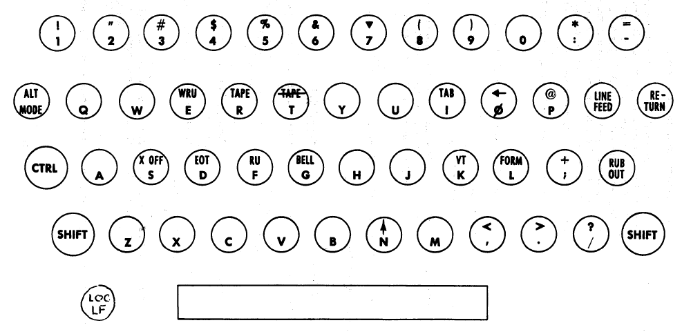

# BASIC

Dartmouth College Computation Center 1 October 1964

## BASIC

A Manual for BASIC, the elementary-algebraic language designed for use with the 
Dartmouth Time Sharing System.

1 October 1964

© Copyright 1964 by the Trustees of Dartmouth College. Reproduction for 
non-commercial use is permitted provided due credit is given to Dartmouth 
College.

### ( == This conversion is still under revision == )

The development of the BASIC Language, and of this Manual,, has been supported 
in part by the National Science Foundation under the terms of Grant NSF GE 
3864.

## TABLE OF CONTENTS

* **I What is a Program**
* **II A BASIC Primer**
* 2.1 An Example
* 2.2 Expressions, Numbers, and Variables
* 2.3 Loops
* 2.4 Use of the Time Sharing System
* 2.5 Errors and Debugging
* 2.6 Summary of Elementary BASIC Statements
* **III More Advanced BASIC**
* 3.1 More About PRINT
* 3.2 Lists and Tables
* 3.3 Functions and Subroutines
* 3.4 Some Ideas for More Advanced Programmers
* **IV Card BASIC**
* 4.1 Purpose
* 4.2 How to Prepare a Deck
* 4.3 Differences in Operation
* 4.4 MAT
* **V Appendices**
* A. Error Stops
* B. Limitations on BASIC
* C. The 15 BASIC Statements

## I. WHAT IS A PROGRAM?

A **program** is a set of directions, a recipe, that is used to provide an answer 
to some problem. It usually consists of a set of instructions to be performed 
or carried out in a certain order. It starts with the given data and parameters 
as the ingredients, and ends up with a set of answers as the cake. And, as with 
ordinary cakes, if you make a mistake in your program, you will end up with 
something else -- perhaps hash!

Any program must fulfill two requirements before it can even be carried out. 
The first is that it must be presented in a language that is understood by the 
"computer." If the program is a set of instructions for solving linear 
equations, and the "computer" is a person, the program will be presented in 
some combination of mathematical notation and English. If the person solving 
the equations is a Frenchman, the program must be in French. If the "computer" 
is a high speed digital computer, the program must be presented in a language 
the computer can understand.

The second requirement for all programs is that they must be completely and 
precisely stated. This requirement is crucial when dealing with a digital 
computer, which has no ability to infer what you meant --it can act only upon 
what you actually present to it.

We are of course talking about programs that provide numerical answers to 
numerical problems. To present a program in the English language, while easy on 
the programmer, poses great difficulties for the computer because English, or 
any other spoken language, is rich with ambiguities and redundancies, those 
qualities which make poetry possible but computing impossible. Instead, you 
present your program in a language that resembles ordinary mathematical 
notation, which has a simple vocabulary and grammar, and which permits a 
complete and precise specification of your program. The language that you will 
use is BASIC (**B**eginner's **A**ll purpose **S**ymbolic **I**nstruction 
**C**ode) which is at the same time precise, simple, and easy to understand.

Your first introduction to the BASIC language will be through an example. Next 
you will learn how to use the Dartmouth Time Sharing System to execute BASIC 
programs. Finally, you will study the language in more detail with emphasis on 
its rules of grammar and on examples that show the application of computing to 
a wide variety of problems.


## II. A BASIC PRIMER

### 2. 1 An Example

The following example is a complete BASIC program for solving two simultaneous 
linear equations in two unknowns with possibly several different right hand 
sides. The equations to be solved are

A<sub>1</sub>X<sub>1</sub> + A<sub>2</sub>X<sub>2</sub> = B<sub>1</sub>

A<sub>3</sub>X<sub>1</sub> + A<sub>4</sub>X<sub>2</sub> = B<sub>2</sub>

Since there are only two equations, we may find the solution by the formulas

X<sub>1</sub> = (B<sub>1</sub>A<sub>4</sub> - B<sub>2</sub>A<sub>2</sub>) / (A<sub>1</sub>A<sub>4</sub>-A<sub>3</sub>A<sub>2</sub>)

X<sub>2</sub> = (A<sub>1</sub>B<sub>2</sub> - A<sub>3</sub>B<sub>1</sub>) / (A<sub>1</sub>A<sub>4</sub>-A<sub>3</sub>A<sub>2</sub>)

It is noted that a unique solution does not exist when the denominator 
A<sub>1</sub>A<sub>4</sub>-A<sub>3</sub>A<sub>2</sub> is equal to zero. Study the example carefully --in most cases the 
purpose of each line in the program is self-evident.

```basic
10  READ A1, A2, A3, A4
15  LET D = A1 * A4 - A3 * A2
20  IF D = 0 THEN 65
30  READ B1, B2
37  LET X1 = (B1*A4 - B2*A2) / D
42  LET X2 = (A1*B2 - A3*B1) / D
55  PRINT X1, X2
60  GO TO 30
65  PRINT "NO UNIQUE SOLUTION"
70  DATA 1, 2,4
80  DATA 2, -7, 5
85  DATA 1, 3, 4, -7
90  END
```

We immediately observe several things about the above sample program. First, 
all lines in the program start with a line number. These serve to identify the 
lines in the program, each one of which is called a **statement**; thus, a program 
is made up of statements, most of which are instructions to be performed by the 
computer. These line numbers also serve to specify the order in which the 
statements are to be performed by the computer, which means that you could type 
your program in any order. Before the program is run by the computer, it sorts 
out and edits the program, putting the statements into the order specified by 
their line numbers. (This editing process makes extremely simple the correcting 
and changing of programs, as will be explained in later sections.)

The second observation is that each statement starts, after its line number, 
with an English word. This word denotes the type of the statement. There are 
fifteen types of statements in BASIC, nine of which are discussed in this 
chapter. Of these nine, seven appear in the sample program above.

The third observation is that we use only capital letters, and that the letter 
"Oh1' is distinguished from the numeral "Zero" by having a diagonal slash 
through the "Oh". This feature is made necessary by the fact that in a computer 
program it is not always possible to tell from the context whether the letter 
or the number was intended unless they have a different appearance. This 
distinction is made automatically by the teletype machine, which also has a 
special key for the number "One" to distinguish it from the letter "Eye" or 
lower case "L".

A fourth observation, though perhaps less obvious than the first three, is that 
spaces have no significance in BASIC (except in messages to be printed out as 
shown in statement number 65.) Thus, spaces may be used, or not used, at will 
to "pretty up" a program and make it more readable. For instance, statement 15 
could have been typed as

```basic
15 LETD=A1*A4-A2*A3
```

a fully equivalent though less readable form.

Turning now to the individual statements in the program, we observe that the 
first statement, numbered 10, is a READ statement. When the computer encounters 
a READ statement while executing your program, it will cause the variables 
whose names are listed after the READ to be given values according to the next 
available numbers in the DATA statements. Thus, in the example, when statement 
10 is first encountered, it will cause the variable Al to be given the value 1, 
the variable A2 to be given the value 2, the variable A3 to be given the value 
4, and the variable A4 to be given the value 2.

The next statement, numbered 15, is a LET statement. It causes the computer to 
compute the value of the expression AjA4 - A3A2, , and to assign this value to 
the variable D. The expression computed in a LET statement can range from the 
very simple (consisting of only a single variable) to the very complex. The 
rules for forming these expressions are given in detail in the next section, 
but for now we point out that:

1. Variable names consist of a single capital letter possibly followed by a single digit;

2. The symbol * (asterisk) is always used to denote multiplication;

3. Parentheses may be needed to specify the order of the computation because the entire expression must appear on a single line;

4. No subscripts or superscripts as Such are permitted, also because the expression must appear on a single line.

In line 20 the computer asks a question! "Is D equal to 0?" If the answer is 
yes, then the next statement to be executed by the computer is the one numbered 65. 
If the answer is no, the computer continues to statement 30, the next 
higher numbered one after 20.

In line 30 the computer causes the variables B1 and B2 to be given the values 
next appearing in the DATA statements elsewhere in the program. Since the first 
four data have already been used up, B1 is given the fifth value -7, and B2 is 
given the sixth value 5.

The statements numbered 37 and 42 complete the computation of
the solution, XI and X2. Notice that the denominator has been previously
evaluated as the variable D. Thus it is not necessary to repeat the formula
given in statement 15. Notice also how parentheses are used to specify that
the numerator of the fraction consists of the entire quantity B1*A4 - B2*A2.
If the parentheses had been omitted by mistake, the expression computed
would have been B1*A4 - (B2*A2 / D), which is incorrect.

Now that the answers have been computed, they will be printed out for you to 
see when the computer encounters statement 55. Notice that the comma is used to 
separate the individual items in the list of quantities to be printed out at 
that time.

Having completed the computation, statement 60 tells the computer to execute 
next statement number 30. We observe that the second encounter of statement 30 
will cause the variables B1 and B2 to be given the values 1 and 3, 
respectively, the next available ones in the DATA statements.

After completing the computation for the second set of right hand sides and
printing the answers, the computer will give the last values, 4 and -7. to the 
variable B1 and B2, compute and print the third set of answers, and then stop, 
because there is no more data when the READ statement 30 is encountered for the 
fourth time.

If D, the determinant of the coefficients, is zero, we know that the set of 
equations does not have a unique solution. In this case, statement 20 will 
cause the computer to execute statement 65 next. Statement 65 is again a PRINT 
statement, but instead of numerical answers being printed out, it will produce 
the English message

NO UNIQUE SOLUTION 

We could have used any other recognizable tnessnge between the two quotation 
marks that would have indicated to us that no unique solution was possible for 
the given coefficients.

After printing the warning message the computer will execute next statement 90, 
an END statement, which stops the running of the program. (The running will 
also be stopped when a READ statement is encountered for which there is not 
sufficient data. ) It is extremely important to remember that all programs must 
have an END statement, and that it must always be the highest numbered 
statement in the program. The intervening DATA statements are never executed by 
the computer; therefore, they may be placed anywhere in your program. The only 
requirement is that END be the highest numbered statement, including DATA 
statements, and that DATA statements are numbered in the order in which you 
wish the data to be used by the various READ statements in your program.

### 2.2 Expressions, Numbers, and Variables

Expressions in BASIC look like mathematical formulas, and are formed from 
numbers, variables, operations, and functions.

A **number** may contain up to nine digits with or without a decimal point, and 
possibly with a minus sign. For example, the following numbers are acceptable 
in BASIC:

    5    2.5    123456789 .123456789 -123456

To extend the range of numbers, a factor of a power of ten may be attached, 
using the letter E to stand for "times ten to the power". Again, the following 
examples are all acceptable forms for the same number in BASIC,

    -12.345 -12345 E-3 -. 12345E2 -12345000E-6 -.00012345E5

It should be noted, however, that the E notation cannot stand alone; 1000 may 
be written 10E2 or 1E3 but not E3 (which looks like a variable and is so 
interpreted in BASIC.) It should also be noted that .000123456789 is illegal, 
and must be written as, say, .123456789E-3.

A **variable** in BASIC is denoted by any letter, or by any letter followed by a 
digit. For instance, these are acceptable variable names:

    A    X    N5    X0    K9    O1

The difference between O and 0, and between I and 1 should be observed. Thus, 
I0 is acceptable while any of 1O, 1, 0, and 10 are not (the last one is the 
number ten.)

A variable in BASIC stands for a number, usually one that is not known to tke 
programmer at the time the program was written. Variables are given or assigned 
values by LET and READ statements. The value so assigned will not change until 
the next time a LET or READ statement is encountered that names that variable.

Expressions are formed by combining variables and numbers together with 
arithmetic operations and parentheses just as in ordinary mathematical 
formulas. The symbols

    + - * / ^

stand for "plus", "minus", "times", "divided by", and "to the power" (*), 
respectively. Parentheses are used in the usual way, as in

    (A1 + X)*(B - C^D7)

(* Note: The operation actually works with the absolute value of the left 
argument. Thus X ^ Y is interpreted as |X| ^ Y . If X could be negative and 
you want X^3 , you should write X*X*X or X*X^2 )

Because expressions must be presented as a single line, parentheses are
often required where they might not be needed in ordinary mathematical
notation. Thus,

     A - B 
    -------
       C

is written as 

    (A - B)/C

to show that the entire quantity A - B is to be divided by C. Omitting the 
parentheses would leave A - B/C , which is interpreted as A - (B/C) .

Another example that arises quite often is

       A
    -------
     B * C


which is written as A/(B*C)  or  A/B/C

A/B*C will be interpreted the same as (A/B)*C or (A*C)/B .

The way that expressions are interpreted can be summarized in terms of several 
rules, which correspond to standard mathematical notation. These are:

1.    The expression inside a parentheses pair is computed before the 
parenthesized quantity is used in further computations.

2.    Raising to a power is computed before multiply and/or divide, which in 
turn are computed before addition and/or subtraction, in the absence of 
parentheses.

3.    Several multiply-divides, or several addition-subtractions, are computed 
from left to right.

The first rule tells us that in (A + B)*C we compute A + B first, then multiply 
the result by C, an obvious interpretation. The second rule tells us that in A 
+ B*C ^ D we first compute C^D , then multiply by B, and finally add to A. An 
equivalent expression is A + (B*(C^D)) . The third rule states that A - B - C 
is interpreted as (A - B) - C and not as A - (B - C) . Applied to multiplies 
and divides, the rule tells us to interpret A/B/C as (A/B)/C and not as A/(B/C). 
For raising to a power, A^B^C means (A ^ B) ^ C or, equivalently, A^ (B*C) . If 
you intend A^ (B^C) , you must use that form.

In addition to the arithmetic operations, some of the more common standard 
functions are available. For example, to compute the root of 1+x<sup>2</sup> 
you would use SQR(1 + X^2). The other standard functions are used in this same 
way, that is, the BASIC name of the function followed by the argument enclosed 
in parentheses.

| Function name | Purpose
|---------------|---------
| SIN(X) | sine of X (X must be expressed in radian measure)
| COS(X) | cosine of X (X must be expressed in radian measure)
| TAN(X) | tangent of X (X must be expressed in radian measure)
| ATN(X) | arctangent (in radians) of X
| EXP(X) | natural exponential of X, e<sup>X</sup>
| ABS(X) | absolute value of X, \|x\|
| LOG(X) | natural logarithm of \|x\|
| SQR(X | square root of \|x\|

(Two other functions, RND(X) and INT(X), are explained in section 3. 3) The 
argument of a function may be any expression, no matter how complicated. For 
example 

```basic
SQR( B ^ 2 - 4*A*C ) - 17 
Z - EXP( X1 + LOG( A/X1 )) * TAN(A) 
SQR( SIN(Q) ^ 2 + COS(Q) ^ 2 )
```

are all acceptable in BASIC.

The use of the LOG and SQR functions requires a word of caution. In each case 
the argument is made positive before applying the function, since neither 
function is defined for negative arguments. Many times, though not always, an 
attempt to have the computer extract the square root of a negative number 
implies a fundamental error in the program. The user should be forewarned that 
such occasions, hopefully rare, may therefore be unnoticed.

The user may define new functions using the DEF statement, which is discussed 
in section 3.3.


### 2.3 Loops

Perhaps the single most important programming idea is that of a loop. While we 
can write useful programs in which each statement is performed only once, such 
a restriction places a substantial limitation on the power of the computer. 
Therefore, we prepare programs that have portions which are performed not once 
but many times, perhaps with slight changes each time. This "looping back" is 
present in the first program, which can be used to solve not one but many sets 
of simultaneous linear equations having the same left hand sides.

Making tables of, say, square roots is another example where a loop is 
necessary. Suppose that we wish to have the computer print a table of the first 
hundred whole numbers and their square roots. Without loops, one can easily see 
that a program would require 101 lines, all but the last having the form:

```basic
17 PRINT 17, SQR(17) 
```

And if one wished to go not to 100 but to 50 only, a new program would be 
required, Finally, if one wanted to go to 10,000 the program would be absurd 
even if someone could be found to write it all down.

We notice that the basic computation, in this case a very simple printing, is 
practically the same in all cases -- only the number to be printed changes. The 
following program makes use of a loop.

```basic
10 LET X = 0
20 LET X = X + 1 
30 PRINT X, SQR(X) 
40 IF X<=100 THEN 20 
50 END
```
Statement 10, which gives to X the value 0, is the initialization of the loop. 

Statement 20, which increases the value of X by unity, is the statement that 
insures that the loop is not merely repeting exactly the same thing --an 
infinite loop! 

Statement 30 is the body of the loop, the computation in which we are interested. 

And statement 40 provides an exit from the loop after the desired computation 
has been completed. All loops contain these four characteristics: 
initialization, modification each time through the loop, the body of the loop, 
and a way to get out.

Because loops are so important, and because loops of the type shown
in the example arise so often, BASIC provides two statements to enable one
to specify such a loop much more concisely. They are the FOR and the
NEXT statements, and would be used as follows in the example above:

```basic
10 FOR X = 1 TO 100 
20 PRINT X, SQR(X) 
30 NEXT X 
40 END
```

Statement 10 contains both the initial and final values of X. Statement 30
specifies that X be increased to its next value. In this case, the value by
which X is increased each time is implied to be unity. If instead we wished
to print the square roots of the first 50 even numbers, we would have used

```basic
10 FOR X = 2 TO 100 STEP 2 
20 PRINT X, SQR(X) 
30 NEXT X 
40 END
```

Omitting the STEP part is the same as assuming the step-size to be unity.

To print the square roots of the multiples of 7 that are less than 100, one 
might use for line number 10

```basic
10 FOR X = 7 TO 100 STEP 7 
```

The loop will be performed for all values of X that are less than or equal to 
100, in this case, for X equal to 7, 14, ... , 91, 98.


### 2.4 Use of the Time Sharing System

The Dartmouth Time Sharing System consists of a large central computer with a 
number of input-output stations (currently, model 35 teletype machines.) 
Individuals using the input-output stations are able to "share" the use of the 
computer with each other in such a way as to suggest that they each have sole 
use of the computer. The teletype machines are the devices through which the 
user communicates with the computer.

Teletype machines are like ordinary typewriters, with certain modifications to 
make them suitable for transmitting messages over telephone lines. They have a 
nearly standard keyboard for letters and numbers, the most notable differences 
being that all letters are capitals and that the numeral one is not the same 
as the letter L. In addition there are several special characters which can be 
typed using either of the two "SHIFT" keys; these include the following special 
symbols that are used in BASIC programs:

    + - * / ^ =
    ( ) < > . , ;

There is a "CTRL" key that is related to standard teletype communications, but 
all the control symbols are ignored by BASIC. A layout of the keyboard is shown 
here. It should be studied until the locations of these symbols are familiar.



There are three special keys that the user must know about.

"RETURN",    which is located at the right hand end of the third row of keys, 
is the ordinary carriage return. More importantly, the computer ignores all 
typed lines until this key is pressed-. It must be used after each line in a 
BASIC program, and after each line which is a communication to the system.

"<-", which is located on the letter "Oh" key while the "SHIFT" key is 
depressed, erases the last character typed. If the user notices that he has 
just mistyped a letter or a symbol, he pushes this key, which tells the 
computer to ignore the previously typed character. Pushing the backwards arrow 
more than once will delete the same number of characters, but only to the start 
of the line. For example, the sequence 

    ABC<-<-DE will appear as ABCDE

while

    100 LET<-<-<-<-<-<-<-2OO LET X = Y

will appear as

    200 LET X = Y

"ALT MODE", located at the left hand end of the third row of keys, is pressed to delete an 
entire typed line. It may be used at any time before a "RETURN" is used.

Besides the keyboard itself, there are four buttons that are needed to operate 
the teletype machine.

| BUTTON | FUNCTION
|--------|-----------
| "ORIG" the leftmost of six small buttons on the right. | Turns on the teletype machine.
| "CLR" next to "ORIG."  | Turns off the teletype.
| "LOC LF" , to the left of the space bar. | Feeds the paper to permit tearing off. 
| "BUZ-RLS" , rightmost of the six small buttons.| Turns off the buzzer, which goes on  when the paper supply is low. 

All other buttons and gadgets, including the telephone dial, are not connected.


When you sit down at a teletype machine, you must start by typing

    HELLO

followed, as always, by a "RETURN". This starts the so-called HELLO sequence, a 
short series of questions and answers that serve to tell the computer who you 
are and what you wish to do .

Each user must have a user number. For students it is the six digit student ID 
number. The user number for any other person consists of a certain letter 
followed by five digits, and is assigned to the user by the Computation Center. 
When the computer asks for yOur user number, type it. (Don't forget the 
"RETURN".)

The next information you must supply is the name of the system or language; in 
this case it will be BASIC.

When the computer asks about NEW or OLD, you type NEW unless you wish to 
retrieve an OLD program in order to continue working on it.

Finally, the computer asks for the name of your problem. You type any six 
letters, digits, or characters that you wish. If you are retrieving an OLD 
program, you must be careful to type the problem name exactly as you typed it 
originally.

The computer types READY, and is now ready for you to type in the new program, 
to add or change statements in an old program, or to command the computer to do 
something with your program. You must be careful to begin each statement in 
your program with a line number. These line numbers should: 

- contain no more than five digits,

- contain no spaces or non-digit characters, 

- start at the very beginning of the line.

After completely typing the program, you type 

    RUN

The computer will now analyze and run your program. It will then print a line 
that contains your user number, the problem name, the date, and the time of 
day. If there are no errors of form in the program, next will be printed the 
answers according to the PRINT statements within the program. (If the program 
runs for a long time, the teletype machine will periodically make little 
grinding noises, which indicate that no output has yet been produced. On the 
other hand, if a program is fairly short but produces lots of output, you may 
notice that the printing may break off after a while and commence somewhat 
later. During that interval, the computer is doing the computing necessary to 
produce the next batch of output.) Finally, a time statement is printed showing 
the total computing time used by the run. (In many cases it will show 0 
seconds, indicating that the entire run required less than 0. 5 seconds.)

A complete history of a successful run of the linear equation solver presented 
earlier is shown here:

    HELLO
    USER NUMBER--999999
    SYSTEM—BASIC
    NEW OR OLD--NEW
    NEW PROBLEM NAME-—LINEAR
    READY.
    10    READ A1, A2, A3, A4
    15    LET D = A1 * A4 - A3 * A2
    20    IF D = 0 THEN 65
    30    READ B1, B2
    37    LET X1 = (B1*A4 - B2*A2)/D
    42    LET X2 = (A1*B2 - A3*B1)/D
    55    PRINT X1, X2
    60    GO TO 30    
    65    PRINT "    NO UNIQUE SOLUTION
    70    DATA 1, 2,4
    80    DATA 2, -7, 5
    85    DATA 1, 3, 4, -7
    90    END    
    RUN        

    USER No. 999999 PR0BLEM NAME: LINEAR 6 SEPT. 1964 TIME: 22:33
    4    -5.5
    .666667    .166667
    -3.66667    3.83333
    TIME: 1 SECS.


Besides HELLO and RUN, there are several extremely useful commands that may be 
given to the computer by typing at the start of a new line the command followed 
by pressing the "RETURN" key.

*  **STOP**    causes the computer to stop whatever it is doing with
the program. STOP may be used even with the computer is typing out; in this 
case it responds to your simply typing the letter S even without a "RETURN".

*  **LIST**    will type out a complete listing of the program as it is,
including all the corrections that have been made. To stop listing after it 
has started but before it is completed, type S.

*  **LIST--XXXXX** will type out a listing of the program starting at line number 
XXXXX and continuing to the end or until the S key is pressed. For instance, 
LIST--70 in the linear equations problem will start listing at line 70, 
permitting the user to inspect the DATA statements without waiting for the 
early part of the program to be listed.

*  **SAVE**    If the user is done working with a program at the moment and wishes to 
return to it at a later time, he should save it. For instance, if the user must 
leave the teletype and is only half finished with the original typing, he types 
SAVE. Later on, he retrieves exactly what he saved by typing (DLD. He may then 
continue with the typing as if nothing had happened.

* **UNSAVE**    If a user has finished with a program that he has saved at some 
earlier time, he types UNSAVE. This action destroys the saved program, making 
room for other saved programs. All users are urgently requested to UNSAVE all 
programs for which they no longer have need.

*  **CATALOG** In case a user is working with several different programs and forgets 
what names he gave them, typing CATALOG requests the computer to list the names 
of all programs currently being saved by that user.

*  **NEW**    Typing NEW will permit the programmer to start a new problem. This 
command may be given at any time, and has the effect of erasing the previous 
program (unless it was saved.) The computer will ask for the name of the new 
problem.

*  **OLD**    This command is similar to NEW, but retrieves the named saved program, 
which may then be added to. Either OLD or NEW must be used in connection with 
the HELLO sequence, but either may be also used at any later time as well. 
Repeated use of OLD does not affect the saved program; it remains saved until 
it is unsaved, or until a new version is saved in place of it.

*  **SCRATCH** This command is very close to NEW in that it erases the previous work 
and presents a clean slate. It differs by retaining the name of the previous 
problem instead of asking for a new name.

*  **RENAME**    serves to supply a new problem name for the current work without 
erasing it. It is useful if one wishes to save two similar versions of a 
program. Save the first, use RENAME, make the desired modifications, and then 
save or run the modified version.

When the user is finished with a session at the teletype, it is necessary only 
to leave the machine. The user should plan his session at the teletype to avoid 
long trances. If such happens, the user should save his work, and leave the 
machine for someone else to use. Remember the motto,

> TYPING IS NO SUBSTITUTE FOR THINKING


### 2.5    Errors and Debugging

It may occasionally happen that the first run of a new problem will be 
error-free and give the correct answers. But it is much more common that errors 
will be present and have to be corrected. Errors are of two types: Errors of 
form, or grammatical errors, that prevent even the running of the program; 
Logical errors in the program which cause wrong answers or even no answers to 
be printed.

Errors of form will cause error messages to be printed out instead of the 
expected answers. These messages give the nature of the error, and the line 
number in which the error occurred. Logical errors are often much harder to 
uncover, particularly when the program appears to give nearly correct answers. 
But after careful analysis and when the incorrect statement or statements are 
discovered, the correction is made by retyping the incorrect line or lines, by 
inserting new lines, or by deleting existing lines. These three kinds of 
corrections are made as follows:

* Changing a line : Type it correctly with the same line number.

* Inserting a line : Type it with a line number between those of the two existing lines.

* Deleting a line : Type the line number only.

Notice that being able to insert a line requires that the original line numbers 
not be consecutive numbers. For this reason, most users will start out using 
line numbers that are multiples of five or ten, but that is up to them.


These corrections can be made at any time , either before or after a run. 
They may even be made in an earlier part of the program while you are typing 
the later lines. Simply retype the offending line with its original line 
number, and then continue typing the rest of the program.

The whole process of locating errors or "debugging" a program is illustrated 
by a case history which starts on the next page. It takes us from the HELLO 
sequence to the final successful printing of the correct answers. The circled 
numbers refer to comments, which start below. For convenience, the portions 
typed by the computer are underlined or margin-lined, although no underlining 
is used on the actual computer.

The problem is to locate the maximum point on the sine curve between 0 and 3 by 
searching along the x-axis. The searching will be done three times, first with 
a spacing of 0.1, then with spacings of 0.01, and 0.001. In each case will 
be printed the location of the maximum, the maximum, and the spacing. The 
program as first written down on paper was:

```basic
10 READ D
20 LET X0 = 0
30 FOR X = 0 TO 3 STEP D
40 IF SIN(X) <= M THEN 100
50 LET X0 = X
60 LET M = SIN(X0)
70 PRINT X0, X, D
80 NEXT X0
90 GO TO 20
100 DATA .1, .01, .001
110 END
```


### ( == Revision must continue here == )


```txt
HELLO
USER NUMBER--999999
SYSTEM--BASIC
NEW OR OLD--NEW
NEW PROBLEM NAME-—MAXSIN
READY.
```

```basic
10    read d
20    lwr xo = 0
30    f0r x = 0 t0 3 str«-ep d    /-n
40    if sine«-( x) <= m then 100 <£—-(J/
50    let xo = x
60    let m = sincx)
70    print x0, x, d
80    next xo
90    g0 t0 20
20    let xo = 0 ^---- \j-)
loo«-«-*-l 00 data .1, .01, .001 ——__(7)
110    end run
```

```txt
user n0. 999999
pr0blem name: maxsin 6 sept. 1964
time: 21:37
illegal f0rmula    in 70 ^
n0t matched with f0r in 80 f0r with0ut next
time: 0 secs.

70    print xo, x, d
40    if sincx) <= m then 80
ro    next x run
user n0. 999999 pr0blem name:
st0p ready.
maxsin 6 sept. 1964 time: 21:38
20 let m r -1 run


user n0. 999999 pr0blem name: maxsin 6 sept. 1964 time: 21:42
0    0
.1    .1
.2    .2
.3    .3 .4
st0p. ready.
70
85 print x0, m, d run
user m0. 999999 problem name: maxsin 6 sept. 1964 time: 21:43
.9995 74 .999574 .99
1.6 1.6 1.6
st0p. ready.
90 g0 t0 10 5 print "x value", "sine2«-", res0luti0n" <-run
<D
user n0. 999999 pr0blem name: maxsin 6 sept. 1964 time: 21:44
inc0rrect f0rmat in 5 --"
time: 1 secs.

5 print "x value", "sine", "res0luti0n" --/7q)
run    ^ly
user n0. 999999 pr0blem name: maxsin 6 sept. 1964 time: 21:46
x value    sine    res0luti0n
1.6    .999574    .1
1.57    1.    .01
1.571    1.    .001
time: 1 mins. 0 secs.
®
list    --—----"-—-----(3)
user    n0. 999999 pr08lem name: maxsin 6 sept. 1964 time: 21:48
```

```basic
5    print "x value", "sine", "res0luti0n"
10    read d
20    let m = -1
30    f0r x = 0 t0 3 step d
40    if sin(x) <= m then 80
50    let x0 = x
60    let m = sincx)
80    next x
85    print xo, m, d
90    g0 t0 10
100    data .1, .01, .001
110    end
save ready.
```

### ( == End of first block to be revised == )

1.    Notice the use of the backwards arrow to correct mistakes as you go along.
2.    The user notices at this point that he had mistyped the word LET earlier, and corrects it.
3.    An inspection of statement 70 shows that a variable XO is used, which is illegal, when X0 was intended. The line is retyped correctly.
4.    The variable in the NEXT statement should have been X instead of X0, and the change is made.
5.    By chance, the user notices that originally the IF-THEN statement pointed to a DATA statement, and the correction is made.
6.    The problem runs for a long time without any output. Since we expect output almost immediately, we suspect something is wrong. It must be that the PRINT statement is forever bypassed. This could happen only if M were so large that the IF-THEN statement was always satisfied. We then observe that we forgot to initialize M to some value less than the maximum value on the sine curve, so we choose -1.
7.    At last we get printed output, but it appears that the printing is taking place each time through the loop rather than at the end of the loop. We move the print statement from before to after the NEXT statement, and incidentally change it to print M rather than X as the second term.
8.    Ugh. Still not correct. We seem to be doing the first case over and over again. An infinite loop! This is corrected by going back to statement 10 instead of statement 20.
9.    While we are at it, we put in labels to identify each column in the printed output.
10.    Forgot the opening " for the third label.
11.    We finally obtain the desired answers.
12.    The final corrected version of the program is listed.
13.    The program is saved for later use. (This should not be done unless future use is necessary. )


### 2.6 Summary of Elementary BASIC Statements

This section gives a short and concise but complete description of
each of the nine types of BASIC statements discussed earlier in this chapter.

The notation <...> is used to denote a particular unspecified instance of the type Of thing referred to inside the < >. Thus, <line number> is used to stand for any particular line number. <Variable> refers to any variable, which is a single letter possibly followed by a single digit. <expression> stands for any particular expression, no matter how complicated, so long as it follows the rules for forming expressions given in section 2.2 . <number> stands for any constant or data number.

#### 2.6.1 LET

**Form:** `<line number> LET <variable> = <expression>`

**Example:** 

```basic
100 LET X = X + 1
259 LET W7 = (W - X4 ↑ 3)*(Z - A1/(A - B)) - 17
```

**Comment:** The LET statement is not a statement of algebraic
equality, but is rather a command to the computer to perform certain computations and to assign the answer to a certain variable. Thus, the first examjple tells the computer to take the current value of X, add 1 to it, and assign the answer to the variable X. In other words, X is increased by unity.


#### 2. 6. 2 READ and DATA

**Form:** `<line number> READ <list of variables>`

**Example:** 

150 READ X, Y, Z, X1, Y2, Z(K+I, J)

**Form:** <line number> DATA <list of numbers>

**Example:** 300 DATA 4, 2, 1.5, 0.6734E-2, -174.21

**Comment:** A READ statement causes the variables listed in it to be given in order the next available numbers in the collection of DATA statements.

**Comment:** Before the program is run, the computer takes all the DATA statements in the order in which they appear and Creates a large data block. Each time a READ statement is encountered anywhere in the program, the data block supplies the next available number or numbers. If the data block runs out of data, with a READ statement still asking for more, the program is assumed to be done.


#### 2. 6. 3 PRINT

**Form**: `<line number> PRINT <list of expressions to be printed>`

Example: 

```basic
100 PRINT X, Y, Z, B*B - 4*A*C, EXP( LOG( 17))
```

**Form:** `<line number> PRINT "<any string of characters>"`

Example:

```basic
200 PRINT "THIS PROGRAM IS N0 GOOD."
150 PRINT "COMPUTES X + Y = Z"
```

**Comment:** The numerical quantities printed need not be simple variables, they may be any 
expressions. The expression is first evaluated, then printed. There may be any 
number of expressions separated by commas, but they will be printed five to a 
line.

**Example:** 

```basic
150 PRINT "X", "Y", "Z"
```

**Comment:** Several messages may be included in the list separated by commas. The effect is 
to print the letter X in the first column, the letter Y in the 16th column, and 
the letter Z in the 31st column.

**Example:**

```basic
200 PRINT "X = ", X, "Y = ", Y
```

**Comment:** Labels and expressions may appear in the same print statement.

**Comment:** Much more variety is permitted in PRINT statements than is shown here. The 
additional flexibility is explained in section 3. 1.


#### 2.6.4 GO TO and IF-THEN

**Form:**    `<line number> GO TO <line number>`

**Example:**

```basic
150 GOTO 75
240 GO TO 850
```

**Comment:** Sometimes called an unconditional go to, GO TO is used to interrupt the normal sequence of executing statements in the increasing order of their line numbers.

**Form:**  `<line number> IF <expression> <relation> <expression> THEN <line number>`

**Example:**

```basic
140 IF X > Y + Z THEN 200
85 IF X * SIN(X) >= 1 THEN 100
```


**Comment**: Sometimes called a conditional go to, the IF-THEN statement provides a way to select one of two sequences in the program depending on the results of some previous computation. If the condition is met, the implied go to is performed; if the condition is not met, the next statement in sequence is performed.
Any of the six standard relations may be used.

| Symbol | Meaning
|---------------|---------
| \< | less than
| \<= | less than or equal
| = |  equal
| \>= | greater than or equal
| \> |  greater than
| \<\> |  not equal


#### 2. 6. 5 FOR and NEXT 

**Form:** `<line number> FOR <variable> = <expression^> TO <expression>`

or `<line number> FOR <variable> = <expression> TO <expression> STEP <expression>`

**Example:**

120 FOR X4 = (17 + C0S(A)) /3 TO 3*SQR(10) STEP 1/4
... (This represents the body of the loop. )
235 NEXT X4

**Comment:** Omitting the STEP part of the FOR statement is equivalent to having the 
stepsize equal to unity.

**Comment:** The above example will, assuming A to be equal to 0, cause the body of the loop 
to be performed several times, first with X4 equal to 6, next with X4 equal to 
6.25, then 6.50, and so on. The last time the body of the loop will be 
performed is with X4 equal to 9.25, which is less than or equal to the final 
value 9.486 (approximately).

The FOR statement goes into the body of a loop if the variable has a value 
less than or equal to the final value (in the case of a positive stepsize), or 
if the variable has a value greater than or equal to the final value (in the 
case of a negative stepsize.) 

Upon leaving the loop, the program continues with the statement following the NEXT; the variable used in the FOR statement then 
has the value it had during the last passage through the loop ( 9. 25 in the 
above example.)


**Example: **

```basic
240 FOR X = 8 TO 3 STEP -1
```

**Comment: ** The body of the loop is performed with X equal to
8, 7, 6, 5, 4, and 3, and X has the value 3 upon leaving the loop.

**Example: **

```basic
456 FOR J = -3 TO 12 STEP 2
```

**Comment:** The body of the loop will be performed with J equal to -3, -1, 1, 3, 
5, 7, 9, and 11. J will have the value 11 upon leaving the loop.

**Example: **

```basic
50 FOR Z = 2 TO -2
```

**Comment:** The body of the loop will not be performed. Instead, the computer will 
proceed to the statement immediately following the corresponding NEXT. The 
value of Z will then be 1, which is the initial value (2) minus the step size 
(1).


#### 2. 6. 6 END

**Form:** `<line number> END`

**Example: **

```basic
999 END
```

Comment: An END statement is required in all programs. It must also be the statement with the highest line number in the program.

### ( == Revision must continue here == )


## III. MORE ADVANCED BASIC

### 3. 1 More About PRINT

One of the conveniences of BASIC is that the format of answers is automatically supplied for the beginner. The PRINT statement does, however, permit a greater flexibility for the more advanced programmer who wishes to specify a more elaborate output.

The teletype line is divided into five zones of fifteen spaces each by BASIC, 
allowing the printing of up to five numbers per line. Three simple rules 
control the use of these zones.

1. A label, in quotes, is printed just as it appears.
2. A comma is a signal to move to the next print zone, or to the first print zone of the next line if it has just filled the fifth print zone.
3. The end of a PRINT statement signals a new line, unless a comma is the last symbol.

Each number occupies one zone. Each label occupies a whole number of zones; if it occupies part of a zone, the rest of the zone is filled with blanks. If a label runs through the fifth zone, part of it may be lost.

The examples on the following pages illustrate some of the various ways in which the PRINT statement can be used. It should be noted that a blank PRINT statement causes the typewriter to move to the next line, as is implied by rule 3 above.

The format in which BASIC prints numbers is not under the control of the user. However, the following rules may be used to guide the programmer in interpreting his printed results.

### ( == Check listing == )

1.    No more than six significant digits are printed (except for integers -- see rule 4.)

2.    Any trailing zeros after the decimal point are not printed.

3.    For numbers less than 0. 1, the form X. XXXXX E-Y is used *unless* the entire significant part of the number can be printed as a six decimal number. Thus, .03456 means that the number is exactly .0345600000, while 3.45600 E-2 means that the number has been *rounded* to .0345600 .

4.    If the number is an exact integer, the decimal point is not printed. Furthermore, integers of up through nine digits are printed in full.

A packed form of output is available by using the character ";" instead of "," . Briefly, whereas"," tells the computer to move to the next zone for the next answer, ; tells the computer to move to the beginning of the next multiple of three characters for the next answer instead of to the next zone, with six characters being the minimum. One can thus pack many more than five numbers on a line if the numbers themselves require less than a full zone to print. An example of this option is shown on the next page.

### ( == Check listing == )

With packed output using the semi-colon, the programmer can print 11 three digit numbers per line, 8 six digit numbers per line, or 6 nine digit numbers per line. Mixtures of the three types in subsequent lines may not line up, as the example shows. The user should be careful about using the semi-colon with full length numbers which might occur near the end of a print line. BASIC checks to see if there are 12 or more spaces at the end of a line before printing a number there, but some numbers require 15 spaces. The same warning holds for printing labels near the end of the line. In each case, the last few characters may be lost.

### ( == Check listing == )

```txt
new
new pr0blem name--printer ready.
10    ra deleted
10    read a, b
20    print "first n0. = "a, "sec0nd n0. ="b
30    data 2.3, -3.17
40    end run
user n0. 999999 pr0blem name: printe 6 sept. 1964 time: 21:52 first n0. = 2.3    sec0nd n0. =-3.17
time: 0 secs.
Comment: Notice that with no comma between the label and the variable name, the label and the value of the variable appear together. But since the label and the number (with its unprinted non-significant zeros) occupies more than one zone, the second answer is printed starting in the third zone. This is in accordance with rule 2, which says that we do not start a new zone until a comma
scratch
ready.    1s encountered.
10    f0r i = 1 t0 12
20    print i,
30    next i
40    end run
user n0. 999999 pr0blem name: printe 6 sept. 1964 time: 21:53
i    2    3    4    5
6    7    8    9    10
II    12
time: 0 secs.
-32-
user    n0. 999999 problem name: print s sept. 1964 time: 22:08
5    print "this program computes and prints the nth p0vos"
6    print "qf the numbers less than 0r equal t0 n f2r vari0us"
7    print "n fr0m 1 thr2ugh 7."
8    print
10    f£r n = 1 to 7
15    print "n = "n
20    f0r i = 1 t0 n
30    print itn,
40    next i
50    print
60    print
70    next n
80    end
run
user n0. 999999 pr0blem name: print 6 sept. 1964 time: 22:09
this program c0mputes and prints the nth p0wers 0f the numbers less than 0r equal t0 n f0r vari0us n fr0m 1 thr0ugh 7.
n = 1 1
N = 1
n r 1
N = 1
N r 1
2
3
4
5
4. 8.
16.
32.
27. 81 . 243.
256 1024
3125.
n = 6 1    64.
46656.
n = 7 1 128. 279936.    823543.
time: 2 secs.
729.
2187.
4096
16384
15625
78125,
```


### (==== )

```txt
10    f0r i = 1 t0 100
20    print 1*1*1}
30    next i
40    end run
user n0.    999999    pr0blem    name: print 6        sept. 1964    time:    22:14
1 8    27    64 125 216        343 !    512 729    1000    1331
1728    2197    2744    3375    4096    4913    5832    6859
8000    9261    10648    12167    13824    15625    1 7576    19683
21952    24389    27000    29791    32768    35937    39304    42875
46656    50653    54872    59319    64000    68921    74088    79507
85184    91 125    97336    103823    110592    117649    125000    132651
140608    148877    157464    1663 75    175616    185193    195112    205379
216000    226981    23 8328    250047    262144    274625    287496    300763
3 14432    328509    343000    357911    373248    389017    405224    421875
438976    456533    474552    493039    512000    531441    551368    571787
592704    614125    636056    658503    681472    704969    729000    753571
778688    804357    830584    8573 75    884736    912673    941192    970299
time:
2 secs.
```

### ( == Revision must continue here == )

### 3.2 Lists and Tables

In addition to the ordinary variables used by BASIC, there are variables that 
can be used to designate lists or tables. For instance, A(7) would denote the 
seventh item in a list called A; 'B(3, 7) denotes the item in the third row and 
seventh column of the table called B. We commonly write AV and Bj^ y for those 
same items, and use the term subscripts to denote the numbers that point to the 
desired items in the list or table. (The reader may recognize that lists and 
tables are called, respectively, vectors and matrices by mathematicians.)

The name of a list or table must be a single letter. The subscripts may be any 
expression, no matter how complicated, as long as they have non-negative 
integer values. The single letter denoting a list or table name may also be 
used to denote a simple variable without confusion. However, the same letter 
may not be used to denote both a list and a table in the same program. The 
following are acceptable examples of list and table items, though not 
necessarily in the same program:

B( I + K )    B( I, K)    Q( A(3, 7), B - C )

The example on the next page shows a simple use of both lists and tables in the 
same program. We might think of this program as one that computes the total 
sales for each of five salesmen selling three different good s. The list P 
gives the price of the three goods. The table S gives the individual item sales 
of the five salesmen, where the rows stand for the items and the columns for 
the salesmen. We assume that the items sell for $1. 25, 4. 30, and 2. 50, 
respectively, and that salesman 1 sold 40 of item 1, 10 of item 2, and 35 of 
item 3, and so on.

```txt
useh ng. 999999 pr0blem name: sales 6 sept. 1964 time: 23:16
10    f0r i =    1 t0 3
20    read pci)    
30    next i    
40    for i =    i t0 3
50    FCR j =    1 t0 5
60    read sci    .J)
70    next j    
so    next i    
90    fsr j =    1 t0 5
100    let s =    0
110    fcr i =    1 t0 3
120    let s =    s + pci) * sci,j)
130    next i    
140    print "t0tal sales f0r salesman    
150    next j    
200    data 1.    25, 4.30, 2.50
210    data 40    , 20, 37, 29, 42
220    data 10    , 16, 3, 21, 8
230    data 35    , 47, 29, 16, 33
300    end    
run
user y    is. 999999    pr0bleh    name: sales    6 sept    . 1964
t0tal    sales f0r    salesman    1    $    180.5
t0tal    sales f0r    salesman    2    $    211 .3
tvjtal    sales fbr    salesman    3    $    131 .65
t0tal    sales f0r    salesman    4    $    .166.55
t0tal    sales f0r    salesman    5    $    169.4
time:    1 secs.                
```

By way of explanation, lines 10 through 30 read in the values of the list P . 
Lines 40 through 80 read in the values of the table S. . Lines 90 through 150 
compute the total sales for the five salesmen and print each answer as it is 
computed. The computation for a single salesman takes place in lines 100 
through 130. In lines 90 through 150, the letter I stands for the good number, 
and the letter J stands for the salesman number.

BASIC provides that each list has a subscript running from 0 to 10, inclusive. 
Each subscript in a table may run from 0 to 10. If the user desires to have 
larger lists or tables, he may use a DIM statement in his program. For example,

10 DIM A( 17)

indicates to the computer that the subscript of the list A runs from 0 to 17, 
inclusive; similarly,

20 DIM B(15, 20) , S(3) means that the subscripts of B run from 0 through 15 for rows, and 0 through 20 for columns, and that the subscript of the list S runs from 0 through 3. The numbers used to denote the size of a list or table in a DIM statement must be integer numbers. The DIM statement is used not only to indicate that lists and tables are larger than 0-10 in each subscript, but also to allocate storage space in very large programs by telling the computer that only, say, 4 spaces are needed for the list S as shown above.

It should be mentioned that using a DIM statement, does not require the user to 
use all of the spaces so allocated.

### 3. 3 Functions and Subroutines

Two additional functions that are in the BASIC repertory but which were not 
described in section 2. 2 are INT and RND. INT is used to determine the integer 
part of a number that might not be a whole number. Thus INT( 7.8) is equal to 7 
.As with the other functions, the argument of INT may be any expression. One 
use of INT is to round numbers to the nearest whole integer. If the number is 
positive, use INT(X + . 5) . The reader should verify that this process is 
equivalent to the familiar process of rounding. If the number is negative, 
INT(X - . 5) must be used. The reason is that INT( -7. 8) is -7, not -8. INT 
always operates by chopping off the fractional part, whether the number is 
positive or negative.

INT can be used to round to any specific number of decimal places. Again, for 
positive numbers,

INT( 100*X + . 5)/100 will round X to the nearest correct two decimal number.

The function RND produces a random number between 0 and 1. The form of RND 
requires an argument, though the argument has no significance; thus, we 
commonly choose a single letter such as X or Z, and use RND(X) .

The property of RND is that it produces a new and different random number each 
time it is used in a program. Thus, to produce and print 20 random digits, one 
might write a program like that shown on the next page.

The middle example shows that the next time the program is run, the same 
sequence is obtained. To vary the sequence we might "throw away" an arbitrary 
number of random numbers at the start of the program. In the third example at 
the bottom of the page, the first 115 random numbers are

```txt
10    fgr i :
20    print
30    next i
40    end run
: 1 t0 20 intc 10*rndcx) );
user n0. 999999
9 6
time:
0 6
4 9
1 secs.
pr0blem names rand0m
1 3
6 4
4 0
9 7
6 sept. 1964 time: 23:33 3 8
5
•7
8 7
run
user n0. 999999
9 6
0 6
4 9
pr0blem name: rand0m 6 sept. 1964
1 3
6 4
4 0
9 7
5 7
8 7
time: 23:34
time:
1 secs.
10    read n
20    f0r i = i t0 n
30    let x = rnd(x)
40    next i
50    f0r i = 1 t0 20
60    print intc 1q*rndcx> );
70    next i
80    data 115
90    end
run
user n0. 999999    pr0blem name: rand0m    6 sept. 1964 time: 23:35
7 9 9    0 9 4 5    9 9 7    5
2 2 4    2 0 0 0    3 3
Time: i secs.
```
discarded. The output shows random digits numbered 116 through 135.

Additional flexibility is provided in BASIC by three statements that permit the 
use bf user-defined functions and subroutines.

The DEF statement permits the user to define a function other than the standard 
functions listed in section 2. 2 so that he doesn't have to keep repeating the 
formula for the function each time he uses it in his program. The name of a 
defined function must be three letter s, the iitOi of which are FN . The user 
thus may define up to 26 functions. The following examples illustrate the form 
of the DEF statement:

```basic
25 DEF FNF(Z) = SIN(Z*P) 
```

(where P has the value 3. 14159265/180)

```basic
40 DEF FNL(X) = LOG(X)/LOG(1O) 
```

Thus, FNF is the sine function measured in degrees, and FNL is the function 
log-to-the-base-ten.

The DEF statement may occur anywhere in the program. The user needs to be 
cautioned that the variable used in the DEF statement must not be subscripted, 
and that it is used every time that function is used. Thus, in a program 
containing FNF as above defined, it is best not to use the variable Z elsewhere 
in the program.

The expression on the right of the equal sigh can be any expression that can be 
fit into one line. It could involve many other variables besides the one 
denoting the argument of the function. Thus,

```basic
60 DEF FNX(X) = SQR(X*X + Y*Y) 
```

may be used to set up a function that computes the square root Of the sum of 
the squares of X and Y. To use FNX, one might use the following:

```basic
10 LET Y = 30
20 LET SI = FNX(40)
```

Of course, SI would end up having the value 50.
It should be noted that one does not need DEF unless the defined
function must appear at two or more locations in the program. Thus,

```basic
10    DEF FNF(Z) = SIN(Z*P)
20    LET P = 3.14159265/180
30    FOR X = 0 TO 90
40    PRINT X, FNF(X)
50    NEXT X
60    END
```

might be more efficiently written as

```basic
20 LET P = 3.14159265/180 
30 FOR X = 0 TO 90 
40 PRINT X, SIN(X*P) 
50 NEXT X 
60 END
```
to compute a table of values of the sine function in degrees.

The use of DEF is limited to those cases where the value of the function can be 
computed within a single BASIC statement. Often much more complicated 
functions, or perhaps even pieces of program that are not functions, must be 
calculated at several different points within the program. For this, the GOSUB 
statement may frequently be useful.

The form of a GOSUB statement is illustrated as follows: 25 G(JSUB 180

The effect of the GOSUB is exactly the same as a GOTO except that note is taken by the computer as to where the GOSUB statement is in the program. As soon as a RETURN statement is encountered, the computer automatically goes back to the statement immediately following the GOSUB. As a skeleton example,    ^

```basic
100 LET X = 3 110 GOSUB 400 120 PRINT U, V, W
200    LET X = 5
210    GOSUB 400
220    LET Z = U + 2*V + 3*W
I
400 LET U = X*X 410 LET V = X*X*X
420 LET W - X*X*X*X + X*X*X + X*X + X 430 RETURN
```

When statement 400 is entered by the GOSUB 400 in line 110, the computations in 
lines 400, 410, and 420 are performed, after which the computer goes back to 
statement 120. When the subroutine is entered from statement 210, the computer 
goes back to statement 220.

The user must be very careful not to write a program in which a GOSUB appears 
inside a subroutine which itself is entered via a GOSUB; it just won't work.

As a complete illustration, the next page contains a program that determines 
the Greatest Common Divisor of three integers, using the celebrated Euclidean 
algorithm as a subroutine. The subroutine is contained in lines 200 to 310, and 
is applied to two integers only. The main routine applies this subroutine to 
the first two integers, and then to the GCD of these and the third integer. The 
GCD is then printed, and a new case considered.

### 3. 4 Some Ideas for More Advanced Programmers

An important part of any compute? program is the description of what it does, 
and what data should be supplied. This description is commonly called 
documentation. One of the ways a computer program can be documented is by 
supplying remarks along with the program itself. BASIC provides for this 
capability with the REM statement. For example,

```txt
user n0. 999999 problem name: gcd3n0
6 sept. 1964 time: 23:27
10 print "a", hb", "c", "gcd"
20 read a, b, c
30 let x = a
40 let y = b
50 GOSUB 200
60 let x = g
70 let y = c
80 GOSUB 200
90 print a, b, c, g
100 g0 t0 20
110 data 60, 90, 120
120 data 38456, 64872, 9876$
130 data 32, 384, 72
200 let q = intcx/y)
210 let r = x - q*y
220 if r = 0 then 300
230 let x = y
240 let y = r
250 g0 t0 200
300 let g = y
310 return
999 end
run
user n0. 999999 pr0blem name: gcd3n0 6 sept. 1964 time: 23:28
a
60
38456 32
b
90
64872 384
c
120
98765
72
gcd 30
time: 1 secs
```

```basic
1    REM THIS PROGRAM SOLVES LINEAR EQUATIONS OF THE FORM
2    REM A1*X1 + A2*X2 = Bl, A3*X1 + A4*X3 = B2. THE DATA
3    REM MUST FIRST LIST TlfE.fWH VALUES 0F A IN ORDER, THEN
4    REM : THE DESIRED RIGHT HANI? SIDES FOR WHICH SO LUTIONS
5    REM ARE NEEDED,
```

might reasonably be added to the original example for solving linear equations. 
For longer programs, more detailed REM'f may be needed, especially ones spotted 
throughout the program to remind you what each of the parts does. Each user 
quickly learns how much documentation he needs to permit him to understand his 
program, and where to put REM statements. But it is certain that REM's are 
needed in any saved program. It should be emphasized that REM's have absolutely 
no effect on the computation.

Sometimes a program will have two or more natural ending points. In such a case 
the programmer might use a GOTO to the END statement. Such a statement can be 
replaced by a STOP, with nothing following the word STOP. Thus,

```basic
400 GOTO 999 
710 GOTO 999 
999 END
```

may be replaced by

```basic
400 STOP 
710 STOP 
999 END
```

BASIC allows GO TO and IF-THEN statements to point to REM and DATA statements. 
The effect is to perform a vacuous statement having that number and proceed to 
the next numbered statement. In the case of DATA statements, the END statement 
might eventually be reached. However, for REM statements the programmer might 
deliberately have his G(jT<#'s point to REM statements, the remark part 
identifying that part of the program.

One of the most important and difficult problems in computing is that of 
round-off error. It exerts its influence in subtle ways, and sometimes in ways 
not so subtle. A full treatment of the effects of round-off error is beyond the 
scope of this manual, but one fairly common situation will be discussed.

Most programmers eventually write or encounter a program something like this:

```basic
5 LET S = 0 
10 LET X = 0 
20 LET S = S + X 
30 IF X >= 2 THEN 60 
40 LET X = X + . 1 
50 GO TO 20 
60 PRINT S 
70 END
```

for computing the sum of all the non-negative multiples of . 1 less than or 
equal to 2. The correct answer is 21, but invariably the program will produce 
23. 1 as the answer. What is wrong? Round-off has reared its ugly head high 
enough for us to see. The explanation is that the computer works in the binary 
number system, and cannot express . 1 exactly. Just as 1/3 cannot be expressed 
in terms of a single decimal number, neither can . 1 be expressed in terms of a 
single binary number. It turns out that . 1 in the computer is a number very 
slightly less than . 1. Thus, when the loop in the above example has been 
performed 21 times, the value of X is not 2 exactly, but is very slightly le ss 
than 2. The IF statement in line 30

<iptftrmta#« that the final val\je, exactly 2; Jkmi *at pM k*«n achieved or 
exceeded, and fo calls for one mor§ pa§fi$ff through the leef*

If the programmer had known that the computer treats * 1 as a number slightly 
less, he could have compie^##tfd by writing 1, 95 in place of 2 in statement 
30. A better way rests on tfei ftPt that the computer performs exactly correct 
arithmetic for integers, Th# may tlws count the number of times through the 
loop with integers. The example may be rewritten as follows:

```basic
5    LET S = 0
10    LET N = 0
20    LET S = S + N/10
30    IF N >= 20 THEN 60
40    LET N = N + 1
50    GOTO 20
60    PRINT S
70    END
```

Better still, a FOR statement can shorten the program to

```basic
10 LET X = 0 
20 FOR N = 1 TO 20 
30 LET S = S + N/10 
40 NEXT N 
50 PRINT S 
60 END
```

One of the most exasperating problems confronting programmers is that of a 
fairly long and complex program that looks as if it should work simply refuses 
to do so. (Presumably, all errors of form have been detected and removed.) The 
locating and removing of logical errors is called debugging, and the methods to 
be used depend on the nature of the program and also on the programmer himself. 
An important part of debugging is intuition, but it is possible to suggest some 
approaches that might be useful in many cases.

The first thing to do with an apparently incorrect program is to check very 
carefully the method used. If that doesn't uncover the bug, then examine very 
carefully your programming to see if you have mixed up any of the variables. It 
is often difficult to spot such errors because one tends to see in a program 
what he expects to see rather than what is there.

Another method that'is extremely useful in providing clues as to the nature and 
location of the bug or bugs is tracing. In BASIC this tracing may be 
accomplished by inserting superfluous PRINT statements at various places in 
your program to print the values of some of the intermediate quantities. When 
the program is then RUN, the values of these intermediate quantities often 
suggest the exact nature of the error. When the program has been debugged and 
is working properly, these statements are removed.

There are some natters that do not affect the correct running of programs, but 
pertain to style and neatness. For instance, as between two or more similar 
ways to prepare a part of a program, one should select the one that is most 
easily understood unless there is an important reason not to do so.

More experienced programmers will tend to group the data in DATA statements so 
that it reflects the READ statements that correspond. The first example on 
linear equations represents bad style, but was done purposely to illustrate 
that one can arbitrarily group the data in the DATA statements.

'.One- tends' after a while to pl&ce 'his data statements near the end of the 
program, or near the beginning, but at least in one group to avoid confusing 
himself with DATA statements spread throughout the program.

Some programmers also tend to give the END statement a number like 9999 to 
insure that it will be the one with the highest number.

No doubt the user will be able to devise ether ways to make a program neat and 
readable. But again, the important consideration in style is to program in a 
way that makes it more und&riltatidable and useful to both oneself and others 
in the future.

## IV. CARDBASIC

### 4. 1 Purpose

A card-operated (on-line) version of BASIC is available and provides the 
following advantages over teletypes:

(1)    Longer programs are.allowed. ; .

(2)    There is no limit on DATA.

(3)    Output is on the highspeed printer. This is much faster and allows 8 numbers per line in the normal format, and up to 18 in packed format.

(4)    Matrix subroutines are available.

### 4. 2 How to Prepare a Deck.

You punch on cards a program almost exactly the way you would type it on a 
teletype, with one instruction per card. Due to the fact that there are fewer 
symbols on a key-punch, the following modifications are needed:

In PRINT, use single quote (') in place of quote (").

For the relational symbols, use the following three letter equivalents.
EQU
<    LSS y GRT
<    = LQU >= GQU <> NQU

In place of a semi-colon in a PRINT statement, you must use a 5-8 multiple punch.

### 4. 3 Differences in Operation.

Do not type DATA as part of your program deck. Instead, add to the end of your 
program (after the END card) a data deck. There are no line numbers for data, 
and the word DATA should not appear. Just a list of numbers, separated by 
commas. You may put as many or as few numbers on one card as you wish.

There is a new instruction PAGE. This starts a new printed page for the output.

There is a series of matrix subroutines available as part of the new 
instruction MAT. See the next section for a detailed description.

You have much larger matrices available. The limitations are:

(1)    At most 1000 components in any one vector or list.

(2)    No matrix or table dimension may exceed 500.

(3)    The total number of components in all vectors and matrices (lists and tables) may not exceed 4000.

Matrices must start with component 1 (not 0). 4.4 MAT

Matrix subroutines are available in CARDBASIC. They are called by means of the 
MAT instruction. Observe the following restrictions: (1) A matrix in an MAT 
instruction must have had a DIM declared. (2) While the same matrix may appear 
in an MAT and an arithmetic statement, it must occur for the first time in an 
MAT statement.

Allowed MAT operations are:

MAT READ A(M, N)    Read one matrix, dimensions shown.

MAT PRINT A    Print one matrix.

MAT C = A + B    Add two matrices.

MAT C = A - B    Subtract matrices.

MAT C = A* B    Multiply matrices.

MAT G = ZER(M, N) Introduce a. 6 matrix, dimensions shown. MAT C = C0N( M, N) Matrix of all l's, dimensions shown. MAT C = IDN(N)    Identity matrix, dimension shown.

MAT C = TRN(A) Transpose. MAT C = INV(A) Inverse.

MAT C = (k)*A    Constant multiple, note parentheses.

In appropriate places, vectors may be substituted for matrices. E. g. , MAT 
READ A(7) will read a 7-component column vector, MAT PRINT prints all vectors as row-vectors, for convenience, M and N may be formulas. Thus one has the possibility of writing

DIM    A(20,20)
READ M
MAT READ A(M, M)

This allows A to be any square matrix up to 20 x 20, its actual dimension
specified in the data. If MAT PRINT A is followed by a 5*8 multiple punch,
matrices will be printed in the ";" packed format.
s.

## IV. APPENDICES

### APPENDIX A -- Error Messages

The various error messages that can. occur in BASIC, together with their 
interpretation, are now given:

| Error Message | Interpretation |
|---------------|----------------|
| DIMENSION TOO LARGE | The size of a list or table is too large for the available storage. Make them smaller, (See Appendix B.)
| ILLEGAL CONSTANT | More than nine digits or incorrect form in a constant number.
| ILLEGAL FORMULA | Perhaps the most common error message, may indicate missing parentheses, illegal variable names, missing multiply signs, illegal numbers, or many other errors. Check the statement thoroughly.
| ILLEGAL RELATION | Something is wrong with the relational expression in an IF-THEN statement. Check to see if you used one of the six permissable relational symbols.
| ILLEGAL LINE NUMBER | Line number is of incorrect form, or contains more than five digits.
| ILLEGAL INSTRUCTION | Other than one of the fifteen legal BASIC instructions has been used following the line number.
| ILLEGAL VARIABLE | An illegal variable name has been used.
| INCORRECT FORMAT | The format of an instruction is wrong. See especially IF-THEN's and FOR's.
| END IS NOT LAST | Self-explanatory, it also occurs if there are two or more END statements in the program.
| NO END INSTRUCTION | The program has no END statement.
| NO DATA | There is at least one READ statement in the program, but no DATA statements. |
| UNDEFINED FUNCTION | A function such as FNF ( ) has been used without appearing - in a DEF Statement. Check for typographical errors.
| UNDEFINED NUMBER | The statement number appearing in a GO TO or IF-THEN statement does not appear as a line number in the program.
| PROGRAM TOO LONG | Either the program itself is too long for the available storage, or there are too many constants and printed labels. (See Appendix B,)
| TOO MUCH DATA  | There is too much data in the program. (See Appendix B.)
| TOO MANY LABELS | The total length of all printed labels in the program exceeds the limit. (See Appendix B.)
| TOO MANY LOOPS | There are too many FOR-NEXT combinations in the program. The upper limit is 26. (See Appendix B.)
| NOT MATCH WITH FOR | An incorrect NEXT statement, perhaps with a wrong variable given. Also, check for incorrectly nested FOR statements.
| FOR WITHOUT NEXT | A missing NEXT statement, This message can also occur in conjunction with the previous one.
| CUT PROGRAM OR DIMS. | Either the program is too long, or the amount of space reserved by the DIM statements is too much, or a combination of these. This message can be eliminated by either cutting the length of the program, or by reducing the size of the lists and tables.
| SUBSCRIPT ERROR | A subscript has been called for that lies outside the range specified in the DIM statement, or if no DIM statement applies, outside the range 0 through 10.
| ILLEGAL RETURN | Occurs if a RETURN is encountered before the first GOSUB during the running of a program. (Note: BASIC does not require the GOSUB to have an earlier statement number -- only to perform a GOSUB before performing a RETURN.)


### APPENDIX B -- limitations on BASIC

There are some limitations imposed on BASIC by the limited amount of computer 
storage. Listed below are some of these limitations, in particular, those that 
are related to the error messages in APPENDIX A. The reader should realize that 
while the BASIC language itself is fixed, in time some of these limitations may 
be relaxed slightly.

| Item | Limitation |
|------|------------|
| Length of program | Difficult to relate to the BASIC program, but in general about two feet of teletype paper filled with BASIC statements is about it.
| Constants and printed labels  | The total number of constants and different printed labels must not exceed 175.
| Data | There can be no more than 300 data numbers.
| Length of printed labels | The total length of printed labels cannot exceed something slightly less than 600 characters.
| FOR statements | There can be no more than 26 FOR statements in a program.
| GO TO and IF-THEN statements | The total number of these statements combined cannot exceed 80.
| Lists and Tables | The total number of elements in all the lists and tables combined cannot exceed 1500.


### APPENDIX C -- Summary of the 15 BASIC Statements

In this summary it is assumed that all statements begin with a line number. Following each is one example.

#### LET

    LET <variable> = <expression>
    
```basic
10 LET X1 = Y + Z + ( Z / A - B ^ D1)
```

#### READ

    READ <variable> , <variable> , ... , <variable> 

```basic
10 READ X, Y, Z , A1, Q(I, J)
```

#### DATA

    DATA <number> , <number> , ... , <number>
    
```basic
10 DATA 1, 2, -3, 7, 123.479,-2. 35E-4
```

#### PRINT

    PRINT <label> , or <label> <expression> , or <expression>

```basic
10 PRINT "SINE", "X = " X(I, K), A + B*COS(Y)
```

#### GOTO

    GOTO <line number>

```basic
10 GOTO 17
```

#### IF-THEN

    IF <expressions> <relational> <expression> THEN <line number>

```basic
10 IF X + Y > 0 THEN 419
```

#### FOR

    FOR <unsubscripted variable> = <expression> TO <expression> STEP <expression>

```basic
10 FOR I = 1 TO 17
10 FOR X1 = 0 TO 7 STEP 0.5
```

#### NEXT

    NEXT <unsubscripted variable> 

```basic
10 NEXT X1
```

#### END

    END 

```basic
10 END
```

#### STOP

    STOP 

```basic
10 STOP
```

#### DEF

    DEF FN <letter> (subscripted variable) = <expression>

```basic
10 DEF FNG( Z ) = 1 + SQR(1 + Z * Z)
```

#### GOSUB

    GOSUB <line number> 

```basic
10 GOSUB 110
```

#### RETURN

    RETURN 

```basic
10 RETURN
```

#### DIM

    DIM <letter> ( <integer)> ), or <letter> ( <integer> , <integer> )

```basic
10 DIM A(17), B(3, 20)
```

#### REM

    REM <any string of characters whatsoever>

```basic
10 REM THIS IS THE END OF APPENDIX C
```


### NOTES


